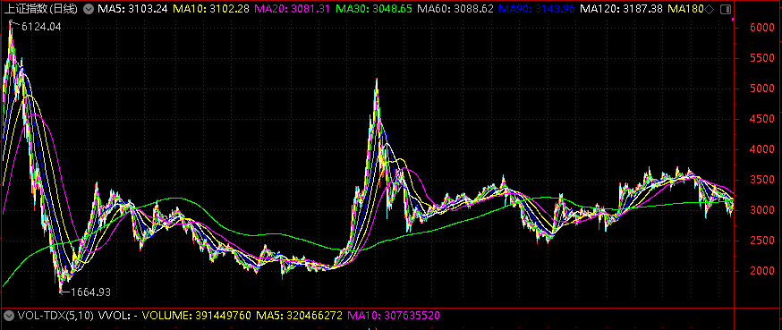

#估值量化
##一个基本的定投模型
 从本堂课开始，我们就要真正进入量化定投的探索之旅，由一个最基本最简单的定投模型开始，一课一课的深入，最终找到那个可以指导我们实际操作的量化定投模型。
###§1从一个定投案例说起
 我们先来看一个基金定投的真实案例。
 一位家住上海的王女士，每月投入2000元，分别定投4只基金，每次投入500元----自2011年中旬定投开始的5年时间里，王女士始终不改初心，无论A股如何涨跌起伏，王女士都没有任何赎回行动，其定投记录堪称教科书式的基金定投。
 交易单据显示，王女士选择定投4只基金，并选择银行申购，其分别定投了广发核心精选、兴全有机增长、农银汇理增长和嘉实沪深300，王女士表示“这4只基金也是我做基金定投时，搞理财的朋友推荐给我的”。 朋友推荐应该是很多人买基金的“原动力”， 尤其是在牛市中你正好有一个在银行工作的朋友。
 具体来看，广发核心精选的对账单显示，王女士对该基金的定投始于2011年5月，每月均投入500元，直到2016年3月，累计投资59次，共动用资金2.95万元，截止2016年3月17日，王女士持有该基金15,739.5份，当日该基金单位净值为2.467元，其账面总资产为38,829.35元，账面浮盈为9329.35元，定投收益率为31.62%。
 同期开始定投的还有兴全有机增长，该基金总计投入也是2.95万元，截止2016年3月17日，王女士持有该基金20592.55份，当日该基金单位净值为2.5151元，其账面总资产为57192.32元，账面浮盈为22292.32元，定投收益率为75.56%。
 之后的2011年9月，王女士的定投组合又加入了农银汇理增长和嘉实沪深300两支基金。其中农银汇理增长的定投总次数为55次，总计投入为2.75万元，截止2016年3月17日，王女士持有该基金18818.83份，当日该基金单位净值为1.959元，其账面总资产为36866.09元，账面浮盈为9366.09元，定投收益率为34.05%。
 嘉实沪深300的定投总次数为55次，总计投入为2.75万元，截止2016年3月17日，王女士持有该基金37086.69分，当日该基金单位净值为0.8644元，其账面总资产为32057.73元，账面浮盈为4557.73元，定投收益率为16.57%。
 综上可知，自广发核心精选开始，王女士历经近5年的定投，总投入119400元，截止2016年3月17日的账面总资产为164945.49元，账面浮盈为45545元，定投收益率为39.95%，同样由于未在2015年高点时卖出，这份近5年的宛如教科书般的定投，其收益最终只有40%。
###§2构建一个基本的定投模型
 目前普通的定投都是针对基金而言的，基金公司为了本公司的利益会主动联合银行等渠道，给客户提供便捷化的定投服务，客户只需准备好一张银行卡，并保证在扣款日当天卡内余额高于扣款额即可。扣款额的多少可以由客户在签约时自由认定，少则200/300元，多则上千上万元。
案例中的王女士为了分散风险，选择了4支风格不同的基金进行定投，每月每支定投500元，坚持五年，风雨无阻，这种定投更加类似于“强制储蓄”。 从收益看，王女士的定投收益远远跑赢同期银行存款收益，勉强也算达到了其投资理财的目的。
 那么普通基金定投就可以定义为：每月在固定的时间买入固定金额的某支基金，其买入逻辑判断过程如下图所示，这个判断客户不用操心，都由银行和基金公司替客户完成了。

 显而易见，这是一个非常简单的定投模型，在此我将这个模型命名为模型一，模型一虽然简单，但是已经可以具备一个完整的量化交易系统的雏形了，我们对模型一定义如下：
<table class="MsoTableGrid" border="1" cellspacing="0" cellpadding="0" style="border-collapse:collapse;border:none">
 <tbody><tr>
  <td width="568" colspan="2" valign="top" style="width:426.1pt;border:solid windowtext 1.0pt;
  padding:0cm 5.4pt 0cm 5.4pt">
  
&nbsp;&nbsp;&nbsp;&nbsp;&nbsp;&nbsp;&nbsp;&nbsp;&nbsp;&nbsp;&nbsp;&nbsp;&nbsp;&nbsp;&nbsp;&nbsp;&nbsp;&nbsp;&nbsp;&nbsp;&nbsp;&nbsp;&nbsp;&nbsp;&nbsp;
  模型一

  </td>
 </tr>
 <tr>
  <td width="73" valign="top" style="width:55.05pt;border:solid windowtext 1.0pt;
  border-top:none;padding:0cm 5.4pt 0cm 5.4pt">
  
买什么

  </td>
  <td width="495" valign="top" style="width:371.05pt;border-top:none;border-left:
  none;border-bottom:solid windowtext 1.0pt;border-right:solid windowtext 1.0pt;
  padding:0cm 5.4pt 0cm 5.4pt">
  
上证指数

  </td>
 </tr>
 <tr>
  <td width="73" valign="top" style="width:55.05pt;border:solid windowtext 1.0pt;
  border-top:none;padding:0cm 5.4pt 0cm 5.4pt">
  
怎么买

  </td>
  <td width="495" valign="top" style="width:371.05pt;border-top:none;border-left:
  none;border-bottom:solid windowtext 1.0pt;border-right:solid windowtext 1.0pt;
  padding:0cm 5.4pt 0cm 5.4pt">
  
每月最后一个交易日收盘价买入

  </td>
 </tr>
 <tr>
  <td width="73" valign="top" style="width:55.05pt;border:solid windowtext 1.0pt;
  border-top:none;padding:0cm 5.4pt 0cm 5.4pt">
  
买多少

  </td>
  <td width="495" valign="top" style="width:371.05pt;border-top:none;border-left:
  none;border-bottom:solid windowtext 1.0pt;border-right:solid windowtext 1.0pt;
  padding:0cm 5.4pt 0cm 5.4pt">
  
2000元

  </td>
 </tr>
 <tr>
  <td width="73" valign="top" style="width:55.05pt;border:solid windowtext 1.0pt;
  border-top:none;padding:0cm 5.4pt 0cm 5.4pt">
  
怎么卖

  </td>
  <td width="495" valign="top" style="width:371.05pt;border-top:none;border-left:
  none;border-bottom:solid windowtext 1.0pt;border-right:solid windowtext 1.0pt;
  padding:0cm 5.4pt 0cm 5.4pt">
  
无

  </td>
 </tr>
 <tr>
  <td width="73" valign="top" style="width:55.05pt;border:solid windowtext 1.0pt;
  border-top:none;padding:0cm 5.4pt 0cm 5.4pt">
  
卖多少

  </td>
  <td width="495" valign="top" style="width:371.05pt;border-top:none;border-left:
  none;border-bottom:solid windowtext 1.0pt;border-right:solid windowtext 1.0pt;
  padding:0cm 5.4pt 0cm 5.4pt">
  
无

  </td>
 </tr>
 <tr>
  <td width="73" valign="top" style="width:55.05pt;border:solid windowtext 1.0pt;
  border-top:none;padding:0cm 5.4pt 0cm 5.4pt">
  
测试时间

  </td>
  <td width="495" valign="top" style="width:371.05pt;border-top:none;border-left:
  none;border-bottom:solid windowtext 1.0pt;border-right:solid windowtext 1.0pt;
  padding:0cm 5.4pt 0cm 5.4pt">
  
2002.01.01-2016.12.30

  </td>
 </tr>
</tbody></table>

###§3对模型一的说明
 下面就模型一涉及的问题作如下说明
 1.为何选择上证指数做测试
 众所周知，我们A股主板有两大交易所，分别为上海证券交易所和深圳证券交易所，两大交易所的代表指数为上证指数和深证综指，下图为上证指数全历史走势图。

 下图为深圳综指的全历史走势图。

 从上述图形中我们不难看出，2008年后，代表了一部分中小上市公司的深圳综指走势远远强于上证指数，如果我们用深综指这种过去大涨的指数来作为模型的测试样本，那么就有可能使我们的模型无法经受住大跌，大熊市的考验。
 我们必须对我们所测试的模型提出更加苛刻的测试条件，如果能在上证指数上赚钱，那么深圳综指一定不在话下，就好像能在大海中游泳的人，放在游泳池中一定没有问题，反之则可能会被海浪淹死。这一点请读者深入思考，当然之后我们依然会对深综指等主流指数进行测试，以证明模型的有效性。
 2.测试时间为何是2002.01.01-2016.12.30
 如果说前面选择上证指数就像选定一个战场的话，那么测试时间段的选择就好比给模型选一个好的“对手”， 一个最能体现出模型价值的对手。定投是一个长期的理财计划，时间短了肯定测不出来好坏，选单纯的上涨行情或者下跌行情也不行。A股的历史上有四次牛市行情，分别为2000年，2007年，2015年，2019年，能从中看出点规律吗？
很难，所以我们的测试时间段起码要有10年以上的时间。仔细观察上证指数，以2002~2016年这15年作为测试时间段还是很合适的，2000年之前的股市由于当时各方面条件并不成熟，参考价值比较小。所以我们最终选择了2002~2016年这个时间段。
 3.为何每月只买2000元
 定投金额的确定就比较主观了。一般来说，定投金额是和个人经济状况挂钩的，存款多收入高，定投金额当然水涨船高，在实际定投中，大家可以根据自己的情况酌情而定。
 我们做模型测试，考察模型的优劣基本都是用比例和参数，比如绝对收益率，年化收益率等等，这些数字和定投的绝对金额没有关系，所以不管我们设定定投金额是2000元也好还是5000元也罢，并不会有差别。
之所以选择2000元这个数字是因为绝大多数人的定投金额和此比较接近，计算出的结果大家从直观上更好理解。为了更好的做对比分析，本书以后所有的模型，大概率将年定投金额设定在2万元至3万元之间。
###§4模型一的测试
 至此，我们终于搞定了模型一中的细节问题了，下面开始测试。测试的过程就是模拟真实的交易过程，每次交易后把我们关心的几个数据记录下来，比如买卖金额，持有数量，盈利金额等等，这样就会形成一个长长的数据表。下图即是模型一的测试数据。单位：元
<table class="MsoTableGrid" border="1" cellspacing="0" cellpadding="0" width="690" style="width:517.35pt;margin-left:-42.1pt;border-collapse:collapse;border:
 none">
 <tbody><tr style="height:27.0pt">
  <td width="80" nowrap="" valign="top" style="width:60.0pt;border:solid windowtext 1.0pt;
  padding:0cm 5.4pt 0cm 5.4pt;height:27.0pt">
  
<b>时间</b>

  </td>
  <td width="67" nowrap="" valign="top" style="width:50.6pt;border:solid windowtext 1.0pt;
  border-left:none;padding:0cm 5.4pt 0cm 5.4pt;height:27.0pt">
  
<b>上 </b><b>证</b>

  
<b>指 </b><b>数</b>

  </td>
  <td width="65" nowrap="" valign="top" style="width:48.85pt;border:solid windowtext 1.0pt;
  border-left:none;padding:0cm 5.4pt 0cm 5.4pt;height:27.0pt">
  
<b>买卖&nbsp;
  </b><b>金&nbsp;&nbsp;
  </b><b>额</b>

  </td>
  <td width="76" nowrap="" valign="top" style="width:2.0cm;border:solid windowtext 1.0pt;
  border-left:none;padding:0cm 5.4pt 0cm 5.4pt;height:27.0pt">
  
<b>买卖份额</b>

  </td>
  <td width="76" nowrap="" valign="top" style="width:2.0cm;border:solid windowtext 1.0pt;
  border-left:none;padding:0cm 5.4pt 0cm 5.4pt;height:27.0pt">
  
<b>持有份额</b>

  </td>
  <td width="76" nowrap="" valign="top" style="width:2.0cm;border:solid windowtext 1.0pt;
  border-left:none;padding:0cm 5.4pt 0cm 5.4pt;height:27.0pt">
  
<b>市值</b>

  </td>
  <td width="91" nowrap="" valign="top" style="width:67.9pt;border:solid windowtext 1.0pt;
  border-left:none;padding:0cm 5.4pt 0cm 5.4pt;height:27.0pt">
  
<b>累计投&nbsp;&nbsp; </b><b>入&nbsp; </b><b>资&nbsp; </b><b>金</b>

  </td>
  <td width="76" nowrap="" valign="top" style="width:2.0cm;border:solid windowtext 1.0pt;
  border-left:none;padding:0cm 5.4pt 0cm 5.4pt;height:27.0pt">
  
<b>总资产</b>

  </td>
  <td width="84" nowrap="" valign="top" style="width:63.2pt;border:solid windowtext 1.0pt;
  border-left:none;padding:0cm 5.4pt 0cm 5.4pt;height:27.0pt">
  
<b>盈利金额</b>

  </td>
 </tr>
 <tr style="height:14.1pt">
  <td width="80" nowrap="" valign="top" style="width:60.0pt;border:solid windowtext 1.0pt;
  border-top:none;padding:0cm 5.4pt 0cm 5.4pt;height:14.1pt">
  
2002-01-31

  </td>
  <td width="67" nowrap="" valign="top" style="width:50.6pt;border-top:none;
  border-left:none;border-bottom:solid windowtext 1.0pt;border-right:solid windowtext 1.0pt;
  padding:0cm 5.4pt 0cm 5.4pt;height:14.1pt">
  
1.49166

  </td>
  <td width="65" nowrap="" valign="top" style="width:48.85pt;border-top:none;
  border-left:none;border-bottom:solid windowtext 1.0pt;border-right:solid windowtext 1.0pt;
  padding:0cm 5.4pt 0cm 5.4pt;height:14.1pt">
  
2000.00 

  </td>
  <td width="76" nowrap="" valign="top" style="width:2.0cm;border-top:none;border-left:
  none;border-bottom:solid windowtext 1.0pt;border-right:solid windowtext 1.0pt;
  padding:0cm 5.4pt 0cm 5.4pt;height:14.1pt">
  
1340.79 

  </td>
  <td width="76" nowrap="" valign="top" style="width:2.0cm;border-top:none;border-left:
  none;border-bottom:solid windowtext 1.0pt;border-right:solid windowtext 1.0pt;
  padding:0cm 5.4pt 0cm 5.4pt;height:14.1pt">
  
1340.79 

  </td>
  <td width="76" nowrap="" valign="top" style="width:2.0cm;border-top:none;border-left:
  none;border-bottom:solid windowtext 1.0pt;border-right:solid windowtext 1.0pt;
  padding:0cm 5.4pt 0cm 5.4pt;height:14.1pt">
  
2000.00 

  </td>
  <td width="91" nowrap="" valign="top" style="width:67.9pt;border-top:none;
  border-left:none;border-bottom:solid windowtext 1.0pt;border-right:solid windowtext 1.0pt;
  padding:0cm 5.4pt 0cm 5.4pt;height:14.1pt">
  
2000.00 

  </td>
  <td width="76" nowrap="" valign="top" style="width:2.0cm;border-top:none;border-left:
  none;border-bottom:solid windowtext 1.0pt;border-right:solid windowtext 1.0pt;
  padding:0cm 5.4pt 0cm 5.4pt;height:14.1pt">
  
2000.00 

  </td>
  <td width="84" nowrap="" valign="top" style="width:63.2pt;border-top:none;
  border-left:none;border-bottom:solid windowtext 1.0pt;border-right:solid windowtext 1.0pt;
  padding:0cm 5.4pt 0cm 5.4pt;height:14.1pt">
  
0.00 

  </td>
 </tr>
 <tr style="height:14.1pt">
  <td width="80" nowrap="" valign="top" style="width:60.0pt;border:solid windowtext 1.0pt;
  border-top:none;padding:0cm 5.4pt 0cm 5.4pt;height:14.1pt">
  
2002-02-28

  </td>
  <td width="67" nowrap="" valign="top" style="width:50.6pt;border-top:none;
  border-left:none;border-bottom:solid windowtext 1.0pt;border-right:solid windowtext 1.0pt;
  padding:0cm 5.4pt 0cm 5.4pt;height:14.1pt">
  
1.52469

  </td>
  <td width="65" nowrap="" valign="top" style="width:48.85pt;border-top:none;
  border-left:none;border-bottom:solid windowtext 1.0pt;border-right:solid windowtext 1.0pt;
  padding:0cm 5.4pt 0cm 5.4pt;height:14.1pt">
  
2000.00 

  </td>
  <td width="76" nowrap="" valign="top" style="width:2.0cm;border-top:none;border-left:
  none;border-bottom:solid windowtext 1.0pt;border-right:solid windowtext 1.0pt;
  padding:0cm 5.4pt 0cm 5.4pt;height:14.1pt">
  
1311.74 

  </td>
  <td width="76" nowrap="" valign="top" style="width:2.0cm;border-top:none;border-left:
  none;border-bottom:solid windowtext 1.0pt;border-right:solid windowtext 1.0pt;
  padding:0cm 5.4pt 0cm 5.4pt;height:14.1pt">
  
2652.53 

  </td>
  <td width="76" nowrap="" valign="top" style="width:2.0cm;border-top:none;border-left:
  none;border-bottom:solid windowtext 1.0pt;border-right:solid windowtext 1.0pt;
  padding:0cm 5.4pt 0cm 5.4pt;height:14.1pt">
  
4044.29 

  </td>
  <td width="91" nowrap="" valign="top" style="width:67.9pt;border-top:none;
  border-left:none;border-bottom:solid windowtext 1.0pt;border-right:solid windowtext 1.0pt;
  padding:0cm 5.4pt 0cm 5.4pt;height:14.1pt">
  
4000.00 

  </td>
  <td width="76" nowrap="" valign="top" style="width:2.0cm;border-top:none;border-left:
  none;border-bottom:solid windowtext 1.0pt;border-right:solid windowtext 1.0pt;
  padding:0cm 5.4pt 0cm 5.4pt;height:14.1pt">
  
4044.29 

  </td>
  <td width="84" nowrap="" valign="top" style="width:63.2pt;border-top:none;
  border-left:none;border-bottom:solid windowtext 1.0pt;border-right:solid windowtext 1.0pt;
  padding:0cm 5.4pt 0cm 5.4pt;height:14.1pt">
  
44.29 

  </td>
 </tr>
 <tr style="height:14.1pt">
  <td width="80" nowrap="" valign="top" style="width:60.0pt;border:solid windowtext 1.0pt;
  border-top:none;padding:0cm 5.4pt 0cm 5.4pt;height:14.1pt">
  
2002-03-29

  </td>
  <td width="67" nowrap="" valign="top" style="width:50.6pt;border-top:none;
  border-left:none;border-bottom:solid windowtext 1.0pt;border-right:solid windowtext 1.0pt;
  padding:0cm 5.4pt 0cm 5.4pt;height:14.1pt">
  
1.6039

  </td>
  <td width="65" nowrap="" valign="top" style="width:48.85pt;border-top:none;
  border-left:none;border-bottom:solid windowtext 1.0pt;border-right:solid windowtext 1.0pt;
  padding:0cm 5.4pt 0cm 5.4pt;height:14.1pt">
  
2000.00 

  </td>
  <td width="76" nowrap="" valign="top" style="width:2.0cm;border-top:none;border-left:
  none;border-bottom:solid windowtext 1.0pt;border-right:solid windowtext 1.0pt;
  padding:0cm 5.4pt 0cm 5.4pt;height:14.1pt">
  
1246.96 

  </td>
  <td width="76" nowrap="" valign="top" style="width:2.0cm;border-top:none;border-left:
  none;border-bottom:solid windowtext 1.0pt;border-right:solid windowtext 1.0pt;
  padding:0cm 5.4pt 0cm 5.4pt;height:14.1pt">
  
3899.49 

  </td>
  <td width="76" nowrap="" valign="top" style="width:2.0cm;border-top:none;border-left:
  none;border-bottom:solid windowtext 1.0pt;border-right:solid windowtext 1.0pt;
  padding:0cm 5.4pt 0cm 5.4pt;height:14.1pt">
  
6254.39 

  </td>
  <td width="91" nowrap="" valign="top" style="width:67.9pt;border-top:none;
  border-left:none;border-bottom:solid windowtext 1.0pt;border-right:solid windowtext 1.0pt;
  padding:0cm 5.4pt 0cm 5.4pt;height:14.1pt">
  
6000.00 

  </td>
  <td width="76" nowrap="" valign="top" style="width:2.0cm;border-top:none;border-left:
  none;border-bottom:solid windowtext 1.0pt;border-right:solid windowtext 1.0pt;
  padding:0cm 5.4pt 0cm 5.4pt;height:14.1pt">
  
6254.39 

  </td>
  <td width="84" nowrap="" valign="top" style="width:63.2pt;border-top:none;
  border-left:none;border-bottom:solid windowtext 1.0pt;border-right:solid windowtext 1.0pt;
  padding:0cm 5.4pt 0cm 5.4pt;height:14.1pt">
  
254.39 

  </td>
 </tr>
 <tr style="height:14.1pt">
  <td width="80" nowrap="" valign="top" style="width:60.0pt;border:solid windowtext 1.0pt;
  border-top:none;padding:0cm 5.4pt 0cm 5.4pt;height:14.1pt">
  
2002-04-30

  </td>
  <td width="67" nowrap="" valign="top" style="width:50.6pt;border-top:none;
  border-left:none;border-bottom:solid windowtext 1.0pt;border-right:solid windowtext 1.0pt;
  padding:0cm 5.4pt 0cm 5.4pt;height:14.1pt">
  
1.66774

  </td>
  <td width="65" nowrap="" valign="top" style="width:48.85pt;border-top:none;
  border-left:none;border-bottom:solid windowtext 1.0pt;border-right:solid windowtext 1.0pt;
  padding:0cm 5.4pt 0cm 5.4pt;height:14.1pt">
  
2000.00 

  </td>
  <td width="76" nowrap="" valign="top" style="width:2.0cm;border-top:none;border-left:
  none;border-bottom:solid windowtext 1.0pt;border-right:solid windowtext 1.0pt;
  padding:0cm 5.4pt 0cm 5.4pt;height:14.1pt">
  
1199.23 

  </td>
  <td width="76" nowrap="" valign="top" style="width:2.0cm;border-top:none;border-left:
  none;border-bottom:solid windowtext 1.0pt;border-right:solid windowtext 1.0pt;
  padding:0cm 5.4pt 0cm 5.4pt;height:14.1pt">
  
5098.72 

  </td>
  <td width="76" nowrap="" valign="top" style="width:2.0cm;border-top:none;border-left:
  none;border-bottom:solid windowtext 1.0pt;border-right:solid windowtext 1.0pt;
  padding:0cm 5.4pt 0cm 5.4pt;height:14.1pt">
  
8503.34 

  </td>
  <td width="91" nowrap="" valign="top" style="width:67.9pt;border-top:none;
  border-left:none;border-bottom:solid windowtext 1.0pt;border-right:solid windowtext 1.0pt;
  padding:0cm 5.4pt 0cm 5.4pt;height:14.1pt">
  
8000.00 

  </td>
  <td width="76" nowrap="" valign="top" style="width:2.0cm;border-top:none;border-left:
  none;border-bottom:solid windowtext 1.0pt;border-right:solid windowtext 1.0pt;
  padding:0cm 5.4pt 0cm 5.4pt;height:14.1pt">
  
8503.34 

  </td>
  <td width="84" nowrap="" valign="top" style="width:63.2pt;border-top:none;
  border-left:none;border-bottom:solid windowtext 1.0pt;border-right:solid windowtext 1.0pt;
  padding:0cm 5.4pt 0cm 5.4pt;height:14.1pt">
  
503.34 

  </td>
 </tr>
 <tr style="height:14.1pt">
  <td width="80" nowrap="" valign="top" style="width:60.0pt;border:solid windowtext 1.0pt;
  border-top:none;padding:0cm 5.4pt 0cm 5.4pt;height:14.1pt">
  
2002-05-31

  </td>
  <td width="67" nowrap="" valign="top" style="width:50.6pt;border-top:none;
  border-left:none;border-bottom:solid windowtext 1.0pt;border-right:solid windowtext 1.0pt;
  padding:0cm 5.4pt 0cm 5.4pt;height:14.1pt">
  
1.51572

  </td>
  <td width="65" nowrap="" valign="top" style="width:48.85pt;border-top:none;
  border-left:none;border-bottom:solid windowtext 1.0pt;border-right:solid windowtext 1.0pt;
  padding:0cm 5.4pt 0cm 5.4pt;height:14.1pt">
  
2000.00 

  </td>
  <td width="76" nowrap="" valign="top" style="width:2.0cm;border-top:none;border-left:
  none;border-bottom:solid windowtext 1.0pt;border-right:solid windowtext 1.0pt;
  padding:0cm 5.4pt 0cm 5.4pt;height:14.1pt">
  
1319.50 

  </td>
  <td width="76" nowrap="" valign="top" style="width:2.0cm;border-top:none;border-left:
  none;border-bottom:solid windowtext 1.0pt;border-right:solid windowtext 1.0pt;
  padding:0cm 5.4pt 0cm 5.4pt;height:14.1pt">
  
6418.22 

  </td>
  <td width="76" nowrap="" valign="top" style="width:2.0cm;border-top:none;border-left:
  none;border-bottom:solid windowtext 1.0pt;border-right:solid windowtext 1.0pt;
  padding:0cm 5.4pt 0cm 5.4pt;height:14.1pt">
  
9728.23 

  </td>
  <td width="91" nowrap="" valign="top" style="width:67.9pt;border-top:none;
  border-left:none;border-bottom:solid windowtext 1.0pt;border-right:solid windowtext 1.0pt;
  padding:0cm 5.4pt 0cm 5.4pt;height:14.1pt">
  
10000.00 

  </td>
  <td width="76" nowrap="" valign="top" style="width:2.0cm;border-top:none;border-left:
  none;border-bottom:solid windowtext 1.0pt;border-right:solid windowtext 1.0pt;
  padding:0cm 5.4pt 0cm 5.4pt;height:14.1pt">
  
9728.23 

  </td>
  <td width="84" nowrap="" valign="top" style="width:63.2pt;border-top:none;
  border-left:none;border-bottom:solid windowtext 1.0pt;border-right:solid windowtext 1.0pt;
  padding:0cm 5.4pt 0cm 5.4pt;height:14.1pt">
  
-271.77 

  </td>
 </tr>
 <tr style="height:14.1pt">
  <td width="80" nowrap="" valign="top" style="width:60.0pt;border:solid windowtext 1.0pt;
  border-top:none;padding:0cm 5.4pt 0cm 5.4pt;height:14.1pt">
  
2002-06-28

  </td>
  <td width="67" nowrap="" valign="top" style="width:50.6pt;border-top:none;
  border-left:none;border-bottom:solid windowtext 1.0pt;border-right:solid windowtext 1.0pt;
  padding:0cm 5.4pt 0cm 5.4pt;height:14.1pt">
  
1.73275

  </td>
  <td width="65" nowrap="" valign="top" style="width:48.85pt;border-top:none;
  border-left:none;border-bottom:solid windowtext 1.0pt;border-right:solid windowtext 1.0pt;
  padding:0cm 5.4pt 0cm 5.4pt;height:14.1pt">
  
2000.00 

  </td>
  <td width="76" nowrap="" valign="top" style="width:2.0cm;border-top:none;border-left:
  none;border-bottom:solid windowtext 1.0pt;border-right:solid windowtext 1.0pt;
  padding:0cm 5.4pt 0cm 5.4pt;height:14.1pt">
  
1154.23 

  </td>
  <td width="76" nowrap="" valign="top" style="width:2.0cm;border-top:none;border-left:
  none;border-bottom:solid windowtext 1.0pt;border-right:solid windowtext 1.0pt;
  padding:0cm 5.4pt 0cm 5.4pt;height:14.1pt">
  
7572.46 

  </td>
  <td width="76" nowrap="" valign="top" style="width:2.0cm;border-top:none;border-left:
  none;border-bottom:solid windowtext 1.0pt;border-right:solid windowtext 1.0pt;
  padding:0cm 5.4pt 0cm 5.4pt;height:14.1pt">
  
13121.18 

  </td>
  <td width="91" nowrap="" valign="top" style="width:67.9pt;border-top:none;
  border-left:none;border-bottom:solid windowtext 1.0pt;border-right:solid windowtext 1.0pt;
  padding:0cm 5.4pt 0cm 5.4pt;height:14.1pt">
  
12000.00 

  </td>
  <td width="76" nowrap="" valign="top" style="width:2.0cm;border-top:none;border-left:
  none;border-bottom:solid windowtext 1.0pt;border-right:solid windowtext 1.0pt;
  padding:0cm 5.4pt 0cm 5.4pt;height:14.1pt">
  
13121.18 

  </td>
  <td width="84" nowrap="" valign="top" style="width:63.2pt;border-top:none;
  border-left:none;border-bottom:solid windowtext 1.0pt;border-right:solid windowtext 1.0pt;
  padding:0cm 5.4pt 0cm 5.4pt;height:14.1pt">
  
1121.18 

  </td>
 </tr>
 <tr style="height:14.1pt">
  <td width="80" nowrap="" valign="top" style="width:60.0pt;border:solid windowtext 1.0pt;
  border-top:none;padding:0cm 5.4pt 0cm 5.4pt;height:14.1pt">
  
2002-07-31

  </td>
  <td width="67" nowrap="" valign="top" style="width:50.6pt;border-top:none;
  border-left:none;border-bottom:solid windowtext 1.0pt;border-right:solid windowtext 1.0pt;
  padding:0cm 5.4pt 0cm 5.4pt;height:14.1pt">
  
1.65158

  </td>
  <td width="65" nowrap="" valign="top" style="width:48.85pt;border-top:none;
  border-left:none;border-bottom:solid windowtext 1.0pt;border-right:solid windowtext 1.0pt;
  padding:0cm 5.4pt 0cm 5.4pt;height:14.1pt">
  
2000.00 

  </td>
  <td width="76" nowrap="" valign="top" style="width:2.0cm;border-top:none;border-left:
  none;border-bottom:solid windowtext 1.0pt;border-right:solid windowtext 1.0pt;
  padding:0cm 5.4pt 0cm 5.4pt;height:14.1pt">
  
1210.96 

  </td>
  <td width="76" nowrap="" valign="top" style="width:2.0cm;border-top:none;border-left:
  none;border-bottom:solid windowtext 1.0pt;border-right:solid windowtext 1.0pt;
  padding:0cm 5.4pt 0cm 5.4pt;height:14.1pt">
  
8783.42 

  </td>
  <td width="76" nowrap="" valign="top" style="width:2.0cm;border-top:none;border-left:
  none;border-bottom:solid windowtext 1.0pt;border-right:solid windowtext 1.0pt;
  padding:0cm 5.4pt 0cm 5.4pt;height:14.1pt">
  
14506.52 

  </td>
  <td width="91" nowrap="" valign="top" style="width:67.9pt;border-top:none;
  border-left:none;border-bottom:solid windowtext 1.0pt;border-right:solid windowtext 1.0pt;
  padding:0cm 5.4pt 0cm 5.4pt;height:14.1pt">
  
14000.00 

  </td>
  <td width="76" nowrap="" valign="top" style="width:2.0cm;border-top:none;border-left:
  none;border-bottom:solid windowtext 1.0pt;border-right:solid windowtext 1.0pt;
  padding:0cm 5.4pt 0cm 5.4pt;height:14.1pt">
  
14506.52 

  </td>
  <td width="84" nowrap="" valign="top" style="width:63.2pt;border-top:none;
  border-left:none;border-bottom:solid windowtext 1.0pt;border-right:solid windowtext 1.0pt;
  padding:0cm 5.4pt 0cm 5.4pt;height:14.1pt">
  
506.52 

  </td>
 </tr>
 <tr style="height:14.1pt">
  <td width="80" nowrap="" valign="top" style="width:60.0pt;border:solid windowtext 1.0pt;
  border-top:none;padding:0cm 5.4pt 0cm 5.4pt;height:14.1pt">
  
2002-08-30

  </td>
  <td width="67" nowrap="" valign="top" style="width:50.6pt;border-top:none;
  border-left:none;border-bottom:solid windowtext 1.0pt;border-right:solid windowtext 1.0pt;
  padding:0cm 5.4pt 0cm 5.4pt;height:14.1pt">
  
1.66661

  </td>
  <td width="65" nowrap="" valign="top" style="width:48.85pt;border-top:none;
  border-left:none;border-bottom:solid windowtext 1.0pt;border-right:solid windowtext 1.0pt;
  padding:0cm 5.4pt 0cm 5.4pt;height:14.1pt">
  
2000.00 

  </td>
  <td width="76" nowrap="" valign="top" style="width:2.0cm;border-top:none;border-left:
  none;border-bottom:solid windowtext 1.0pt;border-right:solid windowtext 1.0pt;
  padding:0cm 5.4pt 0cm 5.4pt;height:14.1pt">
  
1200.04 

  </td>
  <td width="76" nowrap="" valign="top" style="width:2.0cm;border-top:none;border-left:
  none;border-bottom:solid windowtext 1.0pt;border-right:solid windowtext 1.0pt;
  padding:0cm 5.4pt 0cm 5.4pt;height:14.1pt">
  
9983.46 

  </td>
  <td width="76" nowrap="" valign="top" style="width:2.0cm;border-top:none;border-left:
  none;border-bottom:solid windowtext 1.0pt;border-right:solid windowtext 1.0pt;
  padding:0cm 5.4pt 0cm 5.4pt;height:14.1pt">
  
16638.53 

  </td>
  <td width="91" nowrap="" valign="top" style="width:67.9pt;border-top:none;
  border-left:none;border-bottom:solid windowtext 1.0pt;border-right:solid windowtext 1.0pt;
  padding:0cm 5.4pt 0cm 5.4pt;height:14.1pt">
  
16000.00 

  </td>
  <td width="76" nowrap="" valign="top" style="width:2.0cm;border-top:none;border-left:
  none;border-bottom:solid windowtext 1.0pt;border-right:solid windowtext 1.0pt;
  padding:0cm 5.4pt 0cm 5.4pt;height:14.1pt">
  
16638.53 

  </td>
  <td width="84" nowrap="" valign="top" style="width:63.2pt;border-top:none;
  border-left:none;border-bottom:solid windowtext 1.0pt;border-right:solid windowtext 1.0pt;
  padding:0cm 5.4pt 0cm 5.4pt;height:14.1pt">
  
638.53 

  </td>
 </tr>
 <tr style="height:14.1pt">
  <td width="80" nowrap="" valign="top" style="width:60.0pt;border:solid windowtext 1.0pt;
  border-top:none;padding:0cm 5.4pt 0cm 5.4pt;height:14.1pt">
  
2002-09-27

  </td>
  <td width="67" nowrap="" valign="top" style="width:50.6pt;border-top:none;
  border-left:none;border-bottom:solid windowtext 1.0pt;border-right:solid windowtext 1.0pt;
  padding:0cm 5.4pt 0cm 5.4pt;height:14.1pt">
  
1.58161

  </td>
  <td width="65" nowrap="" valign="top" style="width:48.85pt;border-top:none;
  border-left:none;border-bottom:solid windowtext 1.0pt;border-right:solid windowtext 1.0pt;
  padding:0cm 5.4pt 0cm 5.4pt;height:14.1pt">
  
2000.00 

  </td>
  <td width="76" nowrap="" valign="top" style="width:2.0cm;border-top:none;border-left:
  none;border-bottom:solid windowtext 1.0pt;border-right:solid windowtext 1.0pt;
  padding:0cm 5.4pt 0cm 5.4pt;height:14.1pt">
  
1264.53 

  </td>
  <td width="76" nowrap="" valign="top" style="width:2.0cm;border-top:none;border-left:
  none;border-bottom:solid windowtext 1.0pt;border-right:solid windowtext 1.0pt;
  padding:0cm 5.4pt 0cm 5.4pt;height:14.1pt">
  
11247.99 

  </td>
  <td width="76" nowrap="" valign="top" style="width:2.0cm;border-top:none;border-left:
  none;border-bottom:solid windowtext 1.0pt;border-right:solid windowtext 1.0pt;
  padding:0cm 5.4pt 0cm 5.4pt;height:14.1pt">
  
17789.94 

  </td>
  <td width="91" nowrap="" valign="top" style="width:67.9pt;border-top:none;
  border-left:none;border-bottom:solid windowtext 1.0pt;border-right:solid windowtext 1.0pt;
  padding:0cm 5.4pt 0cm 5.4pt;height:14.1pt">
  
18000.00 

  </td>
  <td width="76" nowrap="" valign="top" style="width:2.0cm;border-top:none;border-left:
  none;border-bottom:solid windowtext 1.0pt;border-right:solid windowtext 1.0pt;
  padding:0cm 5.4pt 0cm 5.4pt;height:14.1pt">
  
17789.94 

  </td>
  <td width="84" nowrap="" valign="top" style="width:63.2pt;border-top:none;
  border-left:none;border-bottom:solid windowtext 1.0pt;border-right:solid windowtext 1.0pt;
  padding:0cm 5.4pt 0cm 5.4pt;height:14.1pt">
  
-210.06 

  </td>
 </tr>
 <tr style="height:14.1pt">
  <td width="80" nowrap="" valign="top" style="width:60.0pt;border:solid windowtext 1.0pt;
  border-top:none;padding:0cm 5.4pt 0cm 5.4pt;height:14.1pt">
  
2002-10-31

  </td>
  <td width="67" nowrap="" valign="top" style="width:50.6pt;border-top:none;
  border-left:none;border-bottom:solid windowtext 1.0pt;border-right:solid windowtext 1.0pt;
  padding:0cm 5.4pt 0cm 5.4pt;height:14.1pt">
  
1.50749

  </td>
  <td width="65" nowrap="" valign="top" style="width:48.85pt;border-top:none;
  border-left:none;border-bottom:solid windowtext 1.0pt;border-right:solid windowtext 1.0pt;
  padding:0cm 5.4pt 0cm 5.4pt;height:14.1pt">
  
2000.00 

  </td>
  <td width="76" nowrap="" valign="top" style="width:2.0cm;border-top:none;border-left:
  none;border-bottom:solid windowtext 1.0pt;border-right:solid windowtext 1.0pt;
  padding:0cm 5.4pt 0cm 5.4pt;height:14.1pt">
  
1326.71 

  </td>
  <td width="76" nowrap="" valign="top" style="width:2.0cm;border-top:none;border-left:
  none;border-bottom:solid windowtext 1.0pt;border-right:solid windowtext 1.0pt;
  padding:0cm 5.4pt 0cm 5.4pt;height:14.1pt">
  
12574.70 

  </td>
  <td width="76" nowrap="" valign="top" style="width:2.0cm;border-top:none;border-left:
  none;border-bottom:solid windowtext 1.0pt;border-right:solid windowtext 1.0pt;
  padding:0cm 5.4pt 0cm 5.4pt;height:14.1pt">
  
18956.24 

  </td>
  <td width="91" nowrap="" valign="top" style="width:67.9pt;border-top:none;
  border-left:none;border-bottom:solid windowtext 1.0pt;border-right:solid windowtext 1.0pt;
  padding:0cm 5.4pt 0cm 5.4pt;height:14.1pt">
  
20000.00 

  </td>
  <td width="76" nowrap="" valign="top" style="width:2.0cm;border-top:none;border-left:
  none;border-bottom:solid windowtext 1.0pt;border-right:solid windowtext 1.0pt;
  padding:0cm 5.4pt 0cm 5.4pt;height:14.1pt">
  
18956.24 

  </td>
  <td width="84" nowrap="" valign="top" style="width:63.2pt;border-top:none;
  border-left:none;border-bottom:solid windowtext 1.0pt;border-right:solid windowtext 1.0pt;
  padding:0cm 5.4pt 0cm 5.4pt;height:14.1pt">
  
-1043.76 

  </td>
 </tr>
 <tr style="height:14.1pt">
  <td width="80" nowrap="" valign="top" style="width:60.0pt;border:solid windowtext 1.0pt;
  border-top:none;padding:0cm 5.4pt 0cm 5.4pt;height:14.1pt">
  
2002-11-29

  </td>
  <td width="67" nowrap="" valign="top" style="width:50.6pt;border-top:none;
  border-left:none;border-bottom:solid windowtext 1.0pt;border-right:solid windowtext 1.0pt;
  padding:0cm 5.4pt 0cm 5.4pt;height:14.1pt">
  
1.43417

  </td>
  <td width="65" nowrap="" valign="top" style="width:48.85pt;border-top:none;
  border-left:none;border-bottom:solid windowtext 1.0pt;border-right:solid windowtext 1.0pt;
  padding:0cm 5.4pt 0cm 5.4pt;height:14.1pt">
  
2000.00 

  </td>
  <td width="76" nowrap="" valign="top" style="width:2.0cm;border-top:none;border-left:
  none;border-bottom:solid windowtext 1.0pt;border-right:solid windowtext 1.0pt;
  padding:0cm 5.4pt 0cm 5.4pt;height:14.1pt">
  
1394.53 

  </td>
  <td width="76" nowrap="" valign="top" style="width:2.0cm;border-top:none;border-left:
  none;border-bottom:solid windowtext 1.0pt;border-right:solid windowtext 1.0pt;
  padding:0cm 5.4pt 0cm 5.4pt;height:14.1pt">
  
13969.24 

  </td>
  <td width="76" nowrap="" valign="top" style="width:2.0cm;border-top:none;border-left:
  none;border-bottom:solid windowtext 1.0pt;border-right:solid windowtext 1.0pt;
  padding:0cm 5.4pt 0cm 5.4pt;height:14.1pt">
  
20034.26 

  </td>
  <td width="91" nowrap="" valign="top" style="width:67.9pt;border-top:none;
  border-left:none;border-bottom:solid windowtext 1.0pt;border-right:solid windowtext 1.0pt;
  padding:0cm 5.4pt 0cm 5.4pt;height:14.1pt">
  
22000.00 

  </td>
  <td width="76" nowrap="" valign="top" style="width:2.0cm;border-top:none;border-left:
  none;border-bottom:solid windowtext 1.0pt;border-right:solid windowtext 1.0pt;
  padding:0cm 5.4pt 0cm 5.4pt;height:14.1pt">
  
20034.26 

  </td>
  <td width="84" nowrap="" valign="top" style="width:63.2pt;border-top:none;
  border-left:none;border-bottom:solid windowtext 1.0pt;border-right:solid windowtext 1.0pt;
  padding:0cm 5.4pt 0cm 5.4pt;height:14.1pt">
  
-1965.74 

  </td>
 </tr>
 <tr style="height:14.1pt">
  <td width="80" nowrap="" valign="top" style="width:60.0pt;border:solid windowtext 1.0pt;
  border-top:none;padding:0cm 5.4pt 0cm 5.4pt;height:14.1pt">
  
2002-12-31

  </td>
  <td width="67" nowrap="" valign="top" style="width:50.6pt;border-top:none;
  border-left:none;border-bottom:solid windowtext 1.0pt;border-right:solid windowtext 1.0pt;
  padding:0cm 5.4pt 0cm 5.4pt;height:14.1pt">
  
1.35765

  </td>
  <td width="65" nowrap="" valign="top" style="width:48.85pt;border-top:none;
  border-left:none;border-bottom:solid windowtext 1.0pt;border-right:solid windowtext 1.0pt;
  padding:0cm 5.4pt 0cm 5.4pt;height:14.1pt">
  
2000.00 

  </td>
  <td width="76" nowrap="" valign="top" style="width:2.0cm;border-top:none;border-left:
  none;border-bottom:solid windowtext 1.0pt;border-right:solid windowtext 1.0pt;
  padding:0cm 5.4pt 0cm 5.4pt;height:14.1pt">
  
1473.13 

  </td>
  <td width="76" nowrap="" valign="top" style="width:2.0cm;border-top:none;border-left:
  none;border-bottom:solid windowtext 1.0pt;border-right:solid windowtext 1.0pt;
  padding:0cm 5.4pt 0cm 5.4pt;height:14.1pt">
  
15442.37 

  </td>
  <td width="76" nowrap="" valign="top" style="width:2.0cm;border-top:none;border-left:
  none;border-bottom:solid windowtext 1.0pt;border-right:solid windowtext 1.0pt;
  padding:0cm 5.4pt 0cm 5.4pt;height:14.1pt">
  
20965.34 

  </td>
  <td width="91" nowrap="" valign="top" style="width:67.9pt;border-top:none;
  border-left:none;border-bottom:solid windowtext 1.0pt;border-right:solid windowtext 1.0pt;
  padding:0cm 5.4pt 0cm 5.4pt;height:14.1pt">
  
24000.00 

  </td>
  <td width="76" nowrap="" valign="top" style="width:2.0cm;border-top:none;border-left:
  none;border-bottom:solid windowtext 1.0pt;border-right:solid windowtext 1.0pt;
  padding:0cm 5.4pt 0cm 5.4pt;height:14.1pt">
  
20965.34 

  </td>
  <td width="84" nowrap="" valign="top" style="width:63.2pt;border-top:none;
  border-left:none;border-bottom:solid windowtext 1.0pt;border-right:solid windowtext 1.0pt;
  padding:0cm 5.4pt 0cm 5.4pt;height:14.1pt">
  
-3034.66 

  </td>
 </tr>
 <tr style="height:14.1pt">
  <td width="80" nowrap="" valign="top" style="width:60.0pt;border:solid windowtext 1.0pt;
  border-top:none;padding:0cm 5.4pt 0cm 5.4pt;height:14.1pt">
  
2003-01-29

  </td>
  <td width="67" nowrap="" valign="top" style="width:50.6pt;border-top:none;
  border-left:none;border-bottom:solid windowtext 1.0pt;border-right:solid windowtext 1.0pt;
  padding:0cm 5.4pt 0cm 5.4pt;height:14.1pt">
  
1.4998

  </td>
  <td width="65" nowrap="" valign="top" style="width:48.85pt;border-top:none;
  border-left:none;border-bottom:solid windowtext 1.0pt;border-right:solid windowtext 1.0pt;
  padding:0cm 5.4pt 0cm 5.4pt;height:14.1pt">
  
2000.00 

  </td>
  <td width="76" nowrap="" valign="top" style="width:2.0cm;border-top:none;border-left:
  none;border-bottom:solid windowtext 1.0pt;border-right:solid windowtext 1.0pt;
  padding:0cm 5.4pt 0cm 5.4pt;height:14.1pt">
  
1333.51 

  </td>
  <td width="76" nowrap="" valign="top" style="width:2.0cm;border-top:none;border-left:
  none;border-bottom:solid windowtext 1.0pt;border-right:solid windowtext 1.0pt;
  padding:0cm 5.4pt 0cm 5.4pt;height:14.1pt">
  
16775.88 

  </td>
  <td width="76" nowrap="" valign="top" style="width:2.0cm;border-top:none;border-left:
  none;border-bottom:solid windowtext 1.0pt;border-right:solid windowtext 1.0pt;
  padding:0cm 5.4pt 0cm 5.4pt;height:14.1pt">
  
25160.47 

  </td>
  <td width="91" nowrap="" valign="top" style="width:67.9pt;border-top:none;
  border-left:none;border-bottom:solid windowtext 1.0pt;border-right:solid windowtext 1.0pt;
  padding:0cm 5.4pt 0cm 5.4pt;height:14.1pt">
  
26000.00 

  </td>
  <td width="76" nowrap="" valign="top" style="width:2.0cm;border-top:none;border-left:
  none;border-bottom:solid windowtext 1.0pt;border-right:solid windowtext 1.0pt;
  padding:0cm 5.4pt 0cm 5.4pt;height:14.1pt">
  
25160.47 

  </td>
  <td width="84" nowrap="" valign="top" style="width:63.2pt;border-top:none;
  border-left:none;border-bottom:solid windowtext 1.0pt;border-right:solid windowtext 1.0pt;
  padding:0cm 5.4pt 0cm 5.4pt;height:14.1pt">
  
-839.53 

  </td>
 </tr>
 <tr style="height:14.1pt">
  <td width="80" nowrap="" valign="top" style="width:60.0pt;border:solid windowtext 1.0pt;
  border-top:none;padding:0cm 5.4pt 0cm 5.4pt;height:14.1pt">
  
2003-02-28

  </td>
  <td width="67" nowrap="" valign="top" style="width:50.6pt;border-top:none;
  border-left:none;border-bottom:solid windowtext 1.0pt;border-right:solid windowtext 1.0pt;
  padding:0cm 5.4pt 0cm 5.4pt;height:14.1pt">
  
1.51193

  </td>
  <td width="65" nowrap="" valign="top" style="width:48.85pt;border-top:none;
  border-left:none;border-bottom:solid windowtext 1.0pt;border-right:solid windowtext 1.0pt;
  padding:0cm 5.4pt 0cm 5.4pt;height:14.1pt">
  
2000.00 

  </td>
  <td width="76" nowrap="" valign="top" style="width:2.0cm;border-top:none;border-left:
  none;border-bottom:solid windowtext 1.0pt;border-right:solid windowtext 1.0pt;
  padding:0cm 5.4pt 0cm 5.4pt;height:14.1pt">
  
1322.81 

  </td>
  <td width="76" nowrap="" valign="top" style="width:2.0cm;border-top:none;border-left:
  none;border-bottom:solid windowtext 1.0pt;border-right:solid windowtext 1.0pt;
  padding:0cm 5.4pt 0cm 5.4pt;height:14.1pt">
  
18098.70 

  </td>
  <td width="76" nowrap="" valign="top" style="width:2.0cm;border-top:none;border-left:
  none;border-bottom:solid windowtext 1.0pt;border-right:solid windowtext 1.0pt;
  padding:0cm 5.4pt 0cm 5.4pt;height:14.1pt">
  
27363.96 

  </td>
  <td width="91" nowrap="" valign="top" style="width:67.9pt;border-top:none;
  border-left:none;border-bottom:solid windowtext 1.0pt;border-right:solid windowtext 1.0pt;
  padding:0cm 5.4pt 0cm 5.4pt;height:14.1pt">
  
28000.00 

  </td>
  <td width="76" nowrap="" valign="top" style="width:2.0cm;border-top:none;border-left:
  none;border-bottom:solid windowtext 1.0pt;border-right:solid windowtext 1.0pt;
  padding:0cm 5.4pt 0cm 5.4pt;height:14.1pt">
  
27363.96 

  </td>
  <td width="84" nowrap="" valign="top" style="width:63.2pt;border-top:none;
  border-left:none;border-bottom:solid windowtext 1.0pt;border-right:solid windowtext 1.0pt;
  padding:0cm 5.4pt 0cm 5.4pt;height:14.1pt">
  
-636.04 

  </td>
 </tr>
 <tr style="height:14.1pt">
  <td width="80" nowrap="" valign="top" style="width:60.0pt;border:solid windowtext 1.0pt;
  border-top:none;padding:0cm 5.4pt 0cm 5.4pt;height:14.1pt">
  
2003-03-31

  </td>
  <td width="67" nowrap="" valign="top" style="width:50.6pt;border-top:none;
  border-left:none;border-bottom:solid windowtext 1.0pt;border-right:solid windowtext 1.0pt;
  padding:0cm 5.4pt 0cm 5.4pt;height:14.1pt">
  
1.51058

  </td>
  <td width="65" nowrap="" valign="top" style="width:48.85pt;border-top:none;
  border-left:none;border-bottom:solid windowtext 1.0pt;border-right:solid windowtext 1.0pt;
  padding:0cm 5.4pt 0cm 5.4pt;height:14.1pt">
  
2000.00 

  </td>
  <td width="76" nowrap="" valign="top" style="width:2.0cm;border-top:none;border-left:
  none;border-bottom:solid windowtext 1.0pt;border-right:solid windowtext 1.0pt;
  padding:0cm 5.4pt 0cm 5.4pt;height:14.1pt">
  
1323.99 

  </td>
  <td width="76" nowrap="" valign="top" style="width:2.0cm;border-top:none;border-left:
  none;border-bottom:solid windowtext 1.0pt;border-right:solid windowtext 1.0pt;
  padding:0cm 5.4pt 0cm 5.4pt;height:14.1pt">
  
19422.69 

  </td>
  <td width="76" nowrap="" valign="top" style="width:2.0cm;border-top:none;border-left:
  none;border-bottom:solid windowtext 1.0pt;border-right:solid windowtext 1.0pt;
  padding:0cm 5.4pt 0cm 5.4pt;height:14.1pt">
  
29339.53 

  </td>
  <td width="91" nowrap="" valign="top" style="width:67.9pt;border-top:none;
  border-left:none;border-bottom:solid windowtext 1.0pt;border-right:solid windowtext 1.0pt;
  padding:0cm 5.4pt 0cm 5.4pt;height:14.1pt">
  
30000.00 

  </td>
  <td width="76" nowrap="" valign="top" style="width:2.0cm;border-top:none;border-left:
  none;border-bottom:solid windowtext 1.0pt;border-right:solid windowtext 1.0pt;
  padding:0cm 5.4pt 0cm 5.4pt;height:14.1pt">
  
29339.53 

  </td>
  <td width="84" nowrap="" valign="top" style="width:63.2pt;border-top:none;
  border-left:none;border-bottom:solid windowtext 1.0pt;border-right:solid windowtext 1.0pt;
  padding:0cm 5.4pt 0cm 5.4pt;height:14.1pt">
  
-660.47 

  </td>
 </tr>
 <tr style="height:14.1pt">
  <td width="80" nowrap="" valign="top" style="width:60.0pt;border:solid windowtext 1.0pt;
  border-top:none;padding:0cm 5.4pt 0cm 5.4pt;height:14.1pt">
  
2003-04-30

  </td>
  <td width="67" nowrap="" valign="top" style="width:50.6pt;border-top:none;
  border-left:none;border-bottom:solid windowtext 1.0pt;border-right:solid windowtext 1.0pt;
  padding:0cm 5.4pt 0cm 5.4pt;height:14.1pt">
  
1.52144

  </td>
  <td width="65" nowrap="" valign="top" style="width:48.85pt;border-top:none;
  border-left:none;border-bottom:solid windowtext 1.0pt;border-right:solid windowtext 1.0pt;
  padding:0cm 5.4pt 0cm 5.4pt;height:14.1pt">
  
2000.00 

  </td>
  <td width="76" nowrap="" valign="top" style="width:2.0cm;border-top:none;border-left:
  none;border-bottom:solid windowtext 1.0pt;border-right:solid windowtext 1.0pt;
  padding:0cm 5.4pt 0cm 5.4pt;height:14.1pt">
  
1314.54 

  </td>
  <td width="76" nowrap="" valign="top" style="width:2.0cm;border-top:none;border-left:
  none;border-bottom:solid windowtext 1.0pt;border-right:solid windowtext 1.0pt;
  padding:0cm 5.4pt 0cm 5.4pt;height:14.1pt">
  
20737.23 

  </td>
  <td width="76" nowrap="" valign="top" style="width:2.0cm;border-top:none;border-left:
  none;border-bottom:solid windowtext 1.0pt;border-right:solid windowtext 1.0pt;
  padding:0cm 5.4pt 0cm 5.4pt;height:14.1pt">
  
31550.46 

  </td>
  <td width="91" nowrap="" valign="top" style="width:67.9pt;border-top:none;
  border-left:none;border-bottom:solid windowtext 1.0pt;border-right:solid windowtext 1.0pt;
  padding:0cm 5.4pt 0cm 5.4pt;height:14.1pt">
  
32000.00 

  </td>
  <td width="76" nowrap="" valign="top" style="width:2.0cm;border-top:none;border-left:
  none;border-bottom:solid windowtext 1.0pt;border-right:solid windowtext 1.0pt;
  padding:0cm 5.4pt 0cm 5.4pt;height:14.1pt">
  
31550.46 

  </td>
  <td width="84" nowrap="" valign="top" style="width:63.2pt;border-top:none;
  border-left:none;border-bottom:solid windowtext 1.0pt;border-right:solid windowtext 1.0pt;
  padding:0cm 5.4pt 0cm 5.4pt;height:14.1pt">
  
-449.54 

  </td>
 </tr>
 <tr style="height:14.1pt">
  <td width="80" nowrap="" valign="top" style="width:60.0pt;border:solid windowtext 1.0pt;
  border-top:none;padding:0cm 5.4pt 0cm 5.4pt;height:14.1pt">
  
2003-05-30

  </td>
  <td width="67" nowrap="" valign="top" style="width:50.6pt;border-top:none;
  border-left:none;border-bottom:solid windowtext 1.0pt;border-right:solid windowtext 1.0pt;
  padding:0cm 5.4pt 0cm 5.4pt;height:14.1pt">
  
1.57626

  </td>
  <td width="65" nowrap="" valign="top" style="width:48.85pt;border-top:none;
  border-left:none;border-bottom:solid windowtext 1.0pt;border-right:solid windowtext 1.0pt;
  padding:0cm 5.4pt 0cm 5.4pt;height:14.1pt">
  
2000.00 

  </td>
  <td width="76" nowrap="" valign="top" style="width:2.0cm;border-top:none;border-left:
  none;border-bottom:solid windowtext 1.0pt;border-right:solid windowtext 1.0pt;
  padding:0cm 5.4pt 0cm 5.4pt;height:14.1pt">
  
1268.83 

  </td>
  <td width="76" nowrap="" valign="top" style="width:2.0cm;border-top:none;border-left:
  none;border-bottom:solid windowtext 1.0pt;border-right:solid windowtext 1.0pt;
  padding:0cm 5.4pt 0cm 5.4pt;height:14.1pt">
  
22006.06 

  </td>
  <td width="76" nowrap="" valign="top" style="width:2.0cm;border-top:none;border-left:
  none;border-bottom:solid windowtext 1.0pt;border-right:solid windowtext 1.0pt;
  padding:0cm 5.4pt 0cm 5.4pt;height:14.1pt">
  
34687.27 

  </td>
  <td width="91" nowrap="" valign="top" style="width:67.9pt;border-top:none;
  border-left:none;border-bottom:solid windowtext 1.0pt;border-right:solid windowtext 1.0pt;
  padding:0cm 5.4pt 0cm 5.4pt;height:14.1pt">
  
34000.00 

  </td>
  <td width="76" nowrap="" valign="top" style="width:2.0cm;border-top:none;border-left:
  none;border-bottom:solid windowtext 1.0pt;border-right:solid windowtext 1.0pt;
  padding:0cm 5.4pt 0cm 5.4pt;height:14.1pt">
  
34687.27 

  </td>
  <td width="84" nowrap="" valign="top" style="width:63.2pt;border-top:none;
  border-left:none;border-bottom:solid windowtext 1.0pt;border-right:solid windowtext 1.0pt;
  padding:0cm 5.4pt 0cm 5.4pt;height:14.1pt">
  
687.27 

  </td>
 </tr>
 <tr style="height:14.1pt">
  <td width="80" nowrap="" valign="top" style="width:60.0pt;border:solid windowtext 1.0pt;
  border-top:none;padding:0cm 5.4pt 0cm 5.4pt;height:14.1pt">
  
2003-06-30

  </td>
  <td width="67" nowrap="" valign="top" style="width:50.6pt;border-top:none;
  border-left:none;border-bottom:solid windowtext 1.0pt;border-right:solid windowtext 1.0pt;
  padding:0cm 5.4pt 0cm 5.4pt;height:14.1pt">
  
1.48602

  </td>
  <td width="65" nowrap="" valign="top" style="width:48.85pt;border-top:none;
  border-left:none;border-bottom:solid windowtext 1.0pt;border-right:solid windowtext 1.0pt;
  padding:0cm 5.4pt 0cm 5.4pt;height:14.1pt">
  
2000.00 

  </td>
  <td width="76" nowrap="" valign="top" style="width:2.0cm;border-top:none;border-left:
  none;border-bottom:solid windowtext 1.0pt;border-right:solid windowtext 1.0pt;
  padding:0cm 5.4pt 0cm 5.4pt;height:14.1pt">
  
1345.88 

  </td>
  <td width="76" nowrap="" valign="top" style="width:2.0cm;border-top:none;border-left:
  none;border-bottom:solid windowtext 1.0pt;border-right:solid windowtext 1.0pt;
  padding:0cm 5.4pt 0cm 5.4pt;height:14.1pt">
  
23351.94 

  </td>
  <td width="76" nowrap="" valign="top" style="width:2.0cm;border-top:none;border-left:
  none;border-bottom:solid windowtext 1.0pt;border-right:solid windowtext 1.0pt;
  padding:0cm 5.4pt 0cm 5.4pt;height:14.1pt">
  
34701.45 

  </td>
  <td width="91" nowrap="" valign="top" style="width:67.9pt;border-top:none;
  border-left:none;border-bottom:solid windowtext 1.0pt;border-right:solid windowtext 1.0pt;
  padding:0cm 5.4pt 0cm 5.4pt;height:14.1pt">
  
36000.00 

  </td>
  <td width="76" nowrap="" valign="top" style="width:2.0cm;border-top:none;border-left:
  none;border-bottom:solid windowtext 1.0pt;border-right:solid windowtext 1.0pt;
  padding:0cm 5.4pt 0cm 5.4pt;height:14.1pt">
  
34701.45 

  </td>
  <td width="84" nowrap="" valign="top" style="width:63.2pt;border-top:none;
  border-left:none;border-bottom:solid windowtext 1.0pt;border-right:solid windowtext 1.0pt;
  padding:0cm 5.4pt 0cm 5.4pt;height:14.1pt">
  
-1298.55 

  </td>
 </tr>
 <tr style="height:14.1pt">
  <td width="80" nowrap="" valign="top" style="width:60.0pt;border:solid windowtext 1.0pt;
  border-top:none;padding:0cm 5.4pt 0cm 5.4pt;height:14.1pt">
  
2003-07-31

  </td>
  <td width="67" nowrap="" valign="top" style="width:50.6pt;border-top:none;
  border-left:none;border-bottom:solid windowtext 1.0pt;border-right:solid windowtext 1.0pt;
  padding:0cm 5.4pt 0cm 5.4pt;height:14.1pt">
  
1.47674

  </td>
  <td width="65" nowrap="" valign="top" style="width:48.85pt;border-top:none;
  border-left:none;border-bottom:solid windowtext 1.0pt;border-right:solid windowtext 1.0pt;
  padding:0cm 5.4pt 0cm 5.4pt;height:14.1pt">
  
2000.00 

  </td>
  <td width="76" nowrap="" valign="top" style="width:2.0cm;border-top:none;border-left:
  none;border-bottom:solid windowtext 1.0pt;border-right:solid windowtext 1.0pt;
  padding:0cm 5.4pt 0cm 5.4pt;height:14.1pt">
  
1354.33 

  </td>
  <td width="76" nowrap="" valign="top" style="width:2.0cm;border-top:none;border-left:
  none;border-bottom:solid windowtext 1.0pt;border-right:solid windowtext 1.0pt;
  padding:0cm 5.4pt 0cm 5.4pt;height:14.1pt">
  
24706.27 

  </td>
  <td width="76" nowrap="" valign="top" style="width:2.0cm;border-top:none;border-left:
  none;border-bottom:solid windowtext 1.0pt;border-right:solid windowtext 1.0pt;
  padding:0cm 5.4pt 0cm 5.4pt;height:14.1pt">
  
36484.74 

  </td>
  <td width="91" nowrap="" valign="top" style="width:67.9pt;border-top:none;
  border-left:none;border-bottom:solid windowtext 1.0pt;border-right:solid windowtext 1.0pt;
  padding:0cm 5.4pt 0cm 5.4pt;height:14.1pt">
  
38000.00 

  </td>
  <td width="76" nowrap="" valign="top" style="width:2.0cm;border-top:none;border-left:
  none;border-bottom:solid windowtext 1.0pt;border-right:solid windowtext 1.0pt;
  padding:0cm 5.4pt 0cm 5.4pt;height:14.1pt">
  
36484.74 

  </td>
  <td width="84" nowrap="" valign="top" style="width:63.2pt;border-top:none;
  border-left:none;border-bottom:solid windowtext 1.0pt;border-right:solid windowtext 1.0pt;
  padding:0cm 5.4pt 0cm 5.4pt;height:14.1pt">
  
-1515.26 

  </td>
 </tr>
 <tr style="height:14.1pt">
  <td width="80" nowrap="" valign="top" style="width:60.0pt;border:solid windowtext 1.0pt;
  border-top:none;padding:0cm 5.4pt 0cm 5.4pt;height:14.1pt">
  
2003-08-29

  </td>
  <td width="67" nowrap="" valign="top" style="width:50.6pt;border-top:none;
  border-left:none;border-bottom:solid windowtext 1.0pt;border-right:solid windowtext 1.0pt;
  padding:0cm 5.4pt 0cm 5.4pt;height:14.1pt">
  
1.42198

  </td>
  <td width="65" nowrap="" valign="top" style="width:48.85pt;border-top:none;
  border-left:none;border-bottom:solid windowtext 1.0pt;border-right:solid windowtext 1.0pt;
  padding:0cm 5.4pt 0cm 5.4pt;height:14.1pt">
  
2000.00 

  </td>
  <td width="76" nowrap="" valign="top" style="width:2.0cm;border-top:none;border-left:
  none;border-bottom:solid windowtext 1.0pt;border-right:solid windowtext 1.0pt;
  padding:0cm 5.4pt 0cm 5.4pt;height:14.1pt">
  
1406.49 

  </td>
  <td width="76" nowrap="" valign="top" style="width:2.0cm;border-top:none;border-left:
  none;border-bottom:solid windowtext 1.0pt;border-right:solid windowtext 1.0pt;
  padding:0cm 5.4pt 0cm 5.4pt;height:14.1pt">
  
26112.76 

  </td>
  <td width="76" nowrap="" valign="top" style="width:2.0cm;border-top:none;border-left:
  none;border-bottom:solid windowtext 1.0pt;border-right:solid windowtext 1.0pt;
  padding:0cm 5.4pt 0cm 5.4pt;height:14.1pt">
  
37131.82 

  </td>
  <td width="91" nowrap="" valign="top" style="width:67.9pt;border-top:none;
  border-left:none;border-bottom:solid windowtext 1.0pt;border-right:solid windowtext 1.0pt;
  padding:0cm 5.4pt 0cm 5.4pt;height:14.1pt">
  
40000.00 

  </td>
  <td width="76" nowrap="" valign="top" style="width:2.0cm;border-top:none;border-left:
  none;border-bottom:solid windowtext 1.0pt;border-right:solid windowtext 1.0pt;
  padding:0cm 5.4pt 0cm 5.4pt;height:14.1pt">
  
37131.82 

  </td>
  <td width="84" nowrap="" valign="top" style="width:63.2pt;border-top:none;
  border-left:none;border-bottom:solid windowtext 1.0pt;border-right:solid windowtext 1.0pt;
  padding:0cm 5.4pt 0cm 5.4pt;height:14.1pt">
  
-2868.18 

  </td>
 </tr>
 <tr style="height:14.1pt">
  <td width="80" nowrap="" valign="top" style="width:60.0pt;border:solid windowtext 1.0pt;
  border-top:none;padding:0cm 5.4pt 0cm 5.4pt;height:14.1pt">
  
2003-09-30

  </td>
  <td width="67" nowrap="" valign="top" style="width:50.6pt;border-top:none;
  border-left:none;border-bottom:solid windowtext 1.0pt;border-right:solid windowtext 1.0pt;
  padding:0cm 5.4pt 0cm 5.4pt;height:14.1pt">
  
1.36716

  </td>
  <td width="65" nowrap="" valign="top" style="width:48.85pt;border-top:none;
  border-left:none;border-bottom:solid windowtext 1.0pt;border-right:solid windowtext 1.0pt;
  padding:0cm 5.4pt 0cm 5.4pt;height:14.1pt">
  
2000.00 

  </td>
  <td width="76" nowrap="" valign="top" style="width:2.0cm;border-top:none;border-left:
  none;border-bottom:solid windowtext 1.0pt;border-right:solid windowtext 1.0pt;
  padding:0cm 5.4pt 0cm 5.4pt;height:14.1pt">
  
1462.89 

  </td>
  <td width="76" nowrap="" valign="top" style="width:2.0cm;border-top:none;border-left:
  none;border-bottom:solid windowtext 1.0pt;border-right:solid windowtext 1.0pt;
  padding:0cm 5.4pt 0cm 5.4pt;height:14.1pt">
  
27575.65 

  </td>
  <td width="76" nowrap="" valign="top" style="width:2.0cm;border-top:none;border-left:
  none;border-bottom:solid windowtext 1.0pt;border-right:solid windowtext 1.0pt;
  padding:0cm 5.4pt 0cm 5.4pt;height:14.1pt">
  
37700.32 

  </td>
  <td width="91" nowrap="" valign="top" style="width:67.9pt;border-top:none;
  border-left:none;border-bottom:solid windowtext 1.0pt;border-right:solid windowtext 1.0pt;
  padding:0cm 5.4pt 0cm 5.4pt;height:14.1pt">
  
42000.00 

  </td>
  <td width="76" nowrap="" valign="top" style="width:2.0cm;border-top:none;border-left:
  none;border-bottom:solid windowtext 1.0pt;border-right:solid windowtext 1.0pt;
  padding:0cm 5.4pt 0cm 5.4pt;height:14.1pt">
  
37700.32 

  </td>
  <td width="84" nowrap="" valign="top" style="width:63.2pt;border-top:none;
  border-left:none;border-bottom:solid windowtext 1.0pt;border-right:solid windowtext 1.0pt;
  padding:0cm 5.4pt 0cm 5.4pt;height:14.1pt">
  
-4299.68 

  </td>
 </tr>
 <tr style="height:14.1pt">
  <td width="80" nowrap="" valign="top" style="width:60.0pt;border:solid windowtext 1.0pt;
  border-top:none;padding:0cm 5.4pt 0cm 5.4pt;height:14.1pt">
  
2003-10-31

  </td>
  <td width="67" nowrap="" valign="top" style="width:50.6pt;border-top:none;
  border-left:none;border-bottom:solid windowtext 1.0pt;border-right:solid windowtext 1.0pt;
  padding:0cm 5.4pt 0cm 5.4pt;height:14.1pt">
  
1.3483

  </td>
  <td width="65" nowrap="" valign="top" style="width:48.85pt;border-top:none;
  border-left:none;border-bottom:solid windowtext 1.0pt;border-right:solid windowtext 1.0pt;
  padding:0cm 5.4pt 0cm 5.4pt;height:14.1pt">
  
2000.00 

  </td>
  <td width="76" nowrap="" valign="top" style="width:2.0cm;border-top:none;border-left:
  none;border-bottom:solid windowtext 1.0pt;border-right:solid windowtext 1.0pt;
  padding:0cm 5.4pt 0cm 5.4pt;height:14.1pt">
  
1483.35 

  </td>
  <td width="76" nowrap="" valign="top" style="width:2.0cm;border-top:none;border-left:
  none;border-bottom:solid windowtext 1.0pt;border-right:solid windowtext 1.0pt;
  padding:0cm 5.4pt 0cm 5.4pt;height:14.1pt">
  
29059.00 

  </td>
  <td width="76" nowrap="" valign="top" style="width:2.0cm;border-top:none;border-left:
  none;border-bottom:solid windowtext 1.0pt;border-right:solid windowtext 1.0pt;
  padding:0cm 5.4pt 0cm 5.4pt;height:14.1pt">
  
39180.25 

  </td>
  <td width="91" nowrap="" valign="top" style="width:67.9pt;border-top:none;
  border-left:none;border-bottom:solid windowtext 1.0pt;border-right:solid windowtext 1.0pt;
  padding:0cm 5.4pt 0cm 5.4pt;height:14.1pt">
  
44000.00 

  </td>
  <td width="76" nowrap="" valign="top" style="width:2.0cm;border-top:none;border-left:
  none;border-bottom:solid windowtext 1.0pt;border-right:solid windowtext 1.0pt;
  padding:0cm 5.4pt 0cm 5.4pt;height:14.1pt">
  
39180.25 

  </td>
  <td width="84" nowrap="" valign="top" style="width:63.2pt;border-top:none;
  border-left:none;border-bottom:solid windowtext 1.0pt;border-right:solid windowtext 1.0pt;
  padding:0cm 5.4pt 0cm 5.4pt;height:14.1pt">
  
-4819.75 

  </td>
 </tr>
 <tr style="height:14.1pt">
  <td width="80" nowrap="" valign="top" style="width:60.0pt;border:solid windowtext 1.0pt;
  border-top:none;padding:0cm 5.4pt 0cm 5.4pt;height:14.1pt">
  
2003-11-28

  </td>
  <td width="67" nowrap="" valign="top" style="width:50.6pt;border-top:none;
  border-left:none;border-bottom:solid windowtext 1.0pt;border-right:solid windowtext 1.0pt;
  padding:0cm 5.4pt 0cm 5.4pt;height:14.1pt">
  
1.39722

  </td>
  <td width="65" nowrap="" valign="top" style="width:48.85pt;border-top:none;
  border-left:none;border-bottom:solid windowtext 1.0pt;border-right:solid windowtext 1.0pt;
  padding:0cm 5.4pt 0cm 5.4pt;height:14.1pt">
  
2000.00 

  </td>
  <td width="76" nowrap="" valign="top" style="width:2.0cm;border-top:none;border-left:
  none;border-bottom:solid windowtext 1.0pt;border-right:solid windowtext 1.0pt;
  padding:0cm 5.4pt 0cm 5.4pt;height:14.1pt">
  
1431.41 

  </td>
  <td width="76" nowrap="" valign="top" style="width:2.0cm;border-top:none;border-left:
  none;border-bottom:solid windowtext 1.0pt;border-right:solid windowtext 1.0pt;
  padding:0cm 5.4pt 0cm 5.4pt;height:14.1pt">
  
30490.41 

  </td>
  <td width="76" nowrap="" valign="top" style="width:2.0cm;border-top:none;border-left:
  none;border-bottom:solid windowtext 1.0pt;border-right:solid windowtext 1.0pt;
  padding:0cm 5.4pt 0cm 5.4pt;height:14.1pt">
  
42601.81 

  </td>
  <td width="91" nowrap="" valign="top" style="width:67.9pt;border-top:none;
  border-left:none;border-bottom:solid windowtext 1.0pt;border-right:solid windowtext 1.0pt;
  padding:0cm 5.4pt 0cm 5.4pt;height:14.1pt">
  
46000.00 

  </td>
  <td width="76" nowrap="" valign="top" style="width:2.0cm;border-top:none;border-left:
  none;border-bottom:solid windowtext 1.0pt;border-right:solid windowtext 1.0pt;
  padding:0cm 5.4pt 0cm 5.4pt;height:14.1pt">
  
42601.81 

  </td>
  <td width="84" nowrap="" valign="top" style="width:63.2pt;border-top:none;
  border-left:none;border-bottom:solid windowtext 1.0pt;border-right:solid windowtext 1.0pt;
  padding:0cm 5.4pt 0cm 5.4pt;height:14.1pt">
  
-3398.19 

  </td>
 </tr>
 <tr style="height:14.1pt">
  <td width="80" nowrap="" valign="top" style="width:60.0pt;border:solid windowtext 1.0pt;
  border-top:none;padding:0cm 5.4pt 0cm 5.4pt;height:14.1pt">
  
2003-12-31

  </td>
  <td width="67" nowrap="" valign="top" style="width:50.6pt;border-top:none;
  border-left:none;border-bottom:solid windowtext 1.0pt;border-right:solid windowtext 1.0pt;
  padding:0cm 5.4pt 0cm 5.4pt;height:14.1pt">
  
1.49704

  </td>
  <td width="65" nowrap="" valign="top" style="width:48.85pt;border-top:none;
  border-left:none;border-bottom:solid windowtext 1.0pt;border-right:solid windowtext 1.0pt;
  padding:0cm 5.4pt 0cm 5.4pt;height:14.1pt">
  
2000.00 

  </td>
  <td width="76" nowrap="" valign="top" style="width:2.0cm;border-top:none;border-left:
  none;border-bottom:solid windowtext 1.0pt;border-right:solid windowtext 1.0pt;
  padding:0cm 5.4pt 0cm 5.4pt;height:14.1pt">
  
1335.97 

  </td>
  <td width="76" nowrap="" valign="top" style="width:2.0cm;border-top:none;border-left:
  none;border-bottom:solid windowtext 1.0pt;border-right:solid windowtext 1.0pt;
  padding:0cm 5.4pt 0cm 5.4pt;height:14.1pt">
  
31826.38 

  </td>
  <td width="76" nowrap="" valign="top" style="width:2.0cm;border-top:none;border-left:
  none;border-bottom:solid windowtext 1.0pt;border-right:solid windowtext 1.0pt;
  padding:0cm 5.4pt 0cm 5.4pt;height:14.1pt">
  
47645.37 

  </td>
  <td width="91" nowrap="" valign="top" style="width:67.9pt;border-top:none;
  border-left:none;border-bottom:solid windowtext 1.0pt;border-right:solid windowtext 1.0pt;
  padding:0cm 5.4pt 0cm 5.4pt;height:14.1pt">
  
48000.00 

  </td>
  <td width="76" nowrap="" valign="top" style="width:2.0cm;border-top:none;border-left:
  none;border-bottom:solid windowtext 1.0pt;border-right:solid windowtext 1.0pt;
  padding:0cm 5.4pt 0cm 5.4pt;height:14.1pt">
  
47645.37 

  </td>
  <td width="84" nowrap="" valign="top" style="width:63.2pt;border-top:none;
  border-left:none;border-bottom:solid windowtext 1.0pt;border-right:solid windowtext 1.0pt;
  padding:0cm 5.4pt 0cm 5.4pt;height:14.1pt">
  
-354.63 

  </td>
 </tr>
 <tr style="height:14.1pt">
  <td width="80" nowrap="" valign="top" style="width:60.0pt;border:solid windowtext 1.0pt;
  border-top:none;padding:0cm 5.4pt 0cm 5.4pt;height:14.1pt">
  
2004-01-30

  </td>
  <td width="67" nowrap="" valign="top" style="width:50.6pt;border-top:none;
  border-left:none;border-bottom:solid windowtext 1.0pt;border-right:solid windowtext 1.0pt;
  padding:0cm 5.4pt 0cm 5.4pt;height:14.1pt">
  
1.59073

  </td>
  <td width="65" nowrap="" valign="top" style="width:48.85pt;border-top:none;
  border-left:none;border-bottom:solid windowtext 1.0pt;border-right:solid windowtext 1.0pt;
  padding:0cm 5.4pt 0cm 5.4pt;height:14.1pt">
  
2000.00 

  </td>
  <td width="76" nowrap="" valign="top" style="width:2.0cm;border-top:none;border-left:
  none;border-bottom:solid windowtext 1.0pt;border-right:solid windowtext 1.0pt;
  padding:0cm 5.4pt 0cm 5.4pt;height:14.1pt">
  
1257.28 

  </td>
  <td width="76" nowrap="" valign="top" style="width:2.0cm;border-top:none;border-left:
  none;border-bottom:solid windowtext 1.0pt;border-right:solid windowtext 1.0pt;
  padding:0cm 5.4pt 0cm 5.4pt;height:14.1pt">
  
33083.67 

  </td>
  <td width="76" nowrap="" valign="top" style="width:2.0cm;border-top:none;border-left:
  none;border-bottom:solid windowtext 1.0pt;border-right:solid windowtext 1.0pt;
  padding:0cm 5.4pt 0cm 5.4pt;height:14.1pt">
  
52627.18 

  </td>
  <td width="91" nowrap="" valign="top" style="width:67.9pt;border-top:none;
  border-left:none;border-bottom:solid windowtext 1.0pt;border-right:solid windowtext 1.0pt;
  padding:0cm 5.4pt 0cm 5.4pt;height:14.1pt">
  
50000.00 

  </td>
  <td width="76" nowrap="" valign="top" style="width:2.0cm;border-top:none;border-left:
  none;border-bottom:solid windowtext 1.0pt;border-right:solid windowtext 1.0pt;
  padding:0cm 5.4pt 0cm 5.4pt;height:14.1pt">
  
52627.18 

  </td>
  <td width="84" nowrap="" valign="top" style="width:63.2pt;border-top:none;
  border-left:none;border-bottom:solid windowtext 1.0pt;border-right:solid windowtext 1.0pt;
  padding:0cm 5.4pt 0cm 5.4pt;height:14.1pt">
  
2627.18 

  </td>
 </tr>
 <tr style="height:14.1pt">
  <td width="80" nowrap="" valign="top" style="width:60.0pt;border:solid windowtext 1.0pt;
  border-top:none;padding:0cm 5.4pt 0cm 5.4pt;height:14.1pt">
  
2004-02-27

  </td>
  <td width="67" nowrap="" valign="top" style="width:50.6pt;border-top:none;
  border-left:none;border-bottom:solid windowtext 1.0pt;border-right:solid windowtext 1.0pt;
  padding:0cm 5.4pt 0cm 5.4pt;height:14.1pt">
  
1.67507

  </td>
  <td width="65" nowrap="" valign="top" style="width:48.85pt;border-top:none;
  border-left:none;border-bottom:solid windowtext 1.0pt;border-right:solid windowtext 1.0pt;
  padding:0cm 5.4pt 0cm 5.4pt;height:14.1pt">
  
2000.00 

  </td>
  <td width="76" nowrap="" valign="top" style="width:2.0cm;border-top:none;border-left:
  none;border-bottom:solid windowtext 1.0pt;border-right:solid windowtext 1.0pt;
  padding:0cm 5.4pt 0cm 5.4pt;height:14.1pt">
  
1193.98 

  </td>
  <td width="76" nowrap="" valign="top" style="width:2.0cm;border-top:none;border-left:
  none;border-bottom:solid windowtext 1.0pt;border-right:solid windowtext 1.0pt;
  padding:0cm 5.4pt 0cm 5.4pt;height:14.1pt">
  
34277.65 

  </td>
  <td width="76" nowrap="" valign="top" style="width:2.0cm;border-top:none;border-left:
  none;border-bottom:solid windowtext 1.0pt;border-right:solid windowtext 1.0pt;
  padding:0cm 5.4pt 0cm 5.4pt;height:14.1pt">
  
57417.46 

  </td>
  <td width="91" nowrap="" valign="top" style="width:67.9pt;border-top:none;
  border-left:none;border-bottom:solid windowtext 1.0pt;border-right:solid windowtext 1.0pt;
  padding:0cm 5.4pt 0cm 5.4pt;height:14.1pt">
  
52000.00 

  </td>
  <td width="76" nowrap="" valign="top" style="width:2.0cm;border-top:none;border-left:
  none;border-bottom:solid windowtext 1.0pt;border-right:solid windowtext 1.0pt;
  padding:0cm 5.4pt 0cm 5.4pt;height:14.1pt">
  
57417.46 

  </td>
  <td width="84" nowrap="" valign="top" style="width:63.2pt;border-top:none;
  border-left:none;border-bottom:solid windowtext 1.0pt;border-right:solid windowtext 1.0pt;
  padding:0cm 5.4pt 0cm 5.4pt;height:14.1pt">
  
5417.46 

  </td>
 </tr>
 <tr style="height:14.1pt">
  <td width="80" nowrap="" valign="top" style="width:60.0pt;border:solid windowtext 1.0pt;
  border-top:none;padding:0cm 5.4pt 0cm 5.4pt;height:14.1pt">
  
2004-03-31

  </td>
  <td width="67" nowrap="" valign="top" style="width:50.6pt;border-top:none;
  border-left:none;border-bottom:solid windowtext 1.0pt;border-right:solid windowtext 1.0pt;
  padding:0cm 5.4pt 0cm 5.4pt;height:14.1pt">
  
1.74162

  </td>
  <td width="65" nowrap="" valign="top" style="width:48.85pt;border-top:none;
  border-left:none;border-bottom:solid windowtext 1.0pt;border-right:solid windowtext 1.0pt;
  padding:0cm 5.4pt 0cm 5.4pt;height:14.1pt">
  
2000.00 

  </td>
  <td width="76" nowrap="" valign="top" style="width:2.0cm;border-top:none;border-left:
  none;border-bottom:solid windowtext 1.0pt;border-right:solid windowtext 1.0pt;
  padding:0cm 5.4pt 0cm 5.4pt;height:14.1pt">
  
1148.36 

  </td>
  <td width="76" nowrap="" valign="top" style="width:2.0cm;border-top:none;border-left:
  none;border-bottom:solid windowtext 1.0pt;border-right:solid windowtext 1.0pt;
  padding:0cm 5.4pt 0cm 5.4pt;height:14.1pt">
  
35426.00 

  </td>
  <td width="76" nowrap="" valign="top" style="width:2.0cm;border-top:none;border-left:
  none;border-bottom:solid windowtext 1.0pt;border-right:solid windowtext 1.0pt;
  padding:0cm 5.4pt 0cm 5.4pt;height:14.1pt">
  
61698.63 

  </td>
  <td width="91" nowrap="" valign="top" style="width:67.9pt;border-top:none;
  border-left:none;border-bottom:solid windowtext 1.0pt;border-right:solid windowtext 1.0pt;
  padding:0cm 5.4pt 0cm 5.4pt;height:14.1pt">
  
54000.00 

  </td>
  <td width="76" nowrap="" valign="top" style="width:2.0cm;border-top:none;border-left:
  none;border-bottom:solid windowtext 1.0pt;border-right:solid windowtext 1.0pt;
  padding:0cm 5.4pt 0cm 5.4pt;height:14.1pt">
  
61698.63 

  </td>
  <td width="84" nowrap="" valign="top" style="width:63.2pt;border-top:none;
  border-left:none;border-bottom:solid windowtext 1.0pt;border-right:solid windowtext 1.0pt;
  padding:0cm 5.4pt 0cm 5.4pt;height:14.1pt">
  
7698.63 

  </td>
 </tr>
 <tr style="height:14.1pt">
  <td width="80" nowrap="" valign="top" style="width:60.0pt;border:solid windowtext 1.0pt;
  border-top:none;padding:0cm 5.4pt 0cm 5.4pt;height:14.1pt">
  
2004-04-30

  </td>
  <td width="67" nowrap="" valign="top" style="width:50.6pt;border-top:none;
  border-left:none;border-bottom:solid windowtext 1.0pt;border-right:solid windowtext 1.0pt;
  padding:0cm 5.4pt 0cm 5.4pt;height:14.1pt">
  
1.59559

  </td>
  <td width="65" nowrap="" valign="top" style="width:48.85pt;border-top:none;
  border-left:none;border-bottom:solid windowtext 1.0pt;border-right:solid windowtext 1.0pt;
  padding:0cm 5.4pt 0cm 5.4pt;height:14.1pt">
  
2000.00 

  </td>
  <td width="76" nowrap="" valign="top" style="width:2.0cm;border-top:none;border-left:
  none;border-bottom:solid windowtext 1.0pt;border-right:solid windowtext 1.0pt;
  padding:0cm 5.4pt 0cm 5.4pt;height:14.1pt">
  
1253.45 

  </td>
  <td width="76" nowrap="" valign="top" style="width:2.0cm;border-top:none;border-left:
  none;border-bottom:solid windowtext 1.0pt;border-right:solid windowtext 1.0pt;
  padding:0cm 5.4pt 0cm 5.4pt;height:14.1pt">
  
36679.46 

  </td>
  <td width="76" nowrap="" valign="top" style="width:2.0cm;border-top:none;border-left:
  none;border-bottom:solid windowtext 1.0pt;border-right:solid windowtext 1.0pt;
  padding:0cm 5.4pt 0cm 5.4pt;height:14.1pt">
  
58525.37 

  </td>
  <td width="91" nowrap="" valign="top" style="width:67.9pt;border-top:none;
  border-left:none;border-bottom:solid windowtext 1.0pt;border-right:solid windowtext 1.0pt;
  padding:0cm 5.4pt 0cm 5.4pt;height:14.1pt">
  
56000.00 

  </td>
  <td width="76" nowrap="" valign="top" style="width:2.0cm;border-top:none;border-left:
  none;border-bottom:solid windowtext 1.0pt;border-right:solid windowtext 1.0pt;
  padding:0cm 5.4pt 0cm 5.4pt;height:14.1pt">
  
58525.37 

  </td>
  <td width="84" nowrap="" valign="top" style="width:63.2pt;border-top:none;
  border-left:none;border-bottom:solid windowtext 1.0pt;border-right:solid windowtext 1.0pt;
  padding:0cm 5.4pt 0cm 5.4pt;height:14.1pt">
  
2525.37 

  </td>
 </tr>
 <tr style="height:14.1pt">
  <td width="80" nowrap="" valign="top" style="width:60.0pt;border:solid windowtext 1.0pt;
  border-top:none;padding:0cm 5.4pt 0cm 5.4pt;height:14.1pt">
  
2004-05-31

  </td>
  <td width="67" nowrap="" valign="top" style="width:50.6pt;border-top:none;
  border-left:none;border-bottom:solid windowtext 1.0pt;border-right:solid windowtext 1.0pt;
  padding:0cm 5.4pt 0cm 5.4pt;height:14.1pt">
  
1.55591

  </td>
  <td width="65" nowrap="" valign="top" style="width:48.85pt;border-top:none;
  border-left:none;border-bottom:solid windowtext 1.0pt;border-right:solid windowtext 1.0pt;
  padding:0cm 5.4pt 0cm 5.4pt;height:14.1pt">
  
2000.00 

  </td>
  <td width="76" nowrap="" valign="top" style="width:2.0cm;border-top:none;border-left:
  none;border-bottom:solid windowtext 1.0pt;border-right:solid windowtext 1.0pt;
  padding:0cm 5.4pt 0cm 5.4pt;height:14.1pt">
  
1285.42 

  </td>
  <td width="76" nowrap="" valign="top" style="width:2.0cm;border-top:none;border-left:
  none;border-bottom:solid windowtext 1.0pt;border-right:solid windowtext 1.0pt;
  padding:0cm 5.4pt 0cm 5.4pt;height:14.1pt">
  
37964.88 

  </td>
  <td width="76" nowrap="" valign="top" style="width:2.0cm;border-top:none;border-left:
  none;border-bottom:solid windowtext 1.0pt;border-right:solid windowtext 1.0pt;
  padding:0cm 5.4pt 0cm 5.4pt;height:14.1pt">
  
59069.93 

  </td>
  <td width="91" nowrap="" valign="top" style="width:67.9pt;border-top:none;
  border-left:none;border-bottom:solid windowtext 1.0pt;border-right:solid windowtext 1.0pt;
  padding:0cm 5.4pt 0cm 5.4pt;height:14.1pt">
  
58000.00 

  </td>
  <td width="76" nowrap="" valign="top" style="width:2.0cm;border-top:none;border-left:
  none;border-bottom:solid windowtext 1.0pt;border-right:solid windowtext 1.0pt;
  padding:0cm 5.4pt 0cm 5.4pt;height:14.1pt">
  
59069.93 

  </td>
  <td width="84" nowrap="" valign="top" style="width:63.2pt;border-top:none;
  border-left:none;border-bottom:solid windowtext 1.0pt;border-right:solid windowtext 1.0pt;
  padding:0cm 5.4pt 0cm 5.4pt;height:14.1pt">
  
1069.93 

  </td>
 </tr>
 <tr style="height:14.1pt">
  <td width="80" nowrap="" valign="top" style="width:60.0pt;border:solid windowtext 1.0pt;
  border-top:none;padding:0cm 5.4pt 0cm 5.4pt;height:14.1pt">
  
2004-06-30

  </td>
  <td width="67" nowrap="" valign="top" style="width:50.6pt;border-top:none;
  border-left:none;border-bottom:solid windowtext 1.0pt;border-right:solid windowtext 1.0pt;
  padding:0cm 5.4pt 0cm 5.4pt;height:14.1pt">
  
1.39916

  </td>
  <td width="65" nowrap="" valign="top" style="width:48.85pt;border-top:none;
  border-left:none;border-bottom:solid windowtext 1.0pt;border-right:solid windowtext 1.0pt;
  padding:0cm 5.4pt 0cm 5.4pt;height:14.1pt">
  
2000.00 

  </td>
  <td width="76" nowrap="" valign="top" style="width:2.0cm;border-top:none;border-left:
  none;border-bottom:solid windowtext 1.0pt;border-right:solid windowtext 1.0pt;
  padding:0cm 5.4pt 0cm 5.4pt;height:14.1pt">
  
1429.43 

  </td>
  <td width="76" nowrap="" valign="top" style="width:2.0cm;border-top:none;border-left:
  none;border-bottom:solid windowtext 1.0pt;border-right:solid windowtext 1.0pt;
  padding:0cm 5.4pt 0cm 5.4pt;height:14.1pt">
  
39394.31 

  </td>
  <td width="76" nowrap="" valign="top" style="width:2.0cm;border-top:none;border-left:
  none;border-bottom:solid windowtext 1.0pt;border-right:solid windowtext 1.0pt;
  padding:0cm 5.4pt 0cm 5.4pt;height:14.1pt">
  
55118.94 

  </td>
  <td width="91" nowrap="" valign="top" style="width:67.9pt;border-top:none;
  border-left:none;border-bottom:solid windowtext 1.0pt;border-right:solid windowtext 1.0pt;
  padding:0cm 5.4pt 0cm 5.4pt;height:14.1pt">
  
60000.00 

  </td>
  <td width="76" nowrap="" valign="top" style="width:2.0cm;border-top:none;border-left:
  none;border-bottom:solid windowtext 1.0pt;border-right:solid windowtext 1.0pt;
  padding:0cm 5.4pt 0cm 5.4pt;height:14.1pt">
  
55118.94 

  </td>
  <td width="84" nowrap="" valign="top" style="width:63.2pt;border-top:none;
  border-left:none;border-bottom:solid windowtext 1.0pt;border-right:solid windowtext 1.0pt;
  padding:0cm 5.4pt 0cm 5.4pt;height:14.1pt">
  
-4881.06 

  </td>
 </tr>
 <tr style="height:14.1pt">
  <td width="80" nowrap="" valign="top" style="width:60.0pt;border:solid windowtext 1.0pt;
  border-top:none;padding:0cm 5.4pt 0cm 5.4pt;height:14.1pt">
  
2004-07-30

  </td>
  <td width="67" nowrap="" valign="top" style="width:50.6pt;border-top:none;
  border-left:none;border-bottom:solid windowtext 1.0pt;border-right:solid windowtext 1.0pt;
  padding:0cm 5.4pt 0cm 5.4pt;height:14.1pt">
  
1.3862

  </td>
  <td width="65" nowrap="" valign="top" style="width:48.85pt;border-top:none;
  border-left:none;border-bottom:solid windowtext 1.0pt;border-right:solid windowtext 1.0pt;
  padding:0cm 5.4pt 0cm 5.4pt;height:14.1pt">
  
2000.00 

  </td>
  <td width="76" nowrap="" valign="top" style="width:2.0cm;border-top:none;border-left:
  none;border-bottom:solid windowtext 1.0pt;border-right:solid windowtext 1.0pt;
  padding:0cm 5.4pt 0cm 5.4pt;height:14.1pt">
  
1442.79 

  </td>
  <td width="76" nowrap="" valign="top" style="width:2.0cm;border-top:none;border-left:
  none;border-bottom:solid windowtext 1.0pt;border-right:solid windowtext 1.0pt;
  padding:0cm 5.4pt 0cm 5.4pt;height:14.1pt">
  
40837.10 

  </td>
  <td width="76" nowrap="" valign="top" style="width:2.0cm;border-top:none;border-left:
  none;border-bottom:solid windowtext 1.0pt;border-right:solid windowtext 1.0pt;
  padding:0cm 5.4pt 0cm 5.4pt;height:14.1pt">
  
56608.39 

  </td>
  <td width="91" nowrap="" valign="top" style="width:67.9pt;border-top:none;
  border-left:none;border-bottom:solid windowtext 1.0pt;border-right:solid windowtext 1.0pt;
  padding:0cm 5.4pt 0cm 5.4pt;height:14.1pt">
  
62000.00 

  </td>
  <td width="76" nowrap="" valign="top" style="width:2.0cm;border-top:none;border-left:
  none;border-bottom:solid windowtext 1.0pt;border-right:solid windowtext 1.0pt;
  padding:0cm 5.4pt 0cm 5.4pt;height:14.1pt">
  
56608.39 

  </td>
  <td width="84" nowrap="" valign="top" style="width:63.2pt;border-top:none;
  border-left:none;border-bottom:solid windowtext 1.0pt;border-right:solid windowtext 1.0pt;
  padding:0cm 5.4pt 0cm 5.4pt;height:14.1pt">
  
-5391.61 

  </td>
 </tr>
 <tr style="height:14.1pt">
  <td width="80" nowrap="" valign="top" style="width:60.0pt;border:solid windowtext 1.0pt;
  border-top:none;padding:0cm 5.4pt 0cm 5.4pt;height:14.1pt">
  
2004-08-31

  </td>
  <td width="67" nowrap="" valign="top" style="width:50.6pt;border-top:none;
  border-left:none;border-bottom:solid windowtext 1.0pt;border-right:solid windowtext 1.0pt;
  padding:0cm 5.4pt 0cm 5.4pt;height:14.1pt">
  
1.34206

  </td>
  <td width="65" nowrap="" valign="top" style="width:48.85pt;border-top:none;
  border-left:none;border-bottom:solid windowtext 1.0pt;border-right:solid windowtext 1.0pt;
  padding:0cm 5.4pt 0cm 5.4pt;height:14.1pt">
  
2000.00 

  </td>
  <td width="76" nowrap="" valign="top" style="width:2.0cm;border-top:none;border-left:
  none;border-bottom:solid windowtext 1.0pt;border-right:solid windowtext 1.0pt;
  padding:0cm 5.4pt 0cm 5.4pt;height:14.1pt">
  
1490.25 

  </td>
  <td width="76" nowrap="" valign="top" style="width:2.0cm;border-top:none;border-left:
  none;border-bottom:solid windowtext 1.0pt;border-right:solid windowtext 1.0pt;
  padding:0cm 5.4pt 0cm 5.4pt;height:14.1pt">
  
42327.35 

  </td>
  <td width="76" nowrap="" valign="top" style="width:2.0cm;border-top:none;border-left:
  none;border-bottom:solid windowtext 1.0pt;border-right:solid windowtext 1.0pt;
  padding:0cm 5.4pt 0cm 5.4pt;height:14.1pt">
  
56805.84 

  </td>
  <td width="91" nowrap="" valign="top" style="width:67.9pt;border-top:none;
  border-left:none;border-bottom:solid windowtext 1.0pt;border-right:solid windowtext 1.0pt;
  padding:0cm 5.4pt 0cm 5.4pt;height:14.1pt">
  
64000.00 

  </td>
  <td width="76" nowrap="" valign="top" style="width:2.0cm;border-top:none;border-left:
  none;border-bottom:solid windowtext 1.0pt;border-right:solid windowtext 1.0pt;
  padding:0cm 5.4pt 0cm 5.4pt;height:14.1pt">
  
56805.84 

  </td>
  <td width="84" nowrap="" valign="top" style="width:63.2pt;border-top:none;
  border-left:none;border-bottom:solid windowtext 1.0pt;border-right:solid windowtext 1.0pt;
  padding:0cm 5.4pt 0cm 5.4pt;height:14.1pt">
  
-7194.16 

  </td>
 </tr>
 <tr style="height:14.1pt">
  <td width="80" nowrap="" valign="top" style="width:60.0pt;border:solid windowtext 1.0pt;
  border-top:none;padding:0cm 5.4pt 0cm 5.4pt;height:14.1pt">
  
2004-09-30

  </td>
  <td width="67" nowrap="" valign="top" style="width:50.6pt;border-top:none;
  border-left:none;border-bottom:solid windowtext 1.0pt;border-right:solid windowtext 1.0pt;
  padding:0cm 5.4pt 0cm 5.4pt;height:14.1pt">
  
1.3967

  </td>
  <td width="65" nowrap="" valign="top" style="width:48.85pt;border-top:none;
  border-left:none;border-bottom:solid windowtext 1.0pt;border-right:solid windowtext 1.0pt;
  padding:0cm 5.4pt 0cm 5.4pt;height:14.1pt">
  
2000.00 

  </td>
  <td width="76" nowrap="" valign="top" style="width:2.0cm;border-top:none;border-left:
  none;border-bottom:solid windowtext 1.0pt;border-right:solid windowtext 1.0pt;
  padding:0cm 5.4pt 0cm 5.4pt;height:14.1pt">
  
1431.95 

  </td>
  <td width="76" nowrap="" valign="top" style="width:2.0cm;border-top:none;border-left:
  none;border-bottom:solid windowtext 1.0pt;border-right:solid windowtext 1.0pt;
  padding:0cm 5.4pt 0cm 5.4pt;height:14.1pt">
  
43759.29 

  </td>
  <td width="76" nowrap="" valign="top" style="width:2.0cm;border-top:none;border-left:
  none;border-bottom:solid windowtext 1.0pt;border-right:solid windowtext 1.0pt;
  padding:0cm 5.4pt 0cm 5.4pt;height:14.1pt">
  
61118.60 

  </td>
  <td width="91" nowrap="" valign="top" style="width:67.9pt;border-top:none;
  border-left:none;border-bottom:solid windowtext 1.0pt;border-right:solid windowtext 1.0pt;
  padding:0cm 5.4pt 0cm 5.4pt;height:14.1pt">
  
66000.00 

  </td>
  <td width="76" nowrap="" valign="top" style="width:2.0cm;border-top:none;border-left:
  none;border-bottom:solid windowtext 1.0pt;border-right:solid windowtext 1.0pt;
  padding:0cm 5.4pt 0cm 5.4pt;height:14.1pt">
  
61118.60 

  </td>
  <td width="84" nowrap="" valign="top" style="width:63.2pt;border-top:none;
  border-left:none;border-bottom:solid windowtext 1.0pt;border-right:solid windowtext 1.0pt;
  padding:0cm 5.4pt 0cm 5.4pt;height:14.1pt">
  
-4881.40 

  </td>
 </tr>
 <tr style="height:14.1pt">
  <td width="80" nowrap="" valign="top" style="width:60.0pt;border:solid windowtext 1.0pt;
  border-top:none;padding:0cm 5.4pt 0cm 5.4pt;height:14.1pt">
  
2004-10-29

  </td>
  <td width="67" nowrap="" valign="top" style="width:50.6pt;border-top:none;
  border-left:none;border-bottom:solid windowtext 1.0pt;border-right:solid windowtext 1.0pt;
  padding:0cm 5.4pt 0cm 5.4pt;height:14.1pt">
  
1.32054

  </td>
  <td width="65" nowrap="" valign="top" style="width:48.85pt;border-top:none;
  border-left:none;border-bottom:solid windowtext 1.0pt;border-right:solid windowtext 1.0pt;
  padding:0cm 5.4pt 0cm 5.4pt;height:14.1pt">
  
2000.00 

  </td>
  <td width="76" nowrap="" valign="top" style="width:2.0cm;border-top:none;border-left:
  none;border-bottom:solid windowtext 1.0pt;border-right:solid windowtext 1.0pt;
  padding:0cm 5.4pt 0cm 5.4pt;height:14.1pt">
  
1514.53 

  </td>
  <td width="76" nowrap="" valign="top" style="width:2.0cm;border-top:none;border-left:
  none;border-bottom:solid windowtext 1.0pt;border-right:solid windowtext 1.0pt;
  padding:0cm 5.4pt 0cm 5.4pt;height:14.1pt">
  
45273.83 

  </td>
  <td width="76" nowrap="" valign="top" style="width:2.0cm;border-top:none;border-left:
  none;border-bottom:solid windowtext 1.0pt;border-right:solid windowtext 1.0pt;
  padding:0cm 5.4pt 0cm 5.4pt;height:14.1pt">
  
59785.90 

  </td>
  <td width="91" nowrap="" valign="top" style="width:67.9pt;border-top:none;
  border-left:none;border-bottom:solid windowtext 1.0pt;border-right:solid windowtext 1.0pt;
  padding:0cm 5.4pt 0cm 5.4pt;height:14.1pt">
  
68000.00 

  </td>
  <td width="76" nowrap="" valign="top" style="width:2.0cm;border-top:none;border-left:
  none;border-bottom:solid windowtext 1.0pt;border-right:solid windowtext 1.0pt;
  padding:0cm 5.4pt 0cm 5.4pt;height:14.1pt">
  
59785.90 

  </td>
  <td width="84" nowrap="" valign="top" style="width:63.2pt;border-top:none;
  border-left:none;border-bottom:solid windowtext 1.0pt;border-right:solid windowtext 1.0pt;
  padding:0cm 5.4pt 0cm 5.4pt;height:14.1pt">
  
-8214.10 

  </td>
 </tr>
 <tr style="height:14.1pt">
  <td width="80" nowrap="" valign="top" style="width:60.0pt;border:solid windowtext 1.0pt;
  border-top:none;padding:0cm 5.4pt 0cm 5.4pt;height:14.1pt">
  
2004-11-30

  </td>
  <td width="67" nowrap="" valign="top" style="width:50.6pt;border-top:none;
  border-left:none;border-bottom:solid windowtext 1.0pt;border-right:solid windowtext 1.0pt;
  padding:0cm 5.4pt 0cm 5.4pt;height:14.1pt">
  
1.34077

  </td>
  <td width="65" nowrap="" valign="top" style="width:48.85pt;border-top:none;
  border-left:none;border-bottom:solid windowtext 1.0pt;border-right:solid windowtext 1.0pt;
  padding:0cm 5.4pt 0cm 5.4pt;height:14.1pt">
  
2000.00 

  </td>
  <td width="76" nowrap="" valign="top" style="width:2.0cm;border-top:none;border-left:
  none;border-bottom:solid windowtext 1.0pt;border-right:solid windowtext 1.0pt;
  padding:0cm 5.4pt 0cm 5.4pt;height:14.1pt">
  
1491.68 

  </td>
  <td width="76" nowrap="" valign="top" style="width:2.0cm;border-top:none;border-left:
  none;border-bottom:solid windowtext 1.0pt;border-right:solid windowtext 1.0pt;
  padding:0cm 5.4pt 0cm 5.4pt;height:14.1pt">
  
46765.51 

  </td>
  <td width="76" nowrap="" valign="top" style="width:2.0cm;border-top:none;border-left:
  none;border-bottom:solid windowtext 1.0pt;border-right:solid windowtext 1.0pt;
  padding:0cm 5.4pt 0cm 5.4pt;height:14.1pt">
  
62701.79 

  </td>
  <td width="91" nowrap="" valign="top" style="width:67.9pt;border-top:none;
  border-left:none;border-bottom:solid windowtext 1.0pt;border-right:solid windowtext 1.0pt;
  padding:0cm 5.4pt 0cm 5.4pt;height:14.1pt">
  
70000.00 

  </td>
  <td width="76" nowrap="" valign="top" style="width:2.0cm;border-top:none;border-left:
  none;border-bottom:solid windowtext 1.0pt;border-right:solid windowtext 1.0pt;
  padding:0cm 5.4pt 0cm 5.4pt;height:14.1pt">
  
62701.79 

  </td>
  <td width="84" nowrap="" valign="top" style="width:63.2pt;border-top:none;
  border-left:none;border-bottom:solid windowtext 1.0pt;border-right:solid windowtext 1.0pt;
  padding:0cm 5.4pt 0cm 5.4pt;height:14.1pt">
  
-7298.21 

  </td>
 </tr>
 <tr style="height:14.1pt">
  <td width="80" nowrap="" valign="top" style="width:60.0pt;border:solid windowtext 1.0pt;
  border-top:none;padding:0cm 5.4pt 0cm 5.4pt;height:14.1pt">
  
2004-12-31

  </td>
  <td width="67" nowrap="" valign="top" style="width:50.6pt;border-top:none;
  border-left:none;border-bottom:solid windowtext 1.0pt;border-right:solid windowtext 1.0pt;
  padding:0cm 5.4pt 0cm 5.4pt;height:14.1pt">
  
1.2665

  </td>
  <td width="65" nowrap="" valign="top" style="width:48.85pt;border-top:none;
  border-left:none;border-bottom:solid windowtext 1.0pt;border-right:solid windowtext 1.0pt;
  padding:0cm 5.4pt 0cm 5.4pt;height:14.1pt">
  
2000.00 

  </td>
  <td width="76" nowrap="" valign="top" style="width:2.0cm;border-top:none;border-left:
  none;border-bottom:solid windowtext 1.0pt;border-right:solid windowtext 1.0pt;
  padding:0cm 5.4pt 0cm 5.4pt;height:14.1pt">
  
1579.16 

  </td>
  <td width="76" nowrap="" valign="top" style="width:2.0cm;border-top:none;border-left:
  none;border-bottom:solid windowtext 1.0pt;border-right:solid windowtext 1.0pt;
  padding:0cm 5.4pt 0cm 5.4pt;height:14.1pt">
  
48344.66 

  </td>
  <td width="76" nowrap="" valign="top" style="width:2.0cm;border-top:none;border-left:
  none;border-bottom:solid windowtext 1.0pt;border-right:solid windowtext 1.0pt;
  padding:0cm 5.4pt 0cm 5.4pt;height:14.1pt">
  
61228.51 

  </td>
  <td width="91" nowrap="" valign="top" style="width:67.9pt;border-top:none;
  border-left:none;border-bottom:solid windowtext 1.0pt;border-right:solid windowtext 1.0pt;
  padding:0cm 5.4pt 0cm 5.4pt;height:14.1pt">
  
72000.00 

  </td>
  <td width="76" nowrap="" valign="top" style="width:2.0cm;border-top:none;border-left:
  none;border-bottom:solid windowtext 1.0pt;border-right:solid windowtext 1.0pt;
  padding:0cm 5.4pt 0cm 5.4pt;height:14.1pt">
  
61228.51 

  </td>
  <td width="84" nowrap="" valign="top" style="width:63.2pt;border-top:none;
  border-left:none;border-bottom:solid windowtext 1.0pt;border-right:solid windowtext 1.0pt;
  padding:0cm 5.4pt 0cm 5.4pt;height:14.1pt">
  
-10771.49 

  </td>
 </tr>
 <tr style="height:14.1pt">
  <td width="80" nowrap="" valign="top" style="width:60.0pt;border:solid windowtext 1.0pt;
  border-top:none;padding:0cm 5.4pt 0cm 5.4pt;height:14.1pt">
  
2005-01-31

  </td>
  <td width="67" nowrap="" valign="top" style="width:50.6pt;border-top:none;
  border-left:none;border-bottom:solid windowtext 1.0pt;border-right:solid windowtext 1.0pt;
  padding:0cm 5.4pt 0cm 5.4pt;height:14.1pt">
  
1.19182

  </td>
  <td width="65" nowrap="" valign="top" style="width:48.85pt;border-top:none;
  border-left:none;border-bottom:solid windowtext 1.0pt;border-right:solid windowtext 1.0pt;
  padding:0cm 5.4pt 0cm 5.4pt;height:14.1pt">
  
2000.00 

  </td>
  <td width="76" nowrap="" valign="top" style="width:2.0cm;border-top:none;border-left:
  none;border-bottom:solid windowtext 1.0pt;border-right:solid windowtext 1.0pt;
  padding:0cm 5.4pt 0cm 5.4pt;height:14.1pt">
  
1678.11 

  </td>
  <td width="76" nowrap="" valign="top" style="width:2.0cm;border-top:none;border-left:
  none;border-bottom:solid windowtext 1.0pt;border-right:solid windowtext 1.0pt;
  padding:0cm 5.4pt 0cm 5.4pt;height:14.1pt">
  
50022.77 

  </td>
  <td width="76" nowrap="" valign="top" style="width:2.0cm;border-top:none;border-left:
  none;border-bottom:solid windowtext 1.0pt;border-right:solid windowtext 1.0pt;
  padding:0cm 5.4pt 0cm 5.4pt;height:14.1pt">
  
59618.13 

  </td>
  <td width="91" nowrap="" valign="top" style="width:67.9pt;border-top:none;
  border-left:none;border-bottom:solid windowtext 1.0pt;border-right:solid windowtext 1.0pt;
  padding:0cm 5.4pt 0cm 5.4pt;height:14.1pt">
  
74000.00 

  </td>
  <td width="76" nowrap="" valign="top" style="width:2.0cm;border-top:none;border-left:
  none;border-bottom:solid windowtext 1.0pt;border-right:solid windowtext 1.0pt;
  padding:0cm 5.4pt 0cm 5.4pt;height:14.1pt">
  
59618.13 

  </td>
  <td width="84" nowrap="" valign="top" style="width:63.2pt;border-top:none;
  border-left:none;border-bottom:solid windowtext 1.0pt;border-right:solid windowtext 1.0pt;
  padding:0cm 5.4pt 0cm 5.4pt;height:14.1pt">
  
-14381.87 

  </td>
 </tr>
 <tr style="height:14.1pt">
  <td width="80" nowrap="" valign="top" style="width:60.0pt;border:solid windowtext 1.0pt;
  border-top:none;padding:0cm 5.4pt 0cm 5.4pt;height:14.1pt">
  
2005-02-28

  </td>
  <td width="67" nowrap="" valign="top" style="width:50.6pt;border-top:none;
  border-left:none;border-bottom:solid windowtext 1.0pt;border-right:solid windowtext 1.0pt;
  padding:0cm 5.4pt 0cm 5.4pt;height:14.1pt">
  
1.306

  </td>
  <td width="65" nowrap="" valign="top" style="width:48.85pt;border-top:none;
  border-left:none;border-bottom:solid windowtext 1.0pt;border-right:solid windowtext 1.0pt;
  padding:0cm 5.4pt 0cm 5.4pt;height:14.1pt">
  
2000.00 

  </td>
  <td width="76" nowrap="" valign="top" style="width:2.0cm;border-top:none;border-left:
  none;border-bottom:solid windowtext 1.0pt;border-right:solid windowtext 1.0pt;
  padding:0cm 5.4pt 0cm 5.4pt;height:14.1pt">
  
1531.39 

  </td>
  <td width="76" nowrap="" valign="top" style="width:2.0cm;border-top:none;border-left:
  none;border-bottom:solid windowtext 1.0pt;border-right:solid windowtext 1.0pt;
  padding:0cm 5.4pt 0cm 5.4pt;height:14.1pt">
  
51554.16 

  </td>
  <td width="76" nowrap="" valign="top" style="width:2.0cm;border-top:none;border-left:
  none;border-bottom:solid windowtext 1.0pt;border-right:solid windowtext 1.0pt;
  padding:0cm 5.4pt 0cm 5.4pt;height:14.1pt">
  
67329.73 

  </td>
  <td width="91" nowrap="" valign="top" style="width:67.9pt;border-top:none;
  border-left:none;border-bottom:solid windowtext 1.0pt;border-right:solid windowtext 1.0pt;
  padding:0cm 5.4pt 0cm 5.4pt;height:14.1pt">
  
76000.00 

  </td>
  <td width="76" nowrap="" valign="top" style="width:2.0cm;border-top:none;border-left:
  none;border-bottom:solid windowtext 1.0pt;border-right:solid windowtext 1.0pt;
  padding:0cm 5.4pt 0cm 5.4pt;height:14.1pt">
  
67329.73 

  </td>
  <td width="84" nowrap="" valign="top" style="width:63.2pt;border-top:none;
  border-left:none;border-bottom:solid windowtext 1.0pt;border-right:solid windowtext 1.0pt;
  padding:0cm 5.4pt 0cm 5.4pt;height:14.1pt">
  
-8670.27 

  </td>
 </tr>
 <tr style="height:14.1pt">
  <td width="80" nowrap="" valign="top" style="width:60.0pt;border:solid windowtext 1.0pt;
  border-top:none;padding:0cm 5.4pt 0cm 5.4pt;height:14.1pt">
  
2005-03-31

  </td>
  <td width="67" nowrap="" valign="top" style="width:50.6pt;border-top:none;
  border-left:none;border-bottom:solid windowtext 1.0pt;border-right:solid windowtext 1.0pt;
  padding:0cm 5.4pt 0cm 5.4pt;height:14.1pt">
  
1.18124

  </td>
  <td width="65" nowrap="" valign="top" style="width:48.85pt;border-top:none;
  border-left:none;border-bottom:solid windowtext 1.0pt;border-right:solid windowtext 1.0pt;
  padding:0cm 5.4pt 0cm 5.4pt;height:14.1pt">
  
2000.00 

  </td>
  <td width="76" nowrap="" valign="top" style="width:2.0cm;border-top:none;border-left:
  none;border-bottom:solid windowtext 1.0pt;border-right:solid windowtext 1.0pt;
  padding:0cm 5.4pt 0cm 5.4pt;height:14.1pt">
  
1693.14 

  </td>
  <td width="76" nowrap="" valign="top" style="width:2.0cm;border-top:none;border-left:
  none;border-bottom:solid windowtext 1.0pt;border-right:solid windowtext 1.0pt;
  padding:0cm 5.4pt 0cm 5.4pt;height:14.1pt">
  
53247.30 

  </td>
  <td width="76" nowrap="" valign="top" style="width:2.0cm;border-top:none;border-left:
  none;border-bottom:solid windowtext 1.0pt;border-right:solid windowtext 1.0pt;
  padding:0cm 5.4pt 0cm 5.4pt;height:14.1pt">
  
62897.84 

  </td>
  <td width="91" nowrap="" valign="top" style="width:67.9pt;border-top:none;
  border-left:none;border-bottom:solid windowtext 1.0pt;border-right:solid windowtext 1.0pt;
  padding:0cm 5.4pt 0cm 5.4pt;height:14.1pt">
  
78000.00 

  </td>
  <td width="76" nowrap="" valign="top" style="width:2.0cm;border-top:none;border-left:
  none;border-bottom:solid windowtext 1.0pt;border-right:solid windowtext 1.0pt;
  padding:0cm 5.4pt 0cm 5.4pt;height:14.1pt">
  
62897.84 

  </td>
  <td width="84" nowrap="" valign="top" style="width:63.2pt;border-top:none;
  border-left:none;border-bottom:solid windowtext 1.0pt;border-right:solid windowtext 1.0pt;
  padding:0cm 5.4pt 0cm 5.4pt;height:14.1pt">
  
-15102.16 

  </td>
 </tr>
 <tr style="height:14.1pt">
  <td width="80" nowrap="" valign="top" style="width:60.0pt;border:solid windowtext 1.0pt;
  border-top:none;padding:0cm 5.4pt 0cm 5.4pt;height:14.1pt">
  
2005-04-29

  </td>
  <td width="67" nowrap="" valign="top" style="width:50.6pt;border-top:none;
  border-left:none;border-bottom:solid windowtext 1.0pt;border-right:solid windowtext 1.0pt;
  padding:0cm 5.4pt 0cm 5.4pt;height:14.1pt">
  
1.15915

  </td>
  <td width="65" nowrap="" valign="top" style="width:48.85pt;border-top:none;
  border-left:none;border-bottom:solid windowtext 1.0pt;border-right:solid windowtext 1.0pt;
  padding:0cm 5.4pt 0cm 5.4pt;height:14.1pt">
  
2000.00 

  </td>
  <td width="76" nowrap="" valign="top" style="width:2.0cm;border-top:none;border-left:
  none;border-bottom:solid windowtext 1.0pt;border-right:solid windowtext 1.0pt;
  padding:0cm 5.4pt 0cm 5.4pt;height:14.1pt">
  
1725.40 

  </td>
  <td width="76" nowrap="" valign="top" style="width:2.0cm;border-top:none;border-left:
  none;border-bottom:solid windowtext 1.0pt;border-right:solid windowtext 1.0pt;
  padding:0cm 5.4pt 0cm 5.4pt;height:14.1pt">
  
54972.70 

  </td>
  <td width="76" nowrap="" valign="top" style="width:2.0cm;border-top:none;border-left:
  none;border-bottom:solid windowtext 1.0pt;border-right:solid windowtext 1.0pt;
  padding:0cm 5.4pt 0cm 5.4pt;height:14.1pt">
  
63721.60 

  </td>
  <td width="91" nowrap="" valign="top" style="width:67.9pt;border-top:none;
  border-left:none;border-bottom:solid windowtext 1.0pt;border-right:solid windowtext 1.0pt;
  padding:0cm 5.4pt 0cm 5.4pt;height:14.1pt">
  
80000.00 

  </td>
  <td width="76" nowrap="" valign="top" style="width:2.0cm;border-top:none;border-left:
  none;border-bottom:solid windowtext 1.0pt;border-right:solid windowtext 1.0pt;
  padding:0cm 5.4pt 0cm 5.4pt;height:14.1pt">
  
63721.60 

  </td>
  <td width="84" nowrap="" valign="top" style="width:63.2pt;border-top:none;
  border-left:none;border-bottom:solid windowtext 1.0pt;border-right:solid windowtext 1.0pt;
  padding:0cm 5.4pt 0cm 5.4pt;height:14.1pt">
  
-16278.40 

  </td>
 </tr>
 <tr style="height:14.1pt">
  <td width="80" nowrap="" valign="top" style="width:60.0pt;border:solid windowtext 1.0pt;
  border-top:none;padding:0cm 5.4pt 0cm 5.4pt;height:14.1pt">
  
2005-05-31

  </td>
  <td width="67" nowrap="" valign="top" style="width:50.6pt;border-top:none;
  border-left:none;border-bottom:solid windowtext 1.0pt;border-right:solid windowtext 1.0pt;
  padding:0cm 5.4pt 0cm 5.4pt;height:14.1pt">
  
1.06074

  </td>
  <td width="65" nowrap="" valign="top" style="width:48.85pt;border-top:none;
  border-left:none;border-bottom:solid windowtext 1.0pt;border-right:solid windowtext 1.0pt;
  padding:0cm 5.4pt 0cm 5.4pt;height:14.1pt">
  
2000.00 

  </td>
  <td width="76" nowrap="" valign="top" style="width:2.0cm;border-top:none;border-left:
  none;border-bottom:solid windowtext 1.0pt;border-right:solid windowtext 1.0pt;
  padding:0cm 5.4pt 0cm 5.4pt;height:14.1pt">
  
1885.48 

  </td>
  <td width="76" nowrap="" valign="top" style="width:2.0cm;border-top:none;border-left:
  none;border-bottom:solid windowtext 1.0pt;border-right:solid windowtext 1.0pt;
  padding:0cm 5.4pt 0cm 5.4pt;height:14.1pt">
  
56858.17 

  </td>
  <td width="76" nowrap="" valign="top" style="width:2.0cm;border-top:none;border-left:
  none;border-bottom:solid windowtext 1.0pt;border-right:solid windowtext 1.0pt;
  padding:0cm 5.4pt 0cm 5.4pt;height:14.1pt">
  
60311.74 

  </td>
  <td width="91" nowrap="" valign="top" style="width:67.9pt;border-top:none;
  border-left:none;border-bottom:solid windowtext 1.0pt;border-right:solid windowtext 1.0pt;
  padding:0cm 5.4pt 0cm 5.4pt;height:14.1pt">
  
82000.00 

  </td>
  <td width="76" nowrap="" valign="top" style="width:2.0cm;border-top:none;border-left:
  none;border-bottom:solid windowtext 1.0pt;border-right:solid windowtext 1.0pt;
  padding:0cm 5.4pt 0cm 5.4pt;height:14.1pt">
  
60311.74 

  </td>
  <td width="84" nowrap="" valign="top" style="width:63.2pt;border-top:none;
  border-left:none;border-bottom:solid windowtext 1.0pt;border-right:solid windowtext 1.0pt;
  padding:0cm 5.4pt 0cm 5.4pt;height:14.1pt">
  
-21688.26 

  </td>
 </tr>
 <tr style="height:14.1pt">
  <td width="80" nowrap="" valign="top" style="width:60.0pt;border:solid windowtext 1.0pt;
  border-top:none;padding:0cm 5.4pt 0cm 5.4pt;height:14.1pt">
  
2005-06-30

  </td>
  <td width="67" nowrap="" valign="top" style="width:50.6pt;border-top:none;
  border-left:none;border-bottom:solid windowtext 1.0pt;border-right:solid windowtext 1.0pt;
  padding:0cm 5.4pt 0cm 5.4pt;height:14.1pt">
  
1.0816

  </td>
  <td width="65" nowrap="" valign="top" style="width:48.85pt;border-top:none;
  border-left:none;border-bottom:solid windowtext 1.0pt;border-right:solid windowtext 1.0pt;
  padding:0cm 5.4pt 0cm 5.4pt;height:14.1pt">
  
2000.00 

  </td>
  <td width="76" nowrap="" valign="top" style="width:2.0cm;border-top:none;border-left:
  none;border-bottom:solid windowtext 1.0pt;border-right:solid windowtext 1.0pt;
  padding:0cm 5.4pt 0cm 5.4pt;height:14.1pt">
  
1849.11 

  </td>
  <td width="76" nowrap="" valign="top" style="width:2.0cm;border-top:none;border-left:
  none;border-bottom:solid windowtext 1.0pt;border-right:solid windowtext 1.0pt;
  padding:0cm 5.4pt 0cm 5.4pt;height:14.1pt">
  
58707.29 

  </td>
  <td width="76" nowrap="" valign="top" style="width:2.0cm;border-top:none;border-left:
  none;border-bottom:solid windowtext 1.0pt;border-right:solid windowtext 1.0pt;
  padding:0cm 5.4pt 0cm 5.4pt;height:14.1pt">
  
63497.80 

  </td>
  <td width="91" nowrap="" valign="top" style="width:67.9pt;border-top:none;
  border-left:none;border-bottom:solid windowtext 1.0pt;border-right:solid windowtext 1.0pt;
  padding:0cm 5.4pt 0cm 5.4pt;height:14.1pt">
  
84000.00 

  </td>
  <td width="76" nowrap="" valign="top" style="width:2.0cm;border-top:none;border-left:
  none;border-bottom:solid windowtext 1.0pt;border-right:solid windowtext 1.0pt;
  padding:0cm 5.4pt 0cm 5.4pt;height:14.1pt">
  
63497.80 

  </td>
  <td width="84" nowrap="" valign="top" style="width:63.2pt;border-top:none;
  border-left:none;border-bottom:solid windowtext 1.0pt;border-right:solid windowtext 1.0pt;
  padding:0cm 5.4pt 0cm 5.4pt;height:14.1pt">
  
-20502.20 

  </td>
 </tr>
 <tr style="height:14.1pt">
  <td width="80" nowrap="" valign="top" style="width:60.0pt;border:solid windowtext 1.0pt;
  border-top:none;padding:0cm 5.4pt 0cm 5.4pt;height:14.1pt">
  
2005-07-29

  </td>
  <td width="67" nowrap="" valign="top" style="width:50.6pt;border-top:none;
  border-left:none;border-bottom:solid windowtext 1.0pt;border-right:solid windowtext 1.0pt;
  padding:0cm 5.4pt 0cm 5.4pt;height:14.1pt">
  
1.08303

  </td>
  <td width="65" nowrap="" valign="top" style="width:48.85pt;border-top:none;
  border-left:none;border-bottom:solid windowtext 1.0pt;border-right:solid windowtext 1.0pt;
  padding:0cm 5.4pt 0cm 5.4pt;height:14.1pt">
  
2000.00 

  </td>
  <td width="76" nowrap="" valign="top" style="width:2.0cm;border-top:none;border-left:
  none;border-bottom:solid windowtext 1.0pt;border-right:solid windowtext 1.0pt;
  padding:0cm 5.4pt 0cm 5.4pt;height:14.1pt">
  
1846.67 

  </td>
  <td width="76" nowrap="" valign="top" style="width:2.0cm;border-top:none;border-left:
  none;border-bottom:solid windowtext 1.0pt;border-right:solid windowtext 1.0pt;
  padding:0cm 5.4pt 0cm 5.4pt;height:14.1pt">
  
60553.96 

  </td>
  <td width="76" nowrap="" valign="top" style="width:2.0cm;border-top:none;border-left:
  none;border-bottom:solid windowtext 1.0pt;border-right:solid windowtext 1.0pt;
  padding:0cm 5.4pt 0cm 5.4pt;height:14.1pt">
  
65581.75 

  </td>
  <td width="91" nowrap="" valign="top" style="width:67.9pt;border-top:none;
  border-left:none;border-bottom:solid windowtext 1.0pt;border-right:solid windowtext 1.0pt;
  padding:0cm 5.4pt 0cm 5.4pt;height:14.1pt">
  
86000.00 

  </td>
  <td width="76" nowrap="" valign="top" style="width:2.0cm;border-top:none;border-left:
  none;border-bottom:solid windowtext 1.0pt;border-right:solid windowtext 1.0pt;
  padding:0cm 5.4pt 0cm 5.4pt;height:14.1pt">
  
65581.75 

  </td>
  <td width="84" nowrap="" valign="top" style="width:63.2pt;border-top:none;
  border-left:none;border-bottom:solid windowtext 1.0pt;border-right:solid windowtext 1.0pt;
  padding:0cm 5.4pt 0cm 5.4pt;height:14.1pt">
  
-20418.25 

  </td>
 </tr>
 <tr style="height:14.1pt">
  <td width="80" nowrap="" valign="top" style="width:60.0pt;border:solid windowtext 1.0pt;
  border-top:none;padding:0cm 5.4pt 0cm 5.4pt;height:14.1pt">
  
2005-08-31

  </td>
  <td width="67" nowrap="" valign="top" style="width:50.6pt;border-top:none;
  border-left:none;border-bottom:solid windowtext 1.0pt;border-right:solid windowtext 1.0pt;
  padding:0cm 5.4pt 0cm 5.4pt;height:14.1pt">
  
1.1628

  </td>
  <td width="65" nowrap="" valign="top" style="width:48.85pt;border-top:none;
  border-left:none;border-bottom:solid windowtext 1.0pt;border-right:solid windowtext 1.0pt;
  padding:0cm 5.4pt 0cm 5.4pt;height:14.1pt">
  
2000.00 

  </td>
  <td width="76" nowrap="" valign="top" style="width:2.0cm;border-top:none;border-left:
  none;border-bottom:solid windowtext 1.0pt;border-right:solid windowtext 1.0pt;
  padding:0cm 5.4pt 0cm 5.4pt;height:14.1pt">
  
1719.99 

  </td>
  <td width="76" nowrap="" valign="top" style="width:2.0cm;border-top:none;border-left:
  none;border-bottom:solid windowtext 1.0pt;border-right:solid windowtext 1.0pt;
  padding:0cm 5.4pt 0cm 5.4pt;height:14.1pt">
  
62273.94 

  </td>
  <td width="76" nowrap="" valign="top" style="width:2.0cm;border-top:none;border-left:
  none;border-bottom:solid windowtext 1.0pt;border-right:solid windowtext 1.0pt;
  padding:0cm 5.4pt 0cm 5.4pt;height:14.1pt">
  
72412.14 

  </td>
  <td width="91" nowrap="" valign="top" style="width:67.9pt;border-top:none;
  border-left:none;border-bottom:solid windowtext 1.0pt;border-right:solid windowtext 1.0pt;
  padding:0cm 5.4pt 0cm 5.4pt;height:14.1pt">
  
88000.00 

  </td>
  <td width="76" nowrap="" valign="top" style="width:2.0cm;border-top:none;border-left:
  none;border-bottom:solid windowtext 1.0pt;border-right:solid windowtext 1.0pt;
  padding:0cm 5.4pt 0cm 5.4pt;height:14.1pt">
  
72412.14 

  </td>
  <td width="84" nowrap="" valign="top" style="width:63.2pt;border-top:none;
  border-left:none;border-bottom:solid windowtext 1.0pt;border-right:solid windowtext 1.0pt;
  padding:0cm 5.4pt 0cm 5.4pt;height:14.1pt">
  
-15587.86 

  </td>
 </tr>
 <tr style="height:14.1pt">
  <td width="80" nowrap="" valign="top" style="width:60.0pt;border:solid windowtext 1.0pt;
  border-top:none;padding:0cm 5.4pt 0cm 5.4pt;height:14.1pt">
  
2005-09-30

  </td>
  <td width="67" nowrap="" valign="top" style="width:50.6pt;border-top:none;
  border-left:none;border-bottom:solid windowtext 1.0pt;border-right:solid windowtext 1.0pt;
  padding:0cm 5.4pt 0cm 5.4pt;height:14.1pt">
  
1.15561

  </td>
  <td width="65" nowrap="" valign="top" style="width:48.85pt;border-top:none;
  border-left:none;border-bottom:solid windowtext 1.0pt;border-right:solid windowtext 1.0pt;
  padding:0cm 5.4pt 0cm 5.4pt;height:14.1pt">
  
2000.00 

  </td>
  <td width="76" nowrap="" valign="top" style="width:2.0cm;border-top:none;border-left:
  none;border-bottom:solid windowtext 1.0pt;border-right:solid windowtext 1.0pt;
  padding:0cm 5.4pt 0cm 5.4pt;height:14.1pt">
  
1730.69 

  </td>
  <td width="76" nowrap="" valign="top" style="width:2.0cm;border-top:none;border-left:
  none;border-bottom:solid windowtext 1.0pt;border-right:solid windowtext 1.0pt;
  padding:0cm 5.4pt 0cm 5.4pt;height:14.1pt">
  
64004.63 

  </td>
  <td width="76" nowrap="" valign="top" style="width:2.0cm;border-top:none;border-left:
  none;border-bottom:solid windowtext 1.0pt;border-right:solid windowtext 1.0pt;
  padding:0cm 5.4pt 0cm 5.4pt;height:14.1pt">
  
73964.39 

  </td>
  <td width="91" nowrap="" valign="top" style="width:67.9pt;border-top:none;
  border-left:none;border-bottom:solid windowtext 1.0pt;border-right:solid windowtext 1.0pt;
  padding:0cm 5.4pt 0cm 5.4pt;height:14.1pt">
  
90000.00 

  </td>
  <td width="76" nowrap="" valign="top" style="width:2.0cm;border-top:none;border-left:
  none;border-bottom:solid windowtext 1.0pt;border-right:solid windowtext 1.0pt;
  padding:0cm 5.4pt 0cm 5.4pt;height:14.1pt">
  
73964.39 

  </td>
  <td width="84" nowrap="" valign="top" style="width:63.2pt;border-top:none;
  border-left:none;border-bottom:solid windowtext 1.0pt;border-right:solid windowtext 1.0pt;
  padding:0cm 5.4pt 0cm 5.4pt;height:14.1pt">
  
-16035.61 

  </td>
 </tr>
 <tr style="height:14.1pt">
  <td width="80" nowrap="" valign="top" style="width:60.0pt;border:solid windowtext 1.0pt;
  border-top:none;padding:0cm 5.4pt 0cm 5.4pt;height:14.1pt">
  
2005-10-31

  </td>
  <td width="67" nowrap="" valign="top" style="width:50.6pt;border-top:none;
  border-left:none;border-bottom:solid windowtext 1.0pt;border-right:solid windowtext 1.0pt;
  padding:0cm 5.4pt 0cm 5.4pt;height:14.1pt">
  
1.09282

  </td>
  <td width="65" nowrap="" valign="top" style="width:48.85pt;border-top:none;
  border-left:none;border-bottom:solid windowtext 1.0pt;border-right:solid windowtext 1.0pt;
  padding:0cm 5.4pt 0cm 5.4pt;height:14.1pt">
  
2000.00 

  </td>
  <td width="76" nowrap="" valign="top" style="width:2.0cm;border-top:none;border-left:
  none;border-bottom:solid windowtext 1.0pt;border-right:solid windowtext 1.0pt;
  padding:0cm 5.4pt 0cm 5.4pt;height:14.1pt">
  
1830.13 

  </td>
  <td width="76" nowrap="" valign="top" style="width:2.0cm;border-top:none;border-left:
  none;border-bottom:solid windowtext 1.0pt;border-right:solid windowtext 1.0pt;
  padding:0cm 5.4pt 0cm 5.4pt;height:14.1pt">
  
65834.76 

  </td>
  <td width="76" nowrap="" valign="top" style="width:2.0cm;border-top:none;border-left:
  none;border-bottom:solid windowtext 1.0pt;border-right:solid windowtext 1.0pt;
  padding:0cm 5.4pt 0cm 5.4pt;height:14.1pt">
  
71945.54 

  </td>
  <td width="91" nowrap="" valign="top" style="width:67.9pt;border-top:none;
  border-left:none;border-bottom:solid windowtext 1.0pt;border-right:solid windowtext 1.0pt;
  padding:0cm 5.4pt 0cm 5.4pt;height:14.1pt">
  
92000.00 

  </td>
  <td width="76" nowrap="" valign="top" style="width:2.0cm;border-top:none;border-left:
  none;border-bottom:solid windowtext 1.0pt;border-right:solid windowtext 1.0pt;
  padding:0cm 5.4pt 0cm 5.4pt;height:14.1pt">
  
71945.54 

  </td>
  <td width="84" nowrap="" valign="top" style="width:63.2pt;border-top:none;
  border-left:none;border-bottom:solid windowtext 1.0pt;border-right:solid windowtext 1.0pt;
  padding:0cm 5.4pt 0cm 5.4pt;height:14.1pt">
  
-20054.46 

  </td>
 </tr>
 <tr style="height:14.1pt">
  <td width="80" nowrap="" valign="top" style="width:60.0pt;border:solid windowtext 1.0pt;
  border-top:none;padding:0cm 5.4pt 0cm 5.4pt;height:14.1pt">
  
2005-11-30

  </td>
  <td width="67" nowrap="" valign="top" style="width:50.6pt;border-top:none;
  border-left:none;border-bottom:solid windowtext 1.0pt;border-right:solid windowtext 1.0pt;
  padding:0cm 5.4pt 0cm 5.4pt;height:14.1pt">
  
1.09926

  </td>
  <td width="65" nowrap="" valign="top" style="width:48.85pt;border-top:none;
  border-left:none;border-bottom:solid windowtext 1.0pt;border-right:solid windowtext 1.0pt;
  padding:0cm 5.4pt 0cm 5.4pt;height:14.1pt">
  
2000.00 

  </td>
  <td width="76" nowrap="" valign="top" style="width:2.0cm;border-top:none;border-left:
  none;border-bottom:solid windowtext 1.0pt;border-right:solid windowtext 1.0pt;
  padding:0cm 5.4pt 0cm 5.4pt;height:14.1pt">
  
1819.41 

  </td>
  <td width="76" nowrap="" valign="top" style="width:2.0cm;border-top:none;border-left:
  none;border-bottom:solid windowtext 1.0pt;border-right:solid windowtext 1.0pt;
  padding:0cm 5.4pt 0cm 5.4pt;height:14.1pt">
  
67654.16 

  </td>
  <td width="76" nowrap="" valign="top" style="width:2.0cm;border-top:none;border-left:
  none;border-bottom:solid windowtext 1.0pt;border-right:solid windowtext 1.0pt;
  padding:0cm 5.4pt 0cm 5.4pt;height:14.1pt">
  
74369.52 

  </td>
  <td width="91" nowrap="" valign="top" style="width:67.9pt;border-top:none;
  border-left:none;border-bottom:solid windowtext 1.0pt;border-right:solid windowtext 1.0pt;
  padding:0cm 5.4pt 0cm 5.4pt;height:14.1pt">
  
94000.00 

  </td>
  <td width="76" nowrap="" valign="top" style="width:2.0cm;border-top:none;border-left:
  none;border-bottom:solid windowtext 1.0pt;border-right:solid windowtext 1.0pt;
  padding:0cm 5.4pt 0cm 5.4pt;height:14.1pt">
  
74369.52 

  </td>
  <td width="84" nowrap="" valign="top" style="width:63.2pt;border-top:none;
  border-left:none;border-bottom:solid windowtext 1.0pt;border-right:solid windowtext 1.0pt;
  padding:0cm 5.4pt 0cm 5.4pt;height:14.1pt">
  
-19630.48 

  </td>
 </tr>
 <tr style="height:14.1pt">
  <td width="80" nowrap="" valign="top" style="width:60.0pt;border:solid windowtext 1.0pt;
  border-top:none;padding:0cm 5.4pt 0cm 5.4pt;height:14.1pt">
  
2005-12-30

  </td>
  <td width="67" nowrap="" valign="top" style="width:50.6pt;border-top:none;
  border-left:none;border-bottom:solid windowtext 1.0pt;border-right:solid windowtext 1.0pt;
  padding:0cm 5.4pt 0cm 5.4pt;height:14.1pt">
  
1.16106

  </td>
  <td width="65" nowrap="" valign="top" style="width:48.85pt;border-top:none;
  border-left:none;border-bottom:solid windowtext 1.0pt;border-right:solid windowtext 1.0pt;
  padding:0cm 5.4pt 0cm 5.4pt;height:14.1pt">
  
2000.00 

  </td>
  <td width="76" nowrap="" valign="top" style="width:2.0cm;border-top:none;border-left:
  none;border-bottom:solid windowtext 1.0pt;border-right:solid windowtext 1.0pt;
  padding:0cm 5.4pt 0cm 5.4pt;height:14.1pt">
  
1722.56 

  </td>
  <td width="76" nowrap="" valign="top" style="width:2.0cm;border-top:none;border-left:
  none;border-bottom:solid windowtext 1.0pt;border-right:solid windowtext 1.0pt;
  padding:0cm 5.4pt 0cm 5.4pt;height:14.1pt">
  
69376.73 

  </td>
  <td width="76" nowrap="" valign="top" style="width:2.0cm;border-top:none;border-left:
  none;border-bottom:solid windowtext 1.0pt;border-right:solid windowtext 1.0pt;
  padding:0cm 5.4pt 0cm 5.4pt;height:14.1pt">
  
80550.54 

  </td>
  <td width="91" nowrap="" valign="top" style="width:67.9pt;border-top:none;
  border-left:none;border-bottom:solid windowtext 1.0pt;border-right:solid windowtext 1.0pt;
  padding:0cm 5.4pt 0cm 5.4pt;height:14.1pt">
  
96000.00 

  </td>
  <td width="76" nowrap="" valign="top" style="width:2.0cm;border-top:none;border-left:
  none;border-bottom:solid windowtext 1.0pt;border-right:solid windowtext 1.0pt;
  padding:0cm 5.4pt 0cm 5.4pt;height:14.1pt">
  
80550.54 

  </td>
  <td width="84" nowrap="" valign="top" style="width:63.2pt;border-top:none;
  border-left:none;border-bottom:solid windowtext 1.0pt;border-right:solid windowtext 1.0pt;
  padding:0cm 5.4pt 0cm 5.4pt;height:14.1pt">
  
-15449.46 

  </td>
 </tr>
 <tr style="height:14.1pt">
  <td width="80" nowrap="" valign="top" style="width:60.0pt;border:solid windowtext 1.0pt;
  border-top:none;padding:0cm 5.4pt 0cm 5.4pt;height:14.1pt">
  
2006-01-25

  </td>
  <td width="67" nowrap="" valign="top" style="width:50.6pt;border-top:none;
  border-left:none;border-bottom:solid windowtext 1.0pt;border-right:solid windowtext 1.0pt;
  padding:0cm 5.4pt 0cm 5.4pt;height:14.1pt">
  
1.25805

  </td>
  <td width="65" nowrap="" valign="top" style="width:48.85pt;border-top:none;
  border-left:none;border-bottom:solid windowtext 1.0pt;border-right:solid windowtext 1.0pt;
  padding:0cm 5.4pt 0cm 5.4pt;height:14.1pt">
  
2000.00 

  </td>
  <td width="76" nowrap="" valign="top" style="width:2.0cm;border-top:none;border-left:
  none;border-bottom:solid windowtext 1.0pt;border-right:solid windowtext 1.0pt;
  padding:0cm 5.4pt 0cm 5.4pt;height:14.1pt">
  
1589.76 

  </td>
  <td width="76" nowrap="" valign="top" style="width:2.0cm;border-top:none;border-left:
  none;border-bottom:solid windowtext 1.0pt;border-right:solid windowtext 1.0pt;
  padding:0cm 5.4pt 0cm 5.4pt;height:14.1pt">
  
70966.49 

  </td>
  <td width="76" nowrap="" valign="top" style="width:2.0cm;border-top:none;border-left:
  none;border-bottom:solid windowtext 1.0pt;border-right:solid windowtext 1.0pt;
  padding:0cm 5.4pt 0cm 5.4pt;height:14.1pt">
  
89279.39 

  </td>
  <td width="91" nowrap="" valign="top" style="width:67.9pt;border-top:none;
  border-left:none;border-bottom:solid windowtext 1.0pt;border-right:solid windowtext 1.0pt;
  padding:0cm 5.4pt 0cm 5.4pt;height:14.1pt">
  
98000.00 

  </td>
  <td width="76" nowrap="" valign="top" style="width:2.0cm;border-top:none;border-left:
  none;border-bottom:solid windowtext 1.0pt;border-right:solid windowtext 1.0pt;
  padding:0cm 5.4pt 0cm 5.4pt;height:14.1pt">
  
89279.39 

  </td>
  <td width="84" nowrap="" valign="top" style="width:63.2pt;border-top:none;
  border-left:none;border-bottom:solid windowtext 1.0pt;border-right:solid windowtext 1.0pt;
  padding:0cm 5.4pt 0cm 5.4pt;height:14.1pt">
  
-8720.61 

  </td>
 </tr>
 <tr style="height:14.1pt">
  <td width="80" nowrap="" valign="top" style="width:60.0pt;border:solid windowtext 1.0pt;
  border-top:none;padding:0cm 5.4pt 0cm 5.4pt;height:14.1pt">
  
2006-02-28

  </td>
  <td width="67" nowrap="" valign="top" style="width:50.6pt;border-top:none;
  border-left:none;border-bottom:solid windowtext 1.0pt;border-right:solid windowtext 1.0pt;
  padding:0cm 5.4pt 0cm 5.4pt;height:14.1pt">
  
1.29903

  </td>
  <td width="65" nowrap="" valign="top" style="width:48.85pt;border-top:none;
  border-left:none;border-bottom:solid windowtext 1.0pt;border-right:solid windowtext 1.0pt;
  padding:0cm 5.4pt 0cm 5.4pt;height:14.1pt">
  
2000.00 

  </td>
  <td width="76" nowrap="" valign="top" style="width:2.0cm;border-top:none;border-left:
  none;border-bottom:solid windowtext 1.0pt;border-right:solid windowtext 1.0pt;
  padding:0cm 5.4pt 0cm 5.4pt;height:14.1pt">
  
1539.61 

  </td>
  <td width="76" nowrap="" valign="top" style="width:2.0cm;border-top:none;border-left:
  none;border-bottom:solid windowtext 1.0pt;border-right:solid windowtext 1.0pt;
  padding:0cm 5.4pt 0cm 5.4pt;height:14.1pt">
  
72506.10 

  </td>
  <td width="76" nowrap="" valign="top" style="width:2.0cm;border-top:none;border-left:
  none;border-bottom:solid windowtext 1.0pt;border-right:solid windowtext 1.0pt;
  padding:0cm 5.4pt 0cm 5.4pt;height:14.1pt">
  
94187.60 

  </td>
  <td width="91" nowrap="" valign="top" style="width:67.9pt;border-top:none;
  border-left:none;border-bottom:solid windowtext 1.0pt;border-right:solid windowtext 1.0pt;
  padding:0cm 5.4pt 0cm 5.4pt;height:14.1pt">
  
100000.00 

  </td>
  <td width="76" nowrap="" valign="top" style="width:2.0cm;border-top:none;border-left:
  none;border-bottom:solid windowtext 1.0pt;border-right:solid windowtext 1.0pt;
  padding:0cm 5.4pt 0cm 5.4pt;height:14.1pt">
  
94187.60 

  </td>
  <td width="84" nowrap="" valign="top" style="width:63.2pt;border-top:none;
  border-left:none;border-bottom:solid windowtext 1.0pt;border-right:solid windowtext 1.0pt;
  padding:0cm 5.4pt 0cm 5.4pt;height:14.1pt">
  
-5812.40 

  </td>
 </tr>
 <tr style="height:14.1pt">
  <td width="80" nowrap="" valign="top" style="width:60.0pt;border:solid windowtext 1.0pt;
  border-top:none;padding:0cm 5.4pt 0cm 5.4pt;height:14.1pt">
  
2006-03-31

  </td>
  <td width="67" nowrap="" valign="top" style="width:50.6pt;border-top:none;
  border-left:none;border-bottom:solid windowtext 1.0pt;border-right:solid windowtext 1.0pt;
  padding:0cm 5.4pt 0cm 5.4pt;height:14.1pt">
  
1.2983

  </td>
  <td width="65" nowrap="" valign="top" style="width:48.85pt;border-top:none;
  border-left:none;border-bottom:solid windowtext 1.0pt;border-right:solid windowtext 1.0pt;
  padding:0cm 5.4pt 0cm 5.4pt;height:14.1pt">
  
2000.00 

  </td>
  <td width="76" nowrap="" valign="top" style="width:2.0cm;border-top:none;border-left:
  none;border-bottom:solid windowtext 1.0pt;border-right:solid windowtext 1.0pt;
  padding:0cm 5.4pt 0cm 5.4pt;height:14.1pt">
  
1540.48 

  </td>
  <td width="76" nowrap="" valign="top" style="width:2.0cm;border-top:none;border-left:
  none;border-bottom:solid windowtext 1.0pt;border-right:solid windowtext 1.0pt;
  padding:0cm 5.4pt 0cm 5.4pt;height:14.1pt">
  
74046.58 

  </td>
  <td width="76" nowrap="" valign="top" style="width:2.0cm;border-top:none;border-left:
  none;border-bottom:solid windowtext 1.0pt;border-right:solid windowtext 1.0pt;
  padding:0cm 5.4pt 0cm 5.4pt;height:14.1pt">
  
96134.67 

  </td>
  <td width="91" nowrap="" valign="top" style="width:67.9pt;border-top:none;
  border-left:none;border-bottom:solid windowtext 1.0pt;border-right:solid windowtext 1.0pt;
  padding:0cm 5.4pt 0cm 5.4pt;height:14.1pt">
  
102000.00 

  </td>
  <td width="76" nowrap="" valign="top" style="width:2.0cm;border-top:none;border-left:
  none;border-bottom:solid windowtext 1.0pt;border-right:solid windowtext 1.0pt;
  padding:0cm 5.4pt 0cm 5.4pt;height:14.1pt">
  
96134.67 

  </td>
  <td width="84" nowrap="" valign="top" style="width:63.2pt;border-top:none;
  border-left:none;border-bottom:solid windowtext 1.0pt;border-right:solid windowtext 1.0pt;
  padding:0cm 5.4pt 0cm 5.4pt;height:14.1pt">
  
-5865.33 

  </td>
 </tr>
 <tr style="height:14.1pt">
  <td width="80" nowrap="" valign="top" style="width:60.0pt;border:solid windowtext 1.0pt;
  border-top:none;padding:0cm 5.4pt 0cm 5.4pt;height:14.1pt">
  
2006-04-28

  </td>
  <td width="67" nowrap="" valign="top" style="width:50.6pt;border-top:none;
  border-left:none;border-bottom:solid windowtext 1.0pt;border-right:solid windowtext 1.0pt;
  padding:0cm 5.4pt 0cm 5.4pt;height:14.1pt">
  
1.44022

  </td>
  <td width="65" nowrap="" valign="top" style="width:48.85pt;border-top:none;
  border-left:none;border-bottom:solid windowtext 1.0pt;border-right:solid windowtext 1.0pt;
  padding:0cm 5.4pt 0cm 5.4pt;height:14.1pt">
  
2000.00 

  </td>
  <td width="76" nowrap="" valign="top" style="width:2.0cm;border-top:none;border-left:
  none;border-bottom:solid windowtext 1.0pt;border-right:solid windowtext 1.0pt;
  padding:0cm 5.4pt 0cm 5.4pt;height:14.1pt">
  
1388.68 

  </td>
  <td width="76" nowrap="" valign="top" style="width:2.0cm;border-top:none;border-left:
  none;border-bottom:solid windowtext 1.0pt;border-right:solid windowtext 1.0pt;
  padding:0cm 5.4pt 0cm 5.4pt;height:14.1pt">
  
75435.25 

  </td>
  <td width="76" nowrap="" valign="top" style="width:2.0cm;border-top:none;border-left:
  none;border-bottom:solid windowtext 1.0pt;border-right:solid windowtext 1.0pt;
  padding:0cm 5.4pt 0cm 5.4pt;height:14.1pt">
  
108643.36 

  </td>
  <td width="91" nowrap="" valign="top" style="width:67.9pt;border-top:none;
  border-left:none;border-bottom:solid windowtext 1.0pt;border-right:solid windowtext 1.0pt;
  padding:0cm 5.4pt 0cm 5.4pt;height:14.1pt">
  
104000.00 

  </td>
  <td width="76" nowrap="" valign="top" style="width:2.0cm;border-top:none;border-left:
  none;border-bottom:solid windowtext 1.0pt;border-right:solid windowtext 1.0pt;
  padding:0cm 5.4pt 0cm 5.4pt;height:14.1pt">
  
108643.36 

  </td>
  <td width="84" nowrap="" valign="top" style="width:63.2pt;border-top:none;
  border-left:none;border-bottom:solid windowtext 1.0pt;border-right:solid windowtext 1.0pt;
  padding:0cm 5.4pt 0cm 5.4pt;height:14.1pt">
  
4643.36 

  </td>
 </tr>
 <tr style="height:14.1pt">
  <td width="80" nowrap="" valign="top" style="width:60.0pt;border:solid windowtext 1.0pt;
  border-top:none;padding:0cm 5.4pt 0cm 5.4pt;height:14.1pt">
  
2006-05-31

  </td>
  <td width="67" nowrap="" valign="top" style="width:50.6pt;border-top:none;
  border-left:none;border-bottom:solid windowtext 1.0pt;border-right:solid windowtext 1.0pt;
  padding:0cm 5.4pt 0cm 5.4pt;height:14.1pt">
  
1.6413

  </td>
  <td width="65" nowrap="" valign="top" style="width:48.85pt;border-top:none;
  border-left:none;border-bottom:solid windowtext 1.0pt;border-right:solid windowtext 1.0pt;
  padding:0cm 5.4pt 0cm 5.4pt;height:14.1pt">
  
2000.00 

  </td>
  <td width="76" nowrap="" valign="top" style="width:2.0cm;border-top:none;border-left:
  none;border-bottom:solid windowtext 1.0pt;border-right:solid windowtext 1.0pt;
  padding:0cm 5.4pt 0cm 5.4pt;height:14.1pt">
  
1218.55 

  </td>
  <td width="76" nowrap="" valign="top" style="width:2.0cm;border-top:none;border-left:
  none;border-bottom:solid windowtext 1.0pt;border-right:solid windowtext 1.0pt;
  padding:0cm 5.4pt 0cm 5.4pt;height:14.1pt">
  
76653.80 

  </td>
  <td width="76" nowrap="" valign="top" style="width:2.0cm;border-top:none;border-left:
  none;border-bottom:solid windowtext 1.0pt;border-right:solid windowtext 1.0pt;
  padding:0cm 5.4pt 0cm 5.4pt;height:14.1pt">
  
125811.88 

  </td>
  <td width="91" nowrap="" valign="top" style="width:67.9pt;border-top:none;
  border-left:none;border-bottom:solid windowtext 1.0pt;border-right:solid windowtext 1.0pt;
  padding:0cm 5.4pt 0cm 5.4pt;height:14.1pt">
  
106000.00 

  </td>
  <td width="76" nowrap="" valign="top" style="width:2.0cm;border-top:none;border-left:
  none;border-bottom:solid windowtext 1.0pt;border-right:solid windowtext 1.0pt;
  padding:0cm 5.4pt 0cm 5.4pt;height:14.1pt">
  
125811.88 

  </td>
  <td width="84" nowrap="" valign="top" style="width:63.2pt;border-top:none;
  border-left:none;border-bottom:solid windowtext 1.0pt;border-right:solid windowtext 1.0pt;
  padding:0cm 5.4pt 0cm 5.4pt;height:14.1pt">
  
19811.88 

  </td>
 </tr>
 <tr style="height:14.1pt">
  <td width="80" nowrap="" valign="top" style="width:60.0pt;border:solid windowtext 1.0pt;
  border-top:none;padding:0cm 5.4pt 0cm 5.4pt;height:14.1pt">
  
2006-06-30

  </td>
  <td width="67" nowrap="" valign="top" style="width:50.6pt;border-top:none;
  border-left:none;border-bottom:solid windowtext 1.0pt;border-right:solid windowtext 1.0pt;
  padding:0cm 5.4pt 0cm 5.4pt;height:14.1pt">
  
1.67221

  </td>
  <td width="65" nowrap="" valign="top" style="width:48.85pt;border-top:none;
  border-left:none;border-bottom:solid windowtext 1.0pt;border-right:solid windowtext 1.0pt;
  padding:0cm 5.4pt 0cm 5.4pt;height:14.1pt">
  
2000.00 

  </td>
  <td width="76" nowrap="" valign="top" style="width:2.0cm;border-top:none;border-left:
  none;border-bottom:solid windowtext 1.0pt;border-right:solid windowtext 1.0pt;
  padding:0cm 5.4pt 0cm 5.4pt;height:14.1pt">
  
1196.02 

  </td>
  <td width="76" nowrap="" valign="top" style="width:2.0cm;border-top:none;border-left:
  none;border-bottom:solid windowtext 1.0pt;border-right:solid windowtext 1.0pt;
  padding:0cm 5.4pt 0cm 5.4pt;height:14.1pt">
  
77849.82 

  </td>
  <td width="76" nowrap="" valign="top" style="width:2.0cm;border-top:none;border-left:
  none;border-bottom:solid windowtext 1.0pt;border-right:solid windowtext 1.0pt;
  padding:0cm 5.4pt 0cm 5.4pt;height:14.1pt">
  
130181.25 

  </td>
  <td width="91" nowrap="" valign="top" style="width:67.9pt;border-top:none;
  border-left:none;border-bottom:solid windowtext 1.0pt;border-right:solid windowtext 1.0pt;
  padding:0cm 5.4pt 0cm 5.4pt;height:14.1pt">
  
108000.00 

  </td>
  <td width="76" nowrap="" valign="top" style="width:2.0cm;border-top:none;border-left:
  none;border-bottom:solid windowtext 1.0pt;border-right:solid windowtext 1.0pt;
  padding:0cm 5.4pt 0cm 5.4pt;height:14.1pt">
  
130181.25 

  </td>
  <td width="84" nowrap="" valign="top" style="width:63.2pt;border-top:none;
  border-left:none;border-bottom:solid windowtext 1.0pt;border-right:solid windowtext 1.0pt;
  padding:0cm 5.4pt 0cm 5.4pt;height:14.1pt">
  
22181.25 

  </td>
 </tr>
 <tr style="height:14.1pt">
  <td width="80" nowrap="" valign="top" style="width:60.0pt;border:solid windowtext 1.0pt;
  border-top:none;padding:0cm 5.4pt 0cm 5.4pt;height:14.1pt">
  
2006-07-31

  </td>
  <td width="67" nowrap="" valign="top" style="width:50.6pt;border-top:none;
  border-left:none;border-bottom:solid windowtext 1.0pt;border-right:solid windowtext 1.0pt;
  padding:0cm 5.4pt 0cm 5.4pt;height:14.1pt">
  
1.61273

  </td>
  <td width="65" nowrap="" valign="top" style="width:48.85pt;border-top:none;
  border-left:none;border-bottom:solid windowtext 1.0pt;border-right:solid windowtext 1.0pt;
  padding:0cm 5.4pt 0cm 5.4pt;height:14.1pt">
  
2000.00 

  </td>
  <td width="76" nowrap="" valign="top" style="width:2.0cm;border-top:none;border-left:
  none;border-bottom:solid windowtext 1.0pt;border-right:solid windowtext 1.0pt;
  padding:0cm 5.4pt 0cm 5.4pt;height:14.1pt">
  
1240.13 

  </td>
  <td width="76" nowrap="" valign="top" style="width:2.0cm;border-top:none;border-left:
  none;border-bottom:solid windowtext 1.0pt;border-right:solid windowtext 1.0pt;
  padding:0cm 5.4pt 0cm 5.4pt;height:14.1pt">
  
79089.96 

  </td>
  <td width="76" nowrap="" valign="top" style="width:2.0cm;border-top:none;border-left:
  none;border-bottom:solid windowtext 1.0pt;border-right:solid windowtext 1.0pt;
  padding:0cm 5.4pt 0cm 5.4pt;height:14.1pt">
  
127550.74 

  </td>
  <td width="91" nowrap="" valign="top" style="width:67.9pt;border-top:none;
  border-left:none;border-bottom:solid windowtext 1.0pt;border-right:solid windowtext 1.0pt;
  padding:0cm 5.4pt 0cm 5.4pt;height:14.1pt">
  
110000.00 

  </td>
  <td width="76" nowrap="" valign="top" style="width:2.0cm;border-top:none;border-left:
  none;border-bottom:solid windowtext 1.0pt;border-right:solid windowtext 1.0pt;
  padding:0cm 5.4pt 0cm 5.4pt;height:14.1pt">
  
127550.74 

  </td>
  <td width="84" nowrap="" valign="top" style="width:63.2pt;border-top:none;
  border-left:none;border-bottom:solid windowtext 1.0pt;border-right:solid windowtext 1.0pt;
  padding:0cm 5.4pt 0cm 5.4pt;height:14.1pt">
  
17550.74 

  </td>
 </tr>
 <tr style="height:14.1pt">
  <td width="80" nowrap="" valign="top" style="width:60.0pt;border:solid windowtext 1.0pt;
  border-top:none;padding:0cm 5.4pt 0cm 5.4pt;height:14.1pt">
  
2006-08-31

  </td>
  <td width="67" nowrap="" valign="top" style="width:50.6pt;border-top:none;
  border-left:none;border-bottom:solid windowtext 1.0pt;border-right:solid windowtext 1.0pt;
  padding:0cm 5.4pt 0cm 5.4pt;height:14.1pt">
  
1.65864

  </td>
  <td width="65" nowrap="" valign="top" style="width:48.85pt;border-top:none;
  border-left:none;border-bottom:solid windowtext 1.0pt;border-right:solid windowtext 1.0pt;
  padding:0cm 5.4pt 0cm 5.4pt;height:14.1pt">
  
2000.00 

  </td>
  <td width="76" nowrap="" valign="top" style="width:2.0cm;border-top:none;border-left:
  none;border-bottom:solid windowtext 1.0pt;border-right:solid windowtext 1.0pt;
  padding:0cm 5.4pt 0cm 5.4pt;height:14.1pt">
  
1205.81 

  </td>
  <td width="76" nowrap="" valign="top" style="width:2.0cm;border-top:none;border-left:
  none;border-bottom:solid windowtext 1.0pt;border-right:solid windowtext 1.0pt;
  padding:0cm 5.4pt 0cm 5.4pt;height:14.1pt">
  
80295.76 

  </td>
  <td width="76" nowrap="" valign="top" style="width:2.0cm;border-top:none;border-left:
  none;border-bottom:solid windowtext 1.0pt;border-right:solid windowtext 1.0pt;
  padding:0cm 5.4pt 0cm 5.4pt;height:14.1pt">
  
133181.76 

  </td>
  <td width="91" nowrap="" valign="top" style="width:67.9pt;border-top:none;
  border-left:none;border-bottom:solid windowtext 1.0pt;border-right:solid windowtext 1.0pt;
  padding:0cm 5.4pt 0cm 5.4pt;height:14.1pt">
  
112000.00 

  </td>
  <td width="76" nowrap="" valign="top" style="width:2.0cm;border-top:none;border-left:
  none;border-bottom:solid windowtext 1.0pt;border-right:solid windowtext 1.0pt;
  padding:0cm 5.4pt 0cm 5.4pt;height:14.1pt">
  
133181.76 

  </td>
  <td width="84" nowrap="" valign="top" style="width:63.2pt;border-top:none;
  border-left:none;border-bottom:solid windowtext 1.0pt;border-right:solid windowtext 1.0pt;
  padding:0cm 5.4pt 0cm 5.4pt;height:14.1pt">
  
21181.76 

  </td>
 </tr>
 <tr style="height:14.1pt">
  <td width="80" nowrap="" valign="top" style="width:60.0pt;border:solid windowtext 1.0pt;
  border-top:none;padding:0cm 5.4pt 0cm 5.4pt;height:14.1pt">
  
2006-09-29

  </td>
  <td width="67" nowrap="" valign="top" style="width:50.6pt;border-top:none;
  border-left:none;border-bottom:solid windowtext 1.0pt;border-right:solid windowtext 1.0pt;
  padding:0cm 5.4pt 0cm 5.4pt;height:14.1pt">
  
1.75242

  </td>
  <td width="65" nowrap="" valign="top" style="width:48.85pt;border-top:none;
  border-left:none;border-bottom:solid windowtext 1.0pt;border-right:solid windowtext 1.0pt;
  padding:0cm 5.4pt 0cm 5.4pt;height:14.1pt">
  
2000.00 

  </td>
  <td width="76" nowrap="" valign="top" style="width:2.0cm;border-top:none;border-left:
  none;border-bottom:solid windowtext 1.0pt;border-right:solid windowtext 1.0pt;
  padding:0cm 5.4pt 0cm 5.4pt;height:14.1pt">
  
1141.28 

  </td>
  <td width="76" nowrap="" valign="top" style="width:2.0cm;border-top:none;border-left:
  none;border-bottom:solid windowtext 1.0pt;border-right:solid windowtext 1.0pt;
  padding:0cm 5.4pt 0cm 5.4pt;height:14.1pt">
  
81437.04 

  </td>
  <td width="76" nowrap="" valign="top" style="width:2.0cm;border-top:none;border-left:
  none;border-bottom:solid windowtext 1.0pt;border-right:solid windowtext 1.0pt;
  padding:0cm 5.4pt 0cm 5.4pt;height:14.1pt">
  
142711.90 

  </td>
  <td width="91" nowrap="" valign="top" style="width:67.9pt;border-top:none;
  border-left:none;border-bottom:solid windowtext 1.0pt;border-right:solid windowtext 1.0pt;
  padding:0cm 5.4pt 0cm 5.4pt;height:14.1pt">
  
114000.00 

  </td>
  <td width="76" nowrap="" valign="top" style="width:2.0cm;border-top:none;border-left:
  none;border-bottom:solid windowtext 1.0pt;border-right:solid windowtext 1.0pt;
  padding:0cm 5.4pt 0cm 5.4pt;height:14.1pt">
  
142711.90 

  </td>
  <td width="84" nowrap="" valign="top" style="width:63.2pt;border-top:none;
  border-left:none;border-bottom:solid windowtext 1.0pt;border-right:solid windowtext 1.0pt;
  padding:0cm 5.4pt 0cm 5.4pt;height:14.1pt">
  
28711.90 

  </td>
 </tr>
 <tr style="height:14.1pt">
  <td width="80" nowrap="" valign="top" style="width:60.0pt;border:solid windowtext 1.0pt;
  border-top:none;padding:0cm 5.4pt 0cm 5.4pt;height:14.1pt">
  
2006-10-31

  </td>
  <td width="67" nowrap="" valign="top" style="width:50.6pt;border-top:none;
  border-left:none;border-bottom:solid windowtext 1.0pt;border-right:solid windowtext 1.0pt;
  padding:0cm 5.4pt 0cm 5.4pt;height:14.1pt">
  
1.83799

  </td>
  <td width="65" nowrap="" valign="top" style="width:48.85pt;border-top:none;
  border-left:none;border-bottom:solid windowtext 1.0pt;border-right:solid windowtext 1.0pt;
  padding:0cm 5.4pt 0cm 5.4pt;height:14.1pt">
  
2000.00 

  </td>
  <td width="76" nowrap="" valign="top" style="width:2.0cm;border-top:none;border-left:
  none;border-bottom:solid windowtext 1.0pt;border-right:solid windowtext 1.0pt;
  padding:0cm 5.4pt 0cm 5.4pt;height:14.1pt">
  
1088.15 

  </td>
  <td width="76" nowrap="" valign="top" style="width:2.0cm;border-top:none;border-left:
  none;border-bottom:solid windowtext 1.0pt;border-right:solid windowtext 1.0pt;
  padding:0cm 5.4pt 0cm 5.4pt;height:14.1pt">
  
82525.19 

  </td>
  <td width="76" nowrap="" valign="top" style="width:2.0cm;border-top:none;border-left:
  none;border-bottom:solid windowtext 1.0pt;border-right:solid windowtext 1.0pt;
  padding:0cm 5.4pt 0cm 5.4pt;height:14.1pt">
  
151680.47 

  </td>
  <td width="91" nowrap="" valign="top" style="width:67.9pt;border-top:none;
  border-left:none;border-bottom:solid windowtext 1.0pt;border-right:solid windowtext 1.0pt;
  padding:0cm 5.4pt 0cm 5.4pt;height:14.1pt">
  
116000.00 

  </td>
  <td width="76" nowrap="" valign="top" style="width:2.0cm;border-top:none;border-left:
  none;border-bottom:solid windowtext 1.0pt;border-right:solid windowtext 1.0pt;
  padding:0cm 5.4pt 0cm 5.4pt;height:14.1pt">
  
151680.47 

  </td>
  <td width="84" nowrap="" valign="top" style="width:63.2pt;border-top:none;
  border-left:none;border-bottom:solid windowtext 1.0pt;border-right:solid windowtext 1.0pt;
  padding:0cm 5.4pt 0cm 5.4pt;height:14.1pt">
  
35680.47 

  </td>
 </tr>
 <tr style="height:14.1pt">
  <td width="80" nowrap="" valign="top" style="width:60.0pt;border:solid windowtext 1.0pt;
  border-top:none;padding:0cm 5.4pt 0cm 5.4pt;height:14.1pt">
  
2006-11-30

  </td>
  <td width="67" nowrap="" valign="top" style="width:50.6pt;border-top:none;
  border-left:none;border-bottom:solid windowtext 1.0pt;border-right:solid windowtext 1.0pt;
  padding:0cm 5.4pt 0cm 5.4pt;height:14.1pt">
  
2.09929

  </td>
  <td width="65" nowrap="" valign="top" style="width:48.85pt;border-top:none;
  border-left:none;border-bottom:solid windowtext 1.0pt;border-right:solid windowtext 1.0pt;
  padding:0cm 5.4pt 0cm 5.4pt;height:14.1pt">
  
2000.00 

  </td>
  <td width="76" nowrap="" valign="top" style="width:2.0cm;border-top:none;border-left:
  none;border-bottom:solid windowtext 1.0pt;border-right:solid windowtext 1.0pt;
  padding:0cm 5.4pt 0cm 5.4pt;height:14.1pt">
  
952.70 

  </td>
  <td width="76" nowrap="" valign="top" style="width:2.0cm;border-top:none;border-left:
  none;border-bottom:solid windowtext 1.0pt;border-right:solid windowtext 1.0pt;
  padding:0cm 5.4pt 0cm 5.4pt;height:14.1pt">
  
83477.89 

  </td>
  <td width="76" nowrap="" valign="top" style="width:2.0cm;border-top:none;border-left:
  none;border-bottom:solid windowtext 1.0pt;border-right:solid windowtext 1.0pt;
  padding:0cm 5.4pt 0cm 5.4pt;height:14.1pt">
  
175244.30 

  </td>
  <td width="91" nowrap="" valign="top" style="width:67.9pt;border-top:none;
  border-left:none;border-bottom:solid windowtext 1.0pt;border-right:solid windowtext 1.0pt;
  padding:0cm 5.4pt 0cm 5.4pt;height:14.1pt">
  
118000.00 

  </td>
  <td width="76" nowrap="" valign="top" style="width:2.0cm;border-top:none;border-left:
  none;border-bottom:solid windowtext 1.0pt;border-right:solid windowtext 1.0pt;
  padding:0cm 5.4pt 0cm 5.4pt;height:14.1pt">
  
175244.30 

  </td>
  <td width="84" nowrap="" valign="top" style="width:63.2pt;border-top:none;
  border-left:none;border-bottom:solid windowtext 1.0pt;border-right:solid windowtext 1.0pt;
  padding:0cm 5.4pt 0cm 5.4pt;height:14.1pt">
  
57244.30 

  </td>
 </tr>
 <tr style="height:14.1pt">
  <td width="80" nowrap="" valign="top" style="width:60.0pt;border:solid windowtext 1.0pt;
  border-top:none;padding:0cm 5.4pt 0cm 5.4pt;height:14.1pt">
  
2006-12-29

  </td>
  <td width="67" nowrap="" valign="top" style="width:50.6pt;border-top:none;
  border-left:none;border-bottom:solid windowtext 1.0pt;border-right:solid windowtext 1.0pt;
  padding:0cm 5.4pt 0cm 5.4pt;height:14.1pt">
  
2.67547

  </td>
  <td width="65" nowrap="" valign="top" style="width:48.85pt;border-top:none;
  border-left:none;border-bottom:solid windowtext 1.0pt;border-right:solid windowtext 1.0pt;
  padding:0cm 5.4pt 0cm 5.4pt;height:14.1pt">
  
2000.00 

  </td>
  <td width="76" nowrap="" valign="top" style="width:2.0cm;border-top:none;border-left:
  none;border-bottom:solid windowtext 1.0pt;border-right:solid windowtext 1.0pt;
  padding:0cm 5.4pt 0cm 5.4pt;height:14.1pt">
  
747.53 

  </td>
  <td width="76" nowrap="" valign="top" style="width:2.0cm;border-top:none;border-left:
  none;border-bottom:solid windowtext 1.0pt;border-right:solid windowtext 1.0pt;
  padding:0cm 5.4pt 0cm 5.4pt;height:14.1pt">
  
84225.42 

  </td>
  <td width="76" nowrap="" valign="top" style="width:2.0cm;border-top:none;border-left:
  none;border-bottom:solid windowtext 1.0pt;border-right:solid windowtext 1.0pt;
  padding:0cm 5.4pt 0cm 5.4pt;height:14.1pt">
  
225342.59 

  </td>
  <td width="91" nowrap="" valign="top" style="width:67.9pt;border-top:none;
  border-left:none;border-bottom:solid windowtext 1.0pt;border-right:solid windowtext 1.0pt;
  padding:0cm 5.4pt 0cm 5.4pt;height:14.1pt">
  
120000.00 

  </td>
  <td width="76" nowrap="" valign="top" style="width:2.0cm;border-top:none;border-left:
  none;border-bottom:solid windowtext 1.0pt;border-right:solid windowtext 1.0pt;
  padding:0cm 5.4pt 0cm 5.4pt;height:14.1pt">
  
225342.59 

  </td>
  <td width="84" nowrap="" valign="top" style="width:63.2pt;border-top:none;
  border-left:none;border-bottom:solid windowtext 1.0pt;border-right:solid windowtext 1.0pt;
  padding:0cm 5.4pt 0cm 5.4pt;height:14.1pt">
  
105342.59 

  </td>
 </tr>
 <tr style="height:14.1pt">
  <td width="80" nowrap="" valign="top" style="width:60.0pt;border:solid windowtext 1.0pt;
  border-top:none;padding:0cm 5.4pt 0cm 5.4pt;height:14.1pt">
  
2007-01-31

  </td>
  <td width="67" nowrap="" valign="top" style="width:50.6pt;border-top:none;
  border-left:none;border-bottom:solid windowtext 1.0pt;border-right:solid windowtext 1.0pt;
  padding:0cm 5.4pt 0cm 5.4pt;height:14.1pt">
  
2.78633

  </td>
  <td width="65" nowrap="" valign="top" style="width:48.85pt;border-top:none;
  border-left:none;border-bottom:solid windowtext 1.0pt;border-right:solid windowtext 1.0pt;
  padding:0cm 5.4pt 0cm 5.4pt;height:14.1pt">
  
2000.00 

  </td>
  <td width="76" nowrap="" valign="top" style="width:2.0cm;border-top:none;border-left:
  none;border-bottom:solid windowtext 1.0pt;border-right:solid windowtext 1.0pt;
  padding:0cm 5.4pt 0cm 5.4pt;height:14.1pt">
  
717.79 

  </td>
  <td width="76" nowrap="" valign="top" style="width:2.0cm;border-top:none;border-left:
  none;border-bottom:solid windowtext 1.0pt;border-right:solid windowtext 1.0pt;
  padding:0cm 5.4pt 0cm 5.4pt;height:14.1pt">
  
84943.21 

  </td>
  <td width="76" nowrap="" valign="top" style="width:2.0cm;border-top:none;border-left:
  none;border-bottom:solid windowtext 1.0pt;border-right:solid windowtext 1.0pt;
  padding:0cm 5.4pt 0cm 5.4pt;height:14.1pt">
  
236679.82 

  </td>
  <td width="91" nowrap="" valign="top" style="width:67.9pt;border-top:none;
  border-left:none;border-bottom:solid windowtext 1.0pt;border-right:solid windowtext 1.0pt;
  padding:0cm 5.4pt 0cm 5.4pt;height:14.1pt">
  
122000.00 

  </td>
  <td width="76" nowrap="" valign="top" style="width:2.0cm;border-top:none;border-left:
  none;border-bottom:solid windowtext 1.0pt;border-right:solid windowtext 1.0pt;
  padding:0cm 5.4pt 0cm 5.4pt;height:14.1pt">
  
236679.82 

  </td>
  <td width="84" nowrap="" valign="top" style="width:63.2pt;border-top:none;
  border-left:none;border-bottom:solid windowtext 1.0pt;border-right:solid windowtext 1.0pt;
  padding:0cm 5.4pt 0cm 5.4pt;height:14.1pt">
  
114679.82 

  </td>
 </tr>
 <tr style="height:14.1pt">
  <td width="80" nowrap="" valign="top" style="width:60.0pt;border:solid windowtext 1.0pt;
  border-top:none;padding:0cm 5.4pt 0cm 5.4pt;height:14.1pt">
  
2007-02-28

  </td>
  <td width="67" nowrap="" valign="top" style="width:50.6pt;border-top:none;
  border-left:none;border-bottom:solid windowtext 1.0pt;border-right:solid windowtext 1.0pt;
  padding:0cm 5.4pt 0cm 5.4pt;height:14.1pt">
  
2.88107

  </td>
  <td width="65" nowrap="" valign="top" style="width:48.85pt;border-top:none;
  border-left:none;border-bottom:solid windowtext 1.0pt;border-right:solid windowtext 1.0pt;
  padding:0cm 5.4pt 0cm 5.4pt;height:14.1pt">
  
2000.00 

  </td>
  <td width="76" nowrap="" valign="top" style="width:2.0cm;border-top:none;border-left:
  none;border-bottom:solid windowtext 1.0pt;border-right:solid windowtext 1.0pt;
  padding:0cm 5.4pt 0cm 5.4pt;height:14.1pt">
  
694.19 

  </td>
  <td width="76" nowrap="" valign="top" style="width:2.0cm;border-top:none;border-left:
  none;border-bottom:solid windowtext 1.0pt;border-right:solid windowtext 1.0pt;
  padding:0cm 5.4pt 0cm 5.4pt;height:14.1pt">
  
85637.40 

  </td>
  <td width="76" nowrap="" valign="top" style="width:2.0cm;border-top:none;border-left:
  none;border-bottom:solid windowtext 1.0pt;border-right:solid windowtext 1.0pt;
  padding:0cm 5.4pt 0cm 5.4pt;height:14.1pt">
  
246727.34 

  </td>
  <td width="91" nowrap="" valign="top" style="width:67.9pt;border-top:none;
  border-left:none;border-bottom:solid windowtext 1.0pt;border-right:solid windowtext 1.0pt;
  padding:0cm 5.4pt 0cm 5.4pt;height:14.1pt">
  
124000.00 

  </td>
  <td width="76" nowrap="" valign="top" style="width:2.0cm;border-top:none;border-left:
  none;border-bottom:solid windowtext 1.0pt;border-right:solid windowtext 1.0pt;
  padding:0cm 5.4pt 0cm 5.4pt;height:14.1pt">
  
246727.34 

  </td>
  <td width="84" nowrap="" valign="top" style="width:63.2pt;border-top:none;
  border-left:none;border-bottom:solid windowtext 1.0pt;border-right:solid windowtext 1.0pt;
  padding:0cm 5.4pt 0cm 5.4pt;height:14.1pt">
  
122727.34 

  </td>
 </tr>
 <tr style="height:14.1pt">
  <td width="80" nowrap="" valign="top" style="width:60.0pt;border:solid windowtext 1.0pt;
  border-top:none;padding:0cm 5.4pt 0cm 5.4pt;height:14.1pt">
  
2007-03-30

  </td>
  <td width="67" nowrap="" valign="top" style="width:50.6pt;border-top:none;
  border-left:none;border-bottom:solid windowtext 1.0pt;border-right:solid windowtext 1.0pt;
  padding:0cm 5.4pt 0cm 5.4pt;height:14.1pt">
  
3.18398

  </td>
  <td width="65" nowrap="" valign="top" style="width:48.85pt;border-top:none;
  border-left:none;border-bottom:solid windowtext 1.0pt;border-right:solid windowtext 1.0pt;
  padding:0cm 5.4pt 0cm 5.4pt;height:14.1pt">
  
2000.00 

  </td>
  <td width="76" nowrap="" valign="top" style="width:2.0cm;border-top:none;border-left:
  none;border-bottom:solid windowtext 1.0pt;border-right:solid windowtext 1.0pt;
  padding:0cm 5.4pt 0cm 5.4pt;height:14.1pt">
  
628.14 

  </td>
  <td width="76" nowrap="" valign="top" style="width:2.0cm;border-top:none;border-left:
  none;border-bottom:solid windowtext 1.0pt;border-right:solid windowtext 1.0pt;
  padding:0cm 5.4pt 0cm 5.4pt;height:14.1pt">
  
86265.54 

  </td>
  <td width="76" nowrap="" valign="top" style="width:2.0cm;border-top:none;border-left:
  none;border-bottom:solid windowtext 1.0pt;border-right:solid windowtext 1.0pt;
  padding:0cm 5.4pt 0cm 5.4pt;height:14.1pt">
  
274667.76 

  </td>
  <td width="91" nowrap="" valign="top" style="width:67.9pt;border-top:none;
  border-left:none;border-bottom:solid windowtext 1.0pt;border-right:solid windowtext 1.0pt;
  padding:0cm 5.4pt 0cm 5.4pt;height:14.1pt">
  
126000.00 

  </td>
  <td width="76" nowrap="" valign="top" style="width:2.0cm;border-top:none;border-left:
  none;border-bottom:solid windowtext 1.0pt;border-right:solid windowtext 1.0pt;
  padding:0cm 5.4pt 0cm 5.4pt;height:14.1pt">
  
274667.76 

  </td>
  <td width="84" nowrap="" valign="top" style="width:63.2pt;border-top:none;
  border-left:none;border-bottom:solid windowtext 1.0pt;border-right:solid windowtext 1.0pt;
  padding:0cm 5.4pt 0cm 5.4pt;height:14.1pt">
  
148667.76 

  </td>
 </tr>
 <tr style="height:14.1pt">
  <td width="80" nowrap="" valign="top" style="width:60.0pt;border:solid windowtext 1.0pt;
  border-top:none;padding:0cm 5.4pt 0cm 5.4pt;height:14.1pt">
  
2007-04-30

  </td>
  <td width="67" nowrap="" valign="top" style="width:50.6pt;border-top:none;
  border-left:none;border-bottom:solid windowtext 1.0pt;border-right:solid windowtext 1.0pt;
  padding:0cm 5.4pt 0cm 5.4pt;height:14.1pt">
  
3.84127

  </td>
  <td width="65" nowrap="" valign="top" style="width:48.85pt;border-top:none;
  border-left:none;border-bottom:solid windowtext 1.0pt;border-right:solid windowtext 1.0pt;
  padding:0cm 5.4pt 0cm 5.4pt;height:14.1pt">
  
2000.00 

  </td>
  <td width="76" nowrap="" valign="top" style="width:2.0cm;border-top:none;border-left:
  none;border-bottom:solid windowtext 1.0pt;border-right:solid windowtext 1.0pt;
  padding:0cm 5.4pt 0cm 5.4pt;height:14.1pt">
  
520.66 

  </td>
  <td width="76" nowrap="" valign="top" style="width:2.0cm;border-top:none;border-left:
  none;border-bottom:solid windowtext 1.0pt;border-right:solid windowtext 1.0pt;
  padding:0cm 5.4pt 0cm 5.4pt;height:14.1pt">
  
86786.20 

  </td>
  <td width="76" nowrap="" valign="top" style="width:2.0cm;border-top:none;border-left:
  none;border-bottom:solid windowtext 1.0pt;border-right:solid windowtext 1.0pt;
  padding:0cm 5.4pt 0cm 5.4pt;height:14.1pt">
  
333369.24 

  </td>
  <td width="91" nowrap="" valign="top" style="width:67.9pt;border-top:none;
  border-left:none;border-bottom:solid windowtext 1.0pt;border-right:solid windowtext 1.0pt;
  padding:0cm 5.4pt 0cm 5.4pt;height:14.1pt">
  
128000.00 

  </td>
  <td width="76" nowrap="" valign="top" style="width:2.0cm;border-top:none;border-left:
  none;border-bottom:solid windowtext 1.0pt;border-right:solid windowtext 1.0pt;
  padding:0cm 5.4pt 0cm 5.4pt;height:14.1pt">
  
333369.24 

  </td>
  <td width="84" nowrap="" valign="top" style="width:63.2pt;border-top:none;
  border-left:none;border-bottom:solid windowtext 1.0pt;border-right:solid windowtext 1.0pt;
  padding:0cm 5.4pt 0cm 5.4pt;height:14.1pt">
  
205369.24 

  </td>
 </tr>
 <tr style="height:14.1pt">
  <td width="80" nowrap="" valign="top" style="width:60.0pt;border:solid windowtext 1.0pt;
  border-top:none;padding:0cm 5.4pt 0cm 5.4pt;height:14.1pt">
  
2007-05-31

  </td>
  <td width="67" nowrap="" valign="top" style="width:50.6pt;border-top:none;
  border-left:none;border-bottom:solid windowtext 1.0pt;border-right:solid windowtext 1.0pt;
  padding:0cm 5.4pt 0cm 5.4pt;height:14.1pt">
  
4.10965

  </td>
  <td width="65" nowrap="" valign="top" style="width:48.85pt;border-top:none;
  border-left:none;border-bottom:solid windowtext 1.0pt;border-right:solid windowtext 1.0pt;
  padding:0cm 5.4pt 0cm 5.4pt;height:14.1pt">
  
2000.00 

  </td>
  <td width="76" nowrap="" valign="top" style="width:2.0cm;border-top:none;border-left:
  none;border-bottom:solid windowtext 1.0pt;border-right:solid windowtext 1.0pt;
  padding:0cm 5.4pt 0cm 5.4pt;height:14.1pt">
  
486.66 

  </td>
  <td width="76" nowrap="" valign="top" style="width:2.0cm;border-top:none;border-left:
  none;border-bottom:solid windowtext 1.0pt;border-right:solid windowtext 1.0pt;
  padding:0cm 5.4pt 0cm 5.4pt;height:14.1pt">
  
87272.86 

  </td>
  <td width="76" nowrap="" valign="top" style="width:2.0cm;border-top:none;border-left:
  none;border-bottom:solid windowtext 1.0pt;border-right:solid windowtext 1.0pt;
  padding:0cm 5.4pt 0cm 5.4pt;height:14.1pt">
  
358660.92 

  </td>
  <td width="91" nowrap="" valign="top" style="width:67.9pt;border-top:none;
  border-left:none;border-bottom:solid windowtext 1.0pt;border-right:solid windowtext 1.0pt;
  padding:0cm 5.4pt 0cm 5.4pt;height:14.1pt">
  
130000.00 

  </td>
  <td width="76" nowrap="" valign="top" style="width:2.0cm;border-top:none;border-left:
  none;border-bottom:solid windowtext 1.0pt;border-right:solid windowtext 1.0pt;
  padding:0cm 5.4pt 0cm 5.4pt;height:14.1pt">
  
358660.92 

  </td>
  <td width="84" nowrap="" valign="top" style="width:63.2pt;border-top:none;
  border-left:none;border-bottom:solid windowtext 1.0pt;border-right:solid windowtext 1.0pt;
  padding:0cm 5.4pt 0cm 5.4pt;height:14.1pt">
  
228660.92 

  </td>
 </tr>
 <tr style="height:14.1pt">
  <td width="80" nowrap="" valign="top" style="width:60.0pt;border:solid windowtext 1.0pt;
  border-top:none;padding:0cm 5.4pt 0cm 5.4pt;height:14.1pt">
  
2007-06-29

  </td>
  <td width="67" nowrap="" valign="top" style="width:50.6pt;border-top:none;
  border-left:none;border-bottom:solid windowtext 1.0pt;border-right:solid windowtext 1.0pt;
  padding:0cm 5.4pt 0cm 5.4pt;height:14.1pt">
  
3.8207

  </td>
  <td width="65" nowrap="" valign="top" style="width:48.85pt;border-top:none;
  border-left:none;border-bottom:solid windowtext 1.0pt;border-right:solid windowtext 1.0pt;
  padding:0cm 5.4pt 0cm 5.4pt;height:14.1pt">
  
2000.00 

  </td>
  <td width="76" nowrap="" valign="top" style="width:2.0cm;border-top:none;border-left:
  none;border-bottom:solid windowtext 1.0pt;border-right:solid windowtext 1.0pt;
  padding:0cm 5.4pt 0cm 5.4pt;height:14.1pt">
  
523.46 

  </td>
  <td width="76" nowrap="" valign="top" style="width:2.0cm;border-top:none;border-left:
  none;border-bottom:solid windowtext 1.0pt;border-right:solid windowtext 1.0pt;
  padding:0cm 5.4pt 0cm 5.4pt;height:14.1pt">
  
87796.33 

  </td>
  <td width="76" nowrap="" valign="top" style="width:2.0cm;border-top:none;border-left:
  none;border-bottom:solid windowtext 1.0pt;border-right:solid windowtext 1.0pt;
  padding:0cm 5.4pt 0cm 5.4pt;height:14.1pt">
  
335443.43 

  </td>
  <td width="91" nowrap="" valign="top" style="width:67.9pt;border-top:none;
  border-left:none;border-bottom:solid windowtext 1.0pt;border-right:solid windowtext 1.0pt;
  padding:0cm 5.4pt 0cm 5.4pt;height:14.1pt">
  
132000.00 

  </td>
  <td width="76" nowrap="" valign="top" style="width:2.0cm;border-top:none;border-left:
  none;border-bottom:solid windowtext 1.0pt;border-right:solid windowtext 1.0pt;
  padding:0cm 5.4pt 0cm 5.4pt;height:14.1pt">
  
335443.43 

  </td>
  <td width="84" nowrap="" valign="top" style="width:63.2pt;border-top:none;
  border-left:none;border-bottom:solid windowtext 1.0pt;border-right:solid windowtext 1.0pt;
  padding:0cm 5.4pt 0cm 5.4pt;height:14.1pt">
  
203443.43 

  </td>
 </tr>
 <tr style="height:14.1pt">
  <td width="80" nowrap="" valign="top" style="width:60.0pt;border:solid windowtext 1.0pt;
  border-top:none;padding:0cm 5.4pt 0cm 5.4pt;height:14.1pt">
  
2007-07-31

  </td>
  <td width="67" nowrap="" valign="top" style="width:50.6pt;border-top:none;
  border-left:none;border-bottom:solid windowtext 1.0pt;border-right:solid windowtext 1.0pt;
  padding:0cm 5.4pt 0cm 5.4pt;height:14.1pt">
  
4.47103

  </td>
  <td width="65" nowrap="" valign="top" style="width:48.85pt;border-top:none;
  border-left:none;border-bottom:solid windowtext 1.0pt;border-right:solid windowtext 1.0pt;
  padding:0cm 5.4pt 0cm 5.4pt;height:14.1pt">
  
2000.00 

  </td>
  <td width="76" nowrap="" valign="top" style="width:2.0cm;border-top:none;border-left:
  none;border-bottom:solid windowtext 1.0pt;border-right:solid windowtext 1.0pt;
  padding:0cm 5.4pt 0cm 5.4pt;height:14.1pt">
  
447.32 

  </td>
  <td width="76" nowrap="" valign="top" style="width:2.0cm;border-top:none;border-left:
  none;border-bottom:solid windowtext 1.0pt;border-right:solid windowtext 1.0pt;
  padding:0cm 5.4pt 0cm 5.4pt;height:14.1pt">
  
88243.65 

  </td>
  <td width="76" nowrap="" valign="top" style="width:2.0cm;border-top:none;border-left:
  none;border-bottom:solid windowtext 1.0pt;border-right:solid windowtext 1.0pt;
  padding:0cm 5.4pt 0cm 5.4pt;height:14.1pt">
  
394540.02 

  </td>
  <td width="91" nowrap="" valign="top" style="width:67.9pt;border-top:none;
  border-left:none;border-bottom:solid windowtext 1.0pt;border-right:solid windowtext 1.0pt;
  padding:0cm 5.4pt 0cm 5.4pt;height:14.1pt">
  
134000.00 

  </td>
  <td width="76" nowrap="" valign="top" style="width:2.0cm;border-top:none;border-left:
  none;border-bottom:solid windowtext 1.0pt;border-right:solid windowtext 1.0pt;
  padding:0cm 5.4pt 0cm 5.4pt;height:14.1pt">
  
394540.02 

  </td>
  <td width="84" nowrap="" valign="top" style="width:63.2pt;border-top:none;
  border-left:none;border-bottom:solid windowtext 1.0pt;border-right:solid windowtext 1.0pt;
  padding:0cm 5.4pt 0cm 5.4pt;height:14.1pt">
  
260540.02 

  </td>
 </tr>
 <tr style="height:14.1pt">
  <td width="80" nowrap="" valign="top" style="width:60.0pt;border:solid windowtext 1.0pt;
  border-top:none;padding:0cm 5.4pt 0cm 5.4pt;height:14.1pt">
  
2007-08-31

  </td>
  <td width="67" nowrap="" valign="top" style="width:50.6pt;border-top:none;
  border-left:none;border-bottom:solid windowtext 1.0pt;border-right:solid windowtext 1.0pt;
  padding:0cm 5.4pt 0cm 5.4pt;height:14.1pt">
  
5.21883

  </td>
  <td width="65" nowrap="" valign="top" style="width:48.85pt;border-top:none;
  border-left:none;border-bottom:solid windowtext 1.0pt;border-right:solid windowtext 1.0pt;
  padding:0cm 5.4pt 0cm 5.4pt;height:14.1pt">
  
2000.00 

  </td>
  <td width="76" nowrap="" valign="top" style="width:2.0cm;border-top:none;border-left:
  none;border-bottom:solid windowtext 1.0pt;border-right:solid windowtext 1.0pt;
  padding:0cm 5.4pt 0cm 5.4pt;height:14.1pt">
  
383.23 

  </td>
  <td width="76" nowrap="" valign="top" style="width:2.0cm;border-top:none;border-left:
  none;border-bottom:solid windowtext 1.0pt;border-right:solid windowtext 1.0pt;
  padding:0cm 5.4pt 0cm 5.4pt;height:14.1pt">
  
88626.88 

  </td>
  <td width="76" nowrap="" valign="top" style="width:2.0cm;border-top:none;border-left:
  none;border-bottom:solid windowtext 1.0pt;border-right:solid windowtext 1.0pt;
  padding:0cm 5.4pt 0cm 5.4pt;height:14.1pt">
  
462528.62 

  </td>
  <td width="91" nowrap="" valign="top" style="width:67.9pt;border-top:none;
  border-left:none;border-bottom:solid windowtext 1.0pt;border-right:solid windowtext 1.0pt;
  padding:0cm 5.4pt 0cm 5.4pt;height:14.1pt">
  
136000.00 

  </td>
  <td width="76" nowrap="" valign="top" style="width:2.0cm;border-top:none;border-left:
  none;border-bottom:solid windowtext 1.0pt;border-right:solid windowtext 1.0pt;
  padding:0cm 5.4pt 0cm 5.4pt;height:14.1pt">
  
462528.62 

  </td>
  <td width="84" nowrap="" valign="top" style="width:63.2pt;border-top:none;
  border-left:none;border-bottom:solid windowtext 1.0pt;border-right:solid windowtext 1.0pt;
  padding:0cm 5.4pt 0cm 5.4pt;height:14.1pt">
  
326528.62 

  </td>
 </tr>
 <tr style="height:14.1pt">
  <td width="80" nowrap="" valign="top" style="width:60.0pt;border:solid windowtext 1.0pt;
  border-top:none;padding:0cm 5.4pt 0cm 5.4pt;height:14.1pt">
  
2007-09-28

  </td>
  <td width="67" nowrap="" valign="top" style="width:50.6pt;border-top:none;
  border-left:none;border-bottom:solid windowtext 1.0pt;border-right:solid windowtext 1.0pt;
  padding:0cm 5.4pt 0cm 5.4pt;height:14.1pt">
  
5.5523

  </td>
  <td width="65" nowrap="" valign="top" style="width:48.85pt;border-top:none;
  border-left:none;border-bottom:solid windowtext 1.0pt;border-right:solid windowtext 1.0pt;
  padding:0cm 5.4pt 0cm 5.4pt;height:14.1pt">
  
2000.00 

  </td>
  <td width="76" nowrap="" valign="top" style="width:2.0cm;border-top:none;border-left:
  none;border-bottom:solid windowtext 1.0pt;border-right:solid windowtext 1.0pt;
  padding:0cm 5.4pt 0cm 5.4pt;height:14.1pt">
  
360.21 

  </td>
  <td width="76" nowrap="" valign="top" style="width:2.0cm;border-top:none;border-left:
  none;border-bottom:solid windowtext 1.0pt;border-right:solid windowtext 1.0pt;
  padding:0cm 5.4pt 0cm 5.4pt;height:14.1pt">
  
88987.09 

  </td>
  <td width="76" nowrap="" valign="top" style="width:2.0cm;border-top:none;border-left:
  none;border-bottom:solid windowtext 1.0pt;border-right:solid windowtext 1.0pt;
  padding:0cm 5.4pt 0cm 5.4pt;height:14.1pt">
  
494083.02 

  </td>
  <td width="91" nowrap="" valign="top" style="width:67.9pt;border-top:none;
  border-left:none;border-bottom:solid windowtext 1.0pt;border-right:solid windowtext 1.0pt;
  padding:0cm 5.4pt 0cm 5.4pt;height:14.1pt">
  
138000.00 

  </td>
  <td width="76" nowrap="" valign="top" style="width:2.0cm;border-top:none;border-left:
  none;border-bottom:solid windowtext 1.0pt;border-right:solid windowtext 1.0pt;
  padding:0cm 5.4pt 0cm 5.4pt;height:14.1pt">
  
494083.02 

  </td>
  <td width="84" nowrap="" valign="top" style="width:63.2pt;border-top:none;
  border-left:none;border-bottom:solid windowtext 1.0pt;border-right:solid windowtext 1.0pt;
  padding:0cm 5.4pt 0cm 5.4pt;height:14.1pt">
  
356083.02 

  </td>
 </tr>
 <tr style="height:14.1pt">
  <td width="80" nowrap="" valign="top" style="width:60.0pt;border:solid windowtext 1.0pt;
  border-top:none;padding:0cm 5.4pt 0cm 5.4pt;height:14.1pt">
  
2007-10-31

  </td>
  <td width="67" nowrap="" valign="top" style="width:50.6pt;border-top:none;
  border-left:none;border-bottom:solid windowtext 1.0pt;border-right:solid windowtext 1.0pt;
  padding:0cm 5.4pt 0cm 5.4pt;height:14.1pt">
  
5.95477

  </td>
  <td width="65" nowrap="" valign="top" style="width:48.85pt;border-top:none;
  border-left:none;border-bottom:solid windowtext 1.0pt;border-right:solid windowtext 1.0pt;
  padding:0cm 5.4pt 0cm 5.4pt;height:14.1pt">
  
2000.00 

  </td>
  <td width="76" nowrap="" valign="top" style="width:2.0cm;border-top:none;border-left:
  none;border-bottom:solid windowtext 1.0pt;border-right:solid windowtext 1.0pt;
  padding:0cm 5.4pt 0cm 5.4pt;height:14.1pt">
  
335.87 

  </td>
  <td width="76" nowrap="" valign="top" style="width:2.0cm;border-top:none;border-left:
  none;border-bottom:solid windowtext 1.0pt;border-right:solid windowtext 1.0pt;
  padding:0cm 5.4pt 0cm 5.4pt;height:14.1pt">
  
89322.96 

  </td>
  <td width="76" nowrap="" valign="top" style="width:2.0cm;border-top:none;border-left:
  none;border-bottom:solid windowtext 1.0pt;border-right:solid windowtext 1.0pt;
  padding:0cm 5.4pt 0cm 5.4pt;height:14.1pt">
  
531897.66 

  </td>
  <td width="91" nowrap="" valign="top" style="width:67.9pt;border-top:none;
  border-left:none;border-bottom:solid windowtext 1.0pt;border-right:solid windowtext 1.0pt;
  padding:0cm 5.4pt 0cm 5.4pt;height:14.1pt">
  
140000.00 

  </td>
  <td width="76" nowrap="" valign="top" style="width:2.0cm;border-top:none;border-left:
  none;border-bottom:solid windowtext 1.0pt;border-right:solid windowtext 1.0pt;
  padding:0cm 5.4pt 0cm 5.4pt;height:14.1pt">
  
531897.66 

  </td>
  <td width="84" nowrap="" valign="top" style="width:63.2pt;border-top:none;
  border-left:none;border-bottom:solid windowtext 1.0pt;border-right:solid windowtext 1.0pt;
  padding:0cm 5.4pt 0cm 5.4pt;height:14.1pt">
  
391897.66 

  </td>
 </tr>
 <tr style="height:14.1pt">
  <td width="80" nowrap="" valign="top" style="width:60.0pt;border:solid windowtext 1.0pt;
  border-top:none;padding:0cm 5.4pt 0cm 5.4pt;height:14.1pt">
  
2007-11-30

  </td>
  <td width="67" nowrap="" valign="top" style="width:50.6pt;border-top:none;
  border-left:none;border-bottom:solid windowtext 1.0pt;border-right:solid windowtext 1.0pt;
  padding:0cm 5.4pt 0cm 5.4pt;height:14.1pt">
  
4.87178

  </td>
  <td width="65" nowrap="" valign="top" style="width:48.85pt;border-top:none;
  border-left:none;border-bottom:solid windowtext 1.0pt;border-right:solid windowtext 1.0pt;
  padding:0cm 5.4pt 0cm 5.4pt;height:14.1pt">
  
2000.00 

  </td>
  <td width="76" nowrap="" valign="top" style="width:2.0cm;border-top:none;border-left:
  none;border-bottom:solid windowtext 1.0pt;border-right:solid windowtext 1.0pt;
  padding:0cm 5.4pt 0cm 5.4pt;height:14.1pt">
  
410.53 

  </td>
  <td width="76" nowrap="" valign="top" style="width:2.0cm;border-top:none;border-left:
  none;border-bottom:solid windowtext 1.0pt;border-right:solid windowtext 1.0pt;
  padding:0cm 5.4pt 0cm 5.4pt;height:14.1pt">
  
89733.48 

  </td>
  <td width="76" nowrap="" valign="top" style="width:2.0cm;border-top:none;border-left:
  none;border-bottom:solid windowtext 1.0pt;border-right:solid windowtext 1.0pt;
  padding:0cm 5.4pt 0cm 5.4pt;height:14.1pt">
  
437161.79 

  </td>
  <td width="91" nowrap="" valign="top" style="width:67.9pt;border-top:none;
  border-left:none;border-bottom:solid windowtext 1.0pt;border-right:solid windowtext 1.0pt;
  padding:0cm 5.4pt 0cm 5.4pt;height:14.1pt">
  
142000.00 

  </td>
  <td width="76" nowrap="" valign="top" style="width:2.0cm;border-top:none;border-left:
  none;border-bottom:solid windowtext 1.0pt;border-right:solid windowtext 1.0pt;
  padding:0cm 5.4pt 0cm 5.4pt;height:14.1pt">
  
437161.79 

  </td>
  <td width="84" nowrap="" valign="top" style="width:63.2pt;border-top:none;
  border-left:none;border-bottom:solid windowtext 1.0pt;border-right:solid windowtext 1.0pt;
  padding:0cm 5.4pt 0cm 5.4pt;height:14.1pt">
  
295161.79 

  </td>
 </tr>
 <tr style="height:14.1pt">
  <td width="80" nowrap="" valign="top" style="width:60.0pt;border:solid windowtext 1.0pt;
  border-top:none;padding:0cm 5.4pt 0cm 5.4pt;height:14.1pt">
  
2007-12-28

  </td>
  <td width="67" nowrap="" valign="top" style="width:50.6pt;border-top:none;
  border-left:none;border-bottom:solid windowtext 1.0pt;border-right:solid windowtext 1.0pt;
  padding:0cm 5.4pt 0cm 5.4pt;height:14.1pt">
  
5.26156

  </td>
  <td width="65" nowrap="" valign="top" style="width:48.85pt;border-top:none;
  border-left:none;border-bottom:solid windowtext 1.0pt;border-right:solid windowtext 1.0pt;
  padding:0cm 5.4pt 0cm 5.4pt;height:14.1pt">
  
2000.00 

  </td>
  <td width="76" nowrap="" valign="top" style="width:2.0cm;border-top:none;border-left:
  none;border-bottom:solid windowtext 1.0pt;border-right:solid windowtext 1.0pt;
  padding:0cm 5.4pt 0cm 5.4pt;height:14.1pt">
  
380.12 

  </td>
  <td width="76" nowrap="" valign="top" style="width:2.0cm;border-top:none;border-left:
  none;border-bottom:solid windowtext 1.0pt;border-right:solid windowtext 1.0pt;
  padding:0cm 5.4pt 0cm 5.4pt;height:14.1pt">
  
90113.60 

  </td>
  <td width="76" nowrap="" valign="top" style="width:2.0cm;border-top:none;border-left:
  none;border-bottom:solid windowtext 1.0pt;border-right:solid windowtext 1.0pt;
  padding:0cm 5.4pt 0cm 5.4pt;height:14.1pt">
  
474138.11 

  </td>
  <td width="91" nowrap="" valign="top" style="width:67.9pt;border-top:none;
  border-left:none;border-bottom:solid windowtext 1.0pt;border-right:solid windowtext 1.0pt;
  padding:0cm 5.4pt 0cm 5.4pt;height:14.1pt">
  
144000.00 

  </td>
  <td width="76" nowrap="" valign="top" style="width:2.0cm;border-top:none;border-left:
  none;border-bottom:solid windowtext 1.0pt;border-right:solid windowtext 1.0pt;
  padding:0cm 5.4pt 0cm 5.4pt;height:14.1pt">
  
474138.11 

  </td>
  <td width="84" nowrap="" valign="top" style="width:63.2pt;border-top:none;
  border-left:none;border-bottom:solid windowtext 1.0pt;border-right:solid windowtext 1.0pt;
  padding:0cm 5.4pt 0cm 5.4pt;height:14.1pt">
  
330138.11 

  </td>
 </tr>
 <tr style="height:14.1pt">
  <td width="80" nowrap="" valign="top" style="width:60.0pt;border:solid windowtext 1.0pt;
  border-top:none;padding:0cm 5.4pt 0cm 5.4pt;height:14.1pt">
  
2008-01-31

  </td>
  <td width="67" nowrap="" valign="top" style="width:50.6pt;border-top:none;
  border-left:none;border-bottom:solid windowtext 1.0pt;border-right:solid windowtext 1.0pt;
  padding:0cm 5.4pt 0cm 5.4pt;height:14.1pt">
  
4.38339

  </td>
  <td width="65" nowrap="" valign="top" style="width:48.85pt;border-top:none;
  border-left:none;border-bottom:solid windowtext 1.0pt;border-right:solid windowtext 1.0pt;
  padding:0cm 5.4pt 0cm 5.4pt;height:14.1pt">
  
2000.00 

  </td>
  <td width="76" nowrap="" valign="top" style="width:2.0cm;border-top:none;border-left:
  none;border-bottom:solid windowtext 1.0pt;border-right:solid windowtext 1.0pt;
  padding:0cm 5.4pt 0cm 5.4pt;height:14.1pt">
  
456.27 

  </td>
  <td width="76" nowrap="" valign="top" style="width:2.0cm;border-top:none;border-left:
  none;border-bottom:solid windowtext 1.0pt;border-right:solid windowtext 1.0pt;
  padding:0cm 5.4pt 0cm 5.4pt;height:14.1pt">
  
90569.87 

  </td>
  <td width="76" nowrap="" valign="top" style="width:2.0cm;border-top:none;border-left:
  none;border-bottom:solid windowtext 1.0pt;border-right:solid windowtext 1.0pt;
  padding:0cm 5.4pt 0cm 5.4pt;height:14.1pt">
  
397003.05 

  </td>
  <td width="91" nowrap="" valign="top" style="width:67.9pt;border-top:none;
  border-left:none;border-bottom:solid windowtext 1.0pt;border-right:solid windowtext 1.0pt;
  padding:0cm 5.4pt 0cm 5.4pt;height:14.1pt">
  
146000.00 

  </td>
  <td width="76" nowrap="" valign="top" style="width:2.0cm;border-top:none;border-left:
  none;border-bottom:solid windowtext 1.0pt;border-right:solid windowtext 1.0pt;
  padding:0cm 5.4pt 0cm 5.4pt;height:14.1pt">
  
397003.05 

  </td>
  <td width="84" nowrap="" valign="top" style="width:63.2pt;border-top:none;
  border-left:none;border-bottom:solid windowtext 1.0pt;border-right:solid windowtext 1.0pt;
  padding:0cm 5.4pt 0cm 5.4pt;height:14.1pt">
  
251003.05 

  </td>
 </tr>
 <tr style="height:14.1pt">
  <td width="80" nowrap="" valign="top" style="width:60.0pt;border:solid windowtext 1.0pt;
  border-top:none;padding:0cm 5.4pt 0cm 5.4pt;height:14.1pt">
  
2008-02-29

  </td>
  <td width="67" nowrap="" valign="top" style="width:50.6pt;border-top:none;
  border-left:none;border-bottom:solid windowtext 1.0pt;border-right:solid windowtext 1.0pt;
  padding:0cm 5.4pt 0cm 5.4pt;height:14.1pt">
  
4.34854

  </td>
  <td width="65" nowrap="" valign="top" style="width:48.85pt;border-top:none;
  border-left:none;border-bottom:solid windowtext 1.0pt;border-right:solid windowtext 1.0pt;
  padding:0cm 5.4pt 0cm 5.4pt;height:14.1pt">
  
2000.00 

  </td>
  <td width="76" nowrap="" valign="top" style="width:2.0cm;border-top:none;border-left:
  none;border-bottom:solid windowtext 1.0pt;border-right:solid windowtext 1.0pt;
  padding:0cm 5.4pt 0cm 5.4pt;height:14.1pt">
  
459.92 

  </td>
  <td width="76" nowrap="" valign="top" style="width:2.0cm;border-top:none;border-left:
  none;border-bottom:solid windowtext 1.0pt;border-right:solid windowtext 1.0pt;
  padding:0cm 5.4pt 0cm 5.4pt;height:14.1pt">
  
91029.79 

  </td>
  <td width="76" nowrap="" valign="top" style="width:2.0cm;border-top:none;border-left:
  none;border-bottom:solid windowtext 1.0pt;border-right:solid windowtext 1.0pt;
  padding:0cm 5.4pt 0cm 5.4pt;height:14.1pt">
  
395846.69 

  </td>
  <td width="91" nowrap="" valign="top" style="width:67.9pt;border-top:none;
  border-left:none;border-bottom:solid windowtext 1.0pt;border-right:solid windowtext 1.0pt;
  padding:0cm 5.4pt 0cm 5.4pt;height:14.1pt">
  
148000.00 

  </td>
  <td width="76" nowrap="" valign="top" style="width:2.0cm;border-top:none;border-left:
  none;border-bottom:solid windowtext 1.0pt;border-right:solid windowtext 1.0pt;
  padding:0cm 5.4pt 0cm 5.4pt;height:14.1pt">
  
395846.69 

  </td>
  <td width="84" nowrap="" valign="top" style="width:63.2pt;border-top:none;
  border-left:none;border-bottom:solid windowtext 1.0pt;border-right:solid windowtext 1.0pt;
  padding:0cm 5.4pt 0cm 5.4pt;height:14.1pt">
  
247846.69 

  </td>
 </tr>
 <tr style="height:14.1pt">
  <td width="80" nowrap="" valign="top" style="width:60.0pt;border:solid windowtext 1.0pt;
  border-top:none;padding:0cm 5.4pt 0cm 5.4pt;height:14.1pt">
  
2008-03-31

  </td>
  <td width="67" nowrap="" valign="top" style="width:50.6pt;border-top:none;
  border-left:none;border-bottom:solid windowtext 1.0pt;border-right:solid windowtext 1.0pt;
  padding:0cm 5.4pt 0cm 5.4pt;height:14.1pt">
  
3.47271

  </td>
  <td width="65" nowrap="" valign="top" style="width:48.85pt;border-top:none;
  border-left:none;border-bottom:solid windowtext 1.0pt;border-right:solid windowtext 1.0pt;
  padding:0cm 5.4pt 0cm 5.4pt;height:14.1pt">
  
2000.00 

  </td>
  <td width="76" nowrap="" valign="top" style="width:2.0cm;border-top:none;border-left:
  none;border-bottom:solid windowtext 1.0pt;border-right:solid windowtext 1.0pt;
  padding:0cm 5.4pt 0cm 5.4pt;height:14.1pt">
  
575.92 

  </td>
  <td width="76" nowrap="" valign="top" style="width:2.0cm;border-top:none;border-left:
  none;border-bottom:solid windowtext 1.0pt;border-right:solid windowtext 1.0pt;
  padding:0cm 5.4pt 0cm 5.4pt;height:14.1pt">
  
91605.71 

  </td>
  <td width="76" nowrap="" valign="top" style="width:2.0cm;border-top:none;border-left:
  none;border-bottom:solid windowtext 1.0pt;border-right:solid windowtext 1.0pt;
  padding:0cm 5.4pt 0cm 5.4pt;height:14.1pt">
  
318120.07 

  </td>
  <td width="91" nowrap="" valign="top" style="width:67.9pt;border-top:none;
  border-left:none;border-bottom:solid windowtext 1.0pt;border-right:solid windowtext 1.0pt;
  padding:0cm 5.4pt 0cm 5.4pt;height:14.1pt">
  
150000.00 

  </td>
  <td width="76" nowrap="" valign="top" style="width:2.0cm;border-top:none;border-left:
  none;border-bottom:solid windowtext 1.0pt;border-right:solid windowtext 1.0pt;
  padding:0cm 5.4pt 0cm 5.4pt;height:14.1pt">
  
318120.07 

  </td>
  <td width="84" nowrap="" valign="top" style="width:63.2pt;border-top:none;
  border-left:none;border-bottom:solid windowtext 1.0pt;border-right:solid windowtext 1.0pt;
  padding:0cm 5.4pt 0cm 5.4pt;height:14.1pt">
  
168120.07 

  </td>
 </tr>
 <tr style="height:14.1pt">
  <td width="80" nowrap="" valign="top" style="width:60.0pt;border:solid windowtext 1.0pt;
  border-top:none;padding:0cm 5.4pt 0cm 5.4pt;height:14.1pt">
  
2008-04-30

  </td>
  <td width="67" nowrap="" valign="top" style="width:50.6pt;border-top:none;
  border-left:none;border-bottom:solid windowtext 1.0pt;border-right:solid windowtext 1.0pt;
  padding:0cm 5.4pt 0cm 5.4pt;height:14.1pt">
  
3.69311

  </td>
  <td width="65" nowrap="" valign="top" style="width:48.85pt;border-top:none;
  border-left:none;border-bottom:solid windowtext 1.0pt;border-right:solid windowtext 1.0pt;
  padding:0cm 5.4pt 0cm 5.4pt;height:14.1pt">
  
2000.00 

  </td>
  <td width="76" nowrap="" valign="top" style="width:2.0cm;border-top:none;border-left:
  none;border-bottom:solid windowtext 1.0pt;border-right:solid windowtext 1.0pt;
  padding:0cm 5.4pt 0cm 5.4pt;height:14.1pt">
  
541.55 

  </td>
  <td width="76" nowrap="" valign="top" style="width:2.0cm;border-top:none;border-left:
  none;border-bottom:solid windowtext 1.0pt;border-right:solid windowtext 1.0pt;
  padding:0cm 5.4pt 0cm 5.4pt;height:14.1pt">
  
92147.26 

  </td>
  <td width="76" nowrap="" valign="top" style="width:2.0cm;border-top:none;border-left:
  none;border-bottom:solid windowtext 1.0pt;border-right:solid windowtext 1.0pt;
  padding:0cm 5.4pt 0cm 5.4pt;height:14.1pt">
  
340309.96 

  </td>
  <td width="91" nowrap="" valign="top" style="width:67.9pt;border-top:none;
  border-left:none;border-bottom:solid windowtext 1.0pt;border-right:solid windowtext 1.0pt;
  padding:0cm 5.4pt 0cm 5.4pt;height:14.1pt">
  
152000.00 

  </td>
  <td width="76" nowrap="" valign="top" style="width:2.0cm;border-top:none;border-left:
  none;border-bottom:solid windowtext 1.0pt;border-right:solid windowtext 1.0pt;
  padding:0cm 5.4pt 0cm 5.4pt;height:14.1pt">
  
340309.96 

  </td>
  <td width="84" nowrap="" valign="top" style="width:63.2pt;border-top:none;
  border-left:none;border-bottom:solid windowtext 1.0pt;border-right:solid windowtext 1.0pt;
  padding:0cm 5.4pt 0cm 5.4pt;height:14.1pt">
  
188309.96 

  </td>
 </tr>
 <tr style="height:14.1pt">
  <td width="80" nowrap="" valign="top" style="width:60.0pt;border:solid windowtext 1.0pt;
  border-top:none;padding:0cm 5.4pt 0cm 5.4pt;height:14.1pt">
  
2008-05-30

  </td>
  <td width="67" nowrap="" valign="top" style="width:50.6pt;border-top:none;
  border-left:none;border-bottom:solid windowtext 1.0pt;border-right:solid windowtext 1.0pt;
  padding:0cm 5.4pt 0cm 5.4pt;height:14.1pt">
  
3.43335

  </td>
  <td width="65" nowrap="" valign="top" style="width:48.85pt;border-top:none;
  border-left:none;border-bottom:solid windowtext 1.0pt;border-right:solid windowtext 1.0pt;
  padding:0cm 5.4pt 0cm 5.4pt;height:14.1pt">
  
2000.00 

  </td>
  <td width="76" nowrap="" valign="top" style="width:2.0cm;border-top:none;border-left:
  none;border-bottom:solid windowtext 1.0pt;border-right:solid windowtext 1.0pt;
  padding:0cm 5.4pt 0cm 5.4pt;height:14.1pt">
  
582.52 

  </td>
  <td width="76" nowrap="" valign="top" style="width:2.0cm;border-top:none;border-left:
  none;border-bottom:solid windowtext 1.0pt;border-right:solid windowtext 1.0pt;
  padding:0cm 5.4pt 0cm 5.4pt;height:14.1pt">
  
92729.78 

  </td>
  <td width="76" nowrap="" valign="top" style="width:2.0cm;border-top:none;border-left:
  none;border-bottom:solid windowtext 1.0pt;border-right:solid windowtext 1.0pt;
  padding:0cm 5.4pt 0cm 5.4pt;height:14.1pt">
  
318373.79 

  </td>
  <td width="91" nowrap="" valign="top" style="width:67.9pt;border-top:none;
  border-left:none;border-bottom:solid windowtext 1.0pt;border-right:solid windowtext 1.0pt;
  padding:0cm 5.4pt 0cm 5.4pt;height:14.1pt">
  
154000.00 

  </td>
  <td width="76" nowrap="" valign="top" style="width:2.0cm;border-top:none;border-left:
  none;border-bottom:solid windowtext 1.0pt;border-right:solid windowtext 1.0pt;
  padding:0cm 5.4pt 0cm 5.4pt;height:14.1pt">
  
318373.79 

  </td>
  <td width="84" nowrap="" valign="top" style="width:63.2pt;border-top:none;
  border-left:none;border-bottom:solid windowtext 1.0pt;border-right:solid windowtext 1.0pt;
  padding:0cm 5.4pt 0cm 5.4pt;height:14.1pt">
  
164373.79 

  </td>
 </tr>
 <tr style="height:14.1pt">
  <td width="80" nowrap="" valign="top" style="width:60.0pt;border:solid windowtext 1.0pt;
  border-top:none;padding:0cm 5.4pt 0cm 5.4pt;height:14.1pt">
  
2008-06-30

  </td>
  <td width="67" nowrap="" valign="top" style="width:50.6pt;border-top:none;
  border-left:none;border-bottom:solid windowtext 1.0pt;border-right:solid windowtext 1.0pt;
  padding:0cm 5.4pt 0cm 5.4pt;height:14.1pt">
  
2.7361

  </td>
  <td width="65" nowrap="" valign="top" style="width:48.85pt;border-top:none;
  border-left:none;border-bottom:solid windowtext 1.0pt;border-right:solid windowtext 1.0pt;
  padding:0cm 5.4pt 0cm 5.4pt;height:14.1pt">
  
2000.00 

  </td>
  <td width="76" nowrap="" valign="top" style="width:2.0cm;border-top:none;border-left:
  none;border-bottom:solid windowtext 1.0pt;border-right:solid windowtext 1.0pt;
  padding:0cm 5.4pt 0cm 5.4pt;height:14.1pt">
  
730.97 

  </td>
  <td width="76" nowrap="" valign="top" style="width:2.0cm;border-top:none;border-left:
  none;border-bottom:solid windowtext 1.0pt;border-right:solid windowtext 1.0pt;
  padding:0cm 5.4pt 0cm 5.4pt;height:14.1pt">
  
93460.75 

  </td>
  <td width="76" nowrap="" valign="top" style="width:2.0cm;border-top:none;border-left:
  none;border-bottom:solid windowtext 1.0pt;border-right:solid windowtext 1.0pt;
  padding:0cm 5.4pt 0cm 5.4pt;height:14.1pt">
  
255717.95 

  </td>
  <td width="91" nowrap="" valign="top" style="width:67.9pt;border-top:none;
  border-left:none;border-bottom:solid windowtext 1.0pt;border-right:solid windowtext 1.0pt;
  padding:0cm 5.4pt 0cm 5.4pt;height:14.1pt">
  
156000.00 

  </td>
  <td width="76" nowrap="" valign="top" style="width:2.0cm;border-top:none;border-left:
  none;border-bottom:solid windowtext 1.0pt;border-right:solid windowtext 1.0pt;
  padding:0cm 5.4pt 0cm 5.4pt;height:14.1pt">
  
255717.95 

  </td>
  <td width="84" nowrap="" valign="top" style="width:63.2pt;border-top:none;
  border-left:none;border-bottom:solid windowtext 1.0pt;border-right:solid windowtext 1.0pt;
  padding:0cm 5.4pt 0cm 5.4pt;height:14.1pt">
  
99717.95 

  </td>
 </tr>
 <tr style="height:14.1pt">
  <td width="80" nowrap="" valign="top" style="width:60.0pt;border:solid windowtext 1.0pt;
  border-top:none;padding:0cm 5.4pt 0cm 5.4pt;height:14.1pt">
  
2008-07-31

  </td>
  <td width="67" nowrap="" valign="top" style="width:50.6pt;border-top:none;
  border-left:none;border-bottom:solid windowtext 1.0pt;border-right:solid windowtext 1.0pt;
  padding:0cm 5.4pt 0cm 5.4pt;height:14.1pt">
  
2.77572

  </td>
  <td width="65" nowrap="" valign="top" style="width:48.85pt;border-top:none;
  border-left:none;border-bottom:solid windowtext 1.0pt;border-right:solid windowtext 1.0pt;
  padding:0cm 5.4pt 0cm 5.4pt;height:14.1pt">
  
2000.00 

  </td>
  <td width="76" nowrap="" valign="top" style="width:2.0cm;border-top:none;border-left:
  none;border-bottom:solid windowtext 1.0pt;border-right:solid windowtext 1.0pt;
  padding:0cm 5.4pt 0cm 5.4pt;height:14.1pt">
  
720.53 

  </td>
  <td width="76" nowrap="" valign="top" style="width:2.0cm;border-top:none;border-left:
  none;border-bottom:solid windowtext 1.0pt;border-right:solid windowtext 1.0pt;
  padding:0cm 5.4pt 0cm 5.4pt;height:14.1pt">
  
94181.28 

  </td>
  <td width="76" nowrap="" valign="top" style="width:2.0cm;border-top:none;border-left:
  none;border-bottom:solid windowtext 1.0pt;border-right:solid windowtext 1.0pt;
  padding:0cm 5.4pt 0cm 5.4pt;height:14.1pt">
  
261420.87 

  </td>
  <td width="91" nowrap="" valign="top" style="width:67.9pt;border-top:none;
  border-left:none;border-bottom:solid windowtext 1.0pt;border-right:solid windowtext 1.0pt;
  padding:0cm 5.4pt 0cm 5.4pt;height:14.1pt">
  
158000.00 

  </td>
  <td width="76" nowrap="" valign="top" style="width:2.0cm;border-top:none;border-left:
  none;border-bottom:solid windowtext 1.0pt;border-right:solid windowtext 1.0pt;
  padding:0cm 5.4pt 0cm 5.4pt;height:14.1pt">
  
261420.87 

  </td>
  <td width="84" nowrap="" valign="top" style="width:63.2pt;border-top:none;
  border-left:none;border-bottom:solid windowtext 1.0pt;border-right:solid windowtext 1.0pt;
  padding:0cm 5.4pt 0cm 5.4pt;height:14.1pt">
  
103420.87 

  </td>
 </tr>
 <tr style="height:14.1pt">
  <td width="80" nowrap="" valign="top" style="width:60.0pt;border:solid windowtext 1.0pt;
  border-top:none;padding:0cm 5.4pt 0cm 5.4pt;height:14.1pt">
  
2008-08-29

  </td>
  <td width="67" nowrap="" valign="top" style="width:50.6pt;border-top:none;
  border-left:none;border-bottom:solid windowtext 1.0pt;border-right:solid windowtext 1.0pt;
  padding:0cm 5.4pt 0cm 5.4pt;height:14.1pt">
  
2.39737

  </td>
  <td width="65" nowrap="" valign="top" style="width:48.85pt;border-top:none;
  border-left:none;border-bottom:solid windowtext 1.0pt;border-right:solid windowtext 1.0pt;
  padding:0cm 5.4pt 0cm 5.4pt;height:14.1pt">
  
2000.00 

  </td>
  <td width="76" nowrap="" valign="top" style="width:2.0cm;border-top:none;border-left:
  none;border-bottom:solid windowtext 1.0pt;border-right:solid windowtext 1.0pt;
  padding:0cm 5.4pt 0cm 5.4pt;height:14.1pt">
  
834.25 

  </td>
  <td width="76" nowrap="" valign="top" style="width:2.0cm;border-top:none;border-left:
  none;border-bottom:solid windowtext 1.0pt;border-right:solid windowtext 1.0pt;
  padding:0cm 5.4pt 0cm 5.4pt;height:14.1pt">
  
95015.53 

  </td>
  <td width="76" nowrap="" valign="top" style="width:2.0cm;border-top:none;border-left:
  none;border-bottom:solid windowtext 1.0pt;border-right:solid windowtext 1.0pt;
  padding:0cm 5.4pt 0cm 5.4pt;height:14.1pt">
  
227787.38 

  </td>
  <td width="91" nowrap="" valign="top" style="width:67.9pt;border-top:none;
  border-left:none;border-bottom:solid windowtext 1.0pt;border-right:solid windowtext 1.0pt;
  padding:0cm 5.4pt 0cm 5.4pt;height:14.1pt">
  
160000.00 

  </td>
  <td width="76" nowrap="" valign="top" style="width:2.0cm;border-top:none;border-left:
  none;border-bottom:solid windowtext 1.0pt;border-right:solid windowtext 1.0pt;
  padding:0cm 5.4pt 0cm 5.4pt;height:14.1pt">
  
227787.38 

  </td>
  <td width="84" nowrap="" valign="top" style="width:63.2pt;border-top:none;
  border-left:none;border-bottom:solid windowtext 1.0pt;border-right:solid windowtext 1.0pt;
  padding:0cm 5.4pt 0cm 5.4pt;height:14.1pt">
  
67787.38 

  </td>
 </tr>
 <tr style="height:14.1pt">
  <td width="80" nowrap="" valign="top" style="width:60.0pt;border:solid windowtext 1.0pt;
  border-top:none;padding:0cm 5.4pt 0cm 5.4pt;height:14.1pt">
  
2008-09-26

  </td>
  <td width="67" nowrap="" valign="top" style="width:50.6pt;border-top:none;
  border-left:none;border-bottom:solid windowtext 1.0pt;border-right:solid windowtext 1.0pt;
  padding:0cm 5.4pt 0cm 5.4pt;height:14.1pt">
  
2.29378

  </td>
  <td width="65" nowrap="" valign="top" style="width:48.85pt;border-top:none;
  border-left:none;border-bottom:solid windowtext 1.0pt;border-right:solid windowtext 1.0pt;
  padding:0cm 5.4pt 0cm 5.4pt;height:14.1pt">
  
2000.00 

  </td>
  <td width="76" nowrap="" valign="top" style="width:2.0cm;border-top:none;border-left:
  none;border-bottom:solid windowtext 1.0pt;border-right:solid windowtext 1.0pt;
  padding:0cm 5.4pt 0cm 5.4pt;height:14.1pt">
  
871.92 

  </td>
  <td width="76" nowrap="" valign="top" style="width:2.0cm;border-top:none;border-left:
  none;border-bottom:solid windowtext 1.0pt;border-right:solid windowtext 1.0pt;
  padding:0cm 5.4pt 0cm 5.4pt;height:14.1pt">
  
95887.45 

  </td>
  <td width="76" nowrap="" valign="top" style="width:2.0cm;border-top:none;border-left:
  none;border-bottom:solid windowtext 1.0pt;border-right:solid windowtext 1.0pt;
  padding:0cm 5.4pt 0cm 5.4pt;height:14.1pt">
  
219944.72 

  </td>
  <td width="91" nowrap="" valign="top" style="width:67.9pt;border-top:none;
  border-left:none;border-bottom:solid windowtext 1.0pt;border-right:solid windowtext 1.0pt;
  padding:0cm 5.4pt 0cm 5.4pt;height:14.1pt">
  
162000.00 

  </td>
  <td width="76" nowrap="" valign="top" style="width:2.0cm;border-top:none;border-left:
  none;border-bottom:solid windowtext 1.0pt;border-right:solid windowtext 1.0pt;
  padding:0cm 5.4pt 0cm 5.4pt;height:14.1pt">
  
219944.72 

  </td>
  <td width="84" nowrap="" valign="top" style="width:63.2pt;border-top:none;
  border-left:none;border-bottom:solid windowtext 1.0pt;border-right:solid windowtext 1.0pt;
  padding:0cm 5.4pt 0cm 5.4pt;height:14.1pt">
  
57944.72 

  </td>
 </tr>
 <tr style="height:14.1pt">
  <td width="80" nowrap="" valign="top" style="width:60.0pt;border:solid windowtext 1.0pt;
  border-top:none;padding:0cm 5.4pt 0cm 5.4pt;height:14.1pt">
  
2008-10-31

  </td>
  <td width="67" nowrap="" valign="top" style="width:50.6pt;border-top:none;
  border-left:none;border-bottom:solid windowtext 1.0pt;border-right:solid windowtext 1.0pt;
  padding:0cm 5.4pt 0cm 5.4pt;height:14.1pt">
  
1.72879

  </td>
  <td width="65" nowrap="" valign="top" style="width:48.85pt;border-top:none;
  border-left:none;border-bottom:solid windowtext 1.0pt;border-right:solid windowtext 1.0pt;
  padding:0cm 5.4pt 0cm 5.4pt;height:14.1pt">
  
2000.00 

  </td>
  <td width="76" nowrap="" valign="top" style="width:2.0cm;border-top:none;border-left:
  none;border-bottom:solid windowtext 1.0pt;border-right:solid windowtext 1.0pt;
  padding:0cm 5.4pt 0cm 5.4pt;height:14.1pt">
  
1156.88 

  </td>
  <td width="76" nowrap="" valign="top" style="width:2.0cm;border-top:none;border-left:
  none;border-bottom:solid windowtext 1.0pt;border-right:solid windowtext 1.0pt;
  padding:0cm 5.4pt 0cm 5.4pt;height:14.1pt">
  
97044.33 

  </td>
  <td width="76" nowrap="" valign="top" style="width:2.0cm;border-top:none;border-left:
  none;border-bottom:solid windowtext 1.0pt;border-right:solid windowtext 1.0pt;
  padding:0cm 5.4pt 0cm 5.4pt;height:14.1pt">
  
167769.27 

  </td>
  <td width="91" nowrap="" valign="top" style="width:67.9pt;border-top:none;
  border-left:none;border-bottom:solid windowtext 1.0pt;border-right:solid windowtext 1.0pt;
  padding:0cm 5.4pt 0cm 5.4pt;height:14.1pt">
  
164000.00 

  </td>
  <td width="76" nowrap="" valign="top" style="width:2.0cm;border-top:none;border-left:
  none;border-bottom:solid windowtext 1.0pt;border-right:solid windowtext 1.0pt;
  padding:0cm 5.4pt 0cm 5.4pt;height:14.1pt">
  
167769.27 

  </td>
  <td width="84" nowrap="" valign="top" style="width:63.2pt;border-top:none;
  border-left:none;border-bottom:solid windowtext 1.0pt;border-right:solid windowtext 1.0pt;
  padding:0cm 5.4pt 0cm 5.4pt;height:14.1pt">
  
3769.27 

  </td>
 </tr>
 <tr style="height:14.1pt">
  <td width="80" nowrap="" valign="top" style="width:60.0pt;border:solid windowtext 1.0pt;
  border-top:none;padding:0cm 5.4pt 0cm 5.4pt;height:14.1pt">
  
2008-11-28

  </td>
  <td width="67" nowrap="" valign="top" style="width:50.6pt;border-top:none;
  border-left:none;border-bottom:solid windowtext 1.0pt;border-right:solid windowtext 1.0pt;
  padding:0cm 5.4pt 0cm 5.4pt;height:14.1pt">
  
1.87116

  </td>
  <td width="65" nowrap="" valign="top" style="width:48.85pt;border-top:none;
  border-left:none;border-bottom:solid windowtext 1.0pt;border-right:solid windowtext 1.0pt;
  padding:0cm 5.4pt 0cm 5.4pt;height:14.1pt">
  
2000.00 

  </td>
  <td width="76" nowrap="" valign="top" style="width:2.0cm;border-top:none;border-left:
  none;border-bottom:solid windowtext 1.0pt;border-right:solid windowtext 1.0pt;
  padding:0cm 5.4pt 0cm 5.4pt;height:14.1pt">
  
1068.86 

  </td>
  <td width="76" nowrap="" valign="top" style="width:2.0cm;border-top:none;border-left:
  none;border-bottom:solid windowtext 1.0pt;border-right:solid windowtext 1.0pt;
  padding:0cm 5.4pt 0cm 5.4pt;height:14.1pt">
  
98113.19 

  </td>
  <td width="76" nowrap="" valign="top" style="width:2.0cm;border-top:none;border-left:
  none;border-bottom:solid windowtext 1.0pt;border-right:solid windowtext 1.0pt;
  padding:0cm 5.4pt 0cm 5.4pt;height:14.1pt">
  
183585.47 

  </td>
  <td width="91" nowrap="" valign="top" style="width:67.9pt;border-top:none;
  border-left:none;border-bottom:solid windowtext 1.0pt;border-right:solid windowtext 1.0pt;
  padding:0cm 5.4pt 0cm 5.4pt;height:14.1pt">
  
166000.00 

  </td>
  <td width="76" nowrap="" valign="top" style="width:2.0cm;border-top:none;border-left:
  none;border-bottom:solid windowtext 1.0pt;border-right:solid windowtext 1.0pt;
  padding:0cm 5.4pt 0cm 5.4pt;height:14.1pt">
  
183585.47 

  </td>
  <td width="84" nowrap="" valign="top" style="width:63.2pt;border-top:none;
  border-left:none;border-bottom:solid windowtext 1.0pt;border-right:solid windowtext 1.0pt;
  padding:0cm 5.4pt 0cm 5.4pt;height:14.1pt">
  
17585.47 

  </td>
 </tr>
 <tr style="height:14.1pt">
  <td width="80" nowrap="" valign="top" style="width:60.0pt;border:solid windowtext 1.0pt;
  border-top:none;padding:0cm 5.4pt 0cm 5.4pt;height:14.1pt">
  
2008-12-31

  </td>
  <td width="67" nowrap="" valign="top" style="width:50.6pt;border-top:none;
  border-left:none;border-bottom:solid windowtext 1.0pt;border-right:solid windowtext 1.0pt;
  padding:0cm 5.4pt 0cm 5.4pt;height:14.1pt">
  
1.82081

  </td>
  <td width="65" nowrap="" valign="top" style="width:48.85pt;border-top:none;
  border-left:none;border-bottom:solid windowtext 1.0pt;border-right:solid windowtext 1.0pt;
  padding:0cm 5.4pt 0cm 5.4pt;height:14.1pt">
  
2000.00 

  </td>
  <td width="76" nowrap="" valign="top" style="width:2.0cm;border-top:none;border-left:
  none;border-bottom:solid windowtext 1.0pt;border-right:solid windowtext 1.0pt;
  padding:0cm 5.4pt 0cm 5.4pt;height:14.1pt">
  
1098.41 

  </td>
  <td width="76" nowrap="" valign="top" style="width:2.0cm;border-top:none;border-left:
  none;border-bottom:solid windowtext 1.0pt;border-right:solid windowtext 1.0pt;
  padding:0cm 5.4pt 0cm 5.4pt;height:14.1pt">
  
99211.60 

  </td>
  <td width="76" nowrap="" valign="top" style="width:2.0cm;border-top:none;border-left:
  none;border-bottom:solid windowtext 1.0pt;border-right:solid windowtext 1.0pt;
  padding:0cm 5.4pt 0cm 5.4pt;height:14.1pt">
  
180645.47 

  </td>
  <td width="91" nowrap="" valign="top" style="width:67.9pt;border-top:none;
  border-left:none;border-bottom:solid windowtext 1.0pt;border-right:solid windowtext 1.0pt;
  padding:0cm 5.4pt 0cm 5.4pt;height:14.1pt">
  
168000.00 

  </td>
  <td width="76" nowrap="" valign="top" style="width:2.0cm;border-top:none;border-left:
  none;border-bottom:solid windowtext 1.0pt;border-right:solid windowtext 1.0pt;
  padding:0cm 5.4pt 0cm 5.4pt;height:14.1pt">
  
180645.47 

  </td>
  <td width="84" nowrap="" valign="top" style="width:63.2pt;border-top:none;
  border-left:none;border-bottom:solid windowtext 1.0pt;border-right:solid windowtext 1.0pt;
  padding:0cm 5.4pt 0cm 5.4pt;height:14.1pt">
  
12645.47 

  </td>
 </tr>
 <tr style="height:14.1pt">
  <td width="80" nowrap="" valign="top" style="width:60.0pt;border:solid windowtext 1.0pt;
  border-top:none;padding:0cm 5.4pt 0cm 5.4pt;height:14.1pt">
  
2009-01-23

  </td>
  <td width="67" nowrap="" valign="top" style="width:50.6pt;border-top:none;
  border-left:none;border-bottom:solid windowtext 1.0pt;border-right:solid windowtext 1.0pt;
  padding:0cm 5.4pt 0cm 5.4pt;height:14.1pt">
  
1.99066

  </td>
  <td width="65" nowrap="" valign="top" style="width:48.85pt;border-top:none;
  border-left:none;border-bottom:solid windowtext 1.0pt;border-right:solid windowtext 1.0pt;
  padding:0cm 5.4pt 0cm 5.4pt;height:14.1pt">
  
2000.00 

  </td>
  <td width="76" nowrap="" valign="top" style="width:2.0cm;border-top:none;border-left:
  none;border-bottom:solid windowtext 1.0pt;border-right:solid windowtext 1.0pt;
  padding:0cm 5.4pt 0cm 5.4pt;height:14.1pt">
  
1004.69 

  </td>
  <td width="76" nowrap="" valign="top" style="width:2.0cm;border-top:none;border-left:
  none;border-bottom:solid windowtext 1.0pt;border-right:solid windowtext 1.0pt;
  padding:0cm 5.4pt 0cm 5.4pt;height:14.1pt">
  
100216.29 

  </td>
  <td width="76" nowrap="" valign="top" style="width:2.0cm;border-top:none;border-left:
  none;border-bottom:solid windowtext 1.0pt;border-right:solid windowtext 1.0pt;
  padding:0cm 5.4pt 0cm 5.4pt;height:14.1pt">
  
199496.56 

  </td>
  <td width="91" nowrap="" valign="top" style="width:67.9pt;border-top:none;
  border-left:none;border-bottom:solid windowtext 1.0pt;border-right:solid windowtext 1.0pt;
  padding:0cm 5.4pt 0cm 5.4pt;height:14.1pt">
  
170000.00 

  </td>
  <td width="76" nowrap="" valign="top" style="width:2.0cm;border-top:none;border-left:
  none;border-bottom:solid windowtext 1.0pt;border-right:solid windowtext 1.0pt;
  padding:0cm 5.4pt 0cm 5.4pt;height:14.1pt">
  
199496.56 

  </td>
  <td width="84" nowrap="" valign="top" style="width:63.2pt;border-top:none;
  border-left:none;border-bottom:solid windowtext 1.0pt;border-right:solid windowtext 1.0pt;
  padding:0cm 5.4pt 0cm 5.4pt;height:14.1pt">
  
29496.56 

  </td>
 </tr>
 <tr style="height:14.1pt">
  <td width="80" nowrap="" valign="top" style="width:60.0pt;border:solid windowtext 1.0pt;
  border-top:none;padding:0cm 5.4pt 0cm 5.4pt;height:14.1pt">
  
2009-02-27

  </td>
  <td width="67" nowrap="" valign="top" style="width:50.6pt;border-top:none;
  border-left:none;border-bottom:solid windowtext 1.0pt;border-right:solid windowtext 1.0pt;
  padding:0cm 5.4pt 0cm 5.4pt;height:14.1pt">
  
2.08285

  </td>
  <td width="65" nowrap="" valign="top" style="width:48.85pt;border-top:none;
  border-left:none;border-bottom:solid windowtext 1.0pt;border-right:solid windowtext 1.0pt;
  padding:0cm 5.4pt 0cm 5.4pt;height:14.1pt">
  
2000.00 

  </td>
  <td width="76" nowrap="" valign="top" style="width:2.0cm;border-top:none;border-left:
  none;border-bottom:solid windowtext 1.0pt;border-right:solid windowtext 1.0pt;
  padding:0cm 5.4pt 0cm 5.4pt;height:14.1pt">
  
960.22 

  </td>
  <td width="76" nowrap="" valign="top" style="width:2.0cm;border-top:none;border-left:
  none;border-bottom:solid windowtext 1.0pt;border-right:solid windowtext 1.0pt;
  padding:0cm 5.4pt 0cm 5.4pt;height:14.1pt">
  
101176.51 

  </td>
  <td width="76" nowrap="" valign="top" style="width:2.0cm;border-top:none;border-left:
  none;border-bottom:solid windowtext 1.0pt;border-right:solid windowtext 1.0pt;
  padding:0cm 5.4pt 0cm 5.4pt;height:14.1pt">
  
210735.50 

  </td>
  <td width="91" nowrap="" valign="top" style="width:67.9pt;border-top:none;
  border-left:none;border-bottom:solid windowtext 1.0pt;border-right:solid windowtext 1.0pt;
  padding:0cm 5.4pt 0cm 5.4pt;height:14.1pt">
  
172000.00 

  </td>
  <td width="76" nowrap="" valign="top" style="width:2.0cm;border-top:none;border-left:
  none;border-bottom:solid windowtext 1.0pt;border-right:solid windowtext 1.0pt;
  padding:0cm 5.4pt 0cm 5.4pt;height:14.1pt">
  
210735.50 

  </td>
  <td width="84" nowrap="" valign="top" style="width:63.2pt;border-top:none;
  border-left:none;border-bottom:solid windowtext 1.0pt;border-right:solid windowtext 1.0pt;
  padding:0cm 5.4pt 0cm 5.4pt;height:14.1pt">
  
38735.50 

  </td>
 </tr>
 <tr style="height:14.1pt">
  <td width="80" nowrap="" valign="top" style="width:60.0pt;border:solid windowtext 1.0pt;
  border-top:none;padding:0cm 5.4pt 0cm 5.4pt;height:14.1pt">
  
2009-03-31

  </td>
  <td width="67" nowrap="" valign="top" style="width:50.6pt;border-top:none;
  border-left:none;border-bottom:solid windowtext 1.0pt;border-right:solid windowtext 1.0pt;
  padding:0cm 5.4pt 0cm 5.4pt;height:14.1pt">
  
2.37321

  </td>
  <td width="65" nowrap="" valign="top" style="width:48.85pt;border-top:none;
  border-left:none;border-bottom:solid windowtext 1.0pt;border-right:solid windowtext 1.0pt;
  padding:0cm 5.4pt 0cm 5.4pt;height:14.1pt">
  
2000.00 

  </td>
  <td width="76" nowrap="" valign="top" style="width:2.0cm;border-top:none;border-left:
  none;border-bottom:solid windowtext 1.0pt;border-right:solid windowtext 1.0pt;
  padding:0cm 5.4pt 0cm 5.4pt;height:14.1pt">
  
842.74 

  </td>
  <td width="76" nowrap="" valign="top" style="width:2.0cm;border-top:none;border-left:
  none;border-bottom:solid windowtext 1.0pt;border-right:solid windowtext 1.0pt;
  padding:0cm 5.4pt 0cm 5.4pt;height:14.1pt">
  
102019.25 

  </td>
  <td width="76" nowrap="" valign="top" style="width:2.0cm;border-top:none;border-left:
  none;border-bottom:solid windowtext 1.0pt;border-right:solid windowtext 1.0pt;
  padding:0cm 5.4pt 0cm 5.4pt;height:14.1pt">
  
242113.11 

  </td>
  <td width="91" nowrap="" valign="top" style="width:67.9pt;border-top:none;
  border-left:none;border-bottom:solid windowtext 1.0pt;border-right:solid windowtext 1.0pt;
  padding:0cm 5.4pt 0cm 5.4pt;height:14.1pt">
  
174000.00 

  </td>
  <td width="76" nowrap="" valign="top" style="width:2.0cm;border-top:none;border-left:
  none;border-bottom:solid windowtext 1.0pt;border-right:solid windowtext 1.0pt;
  padding:0cm 5.4pt 0cm 5.4pt;height:14.1pt">
  
242113.11 

  </td>
  <td width="84" nowrap="" valign="top" style="width:63.2pt;border-top:none;
  border-left:none;border-bottom:solid windowtext 1.0pt;border-right:solid windowtext 1.0pt;
  padding:0cm 5.4pt 0cm 5.4pt;height:14.1pt">
  
68113.11 

  </td>
 </tr>
 <tr style="height:14.1pt">
  <td width="80" nowrap="" valign="top" style="width:60.0pt;border:solid windowtext 1.0pt;
  border-top:none;padding:0cm 5.4pt 0cm 5.4pt;height:14.1pt">
  
2009-04-30

  </td>
  <td width="67" nowrap="" valign="top" style="width:50.6pt;border-top:none;
  border-left:none;border-bottom:solid windowtext 1.0pt;border-right:solid windowtext 1.0pt;
  padding:0cm 5.4pt 0cm 5.4pt;height:14.1pt">
  
2.47757

  </td>
  <td width="65" nowrap="" valign="top" style="width:48.85pt;border-top:none;
  border-left:none;border-bottom:solid windowtext 1.0pt;border-right:solid windowtext 1.0pt;
  padding:0cm 5.4pt 0cm 5.4pt;height:14.1pt">
  
2000.00 

  </td>
  <td width="76" nowrap="" valign="top" style="width:2.0cm;border-top:none;border-left:
  none;border-bottom:solid windowtext 1.0pt;border-right:solid windowtext 1.0pt;
  padding:0cm 5.4pt 0cm 5.4pt;height:14.1pt">
  
807.24 

  </td>
  <td width="76" nowrap="" valign="top" style="width:2.0cm;border-top:none;border-left:
  none;border-bottom:solid windowtext 1.0pt;border-right:solid windowtext 1.0pt;
  padding:0cm 5.4pt 0cm 5.4pt;height:14.1pt">
  
102826.50 

  </td>
  <td width="76" nowrap="" valign="top" style="width:2.0cm;border-top:none;border-left:
  none;border-bottom:solid windowtext 1.0pt;border-right:solid windowtext 1.0pt;
  padding:0cm 5.4pt 0cm 5.4pt;height:14.1pt">
  
254759.84 

  </td>
  <td width="91" nowrap="" valign="top" style="width:67.9pt;border-top:none;
  border-left:none;border-bottom:solid windowtext 1.0pt;border-right:solid windowtext 1.0pt;
  padding:0cm 5.4pt 0cm 5.4pt;height:14.1pt">
  
176000.00 

  </td>
  <td width="76" nowrap="" valign="top" style="width:2.0cm;border-top:none;border-left:
  none;border-bottom:solid windowtext 1.0pt;border-right:solid windowtext 1.0pt;
  padding:0cm 5.4pt 0cm 5.4pt;height:14.1pt">
  
254759.84 

  </td>
  <td width="84" nowrap="" valign="top" style="width:63.2pt;border-top:none;
  border-left:none;border-bottom:solid windowtext 1.0pt;border-right:solid windowtext 1.0pt;
  padding:0cm 5.4pt 0cm 5.4pt;height:14.1pt">
  
78759.84 

  </td>
 </tr>
 <tr style="height:14.1pt">
  <td width="80" nowrap="" valign="top" style="width:60.0pt;border:solid windowtext 1.0pt;
  border-top:none;padding:0cm 5.4pt 0cm 5.4pt;height:14.1pt">
  
2009-05-27

  </td>
  <td width="67" nowrap="" valign="top" style="width:50.6pt;border-top:none;
  border-left:none;border-bottom:solid windowtext 1.0pt;border-right:solid windowtext 1.0pt;
  padding:0cm 5.4pt 0cm 5.4pt;height:14.1pt">
  
2.63293

  </td>
  <td width="65" nowrap="" valign="top" style="width:48.85pt;border-top:none;
  border-left:none;border-bottom:solid windowtext 1.0pt;border-right:solid windowtext 1.0pt;
  padding:0cm 5.4pt 0cm 5.4pt;height:14.1pt">
  
2000.00 

  </td>
  <td width="76" nowrap="" valign="top" style="width:2.0cm;border-top:none;border-left:
  none;border-bottom:solid windowtext 1.0pt;border-right:solid windowtext 1.0pt;
  padding:0cm 5.4pt 0cm 5.4pt;height:14.1pt">
  
759.61 

  </td>
  <td width="76" nowrap="" valign="top" style="width:2.0cm;border-top:none;border-left:
  none;border-bottom:solid windowtext 1.0pt;border-right:solid windowtext 1.0pt;
  padding:0cm 5.4pt 0cm 5.4pt;height:14.1pt">
  
103586.11 

  </td>
  <td width="76" nowrap="" valign="top" style="width:2.0cm;border-top:none;border-left:
  none;border-bottom:solid windowtext 1.0pt;border-right:solid windowtext 1.0pt;
  padding:0cm 5.4pt 0cm 5.4pt;height:14.1pt">
  
272734.97 

  </td>
  <td width="91" nowrap="" valign="top" style="width:67.9pt;border-top:none;
  border-left:none;border-bottom:solid windowtext 1.0pt;border-right:solid windowtext 1.0pt;
  padding:0cm 5.4pt 0cm 5.4pt;height:14.1pt">
  
178000.00 

  </td>
  <td width="76" nowrap="" valign="top" style="width:2.0cm;border-top:none;border-left:
  none;border-bottom:solid windowtext 1.0pt;border-right:solid windowtext 1.0pt;
  padding:0cm 5.4pt 0cm 5.4pt;height:14.1pt">
  
272734.97 

  </td>
  <td width="84" nowrap="" valign="top" style="width:63.2pt;border-top:none;
  border-left:none;border-bottom:solid windowtext 1.0pt;border-right:solid windowtext 1.0pt;
  padding:0cm 5.4pt 0cm 5.4pt;height:14.1pt">
  
94734.97 

  </td>
 </tr>
 <tr style="height:14.1pt">
  <td width="80" nowrap="" valign="top" style="width:60.0pt;border:solid windowtext 1.0pt;
  border-top:none;padding:0cm 5.4pt 0cm 5.4pt;height:14.1pt">
  
2009-06-30

  </td>
  <td width="67" nowrap="" valign="top" style="width:50.6pt;border-top:none;
  border-left:none;border-bottom:solid windowtext 1.0pt;border-right:solid windowtext 1.0pt;
  padding:0cm 5.4pt 0cm 5.4pt;height:14.1pt">
  
2.95936

  </td>
  <td width="65" nowrap="" valign="top" style="width:48.85pt;border-top:none;
  border-left:none;border-bottom:solid windowtext 1.0pt;border-right:solid windowtext 1.0pt;
  padding:0cm 5.4pt 0cm 5.4pt;height:14.1pt">
  
2000.00 

  </td>
  <td width="76" nowrap="" valign="top" style="width:2.0cm;border-top:none;border-left:
  none;border-bottom:solid windowtext 1.0pt;border-right:solid windowtext 1.0pt;
  padding:0cm 5.4pt 0cm 5.4pt;height:14.1pt">
  
675.82 

  </td>
  <td width="76" nowrap="" valign="top" style="width:2.0cm;border-top:none;border-left:
  none;border-bottom:solid windowtext 1.0pt;border-right:solid windowtext 1.0pt;
  padding:0cm 5.4pt 0cm 5.4pt;height:14.1pt">
  
104261.93 

  </td>
  <td width="76" nowrap="" valign="top" style="width:2.0cm;border-top:none;border-left:
  none;border-bottom:solid windowtext 1.0pt;border-right:solid windowtext 1.0pt;
  padding:0cm 5.4pt 0cm 5.4pt;height:14.1pt">
  
308548.58 

  </td>
  <td width="91" nowrap="" valign="top" style="width:67.9pt;border-top:none;
  border-left:none;border-bottom:solid windowtext 1.0pt;border-right:solid windowtext 1.0pt;
  padding:0cm 5.4pt 0cm 5.4pt;height:14.1pt">
  
180000.00 

  </td>
  <td width="76" nowrap="" valign="top" style="width:2.0cm;border-top:none;border-left:
  none;border-bottom:solid windowtext 1.0pt;border-right:solid windowtext 1.0pt;
  padding:0cm 5.4pt 0cm 5.4pt;height:14.1pt">
  
308548.58 

  </td>
  <td width="84" nowrap="" valign="top" style="width:63.2pt;border-top:none;
  border-left:none;border-bottom:solid windowtext 1.0pt;border-right:solid windowtext 1.0pt;
  padding:0cm 5.4pt 0cm 5.4pt;height:14.1pt">
  
128548.58 

  </td>
 </tr>
 <tr style="height:14.1pt">
  <td width="80" nowrap="" valign="top" style="width:60.0pt;border:solid windowtext 1.0pt;
  border-top:none;padding:0cm 5.4pt 0cm 5.4pt;height:14.1pt">
  
2009-07-31

  </td>
  <td width="67" nowrap="" valign="top" style="width:50.6pt;border-top:none;
  border-left:none;border-bottom:solid windowtext 1.0pt;border-right:solid windowtext 1.0pt;
  padding:0cm 5.4pt 0cm 5.4pt;height:14.1pt">
  
3.41206

  </td>
  <td width="65" nowrap="" valign="top" style="width:48.85pt;border-top:none;
  border-left:none;border-bottom:solid windowtext 1.0pt;border-right:solid windowtext 1.0pt;
  padding:0cm 5.4pt 0cm 5.4pt;height:14.1pt">
  
2000.00 

  </td>
  <td width="76" nowrap="" valign="top" style="width:2.0cm;border-top:none;border-left:
  none;border-bottom:solid windowtext 1.0pt;border-right:solid windowtext 1.0pt;
  padding:0cm 5.4pt 0cm 5.4pt;height:14.1pt">
  
586.16 

  </td>
  <td width="76" nowrap="" valign="top" style="width:2.0cm;border-top:none;border-left:
  none;border-bottom:solid windowtext 1.0pt;border-right:solid windowtext 1.0pt;
  padding:0cm 5.4pt 0cm 5.4pt;height:14.1pt">
  
104848.08 

  </td>
  <td width="76" nowrap="" valign="top" style="width:2.0cm;border-top:none;border-left:
  none;border-bottom:solid windowtext 1.0pt;border-right:solid windowtext 1.0pt;
  padding:0cm 5.4pt 0cm 5.4pt;height:14.1pt">
  
357747.96 

  </td>
  <td width="91" nowrap="" valign="top" style="width:67.9pt;border-top:none;
  border-left:none;border-bottom:solid windowtext 1.0pt;border-right:solid windowtext 1.0pt;
  padding:0cm 5.4pt 0cm 5.4pt;height:14.1pt">
  
182000.00 

  </td>
  <td width="76" nowrap="" valign="top" style="width:2.0cm;border-top:none;border-left:
  none;border-bottom:solid windowtext 1.0pt;border-right:solid windowtext 1.0pt;
  padding:0cm 5.4pt 0cm 5.4pt;height:14.1pt">
  
357747.96 

  </td>
  <td width="84" nowrap="" valign="top" style="width:63.2pt;border-top:none;
  border-left:none;border-bottom:solid windowtext 1.0pt;border-right:solid windowtext 1.0pt;
  padding:0cm 5.4pt 0cm 5.4pt;height:14.1pt">
  
175747.96 

  </td>
 </tr>
 <tr style="height:14.1pt">
  <td width="80" nowrap="" valign="top" style="width:60.0pt;border:solid windowtext 1.0pt;
  border-top:none;padding:0cm 5.4pt 0cm 5.4pt;height:14.1pt">
  
2009-08-31

  </td>
  <td width="67" nowrap="" valign="top" style="width:50.6pt;border-top:none;
  border-left:none;border-bottom:solid windowtext 1.0pt;border-right:solid windowtext 1.0pt;
  padding:0cm 5.4pt 0cm 5.4pt;height:14.1pt">
  
2.66775

  </td>
  <td width="65" nowrap="" valign="top" style="width:48.85pt;border-top:none;
  border-left:none;border-bottom:solid windowtext 1.0pt;border-right:solid windowtext 1.0pt;
  padding:0cm 5.4pt 0cm 5.4pt;height:14.1pt">
  
2000.00 

  </td>
  <td width="76" nowrap="" valign="top" style="width:2.0cm;border-top:none;border-left:
  none;border-bottom:solid windowtext 1.0pt;border-right:solid windowtext 1.0pt;
  padding:0cm 5.4pt 0cm 5.4pt;height:14.1pt">
  
749.70 

  </td>
  <td width="76" nowrap="" valign="top" style="width:2.0cm;border-top:none;border-left:
  none;border-bottom:solid windowtext 1.0pt;border-right:solid windowtext 1.0pt;
  padding:0cm 5.4pt 0cm 5.4pt;height:14.1pt">
  
105597.78 

  </td>
  <td width="76" nowrap="" valign="top" style="width:2.0cm;border-top:none;border-left:
  none;border-bottom:solid windowtext 1.0pt;border-right:solid windowtext 1.0pt;
  padding:0cm 5.4pt 0cm 5.4pt;height:14.1pt">
  
281708.48 

  </td>
  <td width="91" nowrap="" valign="top" style="width:67.9pt;border-top:none;
  border-left:none;border-bottom:solid windowtext 1.0pt;border-right:solid windowtext 1.0pt;
  padding:0cm 5.4pt 0cm 5.4pt;height:14.1pt">
  
184000.00 

  </td>
  <td width="76" nowrap="" valign="top" style="width:2.0cm;border-top:none;border-left:
  none;border-bottom:solid windowtext 1.0pt;border-right:solid windowtext 1.0pt;
  padding:0cm 5.4pt 0cm 5.4pt;height:14.1pt">
  
281708.48 

  </td>
  <td width="84" nowrap="" valign="top" style="width:63.2pt;border-top:none;
  border-left:none;border-bottom:solid windowtext 1.0pt;border-right:solid windowtext 1.0pt;
  padding:0cm 5.4pt 0cm 5.4pt;height:14.1pt">
  
97708.48 

  </td>
 </tr>
 <tr style="height:14.1pt">
  <td width="80" nowrap="" valign="top" style="width:60.0pt;border:solid windowtext 1.0pt;
  border-top:none;padding:0cm 5.4pt 0cm 5.4pt;height:14.1pt">
  
2009-09-30

  </td>
  <td width="67" nowrap="" valign="top" style="width:50.6pt;border-top:none;
  border-left:none;border-bottom:solid windowtext 1.0pt;border-right:solid windowtext 1.0pt;
  padding:0cm 5.4pt 0cm 5.4pt;height:14.1pt">
  
2.77943

  </td>
  <td width="65" nowrap="" valign="top" style="width:48.85pt;border-top:none;
  border-left:none;border-bottom:solid windowtext 1.0pt;border-right:solid windowtext 1.0pt;
  padding:0cm 5.4pt 0cm 5.4pt;height:14.1pt">
  
2000.00 

  </td>
  <td width="76" nowrap="" valign="top" style="width:2.0cm;border-top:none;border-left:
  none;border-bottom:solid windowtext 1.0pt;border-right:solid windowtext 1.0pt;
  padding:0cm 5.4pt 0cm 5.4pt;height:14.1pt">
  
719.57 

  </td>
  <td width="76" nowrap="" valign="top" style="width:2.0cm;border-top:none;border-left:
  none;border-bottom:solid windowtext 1.0pt;border-right:solid windowtext 1.0pt;
  padding:0cm 5.4pt 0cm 5.4pt;height:14.1pt">
  
106317.35 

  </td>
  <td width="76" nowrap="" valign="top" style="width:2.0cm;border-top:none;border-left:
  none;border-bottom:solid windowtext 1.0pt;border-right:solid windowtext 1.0pt;
  padding:0cm 5.4pt 0cm 5.4pt;height:14.1pt">
  
295501.64 

  </td>
  <td width="91" nowrap="" valign="top" style="width:67.9pt;border-top:none;
  border-left:none;border-bottom:solid windowtext 1.0pt;border-right:solid windowtext 1.0pt;
  padding:0cm 5.4pt 0cm 5.4pt;height:14.1pt">
  
186000.00 

  </td>
  <td width="76" nowrap="" valign="top" style="width:2.0cm;border-top:none;border-left:
  none;border-bottom:solid windowtext 1.0pt;border-right:solid windowtext 1.0pt;
  padding:0cm 5.4pt 0cm 5.4pt;height:14.1pt">
  
295501.64 

  </td>
  <td width="84" nowrap="" valign="top" style="width:63.2pt;border-top:none;
  border-left:none;border-bottom:solid windowtext 1.0pt;border-right:solid windowtext 1.0pt;
  padding:0cm 5.4pt 0cm 5.4pt;height:14.1pt">
  
109501.64 

  </td>
 </tr>
 <tr style="height:14.1pt">
  <td width="80" nowrap="" valign="top" style="width:60.0pt;border:solid windowtext 1.0pt;
  border-top:none;padding:0cm 5.4pt 0cm 5.4pt;height:14.1pt">
  
2009-10-30

  </td>
  <td width="67" nowrap="" valign="top" style="width:50.6pt;border-top:none;
  border-left:none;border-bottom:solid windowtext 1.0pt;border-right:solid windowtext 1.0pt;
  padding:0cm 5.4pt 0cm 5.4pt;height:14.1pt">
  
2.99585

  </td>
  <td width="65" nowrap="" valign="top" style="width:48.85pt;border-top:none;
  border-left:none;border-bottom:solid windowtext 1.0pt;border-right:solid windowtext 1.0pt;
  padding:0cm 5.4pt 0cm 5.4pt;height:14.1pt">
  
2000.00 

  </td>
  <td width="76" nowrap="" valign="top" style="width:2.0cm;border-top:none;border-left:
  none;border-bottom:solid windowtext 1.0pt;border-right:solid windowtext 1.0pt;
  padding:0cm 5.4pt 0cm 5.4pt;height:14.1pt">
  
667.59 

  </td>
  <td width="76" nowrap="" valign="top" style="width:2.0cm;border-top:none;border-left:
  none;border-bottom:solid windowtext 1.0pt;border-right:solid windowtext 1.0pt;
  padding:0cm 5.4pt 0cm 5.4pt;height:14.1pt">
  
106984.94 

  </td>
  <td width="76" nowrap="" valign="top" style="width:2.0cm;border-top:none;border-left:
  none;border-bottom:solid windowtext 1.0pt;border-right:solid windowtext 1.0pt;
  padding:0cm 5.4pt 0cm 5.4pt;height:14.1pt">
  
320510.84 

  </td>
  <td width="91" nowrap="" valign="top" style="width:67.9pt;border-top:none;
  border-left:none;border-bottom:solid windowtext 1.0pt;border-right:solid windowtext 1.0pt;
  padding:0cm 5.4pt 0cm 5.4pt;height:14.1pt">
  
188000.00 

  </td>
  <td width="76" nowrap="" valign="top" style="width:2.0cm;border-top:none;border-left:
  none;border-bottom:solid windowtext 1.0pt;border-right:solid windowtext 1.0pt;
  padding:0cm 5.4pt 0cm 5.4pt;height:14.1pt">
  
320510.84 

  </td>
  <td width="84" nowrap="" valign="top" style="width:63.2pt;border-top:none;
  border-left:none;border-bottom:solid windowtext 1.0pt;border-right:solid windowtext 1.0pt;
  padding:0cm 5.4pt 0cm 5.4pt;height:14.1pt">
  
132510.84 

  </td>
 </tr>
 <tr style="height:14.1pt">
  <td width="80" nowrap="" valign="top" style="width:60.0pt;border:solid windowtext 1.0pt;
  border-top:none;padding:0cm 5.4pt 0cm 5.4pt;height:14.1pt">
  
2009-11-30

  </td>
  <td width="67" nowrap="" valign="top" style="width:50.6pt;border-top:none;
  border-left:none;border-bottom:solid windowtext 1.0pt;border-right:solid windowtext 1.0pt;
  padding:0cm 5.4pt 0cm 5.4pt;height:14.1pt">
  
3.1953

  </td>
  <td width="65" nowrap="" valign="top" style="width:48.85pt;border-top:none;
  border-left:none;border-bottom:solid windowtext 1.0pt;border-right:solid windowtext 1.0pt;
  padding:0cm 5.4pt 0cm 5.4pt;height:14.1pt">
  
2000.00 

  </td>
  <td width="76" nowrap="" valign="top" style="width:2.0cm;border-top:none;border-left:
  none;border-bottom:solid windowtext 1.0pt;border-right:solid windowtext 1.0pt;
  padding:0cm 5.4pt 0cm 5.4pt;height:14.1pt">
  
625.92 

  </td>
  <td width="76" nowrap="" valign="top" style="width:2.0cm;border-top:none;border-left:
  none;border-bottom:solid windowtext 1.0pt;border-right:solid windowtext 1.0pt;
  padding:0cm 5.4pt 0cm 5.4pt;height:14.1pt">
  
107610.86 

  </td>
  <td width="76" nowrap="" valign="top" style="width:2.0cm;border-top:none;border-left:
  none;border-bottom:solid windowtext 1.0pt;border-right:solid windowtext 1.0pt;
  padding:0cm 5.4pt 0cm 5.4pt;height:14.1pt">
  
343848.99 

  </td>
  <td width="91" nowrap="" valign="top" style="width:67.9pt;border-top:none;
  border-left:none;border-bottom:solid windowtext 1.0pt;border-right:solid windowtext 1.0pt;
  padding:0cm 5.4pt 0cm 5.4pt;height:14.1pt">
  
190000.00 

  </td>
  <td width="76" nowrap="" valign="top" style="width:2.0cm;border-top:none;border-left:
  none;border-bottom:solid windowtext 1.0pt;border-right:solid windowtext 1.0pt;
  padding:0cm 5.4pt 0cm 5.4pt;height:14.1pt">
  
343848.99 

  </td>
  <td width="84" nowrap="" valign="top" style="width:63.2pt;border-top:none;
  border-left:none;border-bottom:solid windowtext 1.0pt;border-right:solid windowtext 1.0pt;
  padding:0cm 5.4pt 0cm 5.4pt;height:14.1pt">
  
153848.99 

  </td>
 </tr>
 <tr style="height:14.1pt">
  <td width="80" nowrap="" valign="top" style="width:60.0pt;border:solid windowtext 1.0pt;
  border-top:none;padding:0cm 5.4pt 0cm 5.4pt;height:14.1pt">
  
2009-12-31

  </td>
  <td width="67" nowrap="" valign="top" style="width:50.6pt;border-top:none;
  border-left:none;border-bottom:solid windowtext 1.0pt;border-right:solid windowtext 1.0pt;
  padding:0cm 5.4pt 0cm 5.4pt;height:14.1pt">
  
3.27714

  </td>
  <td width="65" nowrap="" valign="top" style="width:48.85pt;border-top:none;
  border-left:none;border-bottom:solid windowtext 1.0pt;border-right:solid windowtext 1.0pt;
  padding:0cm 5.4pt 0cm 5.4pt;height:14.1pt">
  
2000.00 

  </td>
  <td width="76" nowrap="" valign="top" style="width:2.0cm;border-top:none;border-left:
  none;border-bottom:solid windowtext 1.0pt;border-right:solid windowtext 1.0pt;
  padding:0cm 5.4pt 0cm 5.4pt;height:14.1pt">
  
610.29 

  </td>
  <td width="76" nowrap="" valign="top" style="width:2.0cm;border-top:none;border-left:
  none;border-bottom:solid windowtext 1.0pt;border-right:solid windowtext 1.0pt;
  padding:0cm 5.4pt 0cm 5.4pt;height:14.1pt">
  
108221.15 

  </td>
  <td width="76" nowrap="" valign="top" style="width:2.0cm;border-top:none;border-left:
  none;border-bottom:solid windowtext 1.0pt;border-right:solid windowtext 1.0pt;
  padding:0cm 5.4pt 0cm 5.4pt;height:14.1pt">
  
354655.86 

  </td>
  <td width="91" nowrap="" valign="top" style="width:67.9pt;border-top:none;
  border-left:none;border-bottom:solid windowtext 1.0pt;border-right:solid windowtext 1.0pt;
  padding:0cm 5.4pt 0cm 5.4pt;height:14.1pt">
  
192000.00 

  </td>
  <td width="76" nowrap="" valign="top" style="width:2.0cm;border-top:none;border-left:
  none;border-bottom:solid windowtext 1.0pt;border-right:solid windowtext 1.0pt;
  padding:0cm 5.4pt 0cm 5.4pt;height:14.1pt">
  
354655.86 

  </td>
  <td width="84" nowrap="" valign="top" style="width:63.2pt;border-top:none;
  border-left:none;border-bottom:solid windowtext 1.0pt;border-right:solid windowtext 1.0pt;
  padding:0cm 5.4pt 0cm 5.4pt;height:14.1pt">
  
162655.86 

  </td>
 </tr>
 <tr style="height:14.1pt">
  <td width="80" nowrap="" valign="top" style="width:60.0pt;border:solid windowtext 1.0pt;
  border-top:none;padding:0cm 5.4pt 0cm 5.4pt;height:14.1pt">
  
2010-01-29

  </td>
  <td width="67" nowrap="" valign="top" style="width:50.6pt;border-top:none;
  border-left:none;border-bottom:solid windowtext 1.0pt;border-right:solid windowtext 1.0pt;
  padding:0cm 5.4pt 0cm 5.4pt;height:14.1pt">
  
2.98929

  </td>
  <td width="65" nowrap="" valign="top" style="width:48.85pt;border-top:none;
  border-left:none;border-bottom:solid windowtext 1.0pt;border-right:solid windowtext 1.0pt;
  padding:0cm 5.4pt 0cm 5.4pt;height:14.1pt">
  
2000.00 

  </td>
  <td width="76" nowrap="" valign="top" style="width:2.0cm;border-top:none;border-left:
  none;border-bottom:solid windowtext 1.0pt;border-right:solid windowtext 1.0pt;
  padding:0cm 5.4pt 0cm 5.4pt;height:14.1pt">
  
669.06 

  </td>
  <td width="76" nowrap="" valign="top" style="width:2.0cm;border-top:none;border-left:
  none;border-bottom:solid windowtext 1.0pt;border-right:solid windowtext 1.0pt;
  padding:0cm 5.4pt 0cm 5.4pt;height:14.1pt">
  
108890.21 

  </td>
  <td width="76" nowrap="" valign="top" style="width:2.0cm;border-top:none;border-left:
  none;border-bottom:solid windowtext 1.0pt;border-right:solid windowtext 1.0pt;
  padding:0cm 5.4pt 0cm 5.4pt;height:14.1pt">
  
325504.40 

  </td>
  <td width="91" nowrap="" valign="top" style="width:67.9pt;border-top:none;
  border-left:none;border-bottom:solid windowtext 1.0pt;border-right:solid windowtext 1.0pt;
  padding:0cm 5.4pt 0cm 5.4pt;height:14.1pt">
  
194000.00 

  </td>
  <td width="76" nowrap="" valign="top" style="width:2.0cm;border-top:none;border-left:
  none;border-bottom:solid windowtext 1.0pt;border-right:solid windowtext 1.0pt;
  padding:0cm 5.4pt 0cm 5.4pt;height:14.1pt">
  
325504.40 

  </td>
  <td width="84" nowrap="" valign="top" style="width:63.2pt;border-top:none;
  border-left:none;border-bottom:solid windowtext 1.0pt;border-right:solid windowtext 1.0pt;
  padding:0cm 5.4pt 0cm 5.4pt;height:14.1pt">
  
131504.40 

  </td>
 </tr>
 <tr style="height:14.1pt">
  <td width="80" nowrap="" valign="top" style="width:60.0pt;border:solid windowtext 1.0pt;
  border-top:none;padding:0cm 5.4pt 0cm 5.4pt;height:14.1pt">
  
2010-02-26

  </td>
  <td width="67" nowrap="" valign="top" style="width:50.6pt;border-top:none;
  border-left:none;border-bottom:solid windowtext 1.0pt;border-right:solid windowtext 1.0pt;
  padding:0cm 5.4pt 0cm 5.4pt;height:14.1pt">
  
3.05194

  </td>
  <td width="65" nowrap="" valign="top" style="width:48.85pt;border-top:none;
  border-left:none;border-bottom:solid windowtext 1.0pt;border-right:solid windowtext 1.0pt;
  padding:0cm 5.4pt 0cm 5.4pt;height:14.1pt">
  
2000.00 

  </td>
  <td width="76" nowrap="" valign="top" style="width:2.0cm;border-top:none;border-left:
  none;border-bottom:solid windowtext 1.0pt;border-right:solid windowtext 1.0pt;
  padding:0cm 5.4pt 0cm 5.4pt;height:14.1pt">
  
655.32 

  </td>
  <td width="76" nowrap="" valign="top" style="width:2.0cm;border-top:none;border-left:
  none;border-bottom:solid windowtext 1.0pt;border-right:solid windowtext 1.0pt;
  padding:0cm 5.4pt 0cm 5.4pt;height:14.1pt">
  
109545.53 

  </td>
  <td width="76" nowrap="" valign="top" style="width:2.0cm;border-top:none;border-left:
  none;border-bottom:solid windowtext 1.0pt;border-right:solid windowtext 1.0pt;
  padding:0cm 5.4pt 0cm 5.4pt;height:14.1pt">
  
334326.37 

  </td>
  <td width="91" nowrap="" valign="top" style="width:67.9pt;border-top:none;
  border-left:none;border-bottom:solid windowtext 1.0pt;border-right:solid windowtext 1.0pt;
  padding:0cm 5.4pt 0cm 5.4pt;height:14.1pt">
  
196000.00 

  </td>
  <td width="76" nowrap="" valign="top" style="width:2.0cm;border-top:none;border-left:
  none;border-bottom:solid windowtext 1.0pt;border-right:solid windowtext 1.0pt;
  padding:0cm 5.4pt 0cm 5.4pt;height:14.1pt">
  
334326.37 

  </td>
  <td width="84" nowrap="" valign="top" style="width:63.2pt;border-top:none;
  border-left:none;border-bottom:solid windowtext 1.0pt;border-right:solid windowtext 1.0pt;
  padding:0cm 5.4pt 0cm 5.4pt;height:14.1pt">
  
138326.37 

  </td>
 </tr>
 <tr style="height:14.1pt">
  <td width="80" nowrap="" valign="top" style="width:60.0pt;border:solid windowtext 1.0pt;
  border-top:none;padding:0cm 5.4pt 0cm 5.4pt;height:14.1pt">
  
2010-03-31

  </td>
  <td width="67" nowrap="" valign="top" style="width:50.6pt;border-top:none;
  border-left:none;border-bottom:solid windowtext 1.0pt;border-right:solid windowtext 1.0pt;
  padding:0cm 5.4pt 0cm 5.4pt;height:14.1pt">
  
3.1091

  </td>
  <td width="65" nowrap="" valign="top" style="width:48.85pt;border-top:none;
  border-left:none;border-bottom:solid windowtext 1.0pt;border-right:solid windowtext 1.0pt;
  padding:0cm 5.4pt 0cm 5.4pt;height:14.1pt">
  
2000.00 

  </td>
  <td width="76" nowrap="" valign="top" style="width:2.0cm;border-top:none;border-left:
  none;border-bottom:solid windowtext 1.0pt;border-right:solid windowtext 1.0pt;
  padding:0cm 5.4pt 0cm 5.4pt;height:14.1pt">
  
643.27 

  </td>
  <td width="76" nowrap="" valign="top" style="width:2.0cm;border-top:none;border-left:
  none;border-bottom:solid windowtext 1.0pt;border-right:solid windowtext 1.0pt;
  padding:0cm 5.4pt 0cm 5.4pt;height:14.1pt">
  
110188.80 

  </td>
  <td width="76" nowrap="" valign="top" style="width:2.0cm;border-top:none;border-left:
  none;border-bottom:solid windowtext 1.0pt;border-right:solid windowtext 1.0pt;
  padding:0cm 5.4pt 0cm 5.4pt;height:14.1pt">
  
342587.99 

  </td>
  <td width="91" nowrap="" valign="top" style="width:67.9pt;border-top:none;
  border-left:none;border-bottom:solid windowtext 1.0pt;border-right:solid windowtext 1.0pt;
  padding:0cm 5.4pt 0cm 5.4pt;height:14.1pt">
  
198000.00 

  </td>
  <td width="76" nowrap="" valign="top" style="width:2.0cm;border-top:none;border-left:
  none;border-bottom:solid windowtext 1.0pt;border-right:solid windowtext 1.0pt;
  padding:0cm 5.4pt 0cm 5.4pt;height:14.1pt">
  
342587.99 

  </td>
  <td width="84" nowrap="" valign="top" style="width:63.2pt;border-top:none;
  border-left:none;border-bottom:solid windowtext 1.0pt;border-right:solid windowtext 1.0pt;
  padding:0cm 5.4pt 0cm 5.4pt;height:14.1pt">
  
144587.99 

  </td>
 </tr>
 <tr style="height:14.1pt">
  <td width="80" nowrap="" valign="top" style="width:60.0pt;border:solid windowtext 1.0pt;
  border-top:none;padding:0cm 5.4pt 0cm 5.4pt;height:14.1pt">
  
2010-04-30

  </td>
  <td width="67" nowrap="" valign="top" style="width:50.6pt;border-top:none;
  border-left:none;border-bottom:solid windowtext 1.0pt;border-right:solid windowtext 1.0pt;
  padding:0cm 5.4pt 0cm 5.4pt;height:14.1pt">
  
2.87061

  </td>
  <td width="65" nowrap="" valign="top" style="width:48.85pt;border-top:none;
  border-left:none;border-bottom:solid windowtext 1.0pt;border-right:solid windowtext 1.0pt;
  padding:0cm 5.4pt 0cm 5.4pt;height:14.1pt">
  
2000.00 

  </td>
  <td width="76" nowrap="" valign="top" style="width:2.0cm;border-top:none;border-left:
  none;border-bottom:solid windowtext 1.0pt;border-right:solid windowtext 1.0pt;
  padding:0cm 5.4pt 0cm 5.4pt;height:14.1pt">
  
696.72 

  </td>
  <td width="76" nowrap="" valign="top" style="width:2.0cm;border-top:none;border-left:
  none;border-bottom:solid windowtext 1.0pt;border-right:solid windowtext 1.0pt;
  padding:0cm 5.4pt 0cm 5.4pt;height:14.1pt">
  
110885.51 

  </td>
  <td width="76" nowrap="" valign="top" style="width:2.0cm;border-top:none;border-left:
  none;border-bottom:solid windowtext 1.0pt;border-right:solid windowtext 1.0pt;
  padding:0cm 5.4pt 0cm 5.4pt;height:14.1pt">
  
318309.07 

  </td>
  <td width="91" nowrap="" valign="top" style="width:67.9pt;border-top:none;
  border-left:none;border-bottom:solid windowtext 1.0pt;border-right:solid windowtext 1.0pt;
  padding:0cm 5.4pt 0cm 5.4pt;height:14.1pt">
  
200000.00 

  </td>
  <td width="76" nowrap="" valign="top" style="width:2.0cm;border-top:none;border-left:
  none;border-bottom:solid windowtext 1.0pt;border-right:solid windowtext 1.0pt;
  padding:0cm 5.4pt 0cm 5.4pt;height:14.1pt">
  
318309.07 

  </td>
  <td width="84" nowrap="" valign="top" style="width:63.2pt;border-top:none;
  border-left:none;border-bottom:solid windowtext 1.0pt;border-right:solid windowtext 1.0pt;
  padding:0cm 5.4pt 0cm 5.4pt;height:14.1pt">
  
118309.07 

  </td>
 </tr>
 <tr style="height:14.1pt">
  <td width="80" nowrap="" valign="top" style="width:60.0pt;border:solid windowtext 1.0pt;
  border-top:none;padding:0cm 5.4pt 0cm 5.4pt;height:14.1pt">
  
2010-05-31

  </td>
  <td width="67" nowrap="" valign="top" style="width:50.6pt;border-top:none;
  border-left:none;border-bottom:solid windowtext 1.0pt;border-right:solid windowtext 1.0pt;
  padding:0cm 5.4pt 0cm 5.4pt;height:14.1pt">
  
2.59215

  </td>
  <td width="65" nowrap="" valign="top" style="width:48.85pt;border-top:none;
  border-left:none;border-bottom:solid windowtext 1.0pt;border-right:solid windowtext 1.0pt;
  padding:0cm 5.4pt 0cm 5.4pt;height:14.1pt">
  
2000.00 

  </td>
  <td width="76" nowrap="" valign="top" style="width:2.0cm;border-top:none;border-left:
  none;border-bottom:solid windowtext 1.0pt;border-right:solid windowtext 1.0pt;
  padding:0cm 5.4pt 0cm 5.4pt;height:14.1pt">
  
771.56 

  </td>
  <td width="76" nowrap="" valign="top" style="width:2.0cm;border-top:none;border-left:
  none;border-bottom:solid windowtext 1.0pt;border-right:solid windowtext 1.0pt;
  padding:0cm 5.4pt 0cm 5.4pt;height:14.1pt">
  
111657.08 

  </td>
  <td width="76" nowrap="" valign="top" style="width:2.0cm;border-top:none;border-left:
  none;border-bottom:solid windowtext 1.0pt;border-right:solid windowtext 1.0pt;
  padding:0cm 5.4pt 0cm 5.4pt;height:14.1pt">
  
289431.89 

  </td>
  <td width="91" nowrap="" valign="top" style="width:67.9pt;border-top:none;
  border-left:none;border-bottom:solid windowtext 1.0pt;border-right:solid windowtext 1.0pt;
  padding:0cm 5.4pt 0cm 5.4pt;height:14.1pt">
  
202000.00 

  </td>
  <td width="76" nowrap="" valign="top" style="width:2.0cm;border-top:none;border-left:
  none;border-bottom:solid windowtext 1.0pt;border-right:solid windowtext 1.0pt;
  padding:0cm 5.4pt 0cm 5.4pt;height:14.1pt">
  
289431.89 

  </td>
  <td width="84" nowrap="" valign="top" style="width:63.2pt;border-top:none;
  border-left:none;border-bottom:solid windowtext 1.0pt;border-right:solid windowtext 1.0pt;
  padding:0cm 5.4pt 0cm 5.4pt;height:14.1pt">
  
87431.89 

  </td>
 </tr>
 <tr style="height:14.1pt">
  <td width="80" nowrap="" valign="top" style="width:60.0pt;border:solid windowtext 1.0pt;
  border-top:none;padding:0cm 5.4pt 0cm 5.4pt;height:14.1pt">
  
2010-06-30

  </td>
  <td width="67" nowrap="" valign="top" style="width:50.6pt;border-top:none;
  border-left:none;border-bottom:solid windowtext 1.0pt;border-right:solid windowtext 1.0pt;
  padding:0cm 5.4pt 0cm 5.4pt;height:14.1pt">
  
2.39837

  </td>
  <td width="65" nowrap="" valign="top" style="width:48.85pt;border-top:none;
  border-left:none;border-bottom:solid windowtext 1.0pt;border-right:solid windowtext 1.0pt;
  padding:0cm 5.4pt 0cm 5.4pt;height:14.1pt">
  
2000.00 

  </td>
  <td width="76" nowrap="" valign="top" style="width:2.0cm;border-top:none;border-left:
  none;border-bottom:solid windowtext 1.0pt;border-right:solid windowtext 1.0pt;
  padding:0cm 5.4pt 0cm 5.4pt;height:14.1pt">
  
833.90 

  </td>
  <td width="76" nowrap="" valign="top" style="width:2.0cm;border-top:none;border-left:
  none;border-bottom:solid windowtext 1.0pt;border-right:solid windowtext 1.0pt;
  padding:0cm 5.4pt 0cm 5.4pt;height:14.1pt">
  
112490.97 

  </td>
  <td width="76" nowrap="" valign="top" style="width:2.0cm;border-top:none;border-left:
  none;border-bottom:solid windowtext 1.0pt;border-right:solid windowtext 1.0pt;
  padding:0cm 5.4pt 0cm 5.4pt;height:14.1pt">
  
269794.98 

  </td>
  <td width="91" nowrap="" valign="top" style="width:67.9pt;border-top:none;
  border-left:none;border-bottom:solid windowtext 1.0pt;border-right:solid windowtext 1.0pt;
  padding:0cm 5.4pt 0cm 5.4pt;height:14.1pt">
  
204000.00 

  </td>
  <td width="76" nowrap="" valign="top" style="width:2.0cm;border-top:none;border-left:
  none;border-bottom:solid windowtext 1.0pt;border-right:solid windowtext 1.0pt;
  padding:0cm 5.4pt 0cm 5.4pt;height:14.1pt">
  
269794.98 

  </td>
  <td width="84" nowrap="" valign="top" style="width:63.2pt;border-top:none;
  border-left:none;border-bottom:solid windowtext 1.0pt;border-right:solid windowtext 1.0pt;
  padding:0cm 5.4pt 0cm 5.4pt;height:14.1pt">
  
65794.98 

  </td>
 </tr>
 <tr style="height:14.1pt">
  <td width="80" nowrap="" valign="top" style="width:60.0pt;border:solid windowtext 1.0pt;
  border-top:none;padding:0cm 5.4pt 0cm 5.4pt;height:14.1pt">
  
2010-07-30

  </td>
  <td width="67" nowrap="" valign="top" style="width:50.6pt;border-top:none;
  border-left:none;border-bottom:solid windowtext 1.0pt;border-right:solid windowtext 1.0pt;
  padding:0cm 5.4pt 0cm 5.4pt;height:14.1pt">
  
2.6375

  </td>
  <td width="65" nowrap="" valign="top" style="width:48.85pt;border-top:none;
  border-left:none;border-bottom:solid windowtext 1.0pt;border-right:solid windowtext 1.0pt;
  padding:0cm 5.4pt 0cm 5.4pt;height:14.1pt">
  
2000.00 

  </td>
  <td width="76" nowrap="" valign="top" style="width:2.0cm;border-top:none;border-left:
  none;border-bottom:solid windowtext 1.0pt;border-right:solid windowtext 1.0pt;
  padding:0cm 5.4pt 0cm 5.4pt;height:14.1pt">
  
758.29 

  </td>
  <td width="76" nowrap="" valign="top" style="width:2.0cm;border-top:none;border-left:
  none;border-bottom:solid windowtext 1.0pt;border-right:solid windowtext 1.0pt;
  padding:0cm 5.4pt 0cm 5.4pt;height:14.1pt">
  
113249.27 

  </td>
  <td width="76" nowrap="" valign="top" style="width:2.0cm;border-top:none;border-left:
  none;border-bottom:solid windowtext 1.0pt;border-right:solid windowtext 1.0pt;
  padding:0cm 5.4pt 0cm 5.4pt;height:14.1pt">
  
298694.95 

  </td>
  <td width="91" nowrap="" valign="top" style="width:67.9pt;border-top:none;
  border-left:none;border-bottom:solid windowtext 1.0pt;border-right:solid windowtext 1.0pt;
  padding:0cm 5.4pt 0cm 5.4pt;height:14.1pt">
  
206000.00 

  </td>
  <td width="76" nowrap="" valign="top" style="width:2.0cm;border-top:none;border-left:
  none;border-bottom:solid windowtext 1.0pt;border-right:solid windowtext 1.0pt;
  padding:0cm 5.4pt 0cm 5.4pt;height:14.1pt">
  
298694.95 

  </td>
  <td width="84" nowrap="" valign="top" style="width:63.2pt;border-top:none;
  border-left:none;border-bottom:solid windowtext 1.0pt;border-right:solid windowtext 1.0pt;
  padding:0cm 5.4pt 0cm 5.4pt;height:14.1pt">
  
92694.95 

  </td>
 </tr>
 <tr style="height:14.1pt">
  <td width="80" nowrap="" valign="top" style="width:60.0pt;border:solid windowtext 1.0pt;
  border-top:none;padding:0cm 5.4pt 0cm 5.4pt;height:14.1pt">
  
2010-08-31

  </td>
  <td width="67" nowrap="" valign="top" style="width:50.6pt;border-top:none;
  border-left:none;border-bottom:solid windowtext 1.0pt;border-right:solid windowtext 1.0pt;
  padding:0cm 5.4pt 0cm 5.4pt;height:14.1pt">
  
2.6388

  </td>
  <td width="65" nowrap="" valign="top" style="width:48.85pt;border-top:none;
  border-left:none;border-bottom:solid windowtext 1.0pt;border-right:solid windowtext 1.0pt;
  padding:0cm 5.4pt 0cm 5.4pt;height:14.1pt">
  
2000.00 

  </td>
  <td width="76" nowrap="" valign="top" style="width:2.0cm;border-top:none;border-left:
  none;border-bottom:solid windowtext 1.0pt;border-right:solid windowtext 1.0pt;
  padding:0cm 5.4pt 0cm 5.4pt;height:14.1pt">
  
757.92 

  </td>
  <td width="76" nowrap="" valign="top" style="width:2.0cm;border-top:none;border-left:
  none;border-bottom:solid windowtext 1.0pt;border-right:solid windowtext 1.0pt;
  padding:0cm 5.4pt 0cm 5.4pt;height:14.1pt">
  
114007.19 

  </td>
  <td width="76" nowrap="" valign="top" style="width:2.0cm;border-top:none;border-left:
  none;border-bottom:solid windowtext 1.0pt;border-right:solid windowtext 1.0pt;
  padding:0cm 5.4pt 0cm 5.4pt;height:14.1pt">
  
300842.17 

  </td>
  <td width="91" nowrap="" valign="top" style="width:67.9pt;border-top:none;
  border-left:none;border-bottom:solid windowtext 1.0pt;border-right:solid windowtext 1.0pt;
  padding:0cm 5.4pt 0cm 5.4pt;height:14.1pt">
  
208000.00 

  </td>
  <td width="76" nowrap="" valign="top" style="width:2.0cm;border-top:none;border-left:
  none;border-bottom:solid windowtext 1.0pt;border-right:solid windowtext 1.0pt;
  padding:0cm 5.4pt 0cm 5.4pt;height:14.1pt">
  
300842.17 

  </td>
  <td width="84" nowrap="" valign="top" style="width:63.2pt;border-top:none;
  border-left:none;border-bottom:solid windowtext 1.0pt;border-right:solid windowtext 1.0pt;
  padding:0cm 5.4pt 0cm 5.4pt;height:14.1pt">
  
92842.17 

  </td>
 </tr>
 <tr style="height:14.1pt">
  <td width="80" nowrap="" valign="top" style="width:60.0pt;border:solid windowtext 1.0pt;
  border-top:none;padding:0cm 5.4pt 0cm 5.4pt;height:14.1pt">
  
2010-09-30

  </td>
  <td width="67" nowrap="" valign="top" style="width:50.6pt;border-top:none;
  border-left:none;border-bottom:solid windowtext 1.0pt;border-right:solid windowtext 1.0pt;
  padding:0cm 5.4pt 0cm 5.4pt;height:14.1pt">
  
2.65566

  </td>
  <td width="65" nowrap="" valign="top" style="width:48.85pt;border-top:none;
  border-left:none;border-bottom:solid windowtext 1.0pt;border-right:solid windowtext 1.0pt;
  padding:0cm 5.4pt 0cm 5.4pt;height:14.1pt">
  
2000.00 

  </td>
  <td width="76" nowrap="" valign="top" style="width:2.0cm;border-top:none;border-left:
  none;border-bottom:solid windowtext 1.0pt;border-right:solid windowtext 1.0pt;
  padding:0cm 5.4pt 0cm 5.4pt;height:14.1pt">
  
753.11 

  </td>
  <td width="76" nowrap="" valign="top" style="width:2.0cm;border-top:none;border-left:
  none;border-bottom:solid windowtext 1.0pt;border-right:solid windowtext 1.0pt;
  padding:0cm 5.4pt 0cm 5.4pt;height:14.1pt">
  
114760.30 

  </td>
  <td width="76" nowrap="" valign="top" style="width:2.0cm;border-top:none;border-left:
  none;border-bottom:solid windowtext 1.0pt;border-right:solid windowtext 1.0pt;
  padding:0cm 5.4pt 0cm 5.4pt;height:14.1pt">
  
304764.33 

  </td>
  <td width="91" nowrap="" valign="top" style="width:67.9pt;border-top:none;
  border-left:none;border-bottom:solid windowtext 1.0pt;border-right:solid windowtext 1.0pt;
  padding:0cm 5.4pt 0cm 5.4pt;height:14.1pt">
  
210000.00 

  </td>
  <td width="76" nowrap="" valign="top" style="width:2.0cm;border-top:none;border-left:
  none;border-bottom:solid windowtext 1.0pt;border-right:solid windowtext 1.0pt;
  padding:0cm 5.4pt 0cm 5.4pt;height:14.1pt">
  
304764.33 

  </td>
  <td width="84" nowrap="" valign="top" style="width:63.2pt;border-top:none;
  border-left:none;border-bottom:solid windowtext 1.0pt;border-right:solid windowtext 1.0pt;
  padding:0cm 5.4pt 0cm 5.4pt;height:14.1pt">
  
94764.33 

  </td>
 </tr>
 <tr style="height:14.1pt">
  <td width="80" nowrap="" valign="top" style="width:60.0pt;border:solid windowtext 1.0pt;
  border-top:none;padding:0cm 5.4pt 0cm 5.4pt;height:14.1pt">
  
2010-10-29

  </td>
  <td width="67" nowrap="" valign="top" style="width:50.6pt;border-top:none;
  border-left:none;border-bottom:solid windowtext 1.0pt;border-right:solid windowtext 1.0pt;
  padding:0cm 5.4pt 0cm 5.4pt;height:14.1pt">
  
2.97883

  </td>
  <td width="65" nowrap="" valign="top" style="width:48.85pt;border-top:none;
  border-left:none;border-bottom:solid windowtext 1.0pt;border-right:solid windowtext 1.0pt;
  padding:0cm 5.4pt 0cm 5.4pt;height:14.1pt">
  
2000.00 

  </td>
  <td width="76" nowrap="" valign="top" style="width:2.0cm;border-top:none;border-left:
  none;border-bottom:solid windowtext 1.0pt;border-right:solid windowtext 1.0pt;
  padding:0cm 5.4pt 0cm 5.4pt;height:14.1pt">
  
671.40 

  </td>
  <td width="76" nowrap="" valign="top" style="width:2.0cm;border-top:none;border-left:
  none;border-bottom:solid windowtext 1.0pt;border-right:solid windowtext 1.0pt;
  padding:0cm 5.4pt 0cm 5.4pt;height:14.1pt">
  
115431.70 

  </td>
  <td width="76" nowrap="" valign="top" style="width:2.0cm;border-top:none;border-left:
  none;border-bottom:solid windowtext 1.0pt;border-right:solid windowtext 1.0pt;
  padding:0cm 5.4pt 0cm 5.4pt;height:14.1pt">
  
343851.42 

  </td>
  <td width="91" nowrap="" valign="top" style="width:67.9pt;border-top:none;
  border-left:none;border-bottom:solid windowtext 1.0pt;border-right:solid windowtext 1.0pt;
  padding:0cm 5.4pt 0cm 5.4pt;height:14.1pt">
  
212000.00 

  </td>
  <td width="76" nowrap="" valign="top" style="width:2.0cm;border-top:none;border-left:
  none;border-bottom:solid windowtext 1.0pt;border-right:solid windowtext 1.0pt;
  padding:0cm 5.4pt 0cm 5.4pt;height:14.1pt">
  
343851.42 

  </td>
  <td width="84" nowrap="" valign="top" style="width:63.2pt;border-top:none;
  border-left:none;border-bottom:solid windowtext 1.0pt;border-right:solid windowtext 1.0pt;
  padding:0cm 5.4pt 0cm 5.4pt;height:14.1pt">
  
131851.42 

  </td>
 </tr>
 <tr style="height:14.1pt">
  <td width="80" nowrap="" valign="top" style="width:60.0pt;border:solid windowtext 1.0pt;
  border-top:none;padding:0cm 5.4pt 0cm 5.4pt;height:14.1pt">
  
2010-11-30

  </td>
  <td width="67" nowrap="" valign="top" style="width:50.6pt;border-top:none;
  border-left:none;border-bottom:solid windowtext 1.0pt;border-right:solid windowtext 1.0pt;
  padding:0cm 5.4pt 0cm 5.4pt;height:14.1pt">
  
2.82018

  </td>
  <td width="65" nowrap="" valign="top" style="width:48.85pt;border-top:none;
  border-left:none;border-bottom:solid windowtext 1.0pt;border-right:solid windowtext 1.0pt;
  padding:0cm 5.4pt 0cm 5.4pt;height:14.1pt">
  
2000.00 

  </td>
  <td width="76" nowrap="" valign="top" style="width:2.0cm;border-top:none;border-left:
  none;border-bottom:solid windowtext 1.0pt;border-right:solid windowtext 1.0pt;
  padding:0cm 5.4pt 0cm 5.4pt;height:14.1pt">
  
709.17 

  </td>
  <td width="76" nowrap="" valign="top" style="width:2.0cm;border-top:none;border-left:
  none;border-bottom:solid windowtext 1.0pt;border-right:solid windowtext 1.0pt;
  padding:0cm 5.4pt 0cm 5.4pt;height:14.1pt">
  
116140.88 

  </td>
  <td width="76" nowrap="" valign="top" style="width:2.0cm;border-top:none;border-left:
  none;border-bottom:solid windowtext 1.0pt;border-right:solid windowtext 1.0pt;
  padding:0cm 5.4pt 0cm 5.4pt;height:14.1pt">
  
327538.18 

  </td>
  <td width="91" nowrap="" valign="top" style="width:67.9pt;border-top:none;
  border-left:none;border-bottom:solid windowtext 1.0pt;border-right:solid windowtext 1.0pt;
  padding:0cm 5.4pt 0cm 5.4pt;height:14.1pt">
  
214000.00 

  </td>
  <td width="76" nowrap="" valign="top" style="width:2.0cm;border-top:none;border-left:
  none;border-bottom:solid windowtext 1.0pt;border-right:solid windowtext 1.0pt;
  padding:0cm 5.4pt 0cm 5.4pt;height:14.1pt">
  
327538.18 

  </td>
  <td width="84" nowrap="" valign="top" style="width:63.2pt;border-top:none;
  border-left:none;border-bottom:solid windowtext 1.0pt;border-right:solid windowtext 1.0pt;
  padding:0cm 5.4pt 0cm 5.4pt;height:14.1pt">
  
113538.18 

  </td>
 </tr>
 <tr style="height:14.1pt">
  <td width="80" nowrap="" valign="top" style="width:60.0pt;border:solid windowtext 1.0pt;
  border-top:none;padding:0cm 5.4pt 0cm 5.4pt;height:14.1pt">
  
2010-12-31

  </td>
  <td width="67" nowrap="" valign="top" style="width:50.6pt;border-top:none;
  border-left:none;border-bottom:solid windowtext 1.0pt;border-right:solid windowtext 1.0pt;
  padding:0cm 5.4pt 0cm 5.4pt;height:14.1pt">
  
2.80808

  </td>
  <td width="65" nowrap="" valign="top" style="width:48.85pt;border-top:none;
  border-left:none;border-bottom:solid windowtext 1.0pt;border-right:solid windowtext 1.0pt;
  padding:0cm 5.4pt 0cm 5.4pt;height:14.1pt">
  
2000.00 

  </td>
  <td width="76" nowrap="" valign="top" style="width:2.0cm;border-top:none;border-left:
  none;border-bottom:solid windowtext 1.0pt;border-right:solid windowtext 1.0pt;
  padding:0cm 5.4pt 0cm 5.4pt;height:14.1pt">
  
712.23 

  </td>
  <td width="76" nowrap="" valign="top" style="width:2.0cm;border-top:none;border-left:
  none;border-bottom:solid windowtext 1.0pt;border-right:solid windowtext 1.0pt;
  padding:0cm 5.4pt 0cm 5.4pt;height:14.1pt">
  
116853.11 

  </td>
  <td width="76" nowrap="" valign="top" style="width:2.0cm;border-top:none;border-left:
  none;border-bottom:solid windowtext 1.0pt;border-right:solid windowtext 1.0pt;
  padding:0cm 5.4pt 0cm 5.4pt;height:14.1pt">
  
328132.87 

  </td>
  <td width="91" nowrap="" valign="top" style="width:67.9pt;border-top:none;
  border-left:none;border-bottom:solid windowtext 1.0pt;border-right:solid windowtext 1.0pt;
  padding:0cm 5.4pt 0cm 5.4pt;height:14.1pt">
  
216000.00 

  </td>
  <td width="76" nowrap="" valign="top" style="width:2.0cm;border-top:none;border-left:
  none;border-bottom:solid windowtext 1.0pt;border-right:solid windowtext 1.0pt;
  padding:0cm 5.4pt 0cm 5.4pt;height:14.1pt">
  
328132.87 

  </td>
  <td width="84" nowrap="" valign="top" style="width:63.2pt;border-top:none;
  border-left:none;border-bottom:solid windowtext 1.0pt;border-right:solid windowtext 1.0pt;
  padding:0cm 5.4pt 0cm 5.4pt;height:14.1pt">
  
112132.87 

  </td>
 </tr>
 <tr style="height:14.1pt">
  <td width="80" nowrap="" valign="top" style="width:60.0pt;border:solid windowtext 1.0pt;
  border-top:none;padding:0cm 5.4pt 0cm 5.4pt;height:14.1pt">
  
2011-01-31

  </td>
  <td width="67" nowrap="" valign="top" style="width:50.6pt;border-top:none;
  border-left:none;border-bottom:solid windowtext 1.0pt;border-right:solid windowtext 1.0pt;
  padding:0cm 5.4pt 0cm 5.4pt;height:14.1pt">
  
2.79069

  </td>
  <td width="65" nowrap="" valign="top" style="width:48.85pt;border-top:none;
  border-left:none;border-bottom:solid windowtext 1.0pt;border-right:solid windowtext 1.0pt;
  padding:0cm 5.4pt 0cm 5.4pt;height:14.1pt">
  
2000.00 

  </td>
  <td width="76" nowrap="" valign="top" style="width:2.0cm;border-top:none;border-left:
  none;border-bottom:solid windowtext 1.0pt;border-right:solid windowtext 1.0pt;
  padding:0cm 5.4pt 0cm 5.4pt;height:14.1pt">
  
716.67 

  </td>
  <td width="76" nowrap="" valign="top" style="width:2.0cm;border-top:none;border-left:
  none;border-bottom:solid windowtext 1.0pt;border-right:solid windowtext 1.0pt;
  padding:0cm 5.4pt 0cm 5.4pt;height:14.1pt">
  
117569.78 

  </td>
  <td width="76" nowrap="" valign="top" style="width:2.0cm;border-top:none;border-left:
  none;border-bottom:solid windowtext 1.0pt;border-right:solid windowtext 1.0pt;
  padding:0cm 5.4pt 0cm 5.4pt;height:14.1pt">
  
328100.80 

  </td>
  <td width="91" nowrap="" valign="top" style="width:67.9pt;border-top:none;
  border-left:none;border-bottom:solid windowtext 1.0pt;border-right:solid windowtext 1.0pt;
  padding:0cm 5.4pt 0cm 5.4pt;height:14.1pt">
  
218000.00 

  </td>
  <td width="76" nowrap="" valign="top" style="width:2.0cm;border-top:none;border-left:
  none;border-bottom:solid windowtext 1.0pt;border-right:solid windowtext 1.0pt;
  padding:0cm 5.4pt 0cm 5.4pt;height:14.1pt">
  
328100.80 

  </td>
  <td width="84" nowrap="" valign="top" style="width:63.2pt;border-top:none;
  border-left:none;border-bottom:solid windowtext 1.0pt;border-right:solid windowtext 1.0pt;
  padding:0cm 5.4pt 0cm 5.4pt;height:14.1pt">
  
110100.80 

  </td>
 </tr>
 <tr style="height:14.1pt">
  <td width="80" nowrap="" valign="top" style="width:60.0pt;border:solid windowtext 1.0pt;
  border-top:none;padding:0cm 5.4pt 0cm 5.4pt;height:14.1pt">
  
2011-02-28

  </td>
  <td width="67" nowrap="" valign="top" style="width:50.6pt;border-top:none;
  border-left:none;border-bottom:solid windowtext 1.0pt;border-right:solid windowtext 1.0pt;
  padding:0cm 5.4pt 0cm 5.4pt;height:14.1pt">
  
2.90505

  </td>
  <td width="65" nowrap="" valign="top" style="width:48.85pt;border-top:none;
  border-left:none;border-bottom:solid windowtext 1.0pt;border-right:solid windowtext 1.0pt;
  padding:0cm 5.4pt 0cm 5.4pt;height:14.1pt">
  
2000.00 

  </td>
  <td width="76" nowrap="" valign="top" style="width:2.0cm;border-top:none;border-left:
  none;border-bottom:solid windowtext 1.0pt;border-right:solid windowtext 1.0pt;
  padding:0cm 5.4pt 0cm 5.4pt;height:14.1pt">
  
688.46 

  </td>
  <td width="76" nowrap="" valign="top" style="width:2.0cm;border-top:none;border-left:
  none;border-bottom:solid windowtext 1.0pt;border-right:solid windowtext 1.0pt;
  padding:0cm 5.4pt 0cm 5.4pt;height:14.1pt">
  
118258.23 

  </td>
  <td width="76" nowrap="" valign="top" style="width:2.0cm;border-top:none;border-left:
  none;border-bottom:solid windowtext 1.0pt;border-right:solid windowtext 1.0pt;
  padding:0cm 5.4pt 0cm 5.4pt;height:14.1pt">
  
343546.08 

  </td>
  <td width="91" nowrap="" valign="top" style="width:67.9pt;border-top:none;
  border-left:none;border-bottom:solid windowtext 1.0pt;border-right:solid windowtext 1.0pt;
  padding:0cm 5.4pt 0cm 5.4pt;height:14.1pt">
  
220000.00 

  </td>
  <td width="76" nowrap="" valign="top" style="width:2.0cm;border-top:none;border-left:
  none;border-bottom:solid windowtext 1.0pt;border-right:solid windowtext 1.0pt;
  padding:0cm 5.4pt 0cm 5.4pt;height:14.1pt">
  
343546.08 

  </td>
  <td width="84" nowrap="" valign="top" style="width:63.2pt;border-top:none;
  border-left:none;border-bottom:solid windowtext 1.0pt;border-right:solid windowtext 1.0pt;
  padding:0cm 5.4pt 0cm 5.4pt;height:14.1pt">
  
123546.08 

  </td>
 </tr>
 <tr style="height:14.1pt">
  <td width="80" nowrap="" valign="top" style="width:60.0pt;border:solid windowtext 1.0pt;
  border-top:none;padding:0cm 5.4pt 0cm 5.4pt;height:14.1pt">
  
2011-03-31

  </td>
  <td width="67" nowrap="" valign="top" style="width:50.6pt;border-top:none;
  border-left:none;border-bottom:solid windowtext 1.0pt;border-right:solid windowtext 1.0pt;
  padding:0cm 5.4pt 0cm 5.4pt;height:14.1pt">
  
2.92811

  </td>
  <td width="65" nowrap="" valign="top" style="width:48.85pt;border-top:none;
  border-left:none;border-bottom:solid windowtext 1.0pt;border-right:solid windowtext 1.0pt;
  padding:0cm 5.4pt 0cm 5.4pt;height:14.1pt">
  
2000.00 

  </td>
  <td width="76" nowrap="" valign="top" style="width:2.0cm;border-top:none;border-left:
  none;border-bottom:solid windowtext 1.0pt;border-right:solid windowtext 1.0pt;
  padding:0cm 5.4pt 0cm 5.4pt;height:14.1pt">
  
683.03 

  </td>
  <td width="76" nowrap="" valign="top" style="width:2.0cm;border-top:none;border-left:
  none;border-bottom:solid windowtext 1.0pt;border-right:solid windowtext 1.0pt;
  padding:0cm 5.4pt 0cm 5.4pt;height:14.1pt">
  
118941.27 

  </td>
  <td width="76" nowrap="" valign="top" style="width:2.0cm;border-top:none;border-left:
  none;border-bottom:solid windowtext 1.0pt;border-right:solid windowtext 1.0pt;
  padding:0cm 5.4pt 0cm 5.4pt;height:14.1pt">
  
348273.11 

  </td>
  <td width="91" nowrap="" valign="top" style="width:67.9pt;border-top:none;
  border-left:none;border-bottom:solid windowtext 1.0pt;border-right:solid windowtext 1.0pt;
  padding:0cm 5.4pt 0cm 5.4pt;height:14.1pt">
  
222000.00 

  </td>
  <td width="76" nowrap="" valign="top" style="width:2.0cm;border-top:none;border-left:
  none;border-bottom:solid windowtext 1.0pt;border-right:solid windowtext 1.0pt;
  padding:0cm 5.4pt 0cm 5.4pt;height:14.1pt">
  
348273.11 

  </td>
  <td width="84" nowrap="" valign="top" style="width:63.2pt;border-top:none;
  border-left:none;border-bottom:solid windowtext 1.0pt;border-right:solid windowtext 1.0pt;
  padding:0cm 5.4pt 0cm 5.4pt;height:14.1pt">
  
126273.11 

  </td>
 </tr>
 <tr style="height:14.1pt">
  <td width="80" nowrap="" valign="top" style="width:60.0pt;border:solid windowtext 1.0pt;
  border-top:none;padding:0cm 5.4pt 0cm 5.4pt;height:14.1pt">
  
2011-04-29

  </td>
  <td width="67" nowrap="" valign="top" style="width:50.6pt;border-top:none;
  border-left:none;border-bottom:solid windowtext 1.0pt;border-right:solid windowtext 1.0pt;
  padding:0cm 5.4pt 0cm 5.4pt;height:14.1pt">
  
2.91151

  </td>
  <td width="65" nowrap="" valign="top" style="width:48.85pt;border-top:none;
  border-left:none;border-bottom:solid windowtext 1.0pt;border-right:solid windowtext 1.0pt;
  padding:0cm 5.4pt 0cm 5.4pt;height:14.1pt">
  
2000.00 

  </td>
  <td width="76" nowrap="" valign="top" style="width:2.0cm;border-top:none;border-left:
  none;border-bottom:solid windowtext 1.0pt;border-right:solid windowtext 1.0pt;
  padding:0cm 5.4pt 0cm 5.4pt;height:14.1pt">
  
686.93 

  </td>
  <td width="76" nowrap="" valign="top" style="width:2.0cm;border-top:none;border-left:
  none;border-bottom:solid windowtext 1.0pt;border-right:solid windowtext 1.0pt;
  padding:0cm 5.4pt 0cm 5.4pt;height:14.1pt">
  
119628.20 

  </td>
  <td width="76" nowrap="" valign="top" style="width:2.0cm;border-top:none;border-left:
  none;border-bottom:solid windowtext 1.0pt;border-right:solid windowtext 1.0pt;
  padding:0cm 5.4pt 0cm 5.4pt;height:14.1pt">
  
348298.69 

  </td>
  <td width="91" nowrap="" valign="top" style="width:67.9pt;border-top:none;
  border-left:none;border-bottom:solid windowtext 1.0pt;border-right:solid windowtext 1.0pt;
  padding:0cm 5.4pt 0cm 5.4pt;height:14.1pt">
  
224000.00 

  </td>
  <td width="76" nowrap="" valign="top" style="width:2.0cm;border-top:none;border-left:
  none;border-bottom:solid windowtext 1.0pt;border-right:solid windowtext 1.0pt;
  padding:0cm 5.4pt 0cm 5.4pt;height:14.1pt">
  
348298.69 

  </td>
  <td width="84" nowrap="" valign="top" style="width:63.2pt;border-top:none;
  border-left:none;border-bottom:solid windowtext 1.0pt;border-right:solid windowtext 1.0pt;
  padding:0cm 5.4pt 0cm 5.4pt;height:14.1pt">
  
124298.69 

  </td>
 </tr>
 <tr style="height:14.1pt">
  <td width="80" nowrap="" valign="top" style="width:60.0pt;border:solid windowtext 1.0pt;
  border-top:none;padding:0cm 5.4pt 0cm 5.4pt;height:14.1pt">
  
2011-05-31

  </td>
  <td width="67" nowrap="" valign="top" style="width:50.6pt;border-top:none;
  border-left:none;border-bottom:solid windowtext 1.0pt;border-right:solid windowtext 1.0pt;
  padding:0cm 5.4pt 0cm 5.4pt;height:14.1pt">
  
2.74347

  </td>
  <td width="65" nowrap="" valign="top" style="width:48.85pt;border-top:none;
  border-left:none;border-bottom:solid windowtext 1.0pt;border-right:solid windowtext 1.0pt;
  padding:0cm 5.4pt 0cm 5.4pt;height:14.1pt">
  
2000.00 

  </td>
  <td width="76" nowrap="" valign="top" style="width:2.0cm;border-top:none;border-left:
  none;border-bottom:solid windowtext 1.0pt;border-right:solid windowtext 1.0pt;
  padding:0cm 5.4pt 0cm 5.4pt;height:14.1pt">
  
729.00 

  </td>
  <td width="76" nowrap="" valign="top" style="width:2.0cm;border-top:none;border-left:
  none;border-bottom:solid windowtext 1.0pt;border-right:solid windowtext 1.0pt;
  padding:0cm 5.4pt 0cm 5.4pt;height:14.1pt">
  
120357.20 

  </td>
  <td width="76" nowrap="" valign="top" style="width:2.0cm;border-top:none;border-left:
  none;border-bottom:solid windowtext 1.0pt;border-right:solid windowtext 1.0pt;
  padding:0cm 5.4pt 0cm 5.4pt;height:14.1pt">
  
330196.36 

  </td>
  <td width="91" nowrap="" valign="top" style="width:67.9pt;border-top:none;
  border-left:none;border-bottom:solid windowtext 1.0pt;border-right:solid windowtext 1.0pt;
  padding:0cm 5.4pt 0cm 5.4pt;height:14.1pt">
  
226000.00 

  </td>
  <td width="76" nowrap="" valign="top" style="width:2.0cm;border-top:none;border-left:
  none;border-bottom:solid windowtext 1.0pt;border-right:solid windowtext 1.0pt;
  padding:0cm 5.4pt 0cm 5.4pt;height:14.1pt">
  
330196.36 

  </td>
  <td width="84" nowrap="" valign="top" style="width:63.2pt;border-top:none;
  border-left:none;border-bottom:solid windowtext 1.0pt;border-right:solid windowtext 1.0pt;
  padding:0cm 5.4pt 0cm 5.4pt;height:14.1pt">
  
104196.36 

  </td>
 </tr>
 <tr style="height:14.1pt">
  <td width="80" nowrap="" valign="top" style="width:60.0pt;border:solid windowtext 1.0pt;
  border-top:none;padding:0cm 5.4pt 0cm 5.4pt;height:14.1pt">
  
2011-06-30

  </td>
  <td width="67" nowrap="" valign="top" style="width:50.6pt;border-top:none;
  border-left:none;border-bottom:solid windowtext 1.0pt;border-right:solid windowtext 1.0pt;
  padding:0cm 5.4pt 0cm 5.4pt;height:14.1pt">
  
2.76208

  </td>
  <td width="65" nowrap="" valign="top" style="width:48.85pt;border-top:none;
  border-left:none;border-bottom:solid windowtext 1.0pt;border-right:solid windowtext 1.0pt;
  padding:0cm 5.4pt 0cm 5.4pt;height:14.1pt">
  
2000.00 

  </td>
  <td width="76" nowrap="" valign="top" style="width:2.0cm;border-top:none;border-left:
  none;border-bottom:solid windowtext 1.0pt;border-right:solid windowtext 1.0pt;
  padding:0cm 5.4pt 0cm 5.4pt;height:14.1pt">
  
724.09 

  </td>
  <td width="76" nowrap="" valign="top" style="width:2.0cm;border-top:none;border-left:
  none;border-bottom:solid windowtext 1.0pt;border-right:solid windowtext 1.0pt;
  padding:0cm 5.4pt 0cm 5.4pt;height:14.1pt">
  
121081.29 

  </td>
  <td width="76" nowrap="" valign="top" style="width:2.0cm;border-top:none;border-left:
  none;border-bottom:solid windowtext 1.0pt;border-right:solid windowtext 1.0pt;
  padding:0cm 5.4pt 0cm 5.4pt;height:14.1pt">
  
334436.21 

  </td>
  <td width="91" nowrap="" valign="top" style="width:67.9pt;border-top:none;
  border-left:none;border-bottom:solid windowtext 1.0pt;border-right:solid windowtext 1.0pt;
  padding:0cm 5.4pt 0cm 5.4pt;height:14.1pt">
  
228000.00 

  </td>
  <td width="76" nowrap="" valign="top" style="width:2.0cm;border-top:none;border-left:
  none;border-bottom:solid windowtext 1.0pt;border-right:solid windowtext 1.0pt;
  padding:0cm 5.4pt 0cm 5.4pt;height:14.1pt">
  
334436.21 

  </td>
  <td width="84" nowrap="" valign="top" style="width:63.2pt;border-top:none;
  border-left:none;border-bottom:solid windowtext 1.0pt;border-right:solid windowtext 1.0pt;
  padding:0cm 5.4pt 0cm 5.4pt;height:14.1pt">
  
106436.21 

  </td>
 </tr>
 <tr style="height:14.1pt">
  <td width="80" nowrap="" valign="top" style="width:60.0pt;border:solid windowtext 1.0pt;
  border-top:none;padding:0cm 5.4pt 0cm 5.4pt;height:14.1pt">
  
2011-07-29

  </td>
  <td width="67" nowrap="" valign="top" style="width:50.6pt;border-top:none;
  border-left:none;border-bottom:solid windowtext 1.0pt;border-right:solid windowtext 1.0pt;
  padding:0cm 5.4pt 0cm 5.4pt;height:14.1pt">
  
2.70173

  </td>
  <td width="65" nowrap="" valign="top" style="width:48.85pt;border-top:none;
  border-left:none;border-bottom:solid windowtext 1.0pt;border-right:solid windowtext 1.0pt;
  padding:0cm 5.4pt 0cm 5.4pt;height:14.1pt">
  
2000.00 

  </td>
  <td width="76" nowrap="" valign="top" style="width:2.0cm;border-top:none;border-left:
  none;border-bottom:solid windowtext 1.0pt;border-right:solid windowtext 1.0pt;
  padding:0cm 5.4pt 0cm 5.4pt;height:14.1pt">
  
740.27 

  </td>
  <td width="76" nowrap="" valign="top" style="width:2.0cm;border-top:none;border-left:
  none;border-bottom:solid windowtext 1.0pt;border-right:solid windowtext 1.0pt;
  padding:0cm 5.4pt 0cm 5.4pt;height:14.1pt">
  
121821.56 

  </td>
  <td width="76" nowrap="" valign="top" style="width:2.0cm;border-top:none;border-left:
  none;border-bottom:solid windowtext 1.0pt;border-right:solid windowtext 1.0pt;
  padding:0cm 5.4pt 0cm 5.4pt;height:14.1pt">
  
329128.96 

  </td>
  <td width="91" nowrap="" valign="top" style="width:67.9pt;border-top:none;
  border-left:none;border-bottom:solid windowtext 1.0pt;border-right:solid windowtext 1.0pt;
  padding:0cm 5.4pt 0cm 5.4pt;height:14.1pt">
  
230000.00 

  </td>
  <td width="76" nowrap="" valign="top" style="width:2.0cm;border-top:none;border-left:
  none;border-bottom:solid windowtext 1.0pt;border-right:solid windowtext 1.0pt;
  padding:0cm 5.4pt 0cm 5.4pt;height:14.1pt">
  
329128.96 

  </td>
  <td width="84" nowrap="" valign="top" style="width:63.2pt;border-top:none;
  border-left:none;border-bottom:solid windowtext 1.0pt;border-right:solid windowtext 1.0pt;
  padding:0cm 5.4pt 0cm 5.4pt;height:14.1pt">
  
99128.96 

  </td>
 </tr>
 <tr style="height:14.1pt">
  <td width="80" nowrap="" valign="top" style="width:60.0pt;border:solid windowtext 1.0pt;
  border-top:none;padding:0cm 5.4pt 0cm 5.4pt;height:14.1pt">
  
2011-08-31

  </td>
  <td width="67" nowrap="" valign="top" style="width:50.6pt;border-top:none;
  border-left:none;border-bottom:solid windowtext 1.0pt;border-right:solid windowtext 1.0pt;
  padding:0cm 5.4pt 0cm 5.4pt;height:14.1pt">
  
2.56734

  </td>
  <td width="65" nowrap="" valign="top" style="width:48.85pt;border-top:none;
  border-left:none;border-bottom:solid windowtext 1.0pt;border-right:solid windowtext 1.0pt;
  padding:0cm 5.4pt 0cm 5.4pt;height:14.1pt">
  
2000.00 

  </td>
  <td width="76" nowrap="" valign="top" style="width:2.0cm;border-top:none;border-left:
  none;border-bottom:solid windowtext 1.0pt;border-right:solid windowtext 1.0pt;
  padding:0cm 5.4pt 0cm 5.4pt;height:14.1pt">
  
779.02 

  </td>
  <td width="76" nowrap="" valign="top" style="width:2.0cm;border-top:none;border-left:
  none;border-bottom:solid windowtext 1.0pt;border-right:solid windowtext 1.0pt;
  padding:0cm 5.4pt 0cm 5.4pt;height:14.1pt">
  
122600.57 

  </td>
  <td width="76" nowrap="" valign="top" style="width:2.0cm;border-top:none;border-left:
  none;border-bottom:solid windowtext 1.0pt;border-right:solid windowtext 1.0pt;
  padding:0cm 5.4pt 0cm 5.4pt;height:14.1pt">
  
314757.36 

  </td>
  <td width="91" nowrap="" valign="top" style="width:67.9pt;border-top:none;
  border-left:none;border-bottom:solid windowtext 1.0pt;border-right:solid windowtext 1.0pt;
  padding:0cm 5.4pt 0cm 5.4pt;height:14.1pt">
  
232000.00 

  </td>
  <td width="76" nowrap="" valign="top" style="width:2.0cm;border-top:none;border-left:
  none;border-bottom:solid windowtext 1.0pt;border-right:solid windowtext 1.0pt;
  padding:0cm 5.4pt 0cm 5.4pt;height:14.1pt">
  
314757.36 

  </td>
  <td width="84" nowrap="" valign="top" style="width:63.2pt;border-top:none;
  border-left:none;border-bottom:solid windowtext 1.0pt;border-right:solid windowtext 1.0pt;
  padding:0cm 5.4pt 0cm 5.4pt;height:14.1pt">
  
82757.36 

  </td>
 </tr>
 <tr style="height:14.1pt">
  <td width="80" nowrap="" valign="top" style="width:60.0pt;border:solid windowtext 1.0pt;
  border-top:none;padding:0cm 5.4pt 0cm 5.4pt;height:14.1pt">
  
2011-09-30

  </td>
  <td width="67" nowrap="" valign="top" style="width:50.6pt;border-top:none;
  border-left:none;border-bottom:solid windowtext 1.0pt;border-right:solid windowtext 1.0pt;
  padding:0cm 5.4pt 0cm 5.4pt;height:14.1pt">
  
2.35922

  </td>
  <td width="65" nowrap="" valign="top" style="width:48.85pt;border-top:none;
  border-left:none;border-bottom:solid windowtext 1.0pt;border-right:solid windowtext 1.0pt;
  padding:0cm 5.4pt 0cm 5.4pt;height:14.1pt">
  
2000.00 

  </td>
  <td width="76" nowrap="" valign="top" style="width:2.0cm;border-top:none;border-left:
  none;border-bottom:solid windowtext 1.0pt;border-right:solid windowtext 1.0pt;
  padding:0cm 5.4pt 0cm 5.4pt;height:14.1pt">
  
847.74 

  </td>
  <td width="76" nowrap="" valign="top" style="width:2.0cm;border-top:none;border-left:
  none;border-bottom:solid windowtext 1.0pt;border-right:solid windowtext 1.0pt;
  padding:0cm 5.4pt 0cm 5.4pt;height:14.1pt">
  
123448.31 

  </td>
  <td width="76" nowrap="" valign="top" style="width:2.0cm;border-top:none;border-left:
  none;border-bottom:solid windowtext 1.0pt;border-right:solid windowtext 1.0pt;
  padding:0cm 5.4pt 0cm 5.4pt;height:14.1pt">
  
291241.73 

  </td>
  <td width="91" nowrap="" valign="top" style="width:67.9pt;border-top:none;
  border-left:none;border-bottom:solid windowtext 1.0pt;border-right:solid windowtext 1.0pt;
  padding:0cm 5.4pt 0cm 5.4pt;height:14.1pt">
  
234000.00 

  </td>
  <td width="76" nowrap="" valign="top" style="width:2.0cm;border-top:none;border-left:
  none;border-bottom:solid windowtext 1.0pt;border-right:solid windowtext 1.0pt;
  padding:0cm 5.4pt 0cm 5.4pt;height:14.1pt">
  
291241.73 

  </td>
  <td width="84" nowrap="" valign="top" style="width:63.2pt;border-top:none;
  border-left:none;border-bottom:solid windowtext 1.0pt;border-right:solid windowtext 1.0pt;
  padding:0cm 5.4pt 0cm 5.4pt;height:14.1pt">
  
57241.73 

  </td>
 </tr>
 <tr style="height:14.1pt">
  <td width="80" nowrap="" valign="top" style="width:60.0pt;border:solid windowtext 1.0pt;
  border-top:none;padding:0cm 5.4pt 0cm 5.4pt;height:14.1pt">
  
2011-10-31

  </td>
  <td width="67" nowrap="" valign="top" style="width:50.6pt;border-top:none;
  border-left:none;border-bottom:solid windowtext 1.0pt;border-right:solid windowtext 1.0pt;
  padding:0cm 5.4pt 0cm 5.4pt;height:14.1pt">
  
2.46825

  </td>
  <td width="65" nowrap="" valign="top" style="width:48.85pt;border-top:none;
  border-left:none;border-bottom:solid windowtext 1.0pt;border-right:solid windowtext 1.0pt;
  padding:0cm 5.4pt 0cm 5.4pt;height:14.1pt">
  
2000.00 

  </td>
  <td width="76" nowrap="" valign="top" style="width:2.0cm;border-top:none;border-left:
  none;border-bottom:solid windowtext 1.0pt;border-right:solid windowtext 1.0pt;
  padding:0cm 5.4pt 0cm 5.4pt;height:14.1pt">
  
810.29 

  </td>
  <td width="76" nowrap="" valign="top" style="width:2.0cm;border-top:none;border-left:
  none;border-bottom:solid windowtext 1.0pt;border-right:solid windowtext 1.0pt;
  padding:0cm 5.4pt 0cm 5.4pt;height:14.1pt">
  
124258.60 

  </td>
  <td width="76" nowrap="" valign="top" style="width:2.0cm;border-top:none;border-left:
  none;border-bottom:solid windowtext 1.0pt;border-right:solid windowtext 1.0pt;
  padding:0cm 5.4pt 0cm 5.4pt;height:14.1pt">
  
306701.30 

  </td>
  <td width="91" nowrap="" valign="top" style="width:67.9pt;border-top:none;
  border-left:none;border-bottom:solid windowtext 1.0pt;border-right:solid windowtext 1.0pt;
  padding:0cm 5.4pt 0cm 5.4pt;height:14.1pt">
  
236000.00 

  </td>
  <td width="76" nowrap="" valign="top" style="width:2.0cm;border-top:none;border-left:
  none;border-bottom:solid windowtext 1.0pt;border-right:solid windowtext 1.0pt;
  padding:0cm 5.4pt 0cm 5.4pt;height:14.1pt">
  
306701.30 

  </td>
  <td width="84" nowrap="" valign="top" style="width:63.2pt;border-top:none;
  border-left:none;border-bottom:solid windowtext 1.0pt;border-right:solid windowtext 1.0pt;
  padding:0cm 5.4pt 0cm 5.4pt;height:14.1pt">
  
70701.30 

  </td>
 </tr>
 <tr style="height:14.1pt">
  <td width="80" nowrap="" valign="top" style="width:60.0pt;border:solid windowtext 1.0pt;
  border-top:none;padding:0cm 5.4pt 0cm 5.4pt;height:14.1pt">
  
2011-11-30

  </td>
  <td width="67" nowrap="" valign="top" style="width:50.6pt;border-top:none;
  border-left:none;border-bottom:solid windowtext 1.0pt;border-right:solid windowtext 1.0pt;
  padding:0cm 5.4pt 0cm 5.4pt;height:14.1pt">
  
2.33341

  </td>
  <td width="65" nowrap="" valign="top" style="width:48.85pt;border-top:none;
  border-left:none;border-bottom:solid windowtext 1.0pt;border-right:solid windowtext 1.0pt;
  padding:0cm 5.4pt 0cm 5.4pt;height:14.1pt">
  
2000.00 

  </td>
  <td width="76" nowrap="" valign="top" style="width:2.0cm;border-top:none;border-left:
  none;border-bottom:solid windowtext 1.0pt;border-right:solid windowtext 1.0pt;
  padding:0cm 5.4pt 0cm 5.4pt;height:14.1pt">
  
857.11 

  </td>
  <td width="76" nowrap="" valign="top" style="width:2.0cm;border-top:none;border-left:
  none;border-bottom:solid windowtext 1.0pt;border-right:solid windowtext 1.0pt;
  padding:0cm 5.4pt 0cm 5.4pt;height:14.1pt">
  
125115.72 

  </td>
  <td width="76" nowrap="" valign="top" style="width:2.0cm;border-top:none;border-left:
  none;border-bottom:solid windowtext 1.0pt;border-right:solid windowtext 1.0pt;
  padding:0cm 5.4pt 0cm 5.4pt;height:14.1pt">
  
291946.27 

  </td>
  <td width="91" nowrap="" valign="top" style="width:67.9pt;border-top:none;
  border-left:none;border-bottom:solid windowtext 1.0pt;border-right:solid windowtext 1.0pt;
  padding:0cm 5.4pt 0cm 5.4pt;height:14.1pt">
  
238000.00 

  </td>
  <td width="76" nowrap="" valign="top" style="width:2.0cm;border-top:none;border-left:
  none;border-bottom:solid windowtext 1.0pt;border-right:solid windowtext 1.0pt;
  padding:0cm 5.4pt 0cm 5.4pt;height:14.1pt">
  
291946.27 

  </td>
  <td width="84" nowrap="" valign="top" style="width:63.2pt;border-top:none;
  border-left:none;border-bottom:solid windowtext 1.0pt;border-right:solid windowtext 1.0pt;
  padding:0cm 5.4pt 0cm 5.4pt;height:14.1pt">
  
53946.27 

  </td>
 </tr>
 <tr style="height:14.1pt">
  <td width="80" nowrap="" valign="top" style="width:60.0pt;border:solid windowtext 1.0pt;
  border-top:none;padding:0cm 5.4pt 0cm 5.4pt;height:14.1pt">
  
2011-12-30

  </td>
  <td width="67" nowrap="" valign="top" style="width:50.6pt;border-top:none;
  border-left:none;border-bottom:solid windowtext 1.0pt;border-right:solid windowtext 1.0pt;
  padding:0cm 5.4pt 0cm 5.4pt;height:14.1pt">
  
2.19942

  </td>
  <td width="65" nowrap="" valign="top" style="width:48.85pt;border-top:none;
  border-left:none;border-bottom:solid windowtext 1.0pt;border-right:solid windowtext 1.0pt;
  padding:0cm 5.4pt 0cm 5.4pt;height:14.1pt">
  
2000.00 

  </td>
  <td width="76" nowrap="" valign="top" style="width:2.0cm;border-top:none;border-left:
  none;border-bottom:solid windowtext 1.0pt;border-right:solid windowtext 1.0pt;
  padding:0cm 5.4pt 0cm 5.4pt;height:14.1pt">
  
909.33 

  </td>
  <td width="76" nowrap="" valign="top" style="width:2.0cm;border-top:none;border-left:
  none;border-bottom:solid windowtext 1.0pt;border-right:solid windowtext 1.0pt;
  padding:0cm 5.4pt 0cm 5.4pt;height:14.1pt">
  
126025.05 

  </td>
  <td width="76" nowrap="" valign="top" style="width:2.0cm;border-top:none;border-left:
  none;border-bottom:solid windowtext 1.0pt;border-right:solid windowtext 1.0pt;
  padding:0cm 5.4pt 0cm 5.4pt;height:14.1pt">
  
277182.01 

  </td>
  <td width="91" nowrap="" valign="top" style="width:67.9pt;border-top:none;
  border-left:none;border-bottom:solid windowtext 1.0pt;border-right:solid windowtext 1.0pt;
  padding:0cm 5.4pt 0cm 5.4pt;height:14.1pt">
  
240000.00 

  </td>
  <td width="76" nowrap="" valign="top" style="width:2.0cm;border-top:none;border-left:
  none;border-bottom:solid windowtext 1.0pt;border-right:solid windowtext 1.0pt;
  padding:0cm 5.4pt 0cm 5.4pt;height:14.1pt">
  
277182.01 

  </td>
  <td width="84" nowrap="" valign="top" style="width:63.2pt;border-top:none;
  border-left:none;border-bottom:solid windowtext 1.0pt;border-right:solid windowtext 1.0pt;
  padding:0cm 5.4pt 0cm 5.4pt;height:14.1pt">
  
37182.01 

  </td>
 </tr>
 <tr style="height:14.1pt">
  <td width="80" nowrap="" valign="top" style="width:60.0pt;border:solid windowtext 1.0pt;
  border-top:none;padding:0cm 5.4pt 0cm 5.4pt;height:14.1pt">
  
2012-01-31

  </td>
  <td width="67" nowrap="" valign="top" style="width:50.6pt;border-top:none;
  border-left:none;border-bottom:solid windowtext 1.0pt;border-right:solid windowtext 1.0pt;
  padding:0cm 5.4pt 0cm 5.4pt;height:14.1pt">
  
2.29261

  </td>
  <td width="65" nowrap="" valign="top" style="width:48.85pt;border-top:none;
  border-left:none;border-bottom:solid windowtext 1.0pt;border-right:solid windowtext 1.0pt;
  padding:0cm 5.4pt 0cm 5.4pt;height:14.1pt">
  
2000.00 

  </td>
  <td width="76" nowrap="" valign="top" style="width:2.0cm;border-top:none;border-left:
  none;border-bottom:solid windowtext 1.0pt;border-right:solid windowtext 1.0pt;
  padding:0cm 5.4pt 0cm 5.4pt;height:14.1pt">
  
872.37 

  </td>
  <td width="76" nowrap="" valign="top" style="width:2.0cm;border-top:none;border-left:
  none;border-bottom:solid windowtext 1.0pt;border-right:solid windowtext 1.0pt;
  padding:0cm 5.4pt 0cm 5.4pt;height:14.1pt">
  
126897.42 

  </td>
  <td width="76" nowrap="" valign="top" style="width:2.0cm;border-top:none;border-left:
  none;border-bottom:solid windowtext 1.0pt;border-right:solid windowtext 1.0pt;
  padding:0cm 5.4pt 0cm 5.4pt;height:14.1pt">
  
290926.28 

  </td>
  <td width="91" nowrap="" valign="top" style="width:67.9pt;border-top:none;
  border-left:none;border-bottom:solid windowtext 1.0pt;border-right:solid windowtext 1.0pt;
  padding:0cm 5.4pt 0cm 5.4pt;height:14.1pt">
  
242000.00 

  </td>
  <td width="76" nowrap="" valign="top" style="width:2.0cm;border-top:none;border-left:
  none;border-bottom:solid windowtext 1.0pt;border-right:solid windowtext 1.0pt;
  padding:0cm 5.4pt 0cm 5.4pt;height:14.1pt">
  
290926.28 

  </td>
  <td width="84" nowrap="" valign="top" style="width:63.2pt;border-top:none;
  border-left:none;border-bottom:solid windowtext 1.0pt;border-right:solid windowtext 1.0pt;
  padding:0cm 5.4pt 0cm 5.4pt;height:14.1pt">
  
48926.28 

  </td>
 </tr>
 <tr style="height:14.1pt">
  <td width="80" nowrap="" valign="top" style="width:60.0pt;border:solid windowtext 1.0pt;
  border-top:none;padding:0cm 5.4pt 0cm 5.4pt;height:14.1pt">
  
2012-02-29

  </td>
  <td width="67" nowrap="" valign="top" style="width:50.6pt;border-top:none;
  border-left:none;border-bottom:solid windowtext 1.0pt;border-right:solid windowtext 1.0pt;
  padding:0cm 5.4pt 0cm 5.4pt;height:14.1pt">
  
2.42849

  </td>
  <td width="65" nowrap="" valign="top" style="width:48.85pt;border-top:none;
  border-left:none;border-bottom:solid windowtext 1.0pt;border-right:solid windowtext 1.0pt;
  padding:0cm 5.4pt 0cm 5.4pt;height:14.1pt">
  
2000.00 

  </td>
  <td width="76" nowrap="" valign="top" style="width:2.0cm;border-top:none;border-left:
  none;border-bottom:solid windowtext 1.0pt;border-right:solid windowtext 1.0pt;
  padding:0cm 5.4pt 0cm 5.4pt;height:14.1pt">
  
823.56 

  </td>
  <td width="76" nowrap="" valign="top" style="width:2.0cm;border-top:none;border-left:
  none;border-bottom:solid windowtext 1.0pt;border-right:solid windowtext 1.0pt;
  padding:0cm 5.4pt 0cm 5.4pt;height:14.1pt">
  
127720.97 

  </td>
  <td width="76" nowrap="" valign="top" style="width:2.0cm;border-top:none;border-left:
  none;border-bottom:solid windowtext 1.0pt;border-right:solid windowtext 1.0pt;
  padding:0cm 5.4pt 0cm 5.4pt;height:14.1pt">
  
310169.11 

  </td>
  <td width="91" nowrap="" valign="top" style="width:67.9pt;border-top:none;
  border-left:none;border-bottom:solid windowtext 1.0pt;border-right:solid windowtext 1.0pt;
  padding:0cm 5.4pt 0cm 5.4pt;height:14.1pt">
  
244000.00 

  </td>
  <td width="76" nowrap="" valign="top" style="width:2.0cm;border-top:none;border-left:
  none;border-bottom:solid windowtext 1.0pt;border-right:solid windowtext 1.0pt;
  padding:0cm 5.4pt 0cm 5.4pt;height:14.1pt">
  
310169.11 

  </td>
  <td width="84" nowrap="" valign="top" style="width:63.2pt;border-top:none;
  border-left:none;border-bottom:solid windowtext 1.0pt;border-right:solid windowtext 1.0pt;
  padding:0cm 5.4pt 0cm 5.4pt;height:14.1pt">
  
66169.11 

  </td>
 </tr>
 <tr style="height:14.1pt">
  <td width="80" nowrap="" valign="top" style="width:60.0pt;border:solid windowtext 1.0pt;
  border-top:none;padding:0cm 5.4pt 0cm 5.4pt;height:14.1pt">
  
2012-03-30

  </td>
  <td width="67" nowrap="" valign="top" style="width:50.6pt;border-top:none;
  border-left:none;border-bottom:solid windowtext 1.0pt;border-right:solid windowtext 1.0pt;
  padding:0cm 5.4pt 0cm 5.4pt;height:14.1pt">
  
2.26279

  </td>
  <td width="65" nowrap="" valign="top" style="width:48.85pt;border-top:none;
  border-left:none;border-bottom:solid windowtext 1.0pt;border-right:solid windowtext 1.0pt;
  padding:0cm 5.4pt 0cm 5.4pt;height:14.1pt">
  
2000.00 

  </td>
  <td width="76" nowrap="" valign="top" style="width:2.0cm;border-top:none;border-left:
  none;border-bottom:solid windowtext 1.0pt;border-right:solid windowtext 1.0pt;
  padding:0cm 5.4pt 0cm 5.4pt;height:14.1pt">
  
883.86 

  </td>
  <td width="76" nowrap="" valign="top" style="width:2.0cm;border-top:none;border-left:
  none;border-bottom:solid windowtext 1.0pt;border-right:solid windowtext 1.0pt;
  padding:0cm 5.4pt 0cm 5.4pt;height:14.1pt">
  
128604.84 

  </td>
  <td width="76" nowrap="" valign="top" style="width:2.0cm;border-top:none;border-left:
  none;border-bottom:solid windowtext 1.0pt;border-right:solid windowtext 1.0pt;
  padding:0cm 5.4pt 0cm 5.4pt;height:14.1pt">
  
291005.74 

  </td>
  <td width="91" nowrap="" valign="top" style="width:67.9pt;border-top:none;
  border-left:none;border-bottom:solid windowtext 1.0pt;border-right:solid windowtext 1.0pt;
  padding:0cm 5.4pt 0cm 5.4pt;height:14.1pt">
  
246000.00 

  </td>
  <td width="76" nowrap="" valign="top" style="width:2.0cm;border-top:none;border-left:
  none;border-bottom:solid windowtext 1.0pt;border-right:solid windowtext 1.0pt;
  padding:0cm 5.4pt 0cm 5.4pt;height:14.1pt">
  
291005.74 

  </td>
  <td width="84" nowrap="" valign="top" style="width:63.2pt;border-top:none;
  border-left:none;border-bottom:solid windowtext 1.0pt;border-right:solid windowtext 1.0pt;
  padding:0cm 5.4pt 0cm 5.4pt;height:14.1pt">
  
45005.74 

  </td>
 </tr>
 <tr style="height:14.1pt">
  <td width="80" nowrap="" valign="top" style="width:60.0pt;border:solid windowtext 1.0pt;
  border-top:none;padding:0cm 5.4pt 0cm 5.4pt;height:14.1pt">
  
2012-04-27

  </td>
  <td width="67" nowrap="" valign="top" style="width:50.6pt;border-top:none;
  border-left:none;border-bottom:solid windowtext 1.0pt;border-right:solid windowtext 1.0pt;
  padding:0cm 5.4pt 0cm 5.4pt;height:14.1pt">
  
2.39632

  </td>
  <td width="65" nowrap="" valign="top" style="width:48.85pt;border-top:none;
  border-left:none;border-bottom:solid windowtext 1.0pt;border-right:solid windowtext 1.0pt;
  padding:0cm 5.4pt 0cm 5.4pt;height:14.1pt">
  
2000.00 

  </td>
  <td width="76" nowrap="" valign="top" style="width:2.0cm;border-top:none;border-left:
  none;border-bottom:solid windowtext 1.0pt;border-right:solid windowtext 1.0pt;
  padding:0cm 5.4pt 0cm 5.4pt;height:14.1pt">
  
834.61 

  </td>
  <td width="76" nowrap="" valign="top" style="width:2.0cm;border-top:none;border-left:
  none;border-bottom:solid windowtext 1.0pt;border-right:solid windowtext 1.0pt;
  padding:0cm 5.4pt 0cm 5.4pt;height:14.1pt">
  
129439.45 

  </td>
  <td width="76" nowrap="" valign="top" style="width:2.0cm;border-top:none;border-left:
  none;border-bottom:solid windowtext 1.0pt;border-right:solid windowtext 1.0pt;
  padding:0cm 5.4pt 0cm 5.4pt;height:14.1pt">
  
310178.34 

  </td>
  <td width="91" nowrap="" valign="top" style="width:67.9pt;border-top:none;
  border-left:none;border-bottom:solid windowtext 1.0pt;border-right:solid windowtext 1.0pt;
  padding:0cm 5.4pt 0cm 5.4pt;height:14.1pt">
  
248000.00 

  </td>
  <td width="76" nowrap="" valign="top" style="width:2.0cm;border-top:none;border-left:
  none;border-bottom:solid windowtext 1.0pt;border-right:solid windowtext 1.0pt;
  padding:0cm 5.4pt 0cm 5.4pt;height:14.1pt">
  
310178.34 

  </td>
  <td width="84" nowrap="" valign="top" style="width:63.2pt;border-top:none;
  border-left:none;border-bottom:solid windowtext 1.0pt;border-right:solid windowtext 1.0pt;
  padding:0cm 5.4pt 0cm 5.4pt;height:14.1pt">
  
62178.34 

  </td>
 </tr>
 <tr style="height:14.1pt">
  <td width="80" nowrap="" valign="top" style="width:60.0pt;border:solid windowtext 1.0pt;
  border-top:none;padding:0cm 5.4pt 0cm 5.4pt;height:14.1pt">
  
2012-05-31

  </td>
  <td width="67" nowrap="" valign="top" style="width:50.6pt;border-top:none;
  border-left:none;border-bottom:solid windowtext 1.0pt;border-right:solid windowtext 1.0pt;
  padding:0cm 5.4pt 0cm 5.4pt;height:14.1pt">
  
2.37223

  </td>
  <td width="65" nowrap="" valign="top" style="width:48.85pt;border-top:none;
  border-left:none;border-bottom:solid windowtext 1.0pt;border-right:solid windowtext 1.0pt;
  padding:0cm 5.4pt 0cm 5.4pt;height:14.1pt">
  
2000.00 

  </td>
  <td width="76" nowrap="" valign="top" style="width:2.0cm;border-top:none;border-left:
  none;border-bottom:solid windowtext 1.0pt;border-right:solid windowtext 1.0pt;
  padding:0cm 5.4pt 0cm 5.4pt;height:14.1pt">
  
843.09 

  </td>
  <td width="76" nowrap="" valign="top" style="width:2.0cm;border-top:none;border-left:
  none;border-bottom:solid windowtext 1.0pt;border-right:solid windowtext 1.0pt;
  padding:0cm 5.4pt 0cm 5.4pt;height:14.1pt">
  
130282.54 

  </td>
  <td width="76" nowrap="" valign="top" style="width:2.0cm;border-top:none;border-left:
  none;border-bottom:solid windowtext 1.0pt;border-right:solid windowtext 1.0pt;
  padding:0cm 5.4pt 0cm 5.4pt;height:14.1pt">
  
309060.15 

  </td>
  <td width="91" nowrap="" valign="top" style="width:67.9pt;border-top:none;
  border-left:none;border-bottom:solid windowtext 1.0pt;border-right:solid windowtext 1.0pt;
  padding:0cm 5.4pt 0cm 5.4pt;height:14.1pt">
  
250000.00 

  </td>
  <td width="76" nowrap="" valign="top" style="width:2.0cm;border-top:none;border-left:
  none;border-bottom:solid windowtext 1.0pt;border-right:solid windowtext 1.0pt;
  padding:0cm 5.4pt 0cm 5.4pt;height:14.1pt">
  
309060.15 

  </td>
  <td width="84" nowrap="" valign="top" style="width:63.2pt;border-top:none;
  border-left:none;border-bottom:solid windowtext 1.0pt;border-right:solid windowtext 1.0pt;
  padding:0cm 5.4pt 0cm 5.4pt;height:14.1pt">
  
59060.15 

  </td>
 </tr>
 <tr style="height:14.1pt">
  <td width="80" nowrap="" valign="top" style="width:60.0pt;border:solid windowtext 1.0pt;
  border-top:none;padding:0cm 5.4pt 0cm 5.4pt;height:14.1pt">
  
2012-06-29

  </td>
  <td width="67" nowrap="" valign="top" style="width:50.6pt;border-top:none;
  border-left:none;border-bottom:solid windowtext 1.0pt;border-right:solid windowtext 1.0pt;
  padding:0cm 5.4pt 0cm 5.4pt;height:14.1pt">
  
2.22543

  </td>
  <td width="65" nowrap="" valign="top" style="width:48.85pt;border-top:none;
  border-left:none;border-bottom:solid windowtext 1.0pt;border-right:solid windowtext 1.0pt;
  padding:0cm 5.4pt 0cm 5.4pt;height:14.1pt">
  
2000.00 

  </td>
  <td width="76" nowrap="" valign="top" style="width:2.0cm;border-top:none;border-left:
  none;border-bottom:solid windowtext 1.0pt;border-right:solid windowtext 1.0pt;
  padding:0cm 5.4pt 0cm 5.4pt;height:14.1pt">
  
898.70 

  </td>
  <td width="76" nowrap="" valign="top" style="width:2.0cm;border-top:none;border-left:
  none;border-bottom:solid windowtext 1.0pt;border-right:solid windowtext 1.0pt;
  padding:0cm 5.4pt 0cm 5.4pt;height:14.1pt">
  
131181.24 

  </td>
  <td width="76" nowrap="" valign="top" style="width:2.0cm;border-top:none;border-left:
  none;border-bottom:solid windowtext 1.0pt;border-right:solid windowtext 1.0pt;
  padding:0cm 5.4pt 0cm 5.4pt;height:14.1pt">
  
291934.67 

  </td>
  <td width="91" nowrap="" valign="top" style="width:67.9pt;border-top:none;
  border-left:none;border-bottom:solid windowtext 1.0pt;border-right:solid windowtext 1.0pt;
  padding:0cm 5.4pt 0cm 5.4pt;height:14.1pt">
  
252000.00 

  </td>
  <td width="76" nowrap="" valign="top" style="width:2.0cm;border-top:none;border-left:
  none;border-bottom:solid windowtext 1.0pt;border-right:solid windowtext 1.0pt;
  padding:0cm 5.4pt 0cm 5.4pt;height:14.1pt">
  
291934.67 

  </td>
  <td width="84" nowrap="" valign="top" style="width:63.2pt;border-top:none;
  border-left:none;border-bottom:solid windowtext 1.0pt;border-right:solid windowtext 1.0pt;
  padding:0cm 5.4pt 0cm 5.4pt;height:14.1pt">
  
39934.67 

  </td>
 </tr>
 <tr style="height:14.1pt">
  <td width="80" nowrap="" valign="top" style="width:60.0pt;border:solid windowtext 1.0pt;
  border-top:none;padding:0cm 5.4pt 0cm 5.4pt;height:14.1pt">
  
2012-07-31

  </td>
  <td width="67" nowrap="" valign="top" style="width:50.6pt;border-top:none;
  border-left:none;border-bottom:solid windowtext 1.0pt;border-right:solid windowtext 1.0pt;
  padding:0cm 5.4pt 0cm 5.4pt;height:14.1pt">
  
2.10363

  </td>
  <td width="65" nowrap="" valign="top" style="width:48.85pt;border-top:none;
  border-left:none;border-bottom:solid windowtext 1.0pt;border-right:solid windowtext 1.0pt;
  padding:0cm 5.4pt 0cm 5.4pt;height:14.1pt">
  
2000.00 

  </td>
  <td width="76" nowrap="" valign="top" style="width:2.0cm;border-top:none;border-left:
  none;border-bottom:solid windowtext 1.0pt;border-right:solid windowtext 1.0pt;
  padding:0cm 5.4pt 0cm 5.4pt;height:14.1pt">
  
950.74 

  </td>
  <td width="76" nowrap="" valign="top" style="width:2.0cm;border-top:none;border-left:
  none;border-bottom:solid windowtext 1.0pt;border-right:solid windowtext 1.0pt;
  padding:0cm 5.4pt 0cm 5.4pt;height:14.1pt">
  
132131.98 

  </td>
  <td width="76" nowrap="" valign="top" style="width:2.0cm;border-top:none;border-left:
  none;border-bottom:solid windowtext 1.0pt;border-right:solid windowtext 1.0pt;
  padding:0cm 5.4pt 0cm 5.4pt;height:14.1pt">
  
277956.80 

  </td>
  <td width="91" nowrap="" valign="top" style="width:67.9pt;border-top:none;
  border-left:none;border-bottom:solid windowtext 1.0pt;border-right:solid windowtext 1.0pt;
  padding:0cm 5.4pt 0cm 5.4pt;height:14.1pt">
  
254000.00 

  </td>
  <td width="76" nowrap="" valign="top" style="width:2.0cm;border-top:none;border-left:
  none;border-bottom:solid windowtext 1.0pt;border-right:solid windowtext 1.0pt;
  padding:0cm 5.4pt 0cm 5.4pt;height:14.1pt">
  
277956.80 

  </td>
  <td width="84" nowrap="" valign="top" style="width:63.2pt;border-top:none;
  border-left:none;border-bottom:solid windowtext 1.0pt;border-right:solid windowtext 1.0pt;
  padding:0cm 5.4pt 0cm 5.4pt;height:14.1pt">
  
23956.80 

  </td>
 </tr>
 <tr style="height:14.1pt">
  <td width="80" nowrap="" valign="top" style="width:60.0pt;border:solid windowtext 1.0pt;
  border-top:none;padding:0cm 5.4pt 0cm 5.4pt;height:14.1pt">
  
2012-08-31

  </td>
  <td width="67" nowrap="" valign="top" style="width:50.6pt;border-top:none;
  border-left:none;border-bottom:solid windowtext 1.0pt;border-right:solid windowtext 1.0pt;
  padding:0cm 5.4pt 0cm 5.4pt;height:14.1pt">
  
2.04752

  </td>
  <td width="65" nowrap="" valign="top" style="width:48.85pt;border-top:none;
  border-left:none;border-bottom:solid windowtext 1.0pt;border-right:solid windowtext 1.0pt;
  padding:0cm 5.4pt 0cm 5.4pt;height:14.1pt">
  
2000.00 

  </td>
  <td width="76" nowrap="" valign="top" style="width:2.0cm;border-top:none;border-left:
  none;border-bottom:solid windowtext 1.0pt;border-right:solid windowtext 1.0pt;
  padding:0cm 5.4pt 0cm 5.4pt;height:14.1pt">
  
976.79 

  </td>
  <td width="76" nowrap="" valign="top" style="width:2.0cm;border-top:none;border-left:
  none;border-bottom:solid windowtext 1.0pt;border-right:solid windowtext 1.0pt;
  padding:0cm 5.4pt 0cm 5.4pt;height:14.1pt">
  
133108.77 

  </td>
  <td width="76" nowrap="" valign="top" style="width:2.0cm;border-top:none;border-left:
  none;border-bottom:solid windowtext 1.0pt;border-right:solid windowtext 1.0pt;
  padding:0cm 5.4pt 0cm 5.4pt;height:14.1pt">
  
272542.87 

  </td>
  <td width="91" nowrap="" valign="top" style="width:67.9pt;border-top:none;
  border-left:none;border-bottom:solid windowtext 1.0pt;border-right:solid windowtext 1.0pt;
  padding:0cm 5.4pt 0cm 5.4pt;height:14.1pt">
  
256000.00 

  </td>
  <td width="76" nowrap="" valign="top" style="width:2.0cm;border-top:none;border-left:
  none;border-bottom:solid windowtext 1.0pt;border-right:solid windowtext 1.0pt;
  padding:0cm 5.4pt 0cm 5.4pt;height:14.1pt">
  
272542.87 

  </td>
  <td width="84" nowrap="" valign="top" style="width:63.2pt;border-top:none;
  border-left:none;border-bottom:solid windowtext 1.0pt;border-right:solid windowtext 1.0pt;
  padding:0cm 5.4pt 0cm 5.4pt;height:14.1pt">
  
16542.87 

  </td>
 </tr>
 <tr style="height:14.1pt">
  <td width="80" nowrap="" valign="top" style="width:60.0pt;border:solid windowtext 1.0pt;
  border-top:none;padding:0cm 5.4pt 0cm 5.4pt;height:14.1pt">
  
2012-09-28

  </td>
  <td width="67" nowrap="" valign="top" style="width:50.6pt;border-top:none;
  border-left:none;border-bottom:solid windowtext 1.0pt;border-right:solid windowtext 1.0pt;
  padding:0cm 5.4pt 0cm 5.4pt;height:14.1pt">
  
2.08617

  </td>
  <td width="65" nowrap="" valign="top" style="width:48.85pt;border-top:none;
  border-left:none;border-bottom:solid windowtext 1.0pt;border-right:solid windowtext 1.0pt;
  padding:0cm 5.4pt 0cm 5.4pt;height:14.1pt">
  
2000.00 

  </td>
  <td width="76" nowrap="" valign="top" style="width:2.0cm;border-top:none;border-left:
  none;border-bottom:solid windowtext 1.0pt;border-right:solid windowtext 1.0pt;
  padding:0cm 5.4pt 0cm 5.4pt;height:14.1pt">
  
958.69 

  </td>
  <td width="76" nowrap="" valign="top" style="width:2.0cm;border-top:none;border-left:
  none;border-bottom:solid windowtext 1.0pt;border-right:solid windowtext 1.0pt;
  padding:0cm 5.4pt 0cm 5.4pt;height:14.1pt">
  
134067.47 

  </td>
  <td width="76" nowrap="" valign="top" style="width:2.0cm;border-top:none;border-left:
  none;border-bottom:solid windowtext 1.0pt;border-right:solid windowtext 1.0pt;
  padding:0cm 5.4pt 0cm 5.4pt;height:14.1pt">
  
279687.52 

  </td>
  <td width="91" nowrap="" valign="top" style="width:67.9pt;border-top:none;
  border-left:none;border-bottom:solid windowtext 1.0pt;border-right:solid windowtext 1.0pt;
  padding:0cm 5.4pt 0cm 5.4pt;height:14.1pt">
  
258000.00 

  </td>
  <td width="76" nowrap="" valign="top" style="width:2.0cm;border-top:none;border-left:
  none;border-bottom:solid windowtext 1.0pt;border-right:solid windowtext 1.0pt;
  padding:0cm 5.4pt 0cm 5.4pt;height:14.1pt">
  
279687.52 

  </td>
  <td width="84" nowrap="" valign="top" style="width:63.2pt;border-top:none;
  border-left:none;border-bottom:solid windowtext 1.0pt;border-right:solid windowtext 1.0pt;
  padding:0cm 5.4pt 0cm 5.4pt;height:14.1pt">
  
21687.52 

  </td>
 </tr>
 <tr style="height:14.1pt">
  <td width="80" nowrap="" valign="top" style="width:60.0pt;border:solid windowtext 1.0pt;
  border-top:none;padding:0cm 5.4pt 0cm 5.4pt;height:14.1pt">
  
2012-10-31

  </td>
  <td width="67" nowrap="" valign="top" style="width:50.6pt;border-top:none;
  border-left:none;border-bottom:solid windowtext 1.0pt;border-right:solid windowtext 1.0pt;
  padding:0cm 5.4pt 0cm 5.4pt;height:14.1pt">
  
2.06888

  </td>
  <td width="65" nowrap="" valign="top" style="width:48.85pt;border-top:none;
  border-left:none;border-bottom:solid windowtext 1.0pt;border-right:solid windowtext 1.0pt;
  padding:0cm 5.4pt 0cm 5.4pt;height:14.1pt">
  
2000.00 

  </td>
  <td width="76" nowrap="" valign="top" style="width:2.0cm;border-top:none;border-left:
  none;border-bottom:solid windowtext 1.0pt;border-right:solid windowtext 1.0pt;
  padding:0cm 5.4pt 0cm 5.4pt;height:14.1pt">
  
966.71 

  </td>
  <td width="76" nowrap="" valign="top" style="width:2.0cm;border-top:none;border-left:
  none;border-bottom:solid windowtext 1.0pt;border-right:solid windowtext 1.0pt;
  padding:0cm 5.4pt 0cm 5.4pt;height:14.1pt">
  
135034.17 

  </td>
  <td width="76" nowrap="" valign="top" style="width:2.0cm;border-top:none;border-left:
  none;border-bottom:solid windowtext 1.0pt;border-right:solid windowtext 1.0pt;
  padding:0cm 5.4pt 0cm 5.4pt;height:14.1pt">
  
279369.50 

  </td>
  <td width="91" nowrap="" valign="top" style="width:67.9pt;border-top:none;
  border-left:none;border-bottom:solid windowtext 1.0pt;border-right:solid windowtext 1.0pt;
  padding:0cm 5.4pt 0cm 5.4pt;height:14.1pt">
  
260000.00 

  </td>
  <td width="76" nowrap="" valign="top" style="width:2.0cm;border-top:none;border-left:
  none;border-bottom:solid windowtext 1.0pt;border-right:solid windowtext 1.0pt;
  padding:0cm 5.4pt 0cm 5.4pt;height:14.1pt">
  
279369.50 

  </td>
  <td width="84" nowrap="" valign="top" style="width:63.2pt;border-top:none;
  border-left:none;border-bottom:solid windowtext 1.0pt;border-right:solid windowtext 1.0pt;
  padding:0cm 5.4pt 0cm 5.4pt;height:14.1pt">
  
19369.50 

  </td>
 </tr>
 <tr style="height:14.1pt">
  <td width="80" nowrap="" valign="top" style="width:60.0pt;border:solid windowtext 1.0pt;
  border-top:none;padding:0cm 5.4pt 0cm 5.4pt;height:14.1pt">
  
2012-11-30

  </td>
  <td width="67" nowrap="" valign="top" style="width:50.6pt;border-top:none;
  border-left:none;border-bottom:solid windowtext 1.0pt;border-right:solid windowtext 1.0pt;
  padding:0cm 5.4pt 0cm 5.4pt;height:14.1pt">
  
1.98012

  </td>
  <td width="65" nowrap="" valign="top" style="width:48.85pt;border-top:none;
  border-left:none;border-bottom:solid windowtext 1.0pt;border-right:solid windowtext 1.0pt;
  padding:0cm 5.4pt 0cm 5.4pt;height:14.1pt">
  
2000.00 

  </td>
  <td width="76" nowrap="" valign="top" style="width:2.0cm;border-top:none;border-left:
  none;border-bottom:solid windowtext 1.0pt;border-right:solid windowtext 1.0pt;
  padding:0cm 5.4pt 0cm 5.4pt;height:14.1pt">
  
1010.04 

  </td>
  <td width="76" nowrap="" valign="top" style="width:2.0cm;border-top:none;border-left:
  none;border-bottom:solid windowtext 1.0pt;border-right:solid windowtext 1.0pt;
  padding:0cm 5.4pt 0cm 5.4pt;height:14.1pt">
  
136044.21 

  </td>
  <td width="76" nowrap="" valign="top" style="width:2.0cm;border-top:none;border-left:
  none;border-bottom:solid windowtext 1.0pt;border-right:solid windowtext 1.0pt;
  padding:0cm 5.4pt 0cm 5.4pt;height:14.1pt">
  
269383.86 

  </td>
  <td width="91" nowrap="" valign="top" style="width:67.9pt;border-top:none;
  border-left:none;border-bottom:solid windowtext 1.0pt;border-right:solid windowtext 1.0pt;
  padding:0cm 5.4pt 0cm 5.4pt;height:14.1pt">
  
262000.00 

  </td>
  <td width="76" nowrap="" valign="top" style="width:2.0cm;border-top:none;border-left:
  none;border-bottom:solid windowtext 1.0pt;border-right:solid windowtext 1.0pt;
  padding:0cm 5.4pt 0cm 5.4pt;height:14.1pt">
  
269383.86 

  </td>
  <td width="84" nowrap="" valign="top" style="width:63.2pt;border-top:none;
  border-left:none;border-bottom:solid windowtext 1.0pt;border-right:solid windowtext 1.0pt;
  padding:0cm 5.4pt 0cm 5.4pt;height:14.1pt">
  
7383.86 

  </td>
 </tr>
 <tr style="height:14.1pt">
  <td width="80" nowrap="" valign="top" style="width:60.0pt;border:solid windowtext 1.0pt;
  border-top:none;padding:0cm 5.4pt 0cm 5.4pt;height:14.1pt">
  
2012-12-31

  </td>
  <td width="67" nowrap="" valign="top" style="width:50.6pt;border-top:none;
  border-left:none;border-bottom:solid windowtext 1.0pt;border-right:solid windowtext 1.0pt;
  padding:0cm 5.4pt 0cm 5.4pt;height:14.1pt">
  
2.26913

  </td>
  <td width="65" nowrap="" valign="top" style="width:48.85pt;border-top:none;
  border-left:none;border-bottom:solid windowtext 1.0pt;border-right:solid windowtext 1.0pt;
  padding:0cm 5.4pt 0cm 5.4pt;height:14.1pt">
  
2000.00 

  </td>
  <td width="76" nowrap="" valign="top" style="width:2.0cm;border-top:none;border-left:
  none;border-bottom:solid windowtext 1.0pt;border-right:solid windowtext 1.0pt;
  padding:0cm 5.4pt 0cm 5.4pt;height:14.1pt">
  
881.40 

  </td>
  <td width="76" nowrap="" valign="top" style="width:2.0cm;border-top:none;border-left:
  none;border-bottom:solid windowtext 1.0pt;border-right:solid windowtext 1.0pt;
  padding:0cm 5.4pt 0cm 5.4pt;height:14.1pt">
  
136925.61 

  </td>
  <td width="76" nowrap="" valign="top" style="width:2.0cm;border-top:none;border-left:
  none;border-bottom:solid windowtext 1.0pt;border-right:solid windowtext 1.0pt;
  padding:0cm 5.4pt 0cm 5.4pt;height:14.1pt">
  
310702.00 

  </td>
  <td width="91" nowrap="" valign="top" style="width:67.9pt;border-top:none;
  border-left:none;border-bottom:solid windowtext 1.0pt;border-right:solid windowtext 1.0pt;
  padding:0cm 5.4pt 0cm 5.4pt;height:14.1pt">
  
264000.00 

  </td>
  <td width="76" nowrap="" valign="top" style="width:2.0cm;border-top:none;border-left:
  none;border-bottom:solid windowtext 1.0pt;border-right:solid windowtext 1.0pt;
  padding:0cm 5.4pt 0cm 5.4pt;height:14.1pt">
  
310702.00 

  </td>
  <td width="84" nowrap="" valign="top" style="width:63.2pt;border-top:none;
  border-left:none;border-bottom:solid windowtext 1.0pt;border-right:solid windowtext 1.0pt;
  padding:0cm 5.4pt 0cm 5.4pt;height:14.1pt">
  
46702.00 

  </td>
 </tr>
 <tr style="height:14.1pt">
  <td width="80" nowrap="" valign="top" style="width:60.0pt;border:solid windowtext 1.0pt;
  border-top:none;padding:0cm 5.4pt 0cm 5.4pt;height:14.1pt">
  
2013-01-31

  </td>
  <td width="67" nowrap="" valign="top" style="width:50.6pt;border-top:none;
  border-left:none;border-bottom:solid windowtext 1.0pt;border-right:solid windowtext 1.0pt;
  padding:0cm 5.4pt 0cm 5.4pt;height:14.1pt">
  
2.38542

  </td>
  <td width="65" nowrap="" valign="top" style="width:48.85pt;border-top:none;
  border-left:none;border-bottom:solid windowtext 1.0pt;border-right:solid windowtext 1.0pt;
  padding:0cm 5.4pt 0cm 5.4pt;height:14.1pt">
  
2000.00 

  </td>
  <td width="76" nowrap="" valign="top" style="width:2.0cm;border-top:none;border-left:
  none;border-bottom:solid windowtext 1.0pt;border-right:solid windowtext 1.0pt;
  padding:0cm 5.4pt 0cm 5.4pt;height:14.1pt">
  
838.43 

  </td>
  <td width="76" nowrap="" valign="top" style="width:2.0cm;border-top:none;border-left:
  none;border-bottom:solid windowtext 1.0pt;border-right:solid windowtext 1.0pt;
  padding:0cm 5.4pt 0cm 5.4pt;height:14.1pt">
  
137764.03 

  </td>
  <td width="76" nowrap="" valign="top" style="width:2.0cm;border-top:none;border-left:
  none;border-bottom:solid windowtext 1.0pt;border-right:solid windowtext 1.0pt;
  padding:0cm 5.4pt 0cm 5.4pt;height:14.1pt">
  
328625.08 

  </td>
  <td width="91" nowrap="" valign="top" style="width:67.9pt;border-top:none;
  border-left:none;border-bottom:solid windowtext 1.0pt;border-right:solid windowtext 1.0pt;
  padding:0cm 5.4pt 0cm 5.4pt;height:14.1pt">
  
266000.00 

  </td>
  <td width="76" nowrap="" valign="top" style="width:2.0cm;border-top:none;border-left:
  none;border-bottom:solid windowtext 1.0pt;border-right:solid windowtext 1.0pt;
  padding:0cm 5.4pt 0cm 5.4pt;height:14.1pt">
  
328625.08 

  </td>
  <td width="84" nowrap="" valign="top" style="width:63.2pt;border-top:none;
  border-left:none;border-bottom:solid windowtext 1.0pt;border-right:solid windowtext 1.0pt;
  padding:0cm 5.4pt 0cm 5.4pt;height:14.1pt">
  
62625.08 

  </td>
 </tr>
 <tr style="height:14.1pt">
  <td width="80" nowrap="" valign="top" style="width:60.0pt;border:solid windowtext 1.0pt;
  border-top:none;padding:0cm 5.4pt 0cm 5.4pt;height:14.1pt">
  
2013-02-28

  </td>
  <td width="67" nowrap="" valign="top" style="width:50.6pt;border-top:none;
  border-left:none;border-bottom:solid windowtext 1.0pt;border-right:solid windowtext 1.0pt;
  padding:0cm 5.4pt 0cm 5.4pt;height:14.1pt">
  
2.36559

  </td>
  <td width="65" nowrap="" valign="top" style="width:48.85pt;border-top:none;
  border-left:none;border-bottom:solid windowtext 1.0pt;border-right:solid windowtext 1.0pt;
  padding:0cm 5.4pt 0cm 5.4pt;height:14.1pt">
  
2000.00 

  </td>
  <td width="76" nowrap="" valign="top" style="width:2.0cm;border-top:none;border-left:
  none;border-bottom:solid windowtext 1.0pt;border-right:solid windowtext 1.0pt;
  padding:0cm 5.4pt 0cm 5.4pt;height:14.1pt">
  
845.46 

  </td>
  <td width="76" nowrap="" valign="top" style="width:2.0cm;border-top:none;border-left:
  none;border-bottom:solid windowtext 1.0pt;border-right:solid windowtext 1.0pt;
  padding:0cm 5.4pt 0cm 5.4pt;height:14.1pt">
  
138609.49 

  </td>
  <td width="76" nowrap="" valign="top" style="width:2.0cm;border-top:none;border-left:
  none;border-bottom:solid windowtext 1.0pt;border-right:solid windowtext 1.0pt;
  padding:0cm 5.4pt 0cm 5.4pt;height:14.1pt">
  
327893.22 

  </td>
  <td width="91" nowrap="" valign="top" style="width:67.9pt;border-top:none;
  border-left:none;border-bottom:solid windowtext 1.0pt;border-right:solid windowtext 1.0pt;
  padding:0cm 5.4pt 0cm 5.4pt;height:14.1pt">
  
268000.00 

  </td>
  <td width="76" nowrap="" valign="top" style="width:2.0cm;border-top:none;border-left:
  none;border-bottom:solid windowtext 1.0pt;border-right:solid windowtext 1.0pt;
  padding:0cm 5.4pt 0cm 5.4pt;height:14.1pt">
  
327893.22 

  </td>
  <td width="84" nowrap="" valign="top" style="width:63.2pt;border-top:none;
  border-left:none;border-bottom:solid windowtext 1.0pt;border-right:solid windowtext 1.0pt;
  padding:0cm 5.4pt 0cm 5.4pt;height:14.1pt">
  
59893.22 

  </td>
 </tr>
 <tr style="height:14.1pt">
  <td width="80" nowrap="" valign="top" style="width:60.0pt;border:solid windowtext 1.0pt;
  border-top:none;padding:0cm 5.4pt 0cm 5.4pt;height:14.1pt">
  
2013-03-29

  </td>
  <td width="67" nowrap="" valign="top" style="width:50.6pt;border-top:none;
  border-left:none;border-bottom:solid windowtext 1.0pt;border-right:solid windowtext 1.0pt;
  padding:0cm 5.4pt 0cm 5.4pt;height:14.1pt">
  
2.23662

  </td>
  <td width="65" nowrap="" valign="top" style="width:48.85pt;border-top:none;
  border-left:none;border-bottom:solid windowtext 1.0pt;border-right:solid windowtext 1.0pt;
  padding:0cm 5.4pt 0cm 5.4pt;height:14.1pt">
  
2000.00 

  </td>
  <td width="76" nowrap="" valign="top" style="width:2.0cm;border-top:none;border-left:
  none;border-bottom:solid windowtext 1.0pt;border-right:solid windowtext 1.0pt;
  padding:0cm 5.4pt 0cm 5.4pt;height:14.1pt">
  
894.21 

  </td>
  <td width="76" nowrap="" valign="top" style="width:2.0cm;border-top:none;border-left:
  none;border-bottom:solid windowtext 1.0pt;border-right:solid windowtext 1.0pt;
  padding:0cm 5.4pt 0cm 5.4pt;height:14.1pt">
  
139503.70 

  </td>
  <td width="76" nowrap="" valign="top" style="width:2.0cm;border-top:none;border-left:
  none;border-bottom:solid windowtext 1.0pt;border-right:solid windowtext 1.0pt;
  padding:0cm 5.4pt 0cm 5.4pt;height:14.1pt">
  
312016.75 

  </td>
  <td width="91" nowrap="" valign="top" style="width:67.9pt;border-top:none;
  border-left:none;border-bottom:solid windowtext 1.0pt;border-right:solid windowtext 1.0pt;
  padding:0cm 5.4pt 0cm 5.4pt;height:14.1pt">
  
270000.00 

  </td>
  <td width="76" nowrap="" valign="top" style="width:2.0cm;border-top:none;border-left:
  none;border-bottom:solid windowtext 1.0pt;border-right:solid windowtext 1.0pt;
  padding:0cm 5.4pt 0cm 5.4pt;height:14.1pt">
  
312016.75 

  </td>
  <td width="84" nowrap="" valign="top" style="width:63.2pt;border-top:none;
  border-left:none;border-bottom:solid windowtext 1.0pt;border-right:solid windowtext 1.0pt;
  padding:0cm 5.4pt 0cm 5.4pt;height:14.1pt">
  
42016.75 

  </td>
 </tr>
 <tr style="height:14.1pt">
  <td width="80" nowrap="" valign="top" style="width:60.0pt;border:solid windowtext 1.0pt;
  border-top:none;padding:0cm 5.4pt 0cm 5.4pt;height:14.1pt">
  
2013-04-26

  </td>
  <td width="67" nowrap="" valign="top" style="width:50.6pt;border-top:none;
  border-left:none;border-bottom:solid windowtext 1.0pt;border-right:solid windowtext 1.0pt;
  padding:0cm 5.4pt 0cm 5.4pt;height:14.1pt">
  
2.17791

  </td>
  <td width="65" nowrap="" valign="top" style="width:48.85pt;border-top:none;
  border-left:none;border-bottom:solid windowtext 1.0pt;border-right:solid windowtext 1.0pt;
  padding:0cm 5.4pt 0cm 5.4pt;height:14.1pt">
  
2000.00 

  </td>
  <td width="76" nowrap="" valign="top" style="width:2.0cm;border-top:none;border-left:
  none;border-bottom:solid windowtext 1.0pt;border-right:solid windowtext 1.0pt;
  padding:0cm 5.4pt 0cm 5.4pt;height:14.1pt">
  
918.31 

  </td>
  <td width="76" nowrap="" valign="top" style="width:2.0cm;border-top:none;border-left:
  none;border-bottom:solid windowtext 1.0pt;border-right:solid windowtext 1.0pt;
  padding:0cm 5.4pt 0cm 5.4pt;height:14.1pt">
  
140422.01 

  </td>
  <td width="76" nowrap="" valign="top" style="width:2.0cm;border-top:none;border-left:
  none;border-bottom:solid windowtext 1.0pt;border-right:solid windowtext 1.0pt;
  padding:0cm 5.4pt 0cm 5.4pt;height:14.1pt">
  
305826.49 

  </td>
  <td width="91" nowrap="" valign="top" style="width:67.9pt;border-top:none;
  border-left:none;border-bottom:solid windowtext 1.0pt;border-right:solid windowtext 1.0pt;
  padding:0cm 5.4pt 0cm 5.4pt;height:14.1pt">
  
272000.00 

  </td>
  <td width="76" nowrap="" valign="top" style="width:2.0cm;border-top:none;border-left:
  none;border-bottom:solid windowtext 1.0pt;border-right:solid windowtext 1.0pt;
  padding:0cm 5.4pt 0cm 5.4pt;height:14.1pt">
  
305826.49 

  </td>
  <td width="84" nowrap="" valign="top" style="width:63.2pt;border-top:none;
  border-left:none;border-bottom:solid windowtext 1.0pt;border-right:solid windowtext 1.0pt;
  padding:0cm 5.4pt 0cm 5.4pt;height:14.1pt">
  
33826.49 

  </td>
 </tr>
 <tr style="height:14.1pt">
  <td width="80" nowrap="" valign="top" style="width:60.0pt;border:solid windowtext 1.0pt;
  border-top:none;padding:0cm 5.4pt 0cm 5.4pt;height:14.1pt">
  
2013-05-31

  </td>
  <td width="67" nowrap="" valign="top" style="width:50.6pt;border-top:none;
  border-left:none;border-bottom:solid windowtext 1.0pt;border-right:solid windowtext 1.0pt;
  padding:0cm 5.4pt 0cm 5.4pt;height:14.1pt">
  
2.30059

  </td>
  <td width="65" nowrap="" valign="top" style="width:48.85pt;border-top:none;
  border-left:none;border-bottom:solid windowtext 1.0pt;border-right:solid windowtext 1.0pt;
  padding:0cm 5.4pt 0cm 5.4pt;height:14.1pt">
  
2000.00 

  </td>
  <td width="76" nowrap="" valign="top" style="width:2.0cm;border-top:none;border-left:
  none;border-bottom:solid windowtext 1.0pt;border-right:solid windowtext 1.0pt;
  padding:0cm 5.4pt 0cm 5.4pt;height:14.1pt">
  
869.34 

  </td>
  <td width="76" nowrap="" valign="top" style="width:2.0cm;border-top:none;border-left:
  none;border-bottom:solid windowtext 1.0pt;border-right:solid windowtext 1.0pt;
  padding:0cm 5.4pt 0cm 5.4pt;height:14.1pt">
  
141291.35 

  </td>
  <td width="76" nowrap="" valign="top" style="width:2.0cm;border-top:none;border-left:
  none;border-bottom:solid windowtext 1.0pt;border-right:solid windowtext 1.0pt;
  padding:0cm 5.4pt 0cm 5.4pt;height:14.1pt">
  
325053.46 

  </td>
  <td width="91" nowrap="" valign="top" style="width:67.9pt;border-top:none;
  border-left:none;border-bottom:solid windowtext 1.0pt;border-right:solid windowtext 1.0pt;
  padding:0cm 5.4pt 0cm 5.4pt;height:14.1pt">
  
274000.00 

  </td>
  <td width="76" nowrap="" valign="top" style="width:2.0cm;border-top:none;border-left:
  none;border-bottom:solid windowtext 1.0pt;border-right:solid windowtext 1.0pt;
  padding:0cm 5.4pt 0cm 5.4pt;height:14.1pt">
  
325053.46 

  </td>
  <td width="84" nowrap="" valign="top" style="width:63.2pt;border-top:none;
  border-left:none;border-bottom:solid windowtext 1.0pt;border-right:solid windowtext 1.0pt;
  padding:0cm 5.4pt 0cm 5.4pt;height:14.1pt">
  
51053.46 

  </td>
 </tr>
 <tr style="height:14.1pt">
  <td width="80" nowrap="" valign="top" style="width:60.0pt;border:solid windowtext 1.0pt;
  border-top:none;padding:0cm 5.4pt 0cm 5.4pt;height:14.1pt">
  
2013-06-28

  </td>
  <td width="67" nowrap="" valign="top" style="width:50.6pt;border-top:none;
  border-left:none;border-bottom:solid windowtext 1.0pt;border-right:solid windowtext 1.0pt;
  padding:0cm 5.4pt 0cm 5.4pt;height:14.1pt">
  
1.97921

  </td>
  <td width="65" nowrap="" valign="top" style="width:48.85pt;border-top:none;
  border-left:none;border-bottom:solid windowtext 1.0pt;border-right:solid windowtext 1.0pt;
  padding:0cm 5.4pt 0cm 5.4pt;height:14.1pt">
  
2000.00 

  </td>
  <td width="76" nowrap="" valign="top" style="width:2.0cm;border-top:none;border-left:
  none;border-bottom:solid windowtext 1.0pt;border-right:solid windowtext 1.0pt;
  padding:0cm 5.4pt 0cm 5.4pt;height:14.1pt">
  
1010.50 

  </td>
  <td width="76" nowrap="" valign="top" style="width:2.0cm;border-top:none;border-left:
  none;border-bottom:solid windowtext 1.0pt;border-right:solid windowtext 1.0pt;
  padding:0cm 5.4pt 0cm 5.4pt;height:14.1pt">
  
142301.85 

  </td>
  <td width="76" nowrap="" valign="top" style="width:2.0cm;border-top:none;border-left:
  none;border-bottom:solid windowtext 1.0pt;border-right:solid windowtext 1.0pt;
  padding:0cm 5.4pt 0cm 5.4pt;height:14.1pt">
  
281645.25 

  </td>
  <td width="91" nowrap="" valign="top" style="width:67.9pt;border-top:none;
  border-left:none;border-bottom:solid windowtext 1.0pt;border-right:solid windowtext 1.0pt;
  padding:0cm 5.4pt 0cm 5.4pt;height:14.1pt">
  
276000.00 

  </td>
  <td width="76" nowrap="" valign="top" style="width:2.0cm;border-top:none;border-left:
  none;border-bottom:solid windowtext 1.0pt;border-right:solid windowtext 1.0pt;
  padding:0cm 5.4pt 0cm 5.4pt;height:14.1pt">
  
281645.25 

  </td>
  <td width="84" nowrap="" valign="top" style="width:63.2pt;border-top:none;
  border-left:none;border-bottom:solid windowtext 1.0pt;border-right:solid windowtext 1.0pt;
  padding:0cm 5.4pt 0cm 5.4pt;height:14.1pt">
  
5645.25 

  </td>
 </tr>
 <tr style="height:14.1pt">
  <td width="80" nowrap="" valign="top" style="width:60.0pt;border:solid windowtext 1.0pt;
  border-top:none;padding:0cm 5.4pt 0cm 5.4pt;height:14.1pt">
  
2013-07-31

  </td>
  <td width="67" nowrap="" valign="top" style="width:50.6pt;border-top:none;
  border-left:none;border-bottom:solid windowtext 1.0pt;border-right:solid windowtext 1.0pt;
  padding:0cm 5.4pt 0cm 5.4pt;height:14.1pt">
  
1.9938

  </td>
  <td width="65" nowrap="" valign="top" style="width:48.85pt;border-top:none;
  border-left:none;border-bottom:solid windowtext 1.0pt;border-right:solid windowtext 1.0pt;
  padding:0cm 5.4pt 0cm 5.4pt;height:14.1pt">
  
2000.00 

  </td>
  <td width="76" nowrap="" valign="top" style="width:2.0cm;border-top:none;border-left:
  none;border-bottom:solid windowtext 1.0pt;border-right:solid windowtext 1.0pt;
  padding:0cm 5.4pt 0cm 5.4pt;height:14.1pt">
  
1003.11 

  </td>
  <td width="76" nowrap="" valign="top" style="width:2.0cm;border-top:none;border-left:
  none;border-bottom:solid windowtext 1.0pt;border-right:solid windowtext 1.0pt;
  padding:0cm 5.4pt 0cm 5.4pt;height:14.1pt">
  
143304.96 

  </td>
  <td width="76" nowrap="" valign="top" style="width:2.0cm;border-top:none;border-left:
  none;border-bottom:solid windowtext 1.0pt;border-right:solid windowtext 1.0pt;
  padding:0cm 5.4pt 0cm 5.4pt;height:14.1pt">
  
285721.43 

  </td>
  <td width="91" nowrap="" valign="top" style="width:67.9pt;border-top:none;
  border-left:none;border-bottom:solid windowtext 1.0pt;border-right:solid windowtext 1.0pt;
  padding:0cm 5.4pt 0cm 5.4pt;height:14.1pt">
  
278000.00 

  </td>
  <td width="76" nowrap="" valign="top" style="width:2.0cm;border-top:none;border-left:
  none;border-bottom:solid windowtext 1.0pt;border-right:solid windowtext 1.0pt;
  padding:0cm 5.4pt 0cm 5.4pt;height:14.1pt">
  
285721.43 

  </td>
  <td width="84" nowrap="" valign="top" style="width:63.2pt;border-top:none;
  border-left:none;border-bottom:solid windowtext 1.0pt;border-right:solid windowtext 1.0pt;
  padding:0cm 5.4pt 0cm 5.4pt;height:14.1pt">
  
7721.43 

  </td>
 </tr>
 <tr style="height:14.1pt">
  <td width="80" nowrap="" valign="top" style="width:60.0pt;border:solid windowtext 1.0pt;
  border-top:none;padding:0cm 5.4pt 0cm 5.4pt;height:14.1pt">
  
2013-08-30

  </td>
  <td width="67" nowrap="" valign="top" style="width:50.6pt;border-top:none;
  border-left:none;border-bottom:solid windowtext 1.0pt;border-right:solid windowtext 1.0pt;
  padding:0cm 5.4pt 0cm 5.4pt;height:14.1pt">
  
2.09838

  </td>
  <td width="65" nowrap="" valign="top" style="width:48.85pt;border-top:none;
  border-left:none;border-bottom:solid windowtext 1.0pt;border-right:solid windowtext 1.0pt;
  padding:0cm 5.4pt 0cm 5.4pt;height:14.1pt">
  
2000.00 

  </td>
  <td width="76" nowrap="" valign="top" style="width:2.0cm;border-top:none;border-left:
  none;border-bottom:solid windowtext 1.0pt;border-right:solid windowtext 1.0pt;
  padding:0cm 5.4pt 0cm 5.4pt;height:14.1pt">
  
953.12 

  </td>
  <td width="76" nowrap="" valign="top" style="width:2.0cm;border-top:none;border-left:
  none;border-bottom:solid windowtext 1.0pt;border-right:solid windowtext 1.0pt;
  padding:0cm 5.4pt 0cm 5.4pt;height:14.1pt">
  
144258.08 

  </td>
  <td width="76" nowrap="" valign="top" style="width:2.0cm;border-top:none;border-left:
  none;border-bottom:solid windowtext 1.0pt;border-right:solid windowtext 1.0pt;
  padding:0cm 5.4pt 0cm 5.4pt;height:14.1pt">
  
302708.27 

  </td>
  <td width="91" nowrap="" valign="top" style="width:67.9pt;border-top:none;
  border-left:none;border-bottom:solid windowtext 1.0pt;border-right:solid windowtext 1.0pt;
  padding:0cm 5.4pt 0cm 5.4pt;height:14.1pt">
  
280000.00 

  </td>
  <td width="76" nowrap="" valign="top" style="width:2.0cm;border-top:none;border-left:
  none;border-bottom:solid windowtext 1.0pt;border-right:solid windowtext 1.0pt;
  padding:0cm 5.4pt 0cm 5.4pt;height:14.1pt">
  
302708.27 

  </td>
  <td width="84" nowrap="" valign="top" style="width:63.2pt;border-top:none;
  border-left:none;border-bottom:solid windowtext 1.0pt;border-right:solid windowtext 1.0pt;
  padding:0cm 5.4pt 0cm 5.4pt;height:14.1pt">
  
22708.27 

  </td>
 </tr>
 <tr style="height:14.1pt">
  <td width="80" nowrap="" valign="top" style="width:60.0pt;border:solid windowtext 1.0pt;
  border-top:none;padding:0cm 5.4pt 0cm 5.4pt;height:14.1pt">
  
2013-09-30

  </td>
  <td width="67" nowrap="" valign="top" style="width:50.6pt;border-top:none;
  border-left:none;border-bottom:solid windowtext 1.0pt;border-right:solid windowtext 1.0pt;
  padding:0cm 5.4pt 0cm 5.4pt;height:14.1pt">
  
2.17467

  </td>
  <td width="65" nowrap="" valign="top" style="width:48.85pt;border-top:none;
  border-left:none;border-bottom:solid windowtext 1.0pt;border-right:solid windowtext 1.0pt;
  padding:0cm 5.4pt 0cm 5.4pt;height:14.1pt">
  
2000.00 

  </td>
  <td width="76" nowrap="" valign="top" style="width:2.0cm;border-top:none;border-left:
  none;border-bottom:solid windowtext 1.0pt;border-right:solid windowtext 1.0pt;
  padding:0cm 5.4pt 0cm 5.4pt;height:14.1pt">
  
919.68 

  </td>
  <td width="76" nowrap="" valign="top" style="width:2.0cm;border-top:none;border-left:
  none;border-bottom:solid windowtext 1.0pt;border-right:solid windowtext 1.0pt;
  padding:0cm 5.4pt 0cm 5.4pt;height:14.1pt">
  
145177.76 

  </td>
  <td width="76" nowrap="" valign="top" style="width:2.0cm;border-top:none;border-left:
  none;border-bottom:solid windowtext 1.0pt;border-right:solid windowtext 1.0pt;
  padding:0cm 5.4pt 0cm 5.4pt;height:14.1pt">
  
315713.72 

  </td>
  <td width="91" nowrap="" valign="top" style="width:67.9pt;border-top:none;
  border-left:none;border-bottom:solid windowtext 1.0pt;border-right:solid windowtext 1.0pt;
  padding:0cm 5.4pt 0cm 5.4pt;height:14.1pt">
  
282000.00 

  </td>
  <td width="76" nowrap="" valign="top" style="width:2.0cm;border-top:none;border-left:
  none;border-bottom:solid windowtext 1.0pt;border-right:solid windowtext 1.0pt;
  padding:0cm 5.4pt 0cm 5.4pt;height:14.1pt">
  
315713.72 

  </td>
  <td width="84" nowrap="" valign="top" style="width:63.2pt;border-top:none;
  border-left:none;border-bottom:solid windowtext 1.0pt;border-right:solid windowtext 1.0pt;
  padding:0cm 5.4pt 0cm 5.4pt;height:14.1pt">
  
33713.72 

  </td>
 </tr>
 <tr style="height:14.1pt">
  <td width="80" nowrap="" valign="top" style="width:60.0pt;border:solid windowtext 1.0pt;
  border-top:none;padding:0cm 5.4pt 0cm 5.4pt;height:14.1pt">
  
2013-10-31

  </td>
  <td width="67" nowrap="" valign="top" style="width:50.6pt;border-top:none;
  border-left:none;border-bottom:solid windowtext 1.0pt;border-right:solid windowtext 1.0pt;
  padding:0cm 5.4pt 0cm 5.4pt;height:14.1pt">
  
2.14161

  </td>
  <td width="65" nowrap="" valign="top" style="width:48.85pt;border-top:none;
  border-left:none;border-bottom:solid windowtext 1.0pt;border-right:solid windowtext 1.0pt;
  padding:0cm 5.4pt 0cm 5.4pt;height:14.1pt">
  
2000.00 

  </td>
  <td width="76" nowrap="" valign="top" style="width:2.0cm;border-top:none;border-left:
  none;border-bottom:solid windowtext 1.0pt;border-right:solid windowtext 1.0pt;
  padding:0cm 5.4pt 0cm 5.4pt;height:14.1pt">
  
933.88 

  </td>
  <td width="76" nowrap="" valign="top" style="width:2.0cm;border-top:none;border-left:
  none;border-bottom:solid windowtext 1.0pt;border-right:solid windowtext 1.0pt;
  padding:0cm 5.4pt 0cm 5.4pt;height:14.1pt">
  
146111.64 

  </td>
  <td width="76" nowrap="" valign="top" style="width:2.0cm;border-top:none;border-left:
  none;border-bottom:solid windowtext 1.0pt;border-right:solid windowtext 1.0pt;
  padding:0cm 5.4pt 0cm 5.4pt;height:14.1pt">
  
312914.14 

  </td>
  <td width="91" nowrap="" valign="top" style="width:67.9pt;border-top:none;
  border-left:none;border-bottom:solid windowtext 1.0pt;border-right:solid windowtext 1.0pt;
  padding:0cm 5.4pt 0cm 5.4pt;height:14.1pt">
  
284000.00 

  </td>
  <td width="76" nowrap="" valign="top" style="width:2.0cm;border-top:none;border-left:
  none;border-bottom:solid windowtext 1.0pt;border-right:solid windowtext 1.0pt;
  padding:0cm 5.4pt 0cm 5.4pt;height:14.1pt">
  
312914.14 

  </td>
  <td width="84" nowrap="" valign="top" style="width:63.2pt;border-top:none;
  border-left:none;border-bottom:solid windowtext 1.0pt;border-right:solid windowtext 1.0pt;
  padding:0cm 5.4pt 0cm 5.4pt;height:14.1pt">
  
28914.14 

  </td>
 </tr>
 <tr style="height:14.1pt">
  <td width="80" nowrap="" valign="top" style="width:60.0pt;border:solid windowtext 1.0pt;
  border-top:none;padding:0cm 5.4pt 0cm 5.4pt;height:14.1pt">
  
2013-11-29

  </td>
  <td width="67" nowrap="" valign="top" style="width:50.6pt;border-top:none;
  border-left:none;border-bottom:solid windowtext 1.0pt;border-right:solid windowtext 1.0pt;
  padding:0cm 5.4pt 0cm 5.4pt;height:14.1pt">
  
2.2205

  </td>
  <td width="65" nowrap="" valign="top" style="width:48.85pt;border-top:none;
  border-left:none;border-bottom:solid windowtext 1.0pt;border-right:solid windowtext 1.0pt;
  padding:0cm 5.4pt 0cm 5.4pt;height:14.1pt">
  
2000.00 

  </td>
  <td width="76" nowrap="" valign="top" style="width:2.0cm;border-top:none;border-left:
  none;border-bottom:solid windowtext 1.0pt;border-right:solid windowtext 1.0pt;
  padding:0cm 5.4pt 0cm 5.4pt;height:14.1pt">
  
900.70 

  </td>
  <td width="76" nowrap="" valign="top" style="width:2.0cm;border-top:none;border-left:
  none;border-bottom:solid windowtext 1.0pt;border-right:solid windowtext 1.0pt;
  padding:0cm 5.4pt 0cm 5.4pt;height:14.1pt">
  
147012.33 

  </td>
  <td width="76" nowrap="" valign="top" style="width:2.0cm;border-top:none;border-left:
  none;border-bottom:solid windowtext 1.0pt;border-right:solid windowtext 1.0pt;
  padding:0cm 5.4pt 0cm 5.4pt;height:14.1pt">
  
326440.89 

  </td>
  <td width="91" nowrap="" valign="top" style="width:67.9pt;border-top:none;
  border-left:none;border-bottom:solid windowtext 1.0pt;border-right:solid windowtext 1.0pt;
  padding:0cm 5.4pt 0cm 5.4pt;height:14.1pt">
  
286000.00 

  </td>
  <td width="76" nowrap="" valign="top" style="width:2.0cm;border-top:none;border-left:
  none;border-bottom:solid windowtext 1.0pt;border-right:solid windowtext 1.0pt;
  padding:0cm 5.4pt 0cm 5.4pt;height:14.1pt">
  
326440.89 

  </td>
  <td width="84" nowrap="" valign="top" style="width:63.2pt;border-top:none;
  border-left:none;border-bottom:solid windowtext 1.0pt;border-right:solid windowtext 1.0pt;
  padding:0cm 5.4pt 0cm 5.4pt;height:14.1pt">
  
40440.89 

  </td>
 </tr>
 <tr style="height:14.1pt">
  <td width="80" nowrap="" valign="top" style="width:60.0pt;border:solid windowtext 1.0pt;
  border-top:none;padding:0cm 5.4pt 0cm 5.4pt;height:14.1pt">
  
2013-12-31

  </td>
  <td width="67" nowrap="" valign="top" style="width:50.6pt;border-top:none;
  border-left:none;border-bottom:solid windowtext 1.0pt;border-right:solid windowtext 1.0pt;
  padding:0cm 5.4pt 0cm 5.4pt;height:14.1pt">
  
2.11598

  </td>
  <td width="65" nowrap="" valign="top" style="width:48.85pt;border-top:none;
  border-left:none;border-bottom:solid windowtext 1.0pt;border-right:solid windowtext 1.0pt;
  padding:0cm 5.4pt 0cm 5.4pt;height:14.1pt">
  
2000.00 

  </td>
  <td width="76" nowrap="" valign="top" style="width:2.0cm;border-top:none;border-left:
  none;border-bottom:solid windowtext 1.0pt;border-right:solid windowtext 1.0pt;
  padding:0cm 5.4pt 0cm 5.4pt;height:14.1pt">
  
945.19 

  </td>
  <td width="76" nowrap="" valign="top" style="width:2.0cm;border-top:none;border-left:
  none;border-bottom:solid windowtext 1.0pt;border-right:solid windowtext 1.0pt;
  padding:0cm 5.4pt 0cm 5.4pt;height:14.1pt">
  
147957.52 

  </td>
  <td width="76" nowrap="" valign="top" style="width:2.0cm;border-top:none;border-left:
  none;border-bottom:solid windowtext 1.0pt;border-right:solid windowtext 1.0pt;
  padding:0cm 5.4pt 0cm 5.4pt;height:14.1pt">
  
313075.16 

  </td>
  <td width="91" nowrap="" valign="top" style="width:67.9pt;border-top:none;
  border-left:none;border-bottom:solid windowtext 1.0pt;border-right:solid windowtext 1.0pt;
  padding:0cm 5.4pt 0cm 5.4pt;height:14.1pt">
  
288000.00 

  </td>
  <td width="76" nowrap="" valign="top" style="width:2.0cm;border-top:none;border-left:
  none;border-bottom:solid windowtext 1.0pt;border-right:solid windowtext 1.0pt;
  padding:0cm 5.4pt 0cm 5.4pt;height:14.1pt">
  
313075.16 

  </td>
  <td width="84" nowrap="" valign="top" style="width:63.2pt;border-top:none;
  border-left:none;border-bottom:solid windowtext 1.0pt;border-right:solid windowtext 1.0pt;
  padding:0cm 5.4pt 0cm 5.4pt;height:14.1pt">
  
25075.16 

  </td>
 </tr>
 <tr style="height:14.1pt">
  <td width="80" nowrap="" valign="top" style="width:60.0pt;border:solid windowtext 1.0pt;
  border-top:none;padding:0cm 5.4pt 0cm 5.4pt;height:14.1pt">
  
2014-01-30

  </td>
  <td width="67" nowrap="" valign="top" style="width:50.6pt;border-top:none;
  border-left:none;border-bottom:solid windowtext 1.0pt;border-right:solid windowtext 1.0pt;
  padding:0cm 5.4pt 0cm 5.4pt;height:14.1pt">
  
2.03308

  </td>
  <td width="65" nowrap="" valign="top" style="width:48.85pt;border-top:none;
  border-left:none;border-bottom:solid windowtext 1.0pt;border-right:solid windowtext 1.0pt;
  padding:0cm 5.4pt 0cm 5.4pt;height:14.1pt">
  
2000.00 

  </td>
  <td width="76" nowrap="" valign="top" style="width:2.0cm;border-top:none;border-left:
  none;border-bottom:solid windowtext 1.0pt;border-right:solid windowtext 1.0pt;
  padding:0cm 5.4pt 0cm 5.4pt;height:14.1pt">
  
983.73 

  </td>
  <td width="76" nowrap="" valign="top" style="width:2.0cm;border-top:none;border-left:
  none;border-bottom:solid windowtext 1.0pt;border-right:solid windowtext 1.0pt;
  padding:0cm 5.4pt 0cm 5.4pt;height:14.1pt">
  
148941.25 

  </td>
  <td width="76" nowrap="" valign="top" style="width:2.0cm;border-top:none;border-left:
  none;border-bottom:solid windowtext 1.0pt;border-right:solid windowtext 1.0pt;
  padding:0cm 5.4pt 0cm 5.4pt;height:14.1pt">
  
302809.48 

  </td>
  <td width="91" nowrap="" valign="top" style="width:67.9pt;border-top:none;
  border-left:none;border-bottom:solid windowtext 1.0pt;border-right:solid windowtext 1.0pt;
  padding:0cm 5.4pt 0cm 5.4pt;height:14.1pt">
  
290000.00 

  </td>
  <td width="76" nowrap="" valign="top" style="width:2.0cm;border-top:none;border-left:
  none;border-bottom:solid windowtext 1.0pt;border-right:solid windowtext 1.0pt;
  padding:0cm 5.4pt 0cm 5.4pt;height:14.1pt">
  
302809.48 

  </td>
  <td width="84" nowrap="" valign="top" style="width:63.2pt;border-top:none;
  border-left:none;border-bottom:solid windowtext 1.0pt;border-right:solid windowtext 1.0pt;
  padding:0cm 5.4pt 0cm 5.4pt;height:14.1pt">
  
12809.48 

  </td>
 </tr>
 <tr style="height:14.1pt">
  <td width="80" nowrap="" valign="top" style="width:60.0pt;border:solid windowtext 1.0pt;
  border-top:none;padding:0cm 5.4pt 0cm 5.4pt;height:14.1pt">
  
2014-02-28

  </td>
  <td width="67" nowrap="" valign="top" style="width:50.6pt;border-top:none;
  border-left:none;border-bottom:solid windowtext 1.0pt;border-right:solid windowtext 1.0pt;
  padding:0cm 5.4pt 0cm 5.4pt;height:14.1pt">
  
2.0563

  </td>
  <td width="65" nowrap="" valign="top" style="width:48.85pt;border-top:none;
  border-left:none;border-bottom:solid windowtext 1.0pt;border-right:solid windowtext 1.0pt;
  padding:0cm 5.4pt 0cm 5.4pt;height:14.1pt">
  
2000.00 

  </td>
  <td width="76" nowrap="" valign="top" style="width:2.0cm;border-top:none;border-left:
  none;border-bottom:solid windowtext 1.0pt;border-right:solid windowtext 1.0pt;
  padding:0cm 5.4pt 0cm 5.4pt;height:14.1pt">
  
972.62 

  </td>
  <td width="76" nowrap="" valign="top" style="width:2.0cm;border-top:none;border-left:
  none;border-bottom:solid windowtext 1.0pt;border-right:solid windowtext 1.0pt;
  padding:0cm 5.4pt 0cm 5.4pt;height:14.1pt">
  
149913.87 

  </td>
  <td width="76" nowrap="" valign="top" style="width:2.0cm;border-top:none;border-left:
  none;border-bottom:solid windowtext 1.0pt;border-right:solid windowtext 1.0pt;
  padding:0cm 5.4pt 0cm 5.4pt;height:14.1pt">
  
308267.90 

  </td>
  <td width="91" nowrap="" valign="top" style="width:67.9pt;border-top:none;
  border-left:none;border-bottom:solid windowtext 1.0pt;border-right:solid windowtext 1.0pt;
  padding:0cm 5.4pt 0cm 5.4pt;height:14.1pt">
  
292000.00 

  </td>
  <td width="76" nowrap="" valign="top" style="width:2.0cm;border-top:none;border-left:
  none;border-bottom:solid windowtext 1.0pt;border-right:solid windowtext 1.0pt;
  padding:0cm 5.4pt 0cm 5.4pt;height:14.1pt">
  
308267.90 

  </td>
  <td width="84" nowrap="" valign="top" style="width:63.2pt;border-top:none;
  border-left:none;border-bottom:solid windowtext 1.0pt;border-right:solid windowtext 1.0pt;
  padding:0cm 5.4pt 0cm 5.4pt;height:14.1pt">
  
16267.90 

  </td>
 </tr>
 <tr style="height:14.1pt">
  <td width="80" nowrap="" valign="top" style="width:60.0pt;border:solid windowtext 1.0pt;
  border-top:none;padding:0cm 5.4pt 0cm 5.4pt;height:14.1pt">
  
2014-03-31

  </td>
  <td width="67" nowrap="" valign="top" style="width:50.6pt;border-top:none;
  border-left:none;border-bottom:solid windowtext 1.0pt;border-right:solid windowtext 1.0pt;
  padding:0cm 5.4pt 0cm 5.4pt;height:14.1pt">
  
2.03331

  </td>
  <td width="65" nowrap="" valign="top" style="width:48.85pt;border-top:none;
  border-left:none;border-bottom:solid windowtext 1.0pt;border-right:solid windowtext 1.0pt;
  padding:0cm 5.4pt 0cm 5.4pt;height:14.1pt">
  
2000.00 

  </td>
  <td width="76" nowrap="" valign="top" style="width:2.0cm;border-top:none;border-left:
  none;border-bottom:solid windowtext 1.0pt;border-right:solid windowtext 1.0pt;
  padding:0cm 5.4pt 0cm 5.4pt;height:14.1pt">
  
983.62 

  </td>
  <td width="76" nowrap="" valign="top" style="width:2.0cm;border-top:none;border-left:
  none;border-bottom:solid windowtext 1.0pt;border-right:solid windowtext 1.0pt;
  padding:0cm 5.4pt 0cm 5.4pt;height:14.1pt">
  
150897.49 

  </td>
  <td width="76" nowrap="" valign="top" style="width:2.0cm;border-top:none;border-left:
  none;border-bottom:solid windowtext 1.0pt;border-right:solid windowtext 1.0pt;
  padding:0cm 5.4pt 0cm 5.4pt;height:14.1pt">
  
306821.38 

  </td>
  <td width="91" nowrap="" valign="top" style="width:67.9pt;border-top:none;
  border-left:none;border-bottom:solid windowtext 1.0pt;border-right:solid windowtext 1.0pt;
  padding:0cm 5.4pt 0cm 5.4pt;height:14.1pt">
  
294000.00 

  </td>
  <td width="76" nowrap="" valign="top" style="width:2.0cm;border-top:none;border-left:
  none;border-bottom:solid windowtext 1.0pt;border-right:solid windowtext 1.0pt;
  padding:0cm 5.4pt 0cm 5.4pt;height:14.1pt">
  
306821.38 

  </td>
  <td width="84" nowrap="" valign="top" style="width:63.2pt;border-top:none;
  border-left:none;border-bottom:solid windowtext 1.0pt;border-right:solid windowtext 1.0pt;
  padding:0cm 5.4pt 0cm 5.4pt;height:14.1pt">
  
12821.38 

  </td>
 </tr>
 <tr style="height:14.1pt">
  <td width="80" nowrap="" valign="top" style="width:60.0pt;border:solid windowtext 1.0pt;
  border-top:none;padding:0cm 5.4pt 0cm 5.4pt;height:14.1pt">
  
2014-04-30

  </td>
  <td width="67" nowrap="" valign="top" style="width:50.6pt;border-top:none;
  border-left:none;border-bottom:solid windowtext 1.0pt;border-right:solid windowtext 1.0pt;
  padding:0cm 5.4pt 0cm 5.4pt;height:14.1pt">
  
2.02636

  </td>
  <td width="65" nowrap="" valign="top" style="width:48.85pt;border-top:none;
  border-left:none;border-bottom:solid windowtext 1.0pt;border-right:solid windowtext 1.0pt;
  padding:0cm 5.4pt 0cm 5.4pt;height:14.1pt">
  
2000.00 

  </td>
  <td width="76" nowrap="" valign="top" style="width:2.0cm;border-top:none;border-left:
  none;border-bottom:solid windowtext 1.0pt;border-right:solid windowtext 1.0pt;
  padding:0cm 5.4pt 0cm 5.4pt;height:14.1pt">
  
986.99 

  </td>
  <td width="76" nowrap="" valign="top" style="width:2.0cm;border-top:none;border-left:
  none;border-bottom:solid windowtext 1.0pt;border-right:solid windowtext 1.0pt;
  padding:0cm 5.4pt 0cm 5.4pt;height:14.1pt">
  
151884.48 

  </td>
  <td width="76" nowrap="" valign="top" style="width:2.0cm;border-top:none;border-left:
  none;border-bottom:solid windowtext 1.0pt;border-right:solid windowtext 1.0pt;
  padding:0cm 5.4pt 0cm 5.4pt;height:14.1pt">
  
307772.64 

  </td>
  <td width="91" nowrap="" valign="top" style="width:67.9pt;border-top:none;
  border-left:none;border-bottom:solid windowtext 1.0pt;border-right:solid windowtext 1.0pt;
  padding:0cm 5.4pt 0cm 5.4pt;height:14.1pt">
  
296000.00 

  </td>
  <td width="76" nowrap="" valign="top" style="width:2.0cm;border-top:none;border-left:
  none;border-bottom:solid windowtext 1.0pt;border-right:solid windowtext 1.0pt;
  padding:0cm 5.4pt 0cm 5.4pt;height:14.1pt">
  
307772.64 

  </td>
  <td width="84" nowrap="" valign="top" style="width:63.2pt;border-top:none;
  border-left:none;border-bottom:solid windowtext 1.0pt;border-right:solid windowtext 1.0pt;
  padding:0cm 5.4pt 0cm 5.4pt;height:14.1pt">
  
11772.64 

  </td>
 </tr>
 <tr style="height:14.1pt">
  <td width="80" nowrap="" valign="top" style="width:60.0pt;border:solid windowtext 1.0pt;
  border-top:none;padding:0cm 5.4pt 0cm 5.4pt;height:14.1pt">
  
2014-05-30

  </td>
  <td width="67" nowrap="" valign="top" style="width:50.6pt;border-top:none;
  border-left:none;border-bottom:solid windowtext 1.0pt;border-right:solid windowtext 1.0pt;
  padding:0cm 5.4pt 0cm 5.4pt;height:14.1pt">
  
2.03921

  </td>
  <td width="65" nowrap="" valign="top" style="width:48.85pt;border-top:none;
  border-left:none;border-bottom:solid windowtext 1.0pt;border-right:solid windowtext 1.0pt;
  padding:0cm 5.4pt 0cm 5.4pt;height:14.1pt">
  
2000.00 

  </td>
  <td width="76" nowrap="" valign="top" style="width:2.0cm;border-top:none;border-left:
  none;border-bottom:solid windowtext 1.0pt;border-right:solid windowtext 1.0pt;
  padding:0cm 5.4pt 0cm 5.4pt;height:14.1pt">
  
980.77 

  </td>
  <td width="76" nowrap="" valign="top" style="width:2.0cm;border-top:none;border-left:
  none;border-bottom:solid windowtext 1.0pt;border-right:solid windowtext 1.0pt;
  padding:0cm 5.4pt 0cm 5.4pt;height:14.1pt">
  
152865.25 

  </td>
  <td width="76" nowrap="" valign="top" style="width:2.0cm;border-top:none;border-left:
  none;border-bottom:solid windowtext 1.0pt;border-right:solid windowtext 1.0pt;
  padding:0cm 5.4pt 0cm 5.4pt;height:14.1pt">
  
311724.35 

  </td>
  <td width="91" nowrap="" valign="top" style="width:67.9pt;border-top:none;
  border-left:none;border-bottom:solid windowtext 1.0pt;border-right:solid windowtext 1.0pt;
  padding:0cm 5.4pt 0cm 5.4pt;height:14.1pt">
  
298000.00 

  </td>
  <td width="76" nowrap="" valign="top" style="width:2.0cm;border-top:none;border-left:
  none;border-bottom:solid windowtext 1.0pt;border-right:solid windowtext 1.0pt;
  padding:0cm 5.4pt 0cm 5.4pt;height:14.1pt">
  
311724.35 

  </td>
  <td width="84" nowrap="" valign="top" style="width:63.2pt;border-top:none;
  border-left:none;border-bottom:solid windowtext 1.0pt;border-right:solid windowtext 1.0pt;
  padding:0cm 5.4pt 0cm 5.4pt;height:14.1pt">
  
13724.35 

  </td>
 </tr>
 <tr style="height:14.1pt">
  <td width="80" nowrap="" valign="top" style="width:60.0pt;border:solid windowtext 1.0pt;
  border-top:none;padding:0cm 5.4pt 0cm 5.4pt;height:14.1pt">
  
2014-06-30

  </td>
  <td width="67" nowrap="" valign="top" style="width:50.6pt;border-top:none;
  border-left:none;border-bottom:solid windowtext 1.0pt;border-right:solid windowtext 1.0pt;
  padding:0cm 5.4pt 0cm 5.4pt;height:14.1pt">
  
2.04833

  </td>
  <td width="65" nowrap="" valign="top" style="width:48.85pt;border-top:none;
  border-left:none;border-bottom:solid windowtext 1.0pt;border-right:solid windowtext 1.0pt;
  padding:0cm 5.4pt 0cm 5.4pt;height:14.1pt">
  
2000.00 

  </td>
  <td width="76" nowrap="" valign="top" style="width:2.0cm;border-top:none;border-left:
  none;border-bottom:solid windowtext 1.0pt;border-right:solid windowtext 1.0pt;
  padding:0cm 5.4pt 0cm 5.4pt;height:14.1pt">
  
976.41 

  </td>
  <td width="76" nowrap="" valign="top" style="width:2.0cm;border-top:none;border-left:
  none;border-bottom:solid windowtext 1.0pt;border-right:solid windowtext 1.0pt;
  padding:0cm 5.4pt 0cm 5.4pt;height:14.1pt">
  
153841.66 

  </td>
  <td width="76" nowrap="" valign="top" style="width:2.0cm;border-top:none;border-left:
  none;border-bottom:solid windowtext 1.0pt;border-right:solid windowtext 1.0pt;
  padding:0cm 5.4pt 0cm 5.4pt;height:14.1pt">
  
315118.48 

  </td>
  <td width="91" nowrap="" valign="top" style="width:67.9pt;border-top:none;
  border-left:none;border-bottom:solid windowtext 1.0pt;border-right:solid windowtext 1.0pt;
  padding:0cm 5.4pt 0cm 5.4pt;height:14.1pt">
  
300000.00 

  </td>
  <td width="76" nowrap="" valign="top" style="width:2.0cm;border-top:none;border-left:
  none;border-bottom:solid windowtext 1.0pt;border-right:solid windowtext 1.0pt;
  padding:0cm 5.4pt 0cm 5.4pt;height:14.1pt">
  
315118.48 

  </td>
  <td width="84" nowrap="" valign="top" style="width:63.2pt;border-top:none;
  border-left:none;border-bottom:solid windowtext 1.0pt;border-right:solid windowtext 1.0pt;
  padding:0cm 5.4pt 0cm 5.4pt;height:14.1pt">
  
15118.48 

  </td>
 </tr>
 <tr style="height:14.1pt">
  <td width="80" nowrap="" valign="top" style="width:60.0pt;border:solid windowtext 1.0pt;
  border-top:none;padding:0cm 5.4pt 0cm 5.4pt;height:14.1pt">
  
2014-07-31

  </td>
  <td width="67" nowrap="" valign="top" style="width:50.6pt;border-top:none;
  border-left:none;border-bottom:solid windowtext 1.0pt;border-right:solid windowtext 1.0pt;
  padding:0cm 5.4pt 0cm 5.4pt;height:14.1pt">
  
2.20156

  </td>
  <td width="65" nowrap="" valign="top" style="width:48.85pt;border-top:none;
  border-left:none;border-bottom:solid windowtext 1.0pt;border-right:solid windowtext 1.0pt;
  padding:0cm 5.4pt 0cm 5.4pt;height:14.1pt">
  
2000.00 

  </td>
  <td width="76" nowrap="" valign="top" style="width:2.0cm;border-top:none;border-left:
  none;border-bottom:solid windowtext 1.0pt;border-right:solid windowtext 1.0pt;
  padding:0cm 5.4pt 0cm 5.4pt;height:14.1pt">
  
908.45 

  </td>
  <td width="76" nowrap="" valign="top" style="width:2.0cm;border-top:none;border-left:
  none;border-bottom:solid windowtext 1.0pt;border-right:solid windowtext 1.0pt;
  padding:0cm 5.4pt 0cm 5.4pt;height:14.1pt">
  
154750.11 

  </td>
  <td width="76" nowrap="" valign="top" style="width:2.0cm;border-top:none;border-left:
  none;border-bottom:solid windowtext 1.0pt;border-right:solid windowtext 1.0pt;
  padding:0cm 5.4pt 0cm 5.4pt;height:14.1pt">
  
340691.64 

  </td>
  <td width="91" nowrap="" valign="top" style="width:67.9pt;border-top:none;
  border-left:none;border-bottom:solid windowtext 1.0pt;border-right:solid windowtext 1.0pt;
  padding:0cm 5.4pt 0cm 5.4pt;height:14.1pt">
  
302000.00 

  </td>
  <td width="76" nowrap="" valign="top" style="width:2.0cm;border-top:none;border-left:
  none;border-bottom:solid windowtext 1.0pt;border-right:solid windowtext 1.0pt;
  padding:0cm 5.4pt 0cm 5.4pt;height:14.1pt">
  
340691.64 

  </td>
  <td width="84" nowrap="" valign="top" style="width:63.2pt;border-top:none;
  border-left:none;border-bottom:solid windowtext 1.0pt;border-right:solid windowtext 1.0pt;
  padding:0cm 5.4pt 0cm 5.4pt;height:14.1pt">
  
38691.64 

  </td>
 </tr>
 <tr style="height:14.1pt">
  <td width="80" nowrap="" valign="top" style="width:60.0pt;border:solid windowtext 1.0pt;
  border-top:none;padding:0cm 5.4pt 0cm 5.4pt;height:14.1pt">
  
2014-08-29

  </td>
  <td width="67" nowrap="" valign="top" style="width:50.6pt;border-top:none;
  border-left:none;border-bottom:solid windowtext 1.0pt;border-right:solid windowtext 1.0pt;
  padding:0cm 5.4pt 0cm 5.4pt;height:14.1pt">
  
2.2172

  </td>
  <td width="65" nowrap="" valign="top" style="width:48.85pt;border-top:none;
  border-left:none;border-bottom:solid windowtext 1.0pt;border-right:solid windowtext 1.0pt;
  padding:0cm 5.4pt 0cm 5.4pt;height:14.1pt">
  
2000.00 

  </td>
  <td width="76" nowrap="" valign="top" style="width:2.0cm;border-top:none;border-left:
  none;border-bottom:solid windowtext 1.0pt;border-right:solid windowtext 1.0pt;
  padding:0cm 5.4pt 0cm 5.4pt;height:14.1pt">
  
902.04 

  </td>
  <td width="76" nowrap="" valign="top" style="width:2.0cm;border-top:none;border-left:
  none;border-bottom:solid windowtext 1.0pt;border-right:solid windowtext 1.0pt;
  padding:0cm 5.4pt 0cm 5.4pt;height:14.1pt">
  
155652.14 

  </td>
  <td width="76" nowrap="" valign="top" style="width:2.0cm;border-top:none;border-left:
  none;border-bottom:solid windowtext 1.0pt;border-right:solid windowtext 1.0pt;
  padding:0cm 5.4pt 0cm 5.4pt;height:14.1pt">
  
345111.93 

  </td>
  <td width="91" nowrap="" valign="top" style="width:67.9pt;border-top:none;
  border-left:none;border-bottom:solid windowtext 1.0pt;border-right:solid windowtext 1.0pt;
  padding:0cm 5.4pt 0cm 5.4pt;height:14.1pt">
  
304000.00 

  </td>
  <td width="76" nowrap="" valign="top" style="width:2.0cm;border-top:none;border-left:
  none;border-bottom:solid windowtext 1.0pt;border-right:solid windowtext 1.0pt;
  padding:0cm 5.4pt 0cm 5.4pt;height:14.1pt">
  
345111.93 

  </td>
  <td width="84" nowrap="" valign="top" style="width:63.2pt;border-top:none;
  border-left:none;border-bottom:solid windowtext 1.0pt;border-right:solid windowtext 1.0pt;
  padding:0cm 5.4pt 0cm 5.4pt;height:14.1pt">
  
41111.93 

  </td>
 </tr>
 <tr style="height:14.1pt">
  <td width="80" nowrap="" valign="top" style="width:60.0pt;border:solid windowtext 1.0pt;
  border-top:none;padding:0cm 5.4pt 0cm 5.4pt;height:14.1pt">
  
2014-09-30

  </td>
  <td width="67" nowrap="" valign="top" style="width:50.6pt;border-top:none;
  border-left:none;border-bottom:solid windowtext 1.0pt;border-right:solid windowtext 1.0pt;
  padding:0cm 5.4pt 0cm 5.4pt;height:14.1pt">
  
2.36387

  </td>
  <td width="65" nowrap="" valign="top" style="width:48.85pt;border-top:none;
  border-left:none;border-bottom:solid windowtext 1.0pt;border-right:solid windowtext 1.0pt;
  padding:0cm 5.4pt 0cm 5.4pt;height:14.1pt">
  
2000.00 

  </td>
  <td width="76" nowrap="" valign="top" style="width:2.0cm;border-top:none;border-left:
  none;border-bottom:solid windowtext 1.0pt;border-right:solid windowtext 1.0pt;
  padding:0cm 5.4pt 0cm 5.4pt;height:14.1pt">
  
846.07 

  </td>
  <td width="76" nowrap="" valign="top" style="width:2.0cm;border-top:none;border-left:
  none;border-bottom:solid windowtext 1.0pt;border-right:solid windowtext 1.0pt;
  padding:0cm 5.4pt 0cm 5.4pt;height:14.1pt">
  
156498.21 

  </td>
  <td width="76" nowrap="" valign="top" style="width:2.0cm;border-top:none;border-left:
  none;border-bottom:solid windowtext 1.0pt;border-right:solid windowtext 1.0pt;
  padding:0cm 5.4pt 0cm 5.4pt;height:14.1pt">
  
369941.43 

  </td>
  <td width="91" nowrap="" valign="top" style="width:67.9pt;border-top:none;
  border-left:none;border-bottom:solid windowtext 1.0pt;border-right:solid windowtext 1.0pt;
  padding:0cm 5.4pt 0cm 5.4pt;height:14.1pt">
  
306000.00 

  </td>
  <td width="76" nowrap="" valign="top" style="width:2.0cm;border-top:none;border-left:
  none;border-bottom:solid windowtext 1.0pt;border-right:solid windowtext 1.0pt;
  padding:0cm 5.4pt 0cm 5.4pt;height:14.1pt">
  
369941.43 

  </td>
  <td width="84" nowrap="" valign="top" style="width:63.2pt;border-top:none;
  border-left:none;border-bottom:solid windowtext 1.0pt;border-right:solid windowtext 1.0pt;
  padding:0cm 5.4pt 0cm 5.4pt;height:14.1pt">
  
63941.43 

  </td>
 </tr>
 <tr style="height:14.1pt">
  <td width="80" nowrap="" valign="top" style="width:60.0pt;border:solid windowtext 1.0pt;
  border-top:none;padding:0cm 5.4pt 0cm 5.4pt;height:14.1pt">
  
2014-10-31

  </td>
  <td width="67" nowrap="" valign="top" style="width:50.6pt;border-top:none;
  border-left:none;border-bottom:solid windowtext 1.0pt;border-right:solid windowtext 1.0pt;
  padding:0cm 5.4pt 0cm 5.4pt;height:14.1pt">
  
2.42018

  </td>
  <td width="65" nowrap="" valign="top" style="width:48.85pt;border-top:none;
  border-left:none;border-bottom:solid windowtext 1.0pt;border-right:solid windowtext 1.0pt;
  padding:0cm 5.4pt 0cm 5.4pt;height:14.1pt">
  
2000.00 

  </td>
  <td width="76" nowrap="" valign="top" style="width:2.0cm;border-top:none;border-left:
  none;border-bottom:solid windowtext 1.0pt;border-right:solid windowtext 1.0pt;
  padding:0cm 5.4pt 0cm 5.4pt;height:14.1pt">
  
826.38 

  </td>
  <td width="76" nowrap="" valign="top" style="width:2.0cm;border-top:none;border-left:
  none;border-bottom:solid windowtext 1.0pt;border-right:solid windowtext 1.0pt;
  padding:0cm 5.4pt 0cm 5.4pt;height:14.1pt">
  
157324.60 

  </td>
  <td width="76" nowrap="" valign="top" style="width:2.0cm;border-top:none;border-left:
  none;border-bottom:solid windowtext 1.0pt;border-right:solid windowtext 1.0pt;
  padding:0cm 5.4pt 0cm 5.4pt;height:14.1pt">
  
380753.85 

  </td>
  <td width="91" nowrap="" valign="top" style="width:67.9pt;border-top:none;
  border-left:none;border-bottom:solid windowtext 1.0pt;border-right:solid windowtext 1.0pt;
  padding:0cm 5.4pt 0cm 5.4pt;height:14.1pt">
  
308000.00 

  </td>
  <td width="76" nowrap="" valign="top" style="width:2.0cm;border-top:none;border-left:
  none;border-bottom:solid windowtext 1.0pt;border-right:solid windowtext 1.0pt;
  padding:0cm 5.4pt 0cm 5.4pt;height:14.1pt">
  
380753.85 

  </td>
  <td width="84" nowrap="" valign="top" style="width:63.2pt;border-top:none;
  border-left:none;border-bottom:solid windowtext 1.0pt;border-right:solid windowtext 1.0pt;
  padding:0cm 5.4pt 0cm 5.4pt;height:14.1pt">
  
72753.85 

  </td>
 </tr>
 <tr style="height:14.1pt">
  <td width="80" nowrap="" valign="top" style="width:60.0pt;border:solid windowtext 1.0pt;
  border-top:none;padding:0cm 5.4pt 0cm 5.4pt;height:14.1pt">
  
2014-11-28

  </td>
  <td width="67" nowrap="" valign="top" style="width:50.6pt;border-top:none;
  border-left:none;border-bottom:solid windowtext 1.0pt;border-right:solid windowtext 1.0pt;
  padding:0cm 5.4pt 0cm 5.4pt;height:14.1pt">
  
2.68283

  </td>
  <td width="65" nowrap="" valign="top" style="width:48.85pt;border-top:none;
  border-left:none;border-bottom:solid windowtext 1.0pt;border-right:solid windowtext 1.0pt;
  padding:0cm 5.4pt 0cm 5.4pt;height:14.1pt">
  
2000.00 

  </td>
  <td width="76" nowrap="" valign="top" style="width:2.0cm;border-top:none;border-left:
  none;border-bottom:solid windowtext 1.0pt;border-right:solid windowtext 1.0pt;
  padding:0cm 5.4pt 0cm 5.4pt;height:14.1pt">
  
745.48 

  </td>
  <td width="76" nowrap="" valign="top" style="width:2.0cm;border-top:none;border-left:
  none;border-bottom:solid windowtext 1.0pt;border-right:solid windowtext 1.0pt;
  padding:0cm 5.4pt 0cm 5.4pt;height:14.1pt">
  
158070.08 

  </td>
  <td width="76" nowrap="" valign="top" style="width:2.0cm;border-top:none;border-left:
  none;border-bottom:solid windowtext 1.0pt;border-right:solid windowtext 1.0pt;
  padding:0cm 5.4pt 0cm 5.4pt;height:14.1pt">
  
424075.15 

  </td>
  <td width="91" nowrap="" valign="top" style="width:67.9pt;border-top:none;
  border-left:none;border-bottom:solid windowtext 1.0pt;border-right:solid windowtext 1.0pt;
  padding:0cm 5.4pt 0cm 5.4pt;height:14.1pt">
  
310000.00 

  </td>
  <td width="76" nowrap="" valign="top" style="width:2.0cm;border-top:none;border-left:
  none;border-bottom:solid windowtext 1.0pt;border-right:solid windowtext 1.0pt;
  padding:0cm 5.4pt 0cm 5.4pt;height:14.1pt">
  
424075.15 

  </td>
  <td width="84" nowrap="" valign="top" style="width:63.2pt;border-top:none;
  border-left:none;border-bottom:solid windowtext 1.0pt;border-right:solid windowtext 1.0pt;
  padding:0cm 5.4pt 0cm 5.4pt;height:14.1pt">
  
114075.15 

  </td>
 </tr>
 <tr style="height:14.1pt">
  <td width="80" nowrap="" valign="top" style="width:60.0pt;border:solid windowtext 1.0pt;
  border-top:none;padding:0cm 5.4pt 0cm 5.4pt;height:14.1pt">
  
2014-12-31

  </td>
  <td width="67" nowrap="" valign="top" style="width:50.6pt;border-top:none;
  border-left:none;border-bottom:solid windowtext 1.0pt;border-right:solid windowtext 1.0pt;
  padding:0cm 5.4pt 0cm 5.4pt;height:14.1pt">
  
3.23468

  </td>
  <td width="65" nowrap="" valign="top" style="width:48.85pt;border-top:none;
  border-left:none;border-bottom:solid windowtext 1.0pt;border-right:solid windowtext 1.0pt;
  padding:0cm 5.4pt 0cm 5.4pt;height:14.1pt">
  
2000.00 

  </td>
  <td width="76" nowrap="" valign="top" style="width:2.0cm;border-top:none;border-left:
  none;border-bottom:solid windowtext 1.0pt;border-right:solid windowtext 1.0pt;
  padding:0cm 5.4pt 0cm 5.4pt;height:14.1pt">
  
618.30 

  </td>
  <td width="76" nowrap="" valign="top" style="width:2.0cm;border-top:none;border-left:
  none;border-bottom:solid windowtext 1.0pt;border-right:solid windowtext 1.0pt;
  padding:0cm 5.4pt 0cm 5.4pt;height:14.1pt">
  
158688.38 

  </td>
  <td width="76" nowrap="" valign="top" style="width:2.0cm;border-top:none;border-left:
  none;border-bottom:solid windowtext 1.0pt;border-right:solid windowtext 1.0pt;
  padding:0cm 5.4pt 0cm 5.4pt;height:14.1pt">
  
513306.13 

  </td>
  <td width="91" nowrap="" valign="top" style="width:67.9pt;border-top:none;
  border-left:none;border-bottom:solid windowtext 1.0pt;border-right:solid windowtext 1.0pt;
  padding:0cm 5.4pt 0cm 5.4pt;height:14.1pt">
  
312000.00 

  </td>
  <td width="76" nowrap="" valign="top" style="width:2.0cm;border-top:none;border-left:
  none;border-bottom:solid windowtext 1.0pt;border-right:solid windowtext 1.0pt;
  padding:0cm 5.4pt 0cm 5.4pt;height:14.1pt">
  
513306.13 

  </td>
  <td width="84" nowrap="" valign="top" style="width:63.2pt;border-top:none;
  border-left:none;border-bottom:solid windowtext 1.0pt;border-right:solid windowtext 1.0pt;
  padding:0cm 5.4pt 0cm 5.4pt;height:14.1pt">
  
201306.13 

  </td>
 </tr>
 <tr style="height:14.1pt">
  <td width="80" nowrap="" valign="top" style="width:60.0pt;border:solid windowtext 1.0pt;
  border-top:none;padding:0cm 5.4pt 0cm 5.4pt;height:14.1pt">
  
2015-01-30

  </td>
  <td width="67" nowrap="" valign="top" style="width:50.6pt;border-top:none;
  border-left:none;border-bottom:solid windowtext 1.0pt;border-right:solid windowtext 1.0pt;
  padding:0cm 5.4pt 0cm 5.4pt;height:14.1pt">
  
3.21036

  </td>
  <td width="65" nowrap="" valign="top" style="width:48.85pt;border-top:none;
  border-left:none;border-bottom:solid windowtext 1.0pt;border-right:solid windowtext 1.0pt;
  padding:0cm 5.4pt 0cm 5.4pt;height:14.1pt">
  
2000.00 

  </td>
  <td width="76" nowrap="" valign="top" style="width:2.0cm;border-top:none;border-left:
  none;border-bottom:solid windowtext 1.0pt;border-right:solid windowtext 1.0pt;
  padding:0cm 5.4pt 0cm 5.4pt;height:14.1pt">
  
622.98 

  </td>
  <td width="76" nowrap="" valign="top" style="width:2.0cm;border-top:none;border-left:
  none;border-bottom:solid windowtext 1.0pt;border-right:solid windowtext 1.0pt;
  padding:0cm 5.4pt 0cm 5.4pt;height:14.1pt">
  
159311.36 

  </td>
  <td width="76" nowrap="" valign="top" style="width:2.0cm;border-top:none;border-left:
  none;border-bottom:solid windowtext 1.0pt;border-right:solid windowtext 1.0pt;
  padding:0cm 5.4pt 0cm 5.4pt;height:14.1pt">
  
511446.83 

  </td>
  <td width="91" nowrap="" valign="top" style="width:67.9pt;border-top:none;
  border-left:none;border-bottom:solid windowtext 1.0pt;border-right:solid windowtext 1.0pt;
  padding:0cm 5.4pt 0cm 5.4pt;height:14.1pt">
  
314000.00 

  </td>
  <td width="76" nowrap="" valign="top" style="width:2.0cm;border-top:none;border-left:
  none;border-bottom:solid windowtext 1.0pt;border-right:solid windowtext 1.0pt;
  padding:0cm 5.4pt 0cm 5.4pt;height:14.1pt">
  
511446.83 

  </td>
  <td width="84" nowrap="" valign="top" style="width:63.2pt;border-top:none;
  border-left:none;border-bottom:solid windowtext 1.0pt;border-right:solid windowtext 1.0pt;
  padding:0cm 5.4pt 0cm 5.4pt;height:14.1pt">
  
197446.83 

  </td>
 </tr>
 <tr style="height:14.1pt">
  <td width="80" nowrap="" valign="top" style="width:60.0pt;border:solid windowtext 1.0pt;
  border-top:none;padding:0cm 5.4pt 0cm 5.4pt;height:14.1pt">
  
2015-02-27

  </td>
  <td width="67" nowrap="" valign="top" style="width:50.6pt;border-top:none;
  border-left:none;border-bottom:solid windowtext 1.0pt;border-right:solid windowtext 1.0pt;
  padding:0cm 5.4pt 0cm 5.4pt;height:14.1pt">
  
3.3103

  </td>
  <td width="65" nowrap="" valign="top" style="width:48.85pt;border-top:none;
  border-left:none;border-bottom:solid windowtext 1.0pt;border-right:solid windowtext 1.0pt;
  padding:0cm 5.4pt 0cm 5.4pt;height:14.1pt">
  
2000.00 

  </td>
  <td width="76" nowrap="" valign="top" style="width:2.0cm;border-top:none;border-left:
  none;border-bottom:solid windowtext 1.0pt;border-right:solid windowtext 1.0pt;
  padding:0cm 5.4pt 0cm 5.4pt;height:14.1pt">
  
604.17 

  </td>
  <td width="76" nowrap="" valign="top" style="width:2.0cm;border-top:none;border-left:
  none;border-bottom:solid windowtext 1.0pt;border-right:solid windowtext 1.0pt;
  padding:0cm 5.4pt 0cm 5.4pt;height:14.1pt">
  
159915.54 

  </td>
  <td width="76" nowrap="" valign="top" style="width:2.0cm;border-top:none;border-left:
  none;border-bottom:solid windowtext 1.0pt;border-right:solid windowtext 1.0pt;
  padding:0cm 5.4pt 0cm 5.4pt;height:14.1pt">
  
529368.40 

  </td>
  <td width="91" nowrap="" valign="top" style="width:67.9pt;border-top:none;
  border-left:none;border-bottom:solid windowtext 1.0pt;border-right:solid windowtext 1.0pt;
  padding:0cm 5.4pt 0cm 5.4pt;height:14.1pt">
  
316000.00 

  </td>
  <td width="76" nowrap="" valign="top" style="width:2.0cm;border-top:none;border-left:
  none;border-bottom:solid windowtext 1.0pt;border-right:solid windowtext 1.0pt;
  padding:0cm 5.4pt 0cm 5.4pt;height:14.1pt">
  
529368.40 

  </td>
  <td width="84" nowrap="" valign="top" style="width:63.2pt;border-top:none;
  border-left:none;border-bottom:solid windowtext 1.0pt;border-right:solid windowtext 1.0pt;
  padding:0cm 5.4pt 0cm 5.4pt;height:14.1pt">
  
213368.40 

  </td>
 </tr>
 <tr style="height:14.1pt">
  <td width="80" nowrap="" valign="top" style="width:60.0pt;border:solid windowtext 1.0pt;
  border-top:none;padding:0cm 5.4pt 0cm 5.4pt;height:14.1pt">
  
2015-03-31

  </td>
  <td width="67" nowrap="" valign="top" style="width:50.6pt;border-top:none;
  border-left:none;border-bottom:solid windowtext 1.0pt;border-right:solid windowtext 1.0pt;
  padding:0cm 5.4pt 0cm 5.4pt;height:14.1pt">
  
3.7479

  </td>
  <td width="65" nowrap="" valign="top" style="width:48.85pt;border-top:none;
  border-left:none;border-bottom:solid windowtext 1.0pt;border-right:solid windowtext 1.0pt;
  padding:0cm 5.4pt 0cm 5.4pt;height:14.1pt">
  
2000.00 

  </td>
  <td width="76" nowrap="" valign="top" style="width:2.0cm;border-top:none;border-left:
  none;border-bottom:solid windowtext 1.0pt;border-right:solid windowtext 1.0pt;
  padding:0cm 5.4pt 0cm 5.4pt;height:14.1pt">
  
533.63 

  </td>
  <td width="76" nowrap="" valign="top" style="width:2.0cm;border-top:none;border-left:
  none;border-bottom:solid windowtext 1.0pt;border-right:solid windowtext 1.0pt;
  padding:0cm 5.4pt 0cm 5.4pt;height:14.1pt">
  
160449.17 

  </td>
  <td width="76" nowrap="" valign="top" style="width:2.0cm;border-top:none;border-left:
  none;border-bottom:solid windowtext 1.0pt;border-right:solid windowtext 1.0pt;
  padding:0cm 5.4pt 0cm 5.4pt;height:14.1pt">
  
601347.44 

  </td>
  <td width="91" nowrap="" valign="top" style="width:67.9pt;border-top:none;
  border-left:none;border-bottom:solid windowtext 1.0pt;border-right:solid windowtext 1.0pt;
  padding:0cm 5.4pt 0cm 5.4pt;height:14.1pt">
  
318000.00 

  </td>
  <td width="76" nowrap="" valign="top" style="width:2.0cm;border-top:none;border-left:
  none;border-bottom:solid windowtext 1.0pt;border-right:solid windowtext 1.0pt;
  padding:0cm 5.4pt 0cm 5.4pt;height:14.1pt">
  
601347.44 

  </td>
  <td width="84" nowrap="" valign="top" style="width:63.2pt;border-top:none;
  border-left:none;border-bottom:solid windowtext 1.0pt;border-right:solid windowtext 1.0pt;
  padding:0cm 5.4pt 0cm 5.4pt;height:14.1pt">
  
283347.44 

  </td>
 </tr>
 <tr style="height:14.1pt">
  <td width="80" nowrap="" valign="top" style="width:60.0pt;border:solid windowtext 1.0pt;
  border-top:none;padding:0cm 5.4pt 0cm 5.4pt;height:14.1pt">
  
2015-04-30

  </td>
  <td width="67" nowrap="" valign="top" style="width:50.6pt;border-top:none;
  border-left:none;border-bottom:solid windowtext 1.0pt;border-right:solid windowtext 1.0pt;
  padding:0cm 5.4pt 0cm 5.4pt;height:14.1pt">
  
4.44166

  </td>
  <td width="65" nowrap="" valign="top" style="width:48.85pt;border-top:none;
  border-left:none;border-bottom:solid windowtext 1.0pt;border-right:solid windowtext 1.0pt;
  padding:0cm 5.4pt 0cm 5.4pt;height:14.1pt">
  
2000.00 

  </td>
  <td width="76" nowrap="" valign="top" style="width:2.0cm;border-top:none;border-left:
  none;border-bottom:solid windowtext 1.0pt;border-right:solid windowtext 1.0pt;
  padding:0cm 5.4pt 0cm 5.4pt;height:14.1pt">
  
450.28 

  </td>
  <td width="76" nowrap="" valign="top" style="width:2.0cm;border-top:none;border-left:
  none;border-bottom:solid windowtext 1.0pt;border-right:solid windowtext 1.0pt;
  padding:0cm 5.4pt 0cm 5.4pt;height:14.1pt">
  
160899.45 

  </td>
  <td width="76" nowrap="" valign="top" style="width:2.0cm;border-top:none;border-left:
  none;border-bottom:solid windowtext 1.0pt;border-right:solid windowtext 1.0pt;
  padding:0cm 5.4pt 0cm 5.4pt;height:14.1pt">
  
714660.66 

  </td>
  <td width="91" nowrap="" valign="top" style="width:67.9pt;border-top:none;
  border-left:none;border-bottom:solid windowtext 1.0pt;border-right:solid windowtext 1.0pt;
  padding:0cm 5.4pt 0cm 5.4pt;height:14.1pt">
  
320000.00 

  </td>
  <td width="76" nowrap="" valign="top" style="width:2.0cm;border-top:none;border-left:
  none;border-bottom:solid windowtext 1.0pt;border-right:solid windowtext 1.0pt;
  padding:0cm 5.4pt 0cm 5.4pt;height:14.1pt">
  
714660.66 

  </td>
  <td width="84" nowrap="" valign="top" style="width:63.2pt;border-top:none;
  border-left:none;border-bottom:solid windowtext 1.0pt;border-right:solid windowtext 1.0pt;
  padding:0cm 5.4pt 0cm 5.4pt;height:14.1pt">
  
394660.66 

  </td>
 </tr>
 <tr style="height:14.1pt">
  <td width="80" nowrap="" valign="top" style="width:60.0pt;border:solid windowtext 1.0pt;
  border-top:none;padding:0cm 5.4pt 0cm 5.4pt;height:14.1pt">
  
2015-05-29

  </td>
  <td width="67" nowrap="" valign="top" style="width:50.6pt;border-top:none;
  border-left:none;border-bottom:solid windowtext 1.0pt;border-right:solid windowtext 1.0pt;
  padding:0cm 5.4pt 0cm 5.4pt;height:14.1pt">
  
4.61174

  </td>
  <td width="65" nowrap="" valign="top" style="width:48.85pt;border-top:none;
  border-left:none;border-bottom:solid windowtext 1.0pt;border-right:solid windowtext 1.0pt;
  padding:0cm 5.4pt 0cm 5.4pt;height:14.1pt">
  
2000.00 

  </td>
  <td width="76" nowrap="" valign="top" style="width:2.0cm;border-top:none;border-left:
  none;border-bottom:solid windowtext 1.0pt;border-right:solid windowtext 1.0pt;
  padding:0cm 5.4pt 0cm 5.4pt;height:14.1pt">
  
433.68 

  </td>
  <td width="76" nowrap="" valign="top" style="width:2.0cm;border-top:none;border-left:
  none;border-bottom:solid windowtext 1.0pt;border-right:solid windowtext 1.0pt;
  padding:0cm 5.4pt 0cm 5.4pt;height:14.1pt">
  
161333.13 

  </td>
  <td width="76" nowrap="" valign="top" style="width:2.0cm;border-top:none;border-left:
  none;border-bottom:solid windowtext 1.0pt;border-right:solid windowtext 1.0pt;
  padding:0cm 5.4pt 0cm 5.4pt;height:14.1pt">
  
744026.44 

  </td>
  <td width="91" nowrap="" valign="top" style="width:67.9pt;border-top:none;
  border-left:none;border-bottom:solid windowtext 1.0pt;border-right:solid windowtext 1.0pt;
  padding:0cm 5.4pt 0cm 5.4pt;height:14.1pt">
  
322000.00 

  </td>
  <td width="76" nowrap="" valign="top" style="width:2.0cm;border-top:none;border-left:
  none;border-bottom:solid windowtext 1.0pt;border-right:solid windowtext 1.0pt;
  padding:0cm 5.4pt 0cm 5.4pt;height:14.1pt">
  
744026.44 

  </td>
  <td width="84" nowrap="" valign="top" style="width:63.2pt;border-top:none;
  border-left:none;border-bottom:solid windowtext 1.0pt;border-right:solid windowtext 1.0pt;
  padding:0cm 5.4pt 0cm 5.4pt;height:14.1pt">
  
422026.44 

  </td>
 </tr>
 <tr style="height:14.1pt">
  <td width="80" nowrap="" valign="top" style="width:60.0pt;border:solid windowtext 1.0pt;
  border-top:none;padding:0cm 5.4pt 0cm 5.4pt;height:14.1pt">
  
2015-06-30

  </td>
  <td width="67" nowrap="" valign="top" style="width:50.6pt;border-top:none;
  border-left:none;border-bottom:solid windowtext 1.0pt;border-right:solid windowtext 1.0pt;
  padding:0cm 5.4pt 0cm 5.4pt;height:14.1pt">
  
4.27722

  </td>
  <td width="65" nowrap="" valign="top" style="width:48.85pt;border-top:none;
  border-left:none;border-bottom:solid windowtext 1.0pt;border-right:solid windowtext 1.0pt;
  padding:0cm 5.4pt 0cm 5.4pt;height:14.1pt">
  
2000.00 

  </td>
  <td width="76" nowrap="" valign="top" style="width:2.0cm;border-top:none;border-left:
  none;border-bottom:solid windowtext 1.0pt;border-right:solid windowtext 1.0pt;
  padding:0cm 5.4pt 0cm 5.4pt;height:14.1pt">
  
467.59 

  </td>
  <td width="76" nowrap="" valign="top" style="width:2.0cm;border-top:none;border-left:
  none;border-bottom:solid windowtext 1.0pt;border-right:solid windowtext 1.0pt;
  padding:0cm 5.4pt 0cm 5.4pt;height:14.1pt">
  
161800.72 

  </td>
  <td width="76" nowrap="" valign="top" style="width:2.0cm;border-top:none;border-left:
  none;border-bottom:solid windowtext 1.0pt;border-right:solid windowtext 1.0pt;
  padding:0cm 5.4pt 0cm 5.4pt;height:14.1pt">
  
692057.28 

  </td>
  <td width="91" nowrap="" valign="top" style="width:67.9pt;border-top:none;
  border-left:none;border-bottom:solid windowtext 1.0pt;border-right:solid windowtext 1.0pt;
  padding:0cm 5.4pt 0cm 5.4pt;height:14.1pt">
  
324000.00 

  </td>
  <td width="76" nowrap="" valign="top" style="width:2.0cm;border-top:none;border-left:
  none;border-bottom:solid windowtext 1.0pt;border-right:solid windowtext 1.0pt;
  padding:0cm 5.4pt 0cm 5.4pt;height:14.1pt">
  
692057.28 

  </td>
  <td width="84" nowrap="" valign="top" style="width:63.2pt;border-top:none;
  border-left:none;border-bottom:solid windowtext 1.0pt;border-right:solid windowtext 1.0pt;
  padding:0cm 5.4pt 0cm 5.4pt;height:14.1pt">
  
368057.28 

  </td>
 </tr>
 <tr style="height:14.1pt">
  <td width="80" nowrap="" valign="top" style="width:60.0pt;border:solid windowtext 1.0pt;
  border-top:none;padding:0cm 5.4pt 0cm 5.4pt;height:14.1pt">
  
2015-07-31

  </td>
  <td width="67" nowrap="" valign="top" style="width:50.6pt;border-top:none;
  border-left:none;border-bottom:solid windowtext 1.0pt;border-right:solid windowtext 1.0pt;
  padding:0cm 5.4pt 0cm 5.4pt;height:14.1pt">
  
3.66373

  </td>
  <td width="65" nowrap="" valign="top" style="width:48.85pt;border-top:none;
  border-left:none;border-bottom:solid windowtext 1.0pt;border-right:solid windowtext 1.0pt;
  padding:0cm 5.4pt 0cm 5.4pt;height:14.1pt">
  
2000.00 

  </td>
  <td width="76" nowrap="" valign="top" style="width:2.0cm;border-top:none;border-left:
  none;border-bottom:solid windowtext 1.0pt;border-right:solid windowtext 1.0pt;
  padding:0cm 5.4pt 0cm 5.4pt;height:14.1pt">
  
545.89 

  </td>
  <td width="76" nowrap="" valign="top" style="width:2.0cm;border-top:none;border-left:
  none;border-bottom:solid windowtext 1.0pt;border-right:solid windowtext 1.0pt;
  padding:0cm 5.4pt 0cm 5.4pt;height:14.1pt">
  
162346.61 

  </td>
  <td width="76" nowrap="" valign="top" style="width:2.0cm;border-top:none;border-left:
  none;border-bottom:solid windowtext 1.0pt;border-right:solid windowtext 1.0pt;
  padding:0cm 5.4pt 0cm 5.4pt;height:14.1pt">
  
594794.16 

  </td>
  <td width="91" nowrap="" valign="top" style="width:67.9pt;border-top:none;
  border-left:none;border-bottom:solid windowtext 1.0pt;border-right:solid windowtext 1.0pt;
  padding:0cm 5.4pt 0cm 5.4pt;height:14.1pt">
  
326000.00 

  </td>
  <td width="76" nowrap="" valign="top" style="width:2.0cm;border-top:none;border-left:
  none;border-bottom:solid windowtext 1.0pt;border-right:solid windowtext 1.0pt;
  padding:0cm 5.4pt 0cm 5.4pt;height:14.1pt">
  
594794.16 

  </td>
  <td width="84" nowrap="" valign="top" style="width:63.2pt;border-top:none;
  border-left:none;border-bottom:solid windowtext 1.0pt;border-right:solid windowtext 1.0pt;
  padding:0cm 5.4pt 0cm 5.4pt;height:14.1pt">
  
268794.16 

  </td>
 </tr>
 <tr style="height:14.1pt">
  <td width="80" nowrap="" valign="top" style="width:60.0pt;border:solid windowtext 1.0pt;
  border-top:none;padding:0cm 5.4pt 0cm 5.4pt;height:14.1pt">
  
2015-08-31

  </td>
  <td width="67" nowrap="" valign="top" style="width:50.6pt;border-top:none;
  border-left:none;border-bottom:solid windowtext 1.0pt;border-right:solid windowtext 1.0pt;
  padding:0cm 5.4pt 0cm 5.4pt;height:14.1pt">
  
3.20599

  </td>
  <td width="65" nowrap="" valign="top" style="width:48.85pt;border-top:none;
  border-left:none;border-bottom:solid windowtext 1.0pt;border-right:solid windowtext 1.0pt;
  padding:0cm 5.4pt 0cm 5.4pt;height:14.1pt">
  
2000.00 

  </td>
  <td width="76" nowrap="" valign="top" style="width:2.0cm;border-top:none;border-left:
  none;border-bottom:solid windowtext 1.0pt;border-right:solid windowtext 1.0pt;
  padding:0cm 5.4pt 0cm 5.4pt;height:14.1pt">
  
623.83 

  </td>
  <td width="76" nowrap="" valign="top" style="width:2.0cm;border-top:none;border-left:
  none;border-bottom:solid windowtext 1.0pt;border-right:solid windowtext 1.0pt;
  padding:0cm 5.4pt 0cm 5.4pt;height:14.1pt">
  
162970.45 

  </td>
  <td width="76" nowrap="" valign="top" style="width:2.0cm;border-top:none;border-left:
  none;border-bottom:solid windowtext 1.0pt;border-right:solid windowtext 1.0pt;
  padding:0cm 5.4pt 0cm 5.4pt;height:14.1pt">
  
522481.62 

  </td>
  <td width="91" nowrap="" valign="top" style="width:67.9pt;border-top:none;
  border-left:none;border-bottom:solid windowtext 1.0pt;border-right:solid windowtext 1.0pt;
  padding:0cm 5.4pt 0cm 5.4pt;height:14.1pt">
  
328000.00 

  </td>
  <td width="76" nowrap="" valign="top" style="width:2.0cm;border-top:none;border-left:
  none;border-bottom:solid windowtext 1.0pt;border-right:solid windowtext 1.0pt;
  padding:0cm 5.4pt 0cm 5.4pt;height:14.1pt">
  
522481.62 

  </td>
  <td width="84" nowrap="" valign="top" style="width:63.2pt;border-top:none;
  border-left:none;border-bottom:solid windowtext 1.0pt;border-right:solid windowtext 1.0pt;
  padding:0cm 5.4pt 0cm 5.4pt;height:14.1pt">
  
194481.62 

  </td>
 </tr>
 <tr style="height:14.1pt">
  <td width="80" nowrap="" valign="top" style="width:60.0pt;border:solid windowtext 1.0pt;
  border-top:none;padding:0cm 5.4pt 0cm 5.4pt;height:14.1pt">
  
2015-09-30

  </td>
  <td width="67" nowrap="" valign="top" style="width:50.6pt;border-top:none;
  border-left:none;border-bottom:solid windowtext 1.0pt;border-right:solid windowtext 1.0pt;
  padding:0cm 5.4pt 0cm 5.4pt;height:14.1pt">
  
3.05278

  </td>
  <td width="65" nowrap="" valign="top" style="width:48.85pt;border-top:none;
  border-left:none;border-bottom:solid windowtext 1.0pt;border-right:solid windowtext 1.0pt;
  padding:0cm 5.4pt 0cm 5.4pt;height:14.1pt">
  
2000.00 

  </td>
  <td width="76" nowrap="" valign="top" style="width:2.0cm;border-top:none;border-left:
  none;border-bottom:solid windowtext 1.0pt;border-right:solid windowtext 1.0pt;
  padding:0cm 5.4pt 0cm 5.4pt;height:14.1pt">
  
655.14 

  </td>
  <td width="76" nowrap="" valign="top" style="width:2.0cm;border-top:none;border-left:
  none;border-bottom:solid windowtext 1.0pt;border-right:solid windowtext 1.0pt;
  padding:0cm 5.4pt 0cm 5.4pt;height:14.1pt">
  
163625.59 

  </td>
  <td width="76" nowrap="" valign="top" style="width:2.0cm;border-top:none;border-left:
  none;border-bottom:solid windowtext 1.0pt;border-right:solid windowtext 1.0pt;
  padding:0cm 5.4pt 0cm 5.4pt;height:14.1pt">
  
499512.92 

  </td>
  <td width="91" nowrap="" valign="top" style="width:67.9pt;border-top:none;
  border-left:none;border-bottom:solid windowtext 1.0pt;border-right:solid windowtext 1.0pt;
  padding:0cm 5.4pt 0cm 5.4pt;height:14.1pt">
  
330000.00 

  </td>
  <td width="76" nowrap="" valign="top" style="width:2.0cm;border-top:none;border-left:
  none;border-bottom:solid windowtext 1.0pt;border-right:solid windowtext 1.0pt;
  padding:0cm 5.4pt 0cm 5.4pt;height:14.1pt">
  
499512.92 

  </td>
  <td width="84" nowrap="" valign="top" style="width:63.2pt;border-top:none;
  border-left:none;border-bottom:solid windowtext 1.0pt;border-right:solid windowtext 1.0pt;
  padding:0cm 5.4pt 0cm 5.4pt;height:14.1pt">
  
169512.92 

  </td>
 </tr>
 <tr style="height:14.1pt">
  <td width="80" nowrap="" valign="top" style="width:60.0pt;border:solid windowtext 1.0pt;
  border-top:none;padding:0cm 5.4pt 0cm 5.4pt;height:14.1pt">
  
2015-10-30

  </td>
  <td width="67" nowrap="" valign="top" style="width:50.6pt;border-top:none;
  border-left:none;border-bottom:solid windowtext 1.0pt;border-right:solid windowtext 1.0pt;
  padding:0cm 5.4pt 0cm 5.4pt;height:14.1pt">
  
3.38256

  </td>
  <td width="65" nowrap="" valign="top" style="width:48.85pt;border-top:none;
  border-left:none;border-bottom:solid windowtext 1.0pt;border-right:solid windowtext 1.0pt;
  padding:0cm 5.4pt 0cm 5.4pt;height:14.1pt">
  
2000.00 

  </td>
  <td width="76" nowrap="" valign="top" style="width:2.0cm;border-top:none;border-left:
  none;border-bottom:solid windowtext 1.0pt;border-right:solid windowtext 1.0pt;
  padding:0cm 5.4pt 0cm 5.4pt;height:14.1pt">
  
591.27 

  </td>
  <td width="76" nowrap="" valign="top" style="width:2.0cm;border-top:none;border-left:
  none;border-bottom:solid windowtext 1.0pt;border-right:solid windowtext 1.0pt;
  padding:0cm 5.4pt 0cm 5.4pt;height:14.1pt">
  
164216.85 

  </td>
  <td width="76" nowrap="" valign="top" style="width:2.0cm;border-top:none;border-left:
  none;border-bottom:solid windowtext 1.0pt;border-right:solid windowtext 1.0pt;
  padding:0cm 5.4pt 0cm 5.4pt;height:14.1pt">
  
555473.36 

  </td>
  <td width="91" nowrap="" valign="top" style="width:67.9pt;border-top:none;
  border-left:none;border-bottom:solid windowtext 1.0pt;border-right:solid windowtext 1.0pt;
  padding:0cm 5.4pt 0cm 5.4pt;height:14.1pt">
  
332000.00 

  </td>
  <td width="76" nowrap="" valign="top" style="width:2.0cm;border-top:none;border-left:
  none;border-bottom:solid windowtext 1.0pt;border-right:solid windowtext 1.0pt;
  padding:0cm 5.4pt 0cm 5.4pt;height:14.1pt">
  
555473.36 

  </td>
  <td width="84" nowrap="" valign="top" style="width:63.2pt;border-top:none;
  border-left:none;border-bottom:solid windowtext 1.0pt;border-right:solid windowtext 1.0pt;
  padding:0cm 5.4pt 0cm 5.4pt;height:14.1pt">
  
223473.36 

  </td>
 </tr>
 <tr style="height:14.1pt">
  <td width="80" nowrap="" valign="top" style="width:60.0pt;border:solid windowtext 1.0pt;
  border-top:none;padding:0cm 5.4pt 0cm 5.4pt;height:14.1pt">
  
2015-11-30

  </td>
  <td width="67" nowrap="" valign="top" style="width:50.6pt;border-top:none;
  border-left:none;border-bottom:solid windowtext 1.0pt;border-right:solid windowtext 1.0pt;
  padding:0cm 5.4pt 0cm 5.4pt;height:14.1pt">
  
3.4454

  </td>
  <td width="65" nowrap="" valign="top" style="width:48.85pt;border-top:none;
  border-left:none;border-bottom:solid windowtext 1.0pt;border-right:solid windowtext 1.0pt;
  padding:0cm 5.4pt 0cm 5.4pt;height:14.1pt">
  
2000.00 

  </td>
  <td width="76" nowrap="" valign="top" style="width:2.0cm;border-top:none;border-left:
  none;border-bottom:solid windowtext 1.0pt;border-right:solid windowtext 1.0pt;
  padding:0cm 5.4pt 0cm 5.4pt;height:14.1pt">
  
580.48 

  </td>
  <td width="76" nowrap="" valign="top" style="width:2.0cm;border-top:none;border-left:
  none;border-bottom:solid windowtext 1.0pt;border-right:solid windowtext 1.0pt;
  padding:0cm 5.4pt 0cm 5.4pt;height:14.1pt">
  
164797.34 

  </td>
  <td width="76" nowrap="" valign="top" style="width:2.0cm;border-top:none;border-left:
  none;border-bottom:solid windowtext 1.0pt;border-right:solid windowtext 1.0pt;
  padding:0cm 5.4pt 0cm 5.4pt;height:14.1pt">
  
567792.75 

  </td>
  <td width="91" nowrap="" valign="top" style="width:67.9pt;border-top:none;
  border-left:none;border-bottom:solid windowtext 1.0pt;border-right:solid windowtext 1.0pt;
  padding:0cm 5.4pt 0cm 5.4pt;height:14.1pt">
  
334000.00 

  </td>
  <td width="76" nowrap="" valign="top" style="width:2.0cm;border-top:none;border-left:
  none;border-bottom:solid windowtext 1.0pt;border-right:solid windowtext 1.0pt;
  padding:0cm 5.4pt 0cm 5.4pt;height:14.1pt">
  
567792.75 

  </td>
  <td width="84" nowrap="" valign="top" style="width:63.2pt;border-top:none;
  border-left:none;border-bottom:solid windowtext 1.0pt;border-right:solid windowtext 1.0pt;
  padding:0cm 5.4pt 0cm 5.4pt;height:14.1pt">
  
233792.75 

  </td>
 </tr>
 <tr style="height:14.1pt">
  <td width="80" nowrap="" valign="top" style="width:60.0pt;border:solid windowtext 1.0pt;
  border-top:none;padding:0cm 5.4pt 0cm 5.4pt;height:14.1pt">
  
2015-12-31

  </td>
  <td width="67" nowrap="" valign="top" style="width:50.6pt;border-top:none;
  border-left:none;border-bottom:solid windowtext 1.0pt;border-right:solid windowtext 1.0pt;
  padding:0cm 5.4pt 0cm 5.4pt;height:14.1pt">
  
3.53918

  </td>
  <td width="65" nowrap="" valign="top" style="width:48.85pt;border-top:none;
  border-left:none;border-bottom:solid windowtext 1.0pt;border-right:solid windowtext 1.0pt;
  padding:0cm 5.4pt 0cm 5.4pt;height:14.1pt">
  
2000.00 

  </td>
  <td width="76" nowrap="" valign="top" style="width:2.0cm;border-top:none;border-left:
  none;border-bottom:solid windowtext 1.0pt;border-right:solid windowtext 1.0pt;
  padding:0cm 5.4pt 0cm 5.4pt;height:14.1pt">
  
565.10 

  </td>
  <td width="76" nowrap="" valign="top" style="width:2.0cm;border-top:none;border-left:
  none;border-bottom:solid windowtext 1.0pt;border-right:solid windowtext 1.0pt;
  padding:0cm 5.4pt 0cm 5.4pt;height:14.1pt">
  
165362.44 

  </td>
  <td width="76" nowrap="" valign="top" style="width:2.0cm;border-top:none;border-left:
  none;border-bottom:solid windowtext 1.0pt;border-right:solid windowtext 1.0pt;
  padding:0cm 5.4pt 0cm 5.4pt;height:14.1pt">
  
585247.44 

  </td>
  <td width="91" nowrap="" valign="top" style="width:67.9pt;border-top:none;
  border-left:none;border-bottom:solid windowtext 1.0pt;border-right:solid windowtext 1.0pt;
  padding:0cm 5.4pt 0cm 5.4pt;height:14.1pt">
  
336000.00 

  </td>
  <td width="76" nowrap="" valign="top" style="width:2.0cm;border-top:none;border-left:
  none;border-bottom:solid windowtext 1.0pt;border-right:solid windowtext 1.0pt;
  padding:0cm 5.4pt 0cm 5.4pt;height:14.1pt">
  
585247.44 

  </td>
  <td width="84" nowrap="" valign="top" style="width:63.2pt;border-top:none;
  border-left:none;border-bottom:solid windowtext 1.0pt;border-right:solid windowtext 1.0pt;
  padding:0cm 5.4pt 0cm 5.4pt;height:14.1pt">
  
249247.44 

  </td>
 </tr>
 <tr style="height:14.1pt">
  <td width="80" nowrap="" valign="top" style="width:60.0pt;border:solid windowtext 1.0pt;
  border-top:none;padding:0cm 5.4pt 0cm 5.4pt;height:14.1pt">
  
2016-01-29

  </td>
  <td width="67" nowrap="" valign="top" style="width:50.6pt;border-top:none;
  border-left:none;border-bottom:solid windowtext 1.0pt;border-right:solid windowtext 1.0pt;
  padding:0cm 5.4pt 0cm 5.4pt;height:14.1pt">
  
2.7376

  </td>
  <td width="65" nowrap="" valign="top" style="width:48.85pt;border-top:none;
  border-left:none;border-bottom:solid windowtext 1.0pt;border-right:solid windowtext 1.0pt;
  padding:0cm 5.4pt 0cm 5.4pt;height:14.1pt">
  
2000.00 

  </td>
  <td width="76" nowrap="" valign="top" style="width:2.0cm;border-top:none;border-left:
  none;border-bottom:solid windowtext 1.0pt;border-right:solid windowtext 1.0pt;
  padding:0cm 5.4pt 0cm 5.4pt;height:14.1pt">
  
730.57 

  </td>
  <td width="76" nowrap="" valign="top" style="width:2.0cm;border-top:none;border-left:
  none;border-bottom:solid windowtext 1.0pt;border-right:solid windowtext 1.0pt;
  padding:0cm 5.4pt 0cm 5.4pt;height:14.1pt">
  
166093.01 

  </td>
  <td width="76" nowrap="" valign="top" style="width:2.0cm;border-top:none;border-left:
  none;border-bottom:solid windowtext 1.0pt;border-right:solid windowtext 1.0pt;
  padding:0cm 5.4pt 0cm 5.4pt;height:14.1pt">
  
454696.22 

  </td>
  <td width="91" nowrap="" valign="top" style="width:67.9pt;border-top:none;
  border-left:none;border-bottom:solid windowtext 1.0pt;border-right:solid windowtext 1.0pt;
  padding:0cm 5.4pt 0cm 5.4pt;height:14.1pt">
  
338000.00 

  </td>
  <td width="76" nowrap="" valign="top" style="width:2.0cm;border-top:none;border-left:
  none;border-bottom:solid windowtext 1.0pt;border-right:solid windowtext 1.0pt;
  padding:0cm 5.4pt 0cm 5.4pt;height:14.1pt">
  
454696.22 

  </td>
  <td width="84" nowrap="" valign="top" style="width:63.2pt;border-top:none;
  border-left:none;border-bottom:solid windowtext 1.0pt;border-right:solid windowtext 1.0pt;
  padding:0cm 5.4pt 0cm 5.4pt;height:14.1pt">
  
116696.22 

  </td>
 </tr>
 <tr style="height:14.1pt">
  <td width="80" nowrap="" valign="top" style="width:60.0pt;border:solid windowtext 1.0pt;
  border-top:none;padding:0cm 5.4pt 0cm 5.4pt;height:14.1pt">
  
2016-02-29

  </td>
  <td width="67" nowrap="" valign="top" style="width:50.6pt;border-top:none;
  border-left:none;border-bottom:solid windowtext 1.0pt;border-right:solid windowtext 1.0pt;
  padding:0cm 5.4pt 0cm 5.4pt;height:14.1pt">
  
2.68798

  </td>
  <td width="65" nowrap="" valign="top" style="width:48.85pt;border-top:none;
  border-left:none;border-bottom:solid windowtext 1.0pt;border-right:solid windowtext 1.0pt;
  padding:0cm 5.4pt 0cm 5.4pt;height:14.1pt">
  
2000.00 

  </td>
  <td width="76" nowrap="" valign="top" style="width:2.0cm;border-top:none;border-left:
  none;border-bottom:solid windowtext 1.0pt;border-right:solid windowtext 1.0pt;
  padding:0cm 5.4pt 0cm 5.4pt;height:14.1pt">
  
744.05 

  </td>
  <td width="76" nowrap="" valign="top" style="width:2.0cm;border-top:none;border-left:
  none;border-bottom:solid windowtext 1.0pt;border-right:solid windowtext 1.0pt;
  padding:0cm 5.4pt 0cm 5.4pt;height:14.1pt">
  
166837.06 

  </td>
  <td width="76" nowrap="" valign="top" style="width:2.0cm;border-top:none;border-left:
  none;border-bottom:solid windowtext 1.0pt;border-right:solid windowtext 1.0pt;
  padding:0cm 5.4pt 0cm 5.4pt;height:14.1pt">
  
448454.68 

  </td>
  <td width="91" nowrap="" valign="top" style="width:67.9pt;border-top:none;
  border-left:none;border-bottom:solid windowtext 1.0pt;border-right:solid windowtext 1.0pt;
  padding:0cm 5.4pt 0cm 5.4pt;height:14.1pt">
  
340000.00 

  </td>
  <td width="76" nowrap="" valign="top" style="width:2.0cm;border-top:none;border-left:
  none;border-bottom:solid windowtext 1.0pt;border-right:solid windowtext 1.0pt;
  padding:0cm 5.4pt 0cm 5.4pt;height:14.1pt">
  
448454.68 

  </td>
  <td width="84" nowrap="" valign="top" style="width:63.2pt;border-top:none;
  border-left:none;border-bottom:solid windowtext 1.0pt;border-right:solid windowtext 1.0pt;
  padding:0cm 5.4pt 0cm 5.4pt;height:14.1pt">
  
108454.68 

  </td>
 </tr>
 <tr style="height:14.1pt">
  <td width="80" nowrap="" valign="top" style="width:60.0pt;border:solid windowtext 1.0pt;
  border-top:none;padding:0cm 5.4pt 0cm 5.4pt;height:14.1pt">
  
2016-03-31

  </td>
  <td width="67" nowrap="" valign="top" style="width:50.6pt;border-top:none;
  border-left:none;border-bottom:solid windowtext 1.0pt;border-right:solid windowtext 1.0pt;
  padding:0cm 5.4pt 0cm 5.4pt;height:14.1pt">
  
3.00392

  </td>
  <td width="65" nowrap="" valign="top" style="width:48.85pt;border-top:none;
  border-left:none;border-bottom:solid windowtext 1.0pt;border-right:solid windowtext 1.0pt;
  padding:0cm 5.4pt 0cm 5.4pt;height:14.1pt">
  
2000.00 

  </td>
  <td width="76" nowrap="" valign="top" style="width:2.0cm;border-top:none;border-left:
  none;border-bottom:solid windowtext 1.0pt;border-right:solid windowtext 1.0pt;
  padding:0cm 5.4pt 0cm 5.4pt;height:14.1pt">
  
665.80 

  </td>
  <td width="76" nowrap="" valign="top" style="width:2.0cm;border-top:none;border-left:
  none;border-bottom:solid windowtext 1.0pt;border-right:solid windowtext 1.0pt;
  padding:0cm 5.4pt 0cm 5.4pt;height:14.1pt">
  
167502.86 

  </td>
  <td width="76" nowrap="" valign="top" style="width:2.0cm;border-top:none;border-left:
  none;border-bottom:solid windowtext 1.0pt;border-right:solid windowtext 1.0pt;
  padding:0cm 5.4pt 0cm 5.4pt;height:14.1pt">
  
503165.18 

  </td>
  <td width="91" nowrap="" valign="top" style="width:67.9pt;border-top:none;
  border-left:none;border-bottom:solid windowtext 1.0pt;border-right:solid windowtext 1.0pt;
  padding:0cm 5.4pt 0cm 5.4pt;height:14.1pt">
  
342000.00 

  </td>
  <td width="76" nowrap="" valign="top" style="width:2.0cm;border-top:none;border-left:
  none;border-bottom:solid windowtext 1.0pt;border-right:solid windowtext 1.0pt;
  padding:0cm 5.4pt 0cm 5.4pt;height:14.1pt">
  
503165.18 

  </td>
  <td width="84" nowrap="" valign="top" style="width:63.2pt;border-top:none;
  border-left:none;border-bottom:solid windowtext 1.0pt;border-right:solid windowtext 1.0pt;
  padding:0cm 5.4pt 0cm 5.4pt;height:14.1pt">
  
161165.18 

  </td>
 </tr>
 <tr style="height:14.1pt">
  <td width="80" nowrap="" valign="top" style="width:60.0pt;border:solid windowtext 1.0pt;
  border-top:none;padding:0cm 5.4pt 0cm 5.4pt;height:14.1pt">
  
2016-04-29

  </td>
  <td width="67" nowrap="" valign="top" style="width:50.6pt;border-top:none;
  border-left:none;border-bottom:solid windowtext 1.0pt;border-right:solid windowtext 1.0pt;
  padding:0cm 5.4pt 0cm 5.4pt;height:14.1pt">
  
2.93832

  </td>
  <td width="65" nowrap="" valign="top" style="width:48.85pt;border-top:none;
  border-left:none;border-bottom:solid windowtext 1.0pt;border-right:solid windowtext 1.0pt;
  padding:0cm 5.4pt 0cm 5.4pt;height:14.1pt">
  
2000.00 

  </td>
  <td width="76" nowrap="" valign="top" style="width:2.0cm;border-top:none;border-left:
  none;border-bottom:solid windowtext 1.0pt;border-right:solid windowtext 1.0pt;
  padding:0cm 5.4pt 0cm 5.4pt;height:14.1pt">
  
680.66 

  </td>
  <td width="76" nowrap="" valign="top" style="width:2.0cm;border-top:none;border-left:
  none;border-bottom:solid windowtext 1.0pt;border-right:solid windowtext 1.0pt;
  padding:0cm 5.4pt 0cm 5.4pt;height:14.1pt">
  
168183.52 

  </td>
  <td width="76" nowrap="" valign="top" style="width:2.0cm;border-top:none;border-left:
  none;border-bottom:solid windowtext 1.0pt;border-right:solid windowtext 1.0pt;
  padding:0cm 5.4pt 0cm 5.4pt;height:14.1pt">
  
494177.00 

  </td>
  <td width="91" nowrap="" valign="top" style="width:67.9pt;border-top:none;
  border-left:none;border-bottom:solid windowtext 1.0pt;border-right:solid windowtext 1.0pt;
  padding:0cm 5.4pt 0cm 5.4pt;height:14.1pt">
  
344000.00 

  </td>
  <td width="76" nowrap="" valign="top" style="width:2.0cm;border-top:none;border-left:
  none;border-bottom:solid windowtext 1.0pt;border-right:solid windowtext 1.0pt;
  padding:0cm 5.4pt 0cm 5.4pt;height:14.1pt">
  
494177.00 

  </td>
  <td width="84" nowrap="" valign="top" style="width:63.2pt;border-top:none;
  border-left:none;border-bottom:solid windowtext 1.0pt;border-right:solid windowtext 1.0pt;
  padding:0cm 5.4pt 0cm 5.4pt;height:14.1pt">
  
150177.00 

  </td>
 </tr>
 <tr style="height:14.1pt">
  <td width="80" nowrap="" valign="top" style="width:60.0pt;border:solid windowtext 1.0pt;
  border-top:none;padding:0cm 5.4pt 0cm 5.4pt;height:14.1pt">
  
2016-05-31

  </td>
  <td width="67" nowrap="" valign="top" style="width:50.6pt;border-top:none;
  border-left:none;border-bottom:solid windowtext 1.0pt;border-right:solid windowtext 1.0pt;
  padding:0cm 5.4pt 0cm 5.4pt;height:14.1pt">
  
2.91662

  </td>
  <td width="65" nowrap="" valign="top" style="width:48.85pt;border-top:none;
  border-left:none;border-bottom:solid windowtext 1.0pt;border-right:solid windowtext 1.0pt;
  padding:0cm 5.4pt 0cm 5.4pt;height:14.1pt">
  
2000.00 

  </td>
  <td width="76" nowrap="" valign="top" style="width:2.0cm;border-top:none;border-left:
  none;border-bottom:solid windowtext 1.0pt;border-right:solid windowtext 1.0pt;
  padding:0cm 5.4pt 0cm 5.4pt;height:14.1pt">
  
685.73 

  </td>
  <td width="76" nowrap="" valign="top" style="width:2.0cm;border-top:none;border-left:
  none;border-bottom:solid windowtext 1.0pt;border-right:solid windowtext 1.0pt;
  padding:0cm 5.4pt 0cm 5.4pt;height:14.1pt">
  
168869.24 

  </td>
  <td width="76" nowrap="" valign="top" style="width:2.0cm;border-top:none;border-left:
  none;border-bottom:solid windowtext 1.0pt;border-right:solid windowtext 1.0pt;
  padding:0cm 5.4pt 0cm 5.4pt;height:14.1pt">
  
492527.41 

  </td>
  <td width="91" nowrap="" valign="top" style="width:67.9pt;border-top:none;
  border-left:none;border-bottom:solid windowtext 1.0pt;border-right:solid windowtext 1.0pt;
  padding:0cm 5.4pt 0cm 5.4pt;height:14.1pt">
  
346000.00 

  </td>
  <td width="76" nowrap="" valign="top" style="width:2.0cm;border-top:none;border-left:
  none;border-bottom:solid windowtext 1.0pt;border-right:solid windowtext 1.0pt;
  padding:0cm 5.4pt 0cm 5.4pt;height:14.1pt">
  
492527.41 

  </td>
  <td width="84" nowrap="" valign="top" style="width:63.2pt;border-top:none;
  border-left:none;border-bottom:solid windowtext 1.0pt;border-right:solid windowtext 1.0pt;
  padding:0cm 5.4pt 0cm 5.4pt;height:14.1pt">
  
146527.41 

  </td>
 </tr>
 <tr style="height:14.1pt">
  <td width="80" nowrap="" valign="top" style="width:60.0pt;border:solid windowtext 1.0pt;
  border-top:none;padding:0cm 5.4pt 0cm 5.4pt;height:14.1pt">
  
2016-06-30

  </td>
  <td width="67" nowrap="" valign="top" style="width:50.6pt;border-top:none;
  border-left:none;border-bottom:solid windowtext 1.0pt;border-right:solid windowtext 1.0pt;
  padding:0cm 5.4pt 0cm 5.4pt;height:14.1pt">
  
2.92961

  </td>
  <td width="65" nowrap="" valign="top" style="width:48.85pt;border-top:none;
  border-left:none;border-bottom:solid windowtext 1.0pt;border-right:solid windowtext 1.0pt;
  padding:0cm 5.4pt 0cm 5.4pt;height:14.1pt">
  
2000.00 

  </td>
  <td width="76" nowrap="" valign="top" style="width:2.0cm;border-top:none;border-left:
  none;border-bottom:solid windowtext 1.0pt;border-right:solid windowtext 1.0pt;
  padding:0cm 5.4pt 0cm 5.4pt;height:14.1pt">
  
682.68 

  </td>
  <td width="76" nowrap="" valign="top" style="width:2.0cm;border-top:none;border-left:
  none;border-bottom:solid windowtext 1.0pt;border-right:solid windowtext 1.0pt;
  padding:0cm 5.4pt 0cm 5.4pt;height:14.1pt">
  
169551.93 

  </td>
  <td width="76" nowrap="" valign="top" style="width:2.0cm;border-top:none;border-left:
  none;border-bottom:solid windowtext 1.0pt;border-right:solid windowtext 1.0pt;
  padding:0cm 5.4pt 0cm 5.4pt;height:14.1pt">
  
496721.02 

  </td>
  <td width="91" nowrap="" valign="top" style="width:67.9pt;border-top:none;
  border-left:none;border-bottom:solid windowtext 1.0pt;border-right:solid windowtext 1.0pt;
  padding:0cm 5.4pt 0cm 5.4pt;height:14.1pt">
  
348000.00 

  </td>
  <td width="76" nowrap="" valign="top" style="width:2.0cm;border-top:none;border-left:
  none;border-bottom:solid windowtext 1.0pt;border-right:solid windowtext 1.0pt;
  padding:0cm 5.4pt 0cm 5.4pt;height:14.1pt">
  
496721.02 

  </td>
  <td width="84" nowrap="" valign="top" style="width:63.2pt;border-top:none;
  border-left:none;border-bottom:solid windowtext 1.0pt;border-right:solid windowtext 1.0pt;
  padding:0cm 5.4pt 0cm 5.4pt;height:14.1pt">
  
148721.02 

  </td>
 </tr>
 <tr style="height:14.1pt">
  <td width="80" nowrap="" valign="top" style="width:60.0pt;border:solid windowtext 1.0pt;
  border-top:none;padding:0cm 5.4pt 0cm 5.4pt;height:14.1pt">
  
2016-07-29

  </td>
  <td width="67" nowrap="" valign="top" style="width:50.6pt;border-top:none;
  border-left:none;border-bottom:solid windowtext 1.0pt;border-right:solid windowtext 1.0pt;
  padding:0cm 5.4pt 0cm 5.4pt;height:14.1pt">
  
2.97934

  </td>
  <td width="65" nowrap="" valign="top" style="width:48.85pt;border-top:none;
  border-left:none;border-bottom:solid windowtext 1.0pt;border-right:solid windowtext 1.0pt;
  padding:0cm 5.4pt 0cm 5.4pt;height:14.1pt">
  
2000.00 

  </td>
  <td width="76" nowrap="" valign="top" style="width:2.0cm;border-top:none;border-left:
  none;border-bottom:solid windowtext 1.0pt;border-right:solid windowtext 1.0pt;
  padding:0cm 5.4pt 0cm 5.4pt;height:14.1pt">
  
671.29 

  </td>
  <td width="76" nowrap="" valign="top" style="width:2.0cm;border-top:none;border-left:
  none;border-bottom:solid windowtext 1.0pt;border-right:solid windowtext 1.0pt;
  padding:0cm 5.4pt 0cm 5.4pt;height:14.1pt">
  
170223.22 

  </td>
  <td width="76" nowrap="" valign="top" style="width:2.0cm;border-top:none;border-left:
  none;border-bottom:solid windowtext 1.0pt;border-right:solid windowtext 1.0pt;
  padding:0cm 5.4pt 0cm 5.4pt;height:14.1pt">
  
507152.84 

  </td>
  <td width="91" nowrap="" valign="top" style="width:67.9pt;border-top:none;
  border-left:none;border-bottom:solid windowtext 1.0pt;border-right:solid windowtext 1.0pt;
  padding:0cm 5.4pt 0cm 5.4pt;height:14.1pt">
  
350000.00 

  </td>
  <td width="76" nowrap="" valign="top" style="width:2.0cm;border-top:none;border-left:
  none;border-bottom:solid windowtext 1.0pt;border-right:solid windowtext 1.0pt;
  padding:0cm 5.4pt 0cm 5.4pt;height:14.1pt">
  
507152.84 

  </td>
  <td width="84" nowrap="" valign="top" style="width:63.2pt;border-top:none;
  border-left:none;border-bottom:solid windowtext 1.0pt;border-right:solid windowtext 1.0pt;
  padding:0cm 5.4pt 0cm 5.4pt;height:14.1pt">
  
157152.84 

  </td>
 </tr>
 <tr style="height:14.1pt">
  <td width="80" nowrap="" valign="top" style="width:60.0pt;border:solid windowtext 1.0pt;
  border-top:none;padding:0cm 5.4pt 0cm 5.4pt;height:14.1pt">
  
2016-08-31

  </td>
  <td width="67" nowrap="" valign="top" style="width:50.6pt;border-top:none;
  border-left:none;border-bottom:solid windowtext 1.0pt;border-right:solid windowtext 1.0pt;
  padding:0cm 5.4pt 0cm 5.4pt;height:14.1pt">
  
3.08549

  </td>
  <td width="65" nowrap="" valign="top" style="width:48.85pt;border-top:none;
  border-left:none;border-bottom:solid windowtext 1.0pt;border-right:solid windowtext 1.0pt;
  padding:0cm 5.4pt 0cm 5.4pt;height:14.1pt">
  
2000.00 

  </td>
  <td width="76" nowrap="" valign="top" style="width:2.0cm;border-top:none;border-left:
  none;border-bottom:solid windowtext 1.0pt;border-right:solid windowtext 1.0pt;
  padding:0cm 5.4pt 0cm 5.4pt;height:14.1pt">
  
648.20 

  </td>
  <td width="76" nowrap="" valign="top" style="width:2.0cm;border-top:none;border-left:
  none;border-bottom:solid windowtext 1.0pt;border-right:solid windowtext 1.0pt;
  padding:0cm 5.4pt 0cm 5.4pt;height:14.1pt">
  
170871.41 

  </td>
  <td width="76" nowrap="" valign="top" style="width:2.0cm;border-top:none;border-left:
  none;border-bottom:solid windowtext 1.0pt;border-right:solid windowtext 1.0pt;
  padding:0cm 5.4pt 0cm 5.4pt;height:14.1pt">
  
527222.04 

  </td>
  <td width="91" nowrap="" valign="top" style="width:67.9pt;border-top:none;
  border-left:none;border-bottom:solid windowtext 1.0pt;border-right:solid windowtext 1.0pt;
  padding:0cm 5.4pt 0cm 5.4pt;height:14.1pt">
  
352000.00 

  </td>
  <td width="76" nowrap="" valign="top" style="width:2.0cm;border-top:none;border-left:
  none;border-bottom:solid windowtext 1.0pt;border-right:solid windowtext 1.0pt;
  padding:0cm 5.4pt 0cm 5.4pt;height:14.1pt">
  
527222.04 

  </td>
  <td width="84" nowrap="" valign="top" style="width:63.2pt;border-top:none;
  border-left:none;border-bottom:solid windowtext 1.0pt;border-right:solid windowtext 1.0pt;
  padding:0cm 5.4pt 0cm 5.4pt;height:14.1pt">
  
175222.04 

  </td>
 </tr>
 <tr style="height:14.1pt">
  <td width="80" nowrap="" valign="top" style="width:60.0pt;border:solid windowtext 1.0pt;
  border-top:none;padding:0cm 5.4pt 0cm 5.4pt;height:14.1pt">
  
2016-09-30

  </td>
  <td width="67" nowrap="" valign="top" style="width:50.6pt;border-top:none;
  border-left:none;border-bottom:solid windowtext 1.0pt;border-right:solid windowtext 1.0pt;
  padding:0cm 5.4pt 0cm 5.4pt;height:14.1pt">
  
3.0047

  </td>
  <td width="65" nowrap="" valign="top" style="width:48.85pt;border-top:none;
  border-left:none;border-bottom:solid windowtext 1.0pt;border-right:solid windowtext 1.0pt;
  padding:0cm 5.4pt 0cm 5.4pt;height:14.1pt">
  
2000.00 

  </td>
  <td width="76" nowrap="" valign="top" style="width:2.0cm;border-top:none;border-left:
  none;border-bottom:solid windowtext 1.0pt;border-right:solid windowtext 1.0pt;
  padding:0cm 5.4pt 0cm 5.4pt;height:14.1pt">
  
665.62 

  </td>
  <td width="76" nowrap="" valign="top" style="width:2.0cm;border-top:none;border-left:
  none;border-bottom:solid windowtext 1.0pt;border-right:solid windowtext 1.0pt;
  padding:0cm 5.4pt 0cm 5.4pt;height:14.1pt">
  
171537.04 

  </td>
  <td width="76" nowrap="" valign="top" style="width:2.0cm;border-top:none;border-left:
  none;border-bottom:solid windowtext 1.0pt;border-right:solid windowtext 1.0pt;
  padding:0cm 5.4pt 0cm 5.4pt;height:14.1pt">
  
515417.34 

  </td>
  <td width="91" nowrap="" valign="top" style="width:67.9pt;border-top:none;
  border-left:none;border-bottom:solid windowtext 1.0pt;border-right:solid windowtext 1.0pt;
  padding:0cm 5.4pt 0cm 5.4pt;height:14.1pt">
  
354000.00 

  </td>
  <td width="76" nowrap="" valign="top" style="width:2.0cm;border-top:none;border-left:
  none;border-bottom:solid windowtext 1.0pt;border-right:solid windowtext 1.0pt;
  padding:0cm 5.4pt 0cm 5.4pt;height:14.1pt">
  
515417.34 

  </td>
  <td width="84" nowrap="" valign="top" style="width:63.2pt;border-top:none;
  border-left:none;border-bottom:solid windowtext 1.0pt;border-right:solid windowtext 1.0pt;
  padding:0cm 5.4pt 0cm 5.4pt;height:14.1pt">
  
161417.34 

  </td>
 </tr>
 <tr style="height:14.1pt">
  <td width="80" nowrap="" valign="top" style="width:60.0pt;border:solid windowtext 1.0pt;
  border-top:none;padding:0cm 5.4pt 0cm 5.4pt;height:14.1pt">
  
2016-10-31

  </td>
  <td width="67" nowrap="" valign="top" style="width:50.6pt;border-top:none;
  border-left:none;border-bottom:solid windowtext 1.0pt;border-right:solid windowtext 1.0pt;
  padding:0cm 5.4pt 0cm 5.4pt;height:14.1pt">
  
3.10049

  </td>
  <td width="65" nowrap="" valign="top" style="width:48.85pt;border-top:none;
  border-left:none;border-bottom:solid windowtext 1.0pt;border-right:solid windowtext 1.0pt;
  padding:0cm 5.4pt 0cm 5.4pt;height:14.1pt">
  
2000.00 

  </td>
  <td width="76" nowrap="" valign="top" style="width:2.0cm;border-top:none;border-left:
  none;border-bottom:solid windowtext 1.0pt;border-right:solid windowtext 1.0pt;
  padding:0cm 5.4pt 0cm 5.4pt;height:14.1pt">
  
645.06 

  </td>
  <td width="76" nowrap="" valign="top" style="width:2.0cm;border-top:none;border-left:
  none;border-bottom:solid windowtext 1.0pt;border-right:solid windowtext 1.0pt;
  padding:0cm 5.4pt 0cm 5.4pt;height:14.1pt">
  
172182.10 

  </td>
  <td width="76" nowrap="" valign="top" style="width:2.0cm;border-top:none;border-left:
  none;border-bottom:solid windowtext 1.0pt;border-right:solid windowtext 1.0pt;
  padding:0cm 5.4pt 0cm 5.4pt;height:14.1pt">
  
533848.87 

  </td>
  <td width="91" nowrap="" valign="top" style="width:67.9pt;border-top:none;
  border-left:none;border-bottom:solid windowtext 1.0pt;border-right:solid windowtext 1.0pt;
  padding:0cm 5.4pt 0cm 5.4pt;height:14.1pt">
  
356000.00 

  </td>
  <td width="76" nowrap="" valign="top" style="width:2.0cm;border-top:none;border-left:
  none;border-bottom:solid windowtext 1.0pt;border-right:solid windowtext 1.0pt;
  padding:0cm 5.4pt 0cm 5.4pt;height:14.1pt">
  
533848.87 

  </td>
  <td width="84" nowrap="" valign="top" style="width:63.2pt;border-top:none;
  border-left:none;border-bottom:solid windowtext 1.0pt;border-right:solid windowtext 1.0pt;
  padding:0cm 5.4pt 0cm 5.4pt;height:14.1pt">
  
177848.87 

  </td>
 </tr>
 <tr style="height:14.1pt">
  <td width="80" nowrap="" valign="top" style="width:60.0pt;border:solid windowtext 1.0pt;
  border-top:none;padding:0cm 5.4pt 0cm 5.4pt;height:14.1pt">
  
2016-11-30

  </td>
  <td width="67" nowrap="" valign="top" style="width:50.6pt;border-top:none;
  border-left:none;border-bottom:solid windowtext 1.0pt;border-right:solid windowtext 1.0pt;
  padding:0cm 5.4pt 0cm 5.4pt;height:14.1pt">
  
3.25003

  </td>
  <td width="65" nowrap="" valign="top" style="width:48.85pt;border-top:none;
  border-left:none;border-bottom:solid windowtext 1.0pt;border-right:solid windowtext 1.0pt;
  padding:0cm 5.4pt 0cm 5.4pt;height:14.1pt">
  
2000.00 

  </td>
  <td width="76" nowrap="" valign="top" style="width:2.0cm;border-top:none;border-left:
  none;border-bottom:solid windowtext 1.0pt;border-right:solid windowtext 1.0pt;
  padding:0cm 5.4pt 0cm 5.4pt;height:14.1pt">
  
615.38 

  </td>
  <td width="76" nowrap="" valign="top" style="width:2.0cm;border-top:none;border-left:
  none;border-bottom:solid windowtext 1.0pt;border-right:solid windowtext 1.0pt;
  padding:0cm 5.4pt 0cm 5.4pt;height:14.1pt">
  
172797.48 

  </td>
  <td width="76" nowrap="" valign="top" style="width:2.0cm;border-top:none;border-left:
  none;border-bottom:solid windowtext 1.0pt;border-right:solid windowtext 1.0pt;
  padding:0cm 5.4pt 0cm 5.4pt;height:14.1pt">
  
561596.98 

  </td>
  <td width="91" nowrap="" valign="top" style="width:67.9pt;border-top:none;
  border-left:none;border-bottom:solid windowtext 1.0pt;border-right:solid windowtext 1.0pt;
  padding:0cm 5.4pt 0cm 5.4pt;height:14.1pt">
  
358000.00 

  </td>
  <td width="76" nowrap="" valign="top" style="width:2.0cm;border-top:none;border-left:
  none;border-bottom:solid windowtext 1.0pt;border-right:solid windowtext 1.0pt;
  padding:0cm 5.4pt 0cm 5.4pt;height:14.1pt">
  
561596.98 

  </td>
  <td width="84" nowrap="" valign="top" style="width:63.2pt;border-top:none;
  border-left:none;border-bottom:solid windowtext 1.0pt;border-right:solid windowtext 1.0pt;
  padding:0cm 5.4pt 0cm 5.4pt;height:14.1pt">
  
203596.98 

  </td>
 </tr>
 <tr style="height:14.1pt">
  <td width="80" nowrap="" valign="top" style="width:60.0pt;border:solid windowtext 1.0pt;
  border-top:none;padding:0cm 5.4pt 0cm 5.4pt;height:14.1pt">
  
2016-12-30

  </td>
  <td width="67" nowrap="" valign="top" style="width:50.6pt;border-top:none;
  border-left:none;border-bottom:solid windowtext 1.0pt;border-right:solid windowtext 1.0pt;
  padding:0cm 5.4pt 0cm 5.4pt;height:14.1pt">
  
3.10364

  </td>
  <td width="65" nowrap="" valign="top" style="width:48.85pt;border-top:none;
  border-left:none;border-bottom:solid windowtext 1.0pt;border-right:solid windowtext 1.0pt;
  padding:0cm 5.4pt 0cm 5.4pt;height:14.1pt">
  
2000.00 

  </td>
  <td width="76" nowrap="" valign="top" style="width:2.0cm;border-top:none;border-left:
  none;border-bottom:solid windowtext 1.0pt;border-right:solid windowtext 1.0pt;
  padding:0cm 5.4pt 0cm 5.4pt;height:14.1pt">
  
644.40 

  </td>
  <td width="76" nowrap="" valign="top" style="width:2.0cm;border-top:none;border-left:
  none;border-bottom:solid windowtext 1.0pt;border-right:solid windowtext 1.0pt;
  padding:0cm 5.4pt 0cm 5.4pt;height:14.1pt">
  
173441.88 

  </td>
  <td width="76" nowrap="" valign="top" style="width:2.0cm;border-top:none;border-left:
  none;border-bottom:solid windowtext 1.0pt;border-right:solid windowtext 1.0pt;
  padding:0cm 5.4pt 0cm 5.4pt;height:14.1pt">
  
538301.16 

  </td>
  <td width="91" nowrap="" valign="top" style="width:67.9pt;border-top:none;
  border-left:none;border-bottom:solid windowtext 1.0pt;border-right:solid windowtext 1.0pt;
  padding:0cm 5.4pt 0cm 5.4pt;height:14.1pt">
  
360000.00 

  </td>
  <td width="76" nowrap="" valign="top" style="width:2.0cm;border-top:none;border-left:
  none;border-bottom:solid windowtext 1.0pt;border-right:solid windowtext 1.0pt;
  padding:0cm 5.4pt 0cm 5.4pt;height:14.1pt">
  
538301.16 

  </td>
  <td width="84" nowrap="" valign="top" style="width:63.2pt;border-top:none;
  border-left:none;border-bottom:solid windowtext 1.0pt;border-right:solid windowtext 1.0pt;
  padding:0cm 5.4pt 0cm 5.4pt;height:14.1pt">
  
178301.16 

  </td>
 </tr>
</tbody></table>

 对于这个测试数据做如下解释：
 1. 上面的表格展示了15年内每次定投日当天账户的买卖情况和资金状态，大家能够非常清楚无误的看到模型的运行情况，篇幅虽长，但是很重要。
 2. 表中的上证即是上证指数，为了计算方便，我们将上证指数都除以1000，比如2016年12月30日的上证指数是3103.64点，除以1000在模型计算中就是3.10364。
 3. 表格中买卖份额数有小数的存在，但是实际我们真实的买卖份额数都是100的整数倍，这样处理是为了模型计算的方便，比如2016年12月30日这次买入操作，买入金额2000元，指数点位3.10364，那么买入的数量是644.40份，实际中我们只能买入600份，二者的买入金额相差137.82元。
这种误差如果做四舍五入的处理，那么买入金额有的月份超过2000元有的少于2000元，整体看这样的处理并不会对模型的有效性产生显著影响。
###§5模型一的分析
 面对茫茫的数字，很多人估计会头疼，这该怎么分析呢？我们先来抽丝拨茧，进行一步步的分析，大家自然就会明白模型一的表现究竟如何。
 首先看一下，模型一的投入资金、总资产和盈利资金走势图。

 图中的棕色线表示我们定投累计投入的本金，由于我们每月固定买入2000元，所以它是一根有固定斜率笔直向上的直线，紫色曲线代表我们持有的资产的总市值，由于没有卖出操作，总市值等于总资产，金色曲线是模型一的盈利资金曲线。
 在定投的头4个年头，由于指数的持续下跌，模型一并不能帮我们赚钱，还在亏钱。这个时期是积累期，我们不知道何时会盈利，但是未来终会迎来牛市，从紫色曲线和棕色线的关系看，模型一的亏损比率并不大。
从整个图形看，紫色曲线绝大多数时间运行在棕色线上方。这说明，经过数年的定投，模型一是一个“正收益”系统。即便在以后的熊市中，依然能保证我们至少在股市最熊的时候不亏钱。
金色曲线呢，在2007年牛市最巅峰时，模型一能盈利40万，这可是一笔巨款啊！但是随后的2008年和2014年，模型一也能让这笔巨款大部分统统还给市场，非常的不理想啊！
 有了上面的感性认识，我们下面看看模型一的分年统计表：
<table class="MsoNormalTable" border="0" cellspacing="0" cellpadding="0" width="632" style="width:473.85pt;margin-left:4.65pt;border-collapse:collapse">
 <tbody><tr style="height:14.1pt">
  <td width="82" nowrap="" valign="bottom" style="width:61.75pt;border-top:solid windowtext 1.0pt;
  border-left:solid windowtext 1.0pt;border-bottom:solid #B1E388 1.0pt;
  border-right:none;background:white;padding:0cm 5.4pt 0cm 5.4pt;height:14.1pt">
  
<b>年份</b>

  </td>
  <td width="89" nowrap="" valign="bottom" style="width:66.6pt;border-top:solid windowtext 1.0pt;
  border-left:solid windowtext 1.0pt;border-bottom:solid #B1E388 1.0pt;
  border-right:none;background:white;padding:0cm 5.4pt 0cm 5.4pt;height:14.1pt">
  
<b>每年投&nbsp;&nbsp;&nbsp;
  入本金</b>

  </td>
  <td width="94" nowrap="" valign="bottom" style="width:70.85pt;border-top:solid windowtext 1.0pt;
  border-left:solid windowtext 1.0pt;border-bottom:solid #B1E388 1.0pt;
  border-right:none;background:white;padding:0cm 5.4pt 0cm 5.4pt;height:14.1pt">
  
<b>累计投&nbsp;&nbsp;&nbsp;
  入本金</b>

  </td>
  <td width="85" nowrap="" valign="bottom" style="width:63.8pt;border-top:solid windowtext 1.0pt;
  border-left:solid windowtext 1.0pt;border-bottom:solid #B1E388 1.0pt;
  border-right:none;background:white;padding:0cm 5.4pt 0cm 5.4pt;height:14.1pt">
  
<b>总资产</b>

  </td>
  <td width="95" nowrap="" valign="bottom" style="width:70.9pt;border-top:solid windowtext 1.0pt;
  border-left:solid windowtext 1.0pt;border-bottom:solid #B1E388 1.0pt;
  border-right:none;background:white;padding:0cm 5.4pt 0cm 5.4pt;height:14.1pt">
  
<b>盈利金额</b>

  </td>
  <td width="94" nowrap="" valign="bottom" style="width:70.85pt;border-top:solid windowtext 1.0pt;
  border-left:solid windowtext 1.0pt;border-bottom:solid #B1E388 1.0pt;
  border-right:none;background:white;padding:0cm 5.4pt 0cm 5.4pt;height:14.1pt">
  
<b>绝对收益率</b>

  </td>
  <td width="92" nowrap="" valign="bottom" style="width:69.1pt;border:solid windowtext 1.0pt;
  border-bottom:solid #B1E388 1.0pt;background:white;padding:0cm 5.4pt 0cm 5.4pt;
  height:14.1pt">
  
<b>年化收益率</b>

  </td>
 </tr>
 <tr style="height:14.1pt">
  <td width="82" nowrap="" valign="bottom" style="width:61.75pt;border-top:none;
  border-left:solid windowtext 1.0pt;border-bottom:solid #B1E388 1.0pt;
  border-right:none;background:white;padding:0cm 5.4pt 0cm 5.4pt;height:14.1pt">
  
2002-12-31

  </td>
  <td width="89" nowrap="" valign="bottom" style="width:66.6pt;border-top:none;
  border-left:solid windowtext 1.0pt;border-bottom:solid windowtext 1.0pt;
  border-right:none;background:#E6F5D8;padding:0cm 5.4pt 0cm 5.4pt;height:14.1pt">
  
24000.00
  

  </td>
  <td width="94" nowrap="" valign="bottom" style="width:70.85pt;border-top:none;
  border-left:solid windowtext 1.0pt;border-bottom:solid windowtext 1.0pt;
  border-right:none;background:#E6F5D8;padding:0cm 5.4pt 0cm 5.4pt;height:14.1pt">
  
24000.00
  

  </td>
  <td width="85" nowrap="" valign="bottom" style="width:63.8pt;border-top:none;
  border-left:solid windowtext 1.0pt;border-bottom:solid windowtext 1.0pt;
  border-right:none;background:#E6F5D8;padding:0cm 5.4pt 0cm 5.4pt;height:14.1pt">
  
20965.34
  

  </td>
  <td width="95" nowrap="" valign="bottom" style="width:70.9pt;border-top:none;
  border-left:solid windowtext 1.0pt;border-bottom:solid windowtext 1.0pt;
  border-right:none;background:#E6F5D8;padding:0cm 5.4pt 0cm 5.4pt;height:14.1pt">
  
-3034.66
  

  </td>
  <td width="94" nowrap="" valign="bottom" style="width:70.85pt;border-top:none;
  border-left:solid windowtext 1.0pt;border-bottom:solid windowtext 1.0pt;
  border-right:none;background:#E6F5D8;padding:0cm 5.4pt 0cm 5.4pt;height:14.1pt">
  
-12.64%

  </td>
  <td width="92" nowrap="" valign="bottom" style="width:69.1pt;border:solid windowtext 1.0pt;
  border-top:none;background:#E6F5D8;padding:0cm 5.4pt 0cm 5.4pt;height:14.1pt">
  
-12.64%

  </td>
 </tr>
 <tr style="height:14.1pt">
  <td width="82" nowrap="" valign="bottom" style="width:61.75pt;border-top:none;
  border-left:solid windowtext 1.0pt;border-bottom:solid #B1E388 1.0pt;
  border-right:none;background:white;padding:0cm 5.4pt 0cm 5.4pt;height:14.1pt">
  
2003-12-31

  </td>
  <td width="89" nowrap="" valign="bottom" style="width:66.6pt;border-top:none;
  border-left:solid windowtext 1.0pt;border-bottom:solid windowtext 1.0pt;
  border-right:none;padding:0cm 5.4pt 0cm 5.4pt;height:14.1pt">
  
24000.00
  

  </td>
  <td width="94" nowrap="" valign="bottom" style="width:70.85pt;border-top:none;
  border-left:solid windowtext 1.0pt;border-bottom:solid windowtext 1.0pt;
  border-right:none;padding:0cm 5.4pt 0cm 5.4pt;height:14.1pt">
  
48000.00
  

  </td>
  <td width="85" nowrap="" valign="bottom" style="width:63.8pt;border-top:none;
  border-left:solid windowtext 1.0pt;border-bottom:solid windowtext 1.0pt;
  border-right:none;padding:0cm 5.4pt 0cm 5.4pt;height:14.1pt">
  
47645.37
  

  </td>
  <td width="95" nowrap="" valign="bottom" style="width:70.9pt;border-top:none;
  border-left:solid windowtext 1.0pt;border-bottom:solid windowtext 1.0pt;
  border-right:none;padding:0cm 5.4pt 0cm 5.4pt;height:14.1pt">
  
-354.63
  

  </td>
  <td width="94" nowrap="" valign="bottom" style="width:70.85pt;border-top:none;
  border-left:solid windowtext 1.0pt;border-bottom:solid windowtext 1.0pt;
  border-right:none;padding:0cm 5.4pt 0cm 5.4pt;height:14.1pt">
  
-0.74%

  </td>
  <td width="92" nowrap="" valign="bottom" style="width:69.1pt;border:solid windowtext 1.0pt;
  border-top:none;padding:0cm 5.4pt 0cm 5.4pt;height:14.1pt">
  
-0.49%

  </td>
 </tr>
 <tr style="height:14.1pt">
  <td width="82" nowrap="" valign="bottom" style="width:61.75pt;border-top:none;
  border-left:solid windowtext 1.0pt;border-bottom:solid #B1E388 1.0pt;
  border-right:none;background:white;padding:0cm 5.4pt 0cm 5.4pt;height:14.1pt">
  
2004-12-31

  </td>
  <td width="89" nowrap="" valign="bottom" style="width:66.6pt;border-top:none;
  border-left:solid windowtext 1.0pt;border-bottom:solid windowtext 1.0pt;
  border-right:none;background:#E6F5D8;padding:0cm 5.4pt 0cm 5.4pt;height:14.1pt">
  
24000.00
  

  </td>
  <td width="94" nowrap="" valign="bottom" style="width:70.85pt;border-top:none;
  border-left:solid windowtext 1.0pt;border-bottom:solid windowtext 1.0pt;
  border-right:none;background:#E6F5D8;padding:0cm 5.4pt 0cm 5.4pt;height:14.1pt">
  
72000.00
  

  </td>
  <td width="85" nowrap="" valign="bottom" style="width:63.8pt;border-top:none;
  border-left:solid windowtext 1.0pt;border-bottom:solid windowtext 1.0pt;
  border-right:none;background:#E6F5D8;padding:0cm 5.4pt 0cm 5.4pt;height:14.1pt">
  
61228.51
  

  </td>
  <td width="95" nowrap="" valign="bottom" style="width:70.9pt;border-top:none;
  border-left:solid windowtext 1.0pt;border-bottom:solid windowtext 1.0pt;
  border-right:none;background:#E6F5D8;padding:0cm 5.4pt 0cm 5.4pt;height:14.1pt">
  
-10771.49
  

  </td>
  <td width="94" nowrap="" valign="bottom" style="width:70.85pt;border-top:none;
  border-left:solid windowtext 1.0pt;border-bottom:solid windowtext 1.0pt;
  border-right:none;background:#E6F5D8;padding:0cm 5.4pt 0cm 5.4pt;height:14.1pt">
  
-14.96%

  </td>
  <td width="92" nowrap="" valign="bottom" style="width:69.1pt;border:solid windowtext 1.0pt;
  border-top:none;background:#E6F5D8;padding:0cm 5.4pt 0cm 5.4pt;height:14.1pt">
  
-7.89%

  </td>
 </tr>
 <tr style="height:14.1pt">
  <td width="82" nowrap="" valign="bottom" style="width:61.75pt;border-top:none;
  border-left:solid windowtext 1.0pt;border-bottom:solid #B1E388 1.0pt;
  border-right:none;background:white;padding:0cm 5.4pt 0cm 5.4pt;height:14.1pt">
  
2005-12-30

  </td>
  <td width="89" nowrap="" valign="bottom" style="width:66.6pt;border-top:none;
  border-left:solid windowtext 1.0pt;border-bottom:solid windowtext 1.0pt;
  border-right:none;padding:0cm 5.4pt 0cm 5.4pt;height:14.1pt">
  
24000.00
  

  </td>
  <td width="94" nowrap="" valign="bottom" style="width:70.85pt;border-top:none;
  border-left:solid windowtext 1.0pt;border-bottom:solid windowtext 1.0pt;
  border-right:none;padding:0cm 5.4pt 0cm 5.4pt;height:14.1pt">
  
96000.00
  

  </td>
  <td width="85" nowrap="" valign="bottom" style="width:63.8pt;border-top:none;
  border-left:solid windowtext 1.0pt;border-bottom:solid windowtext 1.0pt;
  border-right:none;padding:0cm 5.4pt 0cm 5.4pt;height:14.1pt">
  
80550.54
  

  </td>
  <td width="95" nowrap="" valign="bottom" style="width:70.9pt;border-top:none;
  border-left:solid windowtext 1.0pt;border-bottom:solid windowtext 1.0pt;
  border-right:none;padding:0cm 5.4pt 0cm 5.4pt;height:14.1pt">
  
-15449.46
  

  </td>
  <td width="94" nowrap="" valign="bottom" style="width:70.85pt;border-top:none;
  border-left:solid windowtext 1.0pt;border-bottom:solid windowtext 1.0pt;
  border-right:none;padding:0cm 5.4pt 0cm 5.4pt;height:14.1pt">
  
-16.09%

  </td>
  <td width="92" nowrap="" valign="bottom" style="width:69.1pt;border:solid windowtext 1.0pt;
  border-top:none;padding:0cm 5.4pt 0cm 5.4pt;height:14.1pt">
  
-6.90%

  </td>
 </tr>
 <tr style="height:14.1pt">
  <td width="82" nowrap="" valign="bottom" style="width:61.75pt;border-top:none;
  border-left:solid windowtext 1.0pt;border-bottom:solid #B1E388 1.0pt;
  border-right:none;background:white;padding:0cm 5.4pt 0cm 5.4pt;height:14.1pt">
  
2006-12-29

  </td>
  <td width="89" nowrap="" valign="bottom" style="width:66.6pt;border-top:none;
  border-left:solid windowtext 1.0pt;border-bottom:solid windowtext 1.0pt;
  border-right:none;background:#E6F5D8;padding:0cm 5.4pt 0cm 5.4pt;height:14.1pt">
  
24000.00
  

  </td>
  <td width="94" nowrap="" valign="bottom" style="width:70.85pt;border-top:none;
  border-left:solid windowtext 1.0pt;border-bottom:solid windowtext 1.0pt;
  border-right:none;background:#E6F5D8;padding:0cm 5.4pt 0cm 5.4pt;height:14.1pt">
  
120000.00
  

  </td>
  <td width="85" nowrap="" valign="bottom" style="width:63.8pt;border-top:none;
  border-left:solid windowtext 1.0pt;border-bottom:solid windowtext 1.0pt;
  border-right:none;background:#E6F5D8;padding:0cm 5.4pt 0cm 5.4pt;height:14.1pt">
  
225342.59
  

  </td>
  <td width="95" nowrap="" valign="bottom" style="width:70.9pt;border-top:none;
  border-left:solid windowtext 1.0pt;border-bottom:solid windowtext 1.0pt;
  border-right:none;background:#E6F5D8;padding:0cm 5.4pt 0cm 5.4pt;height:14.1pt">
  
105342.59
  

  </td>
  <td width="94" nowrap="" valign="bottom" style="width:70.85pt;border-top:none;
  border-left:solid windowtext 1.0pt;border-bottom:solid windowtext 1.0pt;
  border-right:none;background:#E6F5D8;padding:0cm 5.4pt 0cm 5.4pt;height:14.1pt">
  
87.79%

  </td>
  <td width="92" nowrap="" valign="bottom" style="width:69.1pt;border:solid windowtext 1.0pt;
  border-top:none;background:#E6F5D8;padding:0cm 5.4pt 0cm 5.4pt;height:14.1pt">
  
21.80%

  </td>
 </tr>
 <tr style="height:14.1pt">
  <td width="82" nowrap="" valign="bottom" style="width:61.75pt;border-top:none;
  border-left:solid windowtext 1.0pt;border-bottom:solid #B1E388 1.0pt;
  border-right:none;background:white;padding:0cm 5.4pt 0cm 5.4pt;height:14.1pt">
  
2007-12-28

  </td>
  <td width="89" nowrap="" valign="bottom" style="width:66.6pt;border-top:none;
  border-left:solid windowtext 1.0pt;border-bottom:solid windowtext 1.0pt;
  border-right:none;padding:0cm 5.4pt 0cm 5.4pt;height:14.1pt">
  
24000.00
  

  </td>
  <td width="94" nowrap="" valign="bottom" style="width:70.85pt;border-top:none;
  border-left:solid windowtext 1.0pt;border-bottom:solid windowtext 1.0pt;
  border-right:none;padding:0cm 5.4pt 0cm 5.4pt;height:14.1pt">
  
144000.00
  

  </td>
  <td width="85" nowrap="" valign="bottom" style="width:63.8pt;border-top:none;
  border-left:solid windowtext 1.0pt;border-bottom:solid windowtext 1.0pt;
  border-right:none;padding:0cm 5.4pt 0cm 5.4pt;height:14.1pt">
  
474138.11
  

  </td>
  <td width="95" nowrap="" valign="bottom" style="width:70.9pt;border-top:none;
  border-left:solid windowtext 1.0pt;border-bottom:solid windowtext 1.0pt;
  border-right:none;padding:0cm 5.4pt 0cm 5.4pt;height:14.1pt">
  
330138.11
  

  </td>
  <td width="94" nowrap="" valign="bottom" style="width:70.85pt;border-top:none;
  border-left:solid windowtext 1.0pt;border-bottom:solid windowtext 1.0pt;
  border-right:none;padding:0cm 5.4pt 0cm 5.4pt;height:14.1pt">
  
229.26%

  </td>
  <td width="92" nowrap="" valign="bottom" style="width:69.1pt;border:solid windowtext 1.0pt;
  border-top:none;padding:0cm 5.4pt 0cm 5.4pt;height:14.1pt">
  
35.42%

  </td>
 </tr>
 <tr style="height:14.1pt">
  <td width="82" nowrap="" valign="bottom" style="width:61.75pt;border-top:none;
  border-left:solid windowtext 1.0pt;border-bottom:solid #B1E388 1.0pt;
  border-right:none;background:white;padding:0cm 5.4pt 0cm 5.4pt;height:14.1pt">
  
2008-12-31

  </td>
  <td width="89" nowrap="" valign="bottom" style="width:66.6pt;border-top:none;
  border-left:solid windowtext 1.0pt;border-bottom:solid windowtext 1.0pt;
  border-right:none;background:#E6F5D8;padding:0cm 5.4pt 0cm 5.4pt;height:14.1pt">
  
24000.00
  

  </td>
  <td width="94" nowrap="" valign="bottom" style="width:70.85pt;border-top:none;
  border-left:solid windowtext 1.0pt;border-bottom:solid windowtext 1.0pt;
  border-right:none;background:#E6F5D8;padding:0cm 5.4pt 0cm 5.4pt;height:14.1pt">
  
168000.00
  

  </td>
  <td width="85" nowrap="" valign="bottom" style="width:63.8pt;border-top:none;
  border-left:solid windowtext 1.0pt;border-bottom:solid windowtext 1.0pt;
  border-right:none;background:#E6F5D8;padding:0cm 5.4pt 0cm 5.4pt;height:14.1pt">
  
180645.47
  

  </td>
  <td width="95" nowrap="" valign="bottom" style="width:70.9pt;border-top:none;
  border-left:solid windowtext 1.0pt;border-bottom:solid windowtext 1.0pt;
  border-right:none;background:#E6F5D8;padding:0cm 5.4pt 0cm 5.4pt;height:14.1pt">
  
12645.47
  

  </td>
  <td width="94" nowrap="" valign="bottom" style="width:70.85pt;border-top:none;
  border-left:solid windowtext 1.0pt;border-bottom:solid windowtext 1.0pt;
  border-right:none;background:#E6F5D8;padding:0cm 5.4pt 0cm 5.4pt;height:14.1pt">
  
7.53%

  </td>
  <td width="92" nowrap="" valign="bottom" style="width:69.1pt;border:solid windowtext 1.0pt;
  border-top:none;background:#E6F5D8;padding:0cm 5.4pt 0cm 5.4pt;height:14.1pt">
  
1.81%

  </td>
 </tr>
 <tr style="height:14.1pt">
  <td width="82" nowrap="" valign="bottom" style="width:61.75pt;border-top:none;
  border-left:solid windowtext 1.0pt;border-bottom:solid #B1E388 1.0pt;
  border-right:none;background:white;padding:0cm 5.4pt 0cm 5.4pt;height:14.1pt">
  
2009-12-31

  </td>
  <td width="89" nowrap="" valign="bottom" style="width:66.6pt;border-top:none;
  border-left:solid windowtext 1.0pt;border-bottom:solid windowtext 1.0pt;
  border-right:none;padding:0cm 5.4pt 0cm 5.4pt;height:14.1pt">
  
24000.00
  

  </td>
  <td width="94" nowrap="" valign="bottom" style="width:70.85pt;border-top:none;
  border-left:solid windowtext 1.0pt;border-bottom:solid windowtext 1.0pt;
  border-right:none;padding:0cm 5.4pt 0cm 5.4pt;height:14.1pt">
  
192000.00
  

  </td>
  <td width="85" nowrap="" valign="bottom" style="width:63.8pt;border-top:none;
  border-left:solid windowtext 1.0pt;border-bottom:solid windowtext 1.0pt;
  border-right:none;padding:0cm 5.4pt 0cm 5.4pt;height:14.1pt">
  
354655.86
  

  </td>
  <td width="95" nowrap="" valign="bottom" style="width:70.9pt;border-top:none;
  border-left:solid windowtext 1.0pt;border-bottom:solid windowtext 1.0pt;
  border-right:none;padding:0cm 5.4pt 0cm 5.4pt;height:14.1pt">
  
162655.86
  

  </td>
  <td width="94" nowrap="" valign="bottom" style="width:70.85pt;border-top:none;
  border-left:solid windowtext 1.0pt;border-bottom:solid windowtext 1.0pt;
  border-right:none;padding:0cm 5.4pt 0cm 5.4pt;height:14.1pt">
  
84.72%

  </td>
  <td width="92" nowrap="" valign="bottom" style="width:69.1pt;border:solid windowtext 1.0pt;
  border-top:none;padding:0cm 5.4pt 0cm 5.4pt;height:14.1pt">
  
13.55%

  </td>
 </tr>
 <tr style="height:14.1pt">
  <td width="82" nowrap="" valign="bottom" style="width:61.75pt;border-top:none;
  border-left:solid windowtext 1.0pt;border-bottom:solid #B1E388 1.0pt;
  border-right:none;background:white;padding:0cm 5.4pt 0cm 5.4pt;height:14.1pt">
  
2010-12-31

  </td>
  <td width="89" nowrap="" valign="bottom" style="width:66.6pt;border-top:none;
  border-left:solid windowtext 1.0pt;border-bottom:solid windowtext 1.0pt;
  border-right:none;background:#E6F5D8;padding:0cm 5.4pt 0cm 5.4pt;height:14.1pt">
  
24000.00
  

  </td>
  <td width="94" nowrap="" valign="bottom" style="width:70.85pt;border-top:none;
  border-left:solid windowtext 1.0pt;border-bottom:solid windowtext 1.0pt;
  border-right:none;background:#E6F5D8;padding:0cm 5.4pt 0cm 5.4pt;height:14.1pt">
  
216000.00
  

  </td>
  <td width="85" nowrap="" valign="bottom" style="width:63.8pt;border-top:none;
  border-left:solid windowtext 1.0pt;border-bottom:solid windowtext 1.0pt;
  border-right:none;background:#E6F5D8;padding:0cm 5.4pt 0cm 5.4pt;height:14.1pt">
  
328132.87
  

  </td>
  <td width="95" nowrap="" valign="bottom" style="width:70.9pt;border-top:none;
  border-left:solid windowtext 1.0pt;border-bottom:solid windowtext 1.0pt;
  border-right:none;background:#E6F5D8;padding:0cm 5.4pt 0cm 5.4pt;height:14.1pt">
  
112132.87
  

  </td>
  <td width="94" nowrap="" valign="bottom" style="width:70.85pt;border-top:none;
  border-left:solid windowtext 1.0pt;border-bottom:solid windowtext 1.0pt;
  border-right:none;background:#E6F5D8;padding:0cm 5.4pt 0cm 5.4pt;height:14.1pt">
  
51.91%

  </td>
  <td width="92" nowrap="" valign="bottom" style="width:69.1pt;border:solid windowtext 1.0pt;
  border-top:none;background:#E6F5D8;padding:0cm 5.4pt 0cm 5.4pt;height:14.1pt">
  
8.27%

  </td>
 </tr>
 <tr style="height:14.1pt">
  <td width="82" nowrap="" valign="bottom" style="width:61.75pt;border-top:none;
  border-left:solid windowtext 1.0pt;border-bottom:solid #B1E388 1.0pt;
  border-right:none;background:white;padding:0cm 5.4pt 0cm 5.4pt;height:14.1pt">
  
2011-12-30

  </td>
  <td width="89" nowrap="" valign="bottom" style="width:66.6pt;border-top:none;
  border-left:solid windowtext 1.0pt;border-bottom:solid windowtext 1.0pt;
  border-right:none;padding:0cm 5.4pt 0cm 5.4pt;height:14.1pt">
  
24000.00
  

  </td>
  <td width="94" nowrap="" valign="bottom" style="width:70.85pt;border-top:none;
  border-left:solid windowtext 1.0pt;border-bottom:solid windowtext 1.0pt;
  border-right:none;padding:0cm 5.4pt 0cm 5.4pt;height:14.1pt">
  
240000.00
  

  </td>
  <td width="85" nowrap="" valign="bottom" style="width:63.8pt;border-top:none;
  border-left:solid windowtext 1.0pt;border-bottom:solid windowtext 1.0pt;
  border-right:none;padding:0cm 5.4pt 0cm 5.4pt;height:14.1pt">
  
277182.01
  

  </td>
  <td width="95" nowrap="" valign="bottom" style="width:70.9pt;border-top:none;
  border-left:solid windowtext 1.0pt;border-bottom:solid windowtext 1.0pt;
  border-right:none;padding:0cm 5.4pt 0cm 5.4pt;height:14.1pt">
  
37182.01
  

  </td>
  <td width="94" nowrap="" valign="bottom" style="width:70.85pt;border-top:none;
  border-left:solid windowtext 1.0pt;border-bottom:solid windowtext 1.0pt;
  border-right:none;padding:0cm 5.4pt 0cm 5.4pt;height:14.1pt">
  
15.49%

  </td>
  <td width="92" nowrap="" valign="bottom" style="width:69.1pt;border:solid windowtext 1.0pt;
  border-top:none;padding:0cm 5.4pt 0cm 5.4pt;height:14.1pt">
  
2.60%

  </td>
 </tr>
 <tr style="height:14.1pt">
  <td width="82" nowrap="" valign="bottom" style="width:61.75pt;border-top:none;
  border-left:solid windowtext 1.0pt;border-bottom:solid #B1E388 1.0pt;
  border-right:none;background:white;padding:0cm 5.4pt 0cm 5.4pt;height:14.1pt">
  
2012-12-31

  </td>
  <td width="89" nowrap="" valign="bottom" style="width:66.6pt;border-top:none;
  border-left:solid windowtext 1.0pt;border-bottom:solid windowtext 1.0pt;
  border-right:none;background:#E6F5D8;padding:0cm 5.4pt 0cm 5.4pt;height:14.1pt">
  
24000.00
  

  </td>
  <td width="94" nowrap="" valign="bottom" style="width:70.85pt;border-top:none;
  border-left:solid windowtext 1.0pt;border-bottom:solid windowtext 1.0pt;
  border-right:none;background:#E6F5D8;padding:0cm 5.4pt 0cm 5.4pt;height:14.1pt">
  
264000.00
  

  </td>
  <td width="85" nowrap="" valign="bottom" style="width:63.8pt;border-top:none;
  border-left:solid windowtext 1.0pt;border-bottom:solid windowtext 1.0pt;
  border-right:none;background:#E6F5D8;padding:0cm 5.4pt 0cm 5.4pt;height:14.1pt">
  
310702.00
  

  </td>
  <td width="95" nowrap="" valign="bottom" style="width:70.9pt;border-top:none;
  border-left:solid windowtext 1.0pt;border-bottom:solid windowtext 1.0pt;
  border-right:none;background:#E6F5D8;padding:0cm 5.4pt 0cm 5.4pt;height:14.1pt">
  
46702.00
  

  </td>
  <td width="94" nowrap="" valign="bottom" style="width:70.85pt;border-top:none;
  border-left:solid windowtext 1.0pt;border-bottom:solid windowtext 1.0pt;
  border-right:none;background:#E6F5D8;padding:0cm 5.4pt 0cm 5.4pt;height:14.1pt">
  
17.69%

  </td>
  <td width="92" nowrap="" valign="bottom" style="width:69.1pt;border:solid windowtext 1.0pt;
  border-top:none;background:#E6F5D8;padding:0cm 5.4pt 0cm 5.4pt;height:14.1pt">
  
2.69%

  </td>
 </tr>
 <tr style="height:14.1pt">
  <td width="82" nowrap="" valign="bottom" style="width:61.75pt;border-top:none;
  border-left:solid windowtext 1.0pt;border-bottom:solid #B1E388 1.0pt;
  border-right:none;background:white;padding:0cm 5.4pt 0cm 5.4pt;height:14.1pt">
  
2013-12-31

  </td>
  <td width="89" nowrap="" valign="bottom" style="width:66.6pt;border-top:none;
  border-left:solid windowtext 1.0pt;border-bottom:solid windowtext 1.0pt;
  border-right:none;padding:0cm 5.4pt 0cm 5.4pt;height:14.1pt">
  
24000.00
  

  </td>
  <td width="94" nowrap="" valign="bottom" style="width:70.85pt;border-top:none;
  border-left:solid windowtext 1.0pt;border-bottom:solid windowtext 1.0pt;
  border-right:none;padding:0cm 5.4pt 0cm 5.4pt;height:14.1pt">
  
288000.00
  

  </td>
  <td width="85" nowrap="" valign="bottom" style="width:63.8pt;border-top:none;
  border-left:solid windowtext 1.0pt;border-bottom:solid windowtext 1.0pt;
  border-right:none;padding:0cm 5.4pt 0cm 5.4pt;height:14.1pt">
  
313075.16
  

  </td>
  <td width="95" nowrap="" valign="bottom" style="width:70.9pt;border-top:none;
  border-left:solid windowtext 1.0pt;border-bottom:solid windowtext 1.0pt;
  border-right:none;padding:0cm 5.4pt 0cm 5.4pt;height:14.1pt">
  
25075.16
  

  </td>
  <td width="94" nowrap="" valign="bottom" style="width:70.85pt;border-top:none;
  border-left:solid windowtext 1.0pt;border-bottom:solid windowtext 1.0pt;
  border-right:none;padding:0cm 5.4pt 0cm 5.4pt;height:14.1pt">
  
8.71%

  </td>
  <td width="92" nowrap="" valign="bottom" style="width:69.1pt;border:solid windowtext 1.0pt;
  border-top:none;padding:0cm 5.4pt 0cm 5.4pt;height:14.1pt">
  
1.28%

  </td>
 </tr>
 <tr style="height:14.1pt">
  <td width="82" nowrap="" valign="bottom" style="width:61.75pt;border-top:none;
  border-left:solid windowtext 1.0pt;border-bottom:solid #B1E388 1.0pt;
  border-right:none;background:white;padding:0cm 5.4pt 0cm 5.4pt;height:14.1pt">
  
2014-12-31

  </td>
  <td width="89" nowrap="" valign="bottom" style="width:66.6pt;border-top:none;
  border-left:solid windowtext 1.0pt;border-bottom:solid windowtext 1.0pt;
  border-right:none;background:#E6F5D8;padding:0cm 5.4pt 0cm 5.4pt;height:14.1pt">
  
24000.00
  

  </td>
  <td width="94" nowrap="" valign="bottom" style="width:70.85pt;border-top:none;
  border-left:solid windowtext 1.0pt;border-bottom:solid windowtext 1.0pt;
  border-right:none;background:#E6F5D8;padding:0cm 5.4pt 0cm 5.4pt;height:14.1pt">
  
312000.00
  

  </td>
  <td width="85" nowrap="" valign="bottom" style="width:63.8pt;border-top:none;
  border-left:solid windowtext 1.0pt;border-bottom:solid windowtext 1.0pt;
  border-right:none;background:#E6F5D8;padding:0cm 5.4pt 0cm 5.4pt;height:14.1pt">
  
513306.13
  

  </td>
  <td width="95" nowrap="" valign="bottom" style="width:70.9pt;border-top:none;
  border-left:solid windowtext 1.0pt;border-bottom:solid windowtext 1.0pt;
  border-right:none;background:#E6F5D8;padding:0cm 5.4pt 0cm 5.4pt;height:14.1pt">
  
201306.13
  

  </td>
  <td width="94" nowrap="" valign="bottom" style="width:70.85pt;border-top:none;
  border-left:solid windowtext 1.0pt;border-bottom:solid windowtext 1.0pt;
  border-right:none;background:#E6F5D8;padding:0cm 5.4pt 0cm 5.4pt;height:14.1pt">
  
64.52%

  </td>
  <td width="92" nowrap="" valign="bottom" style="width:69.1pt;border:solid windowtext 1.0pt;
  border-top:none;background:#E6F5D8;padding:0cm 5.4pt 0cm 5.4pt;height:14.1pt">
  
6.90%

  </td>
 </tr>
 <tr style="height:14.1pt">
  <td width="82" nowrap="" valign="bottom" style="width:61.75pt;border-top:none;
  border-left:solid windowtext 1.0pt;border-bottom:solid #B1E388 1.0pt;
  border-right:none;background:white;padding:0cm 5.4pt 0cm 5.4pt;height:14.1pt">
  
2015-12-31

  </td>
  <td width="89" nowrap="" valign="bottom" style="width:66.6pt;border-top:none;
  border-left:solid windowtext 1.0pt;border-bottom:solid windowtext 1.0pt;
  border-right:none;padding:0cm 5.4pt 0cm 5.4pt;height:14.1pt">
  
24000.00
  

  </td>
  <td width="94" nowrap="" valign="bottom" style="width:70.85pt;border-top:none;
  border-left:solid windowtext 1.0pt;border-bottom:solid windowtext 1.0pt;
  border-right:none;padding:0cm 5.4pt 0cm 5.4pt;height:14.1pt">
  
336000.00
  

  </td>
  <td width="85" nowrap="" valign="bottom" style="width:63.8pt;border-top:none;
  border-left:solid windowtext 1.0pt;border-bottom:solid windowtext 1.0pt;
  border-right:none;padding:0cm 5.4pt 0cm 5.4pt;height:14.1pt">
  
585247.44
  

  </td>
  <td width="95" nowrap="" valign="bottom" style="width:70.9pt;border-top:none;
  border-left:solid windowtext 1.0pt;border-bottom:solid windowtext 1.0pt;
  border-right:none;padding:0cm 5.4pt 0cm 5.4pt;height:14.1pt">
  
249247.44
  

  </td>
  <td width="94" nowrap="" valign="bottom" style="width:70.85pt;border-top:none;
  border-left:solid windowtext 1.0pt;border-bottom:solid windowtext 1.0pt;
  border-right:none;padding:0cm 5.4pt 0cm 5.4pt;height:14.1pt">
  
74.18%

  </td>
  <td width="92" nowrap="" valign="bottom" style="width:69.1pt;border:solid windowtext 1.0pt;
  border-top:none;padding:0cm 5.4pt 0cm 5.4pt;height:14.1pt">
  
7.13%

  </td>
 </tr>
 <tr style="height:14.1pt">
  <td width="82" nowrap="" valign="bottom" style="width:61.75pt;border-top:none;
  border-left:solid windowtext 1.0pt;border-bottom:solid #B1E388 1.0pt;
  border-right:none;background:white;padding:0cm 5.4pt 0cm 5.4pt;height:14.1pt">
  
2016-12-30

  </td>
  <td width="89" nowrap="" valign="bottom" style="width:66.6pt;border-top:none;
  border-left:solid windowtext 1.0pt;border-bottom:solid windowtext 1.0pt;
  border-right:none;background:#E6F5D8;padding:0cm 5.4pt 0cm 5.4pt;height:14.1pt">
  
24000.00
  

  </td>
  <td width="94" nowrap="" valign="bottom" style="width:70.85pt;border-top:none;
  border-left:solid windowtext 1.0pt;border-bottom:solid windowtext 1.0pt;
  border-right:none;background:#E6F5D8;padding:0cm 5.4pt 0cm 5.4pt;height:14.1pt">
  
360000.00
  

  </td>
  <td width="85" nowrap="" valign="bottom" style="width:63.8pt;border-top:none;
  border-left:solid windowtext 1.0pt;border-bottom:solid windowtext 1.0pt;
  border-right:none;background:#E6F5D8;padding:0cm 5.4pt 0cm 5.4pt;height:14.1pt">
  
538301.16
  

  </td>
  <td width="95" nowrap="" valign="bottom" style="width:70.9pt;border-top:none;
  border-left:solid windowtext 1.0pt;border-bottom:solid windowtext 1.0pt;
  border-right:none;background:#E6F5D8;padding:0cm 5.4pt 0cm 5.4pt;height:14.1pt">
  
178301.16
  

  </td>
  <td width="94" nowrap="" valign="bottom" style="width:70.85pt;border-top:none;
  border-left:solid windowtext 1.0pt;border-bottom:solid windowtext 1.0pt;
  border-right:none;background:#E6F5D8;padding:0cm 5.4pt 0cm 5.4pt;height:14.1pt">
  
49.53%

  </td>
  <td width="92" nowrap="" valign="bottom" style="width:69.1pt;border:solid windowtext 1.0pt;
  border-top:none;background:#E6F5D8;padding:0cm 5.4pt 0cm 5.4pt;height:14.1pt">
  
4.88%

  </td>
 </tr>
</tbody></table>

 数字虽然枯燥，但是却能更加精确的描述我们的感性认识。
 （1）	从投入资金看。每年匀速固定投入2.4万元，就像强制存款一样。到2016年底期末共投入36万元。从15年这么一个长期的跨度看，这个数额对于普通家庭是合适的。
 （2）	从盈利金额看。模型一有两个盈利的高峰，一个在2007年，14.4万的本金盈利达到33万。一个在2015年6月。32万的本金盈利42万元。2015年之所以盈利比较低。原因就是2015年上证指数不如2007年那么牛，6月底指数在4400点，而2007年却达到了6124点。
 （3）	从绝对收益率看。定投开始了4个年头，模型一一直在亏损。2005年底，亏损达到16%。虽然亏损让人不爽，但是我们要看到，这4年上证指数的跌幅达到22.16%。
有低谷当然就有高潮，在定投的第6年底，模型一共投入14.4万元的本金，而总资产飙升到了47万多，绝对收益率达到了229.27%，2010年后上证开始慢慢熊途。模型一获利金额几乎回吐完毕，但是却一直保持不亏损。在之后的2015年牛市行情中，再次上演王者归来的好戏。
 （4）	从年化收益率看。说到年化收益率，大家可不要小看这个指标。我们的定投模型，资金并不是一股脑的一次性投入。而是分散在每月投入，用绝对收益率这个指标看，模型一的收益率才为49.53%。不明就里的吃瓜群众可能会说，弄了15年才赚这么点儿，你炒的是股票吗？
但是你们仔细想想，那么评价模型一公平吗？显然我们需要一个真正能衡量资金持续流入模型的盈利评价指标。这样我们就必须使用年化收益率指标。为了大家能更直观的理解，我们用一个例子来解释。
 小王第1年年初投入100元做生意，到了第1年年末没赚钱，第2年不再投入。到了第2年年末，小王赚了100元，到了第2年年末，小王总共有200元。小王这100元本金在这两年里的年化收益率就是41.42%。可以算一算，100*1.4142*1.4142=200。也就是说这100元每年都相当于带来了41.42%的收益。
更进一步，假如小王第2年年初再追加投入资金50元，到了第2年年末依然赚100元。第2年年末，小王的总资产就是250元。这回小王的年化收益率就是35.08%。计算如下：（100*1.3508+50）*1.3508=250。在实际应用中，我们使用电子表格软件中的IRR函数可以很方便地计算出年化收益率。
###§6模型一的探讨
 过上述例子，我们再回过头来看模型一的期末年化收益率4.88%。这个4.88%意味着过去15年我们每月投入的每一笔钱，从投入的那一刻起，都在享受每年高达4.88%的收益，一直到2016年底测试结束。看到这里估计有些朋友会说这就是复利呀，对，复利，爱因斯坦说过，复利是世界第八大奇迹。
这几年比较火爆的银行理财产品，给出的年化利率也就4%~5%，如此简单的模型就能让我们轻松享受到银行理财产品的收益率。而且我们要认识到2016年12月底，上证指数3100点左右，这个位置并不高。在2015年6月上证涨到5100点时，模型一的年化收益率可是达到了12%。
在那时如果我们选择全身而退的话，这个收益率基本就能达到民间借贷的水平了。如果在那时别人叫你一声股神，估计你会非常受用。但是仔细想想我们炒股了吗？我们买了指数，但是我们没炒，我们更像是在理财在投资。
设想一下，当一个想理财的小白走进基金公司的大门时，一个热情的推销员把这个财富故事讲给他听，小白会不会怦然心动呢？但在兴奋之余，我们应该冷静的看到模型一头4年亏损，直到2013年底定投12年后，年化收益率才1.28%，它连银行定期存款都不如的尴尬。
 分析到这里，大家一定对模型一有了比较透彻的了解。模型一的特点是不择时，也就是说不管指数高低每月都买。但是我们知道指数在高位时买入并长期持有的话，亏损的比例还是很大的。所以很多人说定投的起点很重要，从低位开始定投，当然长期看很爽，但是如果从高位开始定投，那岂不是悲剧了？
比如拿模型一来说，如果定投的起点不是2002年1月，而是2007年10月呢？从最高点6100点开始定投，这应该算是最惨的开始了吧。下图是2007年10月到2016年12月的上证指数K线图。

测试的过程这里就不再展示，我们直接来看看结果吧。

 看看棕色线和紫色线的关系，是不是觉得不可思议呢？不要怀疑自己的眼睛，模型一到期末并未赔钱，甚至还有一些利润呢，看下表。
<table class="MsoNormalTable" border="0" cellspacing="0" cellpadding="0" width="615" style="width:461.45pt;margin-left:4.65pt;border-collapse:collapse">
 <tbody><tr style="height:14.1pt">
  <td width="82" nowrap="" valign="bottom" style="width:61.75pt;border:solid windowtext 1.0pt;
  background:#7FD13B;padding:0cm 5.4pt 0cm 5.4pt;height:14.1pt">
  
<b>年份</b>

  </td>
  <td width="79" nowrap="" valign="bottom" style="width:59.5pt;border:solid windowtext 1.0pt;
  border-left:none;background:#7FD13B;padding:0cm 5.4pt 0cm 5.4pt;height:14.1pt">
  
<b>每年投&nbsp; 入本金</b>

  </td>
  <td width="85" nowrap="" valign="bottom" style="width:63.8pt;border:solid windowtext 1.0pt;
  border-left:none;background:#7FD13B;padding:0cm 5.4pt 0cm 5.4pt;height:14.1pt">
  
<b>累计投&nbsp;&nbsp; 入本金</b>

  </td>
  <td width="85" nowrap="" valign="bottom" style="width:63.8pt;border:solid windowtext 1.0pt;
  border-left:none;background:#7FD13B;padding:0cm 5.4pt 0cm 5.4pt;height:14.1pt">
  
<b>总资产</b>

  </td>
  <td width="104" nowrap="" valign="bottom" style="width:77.95pt;border:solid windowtext 1.0pt;
  border-left:none;background:#7FD13B;padding:0cm 5.4pt 0cm 5.4pt;height:14.1pt">
  
<b>盈利金额</b>

  </td>
  <td width="85" nowrap="" valign="bottom" style="width:63.8pt;border:solid windowtext 1.0pt;
  border-left:none;background:#7FD13B;padding:0cm 5.4pt 0cm 5.4pt;height:14.1pt">
  
<b>绝对收益率</b>

  </td>
  <td width="94" nowrap="" valign="bottom" style="width:70.85pt;border:solid windowtext 1.0pt;
  border-left:none;background:#7FD13B;padding:0cm 5.4pt 0cm 5.4pt;height:14.1pt">
  
<b>年化收益率</b>

  </td>
 </tr>
 <tr style="height:14.1pt">
  <td width="82" nowrap="" valign="bottom" style="width:61.75pt;border:solid windowtext 1.0pt;
  border-top:none;background:white;padding:0cm 5.4pt 0cm 5.4pt;height:14.1pt">
  
2007-12-28

  </td>
  <td width="79" nowrap="" valign="bottom" style="width:59.5pt;border-top:none;
  border-left:none;border-bottom:solid windowtext 1.0pt;border-right:solid windowtext 1.0pt;
  background:#E6F5D8;padding:0cm 5.4pt 0cm 5.4pt;height:14.1pt">
  
6000.00
  

  </td>
  <td width="85" nowrap="" valign="bottom" style="width:63.8pt;border-top:none;
  border-left:none;border-bottom:solid windowtext 1.0pt;border-right:solid windowtext 1.0pt;
  background:#E6F5D8;padding:0cm 5.4pt 0cm 5.4pt;height:14.1pt">
  
6000.00
  

  </td>
  <td width="85" nowrap="" valign="bottom" style="width:63.8pt;border-top:none;
  border-left:none;border-bottom:solid windowtext 1.0pt;border-right:solid windowtext 1.0pt;
  background:#E6F5D8;padding:0cm 5.4pt 0cm 5.4pt;height:14.1pt">
  
5927.19
  

  </td>
  <td width="104" nowrap="" valign="bottom" style="width:77.95pt;border-top:none;
  border-left:none;border-bottom:solid windowtext 1.0pt;border-right:solid windowtext 1.0pt;
  background:#E6F5D8;padding:0cm 5.4pt 0cm 5.4pt;height:14.1pt">
  
-72.81
  

  </td>
  <td width="85" nowrap="" valign="bottom" style="width:63.8pt;border-top:none;
  border-left:none;border-bottom:solid windowtext 1.0pt;border-right:solid windowtext 1.0pt;
  background:#E6F5D8;padding:0cm 5.4pt 0cm 5.4pt;height:14.1pt">
  
-1.21%

  </td>
  <td width="94" nowrap="" valign="bottom" style="width:70.85pt;border-top:none;
  border-left:none;border-bottom:solid windowtext 1.0pt;border-right:solid windowtext 1.0pt;
  background:#E6F5D8;padding:0cm 5.4pt 0cm 5.4pt;height:14.1pt">
  
-1.21%

  </td>
 </tr>
 <tr style="height:14.1pt">
  <td width="82" nowrap="" valign="bottom" style="width:61.75pt;border:solid windowtext 1.0pt;
  border-top:none;background:white;padding:0cm 5.4pt 0cm 5.4pt;height:14.1pt">
  
2008-12-31

  </td>
  <td width="79" nowrap="" valign="bottom" style="width:59.5pt;border-top:none;
  border-left:none;border-bottom:solid windowtext 1.0pt;border-right:solid windowtext 1.0pt;
  padding:0cm 5.4pt 0cm 5.4pt;height:14.1pt">
  
24000.00
  

  </td>
  <td width="85" nowrap="" valign="bottom" style="width:63.8pt;border-top:none;
  border-left:none;border-bottom:solid windowtext 1.0pt;border-right:solid windowtext 1.0pt;
  padding:0cm 5.4pt 0cm 5.4pt;height:14.1pt">
  
30000.00
  

  </td>
  <td width="85" nowrap="" valign="bottom" style="width:63.8pt;border-top:none;
  border-left:none;border-bottom:solid windowtext 1.0pt;border-right:solid windowtext 1.0pt;
  padding:0cm 5.4pt 0cm 5.4pt;height:14.1pt">
  
18616.89
  

  </td>
  <td width="104" nowrap="" valign="bottom" style="width:77.95pt;border-top:none;
  border-left:none;border-bottom:solid windowtext 1.0pt;border-right:solid windowtext 1.0pt;
  padding:0cm 5.4pt 0cm 5.4pt;height:14.1pt">
  
-11383.11
  

  </td>
  <td width="85" nowrap="" valign="bottom" style="width:63.8pt;border-top:none;
  border-left:none;border-bottom:solid windowtext 1.0pt;border-right:solid windowtext 1.0pt;
  padding:0cm 5.4pt 0cm 5.4pt;height:14.1pt">
  
-37.94%

  </td>
  <td width="94" nowrap="" valign="bottom" style="width:70.85pt;border-top:none;
  border-left:none;border-bottom:solid windowtext 1.0pt;border-right:solid windowtext 1.0pt;
  padding:0cm 5.4pt 0cm 5.4pt;height:14.1pt">
  
-33.49%

  </td>
 </tr>
 <tr style="height:14.1pt">
  <td width="82" nowrap="" valign="bottom" style="width:61.75pt;border:solid windowtext 1.0pt;
  border-top:none;background:white;padding:0cm 5.4pt 0cm 5.4pt;height:14.1pt">
  
2009-12-31

  </td>
  <td width="79" nowrap="" valign="bottom" style="width:59.5pt;border-top:none;
  border-left:none;border-bottom:solid windowtext 1.0pt;border-right:solid windowtext 1.0pt;
  background:#E6F5D8;padding:0cm 5.4pt 0cm 5.4pt;height:14.1pt">
  
24000.00
  

  </td>
  <td width="85" nowrap="" valign="bottom" style="width:63.8pt;border-top:none;
  border-left:none;border-bottom:solid windowtext 1.0pt;border-right:solid windowtext 1.0pt;
  background:#E6F5D8;padding:0cm 5.4pt 0cm 5.4pt;height:14.1pt">
  
54000.00
  

  </td>
  <td width="85" nowrap="" valign="bottom" style="width:63.8pt;border-top:none;
  border-left:none;border-bottom:solid windowtext 1.0pt;border-right:solid windowtext 1.0pt;
  background:#E6F5D8;padding:0cm 5.4pt 0cm 5.4pt;height:14.1pt">
  
63032.70
  

  </td>
  <td width="104" nowrap="" valign="bottom" style="width:77.95pt;border-top:none;
  border-left:none;border-bottom:solid windowtext 1.0pt;border-right:solid windowtext 1.0pt;
  background:#E6F5D8;padding:0cm 5.4pt 0cm 5.4pt;height:14.1pt">
  
9032.70
  

  </td>
  <td width="85" nowrap="" valign="bottom" style="width:63.8pt;border-top:none;
  border-left:none;border-bottom:solid windowtext 1.0pt;border-right:solid windowtext 1.0pt;
  background:#E6F5D8;padding:0cm 5.4pt 0cm 5.4pt;height:14.1pt">
  
16.73%

  </td>
  <td width="94" nowrap="" valign="bottom" style="width:70.85pt;border-top:none;
  border-left:none;border-bottom:solid windowtext 1.0pt;border-right:solid windowtext 1.0pt;
  background:#E6F5D8;padding:0cm 5.4pt 0cm 5.4pt;height:14.1pt">
  
9.60%

  </td>
 </tr>
 <tr style="height:14.1pt">
  <td width="82" nowrap="" valign="bottom" style="width:61.75pt;border:solid windowtext 1.0pt;
  border-top:none;background:white;padding:0cm 5.4pt 0cm 5.4pt;height:14.1pt">
  
2010-12-31

  </td>
  <td width="79" nowrap="" valign="bottom" style="width:59.5pt;border-top:none;
  border-left:none;border-bottom:solid windowtext 1.0pt;border-right:solid windowtext 1.0pt;
  padding:0cm 5.4pt 0cm 5.4pt;height:14.1pt">
  
24000.00
  

  </td>
  <td width="85" nowrap="" valign="bottom" style="width:63.8pt;border-top:none;
  border-left:none;border-bottom:solid windowtext 1.0pt;border-right:solid windowtext 1.0pt;
  padding:0cm 5.4pt 0cm 5.4pt;height:14.1pt">
  
78000.00
  

  </td>
  <td width="85" nowrap="" valign="bottom" style="width:63.8pt;border-top:none;
  border-left:none;border-bottom:solid windowtext 1.0pt;border-right:solid windowtext 1.0pt;
  padding:0cm 5.4pt 0cm 5.4pt;height:14.1pt">
  
78250.00
  

  </td>
  <td width="104" nowrap="" valign="bottom" style="width:77.95pt;border-top:none;
  border-left:none;border-bottom:solid windowtext 1.0pt;border-right:solid windowtext 1.0pt;
  padding:0cm 5.4pt 0cm 5.4pt;height:14.1pt">
  
250.00
  

  </td>
  <td width="85" nowrap="" valign="bottom" style="width:63.8pt;border-top:none;
  border-left:none;border-bottom:solid windowtext 1.0pt;border-right:solid windowtext 1.0pt;
  padding:0cm 5.4pt 0cm 5.4pt;height:14.1pt">
  
0.32%

  </td>
  <td width="94" nowrap="" valign="bottom" style="width:70.85pt;border-top:none;
  border-left:none;border-bottom:solid windowtext 1.0pt;border-right:solid windowtext 1.0pt;
  padding:0cm 5.4pt 0cm 5.4pt;height:14.1pt">
  
0.15%

  </td>
 </tr>
 <tr style="height:14.1pt">
  <td width="82" nowrap="" valign="bottom" style="width:61.75pt;border:solid windowtext 1.0pt;
  border-top:none;background:white;padding:0cm 5.4pt 0cm 5.4pt;height:14.1pt">
  
2011-12-30

  </td>
  <td width="79" nowrap="" valign="bottom" style="width:59.5pt;border-top:none;
  border-left:none;border-bottom:solid windowtext 1.0pt;border-right:solid windowtext 1.0pt;
  background:#E6F5D8;padding:0cm 5.4pt 0cm 5.4pt;height:14.1pt">
  
24000.00
  

  </td>
  <td width="85" nowrap="" valign="bottom" style="width:63.8pt;border-top:none;
  border-left:none;border-bottom:solid windowtext 1.0pt;border-right:solid windowtext 1.0pt;
  background:#E6F5D8;padding:0cm 5.4pt 0cm 5.4pt;height:14.1pt">
  
102000.00
  

  </td>
  <td width="85" nowrap="" valign="bottom" style="width:63.8pt;border-top:none;
  border-left:none;border-bottom:solid windowtext 1.0pt;border-right:solid windowtext 1.0pt;
  background:#E6F5D8;padding:0cm 5.4pt 0cm 5.4pt;height:14.1pt">
  
81462.02
  

  </td>
  <td width="104" nowrap="" valign="bottom" style="width:77.95pt;border-top:none;
  border-left:none;border-bottom:solid windowtext 1.0pt;border-right:solid windowtext 1.0pt;
  background:#E6F5D8;padding:0cm 5.4pt 0cm 5.4pt;height:14.1pt">
  
-20537.98
  

  </td>
  <td width="85" nowrap="" valign="bottom" style="width:63.8pt;border-top:none;
  border-left:none;border-bottom:solid windowtext 1.0pt;border-right:solid windowtext 1.0pt;
  background:#E6F5D8;padding:0cm 5.4pt 0cm 5.4pt;height:14.1pt">
  
-20.14%

  </td>
  <td width="94" nowrap="" valign="bottom" style="width:70.85pt;border-top:none;
  border-left:none;border-bottom:solid windowtext 1.0pt;border-right:solid windowtext 1.0pt;
  background:#E6F5D8;padding:0cm 5.4pt 0cm 5.4pt;height:14.1pt">
  
-8.34%

  </td>
 </tr>
 <tr style="height:14.1pt">
  <td width="82" nowrap="" valign="bottom" style="width:61.75pt;border:solid windowtext 1.0pt;
  border-top:none;background:white;padding:0cm 5.4pt 0cm 5.4pt;height:14.1pt">
  
2012-12-31

  </td>
  <td width="79" nowrap="" valign="bottom" style="width:59.5pt;border-top:none;
  border-left:none;border-bottom:solid windowtext 1.0pt;border-right:solid windowtext 1.0pt;
  padding:0cm 5.4pt 0cm 5.4pt;height:14.1pt">
  
24000.00
  

  </td>
  <td width="85" nowrap="" valign="bottom" style="width:63.8pt;border-top:none;
  border-left:none;border-bottom:solid windowtext 1.0pt;border-right:solid windowtext 1.0pt;
  padding:0cm 5.4pt 0cm 5.4pt;height:14.1pt">
  
126000.00
  

  </td>
  <td width="85" nowrap="" valign="bottom" style="width:63.8pt;border-top:none;
  border-left:none;border-bottom:solid windowtext 1.0pt;border-right:solid windowtext 1.0pt;
  padding:0cm 5.4pt 0cm 5.4pt;height:14.1pt">
  
108778.73
  

  </td>
  <td width="104" nowrap="" valign="bottom" style="width:77.95pt;border-top:none;
  border-left:none;border-bottom:solid windowtext 1.0pt;border-right:solid windowtext 1.0pt;
  padding:0cm 5.4pt 0cm 5.4pt;height:14.1pt">
  
-17221.27
  

  </td>
  <td width="85" nowrap="" valign="bottom" style="width:63.8pt;border-top:none;
  border-left:none;border-bottom:solid windowtext 1.0pt;border-right:solid windowtext 1.0pt;
  padding:0cm 5.4pt 0cm 5.4pt;height:14.1pt">
  
-13.67%

  </td>
  <td width="94" nowrap="" valign="bottom" style="width:70.85pt;border-top:none;
  border-left:none;border-bottom:solid windowtext 1.0pt;border-right:solid windowtext 1.0pt;
  padding:0cm 5.4pt 0cm 5.4pt;height:14.1pt">
  
-4.65%

  </td>
 </tr>
 <tr style="height:14.1pt">
  <td width="82" nowrap="" valign="bottom" style="width:61.75pt;border:solid windowtext 1.0pt;
  border-top:none;background:white;padding:0cm 5.4pt 0cm 5.4pt;height:14.1pt">
  
2013-12-31

  </td>
  <td width="79" nowrap="" valign="bottom" style="width:59.5pt;border-top:none;
  border-left:none;border-bottom:solid windowtext 1.0pt;border-right:solid windowtext 1.0pt;
  background:#E6F5D8;padding:0cm 5.4pt 0cm 5.4pt;height:14.1pt">
  
24000.00
  

  </td>
  <td width="85" nowrap="" valign="bottom" style="width:63.8pt;border-top:none;
  border-left:none;border-bottom:solid windowtext 1.0pt;border-right:solid windowtext 1.0pt;
  background:#E6F5D8;padding:0cm 5.4pt 0cm 5.4pt;height:14.1pt">
  
150000.00
  

  </td>
  <td width="85" nowrap="" valign="bottom" style="width:63.8pt;border-top:none;
  border-left:none;border-bottom:solid windowtext 1.0pt;border-right:solid windowtext 1.0pt;
  background:#E6F5D8;padding:0cm 5.4pt 0cm 5.4pt;height:14.1pt">
  
124780.25
  

  </td>
  <td width="104" nowrap="" valign="bottom" style="width:77.95pt;border-top:none;
  border-left:none;border-bottom:solid windowtext 1.0pt;border-right:solid windowtext 1.0pt;
  background:#E6F5D8;padding:0cm 5.4pt 0cm 5.4pt;height:14.1pt">
  
-25219.75
  

  </td>
  <td width="85" nowrap="" valign="bottom" style="width:63.8pt;border-top:none;
  border-left:none;border-bottom:solid windowtext 1.0pt;border-right:solid windowtext 1.0pt;
  background:#E6F5D8;padding:0cm 5.4pt 0cm 5.4pt;height:14.1pt">
  
-16.81%

  </td>
  <td width="94" nowrap="" valign="bottom" style="width:70.85pt;border-top:none;
  border-left:none;border-bottom:solid windowtext 1.0pt;border-right:solid windowtext 1.0pt;
  background:#E6F5D8;padding:0cm 5.4pt 0cm 5.4pt;height:14.1pt">
  
-5.05%

  </td>
 </tr>
 <tr style="height:14.1pt">
  <td width="82" nowrap="" valign="bottom" style="width:61.75pt;border:solid windowtext 1.0pt;
  border-top:none;background:white;padding:0cm 5.4pt 0cm 5.4pt;height:14.1pt">
  
2014-12-31

  </td>
  <td width="79" nowrap="" valign="bottom" style="width:59.5pt;border-top:none;
  border-left:none;border-bottom:solid windowtext 1.0pt;border-right:solid windowtext 1.0pt;
  padding:0cm 5.4pt 0cm 5.4pt;height:14.1pt">
  
24000.00
  

  </td>
  <td width="85" nowrap="" valign="bottom" style="width:63.8pt;border-top:none;
  border-left:none;border-bottom:solid windowtext 1.0pt;border-right:solid windowtext 1.0pt;
  padding:0cm 5.4pt 0cm 5.4pt;height:14.1pt">
  
174000.00
  

  </td>
  <td width="85" nowrap="" valign="bottom" style="width:63.8pt;border-top:none;
  border-left:none;border-bottom:solid windowtext 1.0pt;border-right:solid windowtext 1.0pt;
  padding:0cm 5.4pt 0cm 5.4pt;height:14.1pt">
  
225461.37
  

  </td>
  <td width="104" nowrap="" valign="bottom" style="width:77.95pt;border-top:none;
  border-left:none;border-bottom:solid windowtext 1.0pt;border-right:solid windowtext 1.0pt;
  padding:0cm 5.4pt 0cm 5.4pt;height:14.1pt">
  
51461.37
  

  </td>
  <td width="85" nowrap="" valign="bottom" style="width:63.8pt;border-top:none;
  border-left:none;border-bottom:solid windowtext 1.0pt;border-right:solid windowtext 1.0pt;
  padding:0cm 5.4pt 0cm 5.4pt;height:14.1pt">
  
29.58%

  </td>
  <td width="94" nowrap="" valign="bottom" style="width:70.85pt;border-top:none;
  border-left:none;border-bottom:solid windowtext 1.0pt;border-right:solid windowtext 1.0pt;
  padding:0cm 5.4pt 0cm 5.4pt;height:14.1pt">
  
6.25%

  </td>
 </tr>
 <tr style="height:14.1pt">
  <td width="82" nowrap="" valign="bottom" style="width:61.75pt;border:solid windowtext 1.0pt;
  border-top:none;background:white;padding:0cm 5.4pt 0cm 5.4pt;height:14.1pt">
  
2015-12-31

  </td>
  <td width="79" nowrap="" valign="bottom" style="width:59.5pt;border-top:none;
  border-left:none;border-bottom:solid windowtext 1.0pt;border-right:solid windowtext 1.0pt;
  background:#E6F5D8;padding:0cm 5.4pt 0cm 5.4pt;height:14.1pt">
  
24000.00
  

  </td>
  <td width="85" nowrap="" valign="bottom" style="width:63.8pt;border-top:none;
  border-left:none;border-bottom:solid windowtext 1.0pt;border-right:solid windowtext 1.0pt;
  background:#E6F5D8;padding:0cm 5.4pt 0cm 5.4pt;height:14.1pt">
  
198000.00
  

  </td>
  <td width="85" nowrap="" valign="bottom" style="width:63.8pt;border-top:none;
  border-left:none;border-bottom:solid windowtext 1.0pt;border-right:solid windowtext 1.0pt;
  background:#E6F5D8;padding:0cm 5.4pt 0cm 5.4pt;height:14.1pt">
  
270306.11
  

  </td>
  <td width="104" nowrap="" valign="bottom" style="width:77.95pt;border-top:none;
  border-left:none;border-bottom:solid windowtext 1.0pt;border-right:solid windowtext 1.0pt;
  background:#E6F5D8;padding:0cm 5.4pt 0cm 5.4pt;height:14.1pt">
  
72306.11
  

  </td>
  <td width="85" nowrap="" valign="bottom" style="width:63.8pt;border-top:none;
  border-left:none;border-bottom:solid windowtext 1.0pt;border-right:solid windowtext 1.0pt;
  background:#E6F5D8;padding:0cm 5.4pt 0cm 5.4pt;height:14.1pt">
  
36.52%

  </td>
  <td width="94" nowrap="" valign="bottom" style="width:70.85pt;border-top:none;
  border-left:none;border-bottom:solid windowtext 1.0pt;border-right:solid windowtext 1.0pt;
  background:#E6F5D8;padding:0cm 5.4pt 0cm 5.4pt;height:14.1pt">
  
6.67%

  </td>
 </tr>
 <tr style="height:14.1pt">
  <td width="82" nowrap="" valign="bottom" style="width:61.75pt;border:solid windowtext 1.0pt;
  border-top:none;background:white;padding:0cm 5.4pt 0cm 5.4pt;height:14.1pt">
  
2016-12-30

  </td>
  <td width="79" nowrap="" valign="bottom" style="width:59.5pt;border-top:none;
  border-left:none;border-bottom:solid windowtext 1.0pt;border-right:solid windowtext 1.0pt;
  padding:0cm 5.4pt 0cm 5.4pt;height:14.1pt">
  
24000.00
  

  </td>
  <td width="85" nowrap="" valign="bottom" style="width:63.8pt;border-top:none;
  border-left:none;border-bottom:solid windowtext 1.0pt;border-right:solid windowtext 1.0pt;
  padding:0cm 5.4pt 0cm 5.4pt;height:14.1pt">
  
222000.00
  

  </td>
  <td width="85" nowrap="" valign="bottom" style="width:63.8pt;border-top:none;
  border-left:none;border-bottom:solid windowtext 1.0pt;border-right:solid windowtext 1.0pt;
  padding:0cm 5.4pt 0cm 5.4pt;height:14.1pt">
  
262117.26
  

  </td>
  <td width="104" nowrap="" valign="bottom" style="width:77.95pt;border-top:none;
  border-left:none;border-bottom:solid windowtext 1.0pt;border-right:solid windowtext 1.0pt;
  padding:0cm 5.4pt 0cm 5.4pt;height:14.1pt">
  
40117.26
  

  </td>
  <td width="85" nowrap="" valign="bottom" style="width:63.8pt;border-top:none;
  border-left:none;border-bottom:solid windowtext 1.0pt;border-right:solid windowtext 1.0pt;
  padding:0cm 5.4pt 0cm 5.4pt;height:14.1pt">
  
18.07%

  </td>
  <td width="94" nowrap="" valign="bottom" style="width:70.85pt;border-top:none;
  border-left:none;border-bottom:solid windowtext 1.0pt;border-right:solid windowtext 1.0pt;
  padding:0cm 5.4pt 0cm 5.4pt;height:14.1pt">
  
3.22%

  </td>
 </tr>
</tbody></table>

 上证指数2007年10月到2016年12月，跌幅是47.9%，而模型一同期的绝对收益率是18.07%年，化收益率更是达到3.22%。虽然我们错过了2002~2007年的最大牛市，而且从最惨的最高点开始定投，但是年化收益率真的还可以。从上述两个测试，我们能认识一个事实：当定投的时间达到一定的长度后，定投的起点就可能不再重要。
这一事实可能会颠覆很多人原有的认识，之前有很多高手在不断的教育我们，低点开始的投资很重要，从高位定投和从低位定投差异很大。不能说这种观点就完全错误，也不能说它就不全面，资本市场中就是这样，没有绝对的对和错，我们需要的是理性的判断。
读到这里，相信大家应该仔细回想一下自己过去这几年炒股的历程，套牢的经历。我们付出了多少的时间和精力，还有金钱，但是我们做的有没有比模型一的效果更好呢？
 模型一作为最基础的定投模型，我们用真实的回测数据验证了其“强大”的赚钱能力，但是我们肯定不会仅仅满足于此。在2007年指数6000点和2015年指数5000点时，模型一还在买入，当我们用“后视镜”看，在如此高的点位还在买，肯定是不理想的。
在指数的高位能否暂停买入呢？是的，我们必须做到这一点。那么问题来了，如何判断指数处于高位还是低位呢？在下一堂课我们将送给大家一把“尺子”，一把能衡量指数处于高位还是低位的“尺子”。

