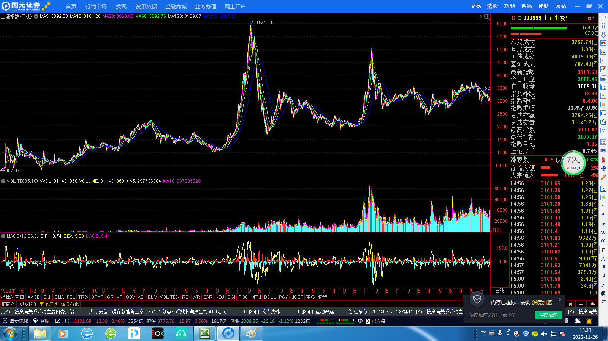
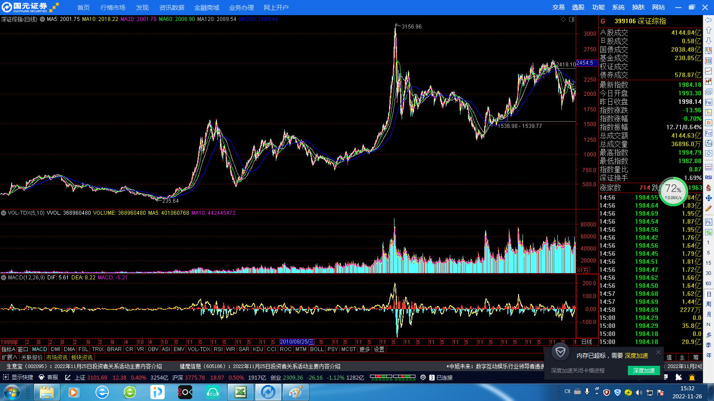

#估值量化
##一个基本的定投模型
 从本堂课开始，我们就要真正进入量化定投的探索之旅，由一个最基本最简单的定投模型开始，一课一课的深入，最终找到那个可以指导我们实际操作的量化定投模型。
###§1从一个定投案例说起
 我们先来看一个基金定投的真实案例。
 一位家住上海的王女士，每月投入2000元，分别定投4只基金，每次投入500元----自2011年中旬定投开始的5年时间里，王女士始终不改初心，无论A股如何涨跌起伏，王女士都没有任何赎回行动，其定投记录堪称教科书式的基金定投。
 交易单据显示，王女士选择定投4只基金，并选择银行申购，其分别定投了广发核心精选、兴全有机增长、农银汇理增长和嘉实沪深300，王女士表示“这4只基金也是我做基金定投时，搞理财的朋友推荐给我的”。 朋友推荐应该是很多人买基金的“原动力”， 尤其是在牛市中你正好有一个在银行工作的朋友。
 具体来看，广发核心精选的对账单显示，王女士对该基金的定投始于2011年5月，每月均投入500元，直到2016年3月，累计投资59次，共动用资金2.95万元，截止2016年3月17日，王女士持有该基金15,739.5份，当日该基金单位净值为2.467元，其账面总资产为38,829.35元，账面浮盈为9329.35元，定投收益率为31.62%。
 同期开始定投的还有兴全有机增长，该基金总计投入也是2.95万元，截止2016年3月17日，王女士持有该基金20592.55份，当日该基金单位净值为2.5151元，其账面总资产为57192.32元，账面浮盈为22292.32元，定投收益率为75.56%。
 之后的2011年9月，王女士的定投组合又加入了农银汇理增长和嘉实沪深300两支基金。其中农银汇理增长的定投总次数为55次，总计投入为2.75万元，截止2016年3月17日，王女士持有该基金18818.83份，当日该基金单位净值为1.959元，其账面总资产为36866.09元，账面浮盈为9366.09元，定投收益率为34.05%。
 嘉实沪深300的定投总次数为55次，总计投入为2.75万元，截止2016年3月17日，王女士持有该基金37086.69分，当日该基金单位净值为0.8644元，其账面总资产为32057.73元，账面浮盈为4557.73元，定投收益率为16.57%。
 综上可知，自广发核心精选开始，王女士历经近5年的定投，总投入119400元，截止2016年3月17日的账面总资产为164945.49元，账面浮盈为45545元，定投收益率为39.95%，同样由于未在2015年高点时卖出，这份近5年的宛如教科书般的定投，其收益最终只有40%。
###§2构建一个基本的定投模型
 目前普通的定投都是针对基金而言的，基金公司为了本公司的利益会主动联合银行等渠道，给客户提供便捷化的定投服务，客户只需准备好一张银行卡，并保证在扣款日当天卡内余额高于扣款额即可。扣款额的多少可以由客户在签约时自由认定，少则200/300元，多则上千上万元。
案例中的王女士为了分散风险，选择了4支风格不同的基金进行定投，每月每支定投500元，坚持五年，风雨无阻，这种定投更加类似于“强制储蓄”。 从收益看，王女士的定投收益远远跑赢同期银行存款收益，勉强也算达到了其投资理财的目的。
 那么普通基金定投就可以定义为：每月在固定的时间买入固定金额的某支基金，其买入逻辑判断过程如下图所示，这个判断客户不用操心，都由银行和基金公司替客户完成了。

 显而易见，这是一个非常简单的定投模型，在此我将这个模型命名为模型一，模型一虽然简单，但是已经可以具备一个完整的量化交易系统的雏形了，我们对模型一定义如下：
<table class="MsoTableGrid" border="1" cellspacing="0" cellpadding="0" style="border-collapse:collapse;border:none">
 <tbody><tr>
  <td width="568" colspan="2" valign="top" style="width:426.1pt;border:solid windowtext 1.0pt;
  padding:0cm 5.4pt 0cm 5.4pt">
  
&nbsp;&nbsp;&nbsp;&nbsp;&nbsp;&nbsp;&nbsp;&nbsp;&nbsp;&nbsp;&nbsp;&nbsp;&nbsp;&nbsp;&nbsp;&nbsp;&nbsp;&nbsp;&nbsp;&nbsp;&nbsp;&nbsp;&nbsp;&nbsp;&nbsp;
  模型一

  </td>
 </tr>
 <tr>
  <td width="73" valign="top" style="width:55.05pt;border:solid windowtext 1.0pt;
  border-top:none;padding:0cm 5.4pt 0cm 5.4pt">
  
买什么

  </td>
  <td width="495" valign="top" style="width:371.05pt;border-top:none;border-left:
  none;border-bottom:solid windowtext 1.0pt;border-right:solid windowtext 1.0pt;
  padding:0cm 5.4pt 0cm 5.4pt">
  
上证指数

  </td>
 </tr>
 <tr>
  <td width="73" valign="top" style="width:55.05pt;border:solid windowtext 1.0pt;
  border-top:none;padding:0cm 5.4pt 0cm 5.4pt">
  
怎么买

  </td>
  <td width="495" valign="top" style="width:371.05pt;border-top:none;border-left:
  none;border-bottom:solid windowtext 1.0pt;border-right:solid windowtext 1.0pt;
  padding:0cm 5.4pt 0cm 5.4pt">
  
每月最后一个交易日收盘价买入

  </td>
 </tr>
 <tr>
  <td width="73" valign="top" style="width:55.05pt;border:solid windowtext 1.0pt;
  border-top:none;padding:0cm 5.4pt 0cm 5.4pt">
  
买多少

  </td>
  <td width="495" valign="top" style="width:371.05pt;border-top:none;border-left:
  none;border-bottom:solid windowtext 1.0pt;border-right:solid windowtext 1.0pt;
  padding:0cm 5.4pt 0cm 5.4pt">
  
2000元

  </td>
 </tr>
 <tr>
  <td width="73" valign="top" style="width:55.05pt;border:solid windowtext 1.0pt;
  border-top:none;padding:0cm 5.4pt 0cm 5.4pt">
  
怎么卖

  </td>
  <td width="495" valign="top" style="width:371.05pt;border-top:none;border-left:
  none;border-bottom:solid windowtext 1.0pt;border-right:solid windowtext 1.0pt;
  padding:0cm 5.4pt 0cm 5.4pt">
  
无

  </td>
 </tr>
 <tr>
  <td width="73" valign="top" style="width:55.05pt;border:solid windowtext 1.0pt;
  border-top:none;padding:0cm 5.4pt 0cm 5.4pt">
  
卖多少

  </td>
  <td width="495" valign="top" style="width:371.05pt;border-top:none;border-left:
  none;border-bottom:solid windowtext 1.0pt;border-right:solid windowtext 1.0pt;
  padding:0cm 5.4pt 0cm 5.4pt">
  
无

  </td>
 </tr>
 <tr>
  <td width="73" valign="top" style="width:55.05pt;border:solid windowtext 1.0pt;
  border-top:none;padding:0cm 5.4pt 0cm 5.4pt">
  
测试时间

  </td>
  <td width="495" valign="top" style="width:371.05pt;border-top:none;border-left:
  none;border-bottom:solid windowtext 1.0pt;border-right:solid windowtext 1.0pt;
  padding:0cm 5.4pt 0cm 5.4pt">
  
2002.01.01-2016.12.30

  </td>
 </tr>
</tbody></table>

###§3对模型一的说明
 下面就模型一涉及的问题作如下说明
 1.为何选择上证指数做测试
 众所周知，我们A股主板有两大交易所，分别为上海证券交易所和深圳证券交易所，两大交易所的代表指数为上证指数和深证综指，下图为上证指数全历史走势图。

 下图为深圳综指的全历史走势图。

 从上述图形中我们不难看出，2008年后，代表了一部分中小上市公司的深圳综指走势远远强于上证指数，如果我们用深综指这种过去大涨的指数来作为模型的测试样本，那么就有可能使我们的模型无法经受住大跌，大熊市的考验。
 我们必须对我们所测试的模型提出更加苛刻的测试条件，如果能在上证指数上赚钱，那么深圳综指一定不在话下，就好像能在大海中游泳的人，放在游泳池中一定没有问题，反之则可能会被海浪淹死。这一点请读者深入思考，当然之后我们依然会对深综指等主流指数进行测试，以证明模型的有效性。
 2.测试时间为何是2002.01.01-2016.12.30
 如果说前面选择上证指数就像选定一个战场的话，那么测试时间段的选择就好比给模型选一个好的“对手”， 一个最能体现出模型价值的对手。定投是一个长期的理财计划，时间短了肯定测不出来好坏，选单纯的上涨行情或者下跌行情也不行。A股的历史上有四次牛市行情，分别为2000年，2007年，2015年，2019年，能从中看出点规律吗？
很难，所以我们的测试时间段起码要有10年以上的时间。仔细观察上证指数，以2002~2016年这15年作为测试时间段还是很合适的，2000年之前的股市由于当时各方面条件并不成熟，参考价值比较小。所以我们最终选择了2002~2016年这个时间段。
 3.为何每月只买2000元
 定投金额的确定就比较主观了。一般来说，定投金额是和个人经济状况挂钩的，存款多收入高，定投金额当然水涨船高，在实际定投中，大家可以根据自己的情况酌情而定。
 我们做模型测试，考察模型的优劣基本都是用比例和参数，比如绝对收益率，年化收益率等等，这些数字和定投的绝对金额没有关系，所以不管我们设定定投金额是2000元也好还是5000元也罢，并不会有差别。
之所以选择2000元这个数字是因为绝大多数人的定投金额和此比较接近，计算出的结果大家从直观上更好理解。为了更好的做对比分析，本书以后所有的模型，大概率将年定投金额设定在2万元至3万元之间。
###§4模型一的测试
 至此，我们终于搞定了模型一中的细节问题了，下面开始测试。测试的过程就是模拟真实的交易过程，每次交易后把我们关心的几个数据记录下来，比如买卖金额，持有数量，盈利金额等等，这样就会形成一个长长的数据表。下图即是模型一的测试数据。单位：元

