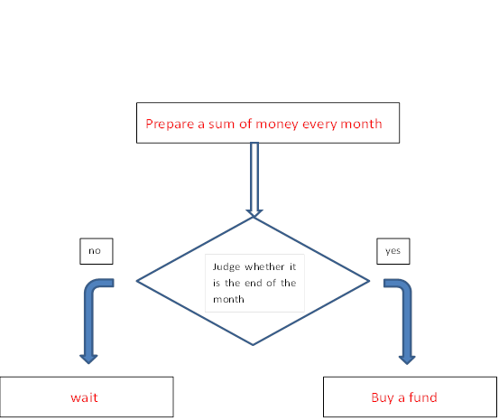
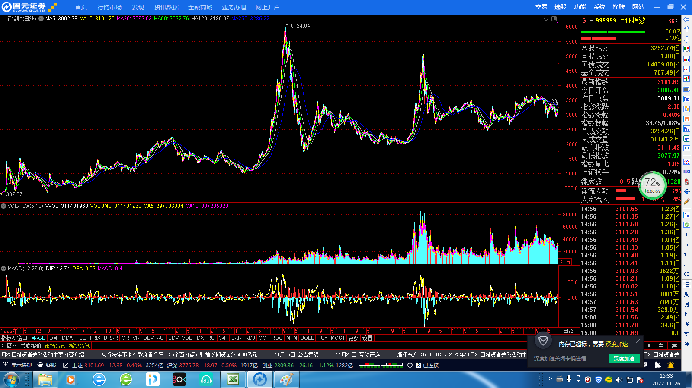
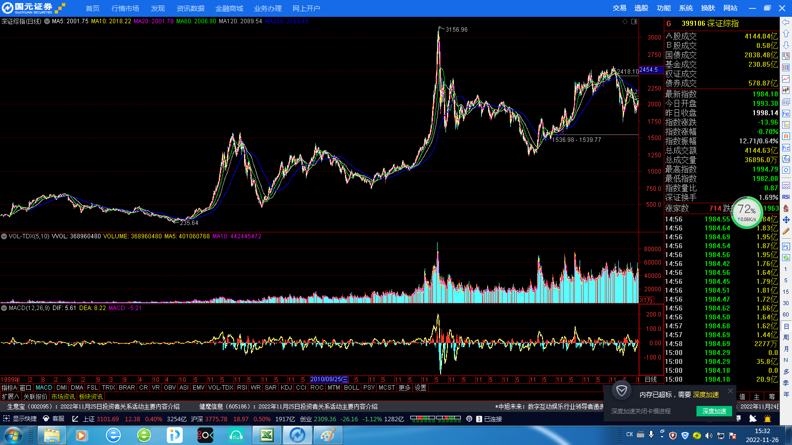
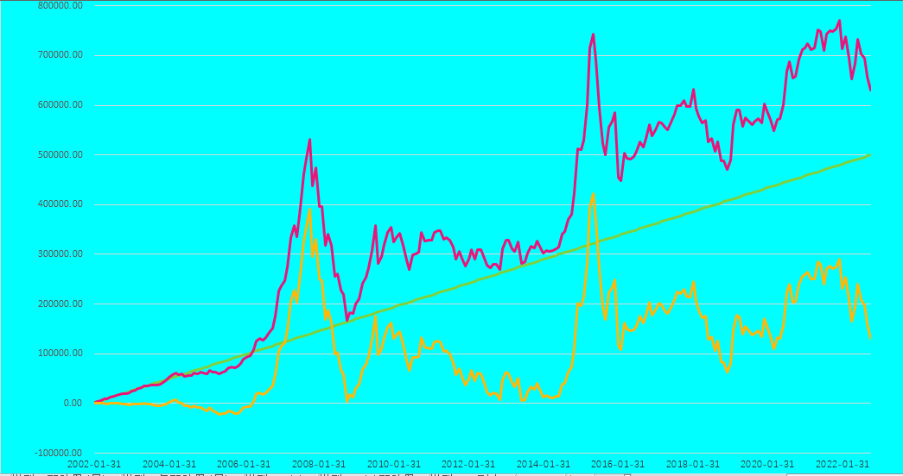
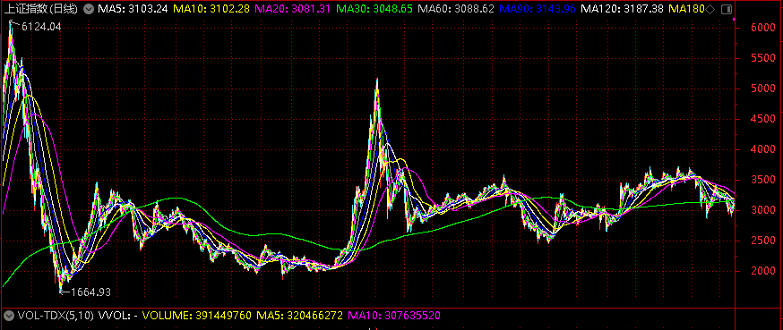
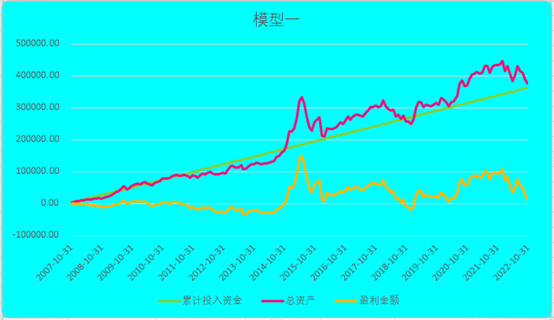

#Valuationquan
##Chapter 2
A Basic Fixed Investment Model
From this lesson, we will really enter the exploration journey of quantitative investment, starting with a basic and simple fixed investment model, and finally find the quantitative fixed investment model that can guide our actual operation.
###§1starting from a case of fixed investment
 Let's first look at a real case of fund fixed investment.
 Ms. Wang, who lives in Shanghai, invests 2000 yuan each month in four funds, and 500 yuan each time. During the five years since the beginning of the fixed investment in the middle of 2011, Ms. Wang has never changed her mind. 
No matter how the A shares rise and fall, Ms. Wang has not taken any redemption action, and her fixed investment record can be regarded as a textbook fund fixed investment.
 According to the transaction documents, Ms. Wang chose to invest in four funds and chose the bank to apply for purchase. She invested in GF Core Selective Equity, Xingquan Organic Growth, ABC-CA Growth Equity and Harvest CSI 300 respectively. 
Ms. Wang said that "these four funds were also recommended to me by my friends engaged in financial management when I made fund investment". A friend's recommendation should be the "driving force" for many people to buy funds, especially in a bull market when you happen to have a friend who works in a bank.
 Specifically, the selected statement of GF Core Selective shows that Ms. Wang's fixed investment in the fund started in May 2011, with an average of 500 yuan invested every month. 
Until March 2016, she has invested 59 times, with a total of 29500 yuan. As of March 17, 2016, Ms. Wang held 15739.5 shares of the fund. On that day, the net value of the fund unit was 2.467 yuan, the total book assets was 38829.35 yuan, the book floating profit was 9329.35 yuan, and the fixed investment yield was 31.62%.
 She also started its fixed investment in Xingquan Organic Growth in the same period. The total investment of the fund was also 29500 yuan. As of March 17, 2016, Ms. Wang held 20592.55 shares of the fund. On that day, the net value of the fund unit was 2.5151 yuan. 
Its total book assets were 57192.32 yuan, book floating profit was 22292.32 yuan, and the fixed investment yield was 75.56%.
 Later, in September 2011, Ms. Wang added two funds, ABC-CA Growth Equity and Harvest CSI 300, to her fixed investment portfolio.
 Among them, the total number of fixed investments increased by ABC-CA Growth Equity was 55, with a total investment of 27500 yuan. As of March 17, 2016, Ms. Wang held 18818.83 shares of the fund. 
On that day, the unit net value of the fund was 1.959 yuan, its total book assets was 36866.09 yuan, its book floating profit was 9366.09 yuan, and the rate of return on fixed investments was 34.05%.
 The total number of fixed investments of Harvest CSI 300 was 55, with a total investment of 27500 yuan. As of March 17, 2016, Ms. Wang held 37086.69 shares of the fund. On that day, the net value of the fund unit was 0.8644 yuan. Its total book assets were 32057.73 yuan, book floating profit was 4557.73 yuan, and the fixed investment yield was 16.57%.
 To sum up, since the GF Core Selection, Ms. Wang has invested 119400 yuan in fixed investment for nearly five years. As of March 17, 2016, the total book asset was 164945.49 yuan, the book floating profit was 45545 yuan, and the fixed investment yield was 39.95%.
Also, because she did not sell at the peak in 2015, this fixed investment for nearly five years was like a textbook, and its yield was only 40%.
###§2build a basic fixed investment model
 Now, the common fixed investment is for the fund. For the benefit of the company, the fund company will actively cooperate with banks and other channels to provide customers with convenient fixed investment services. 
Customers only need to prepare a bank card and ensure that the balance in the card on the day of deduction is higher than the amount deducted. The amount of deduction can be freely determined by the customer when signing the contract, ranging from 200/300 yuan to tens of thousands of yuan.
In order to spread the risk, Ms. Wang in the case chose four funds with different styles to make a fixed investment of 500 yuan each month for five years. This kind of fixed investment is more similar to "forced savings". 
From the perspective of income, Ms. Wang's fixed investment income far outperformed the bank deposit income in the same period, and barely achieved her investment and financing purpose.
 Then this type of fixed investment can be defined as: buying a certain fund with a fixed amount at a fixed time every month. The buying logic judgment process is shown in the following figure. The customers need not worry about this judgment. The banks and fund companies complete it for the customers.

 Obviously, this is a very simple fixed investment model. Here I name this model Model 1. Although Model 1 is simple, it can already have the prototype of a complete quantitative trading system. We define Model 1 as follows:
<table class="MsoTableGrid" border="1" cellspacing="0" cellpadding="0" style="border-collapse:collapse;border:none">
 <tbody><tr>
  <td width="568" colspan="2" valign="top" style="width:426.1pt;border:solid windowtext 1.0pt;
  padding:0cm 5.4pt 0cm 5.4pt">
  
&nbsp;&nbsp;&nbsp;&nbsp;&nbsp;&nbsp;&nbsp;&nbsp;&nbsp;&nbsp;&nbsp;&nbsp;&nbsp;&nbsp;&nbsp;&nbsp;&nbsp;&nbsp;&nbsp;&nbsp;&nbsp;&nbsp;&nbsp;&nbsp;&nbsp;
  Model 1

  </td>
 </tr>
 <tr>
  <td width="83" valign="top" style="width:62.1pt;border:solid windowtext 1.0pt;
  border-top:none;padding:0cm 5.4pt 0cm 5.4pt">
  
Buy what

  </td>
  <td width="485" valign="top" style="width:364.0pt;border-top:none;border-left:
  none;border-bottom:solid windowtext 1.0pt;border-right:solid windowtext 1.0pt;
  padding:0cm 5.4pt 0cm 5.4pt">
  
Shanghai Stock Exchange composite index

  </td>
 </tr>
 <tr>
  <td width="83" valign="top" style="width:62.1pt;border:solid windowtext 1.0pt;
  border-top:none;padding:0cm 5.4pt 0cm 5.4pt">
  
How to buy

  </td>
  <td width="485" valign="top" style="width:364.0pt;border-top:none;border-left:
  none;border-bottom:solid windowtext 1.0pt;border-right:solid windowtext 1.0pt;
  padding:0cm 5.4pt 0cm 5.4pt">
  
buy at the closing price on the last
  trading day of each month

  </td>
 </tr>
 <tr>
  <td width="83" valign="top" style="width:62.1pt;border:solid windowtext 1.0pt;
  border-top:none;padding:0cm 5.4pt 0cm 5.4pt">
  
How much

  </td>
  <td width="485" valign="top" style="width:364.0pt;border-top:none;border-left:
  none;border-bottom:solid windowtext 1.0pt;border-right:solid windowtext 1.0pt;
  padding:0cm 5.4pt 0cm 5.4pt">
  
2000 yuan

  </td>
 </tr>
 <tr>
  <td width="83" valign="top" style="width:62.1pt;border:solid windowtext 1.0pt;
  border-top:none;padding:0cm 5.4pt 0cm 5.4pt">
  
How to sell

  </td>
  <td width="485" valign="top" style="width:364.0pt;border-top:none;border-left:
  none;border-bottom:solid windowtext 1.0pt;border-right:solid windowtext 1.0pt;
  padding:0cm 5.4pt 0cm 5.4pt">
  
nothing

  </td>
 </tr>
 <tr>
  <td width="83" valign="top" style="width:62.1pt;border:solid windowtext 1.0pt;
  border-top:none;padding:0cm 5.4pt 0cm 5.4pt">
  
How much

  </td>
  <td width="485" valign="top" style="width:364.0pt;border-top:none;border-left:
  none;border-bottom:solid windowtext 1.0pt;border-right:solid windowtext 1.0pt;
  padding:0cm 5.4pt 0cm 5.4pt">
  
nothing

  </td>
 </tr>
 <tr>
  <td width="83" valign="top" style="width:62.1pt;border:solid windowtext 1.0pt;
  border-top:none;padding:0cm 5.4pt 0cm 5.4pt">
  
Test time

  </td>
  <td width="485" valign="top" style="width:364.0pt;border-top:none;border-left:
  none;border-bottom:solid windowtext 1.0pt;border-right:solid windowtext 1.0pt;
  padding:0cm 5.4pt 0cm 5.4pt">
  
2002.01.01-2016.12.30

  </td>
 </tr>
</tbody></table>
###§3instructions for model 1
 The problems involved in model 1 are described as follows:
 1.	Why choose Shanghai Stock Exchange Index for testing?
 As we all know, there are two major exchanges on the A-share main board, Shanghai Stock Exchange and Shenzhen Stock Exchange,the representative indexes of the two exchanges are the Shanghai Composite Index and the Shenzhen Composite Index. The chart below shows the overall historical trend of the Shanghai Composite Index.

 The chart below shows the overall historical trend of Shenzhen Composite Index.

 From the above graph, we can easily see that after 2008, the Shenzhen Composite Index represents the trend of some small and medium-sized listed companies,It is far stronger than the Shanghai Stock Exchange Index.
If we use the Shenzhen Composite Index, which has risen sharply in the past, as the test sample of the model, it may make our model unable to withstand the test of the sharp decline and big bear market.
 We must put forward more stringent test conditions for the model we are testing. If we can make money on the Shanghai Stock Exchange Index,so the Shenzhen Composite Index must be easy. 
Just like people who can swim in the sea, it must be OK to put them in the swimming pool, otherwise they may be drowned by the waves. Please think deeply about this. Of course, we will still test the Shenzhen Composite Index and other mainstream indexes to prove the effectiveness of the model.
 2.	Why is the test time from January 1, 2002 to December 30, 2016?
 If the previous selection of the SSE index is like selecting a battlefield, then the selection of the test period is like choosing a good "opponent" who can best reflect the value of the model. Fixed investment is a long-term financial management plan.
It will not be good or bad if the time is short. It is not good to choose a simple upward or downward market. There have been four bull markets in the history of A-share, respectively in 2000, 2007, 2015 and 2019.
Can you see some rules from them? It's very difficult, so our testing period should be at least 10 years. Carefully observe the Shanghai Stock Exchange Index.
It is appropriate to take the 15 years from 2002 to 2016 as the test period. The stock market before 2000 was not mature in all aspects at that time, so the reference value was relatively small. we finally chose the period from 2002 to 2016.
 3.	Why only buy 2000 yuan per month
 The determination of fixed investment amount is subjective. Generally speaking, the fixed investment amount is related to the personal economic situation, and who have many deposits,with high income, the amount of fixed investment will certainly increase. In actual fixed investment, you can decide according to your own situation.
 We do model testing, and we basically use proportions and parameters to evaluate the merits of the model, such as absolute rate of return, annualized rate of return, etc. These figures have nothing to do with the absolute amount of fixed investment, so no matter whether we set the fixed investment amount to be 2000 yuan or 5000 yuan, there will be no difference. 
The reason for choosing the figure of 2000 yuan is that the fixed investment amount of most people is close to this, and the calculated result is intuitively better understood. 
In order to make a better comparative analysis, the annual fixed investment amount of all future models in this book is roughly set between 20000 yuan and 30000 yuan.
###§4testing for model 1
 So far, we have finally solved the details in Model 1, and now we begin to test. The process of testing is to simulate the real transaction process. After each transaction, we will record several data we care about, such as purchase and sale amount, holding amount, profit amount, etc., which will form a long data table. 
The following figure shows the test data of Model 1.                                                                                                  Unit: yuan(RMB)
<table class="MsoTableGrid" border="1" cellspacing="0" cellpadding="0" width="690" style="width:517.35pt;margin-left:-42.1pt;border-collapse:collapse;border:
 none">
 <tbody><tr style="height:27.0pt">
  <td width="80" nowrap="" valign="top" style="width:60.0pt;border:solid windowtext 1.0pt;
  padding:0cm 5.4pt 0cm 5.4pt;height:27.0pt">
  
<b>Time</b>

  </td>
  <td width="67" nowrap="" valign="top" style="width:50.6pt;border:solid windowtext 1.0pt;
  border-left:none;padding:0cm 5.4pt 0cm 5.4pt;height:27.0pt">
  
<b>Shanghai</b>

  
<b>Stock index</b>

  </td>
  <td width="65" nowrap="" valign="top" style="width:48.85pt;border:solid windowtext 1.0pt;
  border-left:none;padding:0cm 5.4pt 0cm 5.4pt;height:27.0pt">
  
<b>B/S&nbsp; amount</b>

  </td>
  <td width="76" nowrap="" valign="top" style="width:2.0cm;border:solid windowtext 1.0pt;
  border-left:none;padding:0cm 5.4pt 0cm 5.4pt;height:27.0pt">
  
<b>B/S&nbsp; shares</b>

  </td>
  <td width="76" nowrap="" valign="top" style="width:2.0cm;border:solid windowtext 1.0pt;
  border-left:none;padding:0cm 5.4pt 0cm 5.4pt;height:27.0pt">
  
<b>Holding</b>

  
<b>shares</b>

  </td>
  <td width="76" nowrap="" valign="top" style="width:2.0cm;border:solid windowtext 1.0pt;
  border-left:none;padding:0cm 5.4pt 0cm 5.4pt;height:27.0pt">
  
<b>Market</b>

  
<b>value</b>

  </td>
  <td width="91" nowrap="" valign="top" style="width:67.9pt;border:solid windowtext 1.0pt;
  border-left:none;padding:0cm 5.4pt 0cm 5.4pt;height:27.0pt">
  
<b>Accumulated investment</b>

  </td>
  <td width="76" nowrap="" valign="top" style="width:2.0cm;border:solid windowtext 1.0pt;
  border-left:none;padding:0cm 5.4pt 0cm 5.4pt;height:27.0pt">
  
<b>Total</b>

  
<b>asserts</b>

  </td>
  <td width="84" nowrap="" valign="top" style="width:63.2pt;border:solid windowtext 1.0pt;
  border-left:none;padding:0cm 5.4pt 0cm 5.4pt;height:27.0pt">
  
<b>Profit amount</b>

  </td>
 </tr>
 <tr style="height:14.1pt">
  <td width="80" nowrap="" valign="top" style="width:60.0pt;border:solid windowtext 1.0pt;
  border-top:none;padding:0cm 5.4pt 0cm 5.4pt;height:14.1pt">
  
2002-01-31

  </td>
  <td width="67" nowrap="" valign="top" style="width:50.6pt;border-top:none;
  border-left:none;border-bottom:solid windowtext 1.0pt;border-right:solid windowtext 1.0pt;
  padding:0cm 5.4pt 0cm 5.4pt;height:14.1pt">
  
1.49166

  </td>
  <td width="65" nowrap="" valign="top" style="width:48.85pt;border-top:none;
  border-left:none;border-bottom:solid windowtext 1.0pt;border-right:solid windowtext 1.0pt;
  padding:0cm 5.4pt 0cm 5.4pt;height:14.1pt">
  
2000.00 

  </td>
  <td width="76" nowrap="" valign="top" style="width:2.0cm;border-top:none;border-left:
  none;border-bottom:solid windowtext 1.0pt;border-right:solid windowtext 1.0pt;
  padding:0cm 5.4pt 0cm 5.4pt;height:14.1pt">
  
1340.79 

  </td>
  <td width="76" nowrap="" valign="top" style="width:2.0cm;border-top:none;border-left:
  none;border-bottom:solid windowtext 1.0pt;border-right:solid windowtext 1.0pt;
  padding:0cm 5.4pt 0cm 5.4pt;height:14.1pt">
  
1340.79 

  </td>
  <td width="76" nowrap="" valign="top" style="width:2.0cm;border-top:none;border-left:
  none;border-bottom:solid windowtext 1.0pt;border-right:solid windowtext 1.0pt;
  padding:0cm 5.4pt 0cm 5.4pt;height:14.1pt">
  
2000.00 

  </td>
  <td width="91" nowrap="" valign="top" style="width:67.9pt;border-top:none;
  border-left:none;border-bottom:solid windowtext 1.0pt;border-right:solid windowtext 1.0pt;
  padding:0cm 5.4pt 0cm 5.4pt;height:14.1pt">
  
2000.00 

  </td>
  <td width="76" nowrap="" valign="top" style="width:2.0cm;border-top:none;border-left:
  none;border-bottom:solid windowtext 1.0pt;border-right:solid windowtext 1.0pt;
  padding:0cm 5.4pt 0cm 5.4pt;height:14.1pt">
  
2000.00 

  </td>
  <td width="84" nowrap="" valign="top" style="width:63.2pt;border-top:none;
  border-left:none;border-bottom:solid windowtext 1.0pt;border-right:solid windowtext 1.0pt;
  padding:0cm 5.4pt 0cm 5.4pt;height:14.1pt">
  
0.00 

  </td>
 </tr>
 <tr style="height:14.1pt">
  <td width="80" nowrap="" valign="top" style="width:60.0pt;border:solid windowtext 1.0pt;
  border-top:none;padding:0cm 5.4pt 0cm 5.4pt;height:14.1pt">
  
2002-02-28

  </td>
  <td width="67" nowrap="" valign="top" style="width:50.6pt;border-top:none;
  border-left:none;border-bottom:solid windowtext 1.0pt;border-right:solid windowtext 1.0pt;
  padding:0cm 5.4pt 0cm 5.4pt;height:14.1pt">
  
1.52469

  </td>
  <td width="65" nowrap="" valign="top" style="width:48.85pt;border-top:none;
  border-left:none;border-bottom:solid windowtext 1.0pt;border-right:solid windowtext 1.0pt;
  padding:0cm 5.4pt 0cm 5.4pt;height:14.1pt">
  
2000.00 

  </td>
  <td width="76" nowrap="" valign="top" style="width:2.0cm;border-top:none;border-left:
  none;border-bottom:solid windowtext 1.0pt;border-right:solid windowtext 1.0pt;
  padding:0cm 5.4pt 0cm 5.4pt;height:14.1pt">
  
1311.74 

  </td>
  <td width="76" nowrap="" valign="top" style="width:2.0cm;border-top:none;border-left:
  none;border-bottom:solid windowtext 1.0pt;border-right:solid windowtext 1.0pt;
  padding:0cm 5.4pt 0cm 5.4pt;height:14.1pt">
  
2652.53 

  </td>
  <td width="76" nowrap="" valign="top" style="width:2.0cm;border-top:none;border-left:
  none;border-bottom:solid windowtext 1.0pt;border-right:solid windowtext 1.0pt;
  padding:0cm 5.4pt 0cm 5.4pt;height:14.1pt">
  
4044.29 

  </td>
  <td width="91" nowrap="" valign="top" style="width:67.9pt;border-top:none;
  border-left:none;border-bottom:solid windowtext 1.0pt;border-right:solid windowtext 1.0pt;
  padding:0cm 5.4pt 0cm 5.4pt;height:14.1pt">
  
4000.00 

  </td>
  <td width="76" nowrap="" valign="top" style="width:2.0cm;border-top:none;border-left:
  none;border-bottom:solid windowtext 1.0pt;border-right:solid windowtext 1.0pt;
  padding:0cm 5.4pt 0cm 5.4pt;height:14.1pt">
  
4044.29 

  </td>
  <td width="84" nowrap="" valign="top" style="width:63.2pt;border-top:none;
  border-left:none;border-bottom:solid windowtext 1.0pt;border-right:solid windowtext 1.0pt;
  padding:0cm 5.4pt 0cm 5.4pt;height:14.1pt">
  
44.29 

  </td>
 </tr>
 <tr style="height:14.1pt">
  <td width="80" nowrap="" valign="top" style="width:60.0pt;border:solid windowtext 1.0pt;
  border-top:none;padding:0cm 5.4pt 0cm 5.4pt;height:14.1pt">
  
2002-03-29

  </td>
  <td width="67" nowrap="" valign="top" style="width:50.6pt;border-top:none;
  border-left:none;border-bottom:solid windowtext 1.0pt;border-right:solid windowtext 1.0pt;
  padding:0cm 5.4pt 0cm 5.4pt;height:14.1pt">
  
1.6039

  </td>
  <td width="65" nowrap="" valign="top" style="width:48.85pt;border-top:none;
  border-left:none;border-bottom:solid windowtext 1.0pt;border-right:solid windowtext 1.0pt;
  padding:0cm 5.4pt 0cm 5.4pt;height:14.1pt">
  
2000.00 

  </td>
  <td width="76" nowrap="" valign="top" style="width:2.0cm;border-top:none;border-left:
  none;border-bottom:solid windowtext 1.0pt;border-right:solid windowtext 1.0pt;
  padding:0cm 5.4pt 0cm 5.4pt;height:14.1pt">
  
1246.96 

  </td>
  <td width="76" nowrap="" valign="top" style="width:2.0cm;border-top:none;border-left:
  none;border-bottom:solid windowtext 1.0pt;border-right:solid windowtext 1.0pt;
  padding:0cm 5.4pt 0cm 5.4pt;height:14.1pt">
  
3899.49 

  </td>
  <td width="76" nowrap="" valign="top" style="width:2.0cm;border-top:none;border-left:
  none;border-bottom:solid windowtext 1.0pt;border-right:solid windowtext 1.0pt;
  padding:0cm 5.4pt 0cm 5.4pt;height:14.1pt">
  
6254.39 

  </td>
  <td width="91" nowrap="" valign="top" style="width:67.9pt;border-top:none;
  border-left:none;border-bottom:solid windowtext 1.0pt;border-right:solid windowtext 1.0pt;
  padding:0cm 5.4pt 0cm 5.4pt;height:14.1pt">
  
6000.00 

  </td>
  <td width="76" nowrap="" valign="top" style="width:2.0cm;border-top:none;border-left:
  none;border-bottom:solid windowtext 1.0pt;border-right:solid windowtext 1.0pt;
  padding:0cm 5.4pt 0cm 5.4pt;height:14.1pt">
  
6254.39 

  </td>
  <td width="84" nowrap="" valign="top" style="width:63.2pt;border-top:none;
  border-left:none;border-bottom:solid windowtext 1.0pt;border-right:solid windowtext 1.0pt;
  padding:0cm 5.4pt 0cm 5.4pt;height:14.1pt">
  
254.39 

  </td>
 </tr>
 <tr style="height:14.1pt">
  <td width="80" nowrap="" valign="top" style="width:60.0pt;border:solid windowtext 1.0pt;
  border-top:none;padding:0cm 5.4pt 0cm 5.4pt;height:14.1pt">
  
2002-04-30

  </td>
  <td width="67" nowrap="" valign="top" style="width:50.6pt;border-top:none;
  border-left:none;border-bottom:solid windowtext 1.0pt;border-right:solid windowtext 1.0pt;
  padding:0cm 5.4pt 0cm 5.4pt;height:14.1pt">
  
1.66774

  </td>
  <td width="65" nowrap="" valign="top" style="width:48.85pt;border-top:none;
  border-left:none;border-bottom:solid windowtext 1.0pt;border-right:solid windowtext 1.0pt;
  padding:0cm 5.4pt 0cm 5.4pt;height:14.1pt">
  
2000.00 

  </td>
  <td width="76" nowrap="" valign="top" style="width:2.0cm;border-top:none;border-left:
  none;border-bottom:solid windowtext 1.0pt;border-right:solid windowtext 1.0pt;
  padding:0cm 5.4pt 0cm 5.4pt;height:14.1pt">
  
1199.23 

  </td>
  <td width="76" nowrap="" valign="top" style="width:2.0cm;border-top:none;border-left:
  none;border-bottom:solid windowtext 1.0pt;border-right:solid windowtext 1.0pt;
  padding:0cm 5.4pt 0cm 5.4pt;height:14.1pt">
  
5098.72 

  </td>
  <td width="76" nowrap="" valign="top" style="width:2.0cm;border-top:none;border-left:
  none;border-bottom:solid windowtext 1.0pt;border-right:solid windowtext 1.0pt;
  padding:0cm 5.4pt 0cm 5.4pt;height:14.1pt">
  
8503.34 

  </td>
  <td width="91" nowrap="" valign="top" style="width:67.9pt;border-top:none;
  border-left:none;border-bottom:solid windowtext 1.0pt;border-right:solid windowtext 1.0pt;
  padding:0cm 5.4pt 0cm 5.4pt;height:14.1pt">
  
8000.00 

  </td>
  <td width="76" nowrap="" valign="top" style="width:2.0cm;border-top:none;border-left:
  none;border-bottom:solid windowtext 1.0pt;border-right:solid windowtext 1.0pt;
  padding:0cm 5.4pt 0cm 5.4pt;height:14.1pt">
  
8503.34 

  </td>
  <td width="84" nowrap="" valign="top" style="width:63.2pt;border-top:none;
  border-left:none;border-bottom:solid windowtext 1.0pt;border-right:solid windowtext 1.0pt;
  padding:0cm 5.4pt 0cm 5.4pt;height:14.1pt">
  
503.34 

  </td>
 </tr>
 <tr style="height:14.1pt">
  <td width="80" nowrap="" valign="top" style="width:60.0pt;border:solid windowtext 1.0pt;
  border-top:none;padding:0cm 5.4pt 0cm 5.4pt;height:14.1pt">
  
2002-05-31

  </td>
  <td width="67" nowrap="" valign="top" style="width:50.6pt;border-top:none;
  border-left:none;border-bottom:solid windowtext 1.0pt;border-right:solid windowtext 1.0pt;
  padding:0cm 5.4pt 0cm 5.4pt;height:14.1pt">
  
1.51572

  </td>
  <td width="65" nowrap="" valign="top" style="width:48.85pt;border-top:none;
  border-left:none;border-bottom:solid windowtext 1.0pt;border-right:solid windowtext 1.0pt;
  padding:0cm 5.4pt 0cm 5.4pt;height:14.1pt">
  
2000.00 

  </td>
  <td width="76" nowrap="" valign="top" style="width:2.0cm;border-top:none;border-left:
  none;border-bottom:solid windowtext 1.0pt;border-right:solid windowtext 1.0pt;
  padding:0cm 5.4pt 0cm 5.4pt;height:14.1pt">
  
1319.50 

  </td>
  <td width="76" nowrap="" valign="top" style="width:2.0cm;border-top:none;border-left:
  none;border-bottom:solid windowtext 1.0pt;border-right:solid windowtext 1.0pt;
  padding:0cm 5.4pt 0cm 5.4pt;height:14.1pt">
  
6418.22 

  </td>
  <td width="76" nowrap="" valign="top" style="width:2.0cm;border-top:none;border-left:
  none;border-bottom:solid windowtext 1.0pt;border-right:solid windowtext 1.0pt;
  padding:0cm 5.4pt 0cm 5.4pt;height:14.1pt">
  
9728.23 

  </td>
  <td width="91" nowrap="" valign="top" style="width:67.9pt;border-top:none;
  border-left:none;border-bottom:solid windowtext 1.0pt;border-right:solid windowtext 1.0pt;
  padding:0cm 5.4pt 0cm 5.4pt;height:14.1pt">
  
10000.00 

  </td>
  <td width="76" nowrap="" valign="top" style="width:2.0cm;border-top:none;border-left:
  none;border-bottom:solid windowtext 1.0pt;border-right:solid windowtext 1.0pt;
  padding:0cm 5.4pt 0cm 5.4pt;height:14.1pt">
  
9728.23 

  </td>
  <td width="84" nowrap="" valign="top" style="width:63.2pt;border-top:none;
  border-left:none;border-bottom:solid windowtext 1.0pt;border-right:solid windowtext 1.0pt;
  padding:0cm 5.4pt 0cm 5.4pt;height:14.1pt">
  
-271.77 

  </td>
 </tr>
 <tr style="height:14.1pt">
  <td width="80" nowrap="" valign="top" style="width:60.0pt;border:solid windowtext 1.0pt;
  border-top:none;padding:0cm 5.4pt 0cm 5.4pt;height:14.1pt">
  
2002-06-28

  </td>
  <td width="67" nowrap="" valign="top" style="width:50.6pt;border-top:none;
  border-left:none;border-bottom:solid windowtext 1.0pt;border-right:solid windowtext 1.0pt;
  padding:0cm 5.4pt 0cm 5.4pt;height:14.1pt">
  
1.73275

  </td>
  <td width="65" nowrap="" valign="top" style="width:48.85pt;border-top:none;
  border-left:none;border-bottom:solid windowtext 1.0pt;border-right:solid windowtext 1.0pt;
  padding:0cm 5.4pt 0cm 5.4pt;height:14.1pt">
  
2000.00 

  </td>
  <td width="76" nowrap="" valign="top" style="width:2.0cm;border-top:none;border-left:
  none;border-bottom:solid windowtext 1.0pt;border-right:solid windowtext 1.0pt;
  padding:0cm 5.4pt 0cm 5.4pt;height:14.1pt">
  
1154.23 

  </td>
  <td width="76" nowrap="" valign="top" style="width:2.0cm;border-top:none;border-left:
  none;border-bottom:solid windowtext 1.0pt;border-right:solid windowtext 1.0pt;
  padding:0cm 5.4pt 0cm 5.4pt;height:14.1pt">
  
7572.46 

  </td>
  <td width="76" nowrap="" valign="top" style="width:2.0cm;border-top:none;border-left:
  none;border-bottom:solid windowtext 1.0pt;border-right:solid windowtext 1.0pt;
  padding:0cm 5.4pt 0cm 5.4pt;height:14.1pt">
  
13121.18 

  </td>
  <td width="91" nowrap="" valign="top" style="width:67.9pt;border-top:none;
  border-left:none;border-bottom:solid windowtext 1.0pt;border-right:solid windowtext 1.0pt;
  padding:0cm 5.4pt 0cm 5.4pt;height:14.1pt">
  
12000.00 

  </td>
  <td width="76" nowrap="" valign="top" style="width:2.0cm;border-top:none;border-left:
  none;border-bottom:solid windowtext 1.0pt;border-right:solid windowtext 1.0pt;
  padding:0cm 5.4pt 0cm 5.4pt;height:14.1pt">
  
13121.18 

  </td>
  <td width="84" nowrap="" valign="top" style="width:63.2pt;border-top:none;
  border-left:none;border-bottom:solid windowtext 1.0pt;border-right:solid windowtext 1.0pt;
  padding:0cm 5.4pt 0cm 5.4pt;height:14.1pt">
  
1121.18 

  </td>
 </tr>
 <tr style="height:14.1pt">
  <td width="80" nowrap="" valign="top" style="width:60.0pt;border:solid windowtext 1.0pt;
  border-top:none;padding:0cm 5.4pt 0cm 5.4pt;height:14.1pt">
  
2002-07-31

  </td>
  <td width="67" nowrap="" valign="top" style="width:50.6pt;border-top:none;
  border-left:none;border-bottom:solid windowtext 1.0pt;border-right:solid windowtext 1.0pt;
  padding:0cm 5.4pt 0cm 5.4pt;height:14.1pt">
  
1.65158

  </td>
  <td width="65" nowrap="" valign="top" style="width:48.85pt;border-top:none;
  border-left:none;border-bottom:solid windowtext 1.0pt;border-right:solid windowtext 1.0pt;
  padding:0cm 5.4pt 0cm 5.4pt;height:14.1pt">
  
2000.00 

  </td>
  <td width="76" nowrap="" valign="top" style="width:2.0cm;border-top:none;border-left:
  none;border-bottom:solid windowtext 1.0pt;border-right:solid windowtext 1.0pt;
  padding:0cm 5.4pt 0cm 5.4pt;height:14.1pt">
  
1210.96 

  </td>
  <td width="76" nowrap="" valign="top" style="width:2.0cm;border-top:none;border-left:
  none;border-bottom:solid windowtext 1.0pt;border-right:solid windowtext 1.0pt;
  padding:0cm 5.4pt 0cm 5.4pt;height:14.1pt">
  
8783.42 

  </td>
  <td width="76" nowrap="" valign="top" style="width:2.0cm;border-top:none;border-left:
  none;border-bottom:solid windowtext 1.0pt;border-right:solid windowtext 1.0pt;
  padding:0cm 5.4pt 0cm 5.4pt;height:14.1pt">
  
14506.52 

  </td>
  <td width="91" nowrap="" valign="top" style="width:67.9pt;border-top:none;
  border-left:none;border-bottom:solid windowtext 1.0pt;border-right:solid windowtext 1.0pt;
  padding:0cm 5.4pt 0cm 5.4pt;height:14.1pt">
  
14000.00 

  </td>
  <td width="76" nowrap="" valign="top" style="width:2.0cm;border-top:none;border-left:
  none;border-bottom:solid windowtext 1.0pt;border-right:solid windowtext 1.0pt;
  padding:0cm 5.4pt 0cm 5.4pt;height:14.1pt">
  
14506.52 

  </td>
  <td width="84" nowrap="" valign="top" style="width:63.2pt;border-top:none;
  border-left:none;border-bottom:solid windowtext 1.0pt;border-right:solid windowtext 1.0pt;
  padding:0cm 5.4pt 0cm 5.4pt;height:14.1pt">
  
506.52 

  </td>
 </tr>
 <tr style="height:14.1pt">
  <td width="80" nowrap="" valign="top" style="width:60.0pt;border:solid windowtext 1.0pt;
  border-top:none;padding:0cm 5.4pt 0cm 5.4pt;height:14.1pt">
  
2002-08-30

  </td>
  <td width="67" nowrap="" valign="top" style="width:50.6pt;border-top:none;
  border-left:none;border-bottom:solid windowtext 1.0pt;border-right:solid windowtext 1.0pt;
  padding:0cm 5.4pt 0cm 5.4pt;height:14.1pt">
  
1.66661

  </td>
  <td width="65" nowrap="" valign="top" style="width:48.85pt;border-top:none;
  border-left:none;border-bottom:solid windowtext 1.0pt;border-right:solid windowtext 1.0pt;
  padding:0cm 5.4pt 0cm 5.4pt;height:14.1pt">
  
2000.00 

  </td>
  <td width="76" nowrap="" valign="top" style="width:2.0cm;border-top:none;border-left:
  none;border-bottom:solid windowtext 1.0pt;border-right:solid windowtext 1.0pt;
  padding:0cm 5.4pt 0cm 5.4pt;height:14.1pt">
  
1200.04 

  </td>
  <td width="76" nowrap="" valign="top" style="width:2.0cm;border-top:none;border-left:
  none;border-bottom:solid windowtext 1.0pt;border-right:solid windowtext 1.0pt;
  padding:0cm 5.4pt 0cm 5.4pt;height:14.1pt">
  
9983.46 

  </td>
  <td width="76" nowrap="" valign="top" style="width:2.0cm;border-top:none;border-left:
  none;border-bottom:solid windowtext 1.0pt;border-right:solid windowtext 1.0pt;
  padding:0cm 5.4pt 0cm 5.4pt;height:14.1pt">
  
16638.53 

  </td>
  <td width="91" nowrap="" valign="top" style="width:67.9pt;border-top:none;
  border-left:none;border-bottom:solid windowtext 1.0pt;border-right:solid windowtext 1.0pt;
  padding:0cm 5.4pt 0cm 5.4pt;height:14.1pt">
  
16000.00 

  </td>
  <td width="76" nowrap="" valign="top" style="width:2.0cm;border-top:none;border-left:
  none;border-bottom:solid windowtext 1.0pt;border-right:solid windowtext 1.0pt;
  padding:0cm 5.4pt 0cm 5.4pt;height:14.1pt">
  
16638.53 

  </td>
  <td width="84" nowrap="" valign="top" style="width:63.2pt;border-top:none;
  border-left:none;border-bottom:solid windowtext 1.0pt;border-right:solid windowtext 1.0pt;
  padding:0cm 5.4pt 0cm 5.4pt;height:14.1pt">
  
638.53 

  </td>
 </tr>
 <tr style="height:14.1pt">
  <td width="80" nowrap="" valign="top" style="width:60.0pt;border:solid windowtext 1.0pt;
  border-top:none;padding:0cm 5.4pt 0cm 5.4pt;height:14.1pt">
  
2002-09-27

  </td>
  <td width="67" nowrap="" valign="top" style="width:50.6pt;border-top:none;
  border-left:none;border-bottom:solid windowtext 1.0pt;border-right:solid windowtext 1.0pt;
  padding:0cm 5.4pt 0cm 5.4pt;height:14.1pt">
  
1.58161

  </td>
  <td width="65" nowrap="" valign="top" style="width:48.85pt;border-top:none;
  border-left:none;border-bottom:solid windowtext 1.0pt;border-right:solid windowtext 1.0pt;
  padding:0cm 5.4pt 0cm 5.4pt;height:14.1pt">
  
2000.00 

  </td>
  <td width="76" nowrap="" valign="top" style="width:2.0cm;border-top:none;border-left:
  none;border-bottom:solid windowtext 1.0pt;border-right:solid windowtext 1.0pt;
  padding:0cm 5.4pt 0cm 5.4pt;height:14.1pt">
  
1264.53 

  </td>
  <td width="76" nowrap="" valign="top" style="width:2.0cm;border-top:none;border-left:
  none;border-bottom:solid windowtext 1.0pt;border-right:solid windowtext 1.0pt;
  padding:0cm 5.4pt 0cm 5.4pt;height:14.1pt">
  
11247.99 

  </td>
  <td width="76" nowrap="" valign="top" style="width:2.0cm;border-top:none;border-left:
  none;border-bottom:solid windowtext 1.0pt;border-right:solid windowtext 1.0pt;
  padding:0cm 5.4pt 0cm 5.4pt;height:14.1pt">
  
17789.94 

  </td>
  <td width="91" nowrap="" valign="top" style="width:67.9pt;border-top:none;
  border-left:none;border-bottom:solid windowtext 1.0pt;border-right:solid windowtext 1.0pt;
  padding:0cm 5.4pt 0cm 5.4pt;height:14.1pt">
  
18000.00 

  </td>
  <td width="76" nowrap="" valign="top" style="width:2.0cm;border-top:none;border-left:
  none;border-bottom:solid windowtext 1.0pt;border-right:solid windowtext 1.0pt;
  padding:0cm 5.4pt 0cm 5.4pt;height:14.1pt">
  
17789.94 

  </td>
  <td width="84" nowrap="" valign="top" style="width:63.2pt;border-top:none;
  border-left:none;border-bottom:solid windowtext 1.0pt;border-right:solid windowtext 1.0pt;
  padding:0cm 5.4pt 0cm 5.4pt;height:14.1pt">
  
-210.06 

  </td>
 </tr>
 <tr style="height:14.1pt">
  <td width="80" nowrap="" valign="top" style="width:60.0pt;border:solid windowtext 1.0pt;
  border-top:none;padding:0cm 5.4pt 0cm 5.4pt;height:14.1pt">
  
2002-10-31

  </td>
  <td width="67" nowrap="" valign="top" style="width:50.6pt;border-top:none;
  border-left:none;border-bottom:solid windowtext 1.0pt;border-right:solid windowtext 1.0pt;
  padding:0cm 5.4pt 0cm 5.4pt;height:14.1pt">
  
1.50749

  </td>
  <td width="65" nowrap="" valign="top" style="width:48.85pt;border-top:none;
  border-left:none;border-bottom:solid windowtext 1.0pt;border-right:solid windowtext 1.0pt;
  padding:0cm 5.4pt 0cm 5.4pt;height:14.1pt">
  
2000.00 

  </td>
  <td width="76" nowrap="" valign="top" style="width:2.0cm;border-top:none;border-left:
  none;border-bottom:solid windowtext 1.0pt;border-right:solid windowtext 1.0pt;
  padding:0cm 5.4pt 0cm 5.4pt;height:14.1pt">
  
1326.71 

  </td>
  <td width="76" nowrap="" valign="top" style="width:2.0cm;border-top:none;border-left:
  none;border-bottom:solid windowtext 1.0pt;border-right:solid windowtext 1.0pt;
  padding:0cm 5.4pt 0cm 5.4pt;height:14.1pt">
  
12574.70 

  </td>
  <td width="76" nowrap="" valign="top" style="width:2.0cm;border-top:none;border-left:
  none;border-bottom:solid windowtext 1.0pt;border-right:solid windowtext 1.0pt;
  padding:0cm 5.4pt 0cm 5.4pt;height:14.1pt">
  
18956.24 

  </td>
  <td width="91" nowrap="" valign="top" style="width:67.9pt;border-top:none;
  border-left:none;border-bottom:solid windowtext 1.0pt;border-right:solid windowtext 1.0pt;
  padding:0cm 5.4pt 0cm 5.4pt;height:14.1pt">
  
20000.00 

  </td>
  <td width="76" nowrap="" valign="top" style="width:2.0cm;border-top:none;border-left:
  none;border-bottom:solid windowtext 1.0pt;border-right:solid windowtext 1.0pt;
  padding:0cm 5.4pt 0cm 5.4pt;height:14.1pt">
  
18956.24 

  </td>
  <td width="84" nowrap="" valign="top" style="width:63.2pt;border-top:none;
  border-left:none;border-bottom:solid windowtext 1.0pt;border-right:solid windowtext 1.0pt;
  padding:0cm 5.4pt 0cm 5.4pt;height:14.1pt">
  
-1043.76 

  </td>
 </tr>
 <tr style="height:14.1pt">
  <td width="80" nowrap="" valign="top" style="width:60.0pt;border:solid windowtext 1.0pt;
  border-top:none;padding:0cm 5.4pt 0cm 5.4pt;height:14.1pt">
  
2002-11-29

  </td>
  <td width="67" nowrap="" valign="top" style="width:50.6pt;border-top:none;
  border-left:none;border-bottom:solid windowtext 1.0pt;border-right:solid windowtext 1.0pt;
  padding:0cm 5.4pt 0cm 5.4pt;height:14.1pt">
  
1.43417

  </td>
  <td width="65" nowrap="" valign="top" style="width:48.85pt;border-top:none;
  border-left:none;border-bottom:solid windowtext 1.0pt;border-right:solid windowtext 1.0pt;
  padding:0cm 5.4pt 0cm 5.4pt;height:14.1pt">
  
2000.00 

  </td>
  <td width="76" nowrap="" valign="top" style="width:2.0cm;border-top:none;border-left:
  none;border-bottom:solid windowtext 1.0pt;border-right:solid windowtext 1.0pt;
  padding:0cm 5.4pt 0cm 5.4pt;height:14.1pt">
  
1394.53 

  </td>
  <td width="76" nowrap="" valign="top" style="width:2.0cm;border-top:none;border-left:
  none;border-bottom:solid windowtext 1.0pt;border-right:solid windowtext 1.0pt;
  padding:0cm 5.4pt 0cm 5.4pt;height:14.1pt">
  
13969.24 

  </td>
  <td width="76" nowrap="" valign="top" style="width:2.0cm;border-top:none;border-left:
  none;border-bottom:solid windowtext 1.0pt;border-right:solid windowtext 1.0pt;
  padding:0cm 5.4pt 0cm 5.4pt;height:14.1pt">
  
20034.26 

  </td>
  <td width="91" nowrap="" valign="top" style="width:67.9pt;border-top:none;
  border-left:none;border-bottom:solid windowtext 1.0pt;border-right:solid windowtext 1.0pt;
  padding:0cm 5.4pt 0cm 5.4pt;height:14.1pt">
  
22000.00 

  </td>
  <td width="76" nowrap="" valign="top" style="width:2.0cm;border-top:none;border-left:
  none;border-bottom:solid windowtext 1.0pt;border-right:solid windowtext 1.0pt;
  padding:0cm 5.4pt 0cm 5.4pt;height:14.1pt">
  
20034.26 

  </td>
  <td width="84" nowrap="" valign="top" style="width:63.2pt;border-top:none;
  border-left:none;border-bottom:solid windowtext 1.0pt;border-right:solid windowtext 1.0pt;
  padding:0cm 5.4pt 0cm 5.4pt;height:14.1pt">
  
-1965.74 

  </td>
 </tr>
 <tr style="height:14.1pt">
  <td width="80" nowrap="" valign="top" style="width:60.0pt;border:solid windowtext 1.0pt;
  border-top:none;padding:0cm 5.4pt 0cm 5.4pt;height:14.1pt">
  
2002-12-31

  </td>
  <td width="67" nowrap="" valign="top" style="width:50.6pt;border-top:none;
  border-left:none;border-bottom:solid windowtext 1.0pt;border-right:solid windowtext 1.0pt;
  padding:0cm 5.4pt 0cm 5.4pt;height:14.1pt">
  
1.35765

  </td>
  <td width="65" nowrap="" valign="top" style="width:48.85pt;border-top:none;
  border-left:none;border-bottom:solid windowtext 1.0pt;border-right:solid windowtext 1.0pt;
  padding:0cm 5.4pt 0cm 5.4pt;height:14.1pt">
  
2000.00 

  </td>
  <td width="76" nowrap="" valign="top" style="width:2.0cm;border-top:none;border-left:
  none;border-bottom:solid windowtext 1.0pt;border-right:solid windowtext 1.0pt;
  padding:0cm 5.4pt 0cm 5.4pt;height:14.1pt">
  
1473.13 

  </td>
  <td width="76" nowrap="" valign="top" style="width:2.0cm;border-top:none;border-left:
  none;border-bottom:solid windowtext 1.0pt;border-right:solid windowtext 1.0pt;
  padding:0cm 5.4pt 0cm 5.4pt;height:14.1pt">
  
15442.37 

  </td>
  <td width="76" nowrap="" valign="top" style="width:2.0cm;border-top:none;border-left:
  none;border-bottom:solid windowtext 1.0pt;border-right:solid windowtext 1.0pt;
  padding:0cm 5.4pt 0cm 5.4pt;height:14.1pt">
  
20965.34 

  </td>
  <td width="91" nowrap="" valign="top" style="width:67.9pt;border-top:none;
  border-left:none;border-bottom:solid windowtext 1.0pt;border-right:solid windowtext 1.0pt;
  padding:0cm 5.4pt 0cm 5.4pt;height:14.1pt">
  
24000.00 

  </td>
  <td width="76" nowrap="" valign="top" style="width:2.0cm;border-top:none;border-left:
  none;border-bottom:solid windowtext 1.0pt;border-right:solid windowtext 1.0pt;
  padding:0cm 5.4pt 0cm 5.4pt;height:14.1pt">
  
20965.34 

  </td>
  <td width="84" nowrap="" valign="top" style="width:63.2pt;border-top:none;
  border-left:none;border-bottom:solid windowtext 1.0pt;border-right:solid windowtext 1.0pt;
  padding:0cm 5.4pt 0cm 5.4pt;height:14.1pt">
  
-3034.66 

  </td>
 </tr>
 <tr style="height:14.1pt">
  <td width="80" nowrap="" valign="top" style="width:60.0pt;border:solid windowtext 1.0pt;
  border-top:none;padding:0cm 5.4pt 0cm 5.4pt;height:14.1pt">
  
2003-01-29

  </td>
  <td width="67" nowrap="" valign="top" style="width:50.6pt;border-top:none;
  border-left:none;border-bottom:solid windowtext 1.0pt;border-right:solid windowtext 1.0pt;
  padding:0cm 5.4pt 0cm 5.4pt;height:14.1pt">
  
1.4998

  </td>
  <td width="65" nowrap="" valign="top" style="width:48.85pt;border-top:none;
  border-left:none;border-bottom:solid windowtext 1.0pt;border-right:solid windowtext 1.0pt;
  padding:0cm 5.4pt 0cm 5.4pt;height:14.1pt">
  
2000.00 

  </td>
  <td width="76" nowrap="" valign="top" style="width:2.0cm;border-top:none;border-left:
  none;border-bottom:solid windowtext 1.0pt;border-right:solid windowtext 1.0pt;
  padding:0cm 5.4pt 0cm 5.4pt;height:14.1pt">
  
1333.51 

  </td>
  <td width="76" nowrap="" valign="top" style="width:2.0cm;border-top:none;border-left:
  none;border-bottom:solid windowtext 1.0pt;border-right:solid windowtext 1.0pt;
  padding:0cm 5.4pt 0cm 5.4pt;height:14.1pt">
  
16775.88 

  </td>
  <td width="76" nowrap="" valign="top" style="width:2.0cm;border-top:none;border-left:
  none;border-bottom:solid windowtext 1.0pt;border-right:solid windowtext 1.0pt;
  padding:0cm 5.4pt 0cm 5.4pt;height:14.1pt">
  
25160.47 

  </td>
  <td width="91" nowrap="" valign="top" style="width:67.9pt;border-top:none;
  border-left:none;border-bottom:solid windowtext 1.0pt;border-right:solid windowtext 1.0pt;
  padding:0cm 5.4pt 0cm 5.4pt;height:14.1pt">
  
26000.00 

  </td>
  <td width="76" nowrap="" valign="top" style="width:2.0cm;border-top:none;border-left:
  none;border-bottom:solid windowtext 1.0pt;border-right:solid windowtext 1.0pt;
  padding:0cm 5.4pt 0cm 5.4pt;height:14.1pt">
  
25160.47 

  </td>
  <td width="84" nowrap="" valign="top" style="width:63.2pt;border-top:none;
  border-left:none;border-bottom:solid windowtext 1.0pt;border-right:solid windowtext 1.0pt;
  padding:0cm 5.4pt 0cm 5.4pt;height:14.1pt">
  
-839.53 

  </td>
 </tr>
 <tr style="height:14.1pt">
  <td width="80" nowrap="" valign="top" style="width:60.0pt;border:solid windowtext 1.0pt;
  border-top:none;padding:0cm 5.4pt 0cm 5.4pt;height:14.1pt">
  
2003-02-28

  </td>
  <td width="67" nowrap="" valign="top" style="width:50.6pt;border-top:none;
  border-left:none;border-bottom:solid windowtext 1.0pt;border-right:solid windowtext 1.0pt;
  padding:0cm 5.4pt 0cm 5.4pt;height:14.1pt">
  
1.51193

  </td>
  <td width="65" nowrap="" valign="top" style="width:48.85pt;border-top:none;
  border-left:none;border-bottom:solid windowtext 1.0pt;border-right:solid windowtext 1.0pt;
  padding:0cm 5.4pt 0cm 5.4pt;height:14.1pt">
  
2000.00 

  </td>
  <td width="76" nowrap="" valign="top" style="width:2.0cm;border-top:none;border-left:
  none;border-bottom:solid windowtext 1.0pt;border-right:solid windowtext 1.0pt;
  padding:0cm 5.4pt 0cm 5.4pt;height:14.1pt">
  
1322.81 

  </td>
  <td width="76" nowrap="" valign="top" style="width:2.0cm;border-top:none;border-left:
  none;border-bottom:solid windowtext 1.0pt;border-right:solid windowtext 1.0pt;
  padding:0cm 5.4pt 0cm 5.4pt;height:14.1pt">
  
18098.70 

  </td>
  <td width="76" nowrap="" valign="top" style="width:2.0cm;border-top:none;border-left:
  none;border-bottom:solid windowtext 1.0pt;border-right:solid windowtext 1.0pt;
  padding:0cm 5.4pt 0cm 5.4pt;height:14.1pt">
  
27363.96 

  </td>
  <td width="91" nowrap="" valign="top" style="width:67.9pt;border-top:none;
  border-left:none;border-bottom:solid windowtext 1.0pt;border-right:solid windowtext 1.0pt;
  padding:0cm 5.4pt 0cm 5.4pt;height:14.1pt">
  
28000.00 

  </td>
  <td width="76" nowrap="" valign="top" style="width:2.0cm;border-top:none;border-left:
  none;border-bottom:solid windowtext 1.0pt;border-right:solid windowtext 1.0pt;
  padding:0cm 5.4pt 0cm 5.4pt;height:14.1pt">
  
27363.96 

  </td>
  <td width="84" nowrap="" valign="top" style="width:63.2pt;border-top:none;
  border-left:none;border-bottom:solid windowtext 1.0pt;border-right:solid windowtext 1.0pt;
  padding:0cm 5.4pt 0cm 5.4pt;height:14.1pt">
  
-636.04 

  </td>
 </tr>
 <tr style="height:14.1pt">
  <td width="80" nowrap="" valign="top" style="width:60.0pt;border:solid windowtext 1.0pt;
  border-top:none;padding:0cm 5.4pt 0cm 5.4pt;height:14.1pt">
  
2003-03-31

  </td>
  <td width="67" nowrap="" valign="top" style="width:50.6pt;border-top:none;
  border-left:none;border-bottom:solid windowtext 1.0pt;border-right:solid windowtext 1.0pt;
  padding:0cm 5.4pt 0cm 5.4pt;height:14.1pt">
  
1.51058

  </td>
  <td width="65" nowrap="" valign="top" style="width:48.85pt;border-top:none;
  border-left:none;border-bottom:solid windowtext 1.0pt;border-right:solid windowtext 1.0pt;
  padding:0cm 5.4pt 0cm 5.4pt;height:14.1pt">
  
2000.00 

  </td>
  <td width="76" nowrap="" valign="top" style="width:2.0cm;border-top:none;border-left:
  none;border-bottom:solid windowtext 1.0pt;border-right:solid windowtext 1.0pt;
  padding:0cm 5.4pt 0cm 5.4pt;height:14.1pt">
  
1323.99 

  </td>
  <td width="76" nowrap="" valign="top" style="width:2.0cm;border-top:none;border-left:
  none;border-bottom:solid windowtext 1.0pt;border-right:solid windowtext 1.0pt;
  padding:0cm 5.4pt 0cm 5.4pt;height:14.1pt">
  
19422.69 

  </td>
  <td width="76" nowrap="" valign="top" style="width:2.0cm;border-top:none;border-left:
  none;border-bottom:solid windowtext 1.0pt;border-right:solid windowtext 1.0pt;
  padding:0cm 5.4pt 0cm 5.4pt;height:14.1pt">
  
29339.53 

  </td>
  <td width="91" nowrap="" valign="top" style="width:67.9pt;border-top:none;
  border-left:none;border-bottom:solid windowtext 1.0pt;border-right:solid windowtext 1.0pt;
  padding:0cm 5.4pt 0cm 5.4pt;height:14.1pt">
  
30000.00 

  </td>
  <td width="76" nowrap="" valign="top" style="width:2.0cm;border-top:none;border-left:
  none;border-bottom:solid windowtext 1.0pt;border-right:solid windowtext 1.0pt;
  padding:0cm 5.4pt 0cm 5.4pt;height:14.1pt">
  
29339.53 

  </td>
  <td width="84" nowrap="" valign="top" style="width:63.2pt;border-top:none;
  border-left:none;border-bottom:solid windowtext 1.0pt;border-right:solid windowtext 1.0pt;
  padding:0cm 5.4pt 0cm 5.4pt;height:14.1pt">
  
-660.47 

  </td>
 </tr>
 <tr style="height:14.1pt">
  <td width="80" nowrap="" valign="top" style="width:60.0pt;border:solid windowtext 1.0pt;
  border-top:none;padding:0cm 5.4pt 0cm 5.4pt;height:14.1pt">
  
2003-04-30

  </td>
  <td width="67" nowrap="" valign="top" style="width:50.6pt;border-top:none;
  border-left:none;border-bottom:solid windowtext 1.0pt;border-right:solid windowtext 1.0pt;
  padding:0cm 5.4pt 0cm 5.4pt;height:14.1pt">
  
1.52144

  </td>
  <td width="65" nowrap="" valign="top" style="width:48.85pt;border-top:none;
  border-left:none;border-bottom:solid windowtext 1.0pt;border-right:solid windowtext 1.0pt;
  padding:0cm 5.4pt 0cm 5.4pt;height:14.1pt">
  
2000.00 

  </td>
  <td width="76" nowrap="" valign="top" style="width:2.0cm;border-top:none;border-left:
  none;border-bottom:solid windowtext 1.0pt;border-right:solid windowtext 1.0pt;
  padding:0cm 5.4pt 0cm 5.4pt;height:14.1pt">
  
1314.54 

  </td>
  <td width="76" nowrap="" valign="top" style="width:2.0cm;border-top:none;border-left:
  none;border-bottom:solid windowtext 1.0pt;border-right:solid windowtext 1.0pt;
  padding:0cm 5.4pt 0cm 5.4pt;height:14.1pt">
  
20737.23 

  </td>
  <td width="76" nowrap="" valign="top" style="width:2.0cm;border-top:none;border-left:
  none;border-bottom:solid windowtext 1.0pt;border-right:solid windowtext 1.0pt;
  padding:0cm 5.4pt 0cm 5.4pt;height:14.1pt">
  
31550.46 

  </td>
  <td width="91" nowrap="" valign="top" style="width:67.9pt;border-top:none;
  border-left:none;border-bottom:solid windowtext 1.0pt;border-right:solid windowtext 1.0pt;
  padding:0cm 5.4pt 0cm 5.4pt;height:14.1pt">
  
32000.00 

  </td>
  <td width="76" nowrap="" valign="top" style="width:2.0cm;border-top:none;border-left:
  none;border-bottom:solid windowtext 1.0pt;border-right:solid windowtext 1.0pt;
  padding:0cm 5.4pt 0cm 5.4pt;height:14.1pt">
  
31550.46 

  </td>
  <td width="84" nowrap="" valign="top" style="width:63.2pt;border-top:none;
  border-left:none;border-bottom:solid windowtext 1.0pt;border-right:solid windowtext 1.0pt;
  padding:0cm 5.4pt 0cm 5.4pt;height:14.1pt">
  
-449.54 

  </td>
 </tr>
 <tr style="height:14.1pt">
  <td width="80" nowrap="" valign="top" style="width:60.0pt;border:solid windowtext 1.0pt;
  border-top:none;padding:0cm 5.4pt 0cm 5.4pt;height:14.1pt">
  
2003-05-30

  </td>
  <td width="67" nowrap="" valign="top" style="width:50.6pt;border-top:none;
  border-left:none;border-bottom:solid windowtext 1.0pt;border-right:solid windowtext 1.0pt;
  padding:0cm 5.4pt 0cm 5.4pt;height:14.1pt">
  
1.57626

  </td>
  <td width="65" nowrap="" valign="top" style="width:48.85pt;border-top:none;
  border-left:none;border-bottom:solid windowtext 1.0pt;border-right:solid windowtext 1.0pt;
  padding:0cm 5.4pt 0cm 5.4pt;height:14.1pt">
  
2000.00 

  </td>
  <td width="76" nowrap="" valign="top" style="width:2.0cm;border-top:none;border-left:
  none;border-bottom:solid windowtext 1.0pt;border-right:solid windowtext 1.0pt;
  padding:0cm 5.4pt 0cm 5.4pt;height:14.1pt">
  
1268.83 

  </td>
  <td width="76" nowrap="" valign="top" style="width:2.0cm;border-top:none;border-left:
  none;border-bottom:solid windowtext 1.0pt;border-right:solid windowtext 1.0pt;
  padding:0cm 5.4pt 0cm 5.4pt;height:14.1pt">
  
22006.06 

  </td>
  <td width="76" nowrap="" valign="top" style="width:2.0cm;border-top:none;border-left:
  none;border-bottom:solid windowtext 1.0pt;border-right:solid windowtext 1.0pt;
  padding:0cm 5.4pt 0cm 5.4pt;height:14.1pt">
  
34687.27 

  </td>
  <td width="91" nowrap="" valign="top" style="width:67.9pt;border-top:none;
  border-left:none;border-bottom:solid windowtext 1.0pt;border-right:solid windowtext 1.0pt;
  padding:0cm 5.4pt 0cm 5.4pt;height:14.1pt">
  
34000.00 

  </td>
  <td width="76" nowrap="" valign="top" style="width:2.0cm;border-top:none;border-left:
  none;border-bottom:solid windowtext 1.0pt;border-right:solid windowtext 1.0pt;
  padding:0cm 5.4pt 0cm 5.4pt;height:14.1pt">
  
34687.27 

  </td>
  <td width="84" nowrap="" valign="top" style="width:63.2pt;border-top:none;
  border-left:none;border-bottom:solid windowtext 1.0pt;border-right:solid windowtext 1.0pt;
  padding:0cm 5.4pt 0cm 5.4pt;height:14.1pt">
  
687.27 

  </td>
 </tr>
 <tr style="height:14.1pt">
  <td width="80" nowrap="" valign="top" style="width:60.0pt;border:solid windowtext 1.0pt;
  border-top:none;padding:0cm 5.4pt 0cm 5.4pt;height:14.1pt">
  
2003-06-30

  </td>
  <td width="67" nowrap="" valign="top" style="width:50.6pt;border-top:none;
  border-left:none;border-bottom:solid windowtext 1.0pt;border-right:solid windowtext 1.0pt;
  padding:0cm 5.4pt 0cm 5.4pt;height:14.1pt">
  
1.48602

  </td>
  <td width="65" nowrap="" valign="top" style="width:48.85pt;border-top:none;
  border-left:none;border-bottom:solid windowtext 1.0pt;border-right:solid windowtext 1.0pt;
  padding:0cm 5.4pt 0cm 5.4pt;height:14.1pt">
  
2000.00 

  </td>
  <td width="76" nowrap="" valign="top" style="width:2.0cm;border-top:none;border-left:
  none;border-bottom:solid windowtext 1.0pt;border-right:solid windowtext 1.0pt;
  padding:0cm 5.4pt 0cm 5.4pt;height:14.1pt">
  
1345.88 

  </td>
  <td width="76" nowrap="" valign="top" style="width:2.0cm;border-top:none;border-left:
  none;border-bottom:solid windowtext 1.0pt;border-right:solid windowtext 1.0pt;
  padding:0cm 5.4pt 0cm 5.4pt;height:14.1pt">
  
23351.94 

  </td>
  <td width="76" nowrap="" valign="top" style="width:2.0cm;border-top:none;border-left:
  none;border-bottom:solid windowtext 1.0pt;border-right:solid windowtext 1.0pt;
  padding:0cm 5.4pt 0cm 5.4pt;height:14.1pt">
  
34701.45 

  </td>
  <td width="91" nowrap="" valign="top" style="width:67.9pt;border-top:none;
  border-left:none;border-bottom:solid windowtext 1.0pt;border-right:solid windowtext 1.0pt;
  padding:0cm 5.4pt 0cm 5.4pt;height:14.1pt">
  
36000.00 

  </td>
  <td width="76" nowrap="" valign="top" style="width:2.0cm;border-top:none;border-left:
  none;border-bottom:solid windowtext 1.0pt;border-right:solid windowtext 1.0pt;
  padding:0cm 5.4pt 0cm 5.4pt;height:14.1pt">
  
34701.45 

  </td>
  <td width="84" nowrap="" valign="top" style="width:63.2pt;border-top:none;
  border-left:none;border-bottom:solid windowtext 1.0pt;border-right:solid windowtext 1.0pt;
  padding:0cm 5.4pt 0cm 5.4pt;height:14.1pt">
  
-1298.55 

  </td>
 </tr>
 <tr style="height:14.1pt">
  <td width="80" nowrap="" valign="top" style="width:60.0pt;border:solid windowtext 1.0pt;
  border-top:none;padding:0cm 5.4pt 0cm 5.4pt;height:14.1pt">
  
2003-07-31

  </td>
  <td width="67" nowrap="" valign="top" style="width:50.6pt;border-top:none;
  border-left:none;border-bottom:solid windowtext 1.0pt;border-right:solid windowtext 1.0pt;
  padding:0cm 5.4pt 0cm 5.4pt;height:14.1pt">
  
1.47674

  </td>
  <td width="65" nowrap="" valign="top" style="width:48.85pt;border-top:none;
  border-left:none;border-bottom:solid windowtext 1.0pt;border-right:solid windowtext 1.0pt;
  padding:0cm 5.4pt 0cm 5.4pt;height:14.1pt">
  
2000.00 

  </td>
  <td width="76" nowrap="" valign="top" style="width:2.0cm;border-top:none;border-left:
  none;border-bottom:solid windowtext 1.0pt;border-right:solid windowtext 1.0pt;
  padding:0cm 5.4pt 0cm 5.4pt;height:14.1pt">
  
1354.33 

  </td>
  <td width="76" nowrap="" valign="top" style="width:2.0cm;border-top:none;border-left:
  none;border-bottom:solid windowtext 1.0pt;border-right:solid windowtext 1.0pt;
  padding:0cm 5.4pt 0cm 5.4pt;height:14.1pt">
  
24706.27 

  </td>
  <td width="76" nowrap="" valign="top" style="width:2.0cm;border-top:none;border-left:
  none;border-bottom:solid windowtext 1.0pt;border-right:solid windowtext 1.0pt;
  padding:0cm 5.4pt 0cm 5.4pt;height:14.1pt">
  
36484.74 

  </td>
  <td width="91" nowrap="" valign="top" style="width:67.9pt;border-top:none;
  border-left:none;border-bottom:solid windowtext 1.0pt;border-right:solid windowtext 1.0pt;
  padding:0cm 5.4pt 0cm 5.4pt;height:14.1pt">
  
38000.00 

  </td>
  <td width="76" nowrap="" valign="top" style="width:2.0cm;border-top:none;border-left:
  none;border-bottom:solid windowtext 1.0pt;border-right:solid windowtext 1.0pt;
  padding:0cm 5.4pt 0cm 5.4pt;height:14.1pt">
  
36484.74 

  </td>
  <td width="84" nowrap="" valign="top" style="width:63.2pt;border-top:none;
  border-left:none;border-bottom:solid windowtext 1.0pt;border-right:solid windowtext 1.0pt;
  padding:0cm 5.4pt 0cm 5.4pt;height:14.1pt">
  
-1515.26 

  </td>
 </tr>
 <tr style="height:14.1pt">
  <td width="80" nowrap="" valign="top" style="width:60.0pt;border:solid windowtext 1.0pt;
  border-top:none;padding:0cm 5.4pt 0cm 5.4pt;height:14.1pt">
  
2003-08-29

  </td>
  <td width="67" nowrap="" valign="top" style="width:50.6pt;border-top:none;
  border-left:none;border-bottom:solid windowtext 1.0pt;border-right:solid windowtext 1.0pt;
  padding:0cm 5.4pt 0cm 5.4pt;height:14.1pt">
  
1.42198

  </td>
  <td width="65" nowrap="" valign="top" style="width:48.85pt;border-top:none;
  border-left:none;border-bottom:solid windowtext 1.0pt;border-right:solid windowtext 1.0pt;
  padding:0cm 5.4pt 0cm 5.4pt;height:14.1pt">
  
2000.00 

  </td>
  <td width="76" nowrap="" valign="top" style="width:2.0cm;border-top:none;border-left:
  none;border-bottom:solid windowtext 1.0pt;border-right:solid windowtext 1.0pt;
  padding:0cm 5.4pt 0cm 5.4pt;height:14.1pt">
  
1406.49 

  </td>
  <td width="76" nowrap="" valign="top" style="width:2.0cm;border-top:none;border-left:
  none;border-bottom:solid windowtext 1.0pt;border-right:solid windowtext 1.0pt;
  padding:0cm 5.4pt 0cm 5.4pt;height:14.1pt">
  
26112.76 

  </td>
  <td width="76" nowrap="" valign="top" style="width:2.0cm;border-top:none;border-left:
  none;border-bottom:solid windowtext 1.0pt;border-right:solid windowtext 1.0pt;
  padding:0cm 5.4pt 0cm 5.4pt;height:14.1pt">
  
37131.82 

  </td>
  <td width="91" nowrap="" valign="top" style="width:67.9pt;border-top:none;
  border-left:none;border-bottom:solid windowtext 1.0pt;border-right:solid windowtext 1.0pt;
  padding:0cm 5.4pt 0cm 5.4pt;height:14.1pt">
  
40000.00 

  </td>
  <td width="76" nowrap="" valign="top" style="width:2.0cm;border-top:none;border-left:
  none;border-bottom:solid windowtext 1.0pt;border-right:solid windowtext 1.0pt;
  padding:0cm 5.4pt 0cm 5.4pt;height:14.1pt">
  
37131.82 

  </td>
  <td width="84" nowrap="" valign="top" style="width:63.2pt;border-top:none;
  border-left:none;border-bottom:solid windowtext 1.0pt;border-right:solid windowtext 1.0pt;
  padding:0cm 5.4pt 0cm 5.4pt;height:14.1pt">
  
-2868.18 

  </td>
 </tr>
 <tr style="height:14.1pt">
  <td width="80" nowrap="" valign="top" style="width:60.0pt;border:solid windowtext 1.0pt;
  border-top:none;padding:0cm 5.4pt 0cm 5.4pt;height:14.1pt">
  
2003-09-30

  </td>
  <td width="67" nowrap="" valign="top" style="width:50.6pt;border-top:none;
  border-left:none;border-bottom:solid windowtext 1.0pt;border-right:solid windowtext 1.0pt;
  padding:0cm 5.4pt 0cm 5.4pt;height:14.1pt">
  
1.36716

  </td>
  <td width="65" nowrap="" valign="top" style="width:48.85pt;border-top:none;
  border-left:none;border-bottom:solid windowtext 1.0pt;border-right:solid windowtext 1.0pt;
  padding:0cm 5.4pt 0cm 5.4pt;height:14.1pt">
  
2000.00 

  </td>
  <td width="76" nowrap="" valign="top" style="width:2.0cm;border-top:none;border-left:
  none;border-bottom:solid windowtext 1.0pt;border-right:solid windowtext 1.0pt;
  padding:0cm 5.4pt 0cm 5.4pt;height:14.1pt">
  
1462.89 

  </td>
  <td width="76" nowrap="" valign="top" style="width:2.0cm;border-top:none;border-left:
  none;border-bottom:solid windowtext 1.0pt;border-right:solid windowtext 1.0pt;
  padding:0cm 5.4pt 0cm 5.4pt;height:14.1pt">
  
27575.65 

  </td>
  <td width="76" nowrap="" valign="top" style="width:2.0cm;border-top:none;border-left:
  none;border-bottom:solid windowtext 1.0pt;border-right:solid windowtext 1.0pt;
  padding:0cm 5.4pt 0cm 5.4pt;height:14.1pt">
  
37700.32 

  </td>
  <td width="91" nowrap="" valign="top" style="width:67.9pt;border-top:none;
  border-left:none;border-bottom:solid windowtext 1.0pt;border-right:solid windowtext 1.0pt;
  padding:0cm 5.4pt 0cm 5.4pt;height:14.1pt">
  
42000.00 

  </td>
  <td width="76" nowrap="" valign="top" style="width:2.0cm;border-top:none;border-left:
  none;border-bottom:solid windowtext 1.0pt;border-right:solid windowtext 1.0pt;
  padding:0cm 5.4pt 0cm 5.4pt;height:14.1pt">
  
37700.32 

  </td>
  <td width="84" nowrap="" valign="top" style="width:63.2pt;border-top:none;
  border-left:none;border-bottom:solid windowtext 1.0pt;border-right:solid windowtext 1.0pt;
  padding:0cm 5.4pt 0cm 5.4pt;height:14.1pt">
  
-4299.68 

  </td>
 </tr>
 <tr style="height:14.1pt">
  <td width="80" nowrap="" valign="top" style="width:60.0pt;border:solid windowtext 1.0pt;
  border-top:none;padding:0cm 5.4pt 0cm 5.4pt;height:14.1pt">
  
2003-10-31

  </td>
  <td width="67" nowrap="" valign="top" style="width:50.6pt;border-top:none;
  border-left:none;border-bottom:solid windowtext 1.0pt;border-right:solid windowtext 1.0pt;
  padding:0cm 5.4pt 0cm 5.4pt;height:14.1pt">
  
1.3483

  </td>
  <td width="65" nowrap="" valign="top" style="width:48.85pt;border-top:none;
  border-left:none;border-bottom:solid windowtext 1.0pt;border-right:solid windowtext 1.0pt;
  padding:0cm 5.4pt 0cm 5.4pt;height:14.1pt">
  
2000.00 

  </td>
  <td width="76" nowrap="" valign="top" style="width:2.0cm;border-top:none;border-left:
  none;border-bottom:solid windowtext 1.0pt;border-right:solid windowtext 1.0pt;
  padding:0cm 5.4pt 0cm 5.4pt;height:14.1pt">
  
1483.35 

  </td>
  <td width="76" nowrap="" valign="top" style="width:2.0cm;border-top:none;border-left:
  none;border-bottom:solid windowtext 1.0pt;border-right:solid windowtext 1.0pt;
  padding:0cm 5.4pt 0cm 5.4pt;height:14.1pt">
  
29059.00 

  </td>
  <td width="76" nowrap="" valign="top" style="width:2.0cm;border-top:none;border-left:
  none;border-bottom:solid windowtext 1.0pt;border-right:solid windowtext 1.0pt;
  padding:0cm 5.4pt 0cm 5.4pt;height:14.1pt">
  
39180.25 

  </td>
  <td width="91" nowrap="" valign="top" style="width:67.9pt;border-top:none;
  border-left:none;border-bottom:solid windowtext 1.0pt;border-right:solid windowtext 1.0pt;
  padding:0cm 5.4pt 0cm 5.4pt;height:14.1pt">
  
44000.00 

  </td>
  <td width="76" nowrap="" valign="top" style="width:2.0cm;border-top:none;border-left:
  none;border-bottom:solid windowtext 1.0pt;border-right:solid windowtext 1.0pt;
  padding:0cm 5.4pt 0cm 5.4pt;height:14.1pt">
  
39180.25 

  </td>
  <td width="84" nowrap="" valign="top" style="width:63.2pt;border-top:none;
  border-left:none;border-bottom:solid windowtext 1.0pt;border-right:solid windowtext 1.0pt;
  padding:0cm 5.4pt 0cm 5.4pt;height:14.1pt">
  
-4819.75 

  </td>
 </tr>
 <tr style="height:14.1pt">
  <td width="80" nowrap="" valign="top" style="width:60.0pt;border:solid windowtext 1.0pt;
  border-top:none;padding:0cm 5.4pt 0cm 5.4pt;height:14.1pt">
  
2003-11-28

  </td>
  <td width="67" nowrap="" valign="top" style="width:50.6pt;border-top:none;
  border-left:none;border-bottom:solid windowtext 1.0pt;border-right:solid windowtext 1.0pt;
  padding:0cm 5.4pt 0cm 5.4pt;height:14.1pt">
  
1.39722

  </td>
  <td width="65" nowrap="" valign="top" style="width:48.85pt;border-top:none;
  border-left:none;border-bottom:solid windowtext 1.0pt;border-right:solid windowtext 1.0pt;
  padding:0cm 5.4pt 0cm 5.4pt;height:14.1pt">
  
2000.00 

  </td>
  <td width="76" nowrap="" valign="top" style="width:2.0cm;border-top:none;border-left:
  none;border-bottom:solid windowtext 1.0pt;border-right:solid windowtext 1.0pt;
  padding:0cm 5.4pt 0cm 5.4pt;height:14.1pt">
  
1431.41 

  </td>
  <td width="76" nowrap="" valign="top" style="width:2.0cm;border-top:none;border-left:
  none;border-bottom:solid windowtext 1.0pt;border-right:solid windowtext 1.0pt;
  padding:0cm 5.4pt 0cm 5.4pt;height:14.1pt">
  
30490.41 

  </td>
  <td width="76" nowrap="" valign="top" style="width:2.0cm;border-top:none;border-left:
  none;border-bottom:solid windowtext 1.0pt;border-right:solid windowtext 1.0pt;
  padding:0cm 5.4pt 0cm 5.4pt;height:14.1pt">
  
42601.81 

  </td>
  <td width="91" nowrap="" valign="top" style="width:67.9pt;border-top:none;
  border-left:none;border-bottom:solid windowtext 1.0pt;border-right:solid windowtext 1.0pt;
  padding:0cm 5.4pt 0cm 5.4pt;height:14.1pt">
  
46000.00 

  </td>
  <td width="76" nowrap="" valign="top" style="width:2.0cm;border-top:none;border-left:
  none;border-bottom:solid windowtext 1.0pt;border-right:solid windowtext 1.0pt;
  padding:0cm 5.4pt 0cm 5.4pt;height:14.1pt">
  
42601.81 

  </td>
  <td width="84" nowrap="" valign="top" style="width:63.2pt;border-top:none;
  border-left:none;border-bottom:solid windowtext 1.0pt;border-right:solid windowtext 1.0pt;
  padding:0cm 5.4pt 0cm 5.4pt;height:14.1pt">
  
-3398.19 

  </td>
 </tr>
 <tr style="height:14.1pt">
  <td width="80" nowrap="" valign="top" style="width:60.0pt;border:solid windowtext 1.0pt;
  border-top:none;padding:0cm 5.4pt 0cm 5.4pt;height:14.1pt">
  
2003-12-31

  </td>
  <td width="67" nowrap="" valign="top" style="width:50.6pt;border-top:none;
  border-left:none;border-bottom:solid windowtext 1.0pt;border-right:solid windowtext 1.0pt;
  padding:0cm 5.4pt 0cm 5.4pt;height:14.1pt">
  
1.49704

  </td>
  <td width="65" nowrap="" valign="top" style="width:48.85pt;border-top:none;
  border-left:none;border-bottom:solid windowtext 1.0pt;border-right:solid windowtext 1.0pt;
  padding:0cm 5.4pt 0cm 5.4pt;height:14.1pt">
  
2000.00 

  </td>
  <td width="76" nowrap="" valign="top" style="width:2.0cm;border-top:none;border-left:
  none;border-bottom:solid windowtext 1.0pt;border-right:solid windowtext 1.0pt;
  padding:0cm 5.4pt 0cm 5.4pt;height:14.1pt">
  
1335.97 

  </td>
  <td width="76" nowrap="" valign="top" style="width:2.0cm;border-top:none;border-left:
  none;border-bottom:solid windowtext 1.0pt;border-right:solid windowtext 1.0pt;
  padding:0cm 5.4pt 0cm 5.4pt;height:14.1pt">
  
31826.38 

  </td>
  <td width="76" nowrap="" valign="top" style="width:2.0cm;border-top:none;border-left:
  none;border-bottom:solid windowtext 1.0pt;border-right:solid windowtext 1.0pt;
  padding:0cm 5.4pt 0cm 5.4pt;height:14.1pt">
  
47645.37 

  </td>
  <td width="91" nowrap="" valign="top" style="width:67.9pt;border-top:none;
  border-left:none;border-bottom:solid windowtext 1.0pt;border-right:solid windowtext 1.0pt;
  padding:0cm 5.4pt 0cm 5.4pt;height:14.1pt">
  
48000.00 

  </td>
  <td width="76" nowrap="" valign="top" style="width:2.0cm;border-top:none;border-left:
  none;border-bottom:solid windowtext 1.0pt;border-right:solid windowtext 1.0pt;
  padding:0cm 5.4pt 0cm 5.4pt;height:14.1pt">
  
47645.37 

  </td>
  <td width="84" nowrap="" valign="top" style="width:63.2pt;border-top:none;
  border-left:none;border-bottom:solid windowtext 1.0pt;border-right:solid windowtext 1.0pt;
  padding:0cm 5.4pt 0cm 5.4pt;height:14.1pt">
  
-354.63 

  </td>
 </tr>
 <tr style="height:14.1pt">
  <td width="80" nowrap="" valign="top" style="width:60.0pt;border:solid windowtext 1.0pt;
  border-top:none;padding:0cm 5.4pt 0cm 5.4pt;height:14.1pt">
  
2004-01-30

  </td>
  <td width="67" nowrap="" valign="top" style="width:50.6pt;border-top:none;
  border-left:none;border-bottom:solid windowtext 1.0pt;border-right:solid windowtext 1.0pt;
  padding:0cm 5.4pt 0cm 5.4pt;height:14.1pt">
  
1.59073

  </td>
  <td width="65" nowrap="" valign="top" style="width:48.85pt;border-top:none;
  border-left:none;border-bottom:solid windowtext 1.0pt;border-right:solid windowtext 1.0pt;
  padding:0cm 5.4pt 0cm 5.4pt;height:14.1pt">
  
2000.00 

  </td>
  <td width="76" nowrap="" valign="top" style="width:2.0cm;border-top:none;border-left:
  none;border-bottom:solid windowtext 1.0pt;border-right:solid windowtext 1.0pt;
  padding:0cm 5.4pt 0cm 5.4pt;height:14.1pt">
  
1257.28 

  </td>
  <td width="76" nowrap="" valign="top" style="width:2.0cm;border-top:none;border-left:
  none;border-bottom:solid windowtext 1.0pt;border-right:solid windowtext 1.0pt;
  padding:0cm 5.4pt 0cm 5.4pt;height:14.1pt">
  
33083.67 

  </td>
  <td width="76" nowrap="" valign="top" style="width:2.0cm;border-top:none;border-left:
  none;border-bottom:solid windowtext 1.0pt;border-right:solid windowtext 1.0pt;
  padding:0cm 5.4pt 0cm 5.4pt;height:14.1pt">
  
52627.18 

  </td>
  <td width="91" nowrap="" valign="top" style="width:67.9pt;border-top:none;
  border-left:none;border-bottom:solid windowtext 1.0pt;border-right:solid windowtext 1.0pt;
  padding:0cm 5.4pt 0cm 5.4pt;height:14.1pt">
  
50000.00 

  </td>
  <td width="76" nowrap="" valign="top" style="width:2.0cm;border-top:none;border-left:
  none;border-bottom:solid windowtext 1.0pt;border-right:solid windowtext 1.0pt;
  padding:0cm 5.4pt 0cm 5.4pt;height:14.1pt">
  
52627.18 

  </td>
  <td width="84" nowrap="" valign="top" style="width:63.2pt;border-top:none;
  border-left:none;border-bottom:solid windowtext 1.0pt;border-right:solid windowtext 1.0pt;
  padding:0cm 5.4pt 0cm 5.4pt;height:14.1pt">
  
2627.18 

  </td>
 </tr>
 <tr style="height:14.1pt">
  <td width="80" nowrap="" valign="top" style="width:60.0pt;border:solid windowtext 1.0pt;
  border-top:none;padding:0cm 5.4pt 0cm 5.4pt;height:14.1pt">
  
2004-02-27

  </td>
  <td width="67" nowrap="" valign="top" style="width:50.6pt;border-top:none;
  border-left:none;border-bottom:solid windowtext 1.0pt;border-right:solid windowtext 1.0pt;
  padding:0cm 5.4pt 0cm 5.4pt;height:14.1pt">
  
1.67507

  </td>
  <td width="65" nowrap="" valign="top" style="width:48.85pt;border-top:none;
  border-left:none;border-bottom:solid windowtext 1.0pt;border-right:solid windowtext 1.0pt;
  padding:0cm 5.4pt 0cm 5.4pt;height:14.1pt">
  
2000.00 

  </td>
  <td width="76" nowrap="" valign="top" style="width:2.0cm;border-top:none;border-left:
  none;border-bottom:solid windowtext 1.0pt;border-right:solid windowtext 1.0pt;
  padding:0cm 5.4pt 0cm 5.4pt;height:14.1pt">
  
1193.98 

  </td>
  <td width="76" nowrap="" valign="top" style="width:2.0cm;border-top:none;border-left:
  none;border-bottom:solid windowtext 1.0pt;border-right:solid windowtext 1.0pt;
  padding:0cm 5.4pt 0cm 5.4pt;height:14.1pt">
  
34277.65 

  </td>
  <td width="76" nowrap="" valign="top" style="width:2.0cm;border-top:none;border-left:
  none;border-bottom:solid windowtext 1.0pt;border-right:solid windowtext 1.0pt;
  padding:0cm 5.4pt 0cm 5.4pt;height:14.1pt">
  
57417.46 

  </td>
  <td width="91" nowrap="" valign="top" style="width:67.9pt;border-top:none;
  border-left:none;border-bottom:solid windowtext 1.0pt;border-right:solid windowtext 1.0pt;
  padding:0cm 5.4pt 0cm 5.4pt;height:14.1pt">
  
52000.00 

  </td>
  <td width="76" nowrap="" valign="top" style="width:2.0cm;border-top:none;border-left:
  none;border-bottom:solid windowtext 1.0pt;border-right:solid windowtext 1.0pt;
  padding:0cm 5.4pt 0cm 5.4pt;height:14.1pt">
  
57417.46 

  </td>
  <td width="84" nowrap="" valign="top" style="width:63.2pt;border-top:none;
  border-left:none;border-bottom:solid windowtext 1.0pt;border-right:solid windowtext 1.0pt;
  padding:0cm 5.4pt 0cm 5.4pt;height:14.1pt">
  
5417.46 

  </td>
 </tr>
 <tr style="height:14.1pt">
  <td width="80" nowrap="" valign="top" style="width:60.0pt;border:solid windowtext 1.0pt;
  border-top:none;padding:0cm 5.4pt 0cm 5.4pt;height:14.1pt">
  
2004-03-31

  </td>
  <td width="67" nowrap="" valign="top" style="width:50.6pt;border-top:none;
  border-left:none;border-bottom:solid windowtext 1.0pt;border-right:solid windowtext 1.0pt;
  padding:0cm 5.4pt 0cm 5.4pt;height:14.1pt">
  
1.74162

  </td>
  <td width="65" nowrap="" valign="top" style="width:48.85pt;border-top:none;
  border-left:none;border-bottom:solid windowtext 1.0pt;border-right:solid windowtext 1.0pt;
  padding:0cm 5.4pt 0cm 5.4pt;height:14.1pt">
  
2000.00 

  </td>
  <td width="76" nowrap="" valign="top" style="width:2.0cm;border-top:none;border-left:
  none;border-bottom:solid windowtext 1.0pt;border-right:solid windowtext 1.0pt;
  padding:0cm 5.4pt 0cm 5.4pt;height:14.1pt">
  
1148.36 

  </td>
  <td width="76" nowrap="" valign="top" style="width:2.0cm;border-top:none;border-left:
  none;border-bottom:solid windowtext 1.0pt;border-right:solid windowtext 1.0pt;
  padding:0cm 5.4pt 0cm 5.4pt;height:14.1pt">
  
35426.00 

  </td>
  <td width="76" nowrap="" valign="top" style="width:2.0cm;border-top:none;border-left:
  none;border-bottom:solid windowtext 1.0pt;border-right:solid windowtext 1.0pt;
  padding:0cm 5.4pt 0cm 5.4pt;height:14.1pt">
  
61698.63 

  </td>
  <td width="91" nowrap="" valign="top" style="width:67.9pt;border-top:none;
  border-left:none;border-bottom:solid windowtext 1.0pt;border-right:solid windowtext 1.0pt;
  padding:0cm 5.4pt 0cm 5.4pt;height:14.1pt">
  
54000.00 

  </td>
  <td width="76" nowrap="" valign="top" style="width:2.0cm;border-top:none;border-left:
  none;border-bottom:solid windowtext 1.0pt;border-right:solid windowtext 1.0pt;
  padding:0cm 5.4pt 0cm 5.4pt;height:14.1pt">
  
61698.63 

  </td>
  <td width="84" nowrap="" valign="top" style="width:63.2pt;border-top:none;
  border-left:none;border-bottom:solid windowtext 1.0pt;border-right:solid windowtext 1.0pt;
  padding:0cm 5.4pt 0cm 5.4pt;height:14.1pt">
  
7698.63 

  </td>
 </tr>
 <tr style="height:14.1pt">
  <td width="80" nowrap="" valign="top" style="width:60.0pt;border:solid windowtext 1.0pt;
  border-top:none;padding:0cm 5.4pt 0cm 5.4pt;height:14.1pt">
  
2004-04-30

  </td>
  <td width="67" nowrap="" valign="top" style="width:50.6pt;border-top:none;
  border-left:none;border-bottom:solid windowtext 1.0pt;border-right:solid windowtext 1.0pt;
  padding:0cm 5.4pt 0cm 5.4pt;height:14.1pt">
  
1.59559

  </td>
  <td width="65" nowrap="" valign="top" style="width:48.85pt;border-top:none;
  border-left:none;border-bottom:solid windowtext 1.0pt;border-right:solid windowtext 1.0pt;
  padding:0cm 5.4pt 0cm 5.4pt;height:14.1pt">
  
2000.00 

  </td>
  <td width="76" nowrap="" valign="top" style="width:2.0cm;border-top:none;border-left:
  none;border-bottom:solid windowtext 1.0pt;border-right:solid windowtext 1.0pt;
  padding:0cm 5.4pt 0cm 5.4pt;height:14.1pt">
  
1253.45 

  </td>
  <td width="76" nowrap="" valign="top" style="width:2.0cm;border-top:none;border-left:
  none;border-bottom:solid windowtext 1.0pt;border-right:solid windowtext 1.0pt;
  padding:0cm 5.4pt 0cm 5.4pt;height:14.1pt">
  
36679.46 

  </td>
  <td width="76" nowrap="" valign="top" style="width:2.0cm;border-top:none;border-left:
  none;border-bottom:solid windowtext 1.0pt;border-right:solid windowtext 1.0pt;
  padding:0cm 5.4pt 0cm 5.4pt;height:14.1pt">
  
58525.37 

  </td>
  <td width="91" nowrap="" valign="top" style="width:67.9pt;border-top:none;
  border-left:none;border-bottom:solid windowtext 1.0pt;border-right:solid windowtext 1.0pt;
  padding:0cm 5.4pt 0cm 5.4pt;height:14.1pt">
  
56000.00 

  </td>
  <td width="76" nowrap="" valign="top" style="width:2.0cm;border-top:none;border-left:
  none;border-bottom:solid windowtext 1.0pt;border-right:solid windowtext 1.0pt;
  padding:0cm 5.4pt 0cm 5.4pt;height:14.1pt">
  
58525.37 

  </td>
  <td width="84" nowrap="" valign="top" style="width:63.2pt;border-top:none;
  border-left:none;border-bottom:solid windowtext 1.0pt;border-right:solid windowtext 1.0pt;
  padding:0cm 5.4pt 0cm 5.4pt;height:14.1pt">
  
2525.37 

  </td>
 </tr>
 <tr style="height:14.1pt">
  <td width="80" nowrap="" valign="top" style="width:60.0pt;border:solid windowtext 1.0pt;
  border-top:none;padding:0cm 5.4pt 0cm 5.4pt;height:14.1pt">
  
2004-05-31

  </td>
  <td width="67" nowrap="" valign="top" style="width:50.6pt;border-top:none;
  border-left:none;border-bottom:solid windowtext 1.0pt;border-right:solid windowtext 1.0pt;
  padding:0cm 5.4pt 0cm 5.4pt;height:14.1pt">
  
1.55591

  </td>
  <td width="65" nowrap="" valign="top" style="width:48.85pt;border-top:none;
  border-left:none;border-bottom:solid windowtext 1.0pt;border-right:solid windowtext 1.0pt;
  padding:0cm 5.4pt 0cm 5.4pt;height:14.1pt">
  
2000.00 

  </td>
  <td width="76" nowrap="" valign="top" style="width:2.0cm;border-top:none;border-left:
  none;border-bottom:solid windowtext 1.0pt;border-right:solid windowtext 1.0pt;
  padding:0cm 5.4pt 0cm 5.4pt;height:14.1pt">
  
1285.42 

  </td>
  <td width="76" nowrap="" valign="top" style="width:2.0cm;border-top:none;border-left:
  none;border-bottom:solid windowtext 1.0pt;border-right:solid windowtext 1.0pt;
  padding:0cm 5.4pt 0cm 5.4pt;height:14.1pt">
  
37964.88 

  </td>
  <td width="76" nowrap="" valign="top" style="width:2.0cm;border-top:none;border-left:
  none;border-bottom:solid windowtext 1.0pt;border-right:solid windowtext 1.0pt;
  padding:0cm 5.4pt 0cm 5.4pt;height:14.1pt">
  
59069.93 

  </td>
  <td width="91" nowrap="" valign="top" style="width:67.9pt;border-top:none;
  border-left:none;border-bottom:solid windowtext 1.0pt;border-right:solid windowtext 1.0pt;
  padding:0cm 5.4pt 0cm 5.4pt;height:14.1pt">
  
58000.00 

  </td>
  <td width="76" nowrap="" valign="top" style="width:2.0cm;border-top:none;border-left:
  none;border-bottom:solid windowtext 1.0pt;border-right:solid windowtext 1.0pt;
  padding:0cm 5.4pt 0cm 5.4pt;height:14.1pt">
  
59069.93 

  </td>
  <td width="84" nowrap="" valign="top" style="width:63.2pt;border-top:none;
  border-left:none;border-bottom:solid windowtext 1.0pt;border-right:solid windowtext 1.0pt;
  padding:0cm 5.4pt 0cm 5.4pt;height:14.1pt">
  
1069.93 

  </td>
 </tr>
 <tr style="height:14.1pt">
  <td width="80" nowrap="" valign="top" style="width:60.0pt;border:solid windowtext 1.0pt;
  border-top:none;padding:0cm 5.4pt 0cm 5.4pt;height:14.1pt">
  
2004-06-30

  </td>
  <td width="67" nowrap="" valign="top" style="width:50.6pt;border-top:none;
  border-left:none;border-bottom:solid windowtext 1.0pt;border-right:solid windowtext 1.0pt;
  padding:0cm 5.4pt 0cm 5.4pt;height:14.1pt">
  
1.39916

  </td>
  <td width="65" nowrap="" valign="top" style="width:48.85pt;border-top:none;
  border-left:none;border-bottom:solid windowtext 1.0pt;border-right:solid windowtext 1.0pt;
  padding:0cm 5.4pt 0cm 5.4pt;height:14.1pt">
  
2000.00 

  </td>
  <td width="76" nowrap="" valign="top" style="width:2.0cm;border-top:none;border-left:
  none;border-bottom:solid windowtext 1.0pt;border-right:solid windowtext 1.0pt;
  padding:0cm 5.4pt 0cm 5.4pt;height:14.1pt">
  
1429.43 

  </td>
  <td width="76" nowrap="" valign="top" style="width:2.0cm;border-top:none;border-left:
  none;border-bottom:solid windowtext 1.0pt;border-right:solid windowtext 1.0pt;
  padding:0cm 5.4pt 0cm 5.4pt;height:14.1pt">
  
39394.31 

  </td>
  <td width="76" nowrap="" valign="top" style="width:2.0cm;border-top:none;border-left:
  none;border-bottom:solid windowtext 1.0pt;border-right:solid windowtext 1.0pt;
  padding:0cm 5.4pt 0cm 5.4pt;height:14.1pt">
  
55118.94 

  </td>
  <td width="91" nowrap="" valign="top" style="width:67.9pt;border-top:none;
  border-left:none;border-bottom:solid windowtext 1.0pt;border-right:solid windowtext 1.0pt;
  padding:0cm 5.4pt 0cm 5.4pt;height:14.1pt">
  
60000.00 

  </td>
  <td width="76" nowrap="" valign="top" style="width:2.0cm;border-top:none;border-left:
  none;border-bottom:solid windowtext 1.0pt;border-right:solid windowtext 1.0pt;
  padding:0cm 5.4pt 0cm 5.4pt;height:14.1pt">
  
55118.94 

  </td>
  <td width="84" nowrap="" valign="top" style="width:63.2pt;border-top:none;
  border-left:none;border-bottom:solid windowtext 1.0pt;border-right:solid windowtext 1.0pt;
  padding:0cm 5.4pt 0cm 5.4pt;height:14.1pt">
  
-4881.06 

  </td>
 </tr>
 <tr style="height:14.1pt">
  <td width="80" nowrap="" valign="top" style="width:60.0pt;border:solid windowtext 1.0pt;
  border-top:none;padding:0cm 5.4pt 0cm 5.4pt;height:14.1pt">
  
2004-07-30

  </td>
  <td width="67" nowrap="" valign="top" style="width:50.6pt;border-top:none;
  border-left:none;border-bottom:solid windowtext 1.0pt;border-right:solid windowtext 1.0pt;
  padding:0cm 5.4pt 0cm 5.4pt;height:14.1pt">
  
1.3862

  </td>
  <td width="65" nowrap="" valign="top" style="width:48.85pt;border-top:none;
  border-left:none;border-bottom:solid windowtext 1.0pt;border-right:solid windowtext 1.0pt;
  padding:0cm 5.4pt 0cm 5.4pt;height:14.1pt">
  
2000.00 

  </td>
  <td width="76" nowrap="" valign="top" style="width:2.0cm;border-top:none;border-left:
  none;border-bottom:solid windowtext 1.0pt;border-right:solid windowtext 1.0pt;
  padding:0cm 5.4pt 0cm 5.4pt;height:14.1pt">
  
1442.79 

  </td>
  <td width="76" nowrap="" valign="top" style="width:2.0cm;border-top:none;border-left:
  none;border-bottom:solid windowtext 1.0pt;border-right:solid windowtext 1.0pt;
  padding:0cm 5.4pt 0cm 5.4pt;height:14.1pt">
  
40837.10 

  </td>
  <td width="76" nowrap="" valign="top" style="width:2.0cm;border-top:none;border-left:
  none;border-bottom:solid windowtext 1.0pt;border-right:solid windowtext 1.0pt;
  padding:0cm 5.4pt 0cm 5.4pt;height:14.1pt">
  
56608.39 

  </td>
  <td width="91" nowrap="" valign="top" style="width:67.9pt;border-top:none;
  border-left:none;border-bottom:solid windowtext 1.0pt;border-right:solid windowtext 1.0pt;
  padding:0cm 5.4pt 0cm 5.4pt;height:14.1pt">
  
62000.00 

  </td>
  <td width="76" nowrap="" valign="top" style="width:2.0cm;border-top:none;border-left:
  none;border-bottom:solid windowtext 1.0pt;border-right:solid windowtext 1.0pt;
  padding:0cm 5.4pt 0cm 5.4pt;height:14.1pt">
  
56608.39 

  </td>
  <td width="84" nowrap="" valign="top" style="width:63.2pt;border-top:none;
  border-left:none;border-bottom:solid windowtext 1.0pt;border-right:solid windowtext 1.0pt;
  padding:0cm 5.4pt 0cm 5.4pt;height:14.1pt">
  
-5391.61 

  </td>
 </tr>
 <tr style="height:14.1pt">
  <td width="80" nowrap="" valign="top" style="width:60.0pt;border:solid windowtext 1.0pt;
  border-top:none;padding:0cm 5.4pt 0cm 5.4pt;height:14.1pt">
  
2004-08-31

  </td>
  <td width="67" nowrap="" valign="top" style="width:50.6pt;border-top:none;
  border-left:none;border-bottom:solid windowtext 1.0pt;border-right:solid windowtext 1.0pt;
  padding:0cm 5.4pt 0cm 5.4pt;height:14.1pt">
  
1.34206

  </td>
  <td width="65" nowrap="" valign="top" style="width:48.85pt;border-top:none;
  border-left:none;border-bottom:solid windowtext 1.0pt;border-right:solid windowtext 1.0pt;
  padding:0cm 5.4pt 0cm 5.4pt;height:14.1pt">
  
2000.00 

  </td>
  <td width="76" nowrap="" valign="top" style="width:2.0cm;border-top:none;border-left:
  none;border-bottom:solid windowtext 1.0pt;border-right:solid windowtext 1.0pt;
  padding:0cm 5.4pt 0cm 5.4pt;height:14.1pt">
  
1490.25 

  </td>
  <td width="76" nowrap="" valign="top" style="width:2.0cm;border-top:none;border-left:
  none;border-bottom:solid windowtext 1.0pt;border-right:solid windowtext 1.0pt;
  padding:0cm 5.4pt 0cm 5.4pt;height:14.1pt">
  
42327.35 

  </td>
  <td width="76" nowrap="" valign="top" style="width:2.0cm;border-top:none;border-left:
  none;border-bottom:solid windowtext 1.0pt;border-right:solid windowtext 1.0pt;
  padding:0cm 5.4pt 0cm 5.4pt;height:14.1pt">
  
56805.84 

  </td>
  <td width="91" nowrap="" valign="top" style="width:67.9pt;border-top:none;
  border-left:none;border-bottom:solid windowtext 1.0pt;border-right:solid windowtext 1.0pt;
  padding:0cm 5.4pt 0cm 5.4pt;height:14.1pt">
  
64000.00 

  </td>
  <td width="76" nowrap="" valign="top" style="width:2.0cm;border-top:none;border-left:
  none;border-bottom:solid windowtext 1.0pt;border-right:solid windowtext 1.0pt;
  padding:0cm 5.4pt 0cm 5.4pt;height:14.1pt">
  
56805.84 

  </td>
  <td width="84" nowrap="" valign="top" style="width:63.2pt;border-top:none;
  border-left:none;border-bottom:solid windowtext 1.0pt;border-right:solid windowtext 1.0pt;
  padding:0cm 5.4pt 0cm 5.4pt;height:14.1pt">
  
-7194.16 

  </td>
 </tr>
 <tr style="height:14.1pt">
  <td width="80" nowrap="" valign="top" style="width:60.0pt;border:solid windowtext 1.0pt;
  border-top:none;padding:0cm 5.4pt 0cm 5.4pt;height:14.1pt">
  
2004-09-30

  </td>
  <td width="67" nowrap="" valign="top" style="width:50.6pt;border-top:none;
  border-left:none;border-bottom:solid windowtext 1.0pt;border-right:solid windowtext 1.0pt;
  padding:0cm 5.4pt 0cm 5.4pt;height:14.1pt">
  
1.3967

  </td>
  <td width="65" nowrap="" valign="top" style="width:48.85pt;border-top:none;
  border-left:none;border-bottom:solid windowtext 1.0pt;border-right:solid windowtext 1.0pt;
  padding:0cm 5.4pt 0cm 5.4pt;height:14.1pt">
  
2000.00 

  </td>
  <td width="76" nowrap="" valign="top" style="width:2.0cm;border-top:none;border-left:
  none;border-bottom:solid windowtext 1.0pt;border-right:solid windowtext 1.0pt;
  padding:0cm 5.4pt 0cm 5.4pt;height:14.1pt">
  
1431.95 

  </td>
  <td width="76" nowrap="" valign="top" style="width:2.0cm;border-top:none;border-left:
  none;border-bottom:solid windowtext 1.0pt;border-right:solid windowtext 1.0pt;
  padding:0cm 5.4pt 0cm 5.4pt;height:14.1pt">
  
43759.29 

  </td>
  <td width="76" nowrap="" valign="top" style="width:2.0cm;border-top:none;border-left:
  none;border-bottom:solid windowtext 1.0pt;border-right:solid windowtext 1.0pt;
  padding:0cm 5.4pt 0cm 5.4pt;height:14.1pt">
  
61118.60 

  </td>
  <td width="91" nowrap="" valign="top" style="width:67.9pt;border-top:none;
  border-left:none;border-bottom:solid windowtext 1.0pt;border-right:solid windowtext 1.0pt;
  padding:0cm 5.4pt 0cm 5.4pt;height:14.1pt">
  
66000.00 

  </td>
  <td width="76" nowrap="" valign="top" style="width:2.0cm;border-top:none;border-left:
  none;border-bottom:solid windowtext 1.0pt;border-right:solid windowtext 1.0pt;
  padding:0cm 5.4pt 0cm 5.4pt;height:14.1pt">
  
61118.60 

  </td>
  <td width="84" nowrap="" valign="top" style="width:63.2pt;border-top:none;
  border-left:none;border-bottom:solid windowtext 1.0pt;border-right:solid windowtext 1.0pt;
  padding:0cm 5.4pt 0cm 5.4pt;height:14.1pt">
  
-4881.40 

  </td>
 </tr>
 <tr style="height:14.1pt">
  <td width="80" nowrap="" valign="top" style="width:60.0pt;border:solid windowtext 1.0pt;
  border-top:none;padding:0cm 5.4pt 0cm 5.4pt;height:14.1pt">
  
2004-10-29

  </td>
  <td width="67" nowrap="" valign="top" style="width:50.6pt;border-top:none;
  border-left:none;border-bottom:solid windowtext 1.0pt;border-right:solid windowtext 1.0pt;
  padding:0cm 5.4pt 0cm 5.4pt;height:14.1pt">
  
1.32054

  </td>
  <td width="65" nowrap="" valign="top" style="width:48.85pt;border-top:none;
  border-left:none;border-bottom:solid windowtext 1.0pt;border-right:solid windowtext 1.0pt;
  padding:0cm 5.4pt 0cm 5.4pt;height:14.1pt">
  
2000.00 

  </td>
  <td width="76" nowrap="" valign="top" style="width:2.0cm;border-top:none;border-left:
  none;border-bottom:solid windowtext 1.0pt;border-right:solid windowtext 1.0pt;
  padding:0cm 5.4pt 0cm 5.4pt;height:14.1pt">
  
1514.53 

  </td>
  <td width="76" nowrap="" valign="top" style="width:2.0cm;border-top:none;border-left:
  none;border-bottom:solid windowtext 1.0pt;border-right:solid windowtext 1.0pt;
  padding:0cm 5.4pt 0cm 5.4pt;height:14.1pt">
  
45273.83 

  </td>
  <td width="76" nowrap="" valign="top" style="width:2.0cm;border-top:none;border-left:
  none;border-bottom:solid windowtext 1.0pt;border-right:solid windowtext 1.0pt;
  padding:0cm 5.4pt 0cm 5.4pt;height:14.1pt">
  
59785.90 

  </td>
  <td width="91" nowrap="" valign="top" style="width:67.9pt;border-top:none;
  border-left:none;border-bottom:solid windowtext 1.0pt;border-right:solid windowtext 1.0pt;
  padding:0cm 5.4pt 0cm 5.4pt;height:14.1pt">
  
68000.00 

  </td>
  <td width="76" nowrap="" valign="top" style="width:2.0cm;border-top:none;border-left:
  none;border-bottom:solid windowtext 1.0pt;border-right:solid windowtext 1.0pt;
  padding:0cm 5.4pt 0cm 5.4pt;height:14.1pt">
  
59785.90 

  </td>
  <td width="84" nowrap="" valign="top" style="width:63.2pt;border-top:none;
  border-left:none;border-bottom:solid windowtext 1.0pt;border-right:solid windowtext 1.0pt;
  padding:0cm 5.4pt 0cm 5.4pt;height:14.1pt">
  
-8214.10 

  </td>
 </tr>
 <tr style="height:14.1pt">
  <td width="80" nowrap="" valign="top" style="width:60.0pt;border:solid windowtext 1.0pt;
  border-top:none;padding:0cm 5.4pt 0cm 5.4pt;height:14.1pt">
  
2004-11-30

  </td>
  <td width="67" nowrap="" valign="top" style="width:50.6pt;border-top:none;
  border-left:none;border-bottom:solid windowtext 1.0pt;border-right:solid windowtext 1.0pt;
  padding:0cm 5.4pt 0cm 5.4pt;height:14.1pt">
  
1.34077

  </td>
  <td width="65" nowrap="" valign="top" style="width:48.85pt;border-top:none;
  border-left:none;border-bottom:solid windowtext 1.0pt;border-right:solid windowtext 1.0pt;
  padding:0cm 5.4pt 0cm 5.4pt;height:14.1pt">
  
2000.00 

  </td>
  <td width="76" nowrap="" valign="top" style="width:2.0cm;border-top:none;border-left:
  none;border-bottom:solid windowtext 1.0pt;border-right:solid windowtext 1.0pt;
  padding:0cm 5.4pt 0cm 5.4pt;height:14.1pt">
  
1491.68 

  </td>
  <td width="76" nowrap="" valign="top" style="width:2.0cm;border-top:none;border-left:
  none;border-bottom:solid windowtext 1.0pt;border-right:solid windowtext 1.0pt;
  padding:0cm 5.4pt 0cm 5.4pt;height:14.1pt">
  
46765.51 

  </td>
  <td width="76" nowrap="" valign="top" style="width:2.0cm;border-top:none;border-left:
  none;border-bottom:solid windowtext 1.0pt;border-right:solid windowtext 1.0pt;
  padding:0cm 5.4pt 0cm 5.4pt;height:14.1pt">
  
62701.79 

  </td>
  <td width="91" nowrap="" valign="top" style="width:67.9pt;border-top:none;
  border-left:none;border-bottom:solid windowtext 1.0pt;border-right:solid windowtext 1.0pt;
  padding:0cm 5.4pt 0cm 5.4pt;height:14.1pt">
  
70000.00 

  </td>
  <td width="76" nowrap="" valign="top" style="width:2.0cm;border-top:none;border-left:
  none;border-bottom:solid windowtext 1.0pt;border-right:solid windowtext 1.0pt;
  padding:0cm 5.4pt 0cm 5.4pt;height:14.1pt">
  
62701.79 

  </td>
  <td width="84" nowrap="" valign="top" style="width:63.2pt;border-top:none;
  border-left:none;border-bottom:solid windowtext 1.0pt;border-right:solid windowtext 1.0pt;
  padding:0cm 5.4pt 0cm 5.4pt;height:14.1pt">
  
-7298.21 

  </td>
 </tr>
 <tr style="height:14.1pt">
  <td width="80" nowrap="" valign="top" style="width:60.0pt;border:solid windowtext 1.0pt;
  border-top:none;padding:0cm 5.4pt 0cm 5.4pt;height:14.1pt">
  
2004-12-31

  </td>
  <td width="67" nowrap="" valign="top" style="width:50.6pt;border-top:none;
  border-left:none;border-bottom:solid windowtext 1.0pt;border-right:solid windowtext 1.0pt;
  padding:0cm 5.4pt 0cm 5.4pt;height:14.1pt">
  
1.2665

  </td>
  <td width="65" nowrap="" valign="top" style="width:48.85pt;border-top:none;
  border-left:none;border-bottom:solid windowtext 1.0pt;border-right:solid windowtext 1.0pt;
  padding:0cm 5.4pt 0cm 5.4pt;height:14.1pt">
  
2000.00 

  </td>
  <td width="76" nowrap="" valign="top" style="width:2.0cm;border-top:none;border-left:
  none;border-bottom:solid windowtext 1.0pt;border-right:solid windowtext 1.0pt;
  padding:0cm 5.4pt 0cm 5.4pt;height:14.1pt">
  
1579.16 

  </td>
  <td width="76" nowrap="" valign="top" style="width:2.0cm;border-top:none;border-left:
  none;border-bottom:solid windowtext 1.0pt;border-right:solid windowtext 1.0pt;
  padding:0cm 5.4pt 0cm 5.4pt;height:14.1pt">
  
48344.66 

  </td>
  <td width="76" nowrap="" valign="top" style="width:2.0cm;border-top:none;border-left:
  none;border-bottom:solid windowtext 1.0pt;border-right:solid windowtext 1.0pt;
  padding:0cm 5.4pt 0cm 5.4pt;height:14.1pt">
  
61228.51 

  </td>
  <td width="91" nowrap="" valign="top" style="width:67.9pt;border-top:none;
  border-left:none;border-bottom:solid windowtext 1.0pt;border-right:solid windowtext 1.0pt;
  padding:0cm 5.4pt 0cm 5.4pt;height:14.1pt">
  
72000.00 

  </td>
  <td width="76" nowrap="" valign="top" style="width:2.0cm;border-top:none;border-left:
  none;border-bottom:solid windowtext 1.0pt;border-right:solid windowtext 1.0pt;
  padding:0cm 5.4pt 0cm 5.4pt;height:14.1pt">
  
61228.51 

  </td>
  <td width="84" nowrap="" valign="top" style="width:63.2pt;border-top:none;
  border-left:none;border-bottom:solid windowtext 1.0pt;border-right:solid windowtext 1.0pt;
  padding:0cm 5.4pt 0cm 5.4pt;height:14.1pt">
  
-10771.49 

  </td>
 </tr>
 <tr style="height:14.1pt">
  <td width="80" nowrap="" valign="top" style="width:60.0pt;border:solid windowtext 1.0pt;
  border-top:none;padding:0cm 5.4pt 0cm 5.4pt;height:14.1pt">
  
2005-01-31

  </td>
  <td width="67" nowrap="" valign="top" style="width:50.6pt;border-top:none;
  border-left:none;border-bottom:solid windowtext 1.0pt;border-right:solid windowtext 1.0pt;
  padding:0cm 5.4pt 0cm 5.4pt;height:14.1pt">
  
1.19182

  </td>
  <td width="65" nowrap="" valign="top" style="width:48.85pt;border-top:none;
  border-left:none;border-bottom:solid windowtext 1.0pt;border-right:solid windowtext 1.0pt;
  padding:0cm 5.4pt 0cm 5.4pt;height:14.1pt">
  
2000.00 

  </td>
  <td width="76" nowrap="" valign="top" style="width:2.0cm;border-top:none;border-left:
  none;border-bottom:solid windowtext 1.0pt;border-right:solid windowtext 1.0pt;
  padding:0cm 5.4pt 0cm 5.4pt;height:14.1pt">
  
1678.11 

  </td>
  <td width="76" nowrap="" valign="top" style="width:2.0cm;border-top:none;border-left:
  none;border-bottom:solid windowtext 1.0pt;border-right:solid windowtext 1.0pt;
  padding:0cm 5.4pt 0cm 5.4pt;height:14.1pt">
  
50022.77 

  </td>
  <td width="76" nowrap="" valign="top" style="width:2.0cm;border-top:none;border-left:
  none;border-bottom:solid windowtext 1.0pt;border-right:solid windowtext 1.0pt;
  padding:0cm 5.4pt 0cm 5.4pt;height:14.1pt">
  
59618.13 

  </td>
  <td width="91" nowrap="" valign="top" style="width:67.9pt;border-top:none;
  border-left:none;border-bottom:solid windowtext 1.0pt;border-right:solid windowtext 1.0pt;
  padding:0cm 5.4pt 0cm 5.4pt;height:14.1pt">
  
74000.00 

  </td>
  <td width="76" nowrap="" valign="top" style="width:2.0cm;border-top:none;border-left:
  none;border-bottom:solid windowtext 1.0pt;border-right:solid windowtext 1.0pt;
  padding:0cm 5.4pt 0cm 5.4pt;height:14.1pt">
  
59618.13 

  </td>
  <td width="84" nowrap="" valign="top" style="width:63.2pt;border-top:none;
  border-left:none;border-bottom:solid windowtext 1.0pt;border-right:solid windowtext 1.0pt;
  padding:0cm 5.4pt 0cm 5.4pt;height:14.1pt">
  
-14381.87 

  </td>
 </tr>
 <tr style="height:14.1pt">
  <td width="80" nowrap="" valign="top" style="width:60.0pt;border:solid windowtext 1.0pt;
  border-top:none;padding:0cm 5.4pt 0cm 5.4pt;height:14.1pt">
  
2005-02-28

  </td>
  <td width="67" nowrap="" valign="top" style="width:50.6pt;border-top:none;
  border-left:none;border-bottom:solid windowtext 1.0pt;border-right:solid windowtext 1.0pt;
  padding:0cm 5.4pt 0cm 5.4pt;height:14.1pt">
  
1.306

  </td>
  <td width="65" nowrap="" valign="top" style="width:48.85pt;border-top:none;
  border-left:none;border-bottom:solid windowtext 1.0pt;border-right:solid windowtext 1.0pt;
  padding:0cm 5.4pt 0cm 5.4pt;height:14.1pt">
  
2000.00 

  </td>
  <td width="76" nowrap="" valign="top" style="width:2.0cm;border-top:none;border-left:
  none;border-bottom:solid windowtext 1.0pt;border-right:solid windowtext 1.0pt;
  padding:0cm 5.4pt 0cm 5.4pt;height:14.1pt">
  
1531.39 

  </td>
  <td width="76" nowrap="" valign="top" style="width:2.0cm;border-top:none;border-left:
  none;border-bottom:solid windowtext 1.0pt;border-right:solid windowtext 1.0pt;
  padding:0cm 5.4pt 0cm 5.4pt;height:14.1pt">
  
51554.16 

  </td>
  <td width="76" nowrap="" valign="top" style="width:2.0cm;border-top:none;border-left:
  none;border-bottom:solid windowtext 1.0pt;border-right:solid windowtext 1.0pt;
  padding:0cm 5.4pt 0cm 5.4pt;height:14.1pt">
  
67329.73 

  </td>
  <td width="91" nowrap="" valign="top" style="width:67.9pt;border-top:none;
  border-left:none;border-bottom:solid windowtext 1.0pt;border-right:solid windowtext 1.0pt;
  padding:0cm 5.4pt 0cm 5.4pt;height:14.1pt">
  
76000.00 

  </td>
  <td width="76" nowrap="" valign="top" style="width:2.0cm;border-top:none;border-left:
  none;border-bottom:solid windowtext 1.0pt;border-right:solid windowtext 1.0pt;
  padding:0cm 5.4pt 0cm 5.4pt;height:14.1pt">
  
67329.73 

  </td>
  <td width="84" nowrap="" valign="top" style="width:63.2pt;border-top:none;
  border-left:none;border-bottom:solid windowtext 1.0pt;border-right:solid windowtext 1.0pt;
  padding:0cm 5.4pt 0cm 5.4pt;height:14.1pt">
  
-8670.27 

  </td>
 </tr>
 <tr style="height:14.1pt">
  <td width="80" nowrap="" valign="top" style="width:60.0pt;border:solid windowtext 1.0pt;
  border-top:none;padding:0cm 5.4pt 0cm 5.4pt;height:14.1pt">
  
2005-03-31

  </td>
  <td width="67" nowrap="" valign="top" style="width:50.6pt;border-top:none;
  border-left:none;border-bottom:solid windowtext 1.0pt;border-right:solid windowtext 1.0pt;
  padding:0cm 5.4pt 0cm 5.4pt;height:14.1pt">
  
1.18124

  </td>
  <td width="65" nowrap="" valign="top" style="width:48.85pt;border-top:none;
  border-left:none;border-bottom:solid windowtext 1.0pt;border-right:solid windowtext 1.0pt;
  padding:0cm 5.4pt 0cm 5.4pt;height:14.1pt">
  
2000.00 

  </td>
  <td width="76" nowrap="" valign="top" style="width:2.0cm;border-top:none;border-left:
  none;border-bottom:solid windowtext 1.0pt;border-right:solid windowtext 1.0pt;
  padding:0cm 5.4pt 0cm 5.4pt;height:14.1pt">
  
1693.14 

  </td>
  <td width="76" nowrap="" valign="top" style="width:2.0cm;border-top:none;border-left:
  none;border-bottom:solid windowtext 1.0pt;border-right:solid windowtext 1.0pt;
  padding:0cm 5.4pt 0cm 5.4pt;height:14.1pt">
  
53247.30 

  </td>
  <td width="76" nowrap="" valign="top" style="width:2.0cm;border-top:none;border-left:
  none;border-bottom:solid windowtext 1.0pt;border-right:solid windowtext 1.0pt;
  padding:0cm 5.4pt 0cm 5.4pt;height:14.1pt">
  
62897.84 

  </td>
  <td width="91" nowrap="" valign="top" style="width:67.9pt;border-top:none;
  border-left:none;border-bottom:solid windowtext 1.0pt;border-right:solid windowtext 1.0pt;
  padding:0cm 5.4pt 0cm 5.4pt;height:14.1pt">
  
78000.00 

  </td>
  <td width="76" nowrap="" valign="top" style="width:2.0cm;border-top:none;border-left:
  none;border-bottom:solid windowtext 1.0pt;border-right:solid windowtext 1.0pt;
  padding:0cm 5.4pt 0cm 5.4pt;height:14.1pt">
  
62897.84 

  </td>
  <td width="84" nowrap="" valign="top" style="width:63.2pt;border-top:none;
  border-left:none;border-bottom:solid windowtext 1.0pt;border-right:solid windowtext 1.0pt;
  padding:0cm 5.4pt 0cm 5.4pt;height:14.1pt">
  
-15102.16 

  </td>
 </tr>
 <tr style="height:14.1pt">
  <td width="80" nowrap="" valign="top" style="width:60.0pt;border:solid windowtext 1.0pt;
  border-top:none;padding:0cm 5.4pt 0cm 5.4pt;height:14.1pt">
  
2005-04-29

  </td>
  <td width="67" nowrap="" valign="top" style="width:50.6pt;border-top:none;
  border-left:none;border-bottom:solid windowtext 1.0pt;border-right:solid windowtext 1.0pt;
  padding:0cm 5.4pt 0cm 5.4pt;height:14.1pt">
  
1.15915

  </td>
  <td width="65" nowrap="" valign="top" style="width:48.85pt;border-top:none;
  border-left:none;border-bottom:solid windowtext 1.0pt;border-right:solid windowtext 1.0pt;
  padding:0cm 5.4pt 0cm 5.4pt;height:14.1pt">
  
2000.00 

  </td>
  <td width="76" nowrap="" valign="top" style="width:2.0cm;border-top:none;border-left:
  none;border-bottom:solid windowtext 1.0pt;border-right:solid windowtext 1.0pt;
  padding:0cm 5.4pt 0cm 5.4pt;height:14.1pt">
  
1725.40 

  </td>
  <td width="76" nowrap="" valign="top" style="width:2.0cm;border-top:none;border-left:
  none;border-bottom:solid windowtext 1.0pt;border-right:solid windowtext 1.0pt;
  padding:0cm 5.4pt 0cm 5.4pt;height:14.1pt">
  
54972.70 

  </td>
  <td width="76" nowrap="" valign="top" style="width:2.0cm;border-top:none;border-left:
  none;border-bottom:solid windowtext 1.0pt;border-right:solid windowtext 1.0pt;
  padding:0cm 5.4pt 0cm 5.4pt;height:14.1pt">
  
63721.60 

  </td>
  <td width="91" nowrap="" valign="top" style="width:67.9pt;border-top:none;
  border-left:none;border-bottom:solid windowtext 1.0pt;border-right:solid windowtext 1.0pt;
  padding:0cm 5.4pt 0cm 5.4pt;height:14.1pt">
  
80000.00 

  </td>
  <td width="76" nowrap="" valign="top" style="width:2.0cm;border-top:none;border-left:
  none;border-bottom:solid windowtext 1.0pt;border-right:solid windowtext 1.0pt;
  padding:0cm 5.4pt 0cm 5.4pt;height:14.1pt">
  
63721.60 

  </td>
  <td width="84" nowrap="" valign="top" style="width:63.2pt;border-top:none;
  border-left:none;border-bottom:solid windowtext 1.0pt;border-right:solid windowtext 1.0pt;
  padding:0cm 5.4pt 0cm 5.4pt;height:14.1pt">
  
-16278.40 

  </td>
 </tr>
 <tr style="height:14.1pt">
  <td width="80" nowrap="" valign="top" style="width:60.0pt;border:solid windowtext 1.0pt;
  border-top:none;padding:0cm 5.4pt 0cm 5.4pt;height:14.1pt">
  
2005-05-31

  </td>
  <td width="67" nowrap="" valign="top" style="width:50.6pt;border-top:none;
  border-left:none;border-bottom:solid windowtext 1.0pt;border-right:solid windowtext 1.0pt;
  padding:0cm 5.4pt 0cm 5.4pt;height:14.1pt">
  
1.06074

  </td>
  <td width="65" nowrap="" valign="top" style="width:48.85pt;border-top:none;
  border-left:none;border-bottom:solid windowtext 1.0pt;border-right:solid windowtext 1.0pt;
  padding:0cm 5.4pt 0cm 5.4pt;height:14.1pt">
  
2000.00 

  </td>
  <td width="76" nowrap="" valign="top" style="width:2.0cm;border-top:none;border-left:
  none;border-bottom:solid windowtext 1.0pt;border-right:solid windowtext 1.0pt;
  padding:0cm 5.4pt 0cm 5.4pt;height:14.1pt">
  
1885.48 

  </td>
  <td width="76" nowrap="" valign="top" style="width:2.0cm;border-top:none;border-left:
  none;border-bottom:solid windowtext 1.0pt;border-right:solid windowtext 1.0pt;
  padding:0cm 5.4pt 0cm 5.4pt;height:14.1pt">
  
56858.17 

  </td>
  <td width="76" nowrap="" valign="top" style="width:2.0cm;border-top:none;border-left:
  none;border-bottom:solid windowtext 1.0pt;border-right:solid windowtext 1.0pt;
  padding:0cm 5.4pt 0cm 5.4pt;height:14.1pt">
  
60311.74 

  </td>
  <td width="91" nowrap="" valign="top" style="width:67.9pt;border-top:none;
  border-left:none;border-bottom:solid windowtext 1.0pt;border-right:solid windowtext 1.0pt;
  padding:0cm 5.4pt 0cm 5.4pt;height:14.1pt">
  
82000.00 

  </td>
  <td width="76" nowrap="" valign="top" style="width:2.0cm;border-top:none;border-left:
  none;border-bottom:solid windowtext 1.0pt;border-right:solid windowtext 1.0pt;
  padding:0cm 5.4pt 0cm 5.4pt;height:14.1pt">
  
60311.74 

  </td>
  <td width="84" nowrap="" valign="top" style="width:63.2pt;border-top:none;
  border-left:none;border-bottom:solid windowtext 1.0pt;border-right:solid windowtext 1.0pt;
  padding:0cm 5.4pt 0cm 5.4pt;height:14.1pt">
  
-21688.26 

  </td>
 </tr>
 <tr style="height:14.1pt">
  <td width="80" nowrap="" valign="top" style="width:60.0pt;border:solid windowtext 1.0pt;
  border-top:none;padding:0cm 5.4pt 0cm 5.4pt;height:14.1pt">
  
2005-06-30

  </td>
  <td width="67" nowrap="" valign="top" style="width:50.6pt;border-top:none;
  border-left:none;border-bottom:solid windowtext 1.0pt;border-right:solid windowtext 1.0pt;
  padding:0cm 5.4pt 0cm 5.4pt;height:14.1pt">
  
1.0816

  </td>
  <td width="65" nowrap="" valign="top" style="width:48.85pt;border-top:none;
  border-left:none;border-bottom:solid windowtext 1.0pt;border-right:solid windowtext 1.0pt;
  padding:0cm 5.4pt 0cm 5.4pt;height:14.1pt">
  
2000.00 

  </td>
  <td width="76" nowrap="" valign="top" style="width:2.0cm;border-top:none;border-left:
  none;border-bottom:solid windowtext 1.0pt;border-right:solid windowtext 1.0pt;
  padding:0cm 5.4pt 0cm 5.4pt;height:14.1pt">
  
1849.11 

  </td>
  <td width="76" nowrap="" valign="top" style="width:2.0cm;border-top:none;border-left:
  none;border-bottom:solid windowtext 1.0pt;border-right:solid windowtext 1.0pt;
  padding:0cm 5.4pt 0cm 5.4pt;height:14.1pt">
  
58707.29 

  </td>
  <td width="76" nowrap="" valign="top" style="width:2.0cm;border-top:none;border-left:
  none;border-bottom:solid windowtext 1.0pt;border-right:solid windowtext 1.0pt;
  padding:0cm 5.4pt 0cm 5.4pt;height:14.1pt">
  
63497.80 

  </td>
  <td width="91" nowrap="" valign="top" style="width:67.9pt;border-top:none;
  border-left:none;border-bottom:solid windowtext 1.0pt;border-right:solid windowtext 1.0pt;
  padding:0cm 5.4pt 0cm 5.4pt;height:14.1pt">
  
84000.00 

  </td>
  <td width="76" nowrap="" valign="top" style="width:2.0cm;border-top:none;border-left:
  none;border-bottom:solid windowtext 1.0pt;border-right:solid windowtext 1.0pt;
  padding:0cm 5.4pt 0cm 5.4pt;height:14.1pt">
  
63497.80 

  </td>
  <td width="84" nowrap="" valign="top" style="width:63.2pt;border-top:none;
  border-left:none;border-bottom:solid windowtext 1.0pt;border-right:solid windowtext 1.0pt;
  padding:0cm 5.4pt 0cm 5.4pt;height:14.1pt">
  
-20502.20 

  </td>
 </tr>
 <tr style="height:14.1pt">
  <td width="80" nowrap="" valign="top" style="width:60.0pt;border:solid windowtext 1.0pt;
  border-top:none;padding:0cm 5.4pt 0cm 5.4pt;height:14.1pt">
  
2005-07-29

  </td>
  <td width="67" nowrap="" valign="top" style="width:50.6pt;border-top:none;
  border-left:none;border-bottom:solid windowtext 1.0pt;border-right:solid windowtext 1.0pt;
  padding:0cm 5.4pt 0cm 5.4pt;height:14.1pt">
  
1.08303

  </td>
  <td width="65" nowrap="" valign="top" style="width:48.85pt;border-top:none;
  border-left:none;border-bottom:solid windowtext 1.0pt;border-right:solid windowtext 1.0pt;
  padding:0cm 5.4pt 0cm 5.4pt;height:14.1pt">
  
2000.00 

  </td>
  <td width="76" nowrap="" valign="top" style="width:2.0cm;border-top:none;border-left:
  none;border-bottom:solid windowtext 1.0pt;border-right:solid windowtext 1.0pt;
  padding:0cm 5.4pt 0cm 5.4pt;height:14.1pt">
  
1846.67 

  </td>
  <td width="76" nowrap="" valign="top" style="width:2.0cm;border-top:none;border-left:
  none;border-bottom:solid windowtext 1.0pt;border-right:solid windowtext 1.0pt;
  padding:0cm 5.4pt 0cm 5.4pt;height:14.1pt">
  
60553.96 

  </td>
  <td width="76" nowrap="" valign="top" style="width:2.0cm;border-top:none;border-left:
  none;border-bottom:solid windowtext 1.0pt;border-right:solid windowtext 1.0pt;
  padding:0cm 5.4pt 0cm 5.4pt;height:14.1pt">
  
65581.75 

  </td>
  <td width="91" nowrap="" valign="top" style="width:67.9pt;border-top:none;
  border-left:none;border-bottom:solid windowtext 1.0pt;border-right:solid windowtext 1.0pt;
  padding:0cm 5.4pt 0cm 5.4pt;height:14.1pt">
  
86000.00 

  </td>
  <td width="76" nowrap="" valign="top" style="width:2.0cm;border-top:none;border-left:
  none;border-bottom:solid windowtext 1.0pt;border-right:solid windowtext 1.0pt;
  padding:0cm 5.4pt 0cm 5.4pt;height:14.1pt">
  
65581.75 

  </td>
  <td width="84" nowrap="" valign="top" style="width:63.2pt;border-top:none;
  border-left:none;border-bottom:solid windowtext 1.0pt;border-right:solid windowtext 1.0pt;
  padding:0cm 5.4pt 0cm 5.4pt;height:14.1pt">
  
-20418.25 

  </td>
 </tr>
 <tr style="height:14.1pt">
  <td width="80" nowrap="" valign="top" style="width:60.0pt;border:solid windowtext 1.0pt;
  border-top:none;padding:0cm 5.4pt 0cm 5.4pt;height:14.1pt">
  
2005-08-31

  </td>
  <td width="67" nowrap="" valign="top" style="width:50.6pt;border-top:none;
  border-left:none;border-bottom:solid windowtext 1.0pt;border-right:solid windowtext 1.0pt;
  padding:0cm 5.4pt 0cm 5.4pt;height:14.1pt">
  
1.1628

  </td>
  <td width="65" nowrap="" valign="top" style="width:48.85pt;border-top:none;
  border-left:none;border-bottom:solid windowtext 1.0pt;border-right:solid windowtext 1.0pt;
  padding:0cm 5.4pt 0cm 5.4pt;height:14.1pt">
  
2000.00 

  </td>
  <td width="76" nowrap="" valign="top" style="width:2.0cm;border-top:none;border-left:
  none;border-bottom:solid windowtext 1.0pt;border-right:solid windowtext 1.0pt;
  padding:0cm 5.4pt 0cm 5.4pt;height:14.1pt">
  
1719.99 

  </td>
  <td width="76" nowrap="" valign="top" style="width:2.0cm;border-top:none;border-left:
  none;border-bottom:solid windowtext 1.0pt;border-right:solid windowtext 1.0pt;
  padding:0cm 5.4pt 0cm 5.4pt;height:14.1pt">
  
62273.94 

  </td>
  <td width="76" nowrap="" valign="top" style="width:2.0cm;border-top:none;border-left:
  none;border-bottom:solid windowtext 1.0pt;border-right:solid windowtext 1.0pt;
  padding:0cm 5.4pt 0cm 5.4pt;height:14.1pt">
  
72412.14 

  </td>
  <td width="91" nowrap="" valign="top" style="width:67.9pt;border-top:none;
  border-left:none;border-bottom:solid windowtext 1.0pt;border-right:solid windowtext 1.0pt;
  padding:0cm 5.4pt 0cm 5.4pt;height:14.1pt">
  
88000.00 

  </td>
  <td width="76" nowrap="" valign="top" style="width:2.0cm;border-top:none;border-left:
  none;border-bottom:solid windowtext 1.0pt;border-right:solid windowtext 1.0pt;
  padding:0cm 5.4pt 0cm 5.4pt;height:14.1pt">
  
72412.14 

  </td>
  <td width="84" nowrap="" valign="top" style="width:63.2pt;border-top:none;
  border-left:none;border-bottom:solid windowtext 1.0pt;border-right:solid windowtext 1.0pt;
  padding:0cm 5.4pt 0cm 5.4pt;height:14.1pt">
  
-15587.86 

  </td>
 </tr>
 <tr style="height:14.1pt">
  <td width="80" nowrap="" valign="top" style="width:60.0pt;border:solid windowtext 1.0pt;
  border-top:none;padding:0cm 5.4pt 0cm 5.4pt;height:14.1pt">
  
2005-09-30

  </td>
  <td width="67" nowrap="" valign="top" style="width:50.6pt;border-top:none;
  border-left:none;border-bottom:solid windowtext 1.0pt;border-right:solid windowtext 1.0pt;
  padding:0cm 5.4pt 0cm 5.4pt;height:14.1pt">
  
1.15561

  </td>
  <td width="65" nowrap="" valign="top" style="width:48.85pt;border-top:none;
  border-left:none;border-bottom:solid windowtext 1.0pt;border-right:solid windowtext 1.0pt;
  padding:0cm 5.4pt 0cm 5.4pt;height:14.1pt">
  
2000.00 

  </td>
  <td width="76" nowrap="" valign="top" style="width:2.0cm;border-top:none;border-left:
  none;border-bottom:solid windowtext 1.0pt;border-right:solid windowtext 1.0pt;
  padding:0cm 5.4pt 0cm 5.4pt;height:14.1pt">
  
1730.69 

  </td>
  <td width="76" nowrap="" valign="top" style="width:2.0cm;border-top:none;border-left:
  none;border-bottom:solid windowtext 1.0pt;border-right:solid windowtext 1.0pt;
  padding:0cm 5.4pt 0cm 5.4pt;height:14.1pt">
  
64004.63 

  </td>
  <td width="76" nowrap="" valign="top" style="width:2.0cm;border-top:none;border-left:
  none;border-bottom:solid windowtext 1.0pt;border-right:solid windowtext 1.0pt;
  padding:0cm 5.4pt 0cm 5.4pt;height:14.1pt">
  
73964.39 

  </td>
  <td width="91" nowrap="" valign="top" style="width:67.9pt;border-top:none;
  border-left:none;border-bottom:solid windowtext 1.0pt;border-right:solid windowtext 1.0pt;
  padding:0cm 5.4pt 0cm 5.4pt;height:14.1pt">
  
90000.00 

  </td>
  <td width="76" nowrap="" valign="top" style="width:2.0cm;border-top:none;border-left:
  none;border-bottom:solid windowtext 1.0pt;border-right:solid windowtext 1.0pt;
  padding:0cm 5.4pt 0cm 5.4pt;height:14.1pt">
  
73964.39 

  </td>
  <td width="84" nowrap="" valign="top" style="width:63.2pt;border-top:none;
  border-left:none;border-bottom:solid windowtext 1.0pt;border-right:solid windowtext 1.0pt;
  padding:0cm 5.4pt 0cm 5.4pt;height:14.1pt">
  
-16035.61 

  </td>
 </tr>
 <tr style="height:14.1pt">
  <td width="80" nowrap="" valign="top" style="width:60.0pt;border:solid windowtext 1.0pt;
  border-top:none;padding:0cm 5.4pt 0cm 5.4pt;height:14.1pt">
  
2005-10-31

  </td>
  <td width="67" nowrap="" valign="top" style="width:50.6pt;border-top:none;
  border-left:none;border-bottom:solid windowtext 1.0pt;border-right:solid windowtext 1.0pt;
  padding:0cm 5.4pt 0cm 5.4pt;height:14.1pt">
  
1.09282

  </td>
  <td width="65" nowrap="" valign="top" style="width:48.85pt;border-top:none;
  border-left:none;border-bottom:solid windowtext 1.0pt;border-right:solid windowtext 1.0pt;
  padding:0cm 5.4pt 0cm 5.4pt;height:14.1pt">
  
2000.00 

  </td>
  <td width="76" nowrap="" valign="top" style="width:2.0cm;border-top:none;border-left:
  none;border-bottom:solid windowtext 1.0pt;border-right:solid windowtext 1.0pt;
  padding:0cm 5.4pt 0cm 5.4pt;height:14.1pt">
  
1830.13 

  </td>
  <td width="76" nowrap="" valign="top" style="width:2.0cm;border-top:none;border-left:
  none;border-bottom:solid windowtext 1.0pt;border-right:solid windowtext 1.0pt;
  padding:0cm 5.4pt 0cm 5.4pt;height:14.1pt">
  
65834.76 

  </td>
  <td width="76" nowrap="" valign="top" style="width:2.0cm;border-top:none;border-left:
  none;border-bottom:solid windowtext 1.0pt;border-right:solid windowtext 1.0pt;
  padding:0cm 5.4pt 0cm 5.4pt;height:14.1pt">
  
71945.54 

  </td>
  <td width="91" nowrap="" valign="top" style="width:67.9pt;border-top:none;
  border-left:none;border-bottom:solid windowtext 1.0pt;border-right:solid windowtext 1.0pt;
  padding:0cm 5.4pt 0cm 5.4pt;height:14.1pt">
  
92000.00 

  </td>
  <td width="76" nowrap="" valign="top" style="width:2.0cm;border-top:none;border-left:
  none;border-bottom:solid windowtext 1.0pt;border-right:solid windowtext 1.0pt;
  padding:0cm 5.4pt 0cm 5.4pt;height:14.1pt">
  
71945.54 

  </td>
  <td width="84" nowrap="" valign="top" style="width:63.2pt;border-top:none;
  border-left:none;border-bottom:solid windowtext 1.0pt;border-right:solid windowtext 1.0pt;
  padding:0cm 5.4pt 0cm 5.4pt;height:14.1pt">
  
-20054.46 

  </td>
 </tr>
 <tr style="height:14.1pt">
  <td width="80" nowrap="" valign="top" style="width:60.0pt;border:solid windowtext 1.0pt;
  border-top:none;padding:0cm 5.4pt 0cm 5.4pt;height:14.1pt">
  
2005-11-30

  </td>
  <td width="67" nowrap="" valign="top" style="width:50.6pt;border-top:none;
  border-left:none;border-bottom:solid windowtext 1.0pt;border-right:solid windowtext 1.0pt;
  padding:0cm 5.4pt 0cm 5.4pt;height:14.1pt">
  
1.09926

  </td>
  <td width="65" nowrap="" valign="top" style="width:48.85pt;border-top:none;
  border-left:none;border-bottom:solid windowtext 1.0pt;border-right:solid windowtext 1.0pt;
  padding:0cm 5.4pt 0cm 5.4pt;height:14.1pt">
  
2000.00 

  </td>
  <td width="76" nowrap="" valign="top" style="width:2.0cm;border-top:none;border-left:
  none;border-bottom:solid windowtext 1.0pt;border-right:solid windowtext 1.0pt;
  padding:0cm 5.4pt 0cm 5.4pt;height:14.1pt">
  
1819.41 

  </td>
  <td width="76" nowrap="" valign="top" style="width:2.0cm;border-top:none;border-left:
  none;border-bottom:solid windowtext 1.0pt;border-right:solid windowtext 1.0pt;
  padding:0cm 5.4pt 0cm 5.4pt;height:14.1pt">
  
67654.16 

  </td>
  <td width="76" nowrap="" valign="top" style="width:2.0cm;border-top:none;border-left:
  none;border-bottom:solid windowtext 1.0pt;border-right:solid windowtext 1.0pt;
  padding:0cm 5.4pt 0cm 5.4pt;height:14.1pt">
  
74369.52 

  </td>
  <td width="91" nowrap="" valign="top" style="width:67.9pt;border-top:none;
  border-left:none;border-bottom:solid windowtext 1.0pt;border-right:solid windowtext 1.0pt;
  padding:0cm 5.4pt 0cm 5.4pt;height:14.1pt">
  
94000.00 

  </td>
  <td width="76" nowrap="" valign="top" style="width:2.0cm;border-top:none;border-left:
  none;border-bottom:solid windowtext 1.0pt;border-right:solid windowtext 1.0pt;
  padding:0cm 5.4pt 0cm 5.4pt;height:14.1pt">
  
74369.52 

  </td>
  <td width="84" nowrap="" valign="top" style="width:63.2pt;border-top:none;
  border-left:none;border-bottom:solid windowtext 1.0pt;border-right:solid windowtext 1.0pt;
  padding:0cm 5.4pt 0cm 5.4pt;height:14.1pt">
  
-19630.48 

  </td>
 </tr>
 <tr style="height:14.1pt">
  <td width="80" nowrap="" valign="top" style="width:60.0pt;border:solid windowtext 1.0pt;
  border-top:none;padding:0cm 5.4pt 0cm 5.4pt;height:14.1pt">
  
2005-12-30

  </td>
  <td width="67" nowrap="" valign="top" style="width:50.6pt;border-top:none;
  border-left:none;border-bottom:solid windowtext 1.0pt;border-right:solid windowtext 1.0pt;
  padding:0cm 5.4pt 0cm 5.4pt;height:14.1pt">
  
1.16106

  </td>
  <td width="65" nowrap="" valign="top" style="width:48.85pt;border-top:none;
  border-left:none;border-bottom:solid windowtext 1.0pt;border-right:solid windowtext 1.0pt;
  padding:0cm 5.4pt 0cm 5.4pt;height:14.1pt">
  
2000.00 

  </td>
  <td width="76" nowrap="" valign="top" style="width:2.0cm;border-top:none;border-left:
  none;border-bottom:solid windowtext 1.0pt;border-right:solid windowtext 1.0pt;
  padding:0cm 5.4pt 0cm 5.4pt;height:14.1pt">
  
1722.56 

  </td>
  <td width="76" nowrap="" valign="top" style="width:2.0cm;border-top:none;border-left:
  none;border-bottom:solid windowtext 1.0pt;border-right:solid windowtext 1.0pt;
  padding:0cm 5.4pt 0cm 5.4pt;height:14.1pt">
  
69376.73 

  </td>
  <td width="76" nowrap="" valign="top" style="width:2.0cm;border-top:none;border-left:
  none;border-bottom:solid windowtext 1.0pt;border-right:solid windowtext 1.0pt;
  padding:0cm 5.4pt 0cm 5.4pt;height:14.1pt">
  
80550.54 

  </td>
  <td width="91" nowrap="" valign="top" style="width:67.9pt;border-top:none;
  border-left:none;border-bottom:solid windowtext 1.0pt;border-right:solid windowtext 1.0pt;
  padding:0cm 5.4pt 0cm 5.4pt;height:14.1pt">
  
96000.00 

  </td>
  <td width="76" nowrap="" valign="top" style="width:2.0cm;border-top:none;border-left:
  none;border-bottom:solid windowtext 1.0pt;border-right:solid windowtext 1.0pt;
  padding:0cm 5.4pt 0cm 5.4pt;height:14.1pt">
  
80550.54 

  </td>
  <td width="84" nowrap="" valign="top" style="width:63.2pt;border-top:none;
  border-left:none;border-bottom:solid windowtext 1.0pt;border-right:solid windowtext 1.0pt;
  padding:0cm 5.4pt 0cm 5.4pt;height:14.1pt">
  
-15449.46 

  </td>
 </tr>
 <tr style="height:14.1pt">
  <td width="80" nowrap="" valign="top" style="width:60.0pt;border:solid windowtext 1.0pt;
  border-top:none;padding:0cm 5.4pt 0cm 5.4pt;height:14.1pt">
  
2006-01-25

  </td>
  <td width="67" nowrap="" valign="top" style="width:50.6pt;border-top:none;
  border-left:none;border-bottom:solid windowtext 1.0pt;border-right:solid windowtext 1.0pt;
  padding:0cm 5.4pt 0cm 5.4pt;height:14.1pt">
  
1.25805

  </td>
  <td width="65" nowrap="" valign="top" style="width:48.85pt;border-top:none;
  border-left:none;border-bottom:solid windowtext 1.0pt;border-right:solid windowtext 1.0pt;
  padding:0cm 5.4pt 0cm 5.4pt;height:14.1pt">
  
2000.00 

  </td>
  <td width="76" nowrap="" valign="top" style="width:2.0cm;border-top:none;border-left:
  none;border-bottom:solid windowtext 1.0pt;border-right:solid windowtext 1.0pt;
  padding:0cm 5.4pt 0cm 5.4pt;height:14.1pt">
  
1589.76 

  </td>
  <td width="76" nowrap="" valign="top" style="width:2.0cm;border-top:none;border-left:
  none;border-bottom:solid windowtext 1.0pt;border-right:solid windowtext 1.0pt;
  padding:0cm 5.4pt 0cm 5.4pt;height:14.1pt">
  
70966.49 

  </td>
  <td width="76" nowrap="" valign="top" style="width:2.0cm;border-top:none;border-left:
  none;border-bottom:solid windowtext 1.0pt;border-right:solid windowtext 1.0pt;
  padding:0cm 5.4pt 0cm 5.4pt;height:14.1pt">
  
89279.39 

  </td>
  <td width="91" nowrap="" valign="top" style="width:67.9pt;border-top:none;
  border-left:none;border-bottom:solid windowtext 1.0pt;border-right:solid windowtext 1.0pt;
  padding:0cm 5.4pt 0cm 5.4pt;height:14.1pt">
  
98000.00 

  </td>
  <td width="76" nowrap="" valign="top" style="width:2.0cm;border-top:none;border-left:
  none;border-bottom:solid windowtext 1.0pt;border-right:solid windowtext 1.0pt;
  padding:0cm 5.4pt 0cm 5.4pt;height:14.1pt">
  
89279.39 

  </td>
  <td width="84" nowrap="" valign="top" style="width:63.2pt;border-top:none;
  border-left:none;border-bottom:solid windowtext 1.0pt;border-right:solid windowtext 1.0pt;
  padding:0cm 5.4pt 0cm 5.4pt;height:14.1pt">
  
-8720.61 

  </td>
 </tr>
 <tr style="height:14.1pt">
  <td width="80" nowrap="" valign="top" style="width:60.0pt;border:solid windowtext 1.0pt;
  border-top:none;padding:0cm 5.4pt 0cm 5.4pt;height:14.1pt">
  
2006-02-28

  </td>
  <td width="67" nowrap="" valign="top" style="width:50.6pt;border-top:none;
  border-left:none;border-bottom:solid windowtext 1.0pt;border-right:solid windowtext 1.0pt;
  padding:0cm 5.4pt 0cm 5.4pt;height:14.1pt">
  
1.29903

  </td>
  <td width="65" nowrap="" valign="top" style="width:48.85pt;border-top:none;
  border-left:none;border-bottom:solid windowtext 1.0pt;border-right:solid windowtext 1.0pt;
  padding:0cm 5.4pt 0cm 5.4pt;height:14.1pt">
  
2000.00 

  </td>
  <td width="76" nowrap="" valign="top" style="width:2.0cm;border-top:none;border-left:
  none;border-bottom:solid windowtext 1.0pt;border-right:solid windowtext 1.0pt;
  padding:0cm 5.4pt 0cm 5.4pt;height:14.1pt">
  
1539.61 

  </td>
  <td width="76" nowrap="" valign="top" style="width:2.0cm;border-top:none;border-left:
  none;border-bottom:solid windowtext 1.0pt;border-right:solid windowtext 1.0pt;
  padding:0cm 5.4pt 0cm 5.4pt;height:14.1pt">
  
72506.10 

  </td>
  <td width="76" nowrap="" valign="top" style="width:2.0cm;border-top:none;border-left:
  none;border-bottom:solid windowtext 1.0pt;border-right:solid windowtext 1.0pt;
  padding:0cm 5.4pt 0cm 5.4pt;height:14.1pt">
  
94187.60 

  </td>
  <td width="91" nowrap="" valign="top" style="width:67.9pt;border-top:none;
  border-left:none;border-bottom:solid windowtext 1.0pt;border-right:solid windowtext 1.0pt;
  padding:0cm 5.4pt 0cm 5.4pt;height:14.1pt">
  
100000.00 

  </td>
  <td width="76" nowrap="" valign="top" style="width:2.0cm;border-top:none;border-left:
  none;border-bottom:solid windowtext 1.0pt;border-right:solid windowtext 1.0pt;
  padding:0cm 5.4pt 0cm 5.4pt;height:14.1pt">
  
94187.60 

  </td>
  <td width="84" nowrap="" valign="top" style="width:63.2pt;border-top:none;
  border-left:none;border-bottom:solid windowtext 1.0pt;border-right:solid windowtext 1.0pt;
  padding:0cm 5.4pt 0cm 5.4pt;height:14.1pt">
  
-5812.40 

  </td>
 </tr>
 <tr style="height:14.1pt">
  <td width="80" nowrap="" valign="top" style="width:60.0pt;border:solid windowtext 1.0pt;
  border-top:none;padding:0cm 5.4pt 0cm 5.4pt;height:14.1pt">
  
2006-03-31

  </td>
  <td width="67" nowrap="" valign="top" style="width:50.6pt;border-top:none;
  border-left:none;border-bottom:solid windowtext 1.0pt;border-right:solid windowtext 1.0pt;
  padding:0cm 5.4pt 0cm 5.4pt;height:14.1pt">
  
1.2983

  </td>
  <td width="65" nowrap="" valign="top" style="width:48.85pt;border-top:none;
  border-left:none;border-bottom:solid windowtext 1.0pt;border-right:solid windowtext 1.0pt;
  padding:0cm 5.4pt 0cm 5.4pt;height:14.1pt">
  
2000.00 

  </td>
  <td width="76" nowrap="" valign="top" style="width:2.0cm;border-top:none;border-left:
  none;border-bottom:solid windowtext 1.0pt;border-right:solid windowtext 1.0pt;
  padding:0cm 5.4pt 0cm 5.4pt;height:14.1pt">
  
1540.48 

  </td>
  <td width="76" nowrap="" valign="top" style="width:2.0cm;border-top:none;border-left:
  none;border-bottom:solid windowtext 1.0pt;border-right:solid windowtext 1.0pt;
  padding:0cm 5.4pt 0cm 5.4pt;height:14.1pt">
  
74046.58 

  </td>
  <td width="76" nowrap="" valign="top" style="width:2.0cm;border-top:none;border-left:
  none;border-bottom:solid windowtext 1.0pt;border-right:solid windowtext 1.0pt;
  padding:0cm 5.4pt 0cm 5.4pt;height:14.1pt">
  
96134.67 

  </td>
  <td width="91" nowrap="" valign="top" style="width:67.9pt;border-top:none;
  border-left:none;border-bottom:solid windowtext 1.0pt;border-right:solid windowtext 1.0pt;
  padding:0cm 5.4pt 0cm 5.4pt;height:14.1pt">
  
102000.00 

  </td>
  <td width="76" nowrap="" valign="top" style="width:2.0cm;border-top:none;border-left:
  none;border-bottom:solid windowtext 1.0pt;border-right:solid windowtext 1.0pt;
  padding:0cm 5.4pt 0cm 5.4pt;height:14.1pt">
  
96134.67 

  </td>
  <td width="84" nowrap="" valign="top" style="width:63.2pt;border-top:none;
  border-left:none;border-bottom:solid windowtext 1.0pt;border-right:solid windowtext 1.0pt;
  padding:0cm 5.4pt 0cm 5.4pt;height:14.1pt">
  
-5865.33 

  </td>
 </tr>
 <tr style="height:14.1pt">
  <td width="80" nowrap="" valign="top" style="width:60.0pt;border:solid windowtext 1.0pt;
  border-top:none;padding:0cm 5.4pt 0cm 5.4pt;height:14.1pt">
  
2006-04-28

  </td>
  <td width="67" nowrap="" valign="top" style="width:50.6pt;border-top:none;
  border-left:none;border-bottom:solid windowtext 1.0pt;border-right:solid windowtext 1.0pt;
  padding:0cm 5.4pt 0cm 5.4pt;height:14.1pt">
  
1.44022

  </td>
  <td width="65" nowrap="" valign="top" style="width:48.85pt;border-top:none;
  border-left:none;border-bottom:solid windowtext 1.0pt;border-right:solid windowtext 1.0pt;
  padding:0cm 5.4pt 0cm 5.4pt;height:14.1pt">
  
2000.00 

  </td>
  <td width="76" nowrap="" valign="top" style="width:2.0cm;border-top:none;border-left:
  none;border-bottom:solid windowtext 1.0pt;border-right:solid windowtext 1.0pt;
  padding:0cm 5.4pt 0cm 5.4pt;height:14.1pt">
  
1388.68 

  </td>
  <td width="76" nowrap="" valign="top" style="width:2.0cm;border-top:none;border-left:
  none;border-bottom:solid windowtext 1.0pt;border-right:solid windowtext 1.0pt;
  padding:0cm 5.4pt 0cm 5.4pt;height:14.1pt">
  
75435.25 

  </td>
  <td width="76" nowrap="" valign="top" style="width:2.0cm;border-top:none;border-left:
  none;border-bottom:solid windowtext 1.0pt;border-right:solid windowtext 1.0pt;
  padding:0cm 5.4pt 0cm 5.4pt;height:14.1pt">
  
108643.36 

  </td>
  <td width="91" nowrap="" valign="top" style="width:67.9pt;border-top:none;
  border-left:none;border-bottom:solid windowtext 1.0pt;border-right:solid windowtext 1.0pt;
  padding:0cm 5.4pt 0cm 5.4pt;height:14.1pt">
  
104000.00 

  </td>
  <td width="76" nowrap="" valign="top" style="width:2.0cm;border-top:none;border-left:
  none;border-bottom:solid windowtext 1.0pt;border-right:solid windowtext 1.0pt;
  padding:0cm 5.4pt 0cm 5.4pt;height:14.1pt">
  
108643.36 

  </td>
  <td width="84" nowrap="" valign="top" style="width:63.2pt;border-top:none;
  border-left:none;border-bottom:solid windowtext 1.0pt;border-right:solid windowtext 1.0pt;
  padding:0cm 5.4pt 0cm 5.4pt;height:14.1pt">
  
4643.36 

  </td>
 </tr>
 <tr style="height:14.1pt">
  <td width="80" nowrap="" valign="top" style="width:60.0pt;border:solid windowtext 1.0pt;
  border-top:none;padding:0cm 5.4pt 0cm 5.4pt;height:14.1pt">
  
2006-05-31

  </td>
  <td width="67" nowrap="" valign="top" style="width:50.6pt;border-top:none;
  border-left:none;border-bottom:solid windowtext 1.0pt;border-right:solid windowtext 1.0pt;
  padding:0cm 5.4pt 0cm 5.4pt;height:14.1pt">
  
1.6413

  </td>
  <td width="65" nowrap="" valign="top" style="width:48.85pt;border-top:none;
  border-left:none;border-bottom:solid windowtext 1.0pt;border-right:solid windowtext 1.0pt;
  padding:0cm 5.4pt 0cm 5.4pt;height:14.1pt">
  
2000.00 

  </td>
  <td width="76" nowrap="" valign="top" style="width:2.0cm;border-top:none;border-left:
  none;border-bottom:solid windowtext 1.0pt;border-right:solid windowtext 1.0pt;
  padding:0cm 5.4pt 0cm 5.4pt;height:14.1pt">
  
1218.55 

  </td>
  <td width="76" nowrap="" valign="top" style="width:2.0cm;border-top:none;border-left:
  none;border-bottom:solid windowtext 1.0pt;border-right:solid windowtext 1.0pt;
  padding:0cm 5.4pt 0cm 5.4pt;height:14.1pt">
  
76653.80 

  </td>
  <td width="76" nowrap="" valign="top" style="width:2.0cm;border-top:none;border-left:
  none;border-bottom:solid windowtext 1.0pt;border-right:solid windowtext 1.0pt;
  padding:0cm 5.4pt 0cm 5.4pt;height:14.1pt">
  
125811.88 

  </td>
  <td width="91" nowrap="" valign="top" style="width:67.9pt;border-top:none;
  border-left:none;border-bottom:solid windowtext 1.0pt;border-right:solid windowtext 1.0pt;
  padding:0cm 5.4pt 0cm 5.4pt;height:14.1pt">
  
106000.00 

  </td>
  <td width="76" nowrap="" valign="top" style="width:2.0cm;border-top:none;border-left:
  none;border-bottom:solid windowtext 1.0pt;border-right:solid windowtext 1.0pt;
  padding:0cm 5.4pt 0cm 5.4pt;height:14.1pt">
  
125811.88 

  </td>
  <td width="84" nowrap="" valign="top" style="width:63.2pt;border-top:none;
  border-left:none;border-bottom:solid windowtext 1.0pt;border-right:solid windowtext 1.0pt;
  padding:0cm 5.4pt 0cm 5.4pt;height:14.1pt">
  
19811.88 

  </td>
 </tr>
 <tr style="height:14.1pt">
  <td width="80" nowrap="" valign="top" style="width:60.0pt;border:solid windowtext 1.0pt;
  border-top:none;padding:0cm 5.4pt 0cm 5.4pt;height:14.1pt">
  
2006-06-30

  </td>
  <td width="67" nowrap="" valign="top" style="width:50.6pt;border-top:none;
  border-left:none;border-bottom:solid windowtext 1.0pt;border-right:solid windowtext 1.0pt;
  padding:0cm 5.4pt 0cm 5.4pt;height:14.1pt">
  
1.67221

  </td>
  <td width="65" nowrap="" valign="top" style="width:48.85pt;border-top:none;
  border-left:none;border-bottom:solid windowtext 1.0pt;border-right:solid windowtext 1.0pt;
  padding:0cm 5.4pt 0cm 5.4pt;height:14.1pt">
  
2000.00 

  </td>
  <td width="76" nowrap="" valign="top" style="width:2.0cm;border-top:none;border-left:
  none;border-bottom:solid windowtext 1.0pt;border-right:solid windowtext 1.0pt;
  padding:0cm 5.4pt 0cm 5.4pt;height:14.1pt">
  
1196.02 

  </td>
  <td width="76" nowrap="" valign="top" style="width:2.0cm;border-top:none;border-left:
  none;border-bottom:solid windowtext 1.0pt;border-right:solid windowtext 1.0pt;
  padding:0cm 5.4pt 0cm 5.4pt;height:14.1pt">
  
77849.82 

  </td>
  <td width="76" nowrap="" valign="top" style="width:2.0cm;border-top:none;border-left:
  none;border-bottom:solid windowtext 1.0pt;border-right:solid windowtext 1.0pt;
  padding:0cm 5.4pt 0cm 5.4pt;height:14.1pt">
  
130181.25 

  </td>
  <td width="91" nowrap="" valign="top" style="width:67.9pt;border-top:none;
  border-left:none;border-bottom:solid windowtext 1.0pt;border-right:solid windowtext 1.0pt;
  padding:0cm 5.4pt 0cm 5.4pt;height:14.1pt">
  
108000.00 

  </td>
  <td width="76" nowrap="" valign="top" style="width:2.0cm;border-top:none;border-left:
  none;border-bottom:solid windowtext 1.0pt;border-right:solid windowtext 1.0pt;
  padding:0cm 5.4pt 0cm 5.4pt;height:14.1pt">
  
130181.25 

  </td>
  <td width="84" nowrap="" valign="top" style="width:63.2pt;border-top:none;
  border-left:none;border-bottom:solid windowtext 1.0pt;border-right:solid windowtext 1.0pt;
  padding:0cm 5.4pt 0cm 5.4pt;height:14.1pt">
  
22181.25 

  </td>
 </tr>
 <tr style="height:14.1pt">
  <td width="80" nowrap="" valign="top" style="width:60.0pt;border:solid windowtext 1.0pt;
  border-top:none;padding:0cm 5.4pt 0cm 5.4pt;height:14.1pt">
  
2006-07-31

  </td>
  <td width="67" nowrap="" valign="top" style="width:50.6pt;border-top:none;
  border-left:none;border-bottom:solid windowtext 1.0pt;border-right:solid windowtext 1.0pt;
  padding:0cm 5.4pt 0cm 5.4pt;height:14.1pt">
  
1.61273

  </td>
  <td width="65" nowrap="" valign="top" style="width:48.85pt;border-top:none;
  border-left:none;border-bottom:solid windowtext 1.0pt;border-right:solid windowtext 1.0pt;
  padding:0cm 5.4pt 0cm 5.4pt;height:14.1pt">
  
2000.00 

  </td>
  <td width="76" nowrap="" valign="top" style="width:2.0cm;border-top:none;border-left:
  none;border-bottom:solid windowtext 1.0pt;border-right:solid windowtext 1.0pt;
  padding:0cm 5.4pt 0cm 5.4pt;height:14.1pt">
  
1240.13 

  </td>
  <td width="76" nowrap="" valign="top" style="width:2.0cm;border-top:none;border-left:
  none;border-bottom:solid windowtext 1.0pt;border-right:solid windowtext 1.0pt;
  padding:0cm 5.4pt 0cm 5.4pt;height:14.1pt">
  
79089.96 

  </td>
  <td width="76" nowrap="" valign="top" style="width:2.0cm;border-top:none;border-left:
  none;border-bottom:solid windowtext 1.0pt;border-right:solid windowtext 1.0pt;
  padding:0cm 5.4pt 0cm 5.4pt;height:14.1pt">
  
127550.74 

  </td>
  <td width="91" nowrap="" valign="top" style="width:67.9pt;border-top:none;
  border-left:none;border-bottom:solid windowtext 1.0pt;border-right:solid windowtext 1.0pt;
  padding:0cm 5.4pt 0cm 5.4pt;height:14.1pt">
  
110000.00 

  </td>
  <td width="76" nowrap="" valign="top" style="width:2.0cm;border-top:none;border-left:
  none;border-bottom:solid windowtext 1.0pt;border-right:solid windowtext 1.0pt;
  padding:0cm 5.4pt 0cm 5.4pt;height:14.1pt">
  
127550.74 

  </td>
  <td width="84" nowrap="" valign="top" style="width:63.2pt;border-top:none;
  border-left:none;border-bottom:solid windowtext 1.0pt;border-right:solid windowtext 1.0pt;
  padding:0cm 5.4pt 0cm 5.4pt;height:14.1pt">
  
17550.74 

  </td>
 </tr>
 <tr style="height:14.1pt">
  <td width="80" nowrap="" valign="top" style="width:60.0pt;border:solid windowtext 1.0pt;
  border-top:none;padding:0cm 5.4pt 0cm 5.4pt;height:14.1pt">
  
2006-08-31

  </td>
  <td width="67" nowrap="" valign="top" style="width:50.6pt;border-top:none;
  border-left:none;border-bottom:solid windowtext 1.0pt;border-right:solid windowtext 1.0pt;
  padding:0cm 5.4pt 0cm 5.4pt;height:14.1pt">
  
1.65864

  </td>
  <td width="65" nowrap="" valign="top" style="width:48.85pt;border-top:none;
  border-left:none;border-bottom:solid windowtext 1.0pt;border-right:solid windowtext 1.0pt;
  padding:0cm 5.4pt 0cm 5.4pt;height:14.1pt">
  
2000.00 

  </td>
  <td width="76" nowrap="" valign="top" style="width:2.0cm;border-top:none;border-left:
  none;border-bottom:solid windowtext 1.0pt;border-right:solid windowtext 1.0pt;
  padding:0cm 5.4pt 0cm 5.4pt;height:14.1pt">
  
1205.81 

  </td>
  <td width="76" nowrap="" valign="top" style="width:2.0cm;border-top:none;border-left:
  none;border-bottom:solid windowtext 1.0pt;border-right:solid windowtext 1.0pt;
  padding:0cm 5.4pt 0cm 5.4pt;height:14.1pt">
  
80295.76 

  </td>
  <td width="76" nowrap="" valign="top" style="width:2.0cm;border-top:none;border-left:
  none;border-bottom:solid windowtext 1.0pt;border-right:solid windowtext 1.0pt;
  padding:0cm 5.4pt 0cm 5.4pt;height:14.1pt">
  
133181.76 

  </td>
  <td width="91" nowrap="" valign="top" style="width:67.9pt;border-top:none;
  border-left:none;border-bottom:solid windowtext 1.0pt;border-right:solid windowtext 1.0pt;
  padding:0cm 5.4pt 0cm 5.4pt;height:14.1pt">
  
112000.00 

  </td>
  <td width="76" nowrap="" valign="top" style="width:2.0cm;border-top:none;border-left:
  none;border-bottom:solid windowtext 1.0pt;border-right:solid windowtext 1.0pt;
  padding:0cm 5.4pt 0cm 5.4pt;height:14.1pt">
  
133181.76 

  </td>
  <td width="84" nowrap="" valign="top" style="width:63.2pt;border-top:none;
  border-left:none;border-bottom:solid windowtext 1.0pt;border-right:solid windowtext 1.0pt;
  padding:0cm 5.4pt 0cm 5.4pt;height:14.1pt">
  
21181.76 

  </td>
 </tr>
 <tr style="height:14.1pt">
  <td width="80" nowrap="" valign="top" style="width:60.0pt;border:solid windowtext 1.0pt;
  border-top:none;padding:0cm 5.4pt 0cm 5.4pt;height:14.1pt">
  
2006-09-29

  </td>
  <td width="67" nowrap="" valign="top" style="width:50.6pt;border-top:none;
  border-left:none;border-bottom:solid windowtext 1.0pt;border-right:solid windowtext 1.0pt;
  padding:0cm 5.4pt 0cm 5.4pt;height:14.1pt">
  
1.75242

  </td>
  <td width="65" nowrap="" valign="top" style="width:48.85pt;border-top:none;
  border-left:none;border-bottom:solid windowtext 1.0pt;border-right:solid windowtext 1.0pt;
  padding:0cm 5.4pt 0cm 5.4pt;height:14.1pt">
  
2000.00 

  </td>
  <td width="76" nowrap="" valign="top" style="width:2.0cm;border-top:none;border-left:
  none;border-bottom:solid windowtext 1.0pt;border-right:solid windowtext 1.0pt;
  padding:0cm 5.4pt 0cm 5.4pt;height:14.1pt">
  
1141.28 

  </td>
  <td width="76" nowrap="" valign="top" style="width:2.0cm;border-top:none;border-left:
  none;border-bottom:solid windowtext 1.0pt;border-right:solid windowtext 1.0pt;
  padding:0cm 5.4pt 0cm 5.4pt;height:14.1pt">
  
81437.04 

  </td>
  <td width="76" nowrap="" valign="top" style="width:2.0cm;border-top:none;border-left:
  none;border-bottom:solid windowtext 1.0pt;border-right:solid windowtext 1.0pt;
  padding:0cm 5.4pt 0cm 5.4pt;height:14.1pt">
  
142711.90 

  </td>
  <td width="91" nowrap="" valign="top" style="width:67.9pt;border-top:none;
  border-left:none;border-bottom:solid windowtext 1.0pt;border-right:solid windowtext 1.0pt;
  padding:0cm 5.4pt 0cm 5.4pt;height:14.1pt">
  
114000.00 

  </td>
  <td width="76" nowrap="" valign="top" style="width:2.0cm;border-top:none;border-left:
  none;border-bottom:solid windowtext 1.0pt;border-right:solid windowtext 1.0pt;
  padding:0cm 5.4pt 0cm 5.4pt;height:14.1pt">
  
142711.90 

  </td>
  <td width="84" nowrap="" valign="top" style="width:63.2pt;border-top:none;
  border-left:none;border-bottom:solid windowtext 1.0pt;border-right:solid windowtext 1.0pt;
  padding:0cm 5.4pt 0cm 5.4pt;height:14.1pt">
  
28711.90 

  </td>
 </tr>
 <tr style="height:14.1pt">
  <td width="80" nowrap="" valign="top" style="width:60.0pt;border:solid windowtext 1.0pt;
  border-top:none;padding:0cm 5.4pt 0cm 5.4pt;height:14.1pt">
  
2006-10-31

  </td>
  <td width="67" nowrap="" valign="top" style="width:50.6pt;border-top:none;
  border-left:none;border-bottom:solid windowtext 1.0pt;border-right:solid windowtext 1.0pt;
  padding:0cm 5.4pt 0cm 5.4pt;height:14.1pt">
  
1.83799

  </td>
  <td width="65" nowrap="" valign="top" style="width:48.85pt;border-top:none;
  border-left:none;border-bottom:solid windowtext 1.0pt;border-right:solid windowtext 1.0pt;
  padding:0cm 5.4pt 0cm 5.4pt;height:14.1pt">
  
2000.00 

  </td>
  <td width="76" nowrap="" valign="top" style="width:2.0cm;border-top:none;border-left:
  none;border-bottom:solid windowtext 1.0pt;border-right:solid windowtext 1.0pt;
  padding:0cm 5.4pt 0cm 5.4pt;height:14.1pt">
  
1088.15 

  </td>
  <td width="76" nowrap="" valign="top" style="width:2.0cm;border-top:none;border-left:
  none;border-bottom:solid windowtext 1.0pt;border-right:solid windowtext 1.0pt;
  padding:0cm 5.4pt 0cm 5.4pt;height:14.1pt">
  
82525.19 

  </td>
  <td width="76" nowrap="" valign="top" style="width:2.0cm;border-top:none;border-left:
  none;border-bottom:solid windowtext 1.0pt;border-right:solid windowtext 1.0pt;
  padding:0cm 5.4pt 0cm 5.4pt;height:14.1pt">
  
151680.47 

  </td>
  <td width="91" nowrap="" valign="top" style="width:67.9pt;border-top:none;
  border-left:none;border-bottom:solid windowtext 1.0pt;border-right:solid windowtext 1.0pt;
  padding:0cm 5.4pt 0cm 5.4pt;height:14.1pt">
  
116000.00 

  </td>
  <td width="76" nowrap="" valign="top" style="width:2.0cm;border-top:none;border-left:
  none;border-bottom:solid windowtext 1.0pt;border-right:solid windowtext 1.0pt;
  padding:0cm 5.4pt 0cm 5.4pt;height:14.1pt">
  
151680.47 

  </td>
  <td width="84" nowrap="" valign="top" style="width:63.2pt;border-top:none;
  border-left:none;border-bottom:solid windowtext 1.0pt;border-right:solid windowtext 1.0pt;
  padding:0cm 5.4pt 0cm 5.4pt;height:14.1pt">
  
35680.47 

  </td>
 </tr>
 <tr style="height:14.1pt">
  <td width="80" nowrap="" valign="top" style="width:60.0pt;border:solid windowtext 1.0pt;
  border-top:none;padding:0cm 5.4pt 0cm 5.4pt;height:14.1pt">
  
2006-11-30

  </td>
  <td width="67" nowrap="" valign="top" style="width:50.6pt;border-top:none;
  border-left:none;border-bottom:solid windowtext 1.0pt;border-right:solid windowtext 1.0pt;
  padding:0cm 5.4pt 0cm 5.4pt;height:14.1pt">
  
2.09929

  </td>
  <td width="65" nowrap="" valign="top" style="width:48.85pt;border-top:none;
  border-left:none;border-bottom:solid windowtext 1.0pt;border-right:solid windowtext 1.0pt;
  padding:0cm 5.4pt 0cm 5.4pt;height:14.1pt">
  
2000.00 

  </td>
  <td width="76" nowrap="" valign="top" style="width:2.0cm;border-top:none;border-left:
  none;border-bottom:solid windowtext 1.0pt;border-right:solid windowtext 1.0pt;
  padding:0cm 5.4pt 0cm 5.4pt;height:14.1pt">
  
952.70 

  </td>
  <td width="76" nowrap="" valign="top" style="width:2.0cm;border-top:none;border-left:
  none;border-bottom:solid windowtext 1.0pt;border-right:solid windowtext 1.0pt;
  padding:0cm 5.4pt 0cm 5.4pt;height:14.1pt">
  
83477.89 

  </td>
  <td width="76" nowrap="" valign="top" style="width:2.0cm;border-top:none;border-left:
  none;border-bottom:solid windowtext 1.0pt;border-right:solid windowtext 1.0pt;
  padding:0cm 5.4pt 0cm 5.4pt;height:14.1pt">
  
175244.30 

  </td>
  <td width="91" nowrap="" valign="top" style="width:67.9pt;border-top:none;
  border-left:none;border-bottom:solid windowtext 1.0pt;border-right:solid windowtext 1.0pt;
  padding:0cm 5.4pt 0cm 5.4pt;height:14.1pt">
  
118000.00 

  </td>
  <td width="76" nowrap="" valign="top" style="width:2.0cm;border-top:none;border-left:
  none;border-bottom:solid windowtext 1.0pt;border-right:solid windowtext 1.0pt;
  padding:0cm 5.4pt 0cm 5.4pt;height:14.1pt">
  
175244.30 

  </td>
  <td width="84" nowrap="" valign="top" style="width:63.2pt;border-top:none;
  border-left:none;border-bottom:solid windowtext 1.0pt;border-right:solid windowtext 1.0pt;
  padding:0cm 5.4pt 0cm 5.4pt;height:14.1pt">
  
57244.30 

  </td>
 </tr>
 <tr style="height:14.1pt">
  <td width="80" nowrap="" valign="top" style="width:60.0pt;border:solid windowtext 1.0pt;
  border-top:none;padding:0cm 5.4pt 0cm 5.4pt;height:14.1pt">
  
2006-12-29

  </td>
  <td width="67" nowrap="" valign="top" style="width:50.6pt;border-top:none;
  border-left:none;border-bottom:solid windowtext 1.0pt;border-right:solid windowtext 1.0pt;
  padding:0cm 5.4pt 0cm 5.4pt;height:14.1pt">
  
2.67547

  </td>
  <td width="65" nowrap="" valign="top" style="width:48.85pt;border-top:none;
  border-left:none;border-bottom:solid windowtext 1.0pt;border-right:solid windowtext 1.0pt;
  padding:0cm 5.4pt 0cm 5.4pt;height:14.1pt">
  
2000.00 

  </td>
  <td width="76" nowrap="" valign="top" style="width:2.0cm;border-top:none;border-left:
  none;border-bottom:solid windowtext 1.0pt;border-right:solid windowtext 1.0pt;
  padding:0cm 5.4pt 0cm 5.4pt;height:14.1pt">
  
747.53 

  </td>
  <td width="76" nowrap="" valign="top" style="width:2.0cm;border-top:none;border-left:
  none;border-bottom:solid windowtext 1.0pt;border-right:solid windowtext 1.0pt;
  padding:0cm 5.4pt 0cm 5.4pt;height:14.1pt">
  
84225.42 

  </td>
  <td width="76" nowrap="" valign="top" style="width:2.0cm;border-top:none;border-left:
  none;border-bottom:solid windowtext 1.0pt;border-right:solid windowtext 1.0pt;
  padding:0cm 5.4pt 0cm 5.4pt;height:14.1pt">
  
225342.59 

  </td>
  <td width="91" nowrap="" valign="top" style="width:67.9pt;border-top:none;
  border-left:none;border-bottom:solid windowtext 1.0pt;border-right:solid windowtext 1.0pt;
  padding:0cm 5.4pt 0cm 5.4pt;height:14.1pt">
  
120000.00 

  </td>
  <td width="76" nowrap="" valign="top" style="width:2.0cm;border-top:none;border-left:
  none;border-bottom:solid windowtext 1.0pt;border-right:solid windowtext 1.0pt;
  padding:0cm 5.4pt 0cm 5.4pt;height:14.1pt">
  
225342.59 

  </td>
  <td width="84" nowrap="" valign="top" style="width:63.2pt;border-top:none;
  border-left:none;border-bottom:solid windowtext 1.0pt;border-right:solid windowtext 1.0pt;
  padding:0cm 5.4pt 0cm 5.4pt;height:14.1pt">
  
105342.59 

  </td>
 </tr>
 <tr style="height:14.1pt">
  <td width="80" nowrap="" valign="top" style="width:60.0pt;border:solid windowtext 1.0pt;
  border-top:none;padding:0cm 5.4pt 0cm 5.4pt;height:14.1pt">
  
2007-01-31

  </td>
  <td width="67" nowrap="" valign="top" style="width:50.6pt;border-top:none;
  border-left:none;border-bottom:solid windowtext 1.0pt;border-right:solid windowtext 1.0pt;
  padding:0cm 5.4pt 0cm 5.4pt;height:14.1pt">
  
2.78633

  </td>
  <td width="65" nowrap="" valign="top" style="width:48.85pt;border-top:none;
  border-left:none;border-bottom:solid windowtext 1.0pt;border-right:solid windowtext 1.0pt;
  padding:0cm 5.4pt 0cm 5.4pt;height:14.1pt">
  
2000.00 

  </td>
  <td width="76" nowrap="" valign="top" style="width:2.0cm;border-top:none;border-left:
  none;border-bottom:solid windowtext 1.0pt;border-right:solid windowtext 1.0pt;
  padding:0cm 5.4pt 0cm 5.4pt;height:14.1pt">
  
717.79 

  </td>
  <td width="76" nowrap="" valign="top" style="width:2.0cm;border-top:none;border-left:
  none;border-bottom:solid windowtext 1.0pt;border-right:solid windowtext 1.0pt;
  padding:0cm 5.4pt 0cm 5.4pt;height:14.1pt">
  
84943.21 

  </td>
  <td width="76" nowrap="" valign="top" style="width:2.0cm;border-top:none;border-left:
  none;border-bottom:solid windowtext 1.0pt;border-right:solid windowtext 1.0pt;
  padding:0cm 5.4pt 0cm 5.4pt;height:14.1pt">
  
236679.82 

  </td>
  <td width="91" nowrap="" valign="top" style="width:67.9pt;border-top:none;
  border-left:none;border-bottom:solid windowtext 1.0pt;border-right:solid windowtext 1.0pt;
  padding:0cm 5.4pt 0cm 5.4pt;height:14.1pt">
  
122000.00 

  </td>
  <td width="76" nowrap="" valign="top" style="width:2.0cm;border-top:none;border-left:
  none;border-bottom:solid windowtext 1.0pt;border-right:solid windowtext 1.0pt;
  padding:0cm 5.4pt 0cm 5.4pt;height:14.1pt">
  
236679.82 

  </td>
  <td width="84" nowrap="" valign="top" style="width:63.2pt;border-top:none;
  border-left:none;border-bottom:solid windowtext 1.0pt;border-right:solid windowtext 1.0pt;
  padding:0cm 5.4pt 0cm 5.4pt;height:14.1pt">
  
114679.82 

  </td>
 </tr>
 <tr style="height:14.1pt">
  <td width="80" nowrap="" valign="top" style="width:60.0pt;border:solid windowtext 1.0pt;
  border-top:none;padding:0cm 5.4pt 0cm 5.4pt;height:14.1pt">
  
2007-02-28

  </td>
  <td width="67" nowrap="" valign="top" style="width:50.6pt;border-top:none;
  border-left:none;border-bottom:solid windowtext 1.0pt;border-right:solid windowtext 1.0pt;
  padding:0cm 5.4pt 0cm 5.4pt;height:14.1pt">
  
2.88107

  </td>
  <td width="65" nowrap="" valign="top" style="width:48.85pt;border-top:none;
  border-left:none;border-bottom:solid windowtext 1.0pt;border-right:solid windowtext 1.0pt;
  padding:0cm 5.4pt 0cm 5.4pt;height:14.1pt">
  
2000.00 

  </td>
  <td width="76" nowrap="" valign="top" style="width:2.0cm;border-top:none;border-left:
  none;border-bottom:solid windowtext 1.0pt;border-right:solid windowtext 1.0pt;
  padding:0cm 5.4pt 0cm 5.4pt;height:14.1pt">
  
694.19 

  </td>
  <td width="76" nowrap="" valign="top" style="width:2.0cm;border-top:none;border-left:
  none;border-bottom:solid windowtext 1.0pt;border-right:solid windowtext 1.0pt;
  padding:0cm 5.4pt 0cm 5.4pt;height:14.1pt">
  
85637.40 

  </td>
  <td width="76" nowrap="" valign="top" style="width:2.0cm;border-top:none;border-left:
  none;border-bottom:solid windowtext 1.0pt;border-right:solid windowtext 1.0pt;
  padding:0cm 5.4pt 0cm 5.4pt;height:14.1pt">
  
246727.34 

  </td>
  <td width="91" nowrap="" valign="top" style="width:67.9pt;border-top:none;
  border-left:none;border-bottom:solid windowtext 1.0pt;border-right:solid windowtext 1.0pt;
  padding:0cm 5.4pt 0cm 5.4pt;height:14.1pt">
  
124000.00 

  </td>
  <td width="76" nowrap="" valign="top" style="width:2.0cm;border-top:none;border-left:
  none;border-bottom:solid windowtext 1.0pt;border-right:solid windowtext 1.0pt;
  padding:0cm 5.4pt 0cm 5.4pt;height:14.1pt">
  
246727.34 

  </td>
  <td width="84" nowrap="" valign="top" style="width:63.2pt;border-top:none;
  border-left:none;border-bottom:solid windowtext 1.0pt;border-right:solid windowtext 1.0pt;
  padding:0cm 5.4pt 0cm 5.4pt;height:14.1pt">
  
122727.34 

  </td>
 </tr>
 <tr style="height:14.1pt">
  <td width="80" nowrap="" valign="top" style="width:60.0pt;border:solid windowtext 1.0pt;
  border-top:none;padding:0cm 5.4pt 0cm 5.4pt;height:14.1pt">
  
2007-03-30

  </td>
  <td width="67" nowrap="" valign="top" style="width:50.6pt;border-top:none;
  border-left:none;border-bottom:solid windowtext 1.0pt;border-right:solid windowtext 1.0pt;
  padding:0cm 5.4pt 0cm 5.4pt;height:14.1pt">
  
3.18398

  </td>
  <td width="65" nowrap="" valign="top" style="width:48.85pt;border-top:none;
  border-left:none;border-bottom:solid windowtext 1.0pt;border-right:solid windowtext 1.0pt;
  padding:0cm 5.4pt 0cm 5.4pt;height:14.1pt">
  
2000.00 

  </td>
  <td width="76" nowrap="" valign="top" style="width:2.0cm;border-top:none;border-left:
  none;border-bottom:solid windowtext 1.0pt;border-right:solid windowtext 1.0pt;
  padding:0cm 5.4pt 0cm 5.4pt;height:14.1pt">
  
628.14 

  </td>
  <td width="76" nowrap="" valign="top" style="width:2.0cm;border-top:none;border-left:
  none;border-bottom:solid windowtext 1.0pt;border-right:solid windowtext 1.0pt;
  padding:0cm 5.4pt 0cm 5.4pt;height:14.1pt">
  
86265.54 

  </td>
  <td width="76" nowrap="" valign="top" style="width:2.0cm;border-top:none;border-left:
  none;border-bottom:solid windowtext 1.0pt;border-right:solid windowtext 1.0pt;
  padding:0cm 5.4pt 0cm 5.4pt;height:14.1pt">
  
274667.76 

  </td>
  <td width="91" nowrap="" valign="top" style="width:67.9pt;border-top:none;
  border-left:none;border-bottom:solid windowtext 1.0pt;border-right:solid windowtext 1.0pt;
  padding:0cm 5.4pt 0cm 5.4pt;height:14.1pt">
  
126000.00 

  </td>
  <td width="76" nowrap="" valign="top" style="width:2.0cm;border-top:none;border-left:
  none;border-bottom:solid windowtext 1.0pt;border-right:solid windowtext 1.0pt;
  padding:0cm 5.4pt 0cm 5.4pt;height:14.1pt">
  
274667.76 

  </td>
  <td width="84" nowrap="" valign="top" style="width:63.2pt;border-top:none;
  border-left:none;border-bottom:solid windowtext 1.0pt;border-right:solid windowtext 1.0pt;
  padding:0cm 5.4pt 0cm 5.4pt;height:14.1pt">
  
148667.76 

  </td>
 </tr>
 <tr style="height:14.1pt">
  <td width="80" nowrap="" valign="top" style="width:60.0pt;border:solid windowtext 1.0pt;
  border-top:none;padding:0cm 5.4pt 0cm 5.4pt;height:14.1pt">
  
2007-04-30

  </td>
  <td width="67" nowrap="" valign="top" style="width:50.6pt;border-top:none;
  border-left:none;border-bottom:solid windowtext 1.0pt;border-right:solid windowtext 1.0pt;
  padding:0cm 5.4pt 0cm 5.4pt;height:14.1pt">
  
3.84127

  </td>
  <td width="65" nowrap="" valign="top" style="width:48.85pt;border-top:none;
  border-left:none;border-bottom:solid windowtext 1.0pt;border-right:solid windowtext 1.0pt;
  padding:0cm 5.4pt 0cm 5.4pt;height:14.1pt">
  
2000.00 

  </td>
  <td width="76" nowrap="" valign="top" style="width:2.0cm;border-top:none;border-left:
  none;border-bottom:solid windowtext 1.0pt;border-right:solid windowtext 1.0pt;
  padding:0cm 5.4pt 0cm 5.4pt;height:14.1pt">
  
520.66 

  </td>
  <td width="76" nowrap="" valign="top" style="width:2.0cm;border-top:none;border-left:
  none;border-bottom:solid windowtext 1.0pt;border-right:solid windowtext 1.0pt;
  padding:0cm 5.4pt 0cm 5.4pt;height:14.1pt">
  
86786.20 

  </td>
  <td width="76" nowrap="" valign="top" style="width:2.0cm;border-top:none;border-left:
  none;border-bottom:solid windowtext 1.0pt;border-right:solid windowtext 1.0pt;
  padding:0cm 5.4pt 0cm 5.4pt;height:14.1pt">
  
333369.24 

  </td>
  <td width="91" nowrap="" valign="top" style="width:67.9pt;border-top:none;
  border-left:none;border-bottom:solid windowtext 1.0pt;border-right:solid windowtext 1.0pt;
  padding:0cm 5.4pt 0cm 5.4pt;height:14.1pt">
  
128000.00 

  </td>
  <td width="76" nowrap="" valign="top" style="width:2.0cm;border-top:none;border-left:
  none;border-bottom:solid windowtext 1.0pt;border-right:solid windowtext 1.0pt;
  padding:0cm 5.4pt 0cm 5.4pt;height:14.1pt">
  
333369.24 

  </td>
  <td width="84" nowrap="" valign="top" style="width:63.2pt;border-top:none;
  border-left:none;border-bottom:solid windowtext 1.0pt;border-right:solid windowtext 1.0pt;
  padding:0cm 5.4pt 0cm 5.4pt;height:14.1pt">
  
205369.24 

  </td>
 </tr>
 <tr style="height:14.1pt">
  <td width="80" nowrap="" valign="top" style="width:60.0pt;border:solid windowtext 1.0pt;
  border-top:none;padding:0cm 5.4pt 0cm 5.4pt;height:14.1pt">
  
2007-05-31

  </td>
  <td width="67" nowrap="" valign="top" style="width:50.6pt;border-top:none;
  border-left:none;border-bottom:solid windowtext 1.0pt;border-right:solid windowtext 1.0pt;
  padding:0cm 5.4pt 0cm 5.4pt;height:14.1pt">
  
4.10965

  </td>
  <td width="65" nowrap="" valign="top" style="width:48.85pt;border-top:none;
  border-left:none;border-bottom:solid windowtext 1.0pt;border-right:solid windowtext 1.0pt;
  padding:0cm 5.4pt 0cm 5.4pt;height:14.1pt">
  
2000.00 

  </td>
  <td width="76" nowrap="" valign="top" style="width:2.0cm;border-top:none;border-left:
  none;border-bottom:solid windowtext 1.0pt;border-right:solid windowtext 1.0pt;
  padding:0cm 5.4pt 0cm 5.4pt;height:14.1pt">
  
486.66 

  </td>
  <td width="76" nowrap="" valign="top" style="width:2.0cm;border-top:none;border-left:
  none;border-bottom:solid windowtext 1.0pt;border-right:solid windowtext 1.0pt;
  padding:0cm 5.4pt 0cm 5.4pt;height:14.1pt">
  
87272.86 

  </td>
  <td width="76" nowrap="" valign="top" style="width:2.0cm;border-top:none;border-left:
  none;border-bottom:solid windowtext 1.0pt;border-right:solid windowtext 1.0pt;
  padding:0cm 5.4pt 0cm 5.4pt;height:14.1pt">
  
358660.92 

  </td>
  <td width="91" nowrap="" valign="top" style="width:67.9pt;border-top:none;
  border-left:none;border-bottom:solid windowtext 1.0pt;border-right:solid windowtext 1.0pt;
  padding:0cm 5.4pt 0cm 5.4pt;height:14.1pt">
  
130000.00 

  </td>
  <td width="76" nowrap="" valign="top" style="width:2.0cm;border-top:none;border-left:
  none;border-bottom:solid windowtext 1.0pt;border-right:solid windowtext 1.0pt;
  padding:0cm 5.4pt 0cm 5.4pt;height:14.1pt">
  
358660.92 

  </td>
  <td width="84" nowrap="" valign="top" style="width:63.2pt;border-top:none;
  border-left:none;border-bottom:solid windowtext 1.0pt;border-right:solid windowtext 1.0pt;
  padding:0cm 5.4pt 0cm 5.4pt;height:14.1pt">
  
228660.92 

  </td>
 </tr>
 <tr style="height:14.1pt">
  <td width="80" nowrap="" valign="top" style="width:60.0pt;border:solid windowtext 1.0pt;
  border-top:none;padding:0cm 5.4pt 0cm 5.4pt;height:14.1pt">
  
2007-06-29

  </td>
  <td width="67" nowrap="" valign="top" style="width:50.6pt;border-top:none;
  border-left:none;border-bottom:solid windowtext 1.0pt;border-right:solid windowtext 1.0pt;
  padding:0cm 5.4pt 0cm 5.4pt;height:14.1pt">
  
3.8207

  </td>
  <td width="65" nowrap="" valign="top" style="width:48.85pt;border-top:none;
  border-left:none;border-bottom:solid windowtext 1.0pt;border-right:solid windowtext 1.0pt;
  padding:0cm 5.4pt 0cm 5.4pt;height:14.1pt">
  
2000.00 

  </td>
  <td width="76" nowrap="" valign="top" style="width:2.0cm;border-top:none;border-left:
  none;border-bottom:solid windowtext 1.0pt;border-right:solid windowtext 1.0pt;
  padding:0cm 5.4pt 0cm 5.4pt;height:14.1pt">
  
523.46 

  </td>
  <td width="76" nowrap="" valign="top" style="width:2.0cm;border-top:none;border-left:
  none;border-bottom:solid windowtext 1.0pt;border-right:solid windowtext 1.0pt;
  padding:0cm 5.4pt 0cm 5.4pt;height:14.1pt">
  
87796.33 

  </td>
  <td width="76" nowrap="" valign="top" style="width:2.0cm;border-top:none;border-left:
  none;border-bottom:solid windowtext 1.0pt;border-right:solid windowtext 1.0pt;
  padding:0cm 5.4pt 0cm 5.4pt;height:14.1pt">
  
335443.43 

  </td>
  <td width="91" nowrap="" valign="top" style="width:67.9pt;border-top:none;
  border-left:none;border-bottom:solid windowtext 1.0pt;border-right:solid windowtext 1.0pt;
  padding:0cm 5.4pt 0cm 5.4pt;height:14.1pt">
  
132000.00 

  </td>
  <td width="76" nowrap="" valign="top" style="width:2.0cm;border-top:none;border-left:
  none;border-bottom:solid windowtext 1.0pt;border-right:solid windowtext 1.0pt;
  padding:0cm 5.4pt 0cm 5.4pt;height:14.1pt">
  
335443.43 

  </td>
  <td width="84" nowrap="" valign="top" style="width:63.2pt;border-top:none;
  border-left:none;border-bottom:solid windowtext 1.0pt;border-right:solid windowtext 1.0pt;
  padding:0cm 5.4pt 0cm 5.4pt;height:14.1pt">
  
203443.43 

  </td>
 </tr>
 <tr style="height:14.1pt">
  <td width="80" nowrap="" valign="top" style="width:60.0pt;border:solid windowtext 1.0pt;
  border-top:none;padding:0cm 5.4pt 0cm 5.4pt;height:14.1pt">
  
2007-07-31

  </td>
  <td width="67" nowrap="" valign="top" style="width:50.6pt;border-top:none;
  border-left:none;border-bottom:solid windowtext 1.0pt;border-right:solid windowtext 1.0pt;
  padding:0cm 5.4pt 0cm 5.4pt;height:14.1pt">
  
4.47103

  </td>
  <td width="65" nowrap="" valign="top" style="width:48.85pt;border-top:none;
  border-left:none;border-bottom:solid windowtext 1.0pt;border-right:solid windowtext 1.0pt;
  padding:0cm 5.4pt 0cm 5.4pt;height:14.1pt">
  
2000.00 

  </td>
  <td width="76" nowrap="" valign="top" style="width:2.0cm;border-top:none;border-left:
  none;border-bottom:solid windowtext 1.0pt;border-right:solid windowtext 1.0pt;
  padding:0cm 5.4pt 0cm 5.4pt;height:14.1pt">
  
447.32 

  </td>
  <td width="76" nowrap="" valign="top" style="width:2.0cm;border-top:none;border-left:
  none;border-bottom:solid windowtext 1.0pt;border-right:solid windowtext 1.0pt;
  padding:0cm 5.4pt 0cm 5.4pt;height:14.1pt">
  
88243.65 

  </td>
  <td width="76" nowrap="" valign="top" style="width:2.0cm;border-top:none;border-left:
  none;border-bottom:solid windowtext 1.0pt;border-right:solid windowtext 1.0pt;
  padding:0cm 5.4pt 0cm 5.4pt;height:14.1pt">
  
394540.02 

  </td>
  <td width="91" nowrap="" valign="top" style="width:67.9pt;border-top:none;
  border-left:none;border-bottom:solid windowtext 1.0pt;border-right:solid windowtext 1.0pt;
  padding:0cm 5.4pt 0cm 5.4pt;height:14.1pt">
  
134000.00 

  </td>
  <td width="76" nowrap="" valign="top" style="width:2.0cm;border-top:none;border-left:
  none;border-bottom:solid windowtext 1.0pt;border-right:solid windowtext 1.0pt;
  padding:0cm 5.4pt 0cm 5.4pt;height:14.1pt">
  
394540.02 

  </td>
  <td width="84" nowrap="" valign="top" style="width:63.2pt;border-top:none;
  border-left:none;border-bottom:solid windowtext 1.0pt;border-right:solid windowtext 1.0pt;
  padding:0cm 5.4pt 0cm 5.4pt;height:14.1pt">
  
260540.02 

  </td>
 </tr>
 <tr style="height:14.1pt">
  <td width="80" nowrap="" valign="top" style="width:60.0pt;border:solid windowtext 1.0pt;
  border-top:none;padding:0cm 5.4pt 0cm 5.4pt;height:14.1pt">
  
2007-08-31

  </td>
  <td width="67" nowrap="" valign="top" style="width:50.6pt;border-top:none;
  border-left:none;border-bottom:solid windowtext 1.0pt;border-right:solid windowtext 1.0pt;
  padding:0cm 5.4pt 0cm 5.4pt;height:14.1pt">
  
5.21883

  </td>
  <td width="65" nowrap="" valign="top" style="width:48.85pt;border-top:none;
  border-left:none;border-bottom:solid windowtext 1.0pt;border-right:solid windowtext 1.0pt;
  padding:0cm 5.4pt 0cm 5.4pt;height:14.1pt">
  
2000.00 

  </td>
  <td width="76" nowrap="" valign="top" style="width:2.0cm;border-top:none;border-left:
  none;border-bottom:solid windowtext 1.0pt;border-right:solid windowtext 1.0pt;
  padding:0cm 5.4pt 0cm 5.4pt;height:14.1pt">
  
383.23 

  </td>
  <td width="76" nowrap="" valign="top" style="width:2.0cm;border-top:none;border-left:
  none;border-bottom:solid windowtext 1.0pt;border-right:solid windowtext 1.0pt;
  padding:0cm 5.4pt 0cm 5.4pt;height:14.1pt">
  
88626.88 

  </td>
  <td width="76" nowrap="" valign="top" style="width:2.0cm;border-top:none;border-left:
  none;border-bottom:solid windowtext 1.0pt;border-right:solid windowtext 1.0pt;
  padding:0cm 5.4pt 0cm 5.4pt;height:14.1pt">
  
462528.62 

  </td>
  <td width="91" nowrap="" valign="top" style="width:67.9pt;border-top:none;
  border-left:none;border-bottom:solid windowtext 1.0pt;border-right:solid windowtext 1.0pt;
  padding:0cm 5.4pt 0cm 5.4pt;height:14.1pt">
  
136000.00 

  </td>
  <td width="76" nowrap="" valign="top" style="width:2.0cm;border-top:none;border-left:
  none;border-bottom:solid windowtext 1.0pt;border-right:solid windowtext 1.0pt;
  padding:0cm 5.4pt 0cm 5.4pt;height:14.1pt">
  
462528.62 

  </td>
  <td width="84" nowrap="" valign="top" style="width:63.2pt;border-top:none;
  border-left:none;border-bottom:solid windowtext 1.0pt;border-right:solid windowtext 1.0pt;
  padding:0cm 5.4pt 0cm 5.4pt;height:14.1pt">
  
326528.62 

  </td>
 </tr>
 <tr style="height:14.1pt">
  <td width="80" nowrap="" valign="top" style="width:60.0pt;border:solid windowtext 1.0pt;
  border-top:none;padding:0cm 5.4pt 0cm 5.4pt;height:14.1pt">
  
2007-09-28

  </td>
  <td width="67" nowrap="" valign="top" style="width:50.6pt;border-top:none;
  border-left:none;border-bottom:solid windowtext 1.0pt;border-right:solid windowtext 1.0pt;
  padding:0cm 5.4pt 0cm 5.4pt;height:14.1pt">
  
5.5523

  </td>
  <td width="65" nowrap="" valign="top" style="width:48.85pt;border-top:none;
  border-left:none;border-bottom:solid windowtext 1.0pt;border-right:solid windowtext 1.0pt;
  padding:0cm 5.4pt 0cm 5.4pt;height:14.1pt">
  
2000.00 

  </td>
  <td width="76" nowrap="" valign="top" style="width:2.0cm;border-top:none;border-left:
  none;border-bottom:solid windowtext 1.0pt;border-right:solid windowtext 1.0pt;
  padding:0cm 5.4pt 0cm 5.4pt;height:14.1pt">
  
360.21 

  </td>
  <td width="76" nowrap="" valign="top" style="width:2.0cm;border-top:none;border-left:
  none;border-bottom:solid windowtext 1.0pt;border-right:solid windowtext 1.0pt;
  padding:0cm 5.4pt 0cm 5.4pt;height:14.1pt">
  
88987.09 

  </td>
  <td width="76" nowrap="" valign="top" style="width:2.0cm;border-top:none;border-left:
  none;border-bottom:solid windowtext 1.0pt;border-right:solid windowtext 1.0pt;
  padding:0cm 5.4pt 0cm 5.4pt;height:14.1pt">
  
494083.02 

  </td>
  <td width="91" nowrap="" valign="top" style="width:67.9pt;border-top:none;
  border-left:none;border-bottom:solid windowtext 1.0pt;border-right:solid windowtext 1.0pt;
  padding:0cm 5.4pt 0cm 5.4pt;height:14.1pt">
  
138000.00 

  </td>
  <td width="76" nowrap="" valign="top" style="width:2.0cm;border-top:none;border-left:
  none;border-bottom:solid windowtext 1.0pt;border-right:solid windowtext 1.0pt;
  padding:0cm 5.4pt 0cm 5.4pt;height:14.1pt">
  
494083.02 

  </td>
  <td width="84" nowrap="" valign="top" style="width:63.2pt;border-top:none;
  border-left:none;border-bottom:solid windowtext 1.0pt;border-right:solid windowtext 1.0pt;
  padding:0cm 5.4pt 0cm 5.4pt;height:14.1pt">
  
356083.02 

  </td>
 </tr>
 <tr style="height:14.1pt">
  <td width="80" nowrap="" valign="top" style="width:60.0pt;border:solid windowtext 1.0pt;
  border-top:none;padding:0cm 5.4pt 0cm 5.4pt;height:14.1pt">
  
2007-10-31

  </td>
  <td width="67" nowrap="" valign="top" style="width:50.6pt;border-top:none;
  border-left:none;border-bottom:solid windowtext 1.0pt;border-right:solid windowtext 1.0pt;
  padding:0cm 5.4pt 0cm 5.4pt;height:14.1pt">
  
5.95477

  </td>
  <td width="65" nowrap="" valign="top" style="width:48.85pt;border-top:none;
  border-left:none;border-bottom:solid windowtext 1.0pt;border-right:solid windowtext 1.0pt;
  padding:0cm 5.4pt 0cm 5.4pt;height:14.1pt">
  
2000.00 

  </td>
  <td width="76" nowrap="" valign="top" style="width:2.0cm;border-top:none;border-left:
  none;border-bottom:solid windowtext 1.0pt;border-right:solid windowtext 1.0pt;
  padding:0cm 5.4pt 0cm 5.4pt;height:14.1pt">
  
335.87 

  </td>
  <td width="76" nowrap="" valign="top" style="width:2.0cm;border-top:none;border-left:
  none;border-bottom:solid windowtext 1.0pt;border-right:solid windowtext 1.0pt;
  padding:0cm 5.4pt 0cm 5.4pt;height:14.1pt">
  
89322.96 

  </td>
  <td width="76" nowrap="" valign="top" style="width:2.0cm;border-top:none;border-left:
  none;border-bottom:solid windowtext 1.0pt;border-right:solid windowtext 1.0pt;
  padding:0cm 5.4pt 0cm 5.4pt;height:14.1pt">
  
531897.66 

  </td>
  <td width="91" nowrap="" valign="top" style="width:67.9pt;border-top:none;
  border-left:none;border-bottom:solid windowtext 1.0pt;border-right:solid windowtext 1.0pt;
  padding:0cm 5.4pt 0cm 5.4pt;height:14.1pt">
  
140000.00 

  </td>
  <td width="76" nowrap="" valign="top" style="width:2.0cm;border-top:none;border-left:
  none;border-bottom:solid windowtext 1.0pt;border-right:solid windowtext 1.0pt;
  padding:0cm 5.4pt 0cm 5.4pt;height:14.1pt">
  
531897.66 

  </td>
  <td width="84" nowrap="" valign="top" style="width:63.2pt;border-top:none;
  border-left:none;border-bottom:solid windowtext 1.0pt;border-right:solid windowtext 1.0pt;
  padding:0cm 5.4pt 0cm 5.4pt;height:14.1pt">
  
391897.66 

  </td>
 </tr>
 <tr style="height:14.1pt">
  <td width="80" nowrap="" valign="top" style="width:60.0pt;border:solid windowtext 1.0pt;
  border-top:none;padding:0cm 5.4pt 0cm 5.4pt;height:14.1pt">
  
2007-11-30

  </td>
  <td width="67" nowrap="" valign="top" style="width:50.6pt;border-top:none;
  border-left:none;border-bottom:solid windowtext 1.0pt;border-right:solid windowtext 1.0pt;
  padding:0cm 5.4pt 0cm 5.4pt;height:14.1pt">
  
4.87178

  </td>
  <td width="65" nowrap="" valign="top" style="width:48.85pt;border-top:none;
  border-left:none;border-bottom:solid windowtext 1.0pt;border-right:solid windowtext 1.0pt;
  padding:0cm 5.4pt 0cm 5.4pt;height:14.1pt">
  
2000.00 

  </td>
  <td width="76" nowrap="" valign="top" style="width:2.0cm;border-top:none;border-left:
  none;border-bottom:solid windowtext 1.0pt;border-right:solid windowtext 1.0pt;
  padding:0cm 5.4pt 0cm 5.4pt;height:14.1pt">
  
410.53 

  </td>
  <td width="76" nowrap="" valign="top" style="width:2.0cm;border-top:none;border-left:
  none;border-bottom:solid windowtext 1.0pt;border-right:solid windowtext 1.0pt;
  padding:0cm 5.4pt 0cm 5.4pt;height:14.1pt">
  
89733.48 

  </td>
  <td width="76" nowrap="" valign="top" style="width:2.0cm;border-top:none;border-left:
  none;border-bottom:solid windowtext 1.0pt;border-right:solid windowtext 1.0pt;
  padding:0cm 5.4pt 0cm 5.4pt;height:14.1pt">
  
437161.79 

  </td>
  <td width="91" nowrap="" valign="top" style="width:67.9pt;border-top:none;
  border-left:none;border-bottom:solid windowtext 1.0pt;border-right:solid windowtext 1.0pt;
  padding:0cm 5.4pt 0cm 5.4pt;height:14.1pt">
  
142000.00 

  </td>
  <td width="76" nowrap="" valign="top" style="width:2.0cm;border-top:none;border-left:
  none;border-bottom:solid windowtext 1.0pt;border-right:solid windowtext 1.0pt;
  padding:0cm 5.4pt 0cm 5.4pt;height:14.1pt">
  
437161.79 

  </td>
  <td width="84" nowrap="" valign="top" style="width:63.2pt;border-top:none;
  border-left:none;border-bottom:solid windowtext 1.0pt;border-right:solid windowtext 1.0pt;
  padding:0cm 5.4pt 0cm 5.4pt;height:14.1pt">
  
295161.79 

  </td>
 </tr>
 <tr style="height:14.1pt">
  <td width="80" nowrap="" valign="top" style="width:60.0pt;border:solid windowtext 1.0pt;
  border-top:none;padding:0cm 5.4pt 0cm 5.4pt;height:14.1pt">
  
2007-12-28

  </td>
  <td width="67" nowrap="" valign="top" style="width:50.6pt;border-top:none;
  border-left:none;border-bottom:solid windowtext 1.0pt;border-right:solid windowtext 1.0pt;
  padding:0cm 5.4pt 0cm 5.4pt;height:14.1pt">
  
5.26156

  </td>
  <td width="65" nowrap="" valign="top" style="width:48.85pt;border-top:none;
  border-left:none;border-bottom:solid windowtext 1.0pt;border-right:solid windowtext 1.0pt;
  padding:0cm 5.4pt 0cm 5.4pt;height:14.1pt">
  
2000.00 

  </td>
  <td width="76" nowrap="" valign="top" style="width:2.0cm;border-top:none;border-left:
  none;border-bottom:solid windowtext 1.0pt;border-right:solid windowtext 1.0pt;
  padding:0cm 5.4pt 0cm 5.4pt;height:14.1pt">
  
380.12 

  </td>
  <td width="76" nowrap="" valign="top" style="width:2.0cm;border-top:none;border-left:
  none;border-bottom:solid windowtext 1.0pt;border-right:solid windowtext 1.0pt;
  padding:0cm 5.4pt 0cm 5.4pt;height:14.1pt">
  
90113.60 

  </td>
  <td width="76" nowrap="" valign="top" style="width:2.0cm;border-top:none;border-left:
  none;border-bottom:solid windowtext 1.0pt;border-right:solid windowtext 1.0pt;
  padding:0cm 5.4pt 0cm 5.4pt;height:14.1pt">
  
474138.11 

  </td>
  <td width="91" nowrap="" valign="top" style="width:67.9pt;border-top:none;
  border-left:none;border-bottom:solid windowtext 1.0pt;border-right:solid windowtext 1.0pt;
  padding:0cm 5.4pt 0cm 5.4pt;height:14.1pt">
  
144000.00 

  </td>
  <td width="76" nowrap="" valign="top" style="width:2.0cm;border-top:none;border-left:
  none;border-bottom:solid windowtext 1.0pt;border-right:solid windowtext 1.0pt;
  padding:0cm 5.4pt 0cm 5.4pt;height:14.1pt">
  
474138.11 

  </td>
  <td width="84" nowrap="" valign="top" style="width:63.2pt;border-top:none;
  border-left:none;border-bottom:solid windowtext 1.0pt;border-right:solid windowtext 1.0pt;
  padding:0cm 5.4pt 0cm 5.4pt;height:14.1pt">
  
330138.11 

  </td>
 </tr>
 <tr style="height:14.1pt">
  <td width="80" nowrap="" valign="top" style="width:60.0pt;border:solid windowtext 1.0pt;
  border-top:none;padding:0cm 5.4pt 0cm 5.4pt;height:14.1pt">
  
2008-01-31

  </td>
  <td width="67" nowrap="" valign="top" style="width:50.6pt;border-top:none;
  border-left:none;border-bottom:solid windowtext 1.0pt;border-right:solid windowtext 1.0pt;
  padding:0cm 5.4pt 0cm 5.4pt;height:14.1pt">
  
4.38339

  </td>
  <td width="65" nowrap="" valign="top" style="width:48.85pt;border-top:none;
  border-left:none;border-bottom:solid windowtext 1.0pt;border-right:solid windowtext 1.0pt;
  padding:0cm 5.4pt 0cm 5.4pt;height:14.1pt">
  
2000.00 

  </td>
  <td width="76" nowrap="" valign="top" style="width:2.0cm;border-top:none;border-left:
  none;border-bottom:solid windowtext 1.0pt;border-right:solid windowtext 1.0pt;
  padding:0cm 5.4pt 0cm 5.4pt;height:14.1pt">
  
456.27 

  </td>
  <td width="76" nowrap="" valign="top" style="width:2.0cm;border-top:none;border-left:
  none;border-bottom:solid windowtext 1.0pt;border-right:solid windowtext 1.0pt;
  padding:0cm 5.4pt 0cm 5.4pt;height:14.1pt">
  
90569.87 

  </td>
  <td width="76" nowrap="" valign="top" style="width:2.0cm;border-top:none;border-left:
  none;border-bottom:solid windowtext 1.0pt;border-right:solid windowtext 1.0pt;
  padding:0cm 5.4pt 0cm 5.4pt;height:14.1pt">
  
397003.05 

  </td>
  <td width="91" nowrap="" valign="top" style="width:67.9pt;border-top:none;
  border-left:none;border-bottom:solid windowtext 1.0pt;border-right:solid windowtext 1.0pt;
  padding:0cm 5.4pt 0cm 5.4pt;height:14.1pt">
  
146000.00 

  </td>
  <td width="76" nowrap="" valign="top" style="width:2.0cm;border-top:none;border-left:
  none;border-bottom:solid windowtext 1.0pt;border-right:solid windowtext 1.0pt;
  padding:0cm 5.4pt 0cm 5.4pt;height:14.1pt">
  
397003.05 

  </td>
  <td width="84" nowrap="" valign="top" style="width:63.2pt;border-top:none;
  border-left:none;border-bottom:solid windowtext 1.0pt;border-right:solid windowtext 1.0pt;
  padding:0cm 5.4pt 0cm 5.4pt;height:14.1pt">
  
251003.05 

  </td>
 </tr>
 <tr style="height:14.1pt">
  <td width="80" nowrap="" valign="top" style="width:60.0pt;border:solid windowtext 1.0pt;
  border-top:none;padding:0cm 5.4pt 0cm 5.4pt;height:14.1pt">
  
2008-02-29

  </td>
  <td width="67" nowrap="" valign="top" style="width:50.6pt;border-top:none;
  border-left:none;border-bottom:solid windowtext 1.0pt;border-right:solid windowtext 1.0pt;
  padding:0cm 5.4pt 0cm 5.4pt;height:14.1pt">
  
4.34854

  </td>
  <td width="65" nowrap="" valign="top" style="width:48.85pt;border-top:none;
  border-left:none;border-bottom:solid windowtext 1.0pt;border-right:solid windowtext 1.0pt;
  padding:0cm 5.4pt 0cm 5.4pt;height:14.1pt">
  
2000.00 

  </td>
  <td width="76" nowrap="" valign="top" style="width:2.0cm;border-top:none;border-left:
  none;border-bottom:solid windowtext 1.0pt;border-right:solid windowtext 1.0pt;
  padding:0cm 5.4pt 0cm 5.4pt;height:14.1pt">
  
459.92 

  </td>
  <td width="76" nowrap="" valign="top" style="width:2.0cm;border-top:none;border-left:
  none;border-bottom:solid windowtext 1.0pt;border-right:solid windowtext 1.0pt;
  padding:0cm 5.4pt 0cm 5.4pt;height:14.1pt">
  
91029.79 

  </td>
  <td width="76" nowrap="" valign="top" style="width:2.0cm;border-top:none;border-left:
  none;border-bottom:solid windowtext 1.0pt;border-right:solid windowtext 1.0pt;
  padding:0cm 5.4pt 0cm 5.4pt;height:14.1pt">
  
395846.69 

  </td>
  <td width="91" nowrap="" valign="top" style="width:67.9pt;border-top:none;
  border-left:none;border-bottom:solid windowtext 1.0pt;border-right:solid windowtext 1.0pt;
  padding:0cm 5.4pt 0cm 5.4pt;height:14.1pt">
  
148000.00 

  </td>
  <td width="76" nowrap="" valign="top" style="width:2.0cm;border-top:none;border-left:
  none;border-bottom:solid windowtext 1.0pt;border-right:solid windowtext 1.0pt;
  padding:0cm 5.4pt 0cm 5.4pt;height:14.1pt">
  
395846.69 

  </td>
  <td width="84" nowrap="" valign="top" style="width:63.2pt;border-top:none;
  border-left:none;border-bottom:solid windowtext 1.0pt;border-right:solid windowtext 1.0pt;
  padding:0cm 5.4pt 0cm 5.4pt;height:14.1pt">
  
247846.69 

  </td>
 </tr>
 <tr style="height:14.1pt">
  <td width="80" nowrap="" valign="top" style="width:60.0pt;border:solid windowtext 1.0pt;
  border-top:none;padding:0cm 5.4pt 0cm 5.4pt;height:14.1pt">
  
2008-03-31

  </td>
  <td width="67" nowrap="" valign="top" style="width:50.6pt;border-top:none;
  border-left:none;border-bottom:solid windowtext 1.0pt;border-right:solid windowtext 1.0pt;
  padding:0cm 5.4pt 0cm 5.4pt;height:14.1pt">
  
3.47271

  </td>
  <td width="65" nowrap="" valign="top" style="width:48.85pt;border-top:none;
  border-left:none;border-bottom:solid windowtext 1.0pt;border-right:solid windowtext 1.0pt;
  padding:0cm 5.4pt 0cm 5.4pt;height:14.1pt">
  
2000.00 

  </td>
  <td width="76" nowrap="" valign="top" style="width:2.0cm;border-top:none;border-left:
  none;border-bottom:solid windowtext 1.0pt;border-right:solid windowtext 1.0pt;
  padding:0cm 5.4pt 0cm 5.4pt;height:14.1pt">
  
575.92 

  </td>
  <td width="76" nowrap="" valign="top" style="width:2.0cm;border-top:none;border-left:
  none;border-bottom:solid windowtext 1.0pt;border-right:solid windowtext 1.0pt;
  padding:0cm 5.4pt 0cm 5.4pt;height:14.1pt">
  
91605.71 

  </td>
  <td width="76" nowrap="" valign="top" style="width:2.0cm;border-top:none;border-left:
  none;border-bottom:solid windowtext 1.0pt;border-right:solid windowtext 1.0pt;
  padding:0cm 5.4pt 0cm 5.4pt;height:14.1pt">
  
318120.07 

  </td>
  <td width="91" nowrap="" valign="top" style="width:67.9pt;border-top:none;
  border-left:none;border-bottom:solid windowtext 1.0pt;border-right:solid windowtext 1.0pt;
  padding:0cm 5.4pt 0cm 5.4pt;height:14.1pt">
  
150000.00 

  </td>
  <td width="76" nowrap="" valign="top" style="width:2.0cm;border-top:none;border-left:
  none;border-bottom:solid windowtext 1.0pt;border-right:solid windowtext 1.0pt;
  padding:0cm 5.4pt 0cm 5.4pt;height:14.1pt">
  
318120.07 

  </td>
  <td width="84" nowrap="" valign="top" style="width:63.2pt;border-top:none;
  border-left:none;border-bottom:solid windowtext 1.0pt;border-right:solid windowtext 1.0pt;
  padding:0cm 5.4pt 0cm 5.4pt;height:14.1pt">
  
168120.07 

  </td>
 </tr>
 <tr style="height:14.1pt">
  <td width="80" nowrap="" valign="top" style="width:60.0pt;border:solid windowtext 1.0pt;
  border-top:none;padding:0cm 5.4pt 0cm 5.4pt;height:14.1pt">
  
2008-04-30

  </td>
  <td width="67" nowrap="" valign="top" style="width:50.6pt;border-top:none;
  border-left:none;border-bottom:solid windowtext 1.0pt;border-right:solid windowtext 1.0pt;
  padding:0cm 5.4pt 0cm 5.4pt;height:14.1pt">
  
3.69311

  </td>
  <td width="65" nowrap="" valign="top" style="width:48.85pt;border-top:none;
  border-left:none;border-bottom:solid windowtext 1.0pt;border-right:solid windowtext 1.0pt;
  padding:0cm 5.4pt 0cm 5.4pt;height:14.1pt">
  
2000.00 

  </td>
  <td width="76" nowrap="" valign="top" style="width:2.0cm;border-top:none;border-left:
  none;border-bottom:solid windowtext 1.0pt;border-right:solid windowtext 1.0pt;
  padding:0cm 5.4pt 0cm 5.4pt;height:14.1pt">
  
541.55 

  </td>
  <td width="76" nowrap="" valign="top" style="width:2.0cm;border-top:none;border-left:
  none;border-bottom:solid windowtext 1.0pt;border-right:solid windowtext 1.0pt;
  padding:0cm 5.4pt 0cm 5.4pt;height:14.1pt">
  
92147.26 

  </td>
  <td width="76" nowrap="" valign="top" style="width:2.0cm;border-top:none;border-left:
  none;border-bottom:solid windowtext 1.0pt;border-right:solid windowtext 1.0pt;
  padding:0cm 5.4pt 0cm 5.4pt;height:14.1pt">
  
340309.96 

  </td>
  <td width="91" nowrap="" valign="top" style="width:67.9pt;border-top:none;
  border-left:none;border-bottom:solid windowtext 1.0pt;border-right:solid windowtext 1.0pt;
  padding:0cm 5.4pt 0cm 5.4pt;height:14.1pt">
  
152000.00 

  </td>
  <td width="76" nowrap="" valign="top" style="width:2.0cm;border-top:none;border-left:
  none;border-bottom:solid windowtext 1.0pt;border-right:solid windowtext 1.0pt;
  padding:0cm 5.4pt 0cm 5.4pt;height:14.1pt">
  
340309.96 

  </td>
  <td width="84" nowrap="" valign="top" style="width:63.2pt;border-top:none;
  border-left:none;border-bottom:solid windowtext 1.0pt;border-right:solid windowtext 1.0pt;
  padding:0cm 5.4pt 0cm 5.4pt;height:14.1pt">
  
188309.96 

  </td>
 </tr>
 <tr style="height:14.1pt">
  <td width="80" nowrap="" valign="top" style="width:60.0pt;border:solid windowtext 1.0pt;
  border-top:none;padding:0cm 5.4pt 0cm 5.4pt;height:14.1pt">
  
2008-05-30

  </td>
  <td width="67" nowrap="" valign="top" style="width:50.6pt;border-top:none;
  border-left:none;border-bottom:solid windowtext 1.0pt;border-right:solid windowtext 1.0pt;
  padding:0cm 5.4pt 0cm 5.4pt;height:14.1pt">
  
3.43335

  </td>
  <td width="65" nowrap="" valign="top" style="width:48.85pt;border-top:none;
  border-left:none;border-bottom:solid windowtext 1.0pt;border-right:solid windowtext 1.0pt;
  padding:0cm 5.4pt 0cm 5.4pt;height:14.1pt">
  
2000.00 

  </td>
  <td width="76" nowrap="" valign="top" style="width:2.0cm;border-top:none;border-left:
  none;border-bottom:solid windowtext 1.0pt;border-right:solid windowtext 1.0pt;
  padding:0cm 5.4pt 0cm 5.4pt;height:14.1pt">
  
582.52 

  </td>
  <td width="76" nowrap="" valign="top" style="width:2.0cm;border-top:none;border-left:
  none;border-bottom:solid windowtext 1.0pt;border-right:solid windowtext 1.0pt;
  padding:0cm 5.4pt 0cm 5.4pt;height:14.1pt">
  
92729.78 

  </td>
  <td width="76" nowrap="" valign="top" style="width:2.0cm;border-top:none;border-left:
  none;border-bottom:solid windowtext 1.0pt;border-right:solid windowtext 1.0pt;
  padding:0cm 5.4pt 0cm 5.4pt;height:14.1pt">
  
318373.79 

  </td>
  <td width="91" nowrap="" valign="top" style="width:67.9pt;border-top:none;
  border-left:none;border-bottom:solid windowtext 1.0pt;border-right:solid windowtext 1.0pt;
  padding:0cm 5.4pt 0cm 5.4pt;height:14.1pt">
  
154000.00 

  </td>
  <td width="76" nowrap="" valign="top" style="width:2.0cm;border-top:none;border-left:
  none;border-bottom:solid windowtext 1.0pt;border-right:solid windowtext 1.0pt;
  padding:0cm 5.4pt 0cm 5.4pt;height:14.1pt">
  
318373.79 

  </td>
  <td width="84" nowrap="" valign="top" style="width:63.2pt;border-top:none;
  border-left:none;border-bottom:solid windowtext 1.0pt;border-right:solid windowtext 1.0pt;
  padding:0cm 5.4pt 0cm 5.4pt;height:14.1pt">
  
164373.79 

  </td>
 </tr>
 <tr style="height:14.1pt">
  <td width="80" nowrap="" valign="top" style="width:60.0pt;border:solid windowtext 1.0pt;
  border-top:none;padding:0cm 5.4pt 0cm 5.4pt;height:14.1pt">
  
2008-06-30

  </td>
  <td width="67" nowrap="" valign="top" style="width:50.6pt;border-top:none;
  border-left:none;border-bottom:solid windowtext 1.0pt;border-right:solid windowtext 1.0pt;
  padding:0cm 5.4pt 0cm 5.4pt;height:14.1pt">
  
2.7361

  </td>
  <td width="65" nowrap="" valign="top" style="width:48.85pt;border-top:none;
  border-left:none;border-bottom:solid windowtext 1.0pt;border-right:solid windowtext 1.0pt;
  padding:0cm 5.4pt 0cm 5.4pt;height:14.1pt">
  
2000.00 

  </td>
  <td width="76" nowrap="" valign="top" style="width:2.0cm;border-top:none;border-left:
  none;border-bottom:solid windowtext 1.0pt;border-right:solid windowtext 1.0pt;
  padding:0cm 5.4pt 0cm 5.4pt;height:14.1pt">
  
730.97 

  </td>
  <td width="76" nowrap="" valign="top" style="width:2.0cm;border-top:none;border-left:
  none;border-bottom:solid windowtext 1.0pt;border-right:solid windowtext 1.0pt;
  padding:0cm 5.4pt 0cm 5.4pt;height:14.1pt">
  
93460.75 

  </td>
  <td width="76" nowrap="" valign="top" style="width:2.0cm;border-top:none;border-left:
  none;border-bottom:solid windowtext 1.0pt;border-right:solid windowtext 1.0pt;
  padding:0cm 5.4pt 0cm 5.4pt;height:14.1pt">
  
255717.95 

  </td>
  <td width="91" nowrap="" valign="top" style="width:67.9pt;border-top:none;
  border-left:none;border-bottom:solid windowtext 1.0pt;border-right:solid windowtext 1.0pt;
  padding:0cm 5.4pt 0cm 5.4pt;height:14.1pt">
  
156000.00 

  </td>
  <td width="76" nowrap="" valign="top" style="width:2.0cm;border-top:none;border-left:
  none;border-bottom:solid windowtext 1.0pt;border-right:solid windowtext 1.0pt;
  padding:0cm 5.4pt 0cm 5.4pt;height:14.1pt">
  
255717.95 

  </td>
  <td width="84" nowrap="" valign="top" style="width:63.2pt;border-top:none;
  border-left:none;border-bottom:solid windowtext 1.0pt;border-right:solid windowtext 1.0pt;
  padding:0cm 5.4pt 0cm 5.4pt;height:14.1pt">
  
99717.95 

  </td>
 </tr>
 <tr style="height:14.1pt">
  <td width="80" nowrap="" valign="top" style="width:60.0pt;border:solid windowtext 1.0pt;
  border-top:none;padding:0cm 5.4pt 0cm 5.4pt;height:14.1pt">
  
2008-07-31

  </td>
  <td width="67" nowrap="" valign="top" style="width:50.6pt;border-top:none;
  border-left:none;border-bottom:solid windowtext 1.0pt;border-right:solid windowtext 1.0pt;
  padding:0cm 5.4pt 0cm 5.4pt;height:14.1pt">
  
2.77572

  </td>
  <td width="65" nowrap="" valign="top" style="width:48.85pt;border-top:none;
  border-left:none;border-bottom:solid windowtext 1.0pt;border-right:solid windowtext 1.0pt;
  padding:0cm 5.4pt 0cm 5.4pt;height:14.1pt">
  
2000.00 

  </td>
  <td width="76" nowrap="" valign="top" style="width:2.0cm;border-top:none;border-left:
  none;border-bottom:solid windowtext 1.0pt;border-right:solid windowtext 1.0pt;
  padding:0cm 5.4pt 0cm 5.4pt;height:14.1pt">
  
720.53 

  </td>
  <td width="76" nowrap="" valign="top" style="width:2.0cm;border-top:none;border-left:
  none;border-bottom:solid windowtext 1.0pt;border-right:solid windowtext 1.0pt;
  padding:0cm 5.4pt 0cm 5.4pt;height:14.1pt">
  
94181.28 

  </td>
  <td width="76" nowrap="" valign="top" style="width:2.0cm;border-top:none;border-left:
  none;border-bottom:solid windowtext 1.0pt;border-right:solid windowtext 1.0pt;
  padding:0cm 5.4pt 0cm 5.4pt;height:14.1pt">
  
261420.87 

  </td>
  <td width="91" nowrap="" valign="top" style="width:67.9pt;border-top:none;
  border-left:none;border-bottom:solid windowtext 1.0pt;border-right:solid windowtext 1.0pt;
  padding:0cm 5.4pt 0cm 5.4pt;height:14.1pt">
  
158000.00 

  </td>
  <td width="76" nowrap="" valign="top" style="width:2.0cm;border-top:none;border-left:
  none;border-bottom:solid windowtext 1.0pt;border-right:solid windowtext 1.0pt;
  padding:0cm 5.4pt 0cm 5.4pt;height:14.1pt">
  
261420.87 

  </td>
  <td width="84" nowrap="" valign="top" style="width:63.2pt;border-top:none;
  border-left:none;border-bottom:solid windowtext 1.0pt;border-right:solid windowtext 1.0pt;
  padding:0cm 5.4pt 0cm 5.4pt;height:14.1pt">
  
103420.87 

  </td>
 </tr>
 <tr style="height:14.1pt">
  <td width="80" nowrap="" valign="top" style="width:60.0pt;border:solid windowtext 1.0pt;
  border-top:none;padding:0cm 5.4pt 0cm 5.4pt;height:14.1pt">
  
2008-08-29

  </td>
  <td width="67" nowrap="" valign="top" style="width:50.6pt;border-top:none;
  border-left:none;border-bottom:solid windowtext 1.0pt;border-right:solid windowtext 1.0pt;
  padding:0cm 5.4pt 0cm 5.4pt;height:14.1pt">
  
2.39737

  </td>
  <td width="65" nowrap="" valign="top" style="width:48.85pt;border-top:none;
  border-left:none;border-bottom:solid windowtext 1.0pt;border-right:solid windowtext 1.0pt;
  padding:0cm 5.4pt 0cm 5.4pt;height:14.1pt">
  
2000.00 

  </td>
  <td width="76" nowrap="" valign="top" style="width:2.0cm;border-top:none;border-left:
  none;border-bottom:solid windowtext 1.0pt;border-right:solid windowtext 1.0pt;
  padding:0cm 5.4pt 0cm 5.4pt;height:14.1pt">
  
834.25 

  </td>
  <td width="76" nowrap="" valign="top" style="width:2.0cm;border-top:none;border-left:
  none;border-bottom:solid windowtext 1.0pt;border-right:solid windowtext 1.0pt;
  padding:0cm 5.4pt 0cm 5.4pt;height:14.1pt">
  
95015.53 

  </td>
  <td width="76" nowrap="" valign="top" style="width:2.0cm;border-top:none;border-left:
  none;border-bottom:solid windowtext 1.0pt;border-right:solid windowtext 1.0pt;
  padding:0cm 5.4pt 0cm 5.4pt;height:14.1pt">
  
227787.38 

  </td>
  <td width="91" nowrap="" valign="top" style="width:67.9pt;border-top:none;
  border-left:none;border-bottom:solid windowtext 1.0pt;border-right:solid windowtext 1.0pt;
  padding:0cm 5.4pt 0cm 5.4pt;height:14.1pt">
  
160000.00 

  </td>
  <td width="76" nowrap="" valign="top" style="width:2.0cm;border-top:none;border-left:
  none;border-bottom:solid windowtext 1.0pt;border-right:solid windowtext 1.0pt;
  padding:0cm 5.4pt 0cm 5.4pt;height:14.1pt">
  
227787.38 

  </td>
  <td width="84" nowrap="" valign="top" style="width:63.2pt;border-top:none;
  border-left:none;border-bottom:solid windowtext 1.0pt;border-right:solid windowtext 1.0pt;
  padding:0cm 5.4pt 0cm 5.4pt;height:14.1pt">
  
67787.38 

  </td>
 </tr>
 <tr style="height:14.1pt">
  <td width="80" nowrap="" valign="top" style="width:60.0pt;border:solid windowtext 1.0pt;
  border-top:none;padding:0cm 5.4pt 0cm 5.4pt;height:14.1pt">
  
2008-09-26

  </td>
  <td width="67" nowrap="" valign="top" style="width:50.6pt;border-top:none;
  border-left:none;border-bottom:solid windowtext 1.0pt;border-right:solid windowtext 1.0pt;
  padding:0cm 5.4pt 0cm 5.4pt;height:14.1pt">
  
2.29378

  </td>
  <td width="65" nowrap="" valign="top" style="width:48.85pt;border-top:none;
  border-left:none;border-bottom:solid windowtext 1.0pt;border-right:solid windowtext 1.0pt;
  padding:0cm 5.4pt 0cm 5.4pt;height:14.1pt">
  
2000.00 

  </td>
  <td width="76" nowrap="" valign="top" style="width:2.0cm;border-top:none;border-left:
  none;border-bottom:solid windowtext 1.0pt;border-right:solid windowtext 1.0pt;
  padding:0cm 5.4pt 0cm 5.4pt;height:14.1pt">
  
871.92 

  </td>
  <td width="76" nowrap="" valign="top" style="width:2.0cm;border-top:none;border-left:
  none;border-bottom:solid windowtext 1.0pt;border-right:solid windowtext 1.0pt;
  padding:0cm 5.4pt 0cm 5.4pt;height:14.1pt">
  
95887.45 

  </td>
  <td width="76" nowrap="" valign="top" style="width:2.0cm;border-top:none;border-left:
  none;border-bottom:solid windowtext 1.0pt;border-right:solid windowtext 1.0pt;
  padding:0cm 5.4pt 0cm 5.4pt;height:14.1pt">
  
219944.72 

  </td>
  <td width="91" nowrap="" valign="top" style="width:67.9pt;border-top:none;
  border-left:none;border-bottom:solid windowtext 1.0pt;border-right:solid windowtext 1.0pt;
  padding:0cm 5.4pt 0cm 5.4pt;height:14.1pt">
  
162000.00 

  </td>
  <td width="76" nowrap="" valign="top" style="width:2.0cm;border-top:none;border-left:
  none;border-bottom:solid windowtext 1.0pt;border-right:solid windowtext 1.0pt;
  padding:0cm 5.4pt 0cm 5.4pt;height:14.1pt">
  
219944.72 

  </td>
  <td width="84" nowrap="" valign="top" style="width:63.2pt;border-top:none;
  border-left:none;border-bottom:solid windowtext 1.0pt;border-right:solid windowtext 1.0pt;
  padding:0cm 5.4pt 0cm 5.4pt;height:14.1pt">
  
57944.72 

  </td>
 </tr>
 <tr style="height:14.1pt">
  <td width="80" nowrap="" valign="top" style="width:60.0pt;border:solid windowtext 1.0pt;
  border-top:none;padding:0cm 5.4pt 0cm 5.4pt;height:14.1pt">
  
2008-10-31

  </td>
  <td width="67" nowrap="" valign="top" style="width:50.6pt;border-top:none;
  border-left:none;border-bottom:solid windowtext 1.0pt;border-right:solid windowtext 1.0pt;
  padding:0cm 5.4pt 0cm 5.4pt;height:14.1pt">
  
1.72879

  </td>
  <td width="65" nowrap="" valign="top" style="width:48.85pt;border-top:none;
  border-left:none;border-bottom:solid windowtext 1.0pt;border-right:solid windowtext 1.0pt;
  padding:0cm 5.4pt 0cm 5.4pt;height:14.1pt">
  
2000.00 

  </td>
  <td width="76" nowrap="" valign="top" style="width:2.0cm;border-top:none;border-left:
  none;border-bottom:solid windowtext 1.0pt;border-right:solid windowtext 1.0pt;
  padding:0cm 5.4pt 0cm 5.4pt;height:14.1pt">
  
1156.88 

  </td>
  <td width="76" nowrap="" valign="top" style="width:2.0cm;border-top:none;border-left:
  none;border-bottom:solid windowtext 1.0pt;border-right:solid windowtext 1.0pt;
  padding:0cm 5.4pt 0cm 5.4pt;height:14.1pt">
  
97044.33 

  </td>
  <td width="76" nowrap="" valign="top" style="width:2.0cm;border-top:none;border-left:
  none;border-bottom:solid windowtext 1.0pt;border-right:solid windowtext 1.0pt;
  padding:0cm 5.4pt 0cm 5.4pt;height:14.1pt">
  
167769.27 

  </td>
  <td width="91" nowrap="" valign="top" style="width:67.9pt;border-top:none;
  border-left:none;border-bottom:solid windowtext 1.0pt;border-right:solid windowtext 1.0pt;
  padding:0cm 5.4pt 0cm 5.4pt;height:14.1pt">
  
164000.00 

  </td>
  <td width="76" nowrap="" valign="top" style="width:2.0cm;border-top:none;border-left:
  none;border-bottom:solid windowtext 1.0pt;border-right:solid windowtext 1.0pt;
  padding:0cm 5.4pt 0cm 5.4pt;height:14.1pt">
  
167769.27 

  </td>
  <td width="84" nowrap="" valign="top" style="width:63.2pt;border-top:none;
  border-left:none;border-bottom:solid windowtext 1.0pt;border-right:solid windowtext 1.0pt;
  padding:0cm 5.4pt 0cm 5.4pt;height:14.1pt">
  
3769.27 

  </td>
 </tr>
 <tr style="height:14.1pt">
  <td width="80" nowrap="" valign="top" style="width:60.0pt;border:solid windowtext 1.0pt;
  border-top:none;padding:0cm 5.4pt 0cm 5.4pt;height:14.1pt">
  
2008-11-28

  </td>
  <td width="67" nowrap="" valign="top" style="width:50.6pt;border-top:none;
  border-left:none;border-bottom:solid windowtext 1.0pt;border-right:solid windowtext 1.0pt;
  padding:0cm 5.4pt 0cm 5.4pt;height:14.1pt">
  
1.87116

  </td>
  <td width="65" nowrap="" valign="top" style="width:48.85pt;border-top:none;
  border-left:none;border-bottom:solid windowtext 1.0pt;border-right:solid windowtext 1.0pt;
  padding:0cm 5.4pt 0cm 5.4pt;height:14.1pt">
  
2000.00 

  </td>
  <td width="76" nowrap="" valign="top" style="width:2.0cm;border-top:none;border-left:
  none;border-bottom:solid windowtext 1.0pt;border-right:solid windowtext 1.0pt;
  padding:0cm 5.4pt 0cm 5.4pt;height:14.1pt">
  
1068.86 

  </td>
  <td width="76" nowrap="" valign="top" style="width:2.0cm;border-top:none;border-left:
  none;border-bottom:solid windowtext 1.0pt;border-right:solid windowtext 1.0pt;
  padding:0cm 5.4pt 0cm 5.4pt;height:14.1pt">
  
98113.19 

  </td>
  <td width="76" nowrap="" valign="top" style="width:2.0cm;border-top:none;border-left:
  none;border-bottom:solid windowtext 1.0pt;border-right:solid windowtext 1.0pt;
  padding:0cm 5.4pt 0cm 5.4pt;height:14.1pt">
  
183585.47 

  </td>
  <td width="91" nowrap="" valign="top" style="width:67.9pt;border-top:none;
  border-left:none;border-bottom:solid windowtext 1.0pt;border-right:solid windowtext 1.0pt;
  padding:0cm 5.4pt 0cm 5.4pt;height:14.1pt">
  
166000.00 

  </td>
  <td width="76" nowrap="" valign="top" style="width:2.0cm;border-top:none;border-left:
  none;border-bottom:solid windowtext 1.0pt;border-right:solid windowtext 1.0pt;
  padding:0cm 5.4pt 0cm 5.4pt;height:14.1pt">
  
183585.47 

  </td>
  <td width="84" nowrap="" valign="top" style="width:63.2pt;border-top:none;
  border-left:none;border-bottom:solid windowtext 1.0pt;border-right:solid windowtext 1.0pt;
  padding:0cm 5.4pt 0cm 5.4pt;height:14.1pt">
  
17585.47 

  </td>
 </tr>
 <tr style="height:14.1pt">
  <td width="80" nowrap="" valign="top" style="width:60.0pt;border:solid windowtext 1.0pt;
  border-top:none;padding:0cm 5.4pt 0cm 5.4pt;height:14.1pt">
  
2008-12-31

  </td>
  <td width="67" nowrap="" valign="top" style="width:50.6pt;border-top:none;
  border-left:none;border-bottom:solid windowtext 1.0pt;border-right:solid windowtext 1.0pt;
  padding:0cm 5.4pt 0cm 5.4pt;height:14.1pt">
  
1.82081

  </td>
  <td width="65" nowrap="" valign="top" style="width:48.85pt;border-top:none;
  border-left:none;border-bottom:solid windowtext 1.0pt;border-right:solid windowtext 1.0pt;
  padding:0cm 5.4pt 0cm 5.4pt;height:14.1pt">
  
2000.00 

  </td>
  <td width="76" nowrap="" valign="top" style="width:2.0cm;border-top:none;border-left:
  none;border-bottom:solid windowtext 1.0pt;border-right:solid windowtext 1.0pt;
  padding:0cm 5.4pt 0cm 5.4pt;height:14.1pt">
  
1098.41 

  </td>
  <td width="76" nowrap="" valign="top" style="width:2.0cm;border-top:none;border-left:
  none;border-bottom:solid windowtext 1.0pt;border-right:solid windowtext 1.0pt;
  padding:0cm 5.4pt 0cm 5.4pt;height:14.1pt">
  
99211.60 

  </td>
  <td width="76" nowrap="" valign="top" style="width:2.0cm;border-top:none;border-left:
  none;border-bottom:solid windowtext 1.0pt;border-right:solid windowtext 1.0pt;
  padding:0cm 5.4pt 0cm 5.4pt;height:14.1pt">
  
180645.47 

  </td>
  <td width="91" nowrap="" valign="top" style="width:67.9pt;border-top:none;
  border-left:none;border-bottom:solid windowtext 1.0pt;border-right:solid windowtext 1.0pt;
  padding:0cm 5.4pt 0cm 5.4pt;height:14.1pt">
  
168000.00 

  </td>
  <td width="76" nowrap="" valign="top" style="width:2.0cm;border-top:none;border-left:
  none;border-bottom:solid windowtext 1.0pt;border-right:solid windowtext 1.0pt;
  padding:0cm 5.4pt 0cm 5.4pt;height:14.1pt">
  
180645.47 

  </td>
  <td width="84" nowrap="" valign="top" style="width:63.2pt;border-top:none;
  border-left:none;border-bottom:solid windowtext 1.0pt;border-right:solid windowtext 1.0pt;
  padding:0cm 5.4pt 0cm 5.4pt;height:14.1pt">
  
12645.47 

  </td>
 </tr>
 <tr style="height:14.1pt">
  <td width="80" nowrap="" valign="top" style="width:60.0pt;border:solid windowtext 1.0pt;
  border-top:none;padding:0cm 5.4pt 0cm 5.4pt;height:14.1pt">
  
2009-01-23

  </td>
  <td width="67" nowrap="" valign="top" style="width:50.6pt;border-top:none;
  border-left:none;border-bottom:solid windowtext 1.0pt;border-right:solid windowtext 1.0pt;
  padding:0cm 5.4pt 0cm 5.4pt;height:14.1pt">
  
1.99066

  </td>
  <td width="65" nowrap="" valign="top" style="width:48.85pt;border-top:none;
  border-left:none;border-bottom:solid windowtext 1.0pt;border-right:solid windowtext 1.0pt;
  padding:0cm 5.4pt 0cm 5.4pt;height:14.1pt">
  
2000.00 

  </td>
  <td width="76" nowrap="" valign="top" style="width:2.0cm;border-top:none;border-left:
  none;border-bottom:solid windowtext 1.0pt;border-right:solid windowtext 1.0pt;
  padding:0cm 5.4pt 0cm 5.4pt;height:14.1pt">
  
1004.69 

  </td>
  <td width="76" nowrap="" valign="top" style="width:2.0cm;border-top:none;border-left:
  none;border-bottom:solid windowtext 1.0pt;border-right:solid windowtext 1.0pt;
  padding:0cm 5.4pt 0cm 5.4pt;height:14.1pt">
  
100216.29 

  </td>
  <td width="76" nowrap="" valign="top" style="width:2.0cm;border-top:none;border-left:
  none;border-bottom:solid windowtext 1.0pt;border-right:solid windowtext 1.0pt;
  padding:0cm 5.4pt 0cm 5.4pt;height:14.1pt">
  
199496.56 

  </td>
  <td width="91" nowrap="" valign="top" style="width:67.9pt;border-top:none;
  border-left:none;border-bottom:solid windowtext 1.0pt;border-right:solid windowtext 1.0pt;
  padding:0cm 5.4pt 0cm 5.4pt;height:14.1pt">
  
170000.00 

  </td>
  <td width="76" nowrap="" valign="top" style="width:2.0cm;border-top:none;border-left:
  none;border-bottom:solid windowtext 1.0pt;border-right:solid windowtext 1.0pt;
  padding:0cm 5.4pt 0cm 5.4pt;height:14.1pt">
  
199496.56 

  </td>
  <td width="84" nowrap="" valign="top" style="width:63.2pt;border-top:none;
  border-left:none;border-bottom:solid windowtext 1.0pt;border-right:solid windowtext 1.0pt;
  padding:0cm 5.4pt 0cm 5.4pt;height:14.1pt">
  
29496.56 

  </td>
 </tr>
 <tr style="height:14.1pt">
  <td width="80" nowrap="" valign="top" style="width:60.0pt;border:solid windowtext 1.0pt;
  border-top:none;padding:0cm 5.4pt 0cm 5.4pt;height:14.1pt">
  
2009-02-27

  </td>
  <td width="67" nowrap="" valign="top" style="width:50.6pt;border-top:none;
  border-left:none;border-bottom:solid windowtext 1.0pt;border-right:solid windowtext 1.0pt;
  padding:0cm 5.4pt 0cm 5.4pt;height:14.1pt">
  
2.08285

  </td>
  <td width="65" nowrap="" valign="top" style="width:48.85pt;border-top:none;
  border-left:none;border-bottom:solid windowtext 1.0pt;border-right:solid windowtext 1.0pt;
  padding:0cm 5.4pt 0cm 5.4pt;height:14.1pt">
  
2000.00 

  </td>
  <td width="76" nowrap="" valign="top" style="width:2.0cm;border-top:none;border-left:
  none;border-bottom:solid windowtext 1.0pt;border-right:solid windowtext 1.0pt;
  padding:0cm 5.4pt 0cm 5.4pt;height:14.1pt">
  
960.22 

  </td>
  <td width="76" nowrap="" valign="top" style="width:2.0cm;border-top:none;border-left:
  none;border-bottom:solid windowtext 1.0pt;border-right:solid windowtext 1.0pt;
  padding:0cm 5.4pt 0cm 5.4pt;height:14.1pt">
  
101176.51 

  </td>
  <td width="76" nowrap="" valign="top" style="width:2.0cm;border-top:none;border-left:
  none;border-bottom:solid windowtext 1.0pt;border-right:solid windowtext 1.0pt;
  padding:0cm 5.4pt 0cm 5.4pt;height:14.1pt">
  
210735.50 

  </td>
  <td width="91" nowrap="" valign="top" style="width:67.9pt;border-top:none;
  border-left:none;border-bottom:solid windowtext 1.0pt;border-right:solid windowtext 1.0pt;
  padding:0cm 5.4pt 0cm 5.4pt;height:14.1pt">
  
172000.00 

  </td>
  <td width="76" nowrap="" valign="top" style="width:2.0cm;border-top:none;border-left:
  none;border-bottom:solid windowtext 1.0pt;border-right:solid windowtext 1.0pt;
  padding:0cm 5.4pt 0cm 5.4pt;height:14.1pt">
  
210735.50 

  </td>
  <td width="84" nowrap="" valign="top" style="width:63.2pt;border-top:none;
  border-left:none;border-bottom:solid windowtext 1.0pt;border-right:solid windowtext 1.0pt;
  padding:0cm 5.4pt 0cm 5.4pt;height:14.1pt">
  
38735.50 

  </td>
 </tr>
 <tr style="height:14.1pt">
  <td width="80" nowrap="" valign="top" style="width:60.0pt;border:solid windowtext 1.0pt;
  border-top:none;padding:0cm 5.4pt 0cm 5.4pt;height:14.1pt">
  
2009-03-31

  </td>
  <td width="67" nowrap="" valign="top" style="width:50.6pt;border-top:none;
  border-left:none;border-bottom:solid windowtext 1.0pt;border-right:solid windowtext 1.0pt;
  padding:0cm 5.4pt 0cm 5.4pt;height:14.1pt">
  
2.37321

  </td>
  <td width="65" nowrap="" valign="top" style="width:48.85pt;border-top:none;
  border-left:none;border-bottom:solid windowtext 1.0pt;border-right:solid windowtext 1.0pt;
  padding:0cm 5.4pt 0cm 5.4pt;height:14.1pt">
  
2000.00 

  </td>
  <td width="76" nowrap="" valign="top" style="width:2.0cm;border-top:none;border-left:
  none;border-bottom:solid windowtext 1.0pt;border-right:solid windowtext 1.0pt;
  padding:0cm 5.4pt 0cm 5.4pt;height:14.1pt">
  
842.74 

  </td>
  <td width="76" nowrap="" valign="top" style="width:2.0cm;border-top:none;border-left:
  none;border-bottom:solid windowtext 1.0pt;border-right:solid windowtext 1.0pt;
  padding:0cm 5.4pt 0cm 5.4pt;height:14.1pt">
  
102019.25 

  </td>
  <td width="76" nowrap="" valign="top" style="width:2.0cm;border-top:none;border-left:
  none;border-bottom:solid windowtext 1.0pt;border-right:solid windowtext 1.0pt;
  padding:0cm 5.4pt 0cm 5.4pt;height:14.1pt">
  
242113.11 

  </td>
  <td width="91" nowrap="" valign="top" style="width:67.9pt;border-top:none;
  border-left:none;border-bottom:solid windowtext 1.0pt;border-right:solid windowtext 1.0pt;
  padding:0cm 5.4pt 0cm 5.4pt;height:14.1pt">
  
174000.00 

  </td>
  <td width="76" nowrap="" valign="top" style="width:2.0cm;border-top:none;border-left:
  none;border-bottom:solid windowtext 1.0pt;border-right:solid windowtext 1.0pt;
  padding:0cm 5.4pt 0cm 5.4pt;height:14.1pt">
  
242113.11 

  </td>
  <td width="84" nowrap="" valign="top" style="width:63.2pt;border-top:none;
  border-left:none;border-bottom:solid windowtext 1.0pt;border-right:solid windowtext 1.0pt;
  padding:0cm 5.4pt 0cm 5.4pt;height:14.1pt">
  
68113.11 

  </td>
 </tr>
 <tr style="height:14.1pt">
  <td width="80" nowrap="" valign="top" style="width:60.0pt;border:solid windowtext 1.0pt;
  border-top:none;padding:0cm 5.4pt 0cm 5.4pt;height:14.1pt">
  
2009-04-30

  </td>
  <td width="67" nowrap="" valign="top" style="width:50.6pt;border-top:none;
  border-left:none;border-bottom:solid windowtext 1.0pt;border-right:solid windowtext 1.0pt;
  padding:0cm 5.4pt 0cm 5.4pt;height:14.1pt">
  
2.47757

  </td>
  <td width="65" nowrap="" valign="top" style="width:48.85pt;border-top:none;
  border-left:none;border-bottom:solid windowtext 1.0pt;border-right:solid windowtext 1.0pt;
  padding:0cm 5.4pt 0cm 5.4pt;height:14.1pt">
  
2000.00 

  </td>
  <td width="76" nowrap="" valign="top" style="width:2.0cm;border-top:none;border-left:
  none;border-bottom:solid windowtext 1.0pt;border-right:solid windowtext 1.0pt;
  padding:0cm 5.4pt 0cm 5.4pt;height:14.1pt">
  
807.24 

  </td>
  <td width="76" nowrap="" valign="top" style="width:2.0cm;border-top:none;border-left:
  none;border-bottom:solid windowtext 1.0pt;border-right:solid windowtext 1.0pt;
  padding:0cm 5.4pt 0cm 5.4pt;height:14.1pt">
  
102826.50 

  </td>
  <td width="76" nowrap="" valign="top" style="width:2.0cm;border-top:none;border-left:
  none;border-bottom:solid windowtext 1.0pt;border-right:solid windowtext 1.0pt;
  padding:0cm 5.4pt 0cm 5.4pt;height:14.1pt">
  
254759.84 

  </td>
  <td width="91" nowrap="" valign="top" style="width:67.9pt;border-top:none;
  border-left:none;border-bottom:solid windowtext 1.0pt;border-right:solid windowtext 1.0pt;
  padding:0cm 5.4pt 0cm 5.4pt;height:14.1pt">
  
176000.00 

  </td>
  <td width="76" nowrap="" valign="top" style="width:2.0cm;border-top:none;border-left:
  none;border-bottom:solid windowtext 1.0pt;border-right:solid windowtext 1.0pt;
  padding:0cm 5.4pt 0cm 5.4pt;height:14.1pt">
  
254759.84 

  </td>
  <td width="84" nowrap="" valign="top" style="width:63.2pt;border-top:none;
  border-left:none;border-bottom:solid windowtext 1.0pt;border-right:solid windowtext 1.0pt;
  padding:0cm 5.4pt 0cm 5.4pt;height:14.1pt">
  
78759.84 

  </td>
 </tr>
 <tr style="height:14.1pt">
  <td width="80" nowrap="" valign="top" style="width:60.0pt;border:solid windowtext 1.0pt;
  border-top:none;padding:0cm 5.4pt 0cm 5.4pt;height:14.1pt">
  
2009-05-27

  </td>
  <td width="67" nowrap="" valign="top" style="width:50.6pt;border-top:none;
  border-left:none;border-bottom:solid windowtext 1.0pt;border-right:solid windowtext 1.0pt;
  padding:0cm 5.4pt 0cm 5.4pt;height:14.1pt">
  
2.63293

  </td>
  <td width="65" nowrap="" valign="top" style="width:48.85pt;border-top:none;
  border-left:none;border-bottom:solid windowtext 1.0pt;border-right:solid windowtext 1.0pt;
  padding:0cm 5.4pt 0cm 5.4pt;height:14.1pt">
  
2000.00 

  </td>
  <td width="76" nowrap="" valign="top" style="width:2.0cm;border-top:none;border-left:
  none;border-bottom:solid windowtext 1.0pt;border-right:solid windowtext 1.0pt;
  padding:0cm 5.4pt 0cm 5.4pt;height:14.1pt">
  
759.61 

  </td>
  <td width="76" nowrap="" valign="top" style="width:2.0cm;border-top:none;border-left:
  none;border-bottom:solid windowtext 1.0pt;border-right:solid windowtext 1.0pt;
  padding:0cm 5.4pt 0cm 5.4pt;height:14.1pt">
  
103586.11 

  </td>
  <td width="76" nowrap="" valign="top" style="width:2.0cm;border-top:none;border-left:
  none;border-bottom:solid windowtext 1.0pt;border-right:solid windowtext 1.0pt;
  padding:0cm 5.4pt 0cm 5.4pt;height:14.1pt">
  
272734.97 

  </td>
  <td width="91" nowrap="" valign="top" style="width:67.9pt;border-top:none;
  border-left:none;border-bottom:solid windowtext 1.0pt;border-right:solid windowtext 1.0pt;
  padding:0cm 5.4pt 0cm 5.4pt;height:14.1pt">
  
178000.00 

  </td>
  <td width="76" nowrap="" valign="top" style="width:2.0cm;border-top:none;border-left:
  none;border-bottom:solid windowtext 1.0pt;border-right:solid windowtext 1.0pt;
  padding:0cm 5.4pt 0cm 5.4pt;height:14.1pt">
  
272734.97 

  </td>
  <td width="84" nowrap="" valign="top" style="width:63.2pt;border-top:none;
  border-left:none;border-bottom:solid windowtext 1.0pt;border-right:solid windowtext 1.0pt;
  padding:0cm 5.4pt 0cm 5.4pt;height:14.1pt">
  
94734.97 

  </td>
 </tr>
 <tr style="height:14.1pt">
  <td width="80" nowrap="" valign="top" style="width:60.0pt;border:solid windowtext 1.0pt;
  border-top:none;padding:0cm 5.4pt 0cm 5.4pt;height:14.1pt">
  
2009-06-30

  </td>
  <td width="67" nowrap="" valign="top" style="width:50.6pt;border-top:none;
  border-left:none;border-bottom:solid windowtext 1.0pt;border-right:solid windowtext 1.0pt;
  padding:0cm 5.4pt 0cm 5.4pt;height:14.1pt">
  
2.95936

  </td>
  <td width="65" nowrap="" valign="top" style="width:48.85pt;border-top:none;
  border-left:none;border-bottom:solid windowtext 1.0pt;border-right:solid windowtext 1.0pt;
  padding:0cm 5.4pt 0cm 5.4pt;height:14.1pt">
  
2000.00 

  </td>
  <td width="76" nowrap="" valign="top" style="width:2.0cm;border-top:none;border-left:
  none;border-bottom:solid windowtext 1.0pt;border-right:solid windowtext 1.0pt;
  padding:0cm 5.4pt 0cm 5.4pt;height:14.1pt">
  
675.82 

  </td>
  <td width="76" nowrap="" valign="top" style="width:2.0cm;border-top:none;border-left:
  none;border-bottom:solid windowtext 1.0pt;border-right:solid windowtext 1.0pt;
  padding:0cm 5.4pt 0cm 5.4pt;height:14.1pt">
  
104261.93 

  </td>
  <td width="76" nowrap="" valign="top" style="width:2.0cm;border-top:none;border-left:
  none;border-bottom:solid windowtext 1.0pt;border-right:solid windowtext 1.0pt;
  padding:0cm 5.4pt 0cm 5.4pt;height:14.1pt">
  
308548.58 

  </td>
  <td width="91" nowrap="" valign="top" style="width:67.9pt;border-top:none;
  border-left:none;border-bottom:solid windowtext 1.0pt;border-right:solid windowtext 1.0pt;
  padding:0cm 5.4pt 0cm 5.4pt;height:14.1pt">
  
180000.00 

  </td>
  <td width="76" nowrap="" valign="top" style="width:2.0cm;border-top:none;border-left:
  none;border-bottom:solid windowtext 1.0pt;border-right:solid windowtext 1.0pt;
  padding:0cm 5.4pt 0cm 5.4pt;height:14.1pt">
  
308548.58 

  </td>
  <td width="84" nowrap="" valign="top" style="width:63.2pt;border-top:none;
  border-left:none;border-bottom:solid windowtext 1.0pt;border-right:solid windowtext 1.0pt;
  padding:0cm 5.4pt 0cm 5.4pt;height:14.1pt">
  
128548.58 

  </td>
 </tr>
 <tr style="height:14.1pt">
  <td width="80" nowrap="" valign="top" style="width:60.0pt;border:solid windowtext 1.0pt;
  border-top:none;padding:0cm 5.4pt 0cm 5.4pt;height:14.1pt">
  
2009-07-31

  </td>
  <td width="67" nowrap="" valign="top" style="width:50.6pt;border-top:none;
  border-left:none;border-bottom:solid windowtext 1.0pt;border-right:solid windowtext 1.0pt;
  padding:0cm 5.4pt 0cm 5.4pt;height:14.1pt">
  
3.41206

  </td>
  <td width="65" nowrap="" valign="top" style="width:48.85pt;border-top:none;
  border-left:none;border-bottom:solid windowtext 1.0pt;border-right:solid windowtext 1.0pt;
  padding:0cm 5.4pt 0cm 5.4pt;height:14.1pt">
  
2000.00 

  </td>
  <td width="76" nowrap="" valign="top" style="width:2.0cm;border-top:none;border-left:
  none;border-bottom:solid windowtext 1.0pt;border-right:solid windowtext 1.0pt;
  padding:0cm 5.4pt 0cm 5.4pt;height:14.1pt">
  
586.16 

  </td>
  <td width="76" nowrap="" valign="top" style="width:2.0cm;border-top:none;border-left:
  none;border-bottom:solid windowtext 1.0pt;border-right:solid windowtext 1.0pt;
  padding:0cm 5.4pt 0cm 5.4pt;height:14.1pt">
  
104848.08 

  </td>
  <td width="76" nowrap="" valign="top" style="width:2.0cm;border-top:none;border-left:
  none;border-bottom:solid windowtext 1.0pt;border-right:solid windowtext 1.0pt;
  padding:0cm 5.4pt 0cm 5.4pt;height:14.1pt">
  
357747.96 

  </td>
  <td width="91" nowrap="" valign="top" style="width:67.9pt;border-top:none;
  border-left:none;border-bottom:solid windowtext 1.0pt;border-right:solid windowtext 1.0pt;
  padding:0cm 5.4pt 0cm 5.4pt;height:14.1pt">
  
182000.00 

  </td>
  <td width="76" nowrap="" valign="top" style="width:2.0cm;border-top:none;border-left:
  none;border-bottom:solid windowtext 1.0pt;border-right:solid windowtext 1.0pt;
  padding:0cm 5.4pt 0cm 5.4pt;height:14.1pt">
  
357747.96 

  </td>
  <td width="84" nowrap="" valign="top" style="width:63.2pt;border-top:none;
  border-left:none;border-bottom:solid windowtext 1.0pt;border-right:solid windowtext 1.0pt;
  padding:0cm 5.4pt 0cm 5.4pt;height:14.1pt">
  
175747.96 

  </td>
 </tr>
 <tr style="height:14.1pt">
  <td width="80" nowrap="" valign="top" style="width:60.0pt;border:solid windowtext 1.0pt;
  border-top:none;padding:0cm 5.4pt 0cm 5.4pt;height:14.1pt">
  
2009-08-31

  </td>
  <td width="67" nowrap="" valign="top" style="width:50.6pt;border-top:none;
  border-left:none;border-bottom:solid windowtext 1.0pt;border-right:solid windowtext 1.0pt;
  padding:0cm 5.4pt 0cm 5.4pt;height:14.1pt">
  
2.66775

  </td>
  <td width="65" nowrap="" valign="top" style="width:48.85pt;border-top:none;
  border-left:none;border-bottom:solid windowtext 1.0pt;border-right:solid windowtext 1.0pt;
  padding:0cm 5.4pt 0cm 5.4pt;height:14.1pt">
  
2000.00 

  </td>
  <td width="76" nowrap="" valign="top" style="width:2.0cm;border-top:none;border-left:
  none;border-bottom:solid windowtext 1.0pt;border-right:solid windowtext 1.0pt;
  padding:0cm 5.4pt 0cm 5.4pt;height:14.1pt">
  
749.70 

  </td>
  <td width="76" nowrap="" valign="top" style="width:2.0cm;border-top:none;border-left:
  none;border-bottom:solid windowtext 1.0pt;border-right:solid windowtext 1.0pt;
  padding:0cm 5.4pt 0cm 5.4pt;height:14.1pt">
  
105597.78 

  </td>
  <td width="76" nowrap="" valign="top" style="width:2.0cm;border-top:none;border-left:
  none;border-bottom:solid windowtext 1.0pt;border-right:solid windowtext 1.0pt;
  padding:0cm 5.4pt 0cm 5.4pt;height:14.1pt">
  
281708.48 

  </td>
  <td width="91" nowrap="" valign="top" style="width:67.9pt;border-top:none;
  border-left:none;border-bottom:solid windowtext 1.0pt;border-right:solid windowtext 1.0pt;
  padding:0cm 5.4pt 0cm 5.4pt;height:14.1pt">
  
184000.00 

  </td>
  <td width="76" nowrap="" valign="top" style="width:2.0cm;border-top:none;border-left:
  none;border-bottom:solid windowtext 1.0pt;border-right:solid windowtext 1.0pt;
  padding:0cm 5.4pt 0cm 5.4pt;height:14.1pt">
  
281708.48 

  </td>
  <td width="84" nowrap="" valign="top" style="width:63.2pt;border-top:none;
  border-left:none;border-bottom:solid windowtext 1.0pt;border-right:solid windowtext 1.0pt;
  padding:0cm 5.4pt 0cm 5.4pt;height:14.1pt">
  
97708.48 

  </td>
 </tr>
 <tr style="height:14.1pt">
  <td width="80" nowrap="" valign="top" style="width:60.0pt;border:solid windowtext 1.0pt;
  border-top:none;padding:0cm 5.4pt 0cm 5.4pt;height:14.1pt">
  
2009-09-30

  </td>
  <td width="67" nowrap="" valign="top" style="width:50.6pt;border-top:none;
  border-left:none;border-bottom:solid windowtext 1.0pt;border-right:solid windowtext 1.0pt;
  padding:0cm 5.4pt 0cm 5.4pt;height:14.1pt">
  
2.77943

  </td>
  <td width="65" nowrap="" valign="top" style="width:48.85pt;border-top:none;
  border-left:none;border-bottom:solid windowtext 1.0pt;border-right:solid windowtext 1.0pt;
  padding:0cm 5.4pt 0cm 5.4pt;height:14.1pt">
  
2000.00 

  </td>
  <td width="76" nowrap="" valign="top" style="width:2.0cm;border-top:none;border-left:
  none;border-bottom:solid windowtext 1.0pt;border-right:solid windowtext 1.0pt;
  padding:0cm 5.4pt 0cm 5.4pt;height:14.1pt">
  
719.57 

  </td>
  <td width="76" nowrap="" valign="top" style="width:2.0cm;border-top:none;border-left:
  none;border-bottom:solid windowtext 1.0pt;border-right:solid windowtext 1.0pt;
  padding:0cm 5.4pt 0cm 5.4pt;height:14.1pt">
  
106317.35 

  </td>
  <td width="76" nowrap="" valign="top" style="width:2.0cm;border-top:none;border-left:
  none;border-bottom:solid windowtext 1.0pt;border-right:solid windowtext 1.0pt;
  padding:0cm 5.4pt 0cm 5.4pt;height:14.1pt">
  
295501.64 

  </td>
  <td width="91" nowrap="" valign="top" style="width:67.9pt;border-top:none;
  border-left:none;border-bottom:solid windowtext 1.0pt;border-right:solid windowtext 1.0pt;
  padding:0cm 5.4pt 0cm 5.4pt;height:14.1pt">
  
186000.00 

  </td>
  <td width="76" nowrap="" valign="top" style="width:2.0cm;border-top:none;border-left:
  none;border-bottom:solid windowtext 1.0pt;border-right:solid windowtext 1.0pt;
  padding:0cm 5.4pt 0cm 5.4pt;height:14.1pt">
  
295501.64 

  </td>
  <td width="84" nowrap="" valign="top" style="width:63.2pt;border-top:none;
  border-left:none;border-bottom:solid windowtext 1.0pt;border-right:solid windowtext 1.0pt;
  padding:0cm 5.4pt 0cm 5.4pt;height:14.1pt">
  
109501.64 

  </td>
 </tr>
 <tr style="height:14.1pt">
  <td width="80" nowrap="" valign="top" style="width:60.0pt;border:solid windowtext 1.0pt;
  border-top:none;padding:0cm 5.4pt 0cm 5.4pt;height:14.1pt">
  
2009-10-30

  </td>
  <td width="67" nowrap="" valign="top" style="width:50.6pt;border-top:none;
  border-left:none;border-bottom:solid windowtext 1.0pt;border-right:solid windowtext 1.0pt;
  padding:0cm 5.4pt 0cm 5.4pt;height:14.1pt">
  
2.99585

  </td>
  <td width="65" nowrap="" valign="top" style="width:48.85pt;border-top:none;
  border-left:none;border-bottom:solid windowtext 1.0pt;border-right:solid windowtext 1.0pt;
  padding:0cm 5.4pt 0cm 5.4pt;height:14.1pt">
  
2000.00 

  </td>
  <td width="76" nowrap="" valign="top" style="width:2.0cm;border-top:none;border-left:
  none;border-bottom:solid windowtext 1.0pt;border-right:solid windowtext 1.0pt;
  padding:0cm 5.4pt 0cm 5.4pt;height:14.1pt">
  
667.59 

  </td>
  <td width="76" nowrap="" valign="top" style="width:2.0cm;border-top:none;border-left:
  none;border-bottom:solid windowtext 1.0pt;border-right:solid windowtext 1.0pt;
  padding:0cm 5.4pt 0cm 5.4pt;height:14.1pt">
  
106984.94 

  </td>
  <td width="76" nowrap="" valign="top" style="width:2.0cm;border-top:none;border-left:
  none;border-bottom:solid windowtext 1.0pt;border-right:solid windowtext 1.0pt;
  padding:0cm 5.4pt 0cm 5.4pt;height:14.1pt">
  
320510.84 

  </td>
  <td width="91" nowrap="" valign="top" style="width:67.9pt;border-top:none;
  border-left:none;border-bottom:solid windowtext 1.0pt;border-right:solid windowtext 1.0pt;
  padding:0cm 5.4pt 0cm 5.4pt;height:14.1pt">
  
188000.00 

  </td>
  <td width="76" nowrap="" valign="top" style="width:2.0cm;border-top:none;border-left:
  none;border-bottom:solid windowtext 1.0pt;border-right:solid windowtext 1.0pt;
  padding:0cm 5.4pt 0cm 5.4pt;height:14.1pt">
  
320510.84 

  </td>
  <td width="84" nowrap="" valign="top" style="width:63.2pt;border-top:none;
  border-left:none;border-bottom:solid windowtext 1.0pt;border-right:solid windowtext 1.0pt;
  padding:0cm 5.4pt 0cm 5.4pt;height:14.1pt">
  
132510.84 

  </td>
 </tr>
 <tr style="height:14.1pt">
  <td width="80" nowrap="" valign="top" style="width:60.0pt;border:solid windowtext 1.0pt;
  border-top:none;padding:0cm 5.4pt 0cm 5.4pt;height:14.1pt">
  
2009-11-30

  </td>
  <td width="67" nowrap="" valign="top" style="width:50.6pt;border-top:none;
  border-left:none;border-bottom:solid windowtext 1.0pt;border-right:solid windowtext 1.0pt;
  padding:0cm 5.4pt 0cm 5.4pt;height:14.1pt">
  
3.1953

  </td>
  <td width="65" nowrap="" valign="top" style="width:48.85pt;border-top:none;
  border-left:none;border-bottom:solid windowtext 1.0pt;border-right:solid windowtext 1.0pt;
  padding:0cm 5.4pt 0cm 5.4pt;height:14.1pt">
  
2000.00 

  </td>
  <td width="76" nowrap="" valign="top" style="width:2.0cm;border-top:none;border-left:
  none;border-bottom:solid windowtext 1.0pt;border-right:solid windowtext 1.0pt;
  padding:0cm 5.4pt 0cm 5.4pt;height:14.1pt">
  
625.92 

  </td>
  <td width="76" nowrap="" valign="top" style="width:2.0cm;border-top:none;border-left:
  none;border-bottom:solid windowtext 1.0pt;border-right:solid windowtext 1.0pt;
  padding:0cm 5.4pt 0cm 5.4pt;height:14.1pt">
  
107610.86 

  </td>
  <td width="76" nowrap="" valign="top" style="width:2.0cm;border-top:none;border-left:
  none;border-bottom:solid windowtext 1.0pt;border-right:solid windowtext 1.0pt;
  padding:0cm 5.4pt 0cm 5.4pt;height:14.1pt">
  
343848.99 

  </td>
  <td width="91" nowrap="" valign="top" style="width:67.9pt;border-top:none;
  border-left:none;border-bottom:solid windowtext 1.0pt;border-right:solid windowtext 1.0pt;
  padding:0cm 5.4pt 0cm 5.4pt;height:14.1pt">
  
190000.00 

  </td>
  <td width="76" nowrap="" valign="top" style="width:2.0cm;border-top:none;border-left:
  none;border-bottom:solid windowtext 1.0pt;border-right:solid windowtext 1.0pt;
  padding:0cm 5.4pt 0cm 5.4pt;height:14.1pt">
  
343848.99 

  </td>
  <td width="84" nowrap="" valign="top" style="width:63.2pt;border-top:none;
  border-left:none;border-bottom:solid windowtext 1.0pt;border-right:solid windowtext 1.0pt;
  padding:0cm 5.4pt 0cm 5.4pt;height:14.1pt">
  
153848.99 

  </td>
 </tr>
 <tr style="height:14.1pt">
  <td width="80" nowrap="" valign="top" style="width:60.0pt;border:solid windowtext 1.0pt;
  border-top:none;padding:0cm 5.4pt 0cm 5.4pt;height:14.1pt">
  
2009-12-31

  </td>
  <td width="67" nowrap="" valign="top" style="width:50.6pt;border-top:none;
  border-left:none;border-bottom:solid windowtext 1.0pt;border-right:solid windowtext 1.0pt;
  padding:0cm 5.4pt 0cm 5.4pt;height:14.1pt">
  
3.27714

  </td>
  <td width="65" nowrap="" valign="top" style="width:48.85pt;border-top:none;
  border-left:none;border-bottom:solid windowtext 1.0pt;border-right:solid windowtext 1.0pt;
  padding:0cm 5.4pt 0cm 5.4pt;height:14.1pt">
  
2000.00 

  </td>
  <td width="76" nowrap="" valign="top" style="width:2.0cm;border-top:none;border-left:
  none;border-bottom:solid windowtext 1.0pt;border-right:solid windowtext 1.0pt;
  padding:0cm 5.4pt 0cm 5.4pt;height:14.1pt">
  
610.29 

  </td>
  <td width="76" nowrap="" valign="top" style="width:2.0cm;border-top:none;border-left:
  none;border-bottom:solid windowtext 1.0pt;border-right:solid windowtext 1.0pt;
  padding:0cm 5.4pt 0cm 5.4pt;height:14.1pt">
  
108221.15 

  </td>
  <td width="76" nowrap="" valign="top" style="width:2.0cm;border-top:none;border-left:
  none;border-bottom:solid windowtext 1.0pt;border-right:solid windowtext 1.0pt;
  padding:0cm 5.4pt 0cm 5.4pt;height:14.1pt">
  
354655.86 

  </td>
  <td width="91" nowrap="" valign="top" style="width:67.9pt;border-top:none;
  border-left:none;border-bottom:solid windowtext 1.0pt;border-right:solid windowtext 1.0pt;
  padding:0cm 5.4pt 0cm 5.4pt;height:14.1pt">
  
192000.00 

  </td>
  <td width="76" nowrap="" valign="top" style="width:2.0cm;border-top:none;border-left:
  none;border-bottom:solid windowtext 1.0pt;border-right:solid windowtext 1.0pt;
  padding:0cm 5.4pt 0cm 5.4pt;height:14.1pt">
  
354655.86 

  </td>
  <td width="84" nowrap="" valign="top" style="width:63.2pt;border-top:none;
  border-left:none;border-bottom:solid windowtext 1.0pt;border-right:solid windowtext 1.0pt;
  padding:0cm 5.4pt 0cm 5.4pt;height:14.1pt">
  
162655.86 

  </td>
 </tr>
 <tr style="height:14.1pt">
  <td width="80" nowrap="" valign="top" style="width:60.0pt;border:solid windowtext 1.0pt;
  border-top:none;padding:0cm 5.4pt 0cm 5.4pt;height:14.1pt">
  
2010-01-29

  </td>
  <td width="67" nowrap="" valign="top" style="width:50.6pt;border-top:none;
  border-left:none;border-bottom:solid windowtext 1.0pt;border-right:solid windowtext 1.0pt;
  padding:0cm 5.4pt 0cm 5.4pt;height:14.1pt">
  
2.98929

  </td>
  <td width="65" nowrap="" valign="top" style="width:48.85pt;border-top:none;
  border-left:none;border-bottom:solid windowtext 1.0pt;border-right:solid windowtext 1.0pt;
  padding:0cm 5.4pt 0cm 5.4pt;height:14.1pt">
  
2000.00 

  </td>
  <td width="76" nowrap="" valign="top" style="width:2.0cm;border-top:none;border-left:
  none;border-bottom:solid windowtext 1.0pt;border-right:solid windowtext 1.0pt;
  padding:0cm 5.4pt 0cm 5.4pt;height:14.1pt">
  
669.06 

  </td>
  <td width="76" nowrap="" valign="top" style="width:2.0cm;border-top:none;border-left:
  none;border-bottom:solid windowtext 1.0pt;border-right:solid windowtext 1.0pt;
  padding:0cm 5.4pt 0cm 5.4pt;height:14.1pt">
  
108890.21 

  </td>
  <td width="76" nowrap="" valign="top" style="width:2.0cm;border-top:none;border-left:
  none;border-bottom:solid windowtext 1.0pt;border-right:solid windowtext 1.0pt;
  padding:0cm 5.4pt 0cm 5.4pt;height:14.1pt">
  
325504.40 

  </td>
  <td width="91" nowrap="" valign="top" style="width:67.9pt;border-top:none;
  border-left:none;border-bottom:solid windowtext 1.0pt;border-right:solid windowtext 1.0pt;
  padding:0cm 5.4pt 0cm 5.4pt;height:14.1pt">
  
194000.00 

  </td>
  <td width="76" nowrap="" valign="top" style="width:2.0cm;border-top:none;border-left:
  none;border-bottom:solid windowtext 1.0pt;border-right:solid windowtext 1.0pt;
  padding:0cm 5.4pt 0cm 5.4pt;height:14.1pt">
  
325504.40 

  </td>
  <td width="84" nowrap="" valign="top" style="width:63.2pt;border-top:none;
  border-left:none;border-bottom:solid windowtext 1.0pt;border-right:solid windowtext 1.0pt;
  padding:0cm 5.4pt 0cm 5.4pt;height:14.1pt">
  
131504.40 

  </td>
 </tr>
 <tr style="height:14.1pt">
  <td width="80" nowrap="" valign="top" style="width:60.0pt;border:solid windowtext 1.0pt;
  border-top:none;padding:0cm 5.4pt 0cm 5.4pt;height:14.1pt">
  
2010-02-26

  </td>
  <td width="67" nowrap="" valign="top" style="width:50.6pt;border-top:none;
  border-left:none;border-bottom:solid windowtext 1.0pt;border-right:solid windowtext 1.0pt;
  padding:0cm 5.4pt 0cm 5.4pt;height:14.1pt">
  
3.05194

  </td>
  <td width="65" nowrap="" valign="top" style="width:48.85pt;border-top:none;
  border-left:none;border-bottom:solid windowtext 1.0pt;border-right:solid windowtext 1.0pt;
  padding:0cm 5.4pt 0cm 5.4pt;height:14.1pt">
  
2000.00 

  </td>
  <td width="76" nowrap="" valign="top" style="width:2.0cm;border-top:none;border-left:
  none;border-bottom:solid windowtext 1.0pt;border-right:solid windowtext 1.0pt;
  padding:0cm 5.4pt 0cm 5.4pt;height:14.1pt">
  
655.32 

  </td>
  <td width="76" nowrap="" valign="top" style="width:2.0cm;border-top:none;border-left:
  none;border-bottom:solid windowtext 1.0pt;border-right:solid windowtext 1.0pt;
  padding:0cm 5.4pt 0cm 5.4pt;height:14.1pt">
  
109545.53 

  </td>
  <td width="76" nowrap="" valign="top" style="width:2.0cm;border-top:none;border-left:
  none;border-bottom:solid windowtext 1.0pt;border-right:solid windowtext 1.0pt;
  padding:0cm 5.4pt 0cm 5.4pt;height:14.1pt">
  
334326.37 

  </td>
  <td width="91" nowrap="" valign="top" style="width:67.9pt;border-top:none;
  border-left:none;border-bottom:solid windowtext 1.0pt;border-right:solid windowtext 1.0pt;
  padding:0cm 5.4pt 0cm 5.4pt;height:14.1pt">
  
196000.00 

  </td>
  <td width="76" nowrap="" valign="top" style="width:2.0cm;border-top:none;border-left:
  none;border-bottom:solid windowtext 1.0pt;border-right:solid windowtext 1.0pt;
  padding:0cm 5.4pt 0cm 5.4pt;height:14.1pt">
  
334326.37 

  </td>
  <td width="84" nowrap="" valign="top" style="width:63.2pt;border-top:none;
  border-left:none;border-bottom:solid windowtext 1.0pt;border-right:solid windowtext 1.0pt;
  padding:0cm 5.4pt 0cm 5.4pt;height:14.1pt">
  
138326.37 

  </td>
 </tr>
 <tr style="height:14.1pt">
  <td width="80" nowrap="" valign="top" style="width:60.0pt;border:solid windowtext 1.0pt;
  border-top:none;padding:0cm 5.4pt 0cm 5.4pt;height:14.1pt">
  
2010-03-31

  </td>
  <td width="67" nowrap="" valign="top" style="width:50.6pt;border-top:none;
  border-left:none;border-bottom:solid windowtext 1.0pt;border-right:solid windowtext 1.0pt;
  padding:0cm 5.4pt 0cm 5.4pt;height:14.1pt">
  
3.1091

  </td>
  <td width="65" nowrap="" valign="top" style="width:48.85pt;border-top:none;
  border-left:none;border-bottom:solid windowtext 1.0pt;border-right:solid windowtext 1.0pt;
  padding:0cm 5.4pt 0cm 5.4pt;height:14.1pt">
  
2000.00 

  </td>
  <td width="76" nowrap="" valign="top" style="width:2.0cm;border-top:none;border-left:
  none;border-bottom:solid windowtext 1.0pt;border-right:solid windowtext 1.0pt;
  padding:0cm 5.4pt 0cm 5.4pt;height:14.1pt">
  
643.27 

  </td>
  <td width="76" nowrap="" valign="top" style="width:2.0cm;border-top:none;border-left:
  none;border-bottom:solid windowtext 1.0pt;border-right:solid windowtext 1.0pt;
  padding:0cm 5.4pt 0cm 5.4pt;height:14.1pt">
  
110188.80 

  </td>
  <td width="76" nowrap="" valign="top" style="width:2.0cm;border-top:none;border-left:
  none;border-bottom:solid windowtext 1.0pt;border-right:solid windowtext 1.0pt;
  padding:0cm 5.4pt 0cm 5.4pt;height:14.1pt">
  
342587.99 

  </td>
  <td width="91" nowrap="" valign="top" style="width:67.9pt;border-top:none;
  border-left:none;border-bottom:solid windowtext 1.0pt;border-right:solid windowtext 1.0pt;
  padding:0cm 5.4pt 0cm 5.4pt;height:14.1pt">
  
198000.00 

  </td>
  <td width="76" nowrap="" valign="top" style="width:2.0cm;border-top:none;border-left:
  none;border-bottom:solid windowtext 1.0pt;border-right:solid windowtext 1.0pt;
  padding:0cm 5.4pt 0cm 5.4pt;height:14.1pt">
  
342587.99 

  </td>
  <td width="84" nowrap="" valign="top" style="width:63.2pt;border-top:none;
  border-left:none;border-bottom:solid windowtext 1.0pt;border-right:solid windowtext 1.0pt;
  padding:0cm 5.4pt 0cm 5.4pt;height:14.1pt">
  
144587.99 

  </td>
 </tr>
 <tr style="height:14.1pt">
  <td width="80" nowrap="" valign="top" style="width:60.0pt;border:solid windowtext 1.0pt;
  border-top:none;padding:0cm 5.4pt 0cm 5.4pt;height:14.1pt">
  
2010-04-30

  </td>
  <td width="67" nowrap="" valign="top" style="width:50.6pt;border-top:none;
  border-left:none;border-bottom:solid windowtext 1.0pt;border-right:solid windowtext 1.0pt;
  padding:0cm 5.4pt 0cm 5.4pt;height:14.1pt">
  
2.87061

  </td>
  <td width="65" nowrap="" valign="top" style="width:48.85pt;border-top:none;
  border-left:none;border-bottom:solid windowtext 1.0pt;border-right:solid windowtext 1.0pt;
  padding:0cm 5.4pt 0cm 5.4pt;height:14.1pt">
  
2000.00 

  </td>
  <td width="76" nowrap="" valign="top" style="width:2.0cm;border-top:none;border-left:
  none;border-bottom:solid windowtext 1.0pt;border-right:solid windowtext 1.0pt;
  padding:0cm 5.4pt 0cm 5.4pt;height:14.1pt">
  
696.72 

  </td>
  <td width="76" nowrap="" valign="top" style="width:2.0cm;border-top:none;border-left:
  none;border-bottom:solid windowtext 1.0pt;border-right:solid windowtext 1.0pt;
  padding:0cm 5.4pt 0cm 5.4pt;height:14.1pt">
  
110885.51 

  </td>
  <td width="76" nowrap="" valign="top" style="width:2.0cm;border-top:none;border-left:
  none;border-bottom:solid windowtext 1.0pt;border-right:solid windowtext 1.0pt;
  padding:0cm 5.4pt 0cm 5.4pt;height:14.1pt">
  
318309.07 

  </td>
  <td width="91" nowrap="" valign="top" style="width:67.9pt;border-top:none;
  border-left:none;border-bottom:solid windowtext 1.0pt;border-right:solid windowtext 1.0pt;
  padding:0cm 5.4pt 0cm 5.4pt;height:14.1pt">
  
200000.00 

  </td>
  <td width="76" nowrap="" valign="top" style="width:2.0cm;border-top:none;border-left:
  none;border-bottom:solid windowtext 1.0pt;border-right:solid windowtext 1.0pt;
  padding:0cm 5.4pt 0cm 5.4pt;height:14.1pt">
  
318309.07 

  </td>
  <td width="84" nowrap="" valign="top" style="width:63.2pt;border-top:none;
  border-left:none;border-bottom:solid windowtext 1.0pt;border-right:solid windowtext 1.0pt;
  padding:0cm 5.4pt 0cm 5.4pt;height:14.1pt">
  
118309.07 

  </td>
 </tr>
 <tr style="height:14.1pt">
  <td width="80" nowrap="" valign="top" style="width:60.0pt;border:solid windowtext 1.0pt;
  border-top:none;padding:0cm 5.4pt 0cm 5.4pt;height:14.1pt">
  
2010-05-31

  </td>
  <td width="67" nowrap="" valign="top" style="width:50.6pt;border-top:none;
  border-left:none;border-bottom:solid windowtext 1.0pt;border-right:solid windowtext 1.0pt;
  padding:0cm 5.4pt 0cm 5.4pt;height:14.1pt">
  
2.59215

  </td>
  <td width="65" nowrap="" valign="top" style="width:48.85pt;border-top:none;
  border-left:none;border-bottom:solid windowtext 1.0pt;border-right:solid windowtext 1.0pt;
  padding:0cm 5.4pt 0cm 5.4pt;height:14.1pt">
  
2000.00 

  </td>
  <td width="76" nowrap="" valign="top" style="width:2.0cm;border-top:none;border-left:
  none;border-bottom:solid windowtext 1.0pt;border-right:solid windowtext 1.0pt;
  padding:0cm 5.4pt 0cm 5.4pt;height:14.1pt">
  
771.56 

  </td>
  <td width="76" nowrap="" valign="top" style="width:2.0cm;border-top:none;border-left:
  none;border-bottom:solid windowtext 1.0pt;border-right:solid windowtext 1.0pt;
  padding:0cm 5.4pt 0cm 5.4pt;height:14.1pt">
  
111657.08 

  </td>
  <td width="76" nowrap="" valign="top" style="width:2.0cm;border-top:none;border-left:
  none;border-bottom:solid windowtext 1.0pt;border-right:solid windowtext 1.0pt;
  padding:0cm 5.4pt 0cm 5.4pt;height:14.1pt">
  
289431.89 

  </td>
  <td width="91" nowrap="" valign="top" style="width:67.9pt;border-top:none;
  border-left:none;border-bottom:solid windowtext 1.0pt;border-right:solid windowtext 1.0pt;
  padding:0cm 5.4pt 0cm 5.4pt;height:14.1pt">
  
202000.00 

  </td>
  <td width="76" nowrap="" valign="top" style="width:2.0cm;border-top:none;border-left:
  none;border-bottom:solid windowtext 1.0pt;border-right:solid windowtext 1.0pt;
  padding:0cm 5.4pt 0cm 5.4pt;height:14.1pt">
  
289431.89 

  </td>
  <td width="84" nowrap="" valign="top" style="width:63.2pt;border-top:none;
  border-left:none;border-bottom:solid windowtext 1.0pt;border-right:solid windowtext 1.0pt;
  padding:0cm 5.4pt 0cm 5.4pt;height:14.1pt">
  
87431.89 

  </td>
 </tr>
 <tr style="height:14.1pt">
  <td width="80" nowrap="" valign="top" style="width:60.0pt;border:solid windowtext 1.0pt;
  border-top:none;padding:0cm 5.4pt 0cm 5.4pt;height:14.1pt">
  
2010-06-30

  </td>
  <td width="67" nowrap="" valign="top" style="width:50.6pt;border-top:none;
  border-left:none;border-bottom:solid windowtext 1.0pt;border-right:solid windowtext 1.0pt;
  padding:0cm 5.4pt 0cm 5.4pt;height:14.1pt">
  
2.39837

  </td>
  <td width="65" nowrap="" valign="top" style="width:48.85pt;border-top:none;
  border-left:none;border-bottom:solid windowtext 1.0pt;border-right:solid windowtext 1.0pt;
  padding:0cm 5.4pt 0cm 5.4pt;height:14.1pt">
  
2000.00 

  </td>
  <td width="76" nowrap="" valign="top" style="width:2.0cm;border-top:none;border-left:
  none;border-bottom:solid windowtext 1.0pt;border-right:solid windowtext 1.0pt;
  padding:0cm 5.4pt 0cm 5.4pt;height:14.1pt">
  
833.90 

  </td>
  <td width="76" nowrap="" valign="top" style="width:2.0cm;border-top:none;border-left:
  none;border-bottom:solid windowtext 1.0pt;border-right:solid windowtext 1.0pt;
  padding:0cm 5.4pt 0cm 5.4pt;height:14.1pt">
  
112490.97 

  </td>
  <td width="76" nowrap="" valign="top" style="width:2.0cm;border-top:none;border-left:
  none;border-bottom:solid windowtext 1.0pt;border-right:solid windowtext 1.0pt;
  padding:0cm 5.4pt 0cm 5.4pt;height:14.1pt">
  
269794.98 

  </td>
  <td width="91" nowrap="" valign="top" style="width:67.9pt;border-top:none;
  border-left:none;border-bottom:solid windowtext 1.0pt;border-right:solid windowtext 1.0pt;
  padding:0cm 5.4pt 0cm 5.4pt;height:14.1pt">
  
204000.00 

  </td>
  <td width="76" nowrap="" valign="top" style="width:2.0cm;border-top:none;border-left:
  none;border-bottom:solid windowtext 1.0pt;border-right:solid windowtext 1.0pt;
  padding:0cm 5.4pt 0cm 5.4pt;height:14.1pt">
  
269794.98 

  </td>
  <td width="84" nowrap="" valign="top" style="width:63.2pt;border-top:none;
  border-left:none;border-bottom:solid windowtext 1.0pt;border-right:solid windowtext 1.0pt;
  padding:0cm 5.4pt 0cm 5.4pt;height:14.1pt">
  
65794.98 

  </td>
 </tr>
 <tr style="height:14.1pt">
  <td width="80" nowrap="" valign="top" style="width:60.0pt;border:solid windowtext 1.0pt;
  border-top:none;padding:0cm 5.4pt 0cm 5.4pt;height:14.1pt">
  
2010-07-30

  </td>
  <td width="67" nowrap="" valign="top" style="width:50.6pt;border-top:none;
  border-left:none;border-bottom:solid windowtext 1.0pt;border-right:solid windowtext 1.0pt;
  padding:0cm 5.4pt 0cm 5.4pt;height:14.1pt">
  
2.6375

  </td>
  <td width="65" nowrap="" valign="top" style="width:48.85pt;border-top:none;
  border-left:none;border-bottom:solid windowtext 1.0pt;border-right:solid windowtext 1.0pt;
  padding:0cm 5.4pt 0cm 5.4pt;height:14.1pt">
  
2000.00 

  </td>
  <td width="76" nowrap="" valign="top" style="width:2.0cm;border-top:none;border-left:
  none;border-bottom:solid windowtext 1.0pt;border-right:solid windowtext 1.0pt;
  padding:0cm 5.4pt 0cm 5.4pt;height:14.1pt">
  
758.29 

  </td>
  <td width="76" nowrap="" valign="top" style="width:2.0cm;border-top:none;border-left:
  none;border-bottom:solid windowtext 1.0pt;border-right:solid windowtext 1.0pt;
  padding:0cm 5.4pt 0cm 5.4pt;height:14.1pt">
  
113249.27 

  </td>
  <td width="76" nowrap="" valign="top" style="width:2.0cm;border-top:none;border-left:
  none;border-bottom:solid windowtext 1.0pt;border-right:solid windowtext 1.0pt;
  padding:0cm 5.4pt 0cm 5.4pt;height:14.1pt">
  
298694.95 

  </td>
  <td width="91" nowrap="" valign="top" style="width:67.9pt;border-top:none;
  border-left:none;border-bottom:solid windowtext 1.0pt;border-right:solid windowtext 1.0pt;
  padding:0cm 5.4pt 0cm 5.4pt;height:14.1pt">
  
206000.00 

  </td>
  <td width="76" nowrap="" valign="top" style="width:2.0cm;border-top:none;border-left:
  none;border-bottom:solid windowtext 1.0pt;border-right:solid windowtext 1.0pt;
  padding:0cm 5.4pt 0cm 5.4pt;height:14.1pt">
  
298694.95 

  </td>
  <td width="84" nowrap="" valign="top" style="width:63.2pt;border-top:none;
  border-left:none;border-bottom:solid windowtext 1.0pt;border-right:solid windowtext 1.0pt;
  padding:0cm 5.4pt 0cm 5.4pt;height:14.1pt">
  
92694.95 

  </td>
 </tr>
 <tr style="height:14.1pt">
  <td width="80" nowrap="" valign="top" style="width:60.0pt;border:solid windowtext 1.0pt;
  border-top:none;padding:0cm 5.4pt 0cm 5.4pt;height:14.1pt">
  
2010-08-31

  </td>
  <td width="67" nowrap="" valign="top" style="width:50.6pt;border-top:none;
  border-left:none;border-bottom:solid windowtext 1.0pt;border-right:solid windowtext 1.0pt;
  padding:0cm 5.4pt 0cm 5.4pt;height:14.1pt">
  
2.6388

  </td>
  <td width="65" nowrap="" valign="top" style="width:48.85pt;border-top:none;
  border-left:none;border-bottom:solid windowtext 1.0pt;border-right:solid windowtext 1.0pt;
  padding:0cm 5.4pt 0cm 5.4pt;height:14.1pt">
  
2000.00 

  </td>
  <td width="76" nowrap="" valign="top" style="width:2.0cm;border-top:none;border-left:
  none;border-bottom:solid windowtext 1.0pt;border-right:solid windowtext 1.0pt;
  padding:0cm 5.4pt 0cm 5.4pt;height:14.1pt">
  
757.92 

  </td>
  <td width="76" nowrap="" valign="top" style="width:2.0cm;border-top:none;border-left:
  none;border-bottom:solid windowtext 1.0pt;border-right:solid windowtext 1.0pt;
  padding:0cm 5.4pt 0cm 5.4pt;height:14.1pt">
  
114007.19 

  </td>
  <td width="76" nowrap="" valign="top" style="width:2.0cm;border-top:none;border-left:
  none;border-bottom:solid windowtext 1.0pt;border-right:solid windowtext 1.0pt;
  padding:0cm 5.4pt 0cm 5.4pt;height:14.1pt">
  
300842.17 

  </td>
  <td width="91" nowrap="" valign="top" style="width:67.9pt;border-top:none;
  border-left:none;border-bottom:solid windowtext 1.0pt;border-right:solid windowtext 1.0pt;
  padding:0cm 5.4pt 0cm 5.4pt;height:14.1pt">
  
208000.00 

  </td>
  <td width="76" nowrap="" valign="top" style="width:2.0cm;border-top:none;border-left:
  none;border-bottom:solid windowtext 1.0pt;border-right:solid windowtext 1.0pt;
  padding:0cm 5.4pt 0cm 5.4pt;height:14.1pt">
  
300842.17 

  </td>
  <td width="84" nowrap="" valign="top" style="width:63.2pt;border-top:none;
  border-left:none;border-bottom:solid windowtext 1.0pt;border-right:solid windowtext 1.0pt;
  padding:0cm 5.4pt 0cm 5.4pt;height:14.1pt">
  
92842.17 

  </td>
 </tr>
 <tr style="height:14.1pt">
  <td width="80" nowrap="" valign="top" style="width:60.0pt;border:solid windowtext 1.0pt;
  border-top:none;padding:0cm 5.4pt 0cm 5.4pt;height:14.1pt">
  
2010-09-30

  </td>
  <td width="67" nowrap="" valign="top" style="width:50.6pt;border-top:none;
  border-left:none;border-bottom:solid windowtext 1.0pt;border-right:solid windowtext 1.0pt;
  padding:0cm 5.4pt 0cm 5.4pt;height:14.1pt">
  
2.65566

  </td>
  <td width="65" nowrap="" valign="top" style="width:48.85pt;border-top:none;
  border-left:none;border-bottom:solid windowtext 1.0pt;border-right:solid windowtext 1.0pt;
  padding:0cm 5.4pt 0cm 5.4pt;height:14.1pt">
  
2000.00 

  </td>
  <td width="76" nowrap="" valign="top" style="width:2.0cm;border-top:none;border-left:
  none;border-bottom:solid windowtext 1.0pt;border-right:solid windowtext 1.0pt;
  padding:0cm 5.4pt 0cm 5.4pt;height:14.1pt">
  
753.11 

  </td>
  <td width="76" nowrap="" valign="top" style="width:2.0cm;border-top:none;border-left:
  none;border-bottom:solid windowtext 1.0pt;border-right:solid windowtext 1.0pt;
  padding:0cm 5.4pt 0cm 5.4pt;height:14.1pt">
  
114760.30 

  </td>
  <td width="76" nowrap="" valign="top" style="width:2.0cm;border-top:none;border-left:
  none;border-bottom:solid windowtext 1.0pt;border-right:solid windowtext 1.0pt;
  padding:0cm 5.4pt 0cm 5.4pt;height:14.1pt">
  
304764.33 

  </td>
  <td width="91" nowrap="" valign="top" style="width:67.9pt;border-top:none;
  border-left:none;border-bottom:solid windowtext 1.0pt;border-right:solid windowtext 1.0pt;
  padding:0cm 5.4pt 0cm 5.4pt;height:14.1pt">
  
210000.00 

  </td>
  <td width="76" nowrap="" valign="top" style="width:2.0cm;border-top:none;border-left:
  none;border-bottom:solid windowtext 1.0pt;border-right:solid windowtext 1.0pt;
  padding:0cm 5.4pt 0cm 5.4pt;height:14.1pt">
  
304764.33 

  </td>
  <td width="84" nowrap="" valign="top" style="width:63.2pt;border-top:none;
  border-left:none;border-bottom:solid windowtext 1.0pt;border-right:solid windowtext 1.0pt;
  padding:0cm 5.4pt 0cm 5.4pt;height:14.1pt">
  
94764.33 

  </td>
 </tr>
 <tr style="height:14.1pt">
  <td width="80" nowrap="" valign="top" style="width:60.0pt;border:solid windowtext 1.0pt;
  border-top:none;padding:0cm 5.4pt 0cm 5.4pt;height:14.1pt">
  
2010-10-29

  </td>
  <td width="67" nowrap="" valign="top" style="width:50.6pt;border-top:none;
  border-left:none;border-bottom:solid windowtext 1.0pt;border-right:solid windowtext 1.0pt;
  padding:0cm 5.4pt 0cm 5.4pt;height:14.1pt">
  
2.97883

  </td>
  <td width="65" nowrap="" valign="top" style="width:48.85pt;border-top:none;
  border-left:none;border-bottom:solid windowtext 1.0pt;border-right:solid windowtext 1.0pt;
  padding:0cm 5.4pt 0cm 5.4pt;height:14.1pt">
  
2000.00 

  </td>
  <td width="76" nowrap="" valign="top" style="width:2.0cm;border-top:none;border-left:
  none;border-bottom:solid windowtext 1.0pt;border-right:solid windowtext 1.0pt;
  padding:0cm 5.4pt 0cm 5.4pt;height:14.1pt">
  
671.40 

  </td>
  <td width="76" nowrap="" valign="top" style="width:2.0cm;border-top:none;border-left:
  none;border-bottom:solid windowtext 1.0pt;border-right:solid windowtext 1.0pt;
  padding:0cm 5.4pt 0cm 5.4pt;height:14.1pt">
  
115431.70 

  </td>
  <td width="76" nowrap="" valign="top" style="width:2.0cm;border-top:none;border-left:
  none;border-bottom:solid windowtext 1.0pt;border-right:solid windowtext 1.0pt;
  padding:0cm 5.4pt 0cm 5.4pt;height:14.1pt">
  
343851.42 

  </td>
  <td width="91" nowrap="" valign="top" style="width:67.9pt;border-top:none;
  border-left:none;border-bottom:solid windowtext 1.0pt;border-right:solid windowtext 1.0pt;
  padding:0cm 5.4pt 0cm 5.4pt;height:14.1pt">
  
212000.00 

  </td>
  <td width="76" nowrap="" valign="top" style="width:2.0cm;border-top:none;border-left:
  none;border-bottom:solid windowtext 1.0pt;border-right:solid windowtext 1.0pt;
  padding:0cm 5.4pt 0cm 5.4pt;height:14.1pt">
  
343851.42 

  </td>
  <td width="84" nowrap="" valign="top" style="width:63.2pt;border-top:none;
  border-left:none;border-bottom:solid windowtext 1.0pt;border-right:solid windowtext 1.0pt;
  padding:0cm 5.4pt 0cm 5.4pt;height:14.1pt">
  
131851.42 

  </td>
 </tr>
 <tr style="height:14.1pt">
  <td width="80" nowrap="" valign="top" style="width:60.0pt;border:solid windowtext 1.0pt;
  border-top:none;padding:0cm 5.4pt 0cm 5.4pt;height:14.1pt">
  
2010-11-30

  </td>
  <td width="67" nowrap="" valign="top" style="width:50.6pt;border-top:none;
  border-left:none;border-bottom:solid windowtext 1.0pt;border-right:solid windowtext 1.0pt;
  padding:0cm 5.4pt 0cm 5.4pt;height:14.1pt">
  
2.82018

  </td>
  <td width="65" nowrap="" valign="top" style="width:48.85pt;border-top:none;
  border-left:none;border-bottom:solid windowtext 1.0pt;border-right:solid windowtext 1.0pt;
  padding:0cm 5.4pt 0cm 5.4pt;height:14.1pt">
  
2000.00 

  </td>
  <td width="76" nowrap="" valign="top" style="width:2.0cm;border-top:none;border-left:
  none;border-bottom:solid windowtext 1.0pt;border-right:solid windowtext 1.0pt;
  padding:0cm 5.4pt 0cm 5.4pt;height:14.1pt">
  
709.17 

  </td>
  <td width="76" nowrap="" valign="top" style="width:2.0cm;border-top:none;border-left:
  none;border-bottom:solid windowtext 1.0pt;border-right:solid windowtext 1.0pt;
  padding:0cm 5.4pt 0cm 5.4pt;height:14.1pt">
  
116140.88 

  </td>
  <td width="76" nowrap="" valign="top" style="width:2.0cm;border-top:none;border-left:
  none;border-bottom:solid windowtext 1.0pt;border-right:solid windowtext 1.0pt;
  padding:0cm 5.4pt 0cm 5.4pt;height:14.1pt">
  
327538.18 

  </td>
  <td width="91" nowrap="" valign="top" style="width:67.9pt;border-top:none;
  border-left:none;border-bottom:solid windowtext 1.0pt;border-right:solid windowtext 1.0pt;
  padding:0cm 5.4pt 0cm 5.4pt;height:14.1pt">
  
214000.00 

  </td>
  <td width="76" nowrap="" valign="top" style="width:2.0cm;border-top:none;border-left:
  none;border-bottom:solid windowtext 1.0pt;border-right:solid windowtext 1.0pt;
  padding:0cm 5.4pt 0cm 5.4pt;height:14.1pt">
  
327538.18 

  </td>
  <td width="84" nowrap="" valign="top" style="width:63.2pt;border-top:none;
  border-left:none;border-bottom:solid windowtext 1.0pt;border-right:solid windowtext 1.0pt;
  padding:0cm 5.4pt 0cm 5.4pt;height:14.1pt">
  
113538.18 

  </td>
 </tr>
 <tr style="height:14.1pt">
  <td width="80" nowrap="" valign="top" style="width:60.0pt;border:solid windowtext 1.0pt;
  border-top:none;padding:0cm 5.4pt 0cm 5.4pt;height:14.1pt">
  
2010-12-31

  </td>
  <td width="67" nowrap="" valign="top" style="width:50.6pt;border-top:none;
  border-left:none;border-bottom:solid windowtext 1.0pt;border-right:solid windowtext 1.0pt;
  padding:0cm 5.4pt 0cm 5.4pt;height:14.1pt">
  
2.80808

  </td>
  <td width="65" nowrap="" valign="top" style="width:48.85pt;border-top:none;
  border-left:none;border-bottom:solid windowtext 1.0pt;border-right:solid windowtext 1.0pt;
  padding:0cm 5.4pt 0cm 5.4pt;height:14.1pt">
  
2000.00 

  </td>
  <td width="76" nowrap="" valign="top" style="width:2.0cm;border-top:none;border-left:
  none;border-bottom:solid windowtext 1.0pt;border-right:solid windowtext 1.0pt;
  padding:0cm 5.4pt 0cm 5.4pt;height:14.1pt">
  
712.23 

  </td>
  <td width="76" nowrap="" valign="top" style="width:2.0cm;border-top:none;border-left:
  none;border-bottom:solid windowtext 1.0pt;border-right:solid windowtext 1.0pt;
  padding:0cm 5.4pt 0cm 5.4pt;height:14.1pt">
  
116853.11 

  </td>
  <td width="76" nowrap="" valign="top" style="width:2.0cm;border-top:none;border-left:
  none;border-bottom:solid windowtext 1.0pt;border-right:solid windowtext 1.0pt;
  padding:0cm 5.4pt 0cm 5.4pt;height:14.1pt">
  
328132.87 

  </td>
  <td width="91" nowrap="" valign="top" style="width:67.9pt;border-top:none;
  border-left:none;border-bottom:solid windowtext 1.0pt;border-right:solid windowtext 1.0pt;
  padding:0cm 5.4pt 0cm 5.4pt;height:14.1pt">
  
216000.00 

  </td>
  <td width="76" nowrap="" valign="top" style="width:2.0cm;border-top:none;border-left:
  none;border-bottom:solid windowtext 1.0pt;border-right:solid windowtext 1.0pt;
  padding:0cm 5.4pt 0cm 5.4pt;height:14.1pt">
  
328132.87 

  </td>
  <td width="84" nowrap="" valign="top" style="width:63.2pt;border-top:none;
  border-left:none;border-bottom:solid windowtext 1.0pt;border-right:solid windowtext 1.0pt;
  padding:0cm 5.4pt 0cm 5.4pt;height:14.1pt">
  
112132.87 

  </td>
 </tr>
 <tr style="height:14.1pt">
  <td width="80" nowrap="" valign="top" style="width:60.0pt;border:solid windowtext 1.0pt;
  border-top:none;padding:0cm 5.4pt 0cm 5.4pt;height:14.1pt">
  
2011-01-31

  </td>
  <td width="67" nowrap="" valign="top" style="width:50.6pt;border-top:none;
  border-left:none;border-bottom:solid windowtext 1.0pt;border-right:solid windowtext 1.0pt;
  padding:0cm 5.4pt 0cm 5.4pt;height:14.1pt">
  
2.79069

  </td>
  <td width="65" nowrap="" valign="top" style="width:48.85pt;border-top:none;
  border-left:none;border-bottom:solid windowtext 1.0pt;border-right:solid windowtext 1.0pt;
  padding:0cm 5.4pt 0cm 5.4pt;height:14.1pt">
  
2000.00 

  </td>
  <td width="76" nowrap="" valign="top" style="width:2.0cm;border-top:none;border-left:
  none;border-bottom:solid windowtext 1.0pt;border-right:solid windowtext 1.0pt;
  padding:0cm 5.4pt 0cm 5.4pt;height:14.1pt">
  
716.67 

  </td>
  <td width="76" nowrap="" valign="top" style="width:2.0cm;border-top:none;border-left:
  none;border-bottom:solid windowtext 1.0pt;border-right:solid windowtext 1.0pt;
  padding:0cm 5.4pt 0cm 5.4pt;height:14.1pt">
  
117569.78 

  </td>
  <td width="76" nowrap="" valign="top" style="width:2.0cm;border-top:none;border-left:
  none;border-bottom:solid windowtext 1.0pt;border-right:solid windowtext 1.0pt;
  padding:0cm 5.4pt 0cm 5.4pt;height:14.1pt">
  
328100.80 

  </td>
  <td width="91" nowrap="" valign="top" style="width:67.9pt;border-top:none;
  border-left:none;border-bottom:solid windowtext 1.0pt;border-right:solid windowtext 1.0pt;
  padding:0cm 5.4pt 0cm 5.4pt;height:14.1pt">
  
218000.00 

  </td>
  <td width="76" nowrap="" valign="top" style="width:2.0cm;border-top:none;border-left:
  none;border-bottom:solid windowtext 1.0pt;border-right:solid windowtext 1.0pt;
  padding:0cm 5.4pt 0cm 5.4pt;height:14.1pt">
  
328100.80 

  </td>
  <td width="84" nowrap="" valign="top" style="width:63.2pt;border-top:none;
  border-left:none;border-bottom:solid windowtext 1.0pt;border-right:solid windowtext 1.0pt;
  padding:0cm 5.4pt 0cm 5.4pt;height:14.1pt">
  
110100.80 

  </td>
 </tr>
 <tr style="height:14.1pt">
  <td width="80" nowrap="" valign="top" style="width:60.0pt;border:solid windowtext 1.0pt;
  border-top:none;padding:0cm 5.4pt 0cm 5.4pt;height:14.1pt">
  
2011-02-28

  </td>
  <td width="67" nowrap="" valign="top" style="width:50.6pt;border-top:none;
  border-left:none;border-bottom:solid windowtext 1.0pt;border-right:solid windowtext 1.0pt;
  padding:0cm 5.4pt 0cm 5.4pt;height:14.1pt">
  
2.90505

  </td>
  <td width="65" nowrap="" valign="top" style="width:48.85pt;border-top:none;
  border-left:none;border-bottom:solid windowtext 1.0pt;border-right:solid windowtext 1.0pt;
  padding:0cm 5.4pt 0cm 5.4pt;height:14.1pt">
  
2000.00 

  </td>
  <td width="76" nowrap="" valign="top" style="width:2.0cm;border-top:none;border-left:
  none;border-bottom:solid windowtext 1.0pt;border-right:solid windowtext 1.0pt;
  padding:0cm 5.4pt 0cm 5.4pt;height:14.1pt">
  
688.46 

  </td>
  <td width="76" nowrap="" valign="top" style="width:2.0cm;border-top:none;border-left:
  none;border-bottom:solid windowtext 1.0pt;border-right:solid windowtext 1.0pt;
  padding:0cm 5.4pt 0cm 5.4pt;height:14.1pt">
  
118258.23 

  </td>
  <td width="76" nowrap="" valign="top" style="width:2.0cm;border-top:none;border-left:
  none;border-bottom:solid windowtext 1.0pt;border-right:solid windowtext 1.0pt;
  padding:0cm 5.4pt 0cm 5.4pt;height:14.1pt">
  
343546.08 

  </td>
  <td width="91" nowrap="" valign="top" style="width:67.9pt;border-top:none;
  border-left:none;border-bottom:solid windowtext 1.0pt;border-right:solid windowtext 1.0pt;
  padding:0cm 5.4pt 0cm 5.4pt;height:14.1pt">
  
220000.00 

  </td>
  <td width="76" nowrap="" valign="top" style="width:2.0cm;border-top:none;border-left:
  none;border-bottom:solid windowtext 1.0pt;border-right:solid windowtext 1.0pt;
  padding:0cm 5.4pt 0cm 5.4pt;height:14.1pt">
  
343546.08 

  </td>
  <td width="84" nowrap="" valign="top" style="width:63.2pt;border-top:none;
  border-left:none;border-bottom:solid windowtext 1.0pt;border-right:solid windowtext 1.0pt;
  padding:0cm 5.4pt 0cm 5.4pt;height:14.1pt">
  
123546.08 

  </td>
 </tr>
 <tr style="height:14.1pt">
  <td width="80" nowrap="" valign="top" style="width:60.0pt;border:solid windowtext 1.0pt;
  border-top:none;padding:0cm 5.4pt 0cm 5.4pt;height:14.1pt">
  
2011-03-31

  </td>
  <td width="67" nowrap="" valign="top" style="width:50.6pt;border-top:none;
  border-left:none;border-bottom:solid windowtext 1.0pt;border-right:solid windowtext 1.0pt;
  padding:0cm 5.4pt 0cm 5.4pt;height:14.1pt">
  
2.92811

  </td>
  <td width="65" nowrap="" valign="top" style="width:48.85pt;border-top:none;
  border-left:none;border-bottom:solid windowtext 1.0pt;border-right:solid windowtext 1.0pt;
  padding:0cm 5.4pt 0cm 5.4pt;height:14.1pt">
  
2000.00 

  </td>
  <td width="76" nowrap="" valign="top" style="width:2.0cm;border-top:none;border-left:
  none;border-bottom:solid windowtext 1.0pt;border-right:solid windowtext 1.0pt;
  padding:0cm 5.4pt 0cm 5.4pt;height:14.1pt">
  
683.03 

  </td>
  <td width="76" nowrap="" valign="top" style="width:2.0cm;border-top:none;border-left:
  none;border-bottom:solid windowtext 1.0pt;border-right:solid windowtext 1.0pt;
  padding:0cm 5.4pt 0cm 5.4pt;height:14.1pt">
  
118941.27 

  </td>
  <td width="76" nowrap="" valign="top" style="width:2.0cm;border-top:none;border-left:
  none;border-bottom:solid windowtext 1.0pt;border-right:solid windowtext 1.0pt;
  padding:0cm 5.4pt 0cm 5.4pt;height:14.1pt">
  
348273.11 

  </td>
  <td width="91" nowrap="" valign="top" style="width:67.9pt;border-top:none;
  border-left:none;border-bottom:solid windowtext 1.0pt;border-right:solid windowtext 1.0pt;
  padding:0cm 5.4pt 0cm 5.4pt;height:14.1pt">
  
222000.00 

  </td>
  <td width="76" nowrap="" valign="top" style="width:2.0cm;border-top:none;border-left:
  none;border-bottom:solid windowtext 1.0pt;border-right:solid windowtext 1.0pt;
  padding:0cm 5.4pt 0cm 5.4pt;height:14.1pt">
  
348273.11 

  </td>
  <td width="84" nowrap="" valign="top" style="width:63.2pt;border-top:none;
  border-left:none;border-bottom:solid windowtext 1.0pt;border-right:solid windowtext 1.0pt;
  padding:0cm 5.4pt 0cm 5.4pt;height:14.1pt">
  
126273.11 

  </td>
 </tr>
 <tr style="height:14.1pt">
  <td width="80" nowrap="" valign="top" style="width:60.0pt;border:solid windowtext 1.0pt;
  border-top:none;padding:0cm 5.4pt 0cm 5.4pt;height:14.1pt">
  
2011-04-29

  </td>
  <td width="67" nowrap="" valign="top" style="width:50.6pt;border-top:none;
  border-left:none;border-bottom:solid windowtext 1.0pt;border-right:solid windowtext 1.0pt;
  padding:0cm 5.4pt 0cm 5.4pt;height:14.1pt">
  
2.91151

  </td>
  <td width="65" nowrap="" valign="top" style="width:48.85pt;border-top:none;
  border-left:none;border-bottom:solid windowtext 1.0pt;border-right:solid windowtext 1.0pt;
  padding:0cm 5.4pt 0cm 5.4pt;height:14.1pt">
  
2000.00 

  </td>
  <td width="76" nowrap="" valign="top" style="width:2.0cm;border-top:none;border-left:
  none;border-bottom:solid windowtext 1.0pt;border-right:solid windowtext 1.0pt;
  padding:0cm 5.4pt 0cm 5.4pt;height:14.1pt">
  
686.93 

  </td>
  <td width="76" nowrap="" valign="top" style="width:2.0cm;border-top:none;border-left:
  none;border-bottom:solid windowtext 1.0pt;border-right:solid windowtext 1.0pt;
  padding:0cm 5.4pt 0cm 5.4pt;height:14.1pt">
  
119628.20 

  </td>
  <td width="76" nowrap="" valign="top" style="width:2.0cm;border-top:none;border-left:
  none;border-bottom:solid windowtext 1.0pt;border-right:solid windowtext 1.0pt;
  padding:0cm 5.4pt 0cm 5.4pt;height:14.1pt">
  
348298.69 

  </td>
  <td width="91" nowrap="" valign="top" style="width:67.9pt;border-top:none;
  border-left:none;border-bottom:solid windowtext 1.0pt;border-right:solid windowtext 1.0pt;
  padding:0cm 5.4pt 0cm 5.4pt;height:14.1pt">
  
224000.00 

  </td>
  <td width="76" nowrap="" valign="top" style="width:2.0cm;border-top:none;border-left:
  none;border-bottom:solid windowtext 1.0pt;border-right:solid windowtext 1.0pt;
  padding:0cm 5.4pt 0cm 5.4pt;height:14.1pt">
  
348298.69 

  </td>
  <td width="84" nowrap="" valign="top" style="width:63.2pt;border-top:none;
  border-left:none;border-bottom:solid windowtext 1.0pt;border-right:solid windowtext 1.0pt;
  padding:0cm 5.4pt 0cm 5.4pt;height:14.1pt">
  
124298.69 

  </td>
 </tr>
 <tr style="height:14.1pt">
  <td width="80" nowrap="" valign="top" style="width:60.0pt;border:solid windowtext 1.0pt;
  border-top:none;padding:0cm 5.4pt 0cm 5.4pt;height:14.1pt">
  
2011-05-31

  </td>
  <td width="67" nowrap="" valign="top" style="width:50.6pt;border-top:none;
  border-left:none;border-bottom:solid windowtext 1.0pt;border-right:solid windowtext 1.0pt;
  padding:0cm 5.4pt 0cm 5.4pt;height:14.1pt">
  
2.74347

  </td>
  <td width="65" nowrap="" valign="top" style="width:48.85pt;border-top:none;
  border-left:none;border-bottom:solid windowtext 1.0pt;border-right:solid windowtext 1.0pt;
  padding:0cm 5.4pt 0cm 5.4pt;height:14.1pt">
  
2000.00 

  </td>
  <td width="76" nowrap="" valign="top" style="width:2.0cm;border-top:none;border-left:
  none;border-bottom:solid windowtext 1.0pt;border-right:solid windowtext 1.0pt;
  padding:0cm 5.4pt 0cm 5.4pt;height:14.1pt">
  
729.00 

  </td>
  <td width="76" nowrap="" valign="top" style="width:2.0cm;border-top:none;border-left:
  none;border-bottom:solid windowtext 1.0pt;border-right:solid windowtext 1.0pt;
  padding:0cm 5.4pt 0cm 5.4pt;height:14.1pt">
  
120357.20 

  </td>
  <td width="76" nowrap="" valign="top" style="width:2.0cm;border-top:none;border-left:
  none;border-bottom:solid windowtext 1.0pt;border-right:solid windowtext 1.0pt;
  padding:0cm 5.4pt 0cm 5.4pt;height:14.1pt">
  
330196.36 

  </td>
  <td width="91" nowrap="" valign="top" style="width:67.9pt;border-top:none;
  border-left:none;border-bottom:solid windowtext 1.0pt;border-right:solid windowtext 1.0pt;
  padding:0cm 5.4pt 0cm 5.4pt;height:14.1pt">
  
226000.00 

  </td>
  <td width="76" nowrap="" valign="top" style="width:2.0cm;border-top:none;border-left:
  none;border-bottom:solid windowtext 1.0pt;border-right:solid windowtext 1.0pt;
  padding:0cm 5.4pt 0cm 5.4pt;height:14.1pt">
  
330196.36 

  </td>
  <td width="84" nowrap="" valign="top" style="width:63.2pt;border-top:none;
  border-left:none;border-bottom:solid windowtext 1.0pt;border-right:solid windowtext 1.0pt;
  padding:0cm 5.4pt 0cm 5.4pt;height:14.1pt">
  
104196.36 

  </td>
 </tr>
 <tr style="height:14.1pt">
  <td width="80" nowrap="" valign="top" style="width:60.0pt;border:solid windowtext 1.0pt;
  border-top:none;padding:0cm 5.4pt 0cm 5.4pt;height:14.1pt">
  
2011-06-30

  </td>
  <td width="67" nowrap="" valign="top" style="width:50.6pt;border-top:none;
  border-left:none;border-bottom:solid windowtext 1.0pt;border-right:solid windowtext 1.0pt;
  padding:0cm 5.4pt 0cm 5.4pt;height:14.1pt">
  
2.76208

  </td>
  <td width="65" nowrap="" valign="top" style="width:48.85pt;border-top:none;
  border-left:none;border-bottom:solid windowtext 1.0pt;border-right:solid windowtext 1.0pt;
  padding:0cm 5.4pt 0cm 5.4pt;height:14.1pt">
  
2000.00 

  </td>
  <td width="76" nowrap="" valign="top" style="width:2.0cm;border-top:none;border-left:
  none;border-bottom:solid windowtext 1.0pt;border-right:solid windowtext 1.0pt;
  padding:0cm 5.4pt 0cm 5.4pt;height:14.1pt">
  
724.09 

  </td>
  <td width="76" nowrap="" valign="top" style="width:2.0cm;border-top:none;border-left:
  none;border-bottom:solid windowtext 1.0pt;border-right:solid windowtext 1.0pt;
  padding:0cm 5.4pt 0cm 5.4pt;height:14.1pt">
  
121081.29 

  </td>
  <td width="76" nowrap="" valign="top" style="width:2.0cm;border-top:none;border-left:
  none;border-bottom:solid windowtext 1.0pt;border-right:solid windowtext 1.0pt;
  padding:0cm 5.4pt 0cm 5.4pt;height:14.1pt">
  
334436.21 

  </td>
  <td width="91" nowrap="" valign="top" style="width:67.9pt;border-top:none;
  border-left:none;border-bottom:solid windowtext 1.0pt;border-right:solid windowtext 1.0pt;
  padding:0cm 5.4pt 0cm 5.4pt;height:14.1pt">
  
228000.00 

  </td>
  <td width="76" nowrap="" valign="top" style="width:2.0cm;border-top:none;border-left:
  none;border-bottom:solid windowtext 1.0pt;border-right:solid windowtext 1.0pt;
  padding:0cm 5.4pt 0cm 5.4pt;height:14.1pt">
  
334436.21 

  </td>
  <td width="84" nowrap="" valign="top" style="width:63.2pt;border-top:none;
  border-left:none;border-bottom:solid windowtext 1.0pt;border-right:solid windowtext 1.0pt;
  padding:0cm 5.4pt 0cm 5.4pt;height:14.1pt">
  
106436.21 

  </td>
 </tr>
 <tr style="height:14.1pt">
  <td width="80" nowrap="" valign="top" style="width:60.0pt;border:solid windowtext 1.0pt;
  border-top:none;padding:0cm 5.4pt 0cm 5.4pt;height:14.1pt">
  
2011-07-29

  </td>
  <td width="67" nowrap="" valign="top" style="width:50.6pt;border-top:none;
  border-left:none;border-bottom:solid windowtext 1.0pt;border-right:solid windowtext 1.0pt;
  padding:0cm 5.4pt 0cm 5.4pt;height:14.1pt">
  
2.70173

  </td>
  <td width="65" nowrap="" valign="top" style="width:48.85pt;border-top:none;
  border-left:none;border-bottom:solid windowtext 1.0pt;border-right:solid windowtext 1.0pt;
  padding:0cm 5.4pt 0cm 5.4pt;height:14.1pt">
  
2000.00 

  </td>
  <td width="76" nowrap="" valign="top" style="width:2.0cm;border-top:none;border-left:
  none;border-bottom:solid windowtext 1.0pt;border-right:solid windowtext 1.0pt;
  padding:0cm 5.4pt 0cm 5.4pt;height:14.1pt">
  
740.27 

  </td>
  <td width="76" nowrap="" valign="top" style="width:2.0cm;border-top:none;border-left:
  none;border-bottom:solid windowtext 1.0pt;border-right:solid windowtext 1.0pt;
  padding:0cm 5.4pt 0cm 5.4pt;height:14.1pt">
  
121821.56 

  </td>
  <td width="76" nowrap="" valign="top" style="width:2.0cm;border-top:none;border-left:
  none;border-bottom:solid windowtext 1.0pt;border-right:solid windowtext 1.0pt;
  padding:0cm 5.4pt 0cm 5.4pt;height:14.1pt">
  
329128.96 

  </td>
  <td width="91" nowrap="" valign="top" style="width:67.9pt;border-top:none;
  border-left:none;border-bottom:solid windowtext 1.0pt;border-right:solid windowtext 1.0pt;
  padding:0cm 5.4pt 0cm 5.4pt;height:14.1pt">
  
230000.00 

  </td>
  <td width="76" nowrap="" valign="top" style="width:2.0cm;border-top:none;border-left:
  none;border-bottom:solid windowtext 1.0pt;border-right:solid windowtext 1.0pt;
  padding:0cm 5.4pt 0cm 5.4pt;height:14.1pt">
  
329128.96 

  </td>
  <td width="84" nowrap="" valign="top" style="width:63.2pt;border-top:none;
  border-left:none;border-bottom:solid windowtext 1.0pt;border-right:solid windowtext 1.0pt;
  padding:0cm 5.4pt 0cm 5.4pt;height:14.1pt">
  
99128.96 

  </td>
 </tr>
 <tr style="height:14.1pt">
  <td width="80" nowrap="" valign="top" style="width:60.0pt;border:solid windowtext 1.0pt;
  border-top:none;padding:0cm 5.4pt 0cm 5.4pt;height:14.1pt">
  
2011-08-31

  </td>
  <td width="67" nowrap="" valign="top" style="width:50.6pt;border-top:none;
  border-left:none;border-bottom:solid windowtext 1.0pt;border-right:solid windowtext 1.0pt;
  padding:0cm 5.4pt 0cm 5.4pt;height:14.1pt">
  
2.56734

  </td>
  <td width="65" nowrap="" valign="top" style="width:48.85pt;border-top:none;
  border-left:none;border-bottom:solid windowtext 1.0pt;border-right:solid windowtext 1.0pt;
  padding:0cm 5.4pt 0cm 5.4pt;height:14.1pt">
  
2000.00 

  </td>
  <td width="76" nowrap="" valign="top" style="width:2.0cm;border-top:none;border-left:
  none;border-bottom:solid windowtext 1.0pt;border-right:solid windowtext 1.0pt;
  padding:0cm 5.4pt 0cm 5.4pt;height:14.1pt">
  
779.02 

  </td>
  <td width="76" nowrap="" valign="top" style="width:2.0cm;border-top:none;border-left:
  none;border-bottom:solid windowtext 1.0pt;border-right:solid windowtext 1.0pt;
  padding:0cm 5.4pt 0cm 5.4pt;height:14.1pt">
  
122600.57 

  </td>
  <td width="76" nowrap="" valign="top" style="width:2.0cm;border-top:none;border-left:
  none;border-bottom:solid windowtext 1.0pt;border-right:solid windowtext 1.0pt;
  padding:0cm 5.4pt 0cm 5.4pt;height:14.1pt">
  
314757.36 

  </td>
  <td width="91" nowrap="" valign="top" style="width:67.9pt;border-top:none;
  border-left:none;border-bottom:solid windowtext 1.0pt;border-right:solid windowtext 1.0pt;
  padding:0cm 5.4pt 0cm 5.4pt;height:14.1pt">
  
232000.00 

  </td>
  <td width="76" nowrap="" valign="top" style="width:2.0cm;border-top:none;border-left:
  none;border-bottom:solid windowtext 1.0pt;border-right:solid windowtext 1.0pt;
  padding:0cm 5.4pt 0cm 5.4pt;height:14.1pt">
  
314757.36 

  </td>
  <td width="84" nowrap="" valign="top" style="width:63.2pt;border-top:none;
  border-left:none;border-bottom:solid windowtext 1.0pt;border-right:solid windowtext 1.0pt;
  padding:0cm 5.4pt 0cm 5.4pt;height:14.1pt">
  
82757.36 

  </td>
 </tr>
 <tr style="height:14.1pt">
  <td width="80" nowrap="" valign="top" style="width:60.0pt;border:solid windowtext 1.0pt;
  border-top:none;padding:0cm 5.4pt 0cm 5.4pt;height:14.1pt">
  
2011-09-30

  </td>
  <td width="67" nowrap="" valign="top" style="width:50.6pt;border-top:none;
  border-left:none;border-bottom:solid windowtext 1.0pt;border-right:solid windowtext 1.0pt;
  padding:0cm 5.4pt 0cm 5.4pt;height:14.1pt">
  
2.35922

  </td>
  <td width="65" nowrap="" valign="top" style="width:48.85pt;border-top:none;
  border-left:none;border-bottom:solid windowtext 1.0pt;border-right:solid windowtext 1.0pt;
  padding:0cm 5.4pt 0cm 5.4pt;height:14.1pt">
  
2000.00 

  </td>
  <td width="76" nowrap="" valign="top" style="width:2.0cm;border-top:none;border-left:
  none;border-bottom:solid windowtext 1.0pt;border-right:solid windowtext 1.0pt;
  padding:0cm 5.4pt 0cm 5.4pt;height:14.1pt">
  
847.74 

  </td>
  <td width="76" nowrap="" valign="top" style="width:2.0cm;border-top:none;border-left:
  none;border-bottom:solid windowtext 1.0pt;border-right:solid windowtext 1.0pt;
  padding:0cm 5.4pt 0cm 5.4pt;height:14.1pt">
  
123448.31 

  </td>
  <td width="76" nowrap="" valign="top" style="width:2.0cm;border-top:none;border-left:
  none;border-bottom:solid windowtext 1.0pt;border-right:solid windowtext 1.0pt;
  padding:0cm 5.4pt 0cm 5.4pt;height:14.1pt">
  
291241.73 

  </td>
  <td width="91" nowrap="" valign="top" style="width:67.9pt;border-top:none;
  border-left:none;border-bottom:solid windowtext 1.0pt;border-right:solid windowtext 1.0pt;
  padding:0cm 5.4pt 0cm 5.4pt;height:14.1pt">
  
234000.00 

  </td>
  <td width="76" nowrap="" valign="top" style="width:2.0cm;border-top:none;border-left:
  none;border-bottom:solid windowtext 1.0pt;border-right:solid windowtext 1.0pt;
  padding:0cm 5.4pt 0cm 5.4pt;height:14.1pt">
  
291241.73 

  </td>
  <td width="84" nowrap="" valign="top" style="width:63.2pt;border-top:none;
  border-left:none;border-bottom:solid windowtext 1.0pt;border-right:solid windowtext 1.0pt;
  padding:0cm 5.4pt 0cm 5.4pt;height:14.1pt">
  
57241.73 

  </td>
 </tr>
 <tr style="height:14.1pt">
  <td width="80" nowrap="" valign="top" style="width:60.0pt;border:solid windowtext 1.0pt;
  border-top:none;padding:0cm 5.4pt 0cm 5.4pt;height:14.1pt">
  
2011-10-31

  </td>
  <td width="67" nowrap="" valign="top" style="width:50.6pt;border-top:none;
  border-left:none;border-bottom:solid windowtext 1.0pt;border-right:solid windowtext 1.0pt;
  padding:0cm 5.4pt 0cm 5.4pt;height:14.1pt">
  
2.46825

  </td>
  <td width="65" nowrap="" valign="top" style="width:48.85pt;border-top:none;
  border-left:none;border-bottom:solid windowtext 1.0pt;border-right:solid windowtext 1.0pt;
  padding:0cm 5.4pt 0cm 5.4pt;height:14.1pt">
  
2000.00 

  </td>
  <td width="76" nowrap="" valign="top" style="width:2.0cm;border-top:none;border-left:
  none;border-bottom:solid windowtext 1.0pt;border-right:solid windowtext 1.0pt;
  padding:0cm 5.4pt 0cm 5.4pt;height:14.1pt">
  
810.29 

  </td>
  <td width="76" nowrap="" valign="top" style="width:2.0cm;border-top:none;border-left:
  none;border-bottom:solid windowtext 1.0pt;border-right:solid windowtext 1.0pt;
  padding:0cm 5.4pt 0cm 5.4pt;height:14.1pt">
  
124258.60 

  </td>
  <td width="76" nowrap="" valign="top" style="width:2.0cm;border-top:none;border-left:
  none;border-bottom:solid windowtext 1.0pt;border-right:solid windowtext 1.0pt;
  padding:0cm 5.4pt 0cm 5.4pt;height:14.1pt">
  
306701.30 

  </td>
  <td width="91" nowrap="" valign="top" style="width:67.9pt;border-top:none;
  border-left:none;border-bottom:solid windowtext 1.0pt;border-right:solid windowtext 1.0pt;
  padding:0cm 5.4pt 0cm 5.4pt;height:14.1pt">
  
236000.00 

  </td>
  <td width="76" nowrap="" valign="top" style="width:2.0cm;border-top:none;border-left:
  none;border-bottom:solid windowtext 1.0pt;border-right:solid windowtext 1.0pt;
  padding:0cm 5.4pt 0cm 5.4pt;height:14.1pt">
  
306701.30 

  </td>
  <td width="84" nowrap="" valign="top" style="width:63.2pt;border-top:none;
  border-left:none;border-bottom:solid windowtext 1.0pt;border-right:solid windowtext 1.0pt;
  padding:0cm 5.4pt 0cm 5.4pt;height:14.1pt">
  
70701.30 

  </td>
 </tr>
 <tr style="height:14.1pt">
  <td width="80" nowrap="" valign="top" style="width:60.0pt;border:solid windowtext 1.0pt;
  border-top:none;padding:0cm 5.4pt 0cm 5.4pt;height:14.1pt">
  
2011-11-30

  </td>
  <td width="67" nowrap="" valign="top" style="width:50.6pt;border-top:none;
  border-left:none;border-bottom:solid windowtext 1.0pt;border-right:solid windowtext 1.0pt;
  padding:0cm 5.4pt 0cm 5.4pt;height:14.1pt">
  
2.33341

  </td>
  <td width="65" nowrap="" valign="top" style="width:48.85pt;border-top:none;
  border-left:none;border-bottom:solid windowtext 1.0pt;border-right:solid windowtext 1.0pt;
  padding:0cm 5.4pt 0cm 5.4pt;height:14.1pt">
  
2000.00 

  </td>
  <td width="76" nowrap="" valign="top" style="width:2.0cm;border-top:none;border-left:
  none;border-bottom:solid windowtext 1.0pt;border-right:solid windowtext 1.0pt;
  padding:0cm 5.4pt 0cm 5.4pt;height:14.1pt">
  
857.11 

  </td>
  <td width="76" nowrap="" valign="top" style="width:2.0cm;border-top:none;border-left:
  none;border-bottom:solid windowtext 1.0pt;border-right:solid windowtext 1.0pt;
  padding:0cm 5.4pt 0cm 5.4pt;height:14.1pt">
  
125115.72 

  </td>
  <td width="76" nowrap="" valign="top" style="width:2.0cm;border-top:none;border-left:
  none;border-bottom:solid windowtext 1.0pt;border-right:solid windowtext 1.0pt;
  padding:0cm 5.4pt 0cm 5.4pt;height:14.1pt">
  
291946.27 

  </td>
  <td width="91" nowrap="" valign="top" style="width:67.9pt;border-top:none;
  border-left:none;border-bottom:solid windowtext 1.0pt;border-right:solid windowtext 1.0pt;
  padding:0cm 5.4pt 0cm 5.4pt;height:14.1pt">
  
238000.00 

  </td>
  <td width="76" nowrap="" valign="top" style="width:2.0cm;border-top:none;border-left:
  none;border-bottom:solid windowtext 1.0pt;border-right:solid windowtext 1.0pt;
  padding:0cm 5.4pt 0cm 5.4pt;height:14.1pt">
  
291946.27 

  </td>
  <td width="84" nowrap="" valign="top" style="width:63.2pt;border-top:none;
  border-left:none;border-bottom:solid windowtext 1.0pt;border-right:solid windowtext 1.0pt;
  padding:0cm 5.4pt 0cm 5.4pt;height:14.1pt">
  
53946.27 

  </td>
 </tr>
 <tr style="height:14.1pt">
  <td width="80" nowrap="" valign="top" style="width:60.0pt;border:solid windowtext 1.0pt;
  border-top:none;padding:0cm 5.4pt 0cm 5.4pt;height:14.1pt">
  
2011-12-30

  </td>
  <td width="67" nowrap="" valign="top" style="width:50.6pt;border-top:none;
  border-left:none;border-bottom:solid windowtext 1.0pt;border-right:solid windowtext 1.0pt;
  padding:0cm 5.4pt 0cm 5.4pt;height:14.1pt">
  
2.19942

  </td>
  <td width="65" nowrap="" valign="top" style="width:48.85pt;border-top:none;
  border-left:none;border-bottom:solid windowtext 1.0pt;border-right:solid windowtext 1.0pt;
  padding:0cm 5.4pt 0cm 5.4pt;height:14.1pt">
  
2000.00 

  </td>
  <td width="76" nowrap="" valign="top" style="width:2.0cm;border-top:none;border-left:
  none;border-bottom:solid windowtext 1.0pt;border-right:solid windowtext 1.0pt;
  padding:0cm 5.4pt 0cm 5.4pt;height:14.1pt">
  
909.33 

  </td>
  <td width="76" nowrap="" valign="top" style="width:2.0cm;border-top:none;border-left:
  none;border-bottom:solid windowtext 1.0pt;border-right:solid windowtext 1.0pt;
  padding:0cm 5.4pt 0cm 5.4pt;height:14.1pt">
  
126025.05 

  </td>
  <td width="76" nowrap="" valign="top" style="width:2.0cm;border-top:none;border-left:
  none;border-bottom:solid windowtext 1.0pt;border-right:solid windowtext 1.0pt;
  padding:0cm 5.4pt 0cm 5.4pt;height:14.1pt">
  
277182.01 

  </td>
  <td width="91" nowrap="" valign="top" style="width:67.9pt;border-top:none;
  border-left:none;border-bottom:solid windowtext 1.0pt;border-right:solid windowtext 1.0pt;
  padding:0cm 5.4pt 0cm 5.4pt;height:14.1pt">
  
240000.00 

  </td>
  <td width="76" nowrap="" valign="top" style="width:2.0cm;border-top:none;border-left:
  none;border-bottom:solid windowtext 1.0pt;border-right:solid windowtext 1.0pt;
  padding:0cm 5.4pt 0cm 5.4pt;height:14.1pt">
  
277182.01 

  </td>
  <td width="84" nowrap="" valign="top" style="width:63.2pt;border-top:none;
  border-left:none;border-bottom:solid windowtext 1.0pt;border-right:solid windowtext 1.0pt;
  padding:0cm 5.4pt 0cm 5.4pt;height:14.1pt">
  
37182.01 

  </td>
 </tr>
 <tr style="height:14.1pt">
  <td width="80" nowrap="" valign="top" style="width:60.0pt;border:solid windowtext 1.0pt;
  border-top:none;padding:0cm 5.4pt 0cm 5.4pt;height:14.1pt">
  
2012-01-31

  </td>
  <td width="67" nowrap="" valign="top" style="width:50.6pt;border-top:none;
  border-left:none;border-bottom:solid windowtext 1.0pt;border-right:solid windowtext 1.0pt;
  padding:0cm 5.4pt 0cm 5.4pt;height:14.1pt">
  
2.29261

  </td>
  <td width="65" nowrap="" valign="top" style="width:48.85pt;border-top:none;
  border-left:none;border-bottom:solid windowtext 1.0pt;border-right:solid windowtext 1.0pt;
  padding:0cm 5.4pt 0cm 5.4pt;height:14.1pt">
  
2000.00 

  </td>
  <td width="76" nowrap="" valign="top" style="width:2.0cm;border-top:none;border-left:
  none;border-bottom:solid windowtext 1.0pt;border-right:solid windowtext 1.0pt;
  padding:0cm 5.4pt 0cm 5.4pt;height:14.1pt">
  
872.37 

  </td>
  <td width="76" nowrap="" valign="top" style="width:2.0cm;border-top:none;border-left:
  none;border-bottom:solid windowtext 1.0pt;border-right:solid windowtext 1.0pt;
  padding:0cm 5.4pt 0cm 5.4pt;height:14.1pt">
  
126897.42 

  </td>
  <td width="76" nowrap="" valign="top" style="width:2.0cm;border-top:none;border-left:
  none;border-bottom:solid windowtext 1.0pt;border-right:solid windowtext 1.0pt;
  padding:0cm 5.4pt 0cm 5.4pt;height:14.1pt">
  
290926.28 

  </td>
  <td width="91" nowrap="" valign="top" style="width:67.9pt;border-top:none;
  border-left:none;border-bottom:solid windowtext 1.0pt;border-right:solid windowtext 1.0pt;
  padding:0cm 5.4pt 0cm 5.4pt;height:14.1pt">
  
242000.00 

  </td>
  <td width="76" nowrap="" valign="top" style="width:2.0cm;border-top:none;border-left:
  none;border-bottom:solid windowtext 1.0pt;border-right:solid windowtext 1.0pt;
  padding:0cm 5.4pt 0cm 5.4pt;height:14.1pt">
  
290926.28 

  </td>
  <td width="84" nowrap="" valign="top" style="width:63.2pt;border-top:none;
  border-left:none;border-bottom:solid windowtext 1.0pt;border-right:solid windowtext 1.0pt;
  padding:0cm 5.4pt 0cm 5.4pt;height:14.1pt">
  
48926.28 

  </td>
 </tr>
 <tr style="height:14.1pt">
  <td width="80" nowrap="" valign="top" style="width:60.0pt;border:solid windowtext 1.0pt;
  border-top:none;padding:0cm 5.4pt 0cm 5.4pt;height:14.1pt">
  
2012-02-29

  </td>
  <td width="67" nowrap="" valign="top" style="width:50.6pt;border-top:none;
  border-left:none;border-bottom:solid windowtext 1.0pt;border-right:solid windowtext 1.0pt;
  padding:0cm 5.4pt 0cm 5.4pt;height:14.1pt">
  
2.42849

  </td>
  <td width="65" nowrap="" valign="top" style="width:48.85pt;border-top:none;
  border-left:none;border-bottom:solid windowtext 1.0pt;border-right:solid windowtext 1.0pt;
  padding:0cm 5.4pt 0cm 5.4pt;height:14.1pt">
  
2000.00 

  </td>
  <td width="76" nowrap="" valign="top" style="width:2.0cm;border-top:none;border-left:
  none;border-bottom:solid windowtext 1.0pt;border-right:solid windowtext 1.0pt;
  padding:0cm 5.4pt 0cm 5.4pt;height:14.1pt">
  
823.56 

  </td>
  <td width="76" nowrap="" valign="top" style="width:2.0cm;border-top:none;border-left:
  none;border-bottom:solid windowtext 1.0pt;border-right:solid windowtext 1.0pt;
  padding:0cm 5.4pt 0cm 5.4pt;height:14.1pt">
  
127720.97 

  </td>
  <td width="76" nowrap="" valign="top" style="width:2.0cm;border-top:none;border-left:
  none;border-bottom:solid windowtext 1.0pt;border-right:solid windowtext 1.0pt;
  padding:0cm 5.4pt 0cm 5.4pt;height:14.1pt">
  
310169.11 

  </td>
  <td width="91" nowrap="" valign="top" style="width:67.9pt;border-top:none;
  border-left:none;border-bottom:solid windowtext 1.0pt;border-right:solid windowtext 1.0pt;
  padding:0cm 5.4pt 0cm 5.4pt;height:14.1pt">
  
244000.00 

  </td>
  <td width="76" nowrap="" valign="top" style="width:2.0cm;border-top:none;border-left:
  none;border-bottom:solid windowtext 1.0pt;border-right:solid windowtext 1.0pt;
  padding:0cm 5.4pt 0cm 5.4pt;height:14.1pt">
  
310169.11 

  </td>
  <td width="84" nowrap="" valign="top" style="width:63.2pt;border-top:none;
  border-left:none;border-bottom:solid windowtext 1.0pt;border-right:solid windowtext 1.0pt;
  padding:0cm 5.4pt 0cm 5.4pt;height:14.1pt">
  
66169.11 

  </td>
 </tr>
 <tr style="height:14.1pt">
  <td width="80" nowrap="" valign="top" style="width:60.0pt;border:solid windowtext 1.0pt;
  border-top:none;padding:0cm 5.4pt 0cm 5.4pt;height:14.1pt">
  
2012-03-30

  </td>
  <td width="67" nowrap="" valign="top" style="width:50.6pt;border-top:none;
  border-left:none;border-bottom:solid windowtext 1.0pt;border-right:solid windowtext 1.0pt;
  padding:0cm 5.4pt 0cm 5.4pt;height:14.1pt">
  
2.26279

  </td>
  <td width="65" nowrap="" valign="top" style="width:48.85pt;border-top:none;
  border-left:none;border-bottom:solid windowtext 1.0pt;border-right:solid windowtext 1.0pt;
  padding:0cm 5.4pt 0cm 5.4pt;height:14.1pt">
  
2000.00 

  </td>
  <td width="76" nowrap="" valign="top" style="width:2.0cm;border-top:none;border-left:
  none;border-bottom:solid windowtext 1.0pt;border-right:solid windowtext 1.0pt;
  padding:0cm 5.4pt 0cm 5.4pt;height:14.1pt">
  
883.86 

  </td>
  <td width="76" nowrap="" valign="top" style="width:2.0cm;border-top:none;border-left:
  none;border-bottom:solid windowtext 1.0pt;border-right:solid windowtext 1.0pt;
  padding:0cm 5.4pt 0cm 5.4pt;height:14.1pt">
  
128604.84 

  </td>
  <td width="76" nowrap="" valign="top" style="width:2.0cm;border-top:none;border-left:
  none;border-bottom:solid windowtext 1.0pt;border-right:solid windowtext 1.0pt;
  padding:0cm 5.4pt 0cm 5.4pt;height:14.1pt">
  
291005.74 

  </td>
  <td width="91" nowrap="" valign="top" style="width:67.9pt;border-top:none;
  border-left:none;border-bottom:solid windowtext 1.0pt;border-right:solid windowtext 1.0pt;
  padding:0cm 5.4pt 0cm 5.4pt;height:14.1pt">
  
246000.00 

  </td>
  <td width="76" nowrap="" valign="top" style="width:2.0cm;border-top:none;border-left:
  none;border-bottom:solid windowtext 1.0pt;border-right:solid windowtext 1.0pt;
  padding:0cm 5.4pt 0cm 5.4pt;height:14.1pt">
  
291005.74 

  </td>
  <td width="84" nowrap="" valign="top" style="width:63.2pt;border-top:none;
  border-left:none;border-bottom:solid windowtext 1.0pt;border-right:solid windowtext 1.0pt;
  padding:0cm 5.4pt 0cm 5.4pt;height:14.1pt">
  
45005.74 

  </td>
 </tr>
 <tr style="height:14.1pt">
  <td width="80" nowrap="" valign="top" style="width:60.0pt;border:solid windowtext 1.0pt;
  border-top:none;padding:0cm 5.4pt 0cm 5.4pt;height:14.1pt">
  
2012-04-27

  </td>
  <td width="67" nowrap="" valign="top" style="width:50.6pt;border-top:none;
  border-left:none;border-bottom:solid windowtext 1.0pt;border-right:solid windowtext 1.0pt;
  padding:0cm 5.4pt 0cm 5.4pt;height:14.1pt">
  
2.39632

  </td>
  <td width="65" nowrap="" valign="top" style="width:48.85pt;border-top:none;
  border-left:none;border-bottom:solid windowtext 1.0pt;border-right:solid windowtext 1.0pt;
  padding:0cm 5.4pt 0cm 5.4pt;height:14.1pt">
  
2000.00 

  </td>
  <td width="76" nowrap="" valign="top" style="width:2.0cm;border-top:none;border-left:
  none;border-bottom:solid windowtext 1.0pt;border-right:solid windowtext 1.0pt;
  padding:0cm 5.4pt 0cm 5.4pt;height:14.1pt">
  
834.61 

  </td>
  <td width="76" nowrap="" valign="top" style="width:2.0cm;border-top:none;border-left:
  none;border-bottom:solid windowtext 1.0pt;border-right:solid windowtext 1.0pt;
  padding:0cm 5.4pt 0cm 5.4pt;height:14.1pt">
  
129439.45 

  </td>
  <td width="76" nowrap="" valign="top" style="width:2.0cm;border-top:none;border-left:
  none;border-bottom:solid windowtext 1.0pt;border-right:solid windowtext 1.0pt;
  padding:0cm 5.4pt 0cm 5.4pt;height:14.1pt">
  
310178.34 

  </td>
  <td width="91" nowrap="" valign="top" style="width:67.9pt;border-top:none;
  border-left:none;border-bottom:solid windowtext 1.0pt;border-right:solid windowtext 1.0pt;
  padding:0cm 5.4pt 0cm 5.4pt;height:14.1pt">
  
248000.00 

  </td>
  <td width="76" nowrap="" valign="top" style="width:2.0cm;border-top:none;border-left:
  none;border-bottom:solid windowtext 1.0pt;border-right:solid windowtext 1.0pt;
  padding:0cm 5.4pt 0cm 5.4pt;height:14.1pt">
  
310178.34 

  </td>
  <td width="84" nowrap="" valign="top" style="width:63.2pt;border-top:none;
  border-left:none;border-bottom:solid windowtext 1.0pt;border-right:solid windowtext 1.0pt;
  padding:0cm 5.4pt 0cm 5.4pt;height:14.1pt">
  
62178.34 

  </td>
 </tr>
 <tr style="height:14.1pt">
  <td width="80" nowrap="" valign="top" style="width:60.0pt;border:solid windowtext 1.0pt;
  border-top:none;padding:0cm 5.4pt 0cm 5.4pt;height:14.1pt">
  
2012-05-31

  </td>
  <td width="67" nowrap="" valign="top" style="width:50.6pt;border-top:none;
  border-left:none;border-bottom:solid windowtext 1.0pt;border-right:solid windowtext 1.0pt;
  padding:0cm 5.4pt 0cm 5.4pt;height:14.1pt">
  
2.37223

  </td>
  <td width="65" nowrap="" valign="top" style="width:48.85pt;border-top:none;
  border-left:none;border-bottom:solid windowtext 1.0pt;border-right:solid windowtext 1.0pt;
  padding:0cm 5.4pt 0cm 5.4pt;height:14.1pt">
  
2000.00 

  </td>
  <td width="76" nowrap="" valign="top" style="width:2.0cm;border-top:none;border-left:
  none;border-bottom:solid windowtext 1.0pt;border-right:solid windowtext 1.0pt;
  padding:0cm 5.4pt 0cm 5.4pt;height:14.1pt">
  
843.09 

  </td>
  <td width="76" nowrap="" valign="top" style="width:2.0cm;border-top:none;border-left:
  none;border-bottom:solid windowtext 1.0pt;border-right:solid windowtext 1.0pt;
  padding:0cm 5.4pt 0cm 5.4pt;height:14.1pt">
  
130282.54 

  </td>
  <td width="76" nowrap="" valign="top" style="width:2.0cm;border-top:none;border-left:
  none;border-bottom:solid windowtext 1.0pt;border-right:solid windowtext 1.0pt;
  padding:0cm 5.4pt 0cm 5.4pt;height:14.1pt">
  
309060.15 

  </td>
  <td width="91" nowrap="" valign="top" style="width:67.9pt;border-top:none;
  border-left:none;border-bottom:solid windowtext 1.0pt;border-right:solid windowtext 1.0pt;
  padding:0cm 5.4pt 0cm 5.4pt;height:14.1pt">
  
250000.00 

  </td>
  <td width="76" nowrap="" valign="top" style="width:2.0cm;border-top:none;border-left:
  none;border-bottom:solid windowtext 1.0pt;border-right:solid windowtext 1.0pt;
  padding:0cm 5.4pt 0cm 5.4pt;height:14.1pt">
  
309060.15 

  </td>
  <td width="84" nowrap="" valign="top" style="width:63.2pt;border-top:none;
  border-left:none;border-bottom:solid windowtext 1.0pt;border-right:solid windowtext 1.0pt;
  padding:0cm 5.4pt 0cm 5.4pt;height:14.1pt">
  
59060.15 

  </td>
 </tr>
 <tr style="height:14.1pt">
  <td width="80" nowrap="" valign="top" style="width:60.0pt;border:solid windowtext 1.0pt;
  border-top:none;padding:0cm 5.4pt 0cm 5.4pt;height:14.1pt">
  
2012-06-29

  </td>
  <td width="67" nowrap="" valign="top" style="width:50.6pt;border-top:none;
  border-left:none;border-bottom:solid windowtext 1.0pt;border-right:solid windowtext 1.0pt;
  padding:0cm 5.4pt 0cm 5.4pt;height:14.1pt">
  
2.22543

  </td>
  <td width="65" nowrap="" valign="top" style="width:48.85pt;border-top:none;
  border-left:none;border-bottom:solid windowtext 1.0pt;border-right:solid windowtext 1.0pt;
  padding:0cm 5.4pt 0cm 5.4pt;height:14.1pt">
  
2000.00 

  </td>
  <td width="76" nowrap="" valign="top" style="width:2.0cm;border-top:none;border-left:
  none;border-bottom:solid windowtext 1.0pt;border-right:solid windowtext 1.0pt;
  padding:0cm 5.4pt 0cm 5.4pt;height:14.1pt">
  
898.70 

  </td>
  <td width="76" nowrap="" valign="top" style="width:2.0cm;border-top:none;border-left:
  none;border-bottom:solid windowtext 1.0pt;border-right:solid windowtext 1.0pt;
  padding:0cm 5.4pt 0cm 5.4pt;height:14.1pt">
  
131181.24 

  </td>
  <td width="76" nowrap="" valign="top" style="width:2.0cm;border-top:none;border-left:
  none;border-bottom:solid windowtext 1.0pt;border-right:solid windowtext 1.0pt;
  padding:0cm 5.4pt 0cm 5.4pt;height:14.1pt">
  
291934.67 

  </td>
  <td width="91" nowrap="" valign="top" style="width:67.9pt;border-top:none;
  border-left:none;border-bottom:solid windowtext 1.0pt;border-right:solid windowtext 1.0pt;
  padding:0cm 5.4pt 0cm 5.4pt;height:14.1pt">
  
252000.00 

  </td>
  <td width="76" nowrap="" valign="top" style="width:2.0cm;border-top:none;border-left:
  none;border-bottom:solid windowtext 1.0pt;border-right:solid windowtext 1.0pt;
  padding:0cm 5.4pt 0cm 5.4pt;height:14.1pt">
  
291934.67 

  </td>
  <td width="84" nowrap="" valign="top" style="width:63.2pt;border-top:none;
  border-left:none;border-bottom:solid windowtext 1.0pt;border-right:solid windowtext 1.0pt;
  padding:0cm 5.4pt 0cm 5.4pt;height:14.1pt">
  
39934.67 

  </td>
 </tr>
 <tr style="height:14.1pt">
  <td width="80" nowrap="" valign="top" style="width:60.0pt;border:solid windowtext 1.0pt;
  border-top:none;padding:0cm 5.4pt 0cm 5.4pt;height:14.1pt">
  
2012-07-31

  </td>
  <td width="67" nowrap="" valign="top" style="width:50.6pt;border-top:none;
  border-left:none;border-bottom:solid windowtext 1.0pt;border-right:solid windowtext 1.0pt;
  padding:0cm 5.4pt 0cm 5.4pt;height:14.1pt">
  
2.10363

  </td>
  <td width="65" nowrap="" valign="top" style="width:48.85pt;border-top:none;
  border-left:none;border-bottom:solid windowtext 1.0pt;border-right:solid windowtext 1.0pt;
  padding:0cm 5.4pt 0cm 5.4pt;height:14.1pt">
  
2000.00 

  </td>
  <td width="76" nowrap="" valign="top" style="width:2.0cm;border-top:none;border-left:
  none;border-bottom:solid windowtext 1.0pt;border-right:solid windowtext 1.0pt;
  padding:0cm 5.4pt 0cm 5.4pt;height:14.1pt">
  
950.74 

  </td>
  <td width="76" nowrap="" valign="top" style="width:2.0cm;border-top:none;border-left:
  none;border-bottom:solid windowtext 1.0pt;border-right:solid windowtext 1.0pt;
  padding:0cm 5.4pt 0cm 5.4pt;height:14.1pt">
  
132131.98 

  </td>
  <td width="76" nowrap="" valign="top" style="width:2.0cm;border-top:none;border-left:
  none;border-bottom:solid windowtext 1.0pt;border-right:solid windowtext 1.0pt;
  padding:0cm 5.4pt 0cm 5.4pt;height:14.1pt">
  
277956.80 

  </td>
  <td width="91" nowrap="" valign="top" style="width:67.9pt;border-top:none;
  border-left:none;border-bottom:solid windowtext 1.0pt;border-right:solid windowtext 1.0pt;
  padding:0cm 5.4pt 0cm 5.4pt;height:14.1pt">
  
254000.00 

  </td>
  <td width="76" nowrap="" valign="top" style="width:2.0cm;border-top:none;border-left:
  none;border-bottom:solid windowtext 1.0pt;border-right:solid windowtext 1.0pt;
  padding:0cm 5.4pt 0cm 5.4pt;height:14.1pt">
  
277956.80 

  </td>
  <td width="84" nowrap="" valign="top" style="width:63.2pt;border-top:none;
  border-left:none;border-bottom:solid windowtext 1.0pt;border-right:solid windowtext 1.0pt;
  padding:0cm 5.4pt 0cm 5.4pt;height:14.1pt">
  
23956.80 

  </td>
 </tr>
 <tr style="height:14.1pt">
  <td width="80" nowrap="" valign="top" style="width:60.0pt;border:solid windowtext 1.0pt;
  border-top:none;padding:0cm 5.4pt 0cm 5.4pt;height:14.1pt">
  
2012-08-31

  </td>
  <td width="67" nowrap="" valign="top" style="width:50.6pt;border-top:none;
  border-left:none;border-bottom:solid windowtext 1.0pt;border-right:solid windowtext 1.0pt;
  padding:0cm 5.4pt 0cm 5.4pt;height:14.1pt">
  
2.04752

  </td>
  <td width="65" nowrap="" valign="top" style="width:48.85pt;border-top:none;
  border-left:none;border-bottom:solid windowtext 1.0pt;border-right:solid windowtext 1.0pt;
  padding:0cm 5.4pt 0cm 5.4pt;height:14.1pt">
  
2000.00 

  </td>
  <td width="76" nowrap="" valign="top" style="width:2.0cm;border-top:none;border-left:
  none;border-bottom:solid windowtext 1.0pt;border-right:solid windowtext 1.0pt;
  padding:0cm 5.4pt 0cm 5.4pt;height:14.1pt">
  
976.79 

  </td>
  <td width="76" nowrap="" valign="top" style="width:2.0cm;border-top:none;border-left:
  none;border-bottom:solid windowtext 1.0pt;border-right:solid windowtext 1.0pt;
  padding:0cm 5.4pt 0cm 5.4pt;height:14.1pt">
  
133108.77 

  </td>
  <td width="76" nowrap="" valign="top" style="width:2.0cm;border-top:none;border-left:
  none;border-bottom:solid windowtext 1.0pt;border-right:solid windowtext 1.0pt;
  padding:0cm 5.4pt 0cm 5.4pt;height:14.1pt">
  
272542.87 

  </td>
  <td width="91" nowrap="" valign="top" style="width:67.9pt;border-top:none;
  border-left:none;border-bottom:solid windowtext 1.0pt;border-right:solid windowtext 1.0pt;
  padding:0cm 5.4pt 0cm 5.4pt;height:14.1pt">
  
256000.00 

  </td>
  <td width="76" nowrap="" valign="top" style="width:2.0cm;border-top:none;border-left:
  none;border-bottom:solid windowtext 1.0pt;border-right:solid windowtext 1.0pt;
  padding:0cm 5.4pt 0cm 5.4pt;height:14.1pt">
  
272542.87 

  </td>
  <td width="84" nowrap="" valign="top" style="width:63.2pt;border-top:none;
  border-left:none;border-bottom:solid windowtext 1.0pt;border-right:solid windowtext 1.0pt;
  padding:0cm 5.4pt 0cm 5.4pt;height:14.1pt">
  
16542.87 

  </td>
 </tr>
 <tr style="height:14.1pt">
  <td width="80" nowrap="" valign="top" style="width:60.0pt;border:solid windowtext 1.0pt;
  border-top:none;padding:0cm 5.4pt 0cm 5.4pt;height:14.1pt">
  
2012-09-28

  </td>
  <td width="67" nowrap="" valign="top" style="width:50.6pt;border-top:none;
  border-left:none;border-bottom:solid windowtext 1.0pt;border-right:solid windowtext 1.0pt;
  padding:0cm 5.4pt 0cm 5.4pt;height:14.1pt">
  
2.08617

  </td>
  <td width="65" nowrap="" valign="top" style="width:48.85pt;border-top:none;
  border-left:none;border-bottom:solid windowtext 1.0pt;border-right:solid windowtext 1.0pt;
  padding:0cm 5.4pt 0cm 5.4pt;height:14.1pt">
  
2000.00 

  </td>
  <td width="76" nowrap="" valign="top" style="width:2.0cm;border-top:none;border-left:
  none;border-bottom:solid windowtext 1.0pt;border-right:solid windowtext 1.0pt;
  padding:0cm 5.4pt 0cm 5.4pt;height:14.1pt">
  
958.69 

  </td>
  <td width="76" nowrap="" valign="top" style="width:2.0cm;border-top:none;border-left:
  none;border-bottom:solid windowtext 1.0pt;border-right:solid windowtext 1.0pt;
  padding:0cm 5.4pt 0cm 5.4pt;height:14.1pt">
  
134067.47 

  </td>
  <td width="76" nowrap="" valign="top" style="width:2.0cm;border-top:none;border-left:
  none;border-bottom:solid windowtext 1.0pt;border-right:solid windowtext 1.0pt;
  padding:0cm 5.4pt 0cm 5.4pt;height:14.1pt">
  
279687.52 

  </td>
  <td width="91" nowrap="" valign="top" style="width:67.9pt;border-top:none;
  border-left:none;border-bottom:solid windowtext 1.0pt;border-right:solid windowtext 1.0pt;
  padding:0cm 5.4pt 0cm 5.4pt;height:14.1pt">
  
258000.00 

  </td>
  <td width="76" nowrap="" valign="top" style="width:2.0cm;border-top:none;border-left:
  none;border-bottom:solid windowtext 1.0pt;border-right:solid windowtext 1.0pt;
  padding:0cm 5.4pt 0cm 5.4pt;height:14.1pt">
  
279687.52 

  </td>
  <td width="84" nowrap="" valign="top" style="width:63.2pt;border-top:none;
  border-left:none;border-bottom:solid windowtext 1.0pt;border-right:solid windowtext 1.0pt;
  padding:0cm 5.4pt 0cm 5.4pt;height:14.1pt">
  
21687.52 

  </td>
 </tr>
 <tr style="height:14.1pt">
  <td width="80" nowrap="" valign="top" style="width:60.0pt;border:solid windowtext 1.0pt;
  border-top:none;padding:0cm 5.4pt 0cm 5.4pt;height:14.1pt">
  
2012-10-31

  </td>
  <td width="67" nowrap="" valign="top" style="width:50.6pt;border-top:none;
  border-left:none;border-bottom:solid windowtext 1.0pt;border-right:solid windowtext 1.0pt;
  padding:0cm 5.4pt 0cm 5.4pt;height:14.1pt">
  
2.06888

  </td>
  <td width="65" nowrap="" valign="top" style="width:48.85pt;border-top:none;
  border-left:none;border-bottom:solid windowtext 1.0pt;border-right:solid windowtext 1.0pt;
  padding:0cm 5.4pt 0cm 5.4pt;height:14.1pt">
  
2000.00 

  </td>
  <td width="76" nowrap="" valign="top" style="width:2.0cm;border-top:none;border-left:
  none;border-bottom:solid windowtext 1.0pt;border-right:solid windowtext 1.0pt;
  padding:0cm 5.4pt 0cm 5.4pt;height:14.1pt">
  
966.71 

  </td>
  <td width="76" nowrap="" valign="top" style="width:2.0cm;border-top:none;border-left:
  none;border-bottom:solid windowtext 1.0pt;border-right:solid windowtext 1.0pt;
  padding:0cm 5.4pt 0cm 5.4pt;height:14.1pt">
  
135034.17 

  </td>
  <td width="76" nowrap="" valign="top" style="width:2.0cm;border-top:none;border-left:
  none;border-bottom:solid windowtext 1.0pt;border-right:solid windowtext 1.0pt;
  padding:0cm 5.4pt 0cm 5.4pt;height:14.1pt">
  
279369.50 

  </td>
  <td width="91" nowrap="" valign="top" style="width:67.9pt;border-top:none;
  border-left:none;border-bottom:solid windowtext 1.0pt;border-right:solid windowtext 1.0pt;
  padding:0cm 5.4pt 0cm 5.4pt;height:14.1pt">
  
260000.00 

  </td>
  <td width="76" nowrap="" valign="top" style="width:2.0cm;border-top:none;border-left:
  none;border-bottom:solid windowtext 1.0pt;border-right:solid windowtext 1.0pt;
  padding:0cm 5.4pt 0cm 5.4pt;height:14.1pt">
  
279369.50 

  </td>
  <td width="84" nowrap="" valign="top" style="width:63.2pt;border-top:none;
  border-left:none;border-bottom:solid windowtext 1.0pt;border-right:solid windowtext 1.0pt;
  padding:0cm 5.4pt 0cm 5.4pt;height:14.1pt">
  
19369.50 

  </td>
 </tr>
 <tr style="height:14.1pt">
  <td width="80" nowrap="" valign="top" style="width:60.0pt;border:solid windowtext 1.0pt;
  border-top:none;padding:0cm 5.4pt 0cm 5.4pt;height:14.1pt">
  
2012-11-30

  </td>
  <td width="67" nowrap="" valign="top" style="width:50.6pt;border-top:none;
  border-left:none;border-bottom:solid windowtext 1.0pt;border-right:solid windowtext 1.0pt;
  padding:0cm 5.4pt 0cm 5.4pt;height:14.1pt">
  
1.98012

  </td>
  <td width="65" nowrap="" valign="top" style="width:48.85pt;border-top:none;
  border-left:none;border-bottom:solid windowtext 1.0pt;border-right:solid windowtext 1.0pt;
  padding:0cm 5.4pt 0cm 5.4pt;height:14.1pt">
  
2000.00 

  </td>
  <td width="76" nowrap="" valign="top" style="width:2.0cm;border-top:none;border-left:
  none;border-bottom:solid windowtext 1.0pt;border-right:solid windowtext 1.0pt;
  padding:0cm 5.4pt 0cm 5.4pt;height:14.1pt">
  
1010.04 

  </td>
  <td width="76" nowrap="" valign="top" style="width:2.0cm;border-top:none;border-left:
  none;border-bottom:solid windowtext 1.0pt;border-right:solid windowtext 1.0pt;
  padding:0cm 5.4pt 0cm 5.4pt;height:14.1pt">
  
136044.21 

  </td>
  <td width="76" nowrap="" valign="top" style="width:2.0cm;border-top:none;border-left:
  none;border-bottom:solid windowtext 1.0pt;border-right:solid windowtext 1.0pt;
  padding:0cm 5.4pt 0cm 5.4pt;height:14.1pt">
  
269383.86 

  </td>
  <td width="91" nowrap="" valign="top" style="width:67.9pt;border-top:none;
  border-left:none;border-bottom:solid windowtext 1.0pt;border-right:solid windowtext 1.0pt;
  padding:0cm 5.4pt 0cm 5.4pt;height:14.1pt">
  
262000.00 

  </td>
  <td width="76" nowrap="" valign="top" style="width:2.0cm;border-top:none;border-left:
  none;border-bottom:solid windowtext 1.0pt;border-right:solid windowtext 1.0pt;
  padding:0cm 5.4pt 0cm 5.4pt;height:14.1pt">
  
269383.86 

  </td>
  <td width="84" nowrap="" valign="top" style="width:63.2pt;border-top:none;
  border-left:none;border-bottom:solid windowtext 1.0pt;border-right:solid windowtext 1.0pt;
  padding:0cm 5.4pt 0cm 5.4pt;height:14.1pt">
  
7383.86 

  </td>
 </tr>
 <tr style="height:14.1pt">
  <td width="80" nowrap="" valign="top" style="width:60.0pt;border:solid windowtext 1.0pt;
  border-top:none;padding:0cm 5.4pt 0cm 5.4pt;height:14.1pt">
  
2012-12-31

  </td>
  <td width="67" nowrap="" valign="top" style="width:50.6pt;border-top:none;
  border-left:none;border-bottom:solid windowtext 1.0pt;border-right:solid windowtext 1.0pt;
  padding:0cm 5.4pt 0cm 5.4pt;height:14.1pt">
  
2.26913

  </td>
  <td width="65" nowrap="" valign="top" style="width:48.85pt;border-top:none;
  border-left:none;border-bottom:solid windowtext 1.0pt;border-right:solid windowtext 1.0pt;
  padding:0cm 5.4pt 0cm 5.4pt;height:14.1pt">
  
2000.00 

  </td>
  <td width="76" nowrap="" valign="top" style="width:2.0cm;border-top:none;border-left:
  none;border-bottom:solid windowtext 1.0pt;border-right:solid windowtext 1.0pt;
  padding:0cm 5.4pt 0cm 5.4pt;height:14.1pt">
  
881.40 

  </td>
  <td width="76" nowrap="" valign="top" style="width:2.0cm;border-top:none;border-left:
  none;border-bottom:solid windowtext 1.0pt;border-right:solid windowtext 1.0pt;
  padding:0cm 5.4pt 0cm 5.4pt;height:14.1pt">
  
136925.61 

  </td>
  <td width="76" nowrap="" valign="top" style="width:2.0cm;border-top:none;border-left:
  none;border-bottom:solid windowtext 1.0pt;border-right:solid windowtext 1.0pt;
  padding:0cm 5.4pt 0cm 5.4pt;height:14.1pt">
  
310702.00 

  </td>
  <td width="91" nowrap="" valign="top" style="width:67.9pt;border-top:none;
  border-left:none;border-bottom:solid windowtext 1.0pt;border-right:solid windowtext 1.0pt;
  padding:0cm 5.4pt 0cm 5.4pt;height:14.1pt">
  
264000.00 

  </td>
  <td width="76" nowrap="" valign="top" style="width:2.0cm;border-top:none;border-left:
  none;border-bottom:solid windowtext 1.0pt;border-right:solid windowtext 1.0pt;
  padding:0cm 5.4pt 0cm 5.4pt;height:14.1pt">
  
310702.00 

  </td>
  <td width="84" nowrap="" valign="top" style="width:63.2pt;border-top:none;
  border-left:none;border-bottom:solid windowtext 1.0pt;border-right:solid windowtext 1.0pt;
  padding:0cm 5.4pt 0cm 5.4pt;height:14.1pt">
  
46702.00 

  </td>
 </tr>
 <tr style="height:14.1pt">
  <td width="80" nowrap="" valign="top" style="width:60.0pt;border:solid windowtext 1.0pt;
  border-top:none;padding:0cm 5.4pt 0cm 5.4pt;height:14.1pt">
  
2013-01-31

  </td>
  <td width="67" nowrap="" valign="top" style="width:50.6pt;border-top:none;
  border-left:none;border-bottom:solid windowtext 1.0pt;border-right:solid windowtext 1.0pt;
  padding:0cm 5.4pt 0cm 5.4pt;height:14.1pt">
  
2.38542

  </td>
  <td width="65" nowrap="" valign="top" style="width:48.85pt;border-top:none;
  border-left:none;border-bottom:solid windowtext 1.0pt;border-right:solid windowtext 1.0pt;
  padding:0cm 5.4pt 0cm 5.4pt;height:14.1pt">
  
2000.00 

  </td>
  <td width="76" nowrap="" valign="top" style="width:2.0cm;border-top:none;border-left:
  none;border-bottom:solid windowtext 1.0pt;border-right:solid windowtext 1.0pt;
  padding:0cm 5.4pt 0cm 5.4pt;height:14.1pt">
  
838.43 

  </td>
  <td width="76" nowrap="" valign="top" style="width:2.0cm;border-top:none;border-left:
  none;border-bottom:solid windowtext 1.0pt;border-right:solid windowtext 1.0pt;
  padding:0cm 5.4pt 0cm 5.4pt;height:14.1pt">
  
137764.03 

  </td>
  <td width="76" nowrap="" valign="top" style="width:2.0cm;border-top:none;border-left:
  none;border-bottom:solid windowtext 1.0pt;border-right:solid windowtext 1.0pt;
  padding:0cm 5.4pt 0cm 5.4pt;height:14.1pt">
  
328625.08 

  </td>
  <td width="91" nowrap="" valign="top" style="width:67.9pt;border-top:none;
  border-left:none;border-bottom:solid windowtext 1.0pt;border-right:solid windowtext 1.0pt;
  padding:0cm 5.4pt 0cm 5.4pt;height:14.1pt">
  
266000.00 

  </td>
  <td width="76" nowrap="" valign="top" style="width:2.0cm;border-top:none;border-left:
  none;border-bottom:solid windowtext 1.0pt;border-right:solid windowtext 1.0pt;
  padding:0cm 5.4pt 0cm 5.4pt;height:14.1pt">
  
328625.08 

  </td>
  <td width="84" nowrap="" valign="top" style="width:63.2pt;border-top:none;
  border-left:none;border-bottom:solid windowtext 1.0pt;border-right:solid windowtext 1.0pt;
  padding:0cm 5.4pt 0cm 5.4pt;height:14.1pt">
  
62625.08 

  </td>
 </tr>
 <tr style="height:14.1pt">
  <td width="80" nowrap="" valign="top" style="width:60.0pt;border:solid windowtext 1.0pt;
  border-top:none;padding:0cm 5.4pt 0cm 5.4pt;height:14.1pt">
  
2013-02-28

  </td>
  <td width="67" nowrap="" valign="top" style="width:50.6pt;border-top:none;
  border-left:none;border-bottom:solid windowtext 1.0pt;border-right:solid windowtext 1.0pt;
  padding:0cm 5.4pt 0cm 5.4pt;height:14.1pt">
  
2.36559

  </td>
  <td width="65" nowrap="" valign="top" style="width:48.85pt;border-top:none;
  border-left:none;border-bottom:solid windowtext 1.0pt;border-right:solid windowtext 1.0pt;
  padding:0cm 5.4pt 0cm 5.4pt;height:14.1pt">
  
2000.00 

  </td>
  <td width="76" nowrap="" valign="top" style="width:2.0cm;border-top:none;border-left:
  none;border-bottom:solid windowtext 1.0pt;border-right:solid windowtext 1.0pt;
  padding:0cm 5.4pt 0cm 5.4pt;height:14.1pt">
  
845.46 

  </td>
  <td width="76" nowrap="" valign="top" style="width:2.0cm;border-top:none;border-left:
  none;border-bottom:solid windowtext 1.0pt;border-right:solid windowtext 1.0pt;
  padding:0cm 5.4pt 0cm 5.4pt;height:14.1pt">
  
138609.49 

  </td>
  <td width="76" nowrap="" valign="top" style="width:2.0cm;border-top:none;border-left:
  none;border-bottom:solid windowtext 1.0pt;border-right:solid windowtext 1.0pt;
  padding:0cm 5.4pt 0cm 5.4pt;height:14.1pt">
  
327893.22 

  </td>
  <td width="91" nowrap="" valign="top" style="width:67.9pt;border-top:none;
  border-left:none;border-bottom:solid windowtext 1.0pt;border-right:solid windowtext 1.0pt;
  padding:0cm 5.4pt 0cm 5.4pt;height:14.1pt">
  
268000.00 

  </td>
  <td width="76" nowrap="" valign="top" style="width:2.0cm;border-top:none;border-left:
  none;border-bottom:solid windowtext 1.0pt;border-right:solid windowtext 1.0pt;
  padding:0cm 5.4pt 0cm 5.4pt;height:14.1pt">
  
327893.22 

  </td>
  <td width="84" nowrap="" valign="top" style="width:63.2pt;border-top:none;
  border-left:none;border-bottom:solid windowtext 1.0pt;border-right:solid windowtext 1.0pt;
  padding:0cm 5.4pt 0cm 5.4pt;height:14.1pt">
  
59893.22 

  </td>
 </tr>
 <tr style="height:14.1pt">
  <td width="80" nowrap="" valign="top" style="width:60.0pt;border:solid windowtext 1.0pt;
  border-top:none;padding:0cm 5.4pt 0cm 5.4pt;height:14.1pt">
  
2013-03-29

  </td>
  <td width="67" nowrap="" valign="top" style="width:50.6pt;border-top:none;
  border-left:none;border-bottom:solid windowtext 1.0pt;border-right:solid windowtext 1.0pt;
  padding:0cm 5.4pt 0cm 5.4pt;height:14.1pt">
  
2.23662

  </td>
  <td width="65" nowrap="" valign="top" style="width:48.85pt;border-top:none;
  border-left:none;border-bottom:solid windowtext 1.0pt;border-right:solid windowtext 1.0pt;
  padding:0cm 5.4pt 0cm 5.4pt;height:14.1pt">
  
2000.00 

  </td>
  <td width="76" nowrap="" valign="top" style="width:2.0cm;border-top:none;border-left:
  none;border-bottom:solid windowtext 1.0pt;border-right:solid windowtext 1.0pt;
  padding:0cm 5.4pt 0cm 5.4pt;height:14.1pt">
  
894.21 

  </td>
  <td width="76" nowrap="" valign="top" style="width:2.0cm;border-top:none;border-left:
  none;border-bottom:solid windowtext 1.0pt;border-right:solid windowtext 1.0pt;
  padding:0cm 5.4pt 0cm 5.4pt;height:14.1pt">
  
139503.70 

  </td>
  <td width="76" nowrap="" valign="top" style="width:2.0cm;border-top:none;border-left:
  none;border-bottom:solid windowtext 1.0pt;border-right:solid windowtext 1.0pt;
  padding:0cm 5.4pt 0cm 5.4pt;height:14.1pt">
  
312016.75 

  </td>
  <td width="91" nowrap="" valign="top" style="width:67.9pt;border-top:none;
  border-left:none;border-bottom:solid windowtext 1.0pt;border-right:solid windowtext 1.0pt;
  padding:0cm 5.4pt 0cm 5.4pt;height:14.1pt">
  
270000.00 

  </td>
  <td width="76" nowrap="" valign="top" style="width:2.0cm;border-top:none;border-left:
  none;border-bottom:solid windowtext 1.0pt;border-right:solid windowtext 1.0pt;
  padding:0cm 5.4pt 0cm 5.4pt;height:14.1pt">
  
312016.75 

  </td>
  <td width="84" nowrap="" valign="top" style="width:63.2pt;border-top:none;
  border-left:none;border-bottom:solid windowtext 1.0pt;border-right:solid windowtext 1.0pt;
  padding:0cm 5.4pt 0cm 5.4pt;height:14.1pt">
  
42016.75 

  </td>
 </tr>
 <tr style="height:14.1pt">
  <td width="80" nowrap="" valign="top" style="width:60.0pt;border:solid windowtext 1.0pt;
  border-top:none;padding:0cm 5.4pt 0cm 5.4pt;height:14.1pt">
  
2013-04-26

  </td>
  <td width="67" nowrap="" valign="top" style="width:50.6pt;border-top:none;
  border-left:none;border-bottom:solid windowtext 1.0pt;border-right:solid windowtext 1.0pt;
  padding:0cm 5.4pt 0cm 5.4pt;height:14.1pt">
  
2.17791

  </td>
  <td width="65" nowrap="" valign="top" style="width:48.85pt;border-top:none;
  border-left:none;border-bottom:solid windowtext 1.0pt;border-right:solid windowtext 1.0pt;
  padding:0cm 5.4pt 0cm 5.4pt;height:14.1pt">
  
2000.00 

  </td>
  <td width="76" nowrap="" valign="top" style="width:2.0cm;border-top:none;border-left:
  none;border-bottom:solid windowtext 1.0pt;border-right:solid windowtext 1.0pt;
  padding:0cm 5.4pt 0cm 5.4pt;height:14.1pt">
  
918.31 

  </td>
  <td width="76" nowrap="" valign="top" style="width:2.0cm;border-top:none;border-left:
  none;border-bottom:solid windowtext 1.0pt;border-right:solid windowtext 1.0pt;
  padding:0cm 5.4pt 0cm 5.4pt;height:14.1pt">
  
140422.01 

  </td>
  <td width="76" nowrap="" valign="top" style="width:2.0cm;border-top:none;border-left:
  none;border-bottom:solid windowtext 1.0pt;border-right:solid windowtext 1.0pt;
  padding:0cm 5.4pt 0cm 5.4pt;height:14.1pt">
  
305826.49 

  </td>
  <td width="91" nowrap="" valign="top" style="width:67.9pt;border-top:none;
  border-left:none;border-bottom:solid windowtext 1.0pt;border-right:solid windowtext 1.0pt;
  padding:0cm 5.4pt 0cm 5.4pt;height:14.1pt">
  
272000.00 

  </td>
  <td width="76" nowrap="" valign="top" style="width:2.0cm;border-top:none;border-left:
  none;border-bottom:solid windowtext 1.0pt;border-right:solid windowtext 1.0pt;
  padding:0cm 5.4pt 0cm 5.4pt;height:14.1pt">
  
305826.49 

  </td>
  <td width="84" nowrap="" valign="top" style="width:63.2pt;border-top:none;
  border-left:none;border-bottom:solid windowtext 1.0pt;border-right:solid windowtext 1.0pt;
  padding:0cm 5.4pt 0cm 5.4pt;height:14.1pt">
  
33826.49 

  </td>
 </tr>
 <tr style="height:14.1pt">
  <td width="80" nowrap="" valign="top" style="width:60.0pt;border:solid windowtext 1.0pt;
  border-top:none;padding:0cm 5.4pt 0cm 5.4pt;height:14.1pt">
  
2013-05-31

  </td>
  <td width="67" nowrap="" valign="top" style="width:50.6pt;border-top:none;
  border-left:none;border-bottom:solid windowtext 1.0pt;border-right:solid windowtext 1.0pt;
  padding:0cm 5.4pt 0cm 5.4pt;height:14.1pt">
  
2.30059

  </td>
  <td width="65" nowrap="" valign="top" style="width:48.85pt;border-top:none;
  border-left:none;border-bottom:solid windowtext 1.0pt;border-right:solid windowtext 1.0pt;
  padding:0cm 5.4pt 0cm 5.4pt;height:14.1pt">
  
2000.00 

  </td>
  <td width="76" nowrap="" valign="top" style="width:2.0cm;border-top:none;border-left:
  none;border-bottom:solid windowtext 1.0pt;border-right:solid windowtext 1.0pt;
  padding:0cm 5.4pt 0cm 5.4pt;height:14.1pt">
  
869.34 

  </td>
  <td width="76" nowrap="" valign="top" style="width:2.0cm;border-top:none;border-left:
  none;border-bottom:solid windowtext 1.0pt;border-right:solid windowtext 1.0pt;
  padding:0cm 5.4pt 0cm 5.4pt;height:14.1pt">
  
141291.35 

  </td>
  <td width="76" nowrap="" valign="top" style="width:2.0cm;border-top:none;border-left:
  none;border-bottom:solid windowtext 1.0pt;border-right:solid windowtext 1.0pt;
  padding:0cm 5.4pt 0cm 5.4pt;height:14.1pt">
  
325053.46 

  </td>
  <td width="91" nowrap="" valign="top" style="width:67.9pt;border-top:none;
  border-left:none;border-bottom:solid windowtext 1.0pt;border-right:solid windowtext 1.0pt;
  padding:0cm 5.4pt 0cm 5.4pt;height:14.1pt">
  
274000.00 

  </td>
  <td width="76" nowrap="" valign="top" style="width:2.0cm;border-top:none;border-left:
  none;border-bottom:solid windowtext 1.0pt;border-right:solid windowtext 1.0pt;
  padding:0cm 5.4pt 0cm 5.4pt;height:14.1pt">
  
325053.46 

  </td>
  <td width="84" nowrap="" valign="top" style="width:63.2pt;border-top:none;
  border-left:none;border-bottom:solid windowtext 1.0pt;border-right:solid windowtext 1.0pt;
  padding:0cm 5.4pt 0cm 5.4pt;height:14.1pt">
  
51053.46 

  </td>
 </tr>
 <tr style="height:14.1pt">
  <td width="80" nowrap="" valign="top" style="width:60.0pt;border:solid windowtext 1.0pt;
  border-top:none;padding:0cm 5.4pt 0cm 5.4pt;height:14.1pt">
  
2013-06-28

  </td>
  <td width="67" nowrap="" valign="top" style="width:50.6pt;border-top:none;
  border-left:none;border-bottom:solid windowtext 1.0pt;border-right:solid windowtext 1.0pt;
  padding:0cm 5.4pt 0cm 5.4pt;height:14.1pt">
  
1.97921

  </td>
  <td width="65" nowrap="" valign="top" style="width:48.85pt;border-top:none;
  border-left:none;border-bottom:solid windowtext 1.0pt;border-right:solid windowtext 1.0pt;
  padding:0cm 5.4pt 0cm 5.4pt;height:14.1pt">
  
2000.00 

  </td>
  <td width="76" nowrap="" valign="top" style="width:2.0cm;border-top:none;border-left:
  none;border-bottom:solid windowtext 1.0pt;border-right:solid windowtext 1.0pt;
  padding:0cm 5.4pt 0cm 5.4pt;height:14.1pt">
  
1010.50 

  </td>
  <td width="76" nowrap="" valign="top" style="width:2.0cm;border-top:none;border-left:
  none;border-bottom:solid windowtext 1.0pt;border-right:solid windowtext 1.0pt;
  padding:0cm 5.4pt 0cm 5.4pt;height:14.1pt">
  
142301.85 

  </td>
  <td width="76" nowrap="" valign="top" style="width:2.0cm;border-top:none;border-left:
  none;border-bottom:solid windowtext 1.0pt;border-right:solid windowtext 1.0pt;
  padding:0cm 5.4pt 0cm 5.4pt;height:14.1pt">
  
281645.25 

  </td>
  <td width="91" nowrap="" valign="top" style="width:67.9pt;border-top:none;
  border-left:none;border-bottom:solid windowtext 1.0pt;border-right:solid windowtext 1.0pt;
  padding:0cm 5.4pt 0cm 5.4pt;height:14.1pt">
  
276000.00 

  </td>
  <td width="76" nowrap="" valign="top" style="width:2.0cm;border-top:none;border-left:
  none;border-bottom:solid windowtext 1.0pt;border-right:solid windowtext 1.0pt;
  padding:0cm 5.4pt 0cm 5.4pt;height:14.1pt">
  
281645.25 

  </td>
  <td width="84" nowrap="" valign="top" style="width:63.2pt;border-top:none;
  border-left:none;border-bottom:solid windowtext 1.0pt;border-right:solid windowtext 1.0pt;
  padding:0cm 5.4pt 0cm 5.4pt;height:14.1pt">
  
5645.25 

  </td>
 </tr>
 <tr style="height:14.1pt">
  <td width="80" nowrap="" valign="top" style="width:60.0pt;border:solid windowtext 1.0pt;
  border-top:none;padding:0cm 5.4pt 0cm 5.4pt;height:14.1pt">
  
2013-07-31

  </td>
  <td width="67" nowrap="" valign="top" style="width:50.6pt;border-top:none;
  border-left:none;border-bottom:solid windowtext 1.0pt;border-right:solid windowtext 1.0pt;
  padding:0cm 5.4pt 0cm 5.4pt;height:14.1pt">
  
1.9938

  </td>
  <td width="65" nowrap="" valign="top" style="width:48.85pt;border-top:none;
  border-left:none;border-bottom:solid windowtext 1.0pt;border-right:solid windowtext 1.0pt;
  padding:0cm 5.4pt 0cm 5.4pt;height:14.1pt">
  
2000.00 

  </td>
  <td width="76" nowrap="" valign="top" style="width:2.0cm;border-top:none;border-left:
  none;border-bottom:solid windowtext 1.0pt;border-right:solid windowtext 1.0pt;
  padding:0cm 5.4pt 0cm 5.4pt;height:14.1pt">
  
1003.11 

  </td>
  <td width="76" nowrap="" valign="top" style="width:2.0cm;border-top:none;border-left:
  none;border-bottom:solid windowtext 1.0pt;border-right:solid windowtext 1.0pt;
  padding:0cm 5.4pt 0cm 5.4pt;height:14.1pt">
  
143304.96 

  </td>
  <td width="76" nowrap="" valign="top" style="width:2.0cm;border-top:none;border-left:
  none;border-bottom:solid windowtext 1.0pt;border-right:solid windowtext 1.0pt;
  padding:0cm 5.4pt 0cm 5.4pt;height:14.1pt">
  
285721.43 

  </td>
  <td width="91" nowrap="" valign="top" style="width:67.9pt;border-top:none;
  border-left:none;border-bottom:solid windowtext 1.0pt;border-right:solid windowtext 1.0pt;
  padding:0cm 5.4pt 0cm 5.4pt;height:14.1pt">
  
278000.00 

  </td>
  <td width="76" nowrap="" valign="top" style="width:2.0cm;border-top:none;border-left:
  none;border-bottom:solid windowtext 1.0pt;border-right:solid windowtext 1.0pt;
  padding:0cm 5.4pt 0cm 5.4pt;height:14.1pt">
  
285721.43 

  </td>
  <td width="84" nowrap="" valign="top" style="width:63.2pt;border-top:none;
  border-left:none;border-bottom:solid windowtext 1.0pt;border-right:solid windowtext 1.0pt;
  padding:0cm 5.4pt 0cm 5.4pt;height:14.1pt">
  
7721.43 

  </td>
 </tr>
 <tr style="height:14.1pt">
  <td width="80" nowrap="" valign="top" style="width:60.0pt;border:solid windowtext 1.0pt;
  border-top:none;padding:0cm 5.4pt 0cm 5.4pt;height:14.1pt">
  
2013-08-30

  </td>
  <td width="67" nowrap="" valign="top" style="width:50.6pt;border-top:none;
  border-left:none;border-bottom:solid windowtext 1.0pt;border-right:solid windowtext 1.0pt;
  padding:0cm 5.4pt 0cm 5.4pt;height:14.1pt">
  
2.09838

  </td>
  <td width="65" nowrap="" valign="top" style="width:48.85pt;border-top:none;
  border-left:none;border-bottom:solid windowtext 1.0pt;border-right:solid windowtext 1.0pt;
  padding:0cm 5.4pt 0cm 5.4pt;height:14.1pt">
  
2000.00 

  </td>
  <td width="76" nowrap="" valign="top" style="width:2.0cm;border-top:none;border-left:
  none;border-bottom:solid windowtext 1.0pt;border-right:solid windowtext 1.0pt;
  padding:0cm 5.4pt 0cm 5.4pt;height:14.1pt">
  
953.12 

  </td>
  <td width="76" nowrap="" valign="top" style="width:2.0cm;border-top:none;border-left:
  none;border-bottom:solid windowtext 1.0pt;border-right:solid windowtext 1.0pt;
  padding:0cm 5.4pt 0cm 5.4pt;height:14.1pt">
  
144258.08 

  </td>
  <td width="76" nowrap="" valign="top" style="width:2.0cm;border-top:none;border-left:
  none;border-bottom:solid windowtext 1.0pt;border-right:solid windowtext 1.0pt;
  padding:0cm 5.4pt 0cm 5.4pt;height:14.1pt">
  
302708.27 

  </td>
  <td width="91" nowrap="" valign="top" style="width:67.9pt;border-top:none;
  border-left:none;border-bottom:solid windowtext 1.0pt;border-right:solid windowtext 1.0pt;
  padding:0cm 5.4pt 0cm 5.4pt;height:14.1pt">
  
280000.00 

  </td>
  <td width="76" nowrap="" valign="top" style="width:2.0cm;border-top:none;border-left:
  none;border-bottom:solid windowtext 1.0pt;border-right:solid windowtext 1.0pt;
  padding:0cm 5.4pt 0cm 5.4pt;height:14.1pt">
  
302708.27 

  </td>
  <td width="84" nowrap="" valign="top" style="width:63.2pt;border-top:none;
  border-left:none;border-bottom:solid windowtext 1.0pt;border-right:solid windowtext 1.0pt;
  padding:0cm 5.4pt 0cm 5.4pt;height:14.1pt">
  
22708.27 

  </td>
 </tr>
 <tr style="height:14.1pt">
  <td width="80" nowrap="" valign="top" style="width:60.0pt;border:solid windowtext 1.0pt;
  border-top:none;padding:0cm 5.4pt 0cm 5.4pt;height:14.1pt">
  
2013-09-30

  </td>
  <td width="67" nowrap="" valign="top" style="width:50.6pt;border-top:none;
  border-left:none;border-bottom:solid windowtext 1.0pt;border-right:solid windowtext 1.0pt;
  padding:0cm 5.4pt 0cm 5.4pt;height:14.1pt">
  
2.17467

  </td>
  <td width="65" nowrap="" valign="top" style="width:48.85pt;border-top:none;
  border-left:none;border-bottom:solid windowtext 1.0pt;border-right:solid windowtext 1.0pt;
  padding:0cm 5.4pt 0cm 5.4pt;height:14.1pt">
  
2000.00 

  </td>
  <td width="76" nowrap="" valign="top" style="width:2.0cm;border-top:none;border-left:
  none;border-bottom:solid windowtext 1.0pt;border-right:solid windowtext 1.0pt;
  padding:0cm 5.4pt 0cm 5.4pt;height:14.1pt">
  
919.68 

  </td>
  <td width="76" nowrap="" valign="top" style="width:2.0cm;border-top:none;border-left:
  none;border-bottom:solid windowtext 1.0pt;border-right:solid windowtext 1.0pt;
  padding:0cm 5.4pt 0cm 5.4pt;height:14.1pt">
  
145177.76 

  </td>
  <td width="76" nowrap="" valign="top" style="width:2.0cm;border-top:none;border-left:
  none;border-bottom:solid windowtext 1.0pt;border-right:solid windowtext 1.0pt;
  padding:0cm 5.4pt 0cm 5.4pt;height:14.1pt">
  
315713.72 

  </td>
  <td width="91" nowrap="" valign="top" style="width:67.9pt;border-top:none;
  border-left:none;border-bottom:solid windowtext 1.0pt;border-right:solid windowtext 1.0pt;
  padding:0cm 5.4pt 0cm 5.4pt;height:14.1pt">
  
282000.00 

  </td>
  <td width="76" nowrap="" valign="top" style="width:2.0cm;border-top:none;border-left:
  none;border-bottom:solid windowtext 1.0pt;border-right:solid windowtext 1.0pt;
  padding:0cm 5.4pt 0cm 5.4pt;height:14.1pt">
  
315713.72 

  </td>
  <td width="84" nowrap="" valign="top" style="width:63.2pt;border-top:none;
  border-left:none;border-bottom:solid windowtext 1.0pt;border-right:solid windowtext 1.0pt;
  padding:0cm 5.4pt 0cm 5.4pt;height:14.1pt">
  
33713.72 

  </td>
 </tr>
 <tr style="height:14.1pt">
  <td width="80" nowrap="" valign="top" style="width:60.0pt;border:solid windowtext 1.0pt;
  border-top:none;padding:0cm 5.4pt 0cm 5.4pt;height:14.1pt">
  
2013-10-31

  </td>
  <td width="67" nowrap="" valign="top" style="width:50.6pt;border-top:none;
  border-left:none;border-bottom:solid windowtext 1.0pt;border-right:solid windowtext 1.0pt;
  padding:0cm 5.4pt 0cm 5.4pt;height:14.1pt">
  
2.14161

  </td>
  <td width="65" nowrap="" valign="top" style="width:48.85pt;border-top:none;
  border-left:none;border-bottom:solid windowtext 1.0pt;border-right:solid windowtext 1.0pt;
  padding:0cm 5.4pt 0cm 5.4pt;height:14.1pt">
  
2000.00 

  </td>
  <td width="76" nowrap="" valign="top" style="width:2.0cm;border-top:none;border-left:
  none;border-bottom:solid windowtext 1.0pt;border-right:solid windowtext 1.0pt;
  padding:0cm 5.4pt 0cm 5.4pt;height:14.1pt">
  
933.88 

  </td>
  <td width="76" nowrap="" valign="top" style="width:2.0cm;border-top:none;border-left:
  none;border-bottom:solid windowtext 1.0pt;border-right:solid windowtext 1.0pt;
  padding:0cm 5.4pt 0cm 5.4pt;height:14.1pt">
  
146111.64 

  </td>
  <td width="76" nowrap="" valign="top" style="width:2.0cm;border-top:none;border-left:
  none;border-bottom:solid windowtext 1.0pt;border-right:solid windowtext 1.0pt;
  padding:0cm 5.4pt 0cm 5.4pt;height:14.1pt">
  
312914.14 

  </td>
  <td width="91" nowrap="" valign="top" style="width:67.9pt;border-top:none;
  border-left:none;border-bottom:solid windowtext 1.0pt;border-right:solid windowtext 1.0pt;
  padding:0cm 5.4pt 0cm 5.4pt;height:14.1pt">
  
284000.00 

  </td>
  <td width="76" nowrap="" valign="top" style="width:2.0cm;border-top:none;border-left:
  none;border-bottom:solid windowtext 1.0pt;border-right:solid windowtext 1.0pt;
  padding:0cm 5.4pt 0cm 5.4pt;height:14.1pt">
  
312914.14 

  </td>
  <td width="84" nowrap="" valign="top" style="width:63.2pt;border-top:none;
  border-left:none;border-bottom:solid windowtext 1.0pt;border-right:solid windowtext 1.0pt;
  padding:0cm 5.4pt 0cm 5.4pt;height:14.1pt">
  
28914.14 

  </td>
 </tr>
 <tr style="height:14.1pt">
  <td width="80" nowrap="" valign="top" style="width:60.0pt;border:solid windowtext 1.0pt;
  border-top:none;padding:0cm 5.4pt 0cm 5.4pt;height:14.1pt">
  
2013-11-29

  </td>
  <td width="67" nowrap="" valign="top" style="width:50.6pt;border-top:none;
  border-left:none;border-bottom:solid windowtext 1.0pt;border-right:solid windowtext 1.0pt;
  padding:0cm 5.4pt 0cm 5.4pt;height:14.1pt">
  
2.2205

  </td>
  <td width="65" nowrap="" valign="top" style="width:48.85pt;border-top:none;
  border-left:none;border-bottom:solid windowtext 1.0pt;border-right:solid windowtext 1.0pt;
  padding:0cm 5.4pt 0cm 5.4pt;height:14.1pt">
  
2000.00 

  </td>
  <td width="76" nowrap="" valign="top" style="width:2.0cm;border-top:none;border-left:
  none;border-bottom:solid windowtext 1.0pt;border-right:solid windowtext 1.0pt;
  padding:0cm 5.4pt 0cm 5.4pt;height:14.1pt">
  
900.70 

  </td>
  <td width="76" nowrap="" valign="top" style="width:2.0cm;border-top:none;border-left:
  none;border-bottom:solid windowtext 1.0pt;border-right:solid windowtext 1.0pt;
  padding:0cm 5.4pt 0cm 5.4pt;height:14.1pt">
  
147012.33 

  </td>
  <td width="76" nowrap="" valign="top" style="width:2.0cm;border-top:none;border-left:
  none;border-bottom:solid windowtext 1.0pt;border-right:solid windowtext 1.0pt;
  padding:0cm 5.4pt 0cm 5.4pt;height:14.1pt">
  
326440.89 

  </td>
  <td width="91" nowrap="" valign="top" style="width:67.9pt;border-top:none;
  border-left:none;border-bottom:solid windowtext 1.0pt;border-right:solid windowtext 1.0pt;
  padding:0cm 5.4pt 0cm 5.4pt;height:14.1pt">
  
286000.00 

  </td>
  <td width="76" nowrap="" valign="top" style="width:2.0cm;border-top:none;border-left:
  none;border-bottom:solid windowtext 1.0pt;border-right:solid windowtext 1.0pt;
  padding:0cm 5.4pt 0cm 5.4pt;height:14.1pt">
  
326440.89 

  </td>
  <td width="84" nowrap="" valign="top" style="width:63.2pt;border-top:none;
  border-left:none;border-bottom:solid windowtext 1.0pt;border-right:solid windowtext 1.0pt;
  padding:0cm 5.4pt 0cm 5.4pt;height:14.1pt">
  
40440.89 

  </td>
 </tr>
 <tr style="height:14.1pt">
  <td width="80" nowrap="" valign="top" style="width:60.0pt;border:solid windowtext 1.0pt;
  border-top:none;padding:0cm 5.4pt 0cm 5.4pt;height:14.1pt">
  
2013-12-31

  </td>
  <td width="67" nowrap="" valign="top" style="width:50.6pt;border-top:none;
  border-left:none;border-bottom:solid windowtext 1.0pt;border-right:solid windowtext 1.0pt;
  padding:0cm 5.4pt 0cm 5.4pt;height:14.1pt">
  
2.11598

  </td>
  <td width="65" nowrap="" valign="top" style="width:48.85pt;border-top:none;
  border-left:none;border-bottom:solid windowtext 1.0pt;border-right:solid windowtext 1.0pt;
  padding:0cm 5.4pt 0cm 5.4pt;height:14.1pt">
  
2000.00 

  </td>
  <td width="76" nowrap="" valign="top" style="width:2.0cm;border-top:none;border-left:
  none;border-bottom:solid windowtext 1.0pt;border-right:solid windowtext 1.0pt;
  padding:0cm 5.4pt 0cm 5.4pt;height:14.1pt">
  
945.19 

  </td>
  <td width="76" nowrap="" valign="top" style="width:2.0cm;border-top:none;border-left:
  none;border-bottom:solid windowtext 1.0pt;border-right:solid windowtext 1.0pt;
  padding:0cm 5.4pt 0cm 5.4pt;height:14.1pt">
  
147957.52 

  </td>
  <td width="76" nowrap="" valign="top" style="width:2.0cm;border-top:none;border-left:
  none;border-bottom:solid windowtext 1.0pt;border-right:solid windowtext 1.0pt;
  padding:0cm 5.4pt 0cm 5.4pt;height:14.1pt">
  
313075.16 

  </td>
  <td width="91" nowrap="" valign="top" style="width:67.9pt;border-top:none;
  border-left:none;border-bottom:solid windowtext 1.0pt;border-right:solid windowtext 1.0pt;
  padding:0cm 5.4pt 0cm 5.4pt;height:14.1pt">
  
288000.00 

  </td>
  <td width="76" nowrap="" valign="top" style="width:2.0cm;border-top:none;border-left:
  none;border-bottom:solid windowtext 1.0pt;border-right:solid windowtext 1.0pt;
  padding:0cm 5.4pt 0cm 5.4pt;height:14.1pt">
  
313075.16 

  </td>
  <td width="84" nowrap="" valign="top" style="width:63.2pt;border-top:none;
  border-left:none;border-bottom:solid windowtext 1.0pt;border-right:solid windowtext 1.0pt;
  padding:0cm 5.4pt 0cm 5.4pt;height:14.1pt">
  
25075.16 

  </td>
 </tr>
 <tr style="height:14.1pt">
  <td width="80" nowrap="" valign="top" style="width:60.0pt;border:solid windowtext 1.0pt;
  border-top:none;padding:0cm 5.4pt 0cm 5.4pt;height:14.1pt">
  
2014-01-30

  </td>
  <td width="67" nowrap="" valign="top" style="width:50.6pt;border-top:none;
  border-left:none;border-bottom:solid windowtext 1.0pt;border-right:solid windowtext 1.0pt;
  padding:0cm 5.4pt 0cm 5.4pt;height:14.1pt">
  
2.03308

  </td>
  <td width="65" nowrap="" valign="top" style="width:48.85pt;border-top:none;
  border-left:none;border-bottom:solid windowtext 1.0pt;border-right:solid windowtext 1.0pt;
  padding:0cm 5.4pt 0cm 5.4pt;height:14.1pt">
  
2000.00 

  </td>
  <td width="76" nowrap="" valign="top" style="width:2.0cm;border-top:none;border-left:
  none;border-bottom:solid windowtext 1.0pt;border-right:solid windowtext 1.0pt;
  padding:0cm 5.4pt 0cm 5.4pt;height:14.1pt">
  
983.73 

  </td>
  <td width="76" nowrap="" valign="top" style="width:2.0cm;border-top:none;border-left:
  none;border-bottom:solid windowtext 1.0pt;border-right:solid windowtext 1.0pt;
  padding:0cm 5.4pt 0cm 5.4pt;height:14.1pt">
  
148941.25 

  </td>
  <td width="76" nowrap="" valign="top" style="width:2.0cm;border-top:none;border-left:
  none;border-bottom:solid windowtext 1.0pt;border-right:solid windowtext 1.0pt;
  padding:0cm 5.4pt 0cm 5.4pt;height:14.1pt">
  
302809.48 

  </td>
  <td width="91" nowrap="" valign="top" style="width:67.9pt;border-top:none;
  border-left:none;border-bottom:solid windowtext 1.0pt;border-right:solid windowtext 1.0pt;
  padding:0cm 5.4pt 0cm 5.4pt;height:14.1pt">
  
290000.00 

  </td>
  <td width="76" nowrap="" valign="top" style="width:2.0cm;border-top:none;border-left:
  none;border-bottom:solid windowtext 1.0pt;border-right:solid windowtext 1.0pt;
  padding:0cm 5.4pt 0cm 5.4pt;height:14.1pt">
  
302809.48 

  </td>
  <td width="84" nowrap="" valign="top" style="width:63.2pt;border-top:none;
  border-left:none;border-bottom:solid windowtext 1.0pt;border-right:solid windowtext 1.0pt;
  padding:0cm 5.4pt 0cm 5.4pt;height:14.1pt">
  
12809.48 

  </td>
 </tr>
 <tr style="height:14.1pt">
  <td width="80" nowrap="" valign="top" style="width:60.0pt;border:solid windowtext 1.0pt;
  border-top:none;padding:0cm 5.4pt 0cm 5.4pt;height:14.1pt">
  
2014-02-28

  </td>
  <td width="67" nowrap="" valign="top" style="width:50.6pt;border-top:none;
  border-left:none;border-bottom:solid windowtext 1.0pt;border-right:solid windowtext 1.0pt;
  padding:0cm 5.4pt 0cm 5.4pt;height:14.1pt">
  
2.0563

  </td>
  <td width="65" nowrap="" valign="top" style="width:48.85pt;border-top:none;
  border-left:none;border-bottom:solid windowtext 1.0pt;border-right:solid windowtext 1.0pt;
  padding:0cm 5.4pt 0cm 5.4pt;height:14.1pt">
  
2000.00 

  </td>
  <td width="76" nowrap="" valign="top" style="width:2.0cm;border-top:none;border-left:
  none;border-bottom:solid windowtext 1.0pt;border-right:solid windowtext 1.0pt;
  padding:0cm 5.4pt 0cm 5.4pt;height:14.1pt">
  
972.62 

  </td>
  <td width="76" nowrap="" valign="top" style="width:2.0cm;border-top:none;border-left:
  none;border-bottom:solid windowtext 1.0pt;border-right:solid windowtext 1.0pt;
  padding:0cm 5.4pt 0cm 5.4pt;height:14.1pt">
  
149913.87 

  </td>
  <td width="76" nowrap="" valign="top" style="width:2.0cm;border-top:none;border-left:
  none;border-bottom:solid windowtext 1.0pt;border-right:solid windowtext 1.0pt;
  padding:0cm 5.4pt 0cm 5.4pt;height:14.1pt">
  
308267.90 

  </td>
  <td width="91" nowrap="" valign="top" style="width:67.9pt;border-top:none;
  border-left:none;border-bottom:solid windowtext 1.0pt;border-right:solid windowtext 1.0pt;
  padding:0cm 5.4pt 0cm 5.4pt;height:14.1pt">
  
292000.00 

  </td>
  <td width="76" nowrap="" valign="top" style="width:2.0cm;border-top:none;border-left:
  none;border-bottom:solid windowtext 1.0pt;border-right:solid windowtext 1.0pt;
  padding:0cm 5.4pt 0cm 5.4pt;height:14.1pt">
  
308267.90 

  </td>
  <td width="84" nowrap="" valign="top" style="width:63.2pt;border-top:none;
  border-left:none;border-bottom:solid windowtext 1.0pt;border-right:solid windowtext 1.0pt;
  padding:0cm 5.4pt 0cm 5.4pt;height:14.1pt">
  
16267.90 

  </td>
 </tr>
 <tr style="height:14.1pt">
  <td width="80" nowrap="" valign="top" style="width:60.0pt;border:solid windowtext 1.0pt;
  border-top:none;padding:0cm 5.4pt 0cm 5.4pt;height:14.1pt">
  
2014-03-31

  </td>
  <td width="67" nowrap="" valign="top" style="width:50.6pt;border-top:none;
  border-left:none;border-bottom:solid windowtext 1.0pt;border-right:solid windowtext 1.0pt;
  padding:0cm 5.4pt 0cm 5.4pt;height:14.1pt">
  
2.03331

  </td>
  <td width="65" nowrap="" valign="top" style="width:48.85pt;border-top:none;
  border-left:none;border-bottom:solid windowtext 1.0pt;border-right:solid windowtext 1.0pt;
  padding:0cm 5.4pt 0cm 5.4pt;height:14.1pt">
  
2000.00 

  </td>
  <td width="76" nowrap="" valign="top" style="width:2.0cm;border-top:none;border-left:
  none;border-bottom:solid windowtext 1.0pt;border-right:solid windowtext 1.0pt;
  padding:0cm 5.4pt 0cm 5.4pt;height:14.1pt">
  
983.62 

  </td>
  <td width="76" nowrap="" valign="top" style="width:2.0cm;border-top:none;border-left:
  none;border-bottom:solid windowtext 1.0pt;border-right:solid windowtext 1.0pt;
  padding:0cm 5.4pt 0cm 5.4pt;height:14.1pt">
  
150897.49 

  </td>
  <td width="76" nowrap="" valign="top" style="width:2.0cm;border-top:none;border-left:
  none;border-bottom:solid windowtext 1.0pt;border-right:solid windowtext 1.0pt;
  padding:0cm 5.4pt 0cm 5.4pt;height:14.1pt">
  
306821.38 

  </td>
  <td width="91" nowrap="" valign="top" style="width:67.9pt;border-top:none;
  border-left:none;border-bottom:solid windowtext 1.0pt;border-right:solid windowtext 1.0pt;
  padding:0cm 5.4pt 0cm 5.4pt;height:14.1pt">
  
294000.00 

  </td>
  <td width="76" nowrap="" valign="top" style="width:2.0cm;border-top:none;border-left:
  none;border-bottom:solid windowtext 1.0pt;border-right:solid windowtext 1.0pt;
  padding:0cm 5.4pt 0cm 5.4pt;height:14.1pt">
  
306821.38 

  </td>
  <td width="84" nowrap="" valign="top" style="width:63.2pt;border-top:none;
  border-left:none;border-bottom:solid windowtext 1.0pt;border-right:solid windowtext 1.0pt;
  padding:0cm 5.4pt 0cm 5.4pt;height:14.1pt">
  
12821.38 

  </td>
 </tr>
 <tr style="height:14.1pt">
  <td width="80" nowrap="" valign="top" style="width:60.0pt;border:solid windowtext 1.0pt;
  border-top:none;padding:0cm 5.4pt 0cm 5.4pt;height:14.1pt">
  
2014-04-30

  </td>
  <td width="67" nowrap="" valign="top" style="width:50.6pt;border-top:none;
  border-left:none;border-bottom:solid windowtext 1.0pt;border-right:solid windowtext 1.0pt;
  padding:0cm 5.4pt 0cm 5.4pt;height:14.1pt">
  
2.02636

  </td>
  <td width="65" nowrap="" valign="top" style="width:48.85pt;border-top:none;
  border-left:none;border-bottom:solid windowtext 1.0pt;border-right:solid windowtext 1.0pt;
  padding:0cm 5.4pt 0cm 5.4pt;height:14.1pt">
  
2000.00 

  </td>
  <td width="76" nowrap="" valign="top" style="width:2.0cm;border-top:none;border-left:
  none;border-bottom:solid windowtext 1.0pt;border-right:solid windowtext 1.0pt;
  padding:0cm 5.4pt 0cm 5.4pt;height:14.1pt">
  
986.99 

  </td>
  <td width="76" nowrap="" valign="top" style="width:2.0cm;border-top:none;border-left:
  none;border-bottom:solid windowtext 1.0pt;border-right:solid windowtext 1.0pt;
  padding:0cm 5.4pt 0cm 5.4pt;height:14.1pt">
  
151884.48 

  </td>
  <td width="76" nowrap="" valign="top" style="width:2.0cm;border-top:none;border-left:
  none;border-bottom:solid windowtext 1.0pt;border-right:solid windowtext 1.0pt;
  padding:0cm 5.4pt 0cm 5.4pt;height:14.1pt">
  
307772.64 

  </td>
  <td width="91" nowrap="" valign="top" style="width:67.9pt;border-top:none;
  border-left:none;border-bottom:solid windowtext 1.0pt;border-right:solid windowtext 1.0pt;
  padding:0cm 5.4pt 0cm 5.4pt;height:14.1pt">
  
296000.00 

  </td>
  <td width="76" nowrap="" valign="top" style="width:2.0cm;border-top:none;border-left:
  none;border-bottom:solid windowtext 1.0pt;border-right:solid windowtext 1.0pt;
  padding:0cm 5.4pt 0cm 5.4pt;height:14.1pt">
  
307772.64 

  </td>
  <td width="84" nowrap="" valign="top" style="width:63.2pt;border-top:none;
  border-left:none;border-bottom:solid windowtext 1.0pt;border-right:solid windowtext 1.0pt;
  padding:0cm 5.4pt 0cm 5.4pt;height:14.1pt">
  
11772.64 

  </td>
 </tr>
 <tr style="height:14.1pt">
  <td width="80" nowrap="" valign="top" style="width:60.0pt;border:solid windowtext 1.0pt;
  border-top:none;padding:0cm 5.4pt 0cm 5.4pt;height:14.1pt">
  
2014-05-30

  </td>
  <td width="67" nowrap="" valign="top" style="width:50.6pt;border-top:none;
  border-left:none;border-bottom:solid windowtext 1.0pt;border-right:solid windowtext 1.0pt;
  padding:0cm 5.4pt 0cm 5.4pt;height:14.1pt">
  
2.03921

  </td>
  <td width="65" nowrap="" valign="top" style="width:48.85pt;border-top:none;
  border-left:none;border-bottom:solid windowtext 1.0pt;border-right:solid windowtext 1.0pt;
  padding:0cm 5.4pt 0cm 5.4pt;height:14.1pt">
  
2000.00 

  </td>
  <td width="76" nowrap="" valign="top" style="width:2.0cm;border-top:none;border-left:
  none;border-bottom:solid windowtext 1.0pt;border-right:solid windowtext 1.0pt;
  padding:0cm 5.4pt 0cm 5.4pt;height:14.1pt">
  
980.77 

  </td>
  <td width="76" nowrap="" valign="top" style="width:2.0cm;border-top:none;border-left:
  none;border-bottom:solid windowtext 1.0pt;border-right:solid windowtext 1.0pt;
  padding:0cm 5.4pt 0cm 5.4pt;height:14.1pt">
  
152865.25 

  </td>
  <td width="76" nowrap="" valign="top" style="width:2.0cm;border-top:none;border-left:
  none;border-bottom:solid windowtext 1.0pt;border-right:solid windowtext 1.0pt;
  padding:0cm 5.4pt 0cm 5.4pt;height:14.1pt">
  
311724.35 

  </td>
  <td width="91" nowrap="" valign="top" style="width:67.9pt;border-top:none;
  border-left:none;border-bottom:solid windowtext 1.0pt;border-right:solid windowtext 1.0pt;
  padding:0cm 5.4pt 0cm 5.4pt;height:14.1pt">
  
298000.00 

  </td>
  <td width="76" nowrap="" valign="top" style="width:2.0cm;border-top:none;border-left:
  none;border-bottom:solid windowtext 1.0pt;border-right:solid windowtext 1.0pt;
  padding:0cm 5.4pt 0cm 5.4pt;height:14.1pt">
  
311724.35 

  </td>
  <td width="84" nowrap="" valign="top" style="width:63.2pt;border-top:none;
  border-left:none;border-bottom:solid windowtext 1.0pt;border-right:solid windowtext 1.0pt;
  padding:0cm 5.4pt 0cm 5.4pt;height:14.1pt">
  
13724.35 

  </td>
 </tr>
 <tr style="height:14.1pt">
  <td width="80" nowrap="" valign="top" style="width:60.0pt;border:solid windowtext 1.0pt;
  border-top:none;padding:0cm 5.4pt 0cm 5.4pt;height:14.1pt">
  
2014-06-30

  </td>
  <td width="67" nowrap="" valign="top" style="width:50.6pt;border-top:none;
  border-left:none;border-bottom:solid windowtext 1.0pt;border-right:solid windowtext 1.0pt;
  padding:0cm 5.4pt 0cm 5.4pt;height:14.1pt">
  
2.04833

  </td>
  <td width="65" nowrap="" valign="top" style="width:48.85pt;border-top:none;
  border-left:none;border-bottom:solid windowtext 1.0pt;border-right:solid windowtext 1.0pt;
  padding:0cm 5.4pt 0cm 5.4pt;height:14.1pt">
  
2000.00 

  </td>
  <td width="76" nowrap="" valign="top" style="width:2.0cm;border-top:none;border-left:
  none;border-bottom:solid windowtext 1.0pt;border-right:solid windowtext 1.0pt;
  padding:0cm 5.4pt 0cm 5.4pt;height:14.1pt">
  
976.41 

  </td>
  <td width="76" nowrap="" valign="top" style="width:2.0cm;border-top:none;border-left:
  none;border-bottom:solid windowtext 1.0pt;border-right:solid windowtext 1.0pt;
  padding:0cm 5.4pt 0cm 5.4pt;height:14.1pt">
  
153841.66 

  </td>
  <td width="76" nowrap="" valign="top" style="width:2.0cm;border-top:none;border-left:
  none;border-bottom:solid windowtext 1.0pt;border-right:solid windowtext 1.0pt;
  padding:0cm 5.4pt 0cm 5.4pt;height:14.1pt">
  
315118.48 

  </td>
  <td width="91" nowrap="" valign="top" style="width:67.9pt;border-top:none;
  border-left:none;border-bottom:solid windowtext 1.0pt;border-right:solid windowtext 1.0pt;
  padding:0cm 5.4pt 0cm 5.4pt;height:14.1pt">
  
300000.00 

  </td>
  <td width="76" nowrap="" valign="top" style="width:2.0cm;border-top:none;border-left:
  none;border-bottom:solid windowtext 1.0pt;border-right:solid windowtext 1.0pt;
  padding:0cm 5.4pt 0cm 5.4pt;height:14.1pt">
  
315118.48 

  </td>
  <td width="84" nowrap="" valign="top" style="width:63.2pt;border-top:none;
  border-left:none;border-bottom:solid windowtext 1.0pt;border-right:solid windowtext 1.0pt;
  padding:0cm 5.4pt 0cm 5.4pt;height:14.1pt">
  
15118.48 

  </td>
 </tr>
 <tr style="height:14.1pt">
  <td width="80" nowrap="" valign="top" style="width:60.0pt;border:solid windowtext 1.0pt;
  border-top:none;padding:0cm 5.4pt 0cm 5.4pt;height:14.1pt">
  
2014-07-31

  </td>
  <td width="67" nowrap="" valign="top" style="width:50.6pt;border-top:none;
  border-left:none;border-bottom:solid windowtext 1.0pt;border-right:solid windowtext 1.0pt;
  padding:0cm 5.4pt 0cm 5.4pt;height:14.1pt">
  
2.20156

  </td>
  <td width="65" nowrap="" valign="top" style="width:48.85pt;border-top:none;
  border-left:none;border-bottom:solid windowtext 1.0pt;border-right:solid windowtext 1.0pt;
  padding:0cm 5.4pt 0cm 5.4pt;height:14.1pt">
  
2000.00 

  </td>
  <td width="76" nowrap="" valign="top" style="width:2.0cm;border-top:none;border-left:
  none;border-bottom:solid windowtext 1.0pt;border-right:solid windowtext 1.0pt;
  padding:0cm 5.4pt 0cm 5.4pt;height:14.1pt">
  
908.45 

  </td>
  <td width="76" nowrap="" valign="top" style="width:2.0cm;border-top:none;border-left:
  none;border-bottom:solid windowtext 1.0pt;border-right:solid windowtext 1.0pt;
  padding:0cm 5.4pt 0cm 5.4pt;height:14.1pt">
  
154750.11 

  </td>
  <td width="76" nowrap="" valign="top" style="width:2.0cm;border-top:none;border-left:
  none;border-bottom:solid windowtext 1.0pt;border-right:solid windowtext 1.0pt;
  padding:0cm 5.4pt 0cm 5.4pt;height:14.1pt">
  
340691.64 

  </td>
  <td width="91" nowrap="" valign="top" style="width:67.9pt;border-top:none;
  border-left:none;border-bottom:solid windowtext 1.0pt;border-right:solid windowtext 1.0pt;
  padding:0cm 5.4pt 0cm 5.4pt;height:14.1pt">
  
302000.00 

  </td>
  <td width="76" nowrap="" valign="top" style="width:2.0cm;border-top:none;border-left:
  none;border-bottom:solid windowtext 1.0pt;border-right:solid windowtext 1.0pt;
  padding:0cm 5.4pt 0cm 5.4pt;height:14.1pt">
  
340691.64 

  </td>
  <td width="84" nowrap="" valign="top" style="width:63.2pt;border-top:none;
  border-left:none;border-bottom:solid windowtext 1.0pt;border-right:solid windowtext 1.0pt;
  padding:0cm 5.4pt 0cm 5.4pt;height:14.1pt">
  
38691.64 

  </td>
 </tr>
 <tr style="height:14.1pt">
  <td width="80" nowrap="" valign="top" style="width:60.0pt;border:solid windowtext 1.0pt;
  border-top:none;padding:0cm 5.4pt 0cm 5.4pt;height:14.1pt">
  
2014-08-29

  </td>
  <td width="67" nowrap="" valign="top" style="width:50.6pt;border-top:none;
  border-left:none;border-bottom:solid windowtext 1.0pt;border-right:solid windowtext 1.0pt;
  padding:0cm 5.4pt 0cm 5.4pt;height:14.1pt">
  
2.2172

  </td>
  <td width="65" nowrap="" valign="top" style="width:48.85pt;border-top:none;
  border-left:none;border-bottom:solid windowtext 1.0pt;border-right:solid windowtext 1.0pt;
  padding:0cm 5.4pt 0cm 5.4pt;height:14.1pt">
  
2000.00 

  </td>
  <td width="76" nowrap="" valign="top" style="width:2.0cm;border-top:none;border-left:
  none;border-bottom:solid windowtext 1.0pt;border-right:solid windowtext 1.0pt;
  padding:0cm 5.4pt 0cm 5.4pt;height:14.1pt">
  
902.04 

  </td>
  <td width="76" nowrap="" valign="top" style="width:2.0cm;border-top:none;border-left:
  none;border-bottom:solid windowtext 1.0pt;border-right:solid windowtext 1.0pt;
  padding:0cm 5.4pt 0cm 5.4pt;height:14.1pt">
  
155652.14 

  </td>
  <td width="76" nowrap="" valign="top" style="width:2.0cm;border-top:none;border-left:
  none;border-bottom:solid windowtext 1.0pt;border-right:solid windowtext 1.0pt;
  padding:0cm 5.4pt 0cm 5.4pt;height:14.1pt">
  
345111.93 

  </td>
  <td width="91" nowrap="" valign="top" style="width:67.9pt;border-top:none;
  border-left:none;border-bottom:solid windowtext 1.0pt;border-right:solid windowtext 1.0pt;
  padding:0cm 5.4pt 0cm 5.4pt;height:14.1pt">
  
304000.00 

  </td>
  <td width="76" nowrap="" valign="top" style="width:2.0cm;border-top:none;border-left:
  none;border-bottom:solid windowtext 1.0pt;border-right:solid windowtext 1.0pt;
  padding:0cm 5.4pt 0cm 5.4pt;height:14.1pt">
  
345111.93 

  </td>
  <td width="84" nowrap="" valign="top" style="width:63.2pt;border-top:none;
  border-left:none;border-bottom:solid windowtext 1.0pt;border-right:solid windowtext 1.0pt;
  padding:0cm 5.4pt 0cm 5.4pt;height:14.1pt">
  
41111.93 

  </td>
 </tr>
 <tr style="height:14.1pt">
  <td width="80" nowrap="" valign="top" style="width:60.0pt;border:solid windowtext 1.0pt;
  border-top:none;padding:0cm 5.4pt 0cm 5.4pt;height:14.1pt">
  
2014-09-30

  </td>
  <td width="67" nowrap="" valign="top" style="width:50.6pt;border-top:none;
  border-left:none;border-bottom:solid windowtext 1.0pt;border-right:solid windowtext 1.0pt;
  padding:0cm 5.4pt 0cm 5.4pt;height:14.1pt">
  
2.36387

  </td>
  <td width="65" nowrap="" valign="top" style="width:48.85pt;border-top:none;
  border-left:none;border-bottom:solid windowtext 1.0pt;border-right:solid windowtext 1.0pt;
  padding:0cm 5.4pt 0cm 5.4pt;height:14.1pt">
  
2000.00 

  </td>
  <td width="76" nowrap="" valign="top" style="width:2.0cm;border-top:none;border-left:
  none;border-bottom:solid windowtext 1.0pt;border-right:solid windowtext 1.0pt;
  padding:0cm 5.4pt 0cm 5.4pt;height:14.1pt">
  
846.07 

  </td>
  <td width="76" nowrap="" valign="top" style="width:2.0cm;border-top:none;border-left:
  none;border-bottom:solid windowtext 1.0pt;border-right:solid windowtext 1.0pt;
  padding:0cm 5.4pt 0cm 5.4pt;height:14.1pt">
  
156498.21 

  </td>
  <td width="76" nowrap="" valign="top" style="width:2.0cm;border-top:none;border-left:
  none;border-bottom:solid windowtext 1.0pt;border-right:solid windowtext 1.0pt;
  padding:0cm 5.4pt 0cm 5.4pt;height:14.1pt">
  
369941.43 

  </td>
  <td width="91" nowrap="" valign="top" style="width:67.9pt;border-top:none;
  border-left:none;border-bottom:solid windowtext 1.0pt;border-right:solid windowtext 1.0pt;
  padding:0cm 5.4pt 0cm 5.4pt;height:14.1pt">
  
306000.00 

  </td>
  <td width="76" nowrap="" valign="top" style="width:2.0cm;border-top:none;border-left:
  none;border-bottom:solid windowtext 1.0pt;border-right:solid windowtext 1.0pt;
  padding:0cm 5.4pt 0cm 5.4pt;height:14.1pt">
  
369941.43 

  </td>
  <td width="84" nowrap="" valign="top" style="width:63.2pt;border-top:none;
  border-left:none;border-bottom:solid windowtext 1.0pt;border-right:solid windowtext 1.0pt;
  padding:0cm 5.4pt 0cm 5.4pt;height:14.1pt">
  
63941.43 

  </td>
 </tr>
 <tr style="height:14.1pt">
  <td width="80" nowrap="" valign="top" style="width:60.0pt;border:solid windowtext 1.0pt;
  border-top:none;padding:0cm 5.4pt 0cm 5.4pt;height:14.1pt">
  
2014-10-31

  </td>
  <td width="67" nowrap="" valign="top" style="width:50.6pt;border-top:none;
  border-left:none;border-bottom:solid windowtext 1.0pt;border-right:solid windowtext 1.0pt;
  padding:0cm 5.4pt 0cm 5.4pt;height:14.1pt">
  
2.42018

  </td>
  <td width="65" nowrap="" valign="top" style="width:48.85pt;border-top:none;
  border-left:none;border-bottom:solid windowtext 1.0pt;border-right:solid windowtext 1.0pt;
  padding:0cm 5.4pt 0cm 5.4pt;height:14.1pt">
  
2000.00 

  </td>
  <td width="76" nowrap="" valign="top" style="width:2.0cm;border-top:none;border-left:
  none;border-bottom:solid windowtext 1.0pt;border-right:solid windowtext 1.0pt;
  padding:0cm 5.4pt 0cm 5.4pt;height:14.1pt">
  
826.38 

  </td>
  <td width="76" nowrap="" valign="top" style="width:2.0cm;border-top:none;border-left:
  none;border-bottom:solid windowtext 1.0pt;border-right:solid windowtext 1.0pt;
  padding:0cm 5.4pt 0cm 5.4pt;height:14.1pt">
  
157324.60 

  </td>
  <td width="76" nowrap="" valign="top" style="width:2.0cm;border-top:none;border-left:
  none;border-bottom:solid windowtext 1.0pt;border-right:solid windowtext 1.0pt;
  padding:0cm 5.4pt 0cm 5.4pt;height:14.1pt">
  
380753.85 

  </td>
  <td width="91" nowrap="" valign="top" style="width:67.9pt;border-top:none;
  border-left:none;border-bottom:solid windowtext 1.0pt;border-right:solid windowtext 1.0pt;
  padding:0cm 5.4pt 0cm 5.4pt;height:14.1pt">
  
308000.00 

  </td>
  <td width="76" nowrap="" valign="top" style="width:2.0cm;border-top:none;border-left:
  none;border-bottom:solid windowtext 1.0pt;border-right:solid windowtext 1.0pt;
  padding:0cm 5.4pt 0cm 5.4pt;height:14.1pt">
  
380753.85 

  </td>
  <td width="84" nowrap="" valign="top" style="width:63.2pt;border-top:none;
  border-left:none;border-bottom:solid windowtext 1.0pt;border-right:solid windowtext 1.0pt;
  padding:0cm 5.4pt 0cm 5.4pt;height:14.1pt">
  
72753.85 

  </td>
 </tr>
 <tr style="height:14.1pt">
  <td width="80" nowrap="" valign="top" style="width:60.0pt;border:solid windowtext 1.0pt;
  border-top:none;padding:0cm 5.4pt 0cm 5.4pt;height:14.1pt">
  
2014-11-28

  </td>
  <td width="67" nowrap="" valign="top" style="width:50.6pt;border-top:none;
  border-left:none;border-bottom:solid windowtext 1.0pt;border-right:solid windowtext 1.0pt;
  padding:0cm 5.4pt 0cm 5.4pt;height:14.1pt">
  
2.68283

  </td>
  <td width="65" nowrap="" valign="top" style="width:48.85pt;border-top:none;
  border-left:none;border-bottom:solid windowtext 1.0pt;border-right:solid windowtext 1.0pt;
  padding:0cm 5.4pt 0cm 5.4pt;height:14.1pt">
  
2000.00 

  </td>
  <td width="76" nowrap="" valign="top" style="width:2.0cm;border-top:none;border-left:
  none;border-bottom:solid windowtext 1.0pt;border-right:solid windowtext 1.0pt;
  padding:0cm 5.4pt 0cm 5.4pt;height:14.1pt">
  
745.48 

  </td>
  <td width="76" nowrap="" valign="top" style="width:2.0cm;border-top:none;border-left:
  none;border-bottom:solid windowtext 1.0pt;border-right:solid windowtext 1.0pt;
  padding:0cm 5.4pt 0cm 5.4pt;height:14.1pt">
  
158070.08 

  </td>
  <td width="76" nowrap="" valign="top" style="width:2.0cm;border-top:none;border-left:
  none;border-bottom:solid windowtext 1.0pt;border-right:solid windowtext 1.0pt;
  padding:0cm 5.4pt 0cm 5.4pt;height:14.1pt">
  
424075.15 

  </td>
  <td width="91" nowrap="" valign="top" style="width:67.9pt;border-top:none;
  border-left:none;border-bottom:solid windowtext 1.0pt;border-right:solid windowtext 1.0pt;
  padding:0cm 5.4pt 0cm 5.4pt;height:14.1pt">
  
310000.00 

  </td>
  <td width="76" nowrap="" valign="top" style="width:2.0cm;border-top:none;border-left:
  none;border-bottom:solid windowtext 1.0pt;border-right:solid windowtext 1.0pt;
  padding:0cm 5.4pt 0cm 5.4pt;height:14.1pt">
  
424075.15 

  </td>
  <td width="84" nowrap="" valign="top" style="width:63.2pt;border-top:none;
  border-left:none;border-bottom:solid windowtext 1.0pt;border-right:solid windowtext 1.0pt;
  padding:0cm 5.4pt 0cm 5.4pt;height:14.1pt">
  
114075.15 

  </td>
 </tr>
 <tr style="height:14.1pt">
  <td width="80" nowrap="" valign="top" style="width:60.0pt;border:solid windowtext 1.0pt;
  border-top:none;padding:0cm 5.4pt 0cm 5.4pt;height:14.1pt">
  
2014-12-31

  </td>
  <td width="67" nowrap="" valign="top" style="width:50.6pt;border-top:none;
  border-left:none;border-bottom:solid windowtext 1.0pt;border-right:solid windowtext 1.0pt;
  padding:0cm 5.4pt 0cm 5.4pt;height:14.1pt">
  
3.23468

  </td>
  <td width="65" nowrap="" valign="top" style="width:48.85pt;border-top:none;
  border-left:none;border-bottom:solid windowtext 1.0pt;border-right:solid windowtext 1.0pt;
  padding:0cm 5.4pt 0cm 5.4pt;height:14.1pt">
  
2000.00 

  </td>
  <td width="76" nowrap="" valign="top" style="width:2.0cm;border-top:none;border-left:
  none;border-bottom:solid windowtext 1.0pt;border-right:solid windowtext 1.0pt;
  padding:0cm 5.4pt 0cm 5.4pt;height:14.1pt">
  
618.30 

  </td>
  <td width="76" nowrap="" valign="top" style="width:2.0cm;border-top:none;border-left:
  none;border-bottom:solid windowtext 1.0pt;border-right:solid windowtext 1.0pt;
  padding:0cm 5.4pt 0cm 5.4pt;height:14.1pt">
  
158688.38 

  </td>
  <td width="76" nowrap="" valign="top" style="width:2.0cm;border-top:none;border-left:
  none;border-bottom:solid windowtext 1.0pt;border-right:solid windowtext 1.0pt;
  padding:0cm 5.4pt 0cm 5.4pt;height:14.1pt">
  
513306.13 

  </td>
  <td width="91" nowrap="" valign="top" style="width:67.9pt;border-top:none;
  border-left:none;border-bottom:solid windowtext 1.0pt;border-right:solid windowtext 1.0pt;
  padding:0cm 5.4pt 0cm 5.4pt;height:14.1pt">
  
312000.00 

  </td>
  <td width="76" nowrap="" valign="top" style="width:2.0cm;border-top:none;border-left:
  none;border-bottom:solid windowtext 1.0pt;border-right:solid windowtext 1.0pt;
  padding:0cm 5.4pt 0cm 5.4pt;height:14.1pt">
  
513306.13 

  </td>
  <td width="84" nowrap="" valign="top" style="width:63.2pt;border-top:none;
  border-left:none;border-bottom:solid windowtext 1.0pt;border-right:solid windowtext 1.0pt;
  padding:0cm 5.4pt 0cm 5.4pt;height:14.1pt">
  
201306.13 

  </td>
 </tr>
 <tr style="height:14.1pt">
  <td width="80" nowrap="" valign="top" style="width:60.0pt;border:solid windowtext 1.0pt;
  border-top:none;padding:0cm 5.4pt 0cm 5.4pt;height:14.1pt">
  
2015-01-30

  </td>
  <td width="67" nowrap="" valign="top" style="width:50.6pt;border-top:none;
  border-left:none;border-bottom:solid windowtext 1.0pt;border-right:solid windowtext 1.0pt;
  padding:0cm 5.4pt 0cm 5.4pt;height:14.1pt">
  
3.21036

  </td>
  <td width="65" nowrap="" valign="top" style="width:48.85pt;border-top:none;
  border-left:none;border-bottom:solid windowtext 1.0pt;border-right:solid windowtext 1.0pt;
  padding:0cm 5.4pt 0cm 5.4pt;height:14.1pt">
  
2000.00 

  </td>
  <td width="76" nowrap="" valign="top" style="width:2.0cm;border-top:none;border-left:
  none;border-bottom:solid windowtext 1.0pt;border-right:solid windowtext 1.0pt;
  padding:0cm 5.4pt 0cm 5.4pt;height:14.1pt">
  
622.98 

  </td>
  <td width="76" nowrap="" valign="top" style="width:2.0cm;border-top:none;border-left:
  none;border-bottom:solid windowtext 1.0pt;border-right:solid windowtext 1.0pt;
  padding:0cm 5.4pt 0cm 5.4pt;height:14.1pt">
  
159311.36 

  </td>
  <td width="76" nowrap="" valign="top" style="width:2.0cm;border-top:none;border-left:
  none;border-bottom:solid windowtext 1.0pt;border-right:solid windowtext 1.0pt;
  padding:0cm 5.4pt 0cm 5.4pt;height:14.1pt">
  
511446.83 

  </td>
  <td width="91" nowrap="" valign="top" style="width:67.9pt;border-top:none;
  border-left:none;border-bottom:solid windowtext 1.0pt;border-right:solid windowtext 1.0pt;
  padding:0cm 5.4pt 0cm 5.4pt;height:14.1pt">
  
314000.00 

  </td>
  <td width="76" nowrap="" valign="top" style="width:2.0cm;border-top:none;border-left:
  none;border-bottom:solid windowtext 1.0pt;border-right:solid windowtext 1.0pt;
  padding:0cm 5.4pt 0cm 5.4pt;height:14.1pt">
  
511446.83 

  </td>
  <td width="84" nowrap="" valign="top" style="width:63.2pt;border-top:none;
  border-left:none;border-bottom:solid windowtext 1.0pt;border-right:solid windowtext 1.0pt;
  padding:0cm 5.4pt 0cm 5.4pt;height:14.1pt">
  
197446.83 

  </td>
 </tr>
 <tr style="height:14.1pt">
  <td width="80" nowrap="" valign="top" style="width:60.0pt;border:solid windowtext 1.0pt;
  border-top:none;padding:0cm 5.4pt 0cm 5.4pt;height:14.1pt">
  
2015-02-27

  </td>
  <td width="67" nowrap="" valign="top" style="width:50.6pt;border-top:none;
  border-left:none;border-bottom:solid windowtext 1.0pt;border-right:solid windowtext 1.0pt;
  padding:0cm 5.4pt 0cm 5.4pt;height:14.1pt">
  
3.3103

  </td>
  <td width="65" nowrap="" valign="top" style="width:48.85pt;border-top:none;
  border-left:none;border-bottom:solid windowtext 1.0pt;border-right:solid windowtext 1.0pt;
  padding:0cm 5.4pt 0cm 5.4pt;height:14.1pt">
  
2000.00 

  </td>
  <td width="76" nowrap="" valign="top" style="width:2.0cm;border-top:none;border-left:
  none;border-bottom:solid windowtext 1.0pt;border-right:solid windowtext 1.0pt;
  padding:0cm 5.4pt 0cm 5.4pt;height:14.1pt">
  
604.17 

  </td>
  <td width="76" nowrap="" valign="top" style="width:2.0cm;border-top:none;border-left:
  none;border-bottom:solid windowtext 1.0pt;border-right:solid windowtext 1.0pt;
  padding:0cm 5.4pt 0cm 5.4pt;height:14.1pt">
  
159915.54 

  </td>
  <td width="76" nowrap="" valign="top" style="width:2.0cm;border-top:none;border-left:
  none;border-bottom:solid windowtext 1.0pt;border-right:solid windowtext 1.0pt;
  padding:0cm 5.4pt 0cm 5.4pt;height:14.1pt">
  
529368.40 

  </td>
  <td width="91" nowrap="" valign="top" style="width:67.9pt;border-top:none;
  border-left:none;border-bottom:solid windowtext 1.0pt;border-right:solid windowtext 1.0pt;
  padding:0cm 5.4pt 0cm 5.4pt;height:14.1pt">
  
316000.00 

  </td>
  <td width="76" nowrap="" valign="top" style="width:2.0cm;border-top:none;border-left:
  none;border-bottom:solid windowtext 1.0pt;border-right:solid windowtext 1.0pt;
  padding:0cm 5.4pt 0cm 5.4pt;height:14.1pt">
  
529368.40 

  </td>
  <td width="84" nowrap="" valign="top" style="width:63.2pt;border-top:none;
  border-left:none;border-bottom:solid windowtext 1.0pt;border-right:solid windowtext 1.0pt;
  padding:0cm 5.4pt 0cm 5.4pt;height:14.1pt">
  
213368.40 

  </td>
 </tr>
 <tr style="height:14.1pt">
  <td width="80" nowrap="" valign="top" style="width:60.0pt;border:solid windowtext 1.0pt;
  border-top:none;padding:0cm 5.4pt 0cm 5.4pt;height:14.1pt">
  
2015-03-31

  </td>
  <td width="67" nowrap="" valign="top" style="width:50.6pt;border-top:none;
  border-left:none;border-bottom:solid windowtext 1.0pt;border-right:solid windowtext 1.0pt;
  padding:0cm 5.4pt 0cm 5.4pt;height:14.1pt">
  
3.7479

  </td>
  <td width="65" nowrap="" valign="top" style="width:48.85pt;border-top:none;
  border-left:none;border-bottom:solid windowtext 1.0pt;border-right:solid windowtext 1.0pt;
  padding:0cm 5.4pt 0cm 5.4pt;height:14.1pt">
  
2000.00 

  </td>
  <td width="76" nowrap="" valign="top" style="width:2.0cm;border-top:none;border-left:
  none;border-bottom:solid windowtext 1.0pt;border-right:solid windowtext 1.0pt;
  padding:0cm 5.4pt 0cm 5.4pt;height:14.1pt">
  
533.63 

  </td>
  <td width="76" nowrap="" valign="top" style="width:2.0cm;border-top:none;border-left:
  none;border-bottom:solid windowtext 1.0pt;border-right:solid windowtext 1.0pt;
  padding:0cm 5.4pt 0cm 5.4pt;height:14.1pt">
  
160449.17 

  </td>
  <td width="76" nowrap="" valign="top" style="width:2.0cm;border-top:none;border-left:
  none;border-bottom:solid windowtext 1.0pt;border-right:solid windowtext 1.0pt;
  padding:0cm 5.4pt 0cm 5.4pt;height:14.1pt">
  
601347.44 

  </td>
  <td width="91" nowrap="" valign="top" style="width:67.9pt;border-top:none;
  border-left:none;border-bottom:solid windowtext 1.0pt;border-right:solid windowtext 1.0pt;
  padding:0cm 5.4pt 0cm 5.4pt;height:14.1pt">
  
318000.00 

  </td>
  <td width="76" nowrap="" valign="top" style="width:2.0cm;border-top:none;border-left:
  none;border-bottom:solid windowtext 1.0pt;border-right:solid windowtext 1.0pt;
  padding:0cm 5.4pt 0cm 5.4pt;height:14.1pt">
  
601347.44 

  </td>
  <td width="84" nowrap="" valign="top" style="width:63.2pt;border-top:none;
  border-left:none;border-bottom:solid windowtext 1.0pt;border-right:solid windowtext 1.0pt;
  padding:0cm 5.4pt 0cm 5.4pt;height:14.1pt">
  
283347.44 

  </td>
 </tr>
 <tr style="height:14.1pt">
  <td width="80" nowrap="" valign="top" style="width:60.0pt;border:solid windowtext 1.0pt;
  border-top:none;padding:0cm 5.4pt 0cm 5.4pt;height:14.1pt">
  
2015-04-30

  </td>
  <td width="67" nowrap="" valign="top" style="width:50.6pt;border-top:none;
  border-left:none;border-bottom:solid windowtext 1.0pt;border-right:solid windowtext 1.0pt;
  padding:0cm 5.4pt 0cm 5.4pt;height:14.1pt">
  
4.44166

  </td>
  <td width="65" nowrap="" valign="top" style="width:48.85pt;border-top:none;
  border-left:none;border-bottom:solid windowtext 1.0pt;border-right:solid windowtext 1.0pt;
  padding:0cm 5.4pt 0cm 5.4pt;height:14.1pt">
  
2000.00 

  </td>
  <td width="76" nowrap="" valign="top" style="width:2.0cm;border-top:none;border-left:
  none;border-bottom:solid windowtext 1.0pt;border-right:solid windowtext 1.0pt;
  padding:0cm 5.4pt 0cm 5.4pt;height:14.1pt">
  
450.28 

  </td>
  <td width="76" nowrap="" valign="top" style="width:2.0cm;border-top:none;border-left:
  none;border-bottom:solid windowtext 1.0pt;border-right:solid windowtext 1.0pt;
  padding:0cm 5.4pt 0cm 5.4pt;height:14.1pt">
  
160899.45 

  </td>
  <td width="76" nowrap="" valign="top" style="width:2.0cm;border-top:none;border-left:
  none;border-bottom:solid windowtext 1.0pt;border-right:solid windowtext 1.0pt;
  padding:0cm 5.4pt 0cm 5.4pt;height:14.1pt">
  
714660.66 

  </td>
  <td width="91" nowrap="" valign="top" style="width:67.9pt;border-top:none;
  border-left:none;border-bottom:solid windowtext 1.0pt;border-right:solid windowtext 1.0pt;
  padding:0cm 5.4pt 0cm 5.4pt;height:14.1pt">
  
320000.00 

  </td>
  <td width="76" nowrap="" valign="top" style="width:2.0cm;border-top:none;border-left:
  none;border-bottom:solid windowtext 1.0pt;border-right:solid windowtext 1.0pt;
  padding:0cm 5.4pt 0cm 5.4pt;height:14.1pt">
  
714660.66 

  </td>
  <td width="84" nowrap="" valign="top" style="width:63.2pt;border-top:none;
  border-left:none;border-bottom:solid windowtext 1.0pt;border-right:solid windowtext 1.0pt;
  padding:0cm 5.4pt 0cm 5.4pt;height:14.1pt">
  
394660.66 

  </td>
 </tr>
 <tr style="height:14.1pt">
  <td width="80" nowrap="" valign="top" style="width:60.0pt;border:solid windowtext 1.0pt;
  border-top:none;padding:0cm 5.4pt 0cm 5.4pt;height:14.1pt">
  
2015-05-29

  </td>
  <td width="67" nowrap="" valign="top" style="width:50.6pt;border-top:none;
  border-left:none;border-bottom:solid windowtext 1.0pt;border-right:solid windowtext 1.0pt;
  padding:0cm 5.4pt 0cm 5.4pt;height:14.1pt">
  
4.61174

  </td>
  <td width="65" nowrap="" valign="top" style="width:48.85pt;border-top:none;
  border-left:none;border-bottom:solid windowtext 1.0pt;border-right:solid windowtext 1.0pt;
  padding:0cm 5.4pt 0cm 5.4pt;height:14.1pt">
  
2000.00 

  </td>
  <td width="76" nowrap="" valign="top" style="width:2.0cm;border-top:none;border-left:
  none;border-bottom:solid windowtext 1.0pt;border-right:solid windowtext 1.0pt;
  padding:0cm 5.4pt 0cm 5.4pt;height:14.1pt">
  
433.68 

  </td>
  <td width="76" nowrap="" valign="top" style="width:2.0cm;border-top:none;border-left:
  none;border-bottom:solid windowtext 1.0pt;border-right:solid windowtext 1.0pt;
  padding:0cm 5.4pt 0cm 5.4pt;height:14.1pt">
  
161333.13 

  </td>
  <td width="76" nowrap="" valign="top" style="width:2.0cm;border-top:none;border-left:
  none;border-bottom:solid windowtext 1.0pt;border-right:solid windowtext 1.0pt;
  padding:0cm 5.4pt 0cm 5.4pt;height:14.1pt">
  
744026.44 

  </td>
  <td width="91" nowrap="" valign="top" style="width:67.9pt;border-top:none;
  border-left:none;border-bottom:solid windowtext 1.0pt;border-right:solid windowtext 1.0pt;
  padding:0cm 5.4pt 0cm 5.4pt;height:14.1pt">
  
322000.00 

  </td>
  <td width="76" nowrap="" valign="top" style="width:2.0cm;border-top:none;border-left:
  none;border-bottom:solid windowtext 1.0pt;border-right:solid windowtext 1.0pt;
  padding:0cm 5.4pt 0cm 5.4pt;height:14.1pt">
  
744026.44 

  </td>
  <td width="84" nowrap="" valign="top" style="width:63.2pt;border-top:none;
  border-left:none;border-bottom:solid windowtext 1.0pt;border-right:solid windowtext 1.0pt;
  padding:0cm 5.4pt 0cm 5.4pt;height:14.1pt">
  
422026.44 

  </td>
 </tr>
 <tr style="height:14.1pt">
  <td width="80" nowrap="" valign="top" style="width:60.0pt;border:solid windowtext 1.0pt;
  border-top:none;padding:0cm 5.4pt 0cm 5.4pt;height:14.1pt">
  
2015-06-30

  </td>
  <td width="67" nowrap="" valign="top" style="width:50.6pt;border-top:none;
  border-left:none;border-bottom:solid windowtext 1.0pt;border-right:solid windowtext 1.0pt;
  padding:0cm 5.4pt 0cm 5.4pt;height:14.1pt">
  
4.27722

  </td>
  <td width="65" nowrap="" valign="top" style="width:48.85pt;border-top:none;
  border-left:none;border-bottom:solid windowtext 1.0pt;border-right:solid windowtext 1.0pt;
  padding:0cm 5.4pt 0cm 5.4pt;height:14.1pt">
  
2000.00 

  </td>
  <td width="76" nowrap="" valign="top" style="width:2.0cm;border-top:none;border-left:
  none;border-bottom:solid windowtext 1.0pt;border-right:solid windowtext 1.0pt;
  padding:0cm 5.4pt 0cm 5.4pt;height:14.1pt">
  
467.59 

  </td>
  <td width="76" nowrap="" valign="top" style="width:2.0cm;border-top:none;border-left:
  none;border-bottom:solid windowtext 1.0pt;border-right:solid windowtext 1.0pt;
  padding:0cm 5.4pt 0cm 5.4pt;height:14.1pt">
  
161800.72 

  </td>
  <td width="76" nowrap="" valign="top" style="width:2.0cm;border-top:none;border-left:
  none;border-bottom:solid windowtext 1.0pt;border-right:solid windowtext 1.0pt;
  padding:0cm 5.4pt 0cm 5.4pt;height:14.1pt">
  
692057.28 

  </td>
  <td width="91" nowrap="" valign="top" style="width:67.9pt;border-top:none;
  border-left:none;border-bottom:solid windowtext 1.0pt;border-right:solid windowtext 1.0pt;
  padding:0cm 5.4pt 0cm 5.4pt;height:14.1pt">
  
324000.00 

  </td>
  <td width="76" nowrap="" valign="top" style="width:2.0cm;border-top:none;border-left:
  none;border-bottom:solid windowtext 1.0pt;border-right:solid windowtext 1.0pt;
  padding:0cm 5.4pt 0cm 5.4pt;height:14.1pt">
  
692057.28 

  </td>
  <td width="84" nowrap="" valign="top" style="width:63.2pt;border-top:none;
  border-left:none;border-bottom:solid windowtext 1.0pt;border-right:solid windowtext 1.0pt;
  padding:0cm 5.4pt 0cm 5.4pt;height:14.1pt">
  
368057.28 

  </td>
 </tr>
 <tr style="height:14.1pt">
  <td width="80" nowrap="" valign="top" style="width:60.0pt;border:solid windowtext 1.0pt;
  border-top:none;padding:0cm 5.4pt 0cm 5.4pt;height:14.1pt">
  
2015-07-31

  </td>
  <td width="67" nowrap="" valign="top" style="width:50.6pt;border-top:none;
  border-left:none;border-bottom:solid windowtext 1.0pt;border-right:solid windowtext 1.0pt;
  padding:0cm 5.4pt 0cm 5.4pt;height:14.1pt">
  
3.66373

  </td>
  <td width="65" nowrap="" valign="top" style="width:48.85pt;border-top:none;
  border-left:none;border-bottom:solid windowtext 1.0pt;border-right:solid windowtext 1.0pt;
  padding:0cm 5.4pt 0cm 5.4pt;height:14.1pt">
  
2000.00 

  </td>
  <td width="76" nowrap="" valign="top" style="width:2.0cm;border-top:none;border-left:
  none;border-bottom:solid windowtext 1.0pt;border-right:solid windowtext 1.0pt;
  padding:0cm 5.4pt 0cm 5.4pt;height:14.1pt">
  
545.89 

  </td>
  <td width="76" nowrap="" valign="top" style="width:2.0cm;border-top:none;border-left:
  none;border-bottom:solid windowtext 1.0pt;border-right:solid windowtext 1.0pt;
  padding:0cm 5.4pt 0cm 5.4pt;height:14.1pt">
  
162346.61 

  </td>
  <td width="76" nowrap="" valign="top" style="width:2.0cm;border-top:none;border-left:
  none;border-bottom:solid windowtext 1.0pt;border-right:solid windowtext 1.0pt;
  padding:0cm 5.4pt 0cm 5.4pt;height:14.1pt">
  
594794.16 

  </td>
  <td width="91" nowrap="" valign="top" style="width:67.9pt;border-top:none;
  border-left:none;border-bottom:solid windowtext 1.0pt;border-right:solid windowtext 1.0pt;
  padding:0cm 5.4pt 0cm 5.4pt;height:14.1pt">
  
326000.00 

  </td>
  <td width="76" nowrap="" valign="top" style="width:2.0cm;border-top:none;border-left:
  none;border-bottom:solid windowtext 1.0pt;border-right:solid windowtext 1.0pt;
  padding:0cm 5.4pt 0cm 5.4pt;height:14.1pt">
  
594794.16 

  </td>
  <td width="84" nowrap="" valign="top" style="width:63.2pt;border-top:none;
  border-left:none;border-bottom:solid windowtext 1.0pt;border-right:solid windowtext 1.0pt;
  padding:0cm 5.4pt 0cm 5.4pt;height:14.1pt">
  
268794.16 

  </td>
 </tr>
 <tr style="height:14.1pt">
  <td width="80" nowrap="" valign="top" style="width:60.0pt;border:solid windowtext 1.0pt;
  border-top:none;padding:0cm 5.4pt 0cm 5.4pt;height:14.1pt">
  
2015-08-31

  </td>
  <td width="67" nowrap="" valign="top" style="width:50.6pt;border-top:none;
  border-left:none;border-bottom:solid windowtext 1.0pt;border-right:solid windowtext 1.0pt;
  padding:0cm 5.4pt 0cm 5.4pt;height:14.1pt">
  
3.20599

  </td>
  <td width="65" nowrap="" valign="top" style="width:48.85pt;border-top:none;
  border-left:none;border-bottom:solid windowtext 1.0pt;border-right:solid windowtext 1.0pt;
  padding:0cm 5.4pt 0cm 5.4pt;height:14.1pt">
  
2000.00 

  </td>
  <td width="76" nowrap="" valign="top" style="width:2.0cm;border-top:none;border-left:
  none;border-bottom:solid windowtext 1.0pt;border-right:solid windowtext 1.0pt;
  padding:0cm 5.4pt 0cm 5.4pt;height:14.1pt">
  
623.83 

  </td>
  <td width="76" nowrap="" valign="top" style="width:2.0cm;border-top:none;border-left:
  none;border-bottom:solid windowtext 1.0pt;border-right:solid windowtext 1.0pt;
  padding:0cm 5.4pt 0cm 5.4pt;height:14.1pt">
  
162970.45 

  </td>
  <td width="76" nowrap="" valign="top" style="width:2.0cm;border-top:none;border-left:
  none;border-bottom:solid windowtext 1.0pt;border-right:solid windowtext 1.0pt;
  padding:0cm 5.4pt 0cm 5.4pt;height:14.1pt">
  
522481.62 

  </td>
  <td width="91" nowrap="" valign="top" style="width:67.9pt;border-top:none;
  border-left:none;border-bottom:solid windowtext 1.0pt;border-right:solid windowtext 1.0pt;
  padding:0cm 5.4pt 0cm 5.4pt;height:14.1pt">
  
328000.00 

  </td>
  <td width="76" nowrap="" valign="top" style="width:2.0cm;border-top:none;border-left:
  none;border-bottom:solid windowtext 1.0pt;border-right:solid windowtext 1.0pt;
  padding:0cm 5.4pt 0cm 5.4pt;height:14.1pt">
  
522481.62 

  </td>
  <td width="84" nowrap="" valign="top" style="width:63.2pt;border-top:none;
  border-left:none;border-bottom:solid windowtext 1.0pt;border-right:solid windowtext 1.0pt;
  padding:0cm 5.4pt 0cm 5.4pt;height:14.1pt">
  
194481.62 

  </td>
 </tr>
 <tr style="height:14.1pt">
  <td width="80" nowrap="" valign="top" style="width:60.0pt;border:solid windowtext 1.0pt;
  border-top:none;padding:0cm 5.4pt 0cm 5.4pt;height:14.1pt">
  
2015-09-30

  </td>
  <td width="67" nowrap="" valign="top" style="width:50.6pt;border-top:none;
  border-left:none;border-bottom:solid windowtext 1.0pt;border-right:solid windowtext 1.0pt;
  padding:0cm 5.4pt 0cm 5.4pt;height:14.1pt">
  
3.05278

  </td>
  <td width="65" nowrap="" valign="top" style="width:48.85pt;border-top:none;
  border-left:none;border-bottom:solid windowtext 1.0pt;border-right:solid windowtext 1.0pt;
  padding:0cm 5.4pt 0cm 5.4pt;height:14.1pt">
  
2000.00 

  </td>
  <td width="76" nowrap="" valign="top" style="width:2.0cm;border-top:none;border-left:
  none;border-bottom:solid windowtext 1.0pt;border-right:solid windowtext 1.0pt;
  padding:0cm 5.4pt 0cm 5.4pt;height:14.1pt">
  
655.14 

  </td>
  <td width="76" nowrap="" valign="top" style="width:2.0cm;border-top:none;border-left:
  none;border-bottom:solid windowtext 1.0pt;border-right:solid windowtext 1.0pt;
  padding:0cm 5.4pt 0cm 5.4pt;height:14.1pt">
  
163625.59 

  </td>
  <td width="76" nowrap="" valign="top" style="width:2.0cm;border-top:none;border-left:
  none;border-bottom:solid windowtext 1.0pt;border-right:solid windowtext 1.0pt;
  padding:0cm 5.4pt 0cm 5.4pt;height:14.1pt">
  
499512.92 

  </td>
  <td width="91" nowrap="" valign="top" style="width:67.9pt;border-top:none;
  border-left:none;border-bottom:solid windowtext 1.0pt;border-right:solid windowtext 1.0pt;
  padding:0cm 5.4pt 0cm 5.4pt;height:14.1pt">
  
330000.00 

  </td>
  <td width="76" nowrap="" valign="top" style="width:2.0cm;border-top:none;border-left:
  none;border-bottom:solid windowtext 1.0pt;border-right:solid windowtext 1.0pt;
  padding:0cm 5.4pt 0cm 5.4pt;height:14.1pt">
  
499512.92 

  </td>
  <td width="84" nowrap="" valign="top" style="width:63.2pt;border-top:none;
  border-left:none;border-bottom:solid windowtext 1.0pt;border-right:solid windowtext 1.0pt;
  padding:0cm 5.4pt 0cm 5.4pt;height:14.1pt">
  
169512.92 

  </td>
 </tr>
 <tr style="height:14.1pt">
  <td width="80" nowrap="" valign="top" style="width:60.0pt;border:solid windowtext 1.0pt;
  border-top:none;padding:0cm 5.4pt 0cm 5.4pt;height:14.1pt">
  
2015-10-30

  </td>
  <td width="67" nowrap="" valign="top" style="width:50.6pt;border-top:none;
  border-left:none;border-bottom:solid windowtext 1.0pt;border-right:solid windowtext 1.0pt;
  padding:0cm 5.4pt 0cm 5.4pt;height:14.1pt">
  
3.38256

  </td>
  <td width="65" nowrap="" valign="top" style="width:48.85pt;border-top:none;
  border-left:none;border-bottom:solid windowtext 1.0pt;border-right:solid windowtext 1.0pt;
  padding:0cm 5.4pt 0cm 5.4pt;height:14.1pt">
  
2000.00 

  </td>
  <td width="76" nowrap="" valign="top" style="width:2.0cm;border-top:none;border-left:
  none;border-bottom:solid windowtext 1.0pt;border-right:solid windowtext 1.0pt;
  padding:0cm 5.4pt 0cm 5.4pt;height:14.1pt">
  
591.27 

  </td>
  <td width="76" nowrap="" valign="top" style="width:2.0cm;border-top:none;border-left:
  none;border-bottom:solid windowtext 1.0pt;border-right:solid windowtext 1.0pt;
  padding:0cm 5.4pt 0cm 5.4pt;height:14.1pt">
  
164216.85 

  </td>
  <td width="76" nowrap="" valign="top" style="width:2.0cm;border-top:none;border-left:
  none;border-bottom:solid windowtext 1.0pt;border-right:solid windowtext 1.0pt;
  padding:0cm 5.4pt 0cm 5.4pt;height:14.1pt">
  
555473.36 

  </td>
  <td width="91" nowrap="" valign="top" style="width:67.9pt;border-top:none;
  border-left:none;border-bottom:solid windowtext 1.0pt;border-right:solid windowtext 1.0pt;
  padding:0cm 5.4pt 0cm 5.4pt;height:14.1pt">
  
332000.00 

  </td>
  <td width="76" nowrap="" valign="top" style="width:2.0cm;border-top:none;border-left:
  none;border-bottom:solid windowtext 1.0pt;border-right:solid windowtext 1.0pt;
  padding:0cm 5.4pt 0cm 5.4pt;height:14.1pt">
  
555473.36 

  </td>
  <td width="84" nowrap="" valign="top" style="width:63.2pt;border-top:none;
  border-left:none;border-bottom:solid windowtext 1.0pt;border-right:solid windowtext 1.0pt;
  padding:0cm 5.4pt 0cm 5.4pt;height:14.1pt">
  
223473.36 

  </td>
 </tr>
 <tr style="height:14.1pt">
  <td width="80" nowrap="" valign="top" style="width:60.0pt;border:solid windowtext 1.0pt;
  border-top:none;padding:0cm 5.4pt 0cm 5.4pt;height:14.1pt">
  
2015-11-30

  </td>
  <td width="67" nowrap="" valign="top" style="width:50.6pt;border-top:none;
  border-left:none;border-bottom:solid windowtext 1.0pt;border-right:solid windowtext 1.0pt;
  padding:0cm 5.4pt 0cm 5.4pt;height:14.1pt">
  
3.4454

  </td>
  <td width="65" nowrap="" valign="top" style="width:48.85pt;border-top:none;
  border-left:none;border-bottom:solid windowtext 1.0pt;border-right:solid windowtext 1.0pt;
  padding:0cm 5.4pt 0cm 5.4pt;height:14.1pt">
  
2000.00 

  </td>
  <td width="76" nowrap="" valign="top" style="width:2.0cm;border-top:none;border-left:
  none;border-bottom:solid windowtext 1.0pt;border-right:solid windowtext 1.0pt;
  padding:0cm 5.4pt 0cm 5.4pt;height:14.1pt">
  
580.48 

  </td>
  <td width="76" nowrap="" valign="top" style="width:2.0cm;border-top:none;border-left:
  none;border-bottom:solid windowtext 1.0pt;border-right:solid windowtext 1.0pt;
  padding:0cm 5.4pt 0cm 5.4pt;height:14.1pt">
  
164797.34 

  </td>
  <td width="76" nowrap="" valign="top" style="width:2.0cm;border-top:none;border-left:
  none;border-bottom:solid windowtext 1.0pt;border-right:solid windowtext 1.0pt;
  padding:0cm 5.4pt 0cm 5.4pt;height:14.1pt">
  
567792.75 

  </td>
  <td width="91" nowrap="" valign="top" style="width:67.9pt;border-top:none;
  border-left:none;border-bottom:solid windowtext 1.0pt;border-right:solid windowtext 1.0pt;
  padding:0cm 5.4pt 0cm 5.4pt;height:14.1pt">
  
334000.00 

  </td>
  <td width="76" nowrap="" valign="top" style="width:2.0cm;border-top:none;border-left:
  none;border-bottom:solid windowtext 1.0pt;border-right:solid windowtext 1.0pt;
  padding:0cm 5.4pt 0cm 5.4pt;height:14.1pt">
  
567792.75 

  </td>
  <td width="84" nowrap="" valign="top" style="width:63.2pt;border-top:none;
  border-left:none;border-bottom:solid windowtext 1.0pt;border-right:solid windowtext 1.0pt;
  padding:0cm 5.4pt 0cm 5.4pt;height:14.1pt">
  
233792.75 

  </td>
 </tr>
 <tr style="height:14.1pt">
  <td width="80" nowrap="" valign="top" style="width:60.0pt;border:solid windowtext 1.0pt;
  border-top:none;padding:0cm 5.4pt 0cm 5.4pt;height:14.1pt">
  
2015-12-31

  </td>
  <td width="67" nowrap="" valign="top" style="width:50.6pt;border-top:none;
  border-left:none;border-bottom:solid windowtext 1.0pt;border-right:solid windowtext 1.0pt;
  padding:0cm 5.4pt 0cm 5.4pt;height:14.1pt">
  
3.53918

  </td>
  <td width="65" nowrap="" valign="top" style="width:48.85pt;border-top:none;
  border-left:none;border-bottom:solid windowtext 1.0pt;border-right:solid windowtext 1.0pt;
  padding:0cm 5.4pt 0cm 5.4pt;height:14.1pt">
  
2000.00 

  </td>
  <td width="76" nowrap="" valign="top" style="width:2.0cm;border-top:none;border-left:
  none;border-bottom:solid windowtext 1.0pt;border-right:solid windowtext 1.0pt;
  padding:0cm 5.4pt 0cm 5.4pt;height:14.1pt">
  
565.10 

  </td>
  <td width="76" nowrap="" valign="top" style="width:2.0cm;border-top:none;border-left:
  none;border-bottom:solid windowtext 1.0pt;border-right:solid windowtext 1.0pt;
  padding:0cm 5.4pt 0cm 5.4pt;height:14.1pt">
  
165362.44 

  </td>
  <td width="76" nowrap="" valign="top" style="width:2.0cm;border-top:none;border-left:
  none;border-bottom:solid windowtext 1.0pt;border-right:solid windowtext 1.0pt;
  padding:0cm 5.4pt 0cm 5.4pt;height:14.1pt">
  
585247.44 

  </td>
  <td width="91" nowrap="" valign="top" style="width:67.9pt;border-top:none;
  border-left:none;border-bottom:solid windowtext 1.0pt;border-right:solid windowtext 1.0pt;
  padding:0cm 5.4pt 0cm 5.4pt;height:14.1pt">
  
336000.00 

  </td>
  <td width="76" nowrap="" valign="top" style="width:2.0cm;border-top:none;border-left:
  none;border-bottom:solid windowtext 1.0pt;border-right:solid windowtext 1.0pt;
  padding:0cm 5.4pt 0cm 5.4pt;height:14.1pt">
  
585247.44 

  </td>
  <td width="84" nowrap="" valign="top" style="width:63.2pt;border-top:none;
  border-left:none;border-bottom:solid windowtext 1.0pt;border-right:solid windowtext 1.0pt;
  padding:0cm 5.4pt 0cm 5.4pt;height:14.1pt">
  
249247.44 

  </td>
 </tr>
 <tr style="height:14.1pt">
  <td width="80" nowrap="" valign="top" style="width:60.0pt;border:solid windowtext 1.0pt;
  border-top:none;padding:0cm 5.4pt 0cm 5.4pt;height:14.1pt">
  
2016-01-29

  </td>
  <td width="67" nowrap="" valign="top" style="width:50.6pt;border-top:none;
  border-left:none;border-bottom:solid windowtext 1.0pt;border-right:solid windowtext 1.0pt;
  padding:0cm 5.4pt 0cm 5.4pt;height:14.1pt">
  
2.7376

  </td>
  <td width="65" nowrap="" valign="top" style="width:48.85pt;border-top:none;
  border-left:none;border-bottom:solid windowtext 1.0pt;border-right:solid windowtext 1.0pt;
  padding:0cm 5.4pt 0cm 5.4pt;height:14.1pt">
  
2000.00 

  </td>
  <td width="76" nowrap="" valign="top" style="width:2.0cm;border-top:none;border-left:
  none;border-bottom:solid windowtext 1.0pt;border-right:solid windowtext 1.0pt;
  padding:0cm 5.4pt 0cm 5.4pt;height:14.1pt">
  
730.57 

  </td>
  <td width="76" nowrap="" valign="top" style="width:2.0cm;border-top:none;border-left:
  none;border-bottom:solid windowtext 1.0pt;border-right:solid windowtext 1.0pt;
  padding:0cm 5.4pt 0cm 5.4pt;height:14.1pt">
  
166093.01 

  </td>
  <td width="76" nowrap="" valign="top" style="width:2.0cm;border-top:none;border-left:
  none;border-bottom:solid windowtext 1.0pt;border-right:solid windowtext 1.0pt;
  padding:0cm 5.4pt 0cm 5.4pt;height:14.1pt">
  
454696.22 

  </td>
  <td width="91" nowrap="" valign="top" style="width:67.9pt;border-top:none;
  border-left:none;border-bottom:solid windowtext 1.0pt;border-right:solid windowtext 1.0pt;
  padding:0cm 5.4pt 0cm 5.4pt;height:14.1pt">
  
338000.00 

  </td>
  <td width="76" nowrap="" valign="top" style="width:2.0cm;border-top:none;border-left:
  none;border-bottom:solid windowtext 1.0pt;border-right:solid windowtext 1.0pt;
  padding:0cm 5.4pt 0cm 5.4pt;height:14.1pt">
  
454696.22 

  </td>
  <td width="84" nowrap="" valign="top" style="width:63.2pt;border-top:none;
  border-left:none;border-bottom:solid windowtext 1.0pt;border-right:solid windowtext 1.0pt;
  padding:0cm 5.4pt 0cm 5.4pt;height:14.1pt">
  
116696.22 

  </td>
 </tr>
 <tr style="height:14.1pt">
  <td width="80" nowrap="" valign="top" style="width:60.0pt;border:solid windowtext 1.0pt;
  border-top:none;padding:0cm 5.4pt 0cm 5.4pt;height:14.1pt">
  
2016-02-29

  </td>
  <td width="67" nowrap="" valign="top" style="width:50.6pt;border-top:none;
  border-left:none;border-bottom:solid windowtext 1.0pt;border-right:solid windowtext 1.0pt;
  padding:0cm 5.4pt 0cm 5.4pt;height:14.1pt">
  
2.68798

  </td>
  <td width="65" nowrap="" valign="top" style="width:48.85pt;border-top:none;
  border-left:none;border-bottom:solid windowtext 1.0pt;border-right:solid windowtext 1.0pt;
  padding:0cm 5.4pt 0cm 5.4pt;height:14.1pt">
  
2000.00 

  </td>
  <td width="76" nowrap="" valign="top" style="width:2.0cm;border-top:none;border-left:
  none;border-bottom:solid windowtext 1.0pt;border-right:solid windowtext 1.0pt;
  padding:0cm 5.4pt 0cm 5.4pt;height:14.1pt">
  
744.05 

  </td>
  <td width="76" nowrap="" valign="top" style="width:2.0cm;border-top:none;border-left:
  none;border-bottom:solid windowtext 1.0pt;border-right:solid windowtext 1.0pt;
  padding:0cm 5.4pt 0cm 5.4pt;height:14.1pt">
  
166837.06 

  </td>
  <td width="76" nowrap="" valign="top" style="width:2.0cm;border-top:none;border-left:
  none;border-bottom:solid windowtext 1.0pt;border-right:solid windowtext 1.0pt;
  padding:0cm 5.4pt 0cm 5.4pt;height:14.1pt">
  
448454.68 

  </td>
  <td width="91" nowrap="" valign="top" style="width:67.9pt;border-top:none;
  border-left:none;border-bottom:solid windowtext 1.0pt;border-right:solid windowtext 1.0pt;
  padding:0cm 5.4pt 0cm 5.4pt;height:14.1pt">
  
340000.00 

  </td>
  <td width="76" nowrap="" valign="top" style="width:2.0cm;border-top:none;border-left:
  none;border-bottom:solid windowtext 1.0pt;border-right:solid windowtext 1.0pt;
  padding:0cm 5.4pt 0cm 5.4pt;height:14.1pt">
  
448454.68 

  </td>
  <td width="84" nowrap="" valign="top" style="width:63.2pt;border-top:none;
  border-left:none;border-bottom:solid windowtext 1.0pt;border-right:solid windowtext 1.0pt;
  padding:0cm 5.4pt 0cm 5.4pt;height:14.1pt">
  
108454.68 

  </td>
 </tr>
 <tr style="height:14.1pt">
  <td width="80" nowrap="" valign="top" style="width:60.0pt;border:solid windowtext 1.0pt;
  border-top:none;padding:0cm 5.4pt 0cm 5.4pt;height:14.1pt">
  
2016-03-31

  </td>
  <td width="67" nowrap="" valign="top" style="width:50.6pt;border-top:none;
  border-left:none;border-bottom:solid windowtext 1.0pt;border-right:solid windowtext 1.0pt;
  padding:0cm 5.4pt 0cm 5.4pt;height:14.1pt">
  
3.00392

  </td>
  <td width="65" nowrap="" valign="top" style="width:48.85pt;border-top:none;
  border-left:none;border-bottom:solid windowtext 1.0pt;border-right:solid windowtext 1.0pt;
  padding:0cm 5.4pt 0cm 5.4pt;height:14.1pt">
  
2000.00 

  </td>
  <td width="76" nowrap="" valign="top" style="width:2.0cm;border-top:none;border-left:
  none;border-bottom:solid windowtext 1.0pt;border-right:solid windowtext 1.0pt;
  padding:0cm 5.4pt 0cm 5.4pt;height:14.1pt">
  
665.80 

  </td>
  <td width="76" nowrap="" valign="top" style="width:2.0cm;border-top:none;border-left:
  none;border-bottom:solid windowtext 1.0pt;border-right:solid windowtext 1.0pt;
  padding:0cm 5.4pt 0cm 5.4pt;height:14.1pt">
  
167502.86 

  </td>
  <td width="76" nowrap="" valign="top" style="width:2.0cm;border-top:none;border-left:
  none;border-bottom:solid windowtext 1.0pt;border-right:solid windowtext 1.0pt;
  padding:0cm 5.4pt 0cm 5.4pt;height:14.1pt">
  
503165.18 

  </td>
  <td width="91" nowrap="" valign="top" style="width:67.9pt;border-top:none;
  border-left:none;border-bottom:solid windowtext 1.0pt;border-right:solid windowtext 1.0pt;
  padding:0cm 5.4pt 0cm 5.4pt;height:14.1pt">
  
342000.00 

  </td>
  <td width="76" nowrap="" valign="top" style="width:2.0cm;border-top:none;border-left:
  none;border-bottom:solid windowtext 1.0pt;border-right:solid windowtext 1.0pt;
  padding:0cm 5.4pt 0cm 5.4pt;height:14.1pt">
  
503165.18 

  </td>
  <td width="84" nowrap="" valign="top" style="width:63.2pt;border-top:none;
  border-left:none;border-bottom:solid windowtext 1.0pt;border-right:solid windowtext 1.0pt;
  padding:0cm 5.4pt 0cm 5.4pt;height:14.1pt">
  
161165.18 

  </td>
 </tr>
 <tr style="height:14.1pt">
  <td width="80" nowrap="" valign="top" style="width:60.0pt;border:solid windowtext 1.0pt;
  border-top:none;padding:0cm 5.4pt 0cm 5.4pt;height:14.1pt">
  
2016-04-29

  </td>
  <td width="67" nowrap="" valign="top" style="width:50.6pt;border-top:none;
  border-left:none;border-bottom:solid windowtext 1.0pt;border-right:solid windowtext 1.0pt;
  padding:0cm 5.4pt 0cm 5.4pt;height:14.1pt">
  
2.93832

  </td>
  <td width="65" nowrap="" valign="top" style="width:48.85pt;border-top:none;
  border-left:none;border-bottom:solid windowtext 1.0pt;border-right:solid windowtext 1.0pt;
  padding:0cm 5.4pt 0cm 5.4pt;height:14.1pt">
  
2000.00 

  </td>
  <td width="76" nowrap="" valign="top" style="width:2.0cm;border-top:none;border-left:
  none;border-bottom:solid windowtext 1.0pt;border-right:solid windowtext 1.0pt;
  padding:0cm 5.4pt 0cm 5.4pt;height:14.1pt">
  
680.66 

  </td>
  <td width="76" nowrap="" valign="top" style="width:2.0cm;border-top:none;border-left:
  none;border-bottom:solid windowtext 1.0pt;border-right:solid windowtext 1.0pt;
  padding:0cm 5.4pt 0cm 5.4pt;height:14.1pt">
  
168183.52 

  </td>
  <td width="76" nowrap="" valign="top" style="width:2.0cm;border-top:none;border-left:
  none;border-bottom:solid windowtext 1.0pt;border-right:solid windowtext 1.0pt;
  padding:0cm 5.4pt 0cm 5.4pt;height:14.1pt">
  
494177.00 

  </td>
  <td width="91" nowrap="" valign="top" style="width:67.9pt;border-top:none;
  border-left:none;border-bottom:solid windowtext 1.0pt;border-right:solid windowtext 1.0pt;
  padding:0cm 5.4pt 0cm 5.4pt;height:14.1pt">
  
344000.00 

  </td>
  <td width="76" nowrap="" valign="top" style="width:2.0cm;border-top:none;border-left:
  none;border-bottom:solid windowtext 1.0pt;border-right:solid windowtext 1.0pt;
  padding:0cm 5.4pt 0cm 5.4pt;height:14.1pt">
  
494177.00 

  </td>
  <td width="84" nowrap="" valign="top" style="width:63.2pt;border-top:none;
  border-left:none;border-bottom:solid windowtext 1.0pt;border-right:solid windowtext 1.0pt;
  padding:0cm 5.4pt 0cm 5.4pt;height:14.1pt">
  
150177.00 

  </td>
 </tr>
 <tr style="height:14.1pt">
  <td width="80" nowrap="" valign="top" style="width:60.0pt;border:solid windowtext 1.0pt;
  border-top:none;padding:0cm 5.4pt 0cm 5.4pt;height:14.1pt">
  
2016-05-31

  </td>
  <td width="67" nowrap="" valign="top" style="width:50.6pt;border-top:none;
  border-left:none;border-bottom:solid windowtext 1.0pt;border-right:solid windowtext 1.0pt;
  padding:0cm 5.4pt 0cm 5.4pt;height:14.1pt">
  
2.91662

  </td>
  <td width="65" nowrap="" valign="top" style="width:48.85pt;border-top:none;
  border-left:none;border-bottom:solid windowtext 1.0pt;border-right:solid windowtext 1.0pt;
  padding:0cm 5.4pt 0cm 5.4pt;height:14.1pt">
  
2000.00 

  </td>
  <td width="76" nowrap="" valign="top" style="width:2.0cm;border-top:none;border-left:
  none;border-bottom:solid windowtext 1.0pt;border-right:solid windowtext 1.0pt;
  padding:0cm 5.4pt 0cm 5.4pt;height:14.1pt">
  
685.73 

  </td>
  <td width="76" nowrap="" valign="top" style="width:2.0cm;border-top:none;border-left:
  none;border-bottom:solid windowtext 1.0pt;border-right:solid windowtext 1.0pt;
  padding:0cm 5.4pt 0cm 5.4pt;height:14.1pt">
  
168869.24 

  </td>
  <td width="76" nowrap="" valign="top" style="width:2.0cm;border-top:none;border-left:
  none;border-bottom:solid windowtext 1.0pt;border-right:solid windowtext 1.0pt;
  padding:0cm 5.4pt 0cm 5.4pt;height:14.1pt">
  
492527.41 

  </td>
  <td width="91" nowrap="" valign="top" style="width:67.9pt;border-top:none;
  border-left:none;border-bottom:solid windowtext 1.0pt;border-right:solid windowtext 1.0pt;
  padding:0cm 5.4pt 0cm 5.4pt;height:14.1pt">
  
346000.00 

  </td>
  <td width="76" nowrap="" valign="top" style="width:2.0cm;border-top:none;border-left:
  none;border-bottom:solid windowtext 1.0pt;border-right:solid windowtext 1.0pt;
  padding:0cm 5.4pt 0cm 5.4pt;height:14.1pt">
  
492527.41 

  </td>
  <td width="84" nowrap="" valign="top" style="width:63.2pt;border-top:none;
  border-left:none;border-bottom:solid windowtext 1.0pt;border-right:solid windowtext 1.0pt;
  padding:0cm 5.4pt 0cm 5.4pt;height:14.1pt">
  
146527.41 

  </td>
 </tr>
 <tr style="height:14.1pt">
  <td width="80" nowrap="" valign="top" style="width:60.0pt;border:solid windowtext 1.0pt;
  border-top:none;padding:0cm 5.4pt 0cm 5.4pt;height:14.1pt">
  
2016-06-30

  </td>
  <td width="67" nowrap="" valign="top" style="width:50.6pt;border-top:none;
  border-left:none;border-bottom:solid windowtext 1.0pt;border-right:solid windowtext 1.0pt;
  padding:0cm 5.4pt 0cm 5.4pt;height:14.1pt">
  
2.92961

  </td>
  <td width="65" nowrap="" valign="top" style="width:48.85pt;border-top:none;
  border-left:none;border-bottom:solid windowtext 1.0pt;border-right:solid windowtext 1.0pt;
  padding:0cm 5.4pt 0cm 5.4pt;height:14.1pt">
  
2000.00 

  </td>
  <td width="76" nowrap="" valign="top" style="width:2.0cm;border-top:none;border-left:
  none;border-bottom:solid windowtext 1.0pt;border-right:solid windowtext 1.0pt;
  padding:0cm 5.4pt 0cm 5.4pt;height:14.1pt">
  
682.68 

  </td>
  <td width="76" nowrap="" valign="top" style="width:2.0cm;border-top:none;border-left:
  none;border-bottom:solid windowtext 1.0pt;border-right:solid windowtext 1.0pt;
  padding:0cm 5.4pt 0cm 5.4pt;height:14.1pt">
  
169551.93 

  </td>
  <td width="76" nowrap="" valign="top" style="width:2.0cm;border-top:none;border-left:
  none;border-bottom:solid windowtext 1.0pt;border-right:solid windowtext 1.0pt;
  padding:0cm 5.4pt 0cm 5.4pt;height:14.1pt">
  
496721.02 

  </td>
  <td width="91" nowrap="" valign="top" style="width:67.9pt;border-top:none;
  border-left:none;border-bottom:solid windowtext 1.0pt;border-right:solid windowtext 1.0pt;
  padding:0cm 5.4pt 0cm 5.4pt;height:14.1pt">
  
348000.00 

  </td>
  <td width="76" nowrap="" valign="top" style="width:2.0cm;border-top:none;border-left:
  none;border-bottom:solid windowtext 1.0pt;border-right:solid windowtext 1.0pt;
  padding:0cm 5.4pt 0cm 5.4pt;height:14.1pt">
  
496721.02 

  </td>
  <td width="84" nowrap="" valign="top" style="width:63.2pt;border-top:none;
  border-left:none;border-bottom:solid windowtext 1.0pt;border-right:solid windowtext 1.0pt;
  padding:0cm 5.4pt 0cm 5.4pt;height:14.1pt">
  
148721.02 

  </td>
 </tr>
 <tr style="height:14.1pt">
  <td width="80" nowrap="" valign="top" style="width:60.0pt;border:solid windowtext 1.0pt;
  border-top:none;padding:0cm 5.4pt 0cm 5.4pt;height:14.1pt">
  
2016-07-29

  </td>
  <td width="67" nowrap="" valign="top" style="width:50.6pt;border-top:none;
  border-left:none;border-bottom:solid windowtext 1.0pt;border-right:solid windowtext 1.0pt;
  padding:0cm 5.4pt 0cm 5.4pt;height:14.1pt">
  
2.97934

  </td>
  <td width="65" nowrap="" valign="top" style="width:48.85pt;border-top:none;
  border-left:none;border-bottom:solid windowtext 1.0pt;border-right:solid windowtext 1.0pt;
  padding:0cm 5.4pt 0cm 5.4pt;height:14.1pt">
  
2000.00 

  </td>
  <td width="76" nowrap="" valign="top" style="width:2.0cm;border-top:none;border-left:
  none;border-bottom:solid windowtext 1.0pt;border-right:solid windowtext 1.0pt;
  padding:0cm 5.4pt 0cm 5.4pt;height:14.1pt">
  
671.29 

  </td>
  <td width="76" nowrap="" valign="top" style="width:2.0cm;border-top:none;border-left:
  none;border-bottom:solid windowtext 1.0pt;border-right:solid windowtext 1.0pt;
  padding:0cm 5.4pt 0cm 5.4pt;height:14.1pt">
  
170223.22 

  </td>
  <td width="76" nowrap="" valign="top" style="width:2.0cm;border-top:none;border-left:
  none;border-bottom:solid windowtext 1.0pt;border-right:solid windowtext 1.0pt;
  padding:0cm 5.4pt 0cm 5.4pt;height:14.1pt">
  
507152.84 

  </td>
  <td width="91" nowrap="" valign="top" style="width:67.9pt;border-top:none;
  border-left:none;border-bottom:solid windowtext 1.0pt;border-right:solid windowtext 1.0pt;
  padding:0cm 5.4pt 0cm 5.4pt;height:14.1pt">
  
350000.00 

  </td>
  <td width="76" nowrap="" valign="top" style="width:2.0cm;border-top:none;border-left:
  none;border-bottom:solid windowtext 1.0pt;border-right:solid windowtext 1.0pt;
  padding:0cm 5.4pt 0cm 5.4pt;height:14.1pt">
  
507152.84 

  </td>
  <td width="84" nowrap="" valign="top" style="width:63.2pt;border-top:none;
  border-left:none;border-bottom:solid windowtext 1.0pt;border-right:solid windowtext 1.0pt;
  padding:0cm 5.4pt 0cm 5.4pt;height:14.1pt">
  
157152.84 

  </td>
 </tr>
 <tr style="height:14.1pt">
  <td width="80" nowrap="" valign="top" style="width:60.0pt;border:solid windowtext 1.0pt;
  border-top:none;padding:0cm 5.4pt 0cm 5.4pt;height:14.1pt">
  
2016-08-31

  </td>
  <td width="67" nowrap="" valign="top" style="width:50.6pt;border-top:none;
  border-left:none;border-bottom:solid windowtext 1.0pt;border-right:solid windowtext 1.0pt;
  padding:0cm 5.4pt 0cm 5.4pt;height:14.1pt">
  
3.08549

  </td>
  <td width="65" nowrap="" valign="top" style="width:48.85pt;border-top:none;
  border-left:none;border-bottom:solid windowtext 1.0pt;border-right:solid windowtext 1.0pt;
  padding:0cm 5.4pt 0cm 5.4pt;height:14.1pt">
  
2000.00 

  </td>
  <td width="76" nowrap="" valign="top" style="width:2.0cm;border-top:none;border-left:
  none;border-bottom:solid windowtext 1.0pt;border-right:solid windowtext 1.0pt;
  padding:0cm 5.4pt 0cm 5.4pt;height:14.1pt">
  
648.20 

  </td>
  <td width="76" nowrap="" valign="top" style="width:2.0cm;border-top:none;border-left:
  none;border-bottom:solid windowtext 1.0pt;border-right:solid windowtext 1.0pt;
  padding:0cm 5.4pt 0cm 5.4pt;height:14.1pt">
  
170871.41 

  </td>
  <td width="76" nowrap="" valign="top" style="width:2.0cm;border-top:none;border-left:
  none;border-bottom:solid windowtext 1.0pt;border-right:solid windowtext 1.0pt;
  padding:0cm 5.4pt 0cm 5.4pt;height:14.1pt">
  
527222.04 

  </td>
  <td width="91" nowrap="" valign="top" style="width:67.9pt;border-top:none;
  border-left:none;border-bottom:solid windowtext 1.0pt;border-right:solid windowtext 1.0pt;
  padding:0cm 5.4pt 0cm 5.4pt;height:14.1pt">
  
352000.00 

  </td>
  <td width="76" nowrap="" valign="top" style="width:2.0cm;border-top:none;border-left:
  none;border-bottom:solid windowtext 1.0pt;border-right:solid windowtext 1.0pt;
  padding:0cm 5.4pt 0cm 5.4pt;height:14.1pt">
  
527222.04 

  </td>
  <td width="84" nowrap="" valign="top" style="width:63.2pt;border-top:none;
  border-left:none;border-bottom:solid windowtext 1.0pt;border-right:solid windowtext 1.0pt;
  padding:0cm 5.4pt 0cm 5.4pt;height:14.1pt">
  
175222.04 

  </td>
 </tr>
 <tr style="height:14.1pt">
  <td width="80" nowrap="" valign="top" style="width:60.0pt;border:solid windowtext 1.0pt;
  border-top:none;padding:0cm 5.4pt 0cm 5.4pt;height:14.1pt">
  
2016-09-30

  </td>
  <td width="67" nowrap="" valign="top" style="width:50.6pt;border-top:none;
  border-left:none;border-bottom:solid windowtext 1.0pt;border-right:solid windowtext 1.0pt;
  padding:0cm 5.4pt 0cm 5.4pt;height:14.1pt">
  
3.0047

  </td>
  <td width="65" nowrap="" valign="top" style="width:48.85pt;border-top:none;
  border-left:none;border-bottom:solid windowtext 1.0pt;border-right:solid windowtext 1.0pt;
  padding:0cm 5.4pt 0cm 5.4pt;height:14.1pt">
  
2000.00 

  </td>
  <td width="76" nowrap="" valign="top" style="width:2.0cm;border-top:none;border-left:
  none;border-bottom:solid windowtext 1.0pt;border-right:solid windowtext 1.0pt;
  padding:0cm 5.4pt 0cm 5.4pt;height:14.1pt">
  
665.62 

  </td>
  <td width="76" nowrap="" valign="top" style="width:2.0cm;border-top:none;border-left:
  none;border-bottom:solid windowtext 1.0pt;border-right:solid windowtext 1.0pt;
  padding:0cm 5.4pt 0cm 5.4pt;height:14.1pt">
  
171537.04 

  </td>
  <td width="76" nowrap="" valign="top" style="width:2.0cm;border-top:none;border-left:
  none;border-bottom:solid windowtext 1.0pt;border-right:solid windowtext 1.0pt;
  padding:0cm 5.4pt 0cm 5.4pt;height:14.1pt">
  
515417.34 

  </td>
  <td width="91" nowrap="" valign="top" style="width:67.9pt;border-top:none;
  border-left:none;border-bottom:solid windowtext 1.0pt;border-right:solid windowtext 1.0pt;
  padding:0cm 5.4pt 0cm 5.4pt;height:14.1pt">
  
354000.00 

  </td>
  <td width="76" nowrap="" valign="top" style="width:2.0cm;border-top:none;border-left:
  none;border-bottom:solid windowtext 1.0pt;border-right:solid windowtext 1.0pt;
  padding:0cm 5.4pt 0cm 5.4pt;height:14.1pt">
  
515417.34 

  </td>
  <td width="84" nowrap="" valign="top" style="width:63.2pt;border-top:none;
  border-left:none;border-bottom:solid windowtext 1.0pt;border-right:solid windowtext 1.0pt;
  padding:0cm 5.4pt 0cm 5.4pt;height:14.1pt">
  
161417.34 

  </td>
 </tr>
 <tr style="height:14.1pt">
  <td width="80" nowrap="" valign="top" style="width:60.0pt;border:solid windowtext 1.0pt;
  border-top:none;padding:0cm 5.4pt 0cm 5.4pt;height:14.1pt">
  
2016-10-31

  </td>
  <td width="67" nowrap="" valign="top" style="width:50.6pt;border-top:none;
  border-left:none;border-bottom:solid windowtext 1.0pt;border-right:solid windowtext 1.0pt;
  padding:0cm 5.4pt 0cm 5.4pt;height:14.1pt">
  
3.10049

  </td>
  <td width="65" nowrap="" valign="top" style="width:48.85pt;border-top:none;
  border-left:none;border-bottom:solid windowtext 1.0pt;border-right:solid windowtext 1.0pt;
  padding:0cm 5.4pt 0cm 5.4pt;height:14.1pt">
  
2000.00 

  </td>
  <td width="76" nowrap="" valign="top" style="width:2.0cm;border-top:none;border-left:
  none;border-bottom:solid windowtext 1.0pt;border-right:solid windowtext 1.0pt;
  padding:0cm 5.4pt 0cm 5.4pt;height:14.1pt">
  
645.06 

  </td>
  <td width="76" nowrap="" valign="top" style="width:2.0cm;border-top:none;border-left:
  none;border-bottom:solid windowtext 1.0pt;border-right:solid windowtext 1.0pt;
  padding:0cm 5.4pt 0cm 5.4pt;height:14.1pt">
  
172182.10 

  </td>
  <td width="76" nowrap="" valign="top" style="width:2.0cm;border-top:none;border-left:
  none;border-bottom:solid windowtext 1.0pt;border-right:solid windowtext 1.0pt;
  padding:0cm 5.4pt 0cm 5.4pt;height:14.1pt">
  
533848.87 

  </td>
  <td width="91" nowrap="" valign="top" style="width:67.9pt;border-top:none;
  border-left:none;border-bottom:solid windowtext 1.0pt;border-right:solid windowtext 1.0pt;
  padding:0cm 5.4pt 0cm 5.4pt;height:14.1pt">
  
356000.00 

  </td>
  <td width="76" nowrap="" valign="top" style="width:2.0cm;border-top:none;border-left:
  none;border-bottom:solid windowtext 1.0pt;border-right:solid windowtext 1.0pt;
  padding:0cm 5.4pt 0cm 5.4pt;height:14.1pt">
  
533848.87 

  </td>
  <td width="84" nowrap="" valign="top" style="width:63.2pt;border-top:none;
  border-left:none;border-bottom:solid windowtext 1.0pt;border-right:solid windowtext 1.0pt;
  padding:0cm 5.4pt 0cm 5.4pt;height:14.1pt">
  
177848.87 

  </td>
 </tr>
 <tr style="height:14.1pt">
  <td width="80" nowrap="" valign="top" style="width:60.0pt;border:solid windowtext 1.0pt;
  border-top:none;padding:0cm 5.4pt 0cm 5.4pt;height:14.1pt">
  
2016-11-30

  </td>
  <td width="67" nowrap="" valign="top" style="width:50.6pt;border-top:none;
  border-left:none;border-bottom:solid windowtext 1.0pt;border-right:solid windowtext 1.0pt;
  padding:0cm 5.4pt 0cm 5.4pt;height:14.1pt">
  
3.25003

  </td>
  <td width="65" nowrap="" valign="top" style="width:48.85pt;border-top:none;
  border-left:none;border-bottom:solid windowtext 1.0pt;border-right:solid windowtext 1.0pt;
  padding:0cm 5.4pt 0cm 5.4pt;height:14.1pt">
  
2000.00 

  </td>
  <td width="76" nowrap="" valign="top" style="width:2.0cm;border-top:none;border-left:
  none;border-bottom:solid windowtext 1.0pt;border-right:solid windowtext 1.0pt;
  padding:0cm 5.4pt 0cm 5.4pt;height:14.1pt">
  
615.38 

  </td>
  <td width="76" nowrap="" valign="top" style="width:2.0cm;border-top:none;border-left:
  none;border-bottom:solid windowtext 1.0pt;border-right:solid windowtext 1.0pt;
  padding:0cm 5.4pt 0cm 5.4pt;height:14.1pt">
  
172797.48 

  </td>
  <td width="76" nowrap="" valign="top" style="width:2.0cm;border-top:none;border-left:
  none;border-bottom:solid windowtext 1.0pt;border-right:solid windowtext 1.0pt;
  padding:0cm 5.4pt 0cm 5.4pt;height:14.1pt">
  
561596.98 

  </td>
  <td width="91" nowrap="" valign="top" style="width:67.9pt;border-top:none;
  border-left:none;border-bottom:solid windowtext 1.0pt;border-right:solid windowtext 1.0pt;
  padding:0cm 5.4pt 0cm 5.4pt;height:14.1pt">
  
358000.00 

  </td>
  <td width="76" nowrap="" valign="top" style="width:2.0cm;border-top:none;border-left:
  none;border-bottom:solid windowtext 1.0pt;border-right:solid windowtext 1.0pt;
  padding:0cm 5.4pt 0cm 5.4pt;height:14.1pt">
  
561596.98 

  </td>
  <td width="84" nowrap="" valign="top" style="width:63.2pt;border-top:none;
  border-left:none;border-bottom:solid windowtext 1.0pt;border-right:solid windowtext 1.0pt;
  padding:0cm 5.4pt 0cm 5.4pt;height:14.1pt">
  
203596.98 

  </td>
 </tr>
 <tr style="height:14.1pt">
  <td width="80" nowrap="" valign="top" style="width:60.0pt;border:solid windowtext 1.0pt;
  border-top:none;padding:0cm 5.4pt 0cm 5.4pt;height:14.1pt">
  
2016-12-30

  </td>
  <td width="67" nowrap="" valign="top" style="width:50.6pt;border-top:none;
  border-left:none;border-bottom:solid windowtext 1.0pt;border-right:solid windowtext 1.0pt;
  padding:0cm 5.4pt 0cm 5.4pt;height:14.1pt">
  
3.10364

  </td>
  <td width="65" nowrap="" valign="top" style="width:48.85pt;border-top:none;
  border-left:none;border-bottom:solid windowtext 1.0pt;border-right:solid windowtext 1.0pt;
  padding:0cm 5.4pt 0cm 5.4pt;height:14.1pt">
  
2000.00 

  </td>
  <td width="76" nowrap="" valign="top" style="width:2.0cm;border-top:none;border-left:
  none;border-bottom:solid windowtext 1.0pt;border-right:solid windowtext 1.0pt;
  padding:0cm 5.4pt 0cm 5.4pt;height:14.1pt">
  
644.40 

  </td>
  <td width="76" nowrap="" valign="top" style="width:2.0cm;border-top:none;border-left:
  none;border-bottom:solid windowtext 1.0pt;border-right:solid windowtext 1.0pt;
  padding:0cm 5.4pt 0cm 5.4pt;height:14.1pt">
  
173441.88 

  </td>
  <td width="76" nowrap="" valign="top" style="width:2.0cm;border-top:none;border-left:
  none;border-bottom:solid windowtext 1.0pt;border-right:solid windowtext 1.0pt;
  padding:0cm 5.4pt 0cm 5.4pt;height:14.1pt">
  
538301.16 

  </td>
  <td width="91" nowrap="" valign="top" style="width:67.9pt;border-top:none;
  border-left:none;border-bottom:solid windowtext 1.0pt;border-right:solid windowtext 1.0pt;
  padding:0cm 5.4pt 0cm 5.4pt;height:14.1pt">
  
360000.00 

  </td>
  <td width="76" nowrap="" valign="top" style="width:2.0cm;border-top:none;border-left:
  none;border-bottom:solid windowtext 1.0pt;border-right:solid windowtext 1.0pt;
  padding:0cm 5.4pt 0cm 5.4pt;height:14.1pt">
  
538301.16 

  </td>
  <td width="84" nowrap="" valign="top" style="width:63.2pt;border-top:none;
  border-left:none;border-bottom:solid windowtext 1.0pt;border-right:solid windowtext 1.0pt;
  padding:0cm 5.4pt 0cm 5.4pt;height:14.1pt">
  
178301.16 

  </td>
 </tr>
</tbody></table>
The test data is explained as follows:
 1. The above table shows the trading and capital status of the account on each investment day in 15 years. You can see the operation of the model clearly and accurately. Although it is long, it is important.
 2. The Shanghai Index in the table is the Shanghai Stock Exchange Index. For the convenience of calculation, we divide the Shanghai Stock Exchange Index by 1000. For example, the Shanghai Stock Exchange Index on December 30, 2016 is 3103.64 points, and dividing by 1000 is 3.10364 for model calculation.
 3. There are decimals in the number of buying and selling shares in the table, but the actual number of buying and selling shares is an integral multiple of 100. This processing is for the convenience of model calculation. For example, in the purchase operation on December 30, 2016, the purchase amount was 2000 yuan, and the index point was 3.10364, so the number of purchased shares was 644.40. 
In fact, we can only buy 600 shares, and the difference between the two purchase amounts was 137.82 yuan. If the difference is rounded, the purchase amount may exceed 2000 yuan or be less than 2000 yuan in some months. On the whole, such treatment will not have a significant impact on the effectiveness of the model.
###§5analysis for model 1
 In the face of vast numbers, many people are expected to have headaches. How should we analyze this? Let's draw the cocoon and analyze it step by step, and you will naturally understand the performance of Model 1.
 First, let's take a look at the trend chart of investment capital, total assets and profit capital of Model I.

 The brown line in the figure represents the accumulated principal of our fixed investment. Since we regularly buy 2000 yuan every month, it is a straight line with a fixed slope. The purple curve represents the total market value of the assets we hold. Since there is no selling operation, the total market value is equal to the total assets. The gold curve is the profit amount curve of Model 1.
 In the first four years of fixed investment, due to the continuous decline of the index, the model could not help us make money and was still losing money. This period is an accumulation period. We don't know when we will get a profit, but a bull market will come in the future. 
From the relationship between the purple curve and the brown line, the loss ratio of model 1 is not large. From the whole graph, the purple curve runs above the brown line most of the time. This shows that after years of fixed investment, Model 1 is a "positive return" system. Even in the future bear market, we can still guarantee that we will not lose money at least when the stock market is at its worst. 
As for the golden curve, at the peak of the bull market in 2007, the model made a profit of 400,000, which was a huge sum of money! However, in the following years of 2008 and 2014, Model 1 also allowed most of this huge sum to be returned to the market, which was not ideal!
 With the above perceptual knowledge, let's take a look at the annual statistical table of Model 1:
<table class="MsoNormalTable" border="0" cellspacing="0" cellpadding="0" width="632" style="width:474.1pt;margin-left:4.65pt;border-collapse:collapse">
 <tbody><tr style="height:14.1pt">
  <td width="83" nowrap="" valign="bottom" style="width:62.0pt;border-top:solid windowtext 1.0pt;
  border-left:solid windowtext 1.0pt;border-bottom:solid #B1E388 1.0pt;
  border-right:none;background:white;padding:0cm 5.4pt 0cm 5.4pt;height:14.1pt">
  
<b>date</b>

  </td>
  <td width="89" nowrap="" valign="bottom" style="width:66.6pt;border-top:solid windowtext 1.0pt;
  border-left:solid windowtext 1.0pt;border-bottom:solid #B1E388 1.0pt;
  border-right:none;background:white;padding:0cm 5.4pt 0cm 5.4pt;height:14.1pt">
  
<b>investment per year</b>

  </td>
  <td width="94" nowrap="" valign="bottom" style="width:70.85pt;border-top:solid windowtext 1.0pt;
  border-left:solid windowtext 1.0pt;border-bottom:solid #B1E388 1.0pt;
  border-right:none;background:white;padding:0cm 5.4pt 0cm 5.4pt;height:14.1pt">
  
<b>accumulated investment</b>

  </td>
  <td width="85" nowrap="" valign="bottom" style="width:63.8pt;border-top:solid windowtext 1.0pt;
  border-left:solid windowtext 1.0pt;border-bottom:solid #B1E388 1.0pt;
  border-right:none;background:white;padding:0cm 5.4pt 0cm 5.4pt;height:14.1pt">
  
<b>total assets</b>

  </td>
  <td width="95" nowrap="" valign="bottom" style="width:70.9pt;border-top:solid windowtext 1.0pt;
  border-left:solid windowtext 1.0pt;border-bottom:solid #B1E388 1.0pt;
  border-right:none;background:white;padding:0cm 5.4pt 0cm 5.4pt;height:14.1pt">
  
<b>profit amount</b>

  </td>
  <td width="94" nowrap="" valign="bottom" style="width:70.85pt;border-top:solid windowtext 1.0pt;
  border-left:solid windowtext 1.0pt;border-bottom:solid #B1E388 1.0pt;
  border-right:none;background:white;padding:0cm 5.4pt 0cm 5.4pt;height:14.1pt">
  
<b>absolute RR</b>

  </td>
  <td width="92" nowrap="" valign="bottom" style="width:69.1pt;border:solid windowtext 1.0pt;
  border-bottom:solid #B1E388 1.0pt;background:white;padding:0cm 5.4pt 0cm 5.4pt;
  height:14.1pt">
  
<b>annualized RR</b>

  </td>
 </tr>
 <tr style="height:14.1pt">
  <td width="83" nowrap="" valign="bottom" style="width:62.0pt;border-top:none;
  border-left:solid windowtext 1.0pt;border-bottom:solid #B1E388 1.0pt;
  border-right:none;background:white;padding:0cm 5.4pt 0cm 5.4pt;height:14.1pt">
  
2002-12-31

  </td>
  <td width="89" nowrap="" valign="bottom" style="width:66.6pt;border-top:none;
  border-left:solid windowtext 1.0pt;border-bottom:solid windowtext 1.0pt;
  border-right:none;background:#E6F5D8;padding:0cm 5.4pt 0cm 5.4pt;height:14.1pt">
  
24000.00
  

  </td>
  <td width="94" nowrap="" valign="bottom" style="width:70.85pt;border-top:none;
  border-left:solid windowtext 1.0pt;border-bottom:solid windowtext 1.0pt;
  border-right:none;background:#E6F5D8;padding:0cm 5.4pt 0cm 5.4pt;height:14.1pt">
  
24000.00
  

  </td>
  <td width="85" nowrap="" valign="bottom" style="width:63.8pt;border-top:none;
  border-left:solid windowtext 1.0pt;border-bottom:solid windowtext 1.0pt;
  border-right:none;background:#E6F5D8;padding:0cm 5.4pt 0cm 5.4pt;height:14.1pt">
  
20965.34
  

  </td>
  <td width="95" nowrap="" valign="bottom" style="width:70.9pt;border-top:none;
  border-left:solid windowtext 1.0pt;border-bottom:solid windowtext 1.0pt;
  border-right:none;background:#E6F5D8;padding:0cm 5.4pt 0cm 5.4pt;height:14.1pt">
  
-3034.66
  

  </td>
  <td width="94" nowrap="" valign="bottom" style="width:70.85pt;border-top:none;
  border-left:solid windowtext 1.0pt;border-bottom:solid windowtext 1.0pt;
  border-right:none;background:#E6F5D8;padding:0cm 5.4pt 0cm 5.4pt;height:14.1pt">
  
-12.64%

  </td>
  <td width="92" nowrap="" valign="bottom" style="width:69.1pt;border:solid windowtext 1.0pt;
  border-top:none;background:#E6F5D8;padding:0cm 5.4pt 0cm 5.4pt;height:14.1pt">
  
-12.64%

  </td>
 </tr>
 <tr style="height:14.1pt">
  <td width="83" nowrap="" valign="bottom" style="width:62.0pt;border-top:none;
  border-left:solid windowtext 1.0pt;border-bottom:solid #B1E388 1.0pt;
  border-right:none;background:white;padding:0cm 5.4pt 0cm 5.4pt;height:14.1pt">
  
2003-12-31

  </td>
  <td width="89" nowrap="" valign="bottom" style="width:66.6pt;border-top:none;
  border-left:solid windowtext 1.0pt;border-bottom:solid windowtext 1.0pt;
  border-right:none;padding:0cm 5.4pt 0cm 5.4pt;height:14.1pt">
  
24000.00
  

  </td>
  <td width="94" nowrap="" valign="bottom" style="width:70.85pt;border-top:none;
  border-left:solid windowtext 1.0pt;border-bottom:solid windowtext 1.0pt;
  border-right:none;padding:0cm 5.4pt 0cm 5.4pt;height:14.1pt">
  
48000.00
  

  </td>
  <td width="85" nowrap="" valign="bottom" style="width:63.8pt;border-top:none;
  border-left:solid windowtext 1.0pt;border-bottom:solid windowtext 1.0pt;
  border-right:none;padding:0cm 5.4pt 0cm 5.4pt;height:14.1pt">
  
47645.37
  

  </td>
  <td width="95" nowrap="" valign="bottom" style="width:70.9pt;border-top:none;
  border-left:solid windowtext 1.0pt;border-bottom:solid windowtext 1.0pt;
  border-right:none;padding:0cm 5.4pt 0cm 5.4pt;height:14.1pt">
  
-354.63
  

  </td>
  <td width="94" nowrap="" valign="bottom" style="width:70.85pt;border-top:none;
  border-left:solid windowtext 1.0pt;border-bottom:solid windowtext 1.0pt;
  border-right:none;padding:0cm 5.4pt 0cm 5.4pt;height:14.1pt">
  
-0.74%

  </td>
  <td width="92" nowrap="" valign="bottom" style="width:69.1pt;border:solid windowtext 1.0pt;
  border-top:none;padding:0cm 5.4pt 0cm 5.4pt;height:14.1pt">
  
-0.49%

  </td>
 </tr>
 <tr style="height:14.1pt">
  <td width="83" nowrap="" valign="bottom" style="width:62.0pt;border-top:none;
  border-left:solid windowtext 1.0pt;border-bottom:solid #B1E388 1.0pt;
  border-right:none;background:white;padding:0cm 5.4pt 0cm 5.4pt;height:14.1pt">
  
2004-12-31

  </td>
  <td width="89" nowrap="" valign="bottom" style="width:66.6pt;border-top:none;
  border-left:solid windowtext 1.0pt;border-bottom:solid windowtext 1.0pt;
  border-right:none;background:#E6F5D8;padding:0cm 5.4pt 0cm 5.4pt;height:14.1pt">
  
24000.00
  

  </td>
  <td width="94" nowrap="" valign="bottom" style="width:70.85pt;border-top:none;
  border-left:solid windowtext 1.0pt;border-bottom:solid windowtext 1.0pt;
  border-right:none;background:#E6F5D8;padding:0cm 5.4pt 0cm 5.4pt;height:14.1pt">
  
72000.00
  

  </td>
  <td width="85" nowrap="" valign="bottom" style="width:63.8pt;border-top:none;
  border-left:solid windowtext 1.0pt;border-bottom:solid windowtext 1.0pt;
  border-right:none;background:#E6F5D8;padding:0cm 5.4pt 0cm 5.4pt;height:14.1pt">
  
61228.51
  

  </td>
  <td width="95" nowrap="" valign="bottom" style="width:70.9pt;border-top:none;
  border-left:solid windowtext 1.0pt;border-bottom:solid windowtext 1.0pt;
  border-right:none;background:#E6F5D8;padding:0cm 5.4pt 0cm 5.4pt;height:14.1pt">
  
-10771.49
  

  </td>
  <td width="94" nowrap="" valign="bottom" style="width:70.85pt;border-top:none;
  border-left:solid windowtext 1.0pt;border-bottom:solid windowtext 1.0pt;
  border-right:none;background:#E6F5D8;padding:0cm 5.4pt 0cm 5.4pt;height:14.1pt">
  
-14.96%

  </td>
  <td width="92" nowrap="" valign="bottom" style="width:69.1pt;border:solid windowtext 1.0pt;
  border-top:none;background:#E6F5D8;padding:0cm 5.4pt 0cm 5.4pt;height:14.1pt">
  
-7.89%

  </td>
 </tr>
 <tr style="height:14.1pt">
  <td width="83" nowrap="" valign="bottom" style="width:62.0pt;border-top:none;
  border-left:solid windowtext 1.0pt;border-bottom:solid #B1E388 1.0pt;
  border-right:none;background:white;padding:0cm 5.4pt 0cm 5.4pt;height:14.1pt">
  
2005-12-30

  </td>
  <td width="89" nowrap="" valign="bottom" style="width:66.6pt;border-top:none;
  border-left:solid windowtext 1.0pt;border-bottom:solid windowtext 1.0pt;
  border-right:none;padding:0cm 5.4pt 0cm 5.4pt;height:14.1pt">
  
24000.00
  

  </td>
  <td width="94" nowrap="" valign="bottom" style="width:70.85pt;border-top:none;
  border-left:solid windowtext 1.0pt;border-bottom:solid windowtext 1.0pt;
  border-right:none;padding:0cm 5.4pt 0cm 5.4pt;height:14.1pt">
  
96000.00
  

  </td>
  <td width="85" nowrap="" valign="bottom" style="width:63.8pt;border-top:none;
  border-left:solid windowtext 1.0pt;border-bottom:solid windowtext 1.0pt;
  border-right:none;padding:0cm 5.4pt 0cm 5.4pt;height:14.1pt">
  
80550.54
  

  </td>
  <td width="95" nowrap="" valign="bottom" style="width:70.9pt;border-top:none;
  border-left:solid windowtext 1.0pt;border-bottom:solid windowtext 1.0pt;
  border-right:none;padding:0cm 5.4pt 0cm 5.4pt;height:14.1pt">
  
-15449.46
  

  </td>
  <td width="94" nowrap="" valign="bottom" style="width:70.85pt;border-top:none;
  border-left:solid windowtext 1.0pt;border-bottom:solid windowtext 1.0pt;
  border-right:none;padding:0cm 5.4pt 0cm 5.4pt;height:14.1pt">
  
-16.09%

  </td>
  <td width="92" nowrap="" valign="bottom" style="width:69.1pt;border:solid windowtext 1.0pt;
  border-top:none;padding:0cm 5.4pt 0cm 5.4pt;height:14.1pt">
  
-6.90%

  </td>
 </tr>
 <tr style="height:14.1pt">
  <td width="83" nowrap="" valign="bottom" style="width:62.0pt;border-top:none;
  border-left:solid windowtext 1.0pt;border-bottom:solid #B1E388 1.0pt;
  border-right:none;background:white;padding:0cm 5.4pt 0cm 5.4pt;height:14.1pt">
  
2006-12-29

  </td>
  <td width="89" nowrap="" valign="bottom" style="width:66.6pt;border-top:none;
  border-left:solid windowtext 1.0pt;border-bottom:solid windowtext 1.0pt;
  border-right:none;background:#E6F5D8;padding:0cm 5.4pt 0cm 5.4pt;height:14.1pt">
  
24000.00
  

  </td>
  <td width="94" nowrap="" valign="bottom" style="width:70.85pt;border-top:none;
  border-left:solid windowtext 1.0pt;border-bottom:solid windowtext 1.0pt;
  border-right:none;background:#E6F5D8;padding:0cm 5.4pt 0cm 5.4pt;height:14.1pt">
  
120000.00
  

  </td>
  <td width="85" nowrap="" valign="bottom" style="width:63.8pt;border-top:none;
  border-left:solid windowtext 1.0pt;border-bottom:solid windowtext 1.0pt;
  border-right:none;background:#E6F5D8;padding:0cm 5.4pt 0cm 5.4pt;height:14.1pt">
  
225342.59
  

  </td>
  <td width="95" nowrap="" valign="bottom" style="width:70.9pt;border-top:none;
  border-left:solid windowtext 1.0pt;border-bottom:solid windowtext 1.0pt;
  border-right:none;background:#E6F5D8;padding:0cm 5.4pt 0cm 5.4pt;height:14.1pt">
  
105342.59
  

  </td>
  <td width="94" nowrap="" valign="bottom" style="width:70.85pt;border-top:none;
  border-left:solid windowtext 1.0pt;border-bottom:solid windowtext 1.0pt;
  border-right:none;background:#E6F5D8;padding:0cm 5.4pt 0cm 5.4pt;height:14.1pt">
  
87.79%

  </td>
  <td width="92" nowrap="" valign="bottom" style="width:69.1pt;border:solid windowtext 1.0pt;
  border-top:none;background:#E6F5D8;padding:0cm 5.4pt 0cm 5.4pt;height:14.1pt">
  
21.80%

  </td>
 </tr>
 <tr style="height:14.1pt">
  <td width="83" nowrap="" valign="bottom" style="width:62.0pt;border-top:none;
  border-left:solid windowtext 1.0pt;border-bottom:solid #B1E388 1.0pt;
  border-right:none;background:white;padding:0cm 5.4pt 0cm 5.4pt;height:14.1pt">
  
2007-12-28

  </td>
  <td width="89" nowrap="" valign="bottom" style="width:66.6pt;border-top:none;
  border-left:solid windowtext 1.0pt;border-bottom:solid windowtext 1.0pt;
  border-right:none;padding:0cm 5.4pt 0cm 5.4pt;height:14.1pt">
  
24000.00
  

  </td>
  <td width="94" nowrap="" valign="bottom" style="width:70.85pt;border-top:none;
  border-left:solid windowtext 1.0pt;border-bottom:solid windowtext 1.0pt;
  border-right:none;padding:0cm 5.4pt 0cm 5.4pt;height:14.1pt">
  
144000.00
  

  </td>
  <td width="85" nowrap="" valign="bottom" style="width:63.8pt;border-top:none;
  border-left:solid windowtext 1.0pt;border-bottom:solid windowtext 1.0pt;
  border-right:none;padding:0cm 5.4pt 0cm 5.4pt;height:14.1pt">
  
474138.11
  

  </td>
  <td width="95" nowrap="" valign="bottom" style="width:70.9pt;border-top:none;
  border-left:solid windowtext 1.0pt;border-bottom:solid windowtext 1.0pt;
  border-right:none;padding:0cm 5.4pt 0cm 5.4pt;height:14.1pt">
  
330138.11
  

  </td>
  <td width="94" nowrap="" valign="bottom" style="width:70.85pt;border-top:none;
  border-left:solid windowtext 1.0pt;border-bottom:solid windowtext 1.0pt;
  border-right:none;padding:0cm 5.4pt 0cm 5.4pt;height:14.1pt">
  
229.26%

  </td>
  <td width="92" nowrap="" valign="bottom" style="width:69.1pt;border:solid windowtext 1.0pt;
  border-top:none;padding:0cm 5.4pt 0cm 5.4pt;height:14.1pt">
  
35.42%

  </td>
 </tr>
 <tr style="height:14.1pt">
  <td width="83" nowrap="" valign="bottom" style="width:62.0pt;border-top:none;
  border-left:solid windowtext 1.0pt;border-bottom:solid #B1E388 1.0pt;
  border-right:none;background:white;padding:0cm 5.4pt 0cm 5.4pt;height:14.1pt">
  
2008-12-31

  </td>
  <td width="89" nowrap="" valign="bottom" style="width:66.6pt;border-top:none;
  border-left:solid windowtext 1.0pt;border-bottom:solid windowtext 1.0pt;
  border-right:none;background:#E6F5D8;padding:0cm 5.4pt 0cm 5.4pt;height:14.1pt">
  
24000.00
  

  </td>
  <td width="94" nowrap="" valign="bottom" style="width:70.85pt;border-top:none;
  border-left:solid windowtext 1.0pt;border-bottom:solid windowtext 1.0pt;
  border-right:none;background:#E6F5D8;padding:0cm 5.4pt 0cm 5.4pt;height:14.1pt">
  
168000.00
  

  </td>
  <td width="85" nowrap="" valign="bottom" style="width:63.8pt;border-top:none;
  border-left:solid windowtext 1.0pt;border-bottom:solid windowtext 1.0pt;
  border-right:none;background:#E6F5D8;padding:0cm 5.4pt 0cm 5.4pt;height:14.1pt">
  
180645.47
  

  </td>
  <td width="95" nowrap="" valign="bottom" style="width:70.9pt;border-top:none;
  border-left:solid windowtext 1.0pt;border-bottom:solid windowtext 1.0pt;
  border-right:none;background:#E6F5D8;padding:0cm 5.4pt 0cm 5.4pt;height:14.1pt">
  
12645.47
  

  </td>
  <td width="94" nowrap="" valign="bottom" style="width:70.85pt;border-top:none;
  border-left:solid windowtext 1.0pt;border-bottom:solid windowtext 1.0pt;
  border-right:none;background:#E6F5D8;padding:0cm 5.4pt 0cm 5.4pt;height:14.1pt">
  
7.53%

  </td>
  <td width="92" nowrap="" valign="bottom" style="width:69.1pt;border:solid windowtext 1.0pt;
  border-top:none;background:#E6F5D8;padding:0cm 5.4pt 0cm 5.4pt;height:14.1pt">
  
1.81%

  </td>
 </tr>
 <tr style="height:14.1pt">
  <td width="83" nowrap="" valign="bottom" style="width:62.0pt;border-top:none;
  border-left:solid windowtext 1.0pt;border-bottom:solid #B1E388 1.0pt;
  border-right:none;background:white;padding:0cm 5.4pt 0cm 5.4pt;height:14.1pt">
  
2009-12-31

  </td>
  <td width="89" nowrap="" valign="bottom" style="width:66.6pt;border-top:none;
  border-left:solid windowtext 1.0pt;border-bottom:solid windowtext 1.0pt;
  border-right:none;padding:0cm 5.4pt 0cm 5.4pt;height:14.1pt">
  
24000.00
  

  </td>
  <td width="94" nowrap="" valign="bottom" style="width:70.85pt;border-top:none;
  border-left:solid windowtext 1.0pt;border-bottom:solid windowtext 1.0pt;
  border-right:none;padding:0cm 5.4pt 0cm 5.4pt;height:14.1pt">
  
192000.00
  

  </td>
  <td width="85" nowrap="" valign="bottom" style="width:63.8pt;border-top:none;
  border-left:solid windowtext 1.0pt;border-bottom:solid windowtext 1.0pt;
  border-right:none;padding:0cm 5.4pt 0cm 5.4pt;height:14.1pt">
  
354655.86
  

  </td>
  <td width="95" nowrap="" valign="bottom" style="width:70.9pt;border-top:none;
  border-left:solid windowtext 1.0pt;border-bottom:solid windowtext 1.0pt;
  border-right:none;padding:0cm 5.4pt 0cm 5.4pt;height:14.1pt">
  
162655.86
  

  </td>
  <td width="94" nowrap="" valign="bottom" style="width:70.85pt;border-top:none;
  border-left:solid windowtext 1.0pt;border-bottom:solid windowtext 1.0pt;
  border-right:none;padding:0cm 5.4pt 0cm 5.4pt;height:14.1pt">
  
84.72%

  </td>
  <td width="92" nowrap="" valign="bottom" style="width:69.1pt;border:solid windowtext 1.0pt;
  border-top:none;padding:0cm 5.4pt 0cm 5.4pt;height:14.1pt">
  
13.55%

  </td>
 </tr>
 <tr style="height:14.1pt">
  <td width="83" nowrap="" valign="bottom" style="width:62.0pt;border-top:none;
  border-left:solid windowtext 1.0pt;border-bottom:solid #B1E388 1.0pt;
  border-right:none;background:white;padding:0cm 5.4pt 0cm 5.4pt;height:14.1pt">
  
2010-12-31

  </td>
  <td width="89" nowrap="" valign="bottom" style="width:66.6pt;border-top:none;
  border-left:solid windowtext 1.0pt;border-bottom:solid windowtext 1.0pt;
  border-right:none;background:#E6F5D8;padding:0cm 5.4pt 0cm 5.4pt;height:14.1pt">
  
24000.00
  

  </td>
  <td width="94" nowrap="" valign="bottom" style="width:70.85pt;border-top:none;
  border-left:solid windowtext 1.0pt;border-bottom:solid windowtext 1.0pt;
  border-right:none;background:#E6F5D8;padding:0cm 5.4pt 0cm 5.4pt;height:14.1pt">
  
216000.00
  

  </td>
  <td width="85" nowrap="" valign="bottom" style="width:63.8pt;border-top:none;
  border-left:solid windowtext 1.0pt;border-bottom:solid windowtext 1.0pt;
  border-right:none;background:#E6F5D8;padding:0cm 5.4pt 0cm 5.4pt;height:14.1pt">
  
328132.87
  

  </td>
  <td width="95" nowrap="" valign="bottom" style="width:70.9pt;border-top:none;
  border-left:solid windowtext 1.0pt;border-bottom:solid windowtext 1.0pt;
  border-right:none;background:#E6F5D8;padding:0cm 5.4pt 0cm 5.4pt;height:14.1pt">
  
112132.87
  

  </td>
  <td width="94" nowrap="" valign="bottom" style="width:70.85pt;border-top:none;
  border-left:solid windowtext 1.0pt;border-bottom:solid windowtext 1.0pt;
  border-right:none;background:#E6F5D8;padding:0cm 5.4pt 0cm 5.4pt;height:14.1pt">
  
51.91%

  </td>
  <td width="92" nowrap="" valign="bottom" style="width:69.1pt;border:solid windowtext 1.0pt;
  border-top:none;background:#E6F5D8;padding:0cm 5.4pt 0cm 5.4pt;height:14.1pt">
  
8.27%

  </td>
 </tr>
 <tr style="height:14.1pt">
  <td width="83" nowrap="" valign="bottom" style="width:62.0pt;border-top:none;
  border-left:solid windowtext 1.0pt;border-bottom:solid #B1E388 1.0pt;
  border-right:none;background:white;padding:0cm 5.4pt 0cm 5.4pt;height:14.1pt">
  
2011-12-30

  </td>
  <td width="89" nowrap="" valign="bottom" style="width:66.6pt;border-top:none;
  border-left:solid windowtext 1.0pt;border-bottom:solid windowtext 1.0pt;
  border-right:none;padding:0cm 5.4pt 0cm 5.4pt;height:14.1pt">
  
24000.00
  

  </td>
  <td width="94" nowrap="" valign="bottom" style="width:70.85pt;border-top:none;
  border-left:solid windowtext 1.0pt;border-bottom:solid windowtext 1.0pt;
  border-right:none;padding:0cm 5.4pt 0cm 5.4pt;height:14.1pt">
  
240000.00
  

  </td>
  <td width="85" nowrap="" valign="bottom" style="width:63.8pt;border-top:none;
  border-left:solid windowtext 1.0pt;border-bottom:solid windowtext 1.0pt;
  border-right:none;padding:0cm 5.4pt 0cm 5.4pt;height:14.1pt">
  
277182.01
  

  </td>
  <td width="95" nowrap="" valign="bottom" style="width:70.9pt;border-top:none;
  border-left:solid windowtext 1.0pt;border-bottom:solid windowtext 1.0pt;
  border-right:none;padding:0cm 5.4pt 0cm 5.4pt;height:14.1pt">
  
37182.01
  

  </td>
  <td width="94" nowrap="" valign="bottom" style="width:70.85pt;border-top:none;
  border-left:solid windowtext 1.0pt;border-bottom:solid windowtext 1.0pt;
  border-right:none;padding:0cm 5.4pt 0cm 5.4pt;height:14.1pt">
  
15.49%

  </td>
  <td width="92" nowrap="" valign="bottom" style="width:69.1pt;border:solid windowtext 1.0pt;
  border-top:none;padding:0cm 5.4pt 0cm 5.4pt;height:14.1pt">
  
2.60%

  </td>
 </tr>
 <tr style="height:14.1pt">
  <td width="83" nowrap="" valign="bottom" style="width:62.0pt;border-top:none;
  border-left:solid windowtext 1.0pt;border-bottom:solid #B1E388 1.0pt;
  border-right:none;background:white;padding:0cm 5.4pt 0cm 5.4pt;height:14.1pt">
  
2012-12-31

  </td>
  <td width="89" nowrap="" valign="bottom" style="width:66.6pt;border-top:none;
  border-left:solid windowtext 1.0pt;border-bottom:solid windowtext 1.0pt;
  border-right:none;background:#E6F5D8;padding:0cm 5.4pt 0cm 5.4pt;height:14.1pt">
  
24000.00
  

  </td>
  <td width="94" nowrap="" valign="bottom" style="width:70.85pt;border-top:none;
  border-left:solid windowtext 1.0pt;border-bottom:solid windowtext 1.0pt;
  border-right:none;background:#E6F5D8;padding:0cm 5.4pt 0cm 5.4pt;height:14.1pt">
  
264000.00
  

  </td>
  <td width="85" nowrap="" valign="bottom" style="width:63.8pt;border-top:none;
  border-left:solid windowtext 1.0pt;border-bottom:solid windowtext 1.0pt;
  border-right:none;background:#E6F5D8;padding:0cm 5.4pt 0cm 5.4pt;height:14.1pt">
  
310702.00
  

  </td>
  <td width="95" nowrap="" valign="bottom" style="width:70.9pt;border-top:none;
  border-left:solid windowtext 1.0pt;border-bottom:solid windowtext 1.0pt;
  border-right:none;background:#E6F5D8;padding:0cm 5.4pt 0cm 5.4pt;height:14.1pt">
  
46702.00
  

  </td>
  <td width="94" nowrap="" valign="bottom" style="width:70.85pt;border-top:none;
  border-left:solid windowtext 1.0pt;border-bottom:solid windowtext 1.0pt;
  border-right:none;background:#E6F5D8;padding:0cm 5.4pt 0cm 5.4pt;height:14.1pt">
  
17.69%

  </td>
  <td width="92" nowrap="" valign="bottom" style="width:69.1pt;border:solid windowtext 1.0pt;
  border-top:none;background:#E6F5D8;padding:0cm 5.4pt 0cm 5.4pt;height:14.1pt">
  
2.69%

  </td>
 </tr>
 <tr style="height:14.1pt">
  <td width="83" nowrap="" valign="bottom" style="width:62.0pt;border-top:none;
  border-left:solid windowtext 1.0pt;border-bottom:solid #B1E388 1.0pt;
  border-right:none;background:white;padding:0cm 5.4pt 0cm 5.4pt;height:14.1pt">
  
2013-12-31

  </td>
  <td width="89" nowrap="" valign="bottom" style="width:66.6pt;border-top:none;
  border-left:solid windowtext 1.0pt;border-bottom:solid windowtext 1.0pt;
  border-right:none;padding:0cm 5.4pt 0cm 5.4pt;height:14.1pt">
  
24000.00
  

  </td>
  <td width="94" nowrap="" valign="bottom" style="width:70.85pt;border-top:none;
  border-left:solid windowtext 1.0pt;border-bottom:solid windowtext 1.0pt;
  border-right:none;padding:0cm 5.4pt 0cm 5.4pt;height:14.1pt">
  
288000.00
  

  </td>
  <td width="85" nowrap="" valign="bottom" style="width:63.8pt;border-top:none;
  border-left:solid windowtext 1.0pt;border-bottom:solid windowtext 1.0pt;
  border-right:none;padding:0cm 5.4pt 0cm 5.4pt;height:14.1pt">
  
313075.16
  

  </td>
  <td width="95" nowrap="" valign="bottom" style="width:70.9pt;border-top:none;
  border-left:solid windowtext 1.0pt;border-bottom:solid windowtext 1.0pt;
  border-right:none;padding:0cm 5.4pt 0cm 5.4pt;height:14.1pt">
  
25075.16
  

  </td>
  <td width="94" nowrap="" valign="bottom" style="width:70.85pt;border-top:none;
  border-left:solid windowtext 1.0pt;border-bottom:solid windowtext 1.0pt;
  border-right:none;padding:0cm 5.4pt 0cm 5.4pt;height:14.1pt">
  
8.71%

  </td>
  <td width="92" nowrap="" valign="bottom" style="width:69.1pt;border:solid windowtext 1.0pt;
  border-top:none;padding:0cm 5.4pt 0cm 5.4pt;height:14.1pt">
  
1.28%

  </td>
 </tr>
 <tr style="height:14.1pt">
  <td width="83" nowrap="" valign="bottom" style="width:62.0pt;border-top:none;
  border-left:solid windowtext 1.0pt;border-bottom:solid #B1E388 1.0pt;
  border-right:none;background:white;padding:0cm 5.4pt 0cm 5.4pt;height:14.1pt">
  
2014-12-31

  </td>
  <td width="89" nowrap="" valign="bottom" style="width:66.6pt;border-top:none;
  border-left:solid windowtext 1.0pt;border-bottom:solid windowtext 1.0pt;
  border-right:none;background:#E6F5D8;padding:0cm 5.4pt 0cm 5.4pt;height:14.1pt">
  
24000.00
  

  </td>
  <td width="94" nowrap="" valign="bottom" style="width:70.85pt;border-top:none;
  border-left:solid windowtext 1.0pt;border-bottom:solid windowtext 1.0pt;
  border-right:none;background:#E6F5D8;padding:0cm 5.4pt 0cm 5.4pt;height:14.1pt">
  
312000.00
  

  </td>
  <td width="85" nowrap="" valign="bottom" style="width:63.8pt;border-top:none;
  border-left:solid windowtext 1.0pt;border-bottom:solid windowtext 1.0pt;
  border-right:none;background:#E6F5D8;padding:0cm 5.4pt 0cm 5.4pt;height:14.1pt">
  
513306.13
  

  </td>
  <td width="95" nowrap="" valign="bottom" style="width:70.9pt;border-top:none;
  border-left:solid windowtext 1.0pt;border-bottom:solid windowtext 1.0pt;
  border-right:none;background:#E6F5D8;padding:0cm 5.4pt 0cm 5.4pt;height:14.1pt">
  
201306.13
  

  </td>
  <td width="94" nowrap="" valign="bottom" style="width:70.85pt;border-top:none;
  border-left:solid windowtext 1.0pt;border-bottom:solid windowtext 1.0pt;
  border-right:none;background:#E6F5D8;padding:0cm 5.4pt 0cm 5.4pt;height:14.1pt">
  
64.52%

  </td>
  <td width="92" nowrap="" valign="bottom" style="width:69.1pt;border:solid windowtext 1.0pt;
  border-top:none;background:#E6F5D8;padding:0cm 5.4pt 0cm 5.4pt;height:14.1pt">
  
6.90%

  </td>
 </tr>
 <tr style="height:14.1pt">
  <td width="83" nowrap="" valign="bottom" style="width:62.0pt;border-top:none;
  border-left:solid windowtext 1.0pt;border-bottom:solid #B1E388 1.0pt;
  border-right:none;background:white;padding:0cm 5.4pt 0cm 5.4pt;height:14.1pt">
  
2015-12-31

  </td>
  <td width="89" nowrap="" valign="bottom" style="width:66.6pt;border-top:none;
  border-left:solid windowtext 1.0pt;border-bottom:solid windowtext 1.0pt;
  border-right:none;padding:0cm 5.4pt 0cm 5.4pt;height:14.1pt">
  
24000.00
  

  </td>
  <td width="94" nowrap="" valign="bottom" style="width:70.85pt;border-top:none;
  border-left:solid windowtext 1.0pt;border-bottom:solid windowtext 1.0pt;
  border-right:none;padding:0cm 5.4pt 0cm 5.4pt;height:14.1pt">
  
336000.00
  

  </td>
  <td width="85" nowrap="" valign="bottom" style="width:63.8pt;border-top:none;
  border-left:solid windowtext 1.0pt;border-bottom:solid windowtext 1.0pt;
  border-right:none;padding:0cm 5.4pt 0cm 5.4pt;height:14.1pt">
  
585247.44
  

  </td>
  <td width="95" nowrap="" valign="bottom" style="width:70.9pt;border-top:none;
  border-left:solid windowtext 1.0pt;border-bottom:solid windowtext 1.0pt;
  border-right:none;padding:0cm 5.4pt 0cm 5.4pt;height:14.1pt">
  
249247.44
  

  </td>
  <td width="94" nowrap="" valign="bottom" style="width:70.85pt;border-top:none;
  border-left:solid windowtext 1.0pt;border-bottom:solid windowtext 1.0pt;
  border-right:none;padding:0cm 5.4pt 0cm 5.4pt;height:14.1pt">
  
74.18%

  </td>
  <td width="92" nowrap="" valign="bottom" style="width:69.1pt;border:solid windowtext 1.0pt;
  border-top:none;padding:0cm 5.4pt 0cm 5.4pt;height:14.1pt">
  
7.13%

  </td>
 </tr>
 <tr style="height:14.1pt">
  <td width="83" nowrap="" valign="bottom" style="width:62.0pt;border-top:none;
  border-left:solid windowtext 1.0pt;border-bottom:solid #B1E388 1.0pt;
  border-right:none;background:white;padding:0cm 5.4pt 0cm 5.4pt;height:14.1pt">
  
2016-12-30

  </td>
  <td width="89" nowrap="" valign="bottom" style="width:66.6pt;border-top:none;
  border-left:solid windowtext 1.0pt;border-bottom:solid windowtext 1.0pt;
  border-right:none;background:#E6F5D8;padding:0cm 5.4pt 0cm 5.4pt;height:14.1pt">
  
24000.00
  

  </td>
  <td width="94" nowrap="" valign="bottom" style="width:70.85pt;border-top:none;
  border-left:solid windowtext 1.0pt;border-bottom:solid windowtext 1.0pt;
  border-right:none;background:#E6F5D8;padding:0cm 5.4pt 0cm 5.4pt;height:14.1pt">
  
360000.00
  

  </td>
  <td width="85" nowrap="" valign="bottom" style="width:63.8pt;border-top:none;
  border-left:solid windowtext 1.0pt;border-bottom:solid windowtext 1.0pt;
  border-right:none;background:#E6F5D8;padding:0cm 5.4pt 0cm 5.4pt;height:14.1pt">
  
538301.16
  

  </td>
  <td width="95" nowrap="" valign="bottom" style="width:70.9pt;border-top:none;
  border-left:solid windowtext 1.0pt;border-bottom:solid windowtext 1.0pt;
  border-right:none;background:#E6F5D8;padding:0cm 5.4pt 0cm 5.4pt;height:14.1pt">
  
178301.16
  

  </td>
  <td width="94" nowrap="" valign="bottom" style="width:70.85pt;border-top:none;
  border-left:solid windowtext 1.0pt;border-bottom:solid windowtext 1.0pt;
  border-right:none;background:#E6F5D8;padding:0cm 5.4pt 0cm 5.4pt;height:14.1pt">
  
49.53%

  </td>
  <td width="92" nowrap="" valign="bottom" style="width:69.1pt;border:solid windowtext 1.0pt;
  border-top:none;background:#E6F5D8;padding:0cm 5.4pt 0cm 5.4pt;height:14.1pt">
  
4.88%

  </td>
 </tr>
</tbody></table>
Although the numbers are boring, they can more accurately describe our perceptual knowledge.
 (1)	From the perspective of investment funds. A fixed investment of 24000 yuan at a constant amount every year, just like compulsory deposit. By the end of 2016, a total of 360000 yuan had been invested. From a long-term span of 15 years, this amount is suitable for ordinary families.
 (2)	In terms of profit amount. There are two profit peaks in Model 1. In 2007, the principal profit of 144,000 yuan reached 330,000 yuan. One in June 2015. The principal profit of 320000 yuan is 420000 yuan. In 2015, the profit was relatively low. The reason is that the Shanghai Stock Exchange Index in 2015 was not as good as that in 2007. At the end of June, the index was at 4400 points, while in 2007 it reached 6124 points.
 (3)	In terms of absolute rate of return. The fixed investment has started for four years, and Model 1 has been losing money. At the end of 2005, the loss reached 16%. Although the loss is unpleasant, we should see that the Shanghai Stock Exchange Index has dropped by 22.16% in the past four years.
There is certainly a climax when there is a trough. At the end of the sixth year of the fixed investment, the model invested a total of 144000 yuan in principal, while the total assets soared to more than 470000, with an absolute yield of 229.27%.
After 2010, Shanghai market began to bear slowly. For the model 1, the profit amount has almost been taken back, but it has been kept without loss. Later, in the bull market of 2015, the return of the king was staged again.
 (4)	From the perspective of annualized rate of return. When it comes to annualized rate of return, we should not underestimate this indicator. In our fixed investment model, capital is not a one-time investment. Instead, it is distributed in the monthly investment.
Using the absolute rate of return as an indicator, the rate of return of model 1 is 49.53%. The unknown melon eaters may say that it took 15 years to earn such a little. Are you speculating in stocks? But when you think about it, evaluation model 1 like this is fair?
Obviously, we need a profit evaluation index that can truly measure the continuous capital inflow model. In this way, we must use annualized yield indicators. For a more intuitive understanding, let's use an example to explain.
 Ms. Wang invested 100 yuan in business at the beginning of the first year, but did not make money at the end of the first year, and did not invest in the second year. At the end of the second year, Ms. Wang earned 100 yuan.
At the end of the second year, Ms. Wang had 200 yuan in total. The annualized yield of Ms. Wang's 100 yuan principal in the past two years is 41.42%. It can be calculated, 100 * 1.4142 * 1.4142=200. 
That is to say, the 100 yuan is equivalent to 41.42% of the income every year. Further, if Ms. Wang invests 50 yuan more at the beginning of the second year, she will still earn 100 yuan by the end of the second year. 
At the end of the second year, Ms. Wang's total assets were 250 yuan. This time, Ms. Wang's annualized yield is 35.08%. The calculation is as follows: (100 * 1.3508+50) * 1.3508=250. In practical application, we can easily calculate the annualized rate of return by using the IRR function in the spreadsheet software.
###§6discussion on Model 1
 Through the above example, we can look back at the year-end annualized yield of 4.88% in Model 1. This 4.88% means that every amount of money we invested every month in the past 15 years has enjoyed an annual income of up to 4.88% from the moment of investment until the end of 2016. It is estimated that some friends will say that this is compound interest. 
Yes, compound interest. Einstein said that compound interest is the eighth miracle in the world. For the popular bank financial products in recent years, the annual interest rate is only 4%~5%. Such a simple model allows us to easily enjoy the yield of bank financial products. 
And we should realize that at the end of December 2016, the Shanghai Composite Index was about 3100 points, which was not high. When the Shanghai Stock Exchange rose to 5100 points in June 2015, the annualized yield of Model 1 reached 12%. 
At that time, if we choose to withdraw, the yield will basically reach the level of private lending. If someone called you a stock god at that time, you would be very useful. But do you think that it is stock speculation? 
We bought the index, but we didn't speculate. We are more like financing and investing. Imagine that when Xiaobai, who wants to manage money, walks into the door of a fund company, and a passionate salesman tells him the wealth story, will Xiaobai be thrilled? 
But when we are excited, we should calmly see that the model has lost money in the first four years. The annualized yield was only 1.28% 12 years after the fixed investment at the end of 2013, which is not even as good as the bank fixed deposit.
 At this point, we must have a thorough understanding of Model 1. Model 1 is characterized by no timing, that is, buying every month regardless of the index. But we know that if the index is bought at a high level and held for a long time, the proportion of losses is still large. 
So many people say that the starting point of the investment is very important. Of course, it's good to start investment from the low position in the long run. But if you start investment from the high position, wouldn't it be a tragedy?
Take Model 1 for example. What if the starting point of fixed investment is not January 2002, but October 2007? Starting from the highest point of 6100, this should be the worst start. The following figure is the K line chart of the Shanghai Stock Exchange Index from October 2007 to December 2016.

 The testing process will not be shown here. Let's just look at the results.

 Isn't it amazing to see the relationship between the brown line and the purple line? Don't doubt your own eyes. The model has not lost money at the end of the period, and even has some profits. See the table below.
<table class="MsoNormalTable" border="0" cellspacing="0" cellpadding="0" width="615" style="width:461.45pt;margin-left:4.65pt;border-collapse:collapse">
 <tbody><tr style="height:14.1pt">
  <td width="82" nowrap="" valign="bottom" style="width:61.75pt;border:solid windowtext 1.0pt;
  background:#7FD13B;padding:0cm 5.4pt 0cm 5.4pt;height:14.1pt">
  
<b>date</b>

  </td>
  <td width="79" nowrap="" valign="bottom" style="width:59.5pt;border:solid windowtext 1.0pt;
  border-left:none;background:#7FD13B;padding:0cm 5.4pt 0cm 5.4pt;height:14.1pt">
  
<b>investment per year</b>

  </td>
  <td width="85" nowrap="" valign="bottom" style="width:63.8pt;border:solid windowtext 1.0pt;
  border-left:none;background:#7FD13B;padding:0cm 5.4pt 0cm 5.4pt;height:14.1pt">
  
<b>accumulated investment</b>

  </td>
  <td width="85" nowrap="" valign="bottom" style="width:63.8pt;border:solid windowtext 1.0pt;
  border-left:none;background:#7FD13B;padding:0cm 5.4pt 0cm 5.4pt;height:14.1pt">
  
<b>total assets</b>

  </td>
  <td width="104" nowrap="" valign="bottom" style="width:77.95pt;border:solid windowtext 1.0pt;
  border-left:none;background:#7FD13B;padding:0cm 5.4pt 0cm 5.4pt;height:14.1pt">
  
<b>profit amount</b>

  </td>
  <td width="85" nowrap="" valign="bottom" style="width:63.8pt;border:solid windowtext 1.0pt;
  border-left:none;background:#7FD13B;padding:0cm 5.4pt 0cm 5.4pt;height:14.1pt">
  
<b>absolute RR</b>

  </td>
  <td width="94" nowrap="" valign="bottom" style="width:70.85pt;border:solid windowtext 1.0pt;
  border-left:none;background:#7FD13B;padding:0cm 5.4pt 0cm 5.4pt;height:14.1pt">
  
<b>annualized RR</b>

  </td>
 </tr>
 <tr style="height:14.1pt">
  <td width="82" nowrap="" valign="bottom" style="width:61.75pt;border:solid windowtext 1.0pt;
  border-top:none;background:white;padding:0cm 5.4pt 0cm 5.4pt;height:14.1pt">
  
2007-12-28

  </td>
  <td width="79" nowrap="" valign="bottom" style="width:59.5pt;border-top:none;
  border-left:none;border-bottom:solid windowtext 1.0pt;border-right:solid windowtext 1.0pt;
  background:#E6F5D8;padding:0cm 5.4pt 0cm 5.4pt;height:14.1pt">
  
6000.00
  

  </td>
  <td width="85" nowrap="" valign="bottom" style="width:63.8pt;border-top:none;
  border-left:none;border-bottom:solid windowtext 1.0pt;border-right:solid windowtext 1.0pt;
  background:#E6F5D8;padding:0cm 5.4pt 0cm 5.4pt;height:14.1pt">
  
6000.00
  

  </td>
  <td width="85" nowrap="" valign="bottom" style="width:63.8pt;border-top:none;
  border-left:none;border-bottom:solid windowtext 1.0pt;border-right:solid windowtext 1.0pt;
  background:#E6F5D8;padding:0cm 5.4pt 0cm 5.4pt;height:14.1pt">
  
5927.19
  

  </td>
  <td width="104" nowrap="" valign="bottom" style="width:77.95pt;border-top:none;
  border-left:none;border-bottom:solid windowtext 1.0pt;border-right:solid windowtext 1.0pt;
  background:#E6F5D8;padding:0cm 5.4pt 0cm 5.4pt;height:14.1pt">
  
-72.81
  

  </td>
  <td width="85" nowrap="" valign="bottom" style="width:63.8pt;border-top:none;
  border-left:none;border-bottom:solid windowtext 1.0pt;border-right:solid windowtext 1.0pt;
  background:#E6F5D8;padding:0cm 5.4pt 0cm 5.4pt;height:14.1pt">
  
-1.21%

  </td>
  <td width="94" nowrap="" valign="bottom" style="width:70.85pt;border-top:none;
  border-left:none;border-bottom:solid windowtext 1.0pt;border-right:solid windowtext 1.0pt;
  background:#E6F5D8;padding:0cm 5.4pt 0cm 5.4pt;height:14.1pt">
  
-1.21%

  </td>
 </tr>
 <tr style="height:14.1pt">
  <td width="82" nowrap="" valign="bottom" style="width:61.75pt;border:solid windowtext 1.0pt;
  border-top:none;background:white;padding:0cm 5.4pt 0cm 5.4pt;height:14.1pt">
  
2008-12-31

  </td>
  <td width="79" nowrap="" valign="bottom" style="width:59.5pt;border-top:none;
  border-left:none;border-bottom:solid windowtext 1.0pt;border-right:solid windowtext 1.0pt;
  padding:0cm 5.4pt 0cm 5.4pt;height:14.1pt">
  
24000.00
  

  </td>
  <td width="85" nowrap="" valign="bottom" style="width:63.8pt;border-top:none;
  border-left:none;border-bottom:solid windowtext 1.0pt;border-right:solid windowtext 1.0pt;
  padding:0cm 5.4pt 0cm 5.4pt;height:14.1pt">
  
30000.00
  

  </td>
  <td width="85" nowrap="" valign="bottom" style="width:63.8pt;border-top:none;
  border-left:none;border-bottom:solid windowtext 1.0pt;border-right:solid windowtext 1.0pt;
  padding:0cm 5.4pt 0cm 5.4pt;height:14.1pt">
  
18616.89
  

  </td>
  <td width="104" nowrap="" valign="bottom" style="width:77.95pt;border-top:none;
  border-left:none;border-bottom:solid windowtext 1.0pt;border-right:solid windowtext 1.0pt;
  padding:0cm 5.4pt 0cm 5.4pt;height:14.1pt">
  
-11383.11
  

  </td>
  <td width="85" nowrap="" valign="bottom" style="width:63.8pt;border-top:none;
  border-left:none;border-bottom:solid windowtext 1.0pt;border-right:solid windowtext 1.0pt;
  padding:0cm 5.4pt 0cm 5.4pt;height:14.1pt">
  
-37.94%

  </td>
  <td width="94" nowrap="" valign="bottom" style="width:70.85pt;border-top:none;
  border-left:none;border-bottom:solid windowtext 1.0pt;border-right:solid windowtext 1.0pt;
  padding:0cm 5.4pt 0cm 5.4pt;height:14.1pt">
  
-33.49%

  </td>
 </tr>
 <tr style="height:14.1pt">
  <td width="82" nowrap="" valign="bottom" style="width:61.75pt;border:solid windowtext 1.0pt;
  border-top:none;background:white;padding:0cm 5.4pt 0cm 5.4pt;height:14.1pt">
  
2009-12-31

  </td>
  <td width="79" nowrap="" valign="bottom" style="width:59.5pt;border-top:none;
  border-left:none;border-bottom:solid windowtext 1.0pt;border-right:solid windowtext 1.0pt;
  background:#E6F5D8;padding:0cm 5.4pt 0cm 5.4pt;height:14.1pt">
  
24000.00
  

  </td>
  <td width="85" nowrap="" valign="bottom" style="width:63.8pt;border-top:none;
  border-left:none;border-bottom:solid windowtext 1.0pt;border-right:solid windowtext 1.0pt;
  background:#E6F5D8;padding:0cm 5.4pt 0cm 5.4pt;height:14.1pt">
  
54000.00
  

  </td>
  <td width="85" nowrap="" valign="bottom" style="width:63.8pt;border-top:none;
  border-left:none;border-bottom:solid windowtext 1.0pt;border-right:solid windowtext 1.0pt;
  background:#E6F5D8;padding:0cm 5.4pt 0cm 5.4pt;height:14.1pt">
  
63032.70
  

  </td>
  <td width="104" nowrap="" valign="bottom" style="width:77.95pt;border-top:none;
  border-left:none;border-bottom:solid windowtext 1.0pt;border-right:solid windowtext 1.0pt;
  background:#E6F5D8;padding:0cm 5.4pt 0cm 5.4pt;height:14.1pt">
  
9032.70
  

  </td>
  <td width="85" nowrap="" valign="bottom" style="width:63.8pt;border-top:none;
  border-left:none;border-bottom:solid windowtext 1.0pt;border-right:solid windowtext 1.0pt;
  background:#E6F5D8;padding:0cm 5.4pt 0cm 5.4pt;height:14.1pt">
  
16.73%

  </td>
  <td width="94" nowrap="" valign="bottom" style="width:70.85pt;border-top:none;
  border-left:none;border-bottom:solid windowtext 1.0pt;border-right:solid windowtext 1.0pt;
  background:#E6F5D8;padding:0cm 5.4pt 0cm 5.4pt;height:14.1pt">
  
9.60%

  </td>
 </tr>
 <tr style="height:14.1pt">
  <td width="82" nowrap="" valign="bottom" style="width:61.75pt;border:solid windowtext 1.0pt;
  border-top:none;background:white;padding:0cm 5.4pt 0cm 5.4pt;height:14.1pt">
  
2010-12-31

  </td>
  <td width="79" nowrap="" valign="bottom" style="width:59.5pt;border-top:none;
  border-left:none;border-bottom:solid windowtext 1.0pt;border-right:solid windowtext 1.0pt;
  padding:0cm 5.4pt 0cm 5.4pt;height:14.1pt">
  
24000.00
  

  </td>
  <td width="85" nowrap="" valign="bottom" style="width:63.8pt;border-top:none;
  border-left:none;border-bottom:solid windowtext 1.0pt;border-right:solid windowtext 1.0pt;
  padding:0cm 5.4pt 0cm 5.4pt;height:14.1pt">
  
78000.00
  

  </td>
  <td width="85" nowrap="" valign="bottom" style="width:63.8pt;border-top:none;
  border-left:none;border-bottom:solid windowtext 1.0pt;border-right:solid windowtext 1.0pt;
  padding:0cm 5.4pt 0cm 5.4pt;height:14.1pt">
  
78250.00
  

  </td>
  <td width="104" nowrap="" valign="bottom" style="width:77.95pt;border-top:none;
  border-left:none;border-bottom:solid windowtext 1.0pt;border-right:solid windowtext 1.0pt;
  padding:0cm 5.4pt 0cm 5.4pt;height:14.1pt">
  
250.00
  

  </td>
  <td width="85" nowrap="" valign="bottom" style="width:63.8pt;border-top:none;
  border-left:none;border-bottom:solid windowtext 1.0pt;border-right:solid windowtext 1.0pt;
  padding:0cm 5.4pt 0cm 5.4pt;height:14.1pt">
  
0.32%

  </td>
  <td width="94" nowrap="" valign="bottom" style="width:70.85pt;border-top:none;
  border-left:none;border-bottom:solid windowtext 1.0pt;border-right:solid windowtext 1.0pt;
  padding:0cm 5.4pt 0cm 5.4pt;height:14.1pt">
  
0.15%

  </td>
 </tr>
 <tr style="height:14.1pt">
  <td width="82" nowrap="" valign="bottom" style="width:61.75pt;border:solid windowtext 1.0pt;
  border-top:none;background:white;padding:0cm 5.4pt 0cm 5.4pt;height:14.1pt">
  
2011-12-30

  </td>
  <td width="79" nowrap="" valign="bottom" style="width:59.5pt;border-top:none;
  border-left:none;border-bottom:solid windowtext 1.0pt;border-right:solid windowtext 1.0pt;
  background:#E6F5D8;padding:0cm 5.4pt 0cm 5.4pt;height:14.1pt">
  
24000.00
  

  </td>
  <td width="85" nowrap="" valign="bottom" style="width:63.8pt;border-top:none;
  border-left:none;border-bottom:solid windowtext 1.0pt;border-right:solid windowtext 1.0pt;
  background:#E6F5D8;padding:0cm 5.4pt 0cm 5.4pt;height:14.1pt">
  
102000.00
  

  </td>
  <td width="85" nowrap="" valign="bottom" style="width:63.8pt;border-top:none;
  border-left:none;border-bottom:solid windowtext 1.0pt;border-right:solid windowtext 1.0pt;
  background:#E6F5D8;padding:0cm 5.4pt 0cm 5.4pt;height:14.1pt">
  
81462.02
  

  </td>
  <td width="104" nowrap="" valign="bottom" style="width:77.95pt;border-top:none;
  border-left:none;border-bottom:solid windowtext 1.0pt;border-right:solid windowtext 1.0pt;
  background:#E6F5D8;padding:0cm 5.4pt 0cm 5.4pt;height:14.1pt">
  
-20537.98
  

  </td>
  <td width="85" nowrap="" valign="bottom" style="width:63.8pt;border-top:none;
  border-left:none;border-bottom:solid windowtext 1.0pt;border-right:solid windowtext 1.0pt;
  background:#E6F5D8;padding:0cm 5.4pt 0cm 5.4pt;height:14.1pt">
  
-20.14%

  </td>
  <td width="94" nowrap="" valign="bottom" style="width:70.85pt;border-top:none;
  border-left:none;border-bottom:solid windowtext 1.0pt;border-right:solid windowtext 1.0pt;
  background:#E6F5D8;padding:0cm 5.4pt 0cm 5.4pt;height:14.1pt">
  
-8.34%

  </td>
 </tr>
 <tr style="height:14.1pt">
  <td width="82" nowrap="" valign="bottom" style="width:61.75pt;border:solid windowtext 1.0pt;
  border-top:none;background:white;padding:0cm 5.4pt 0cm 5.4pt;height:14.1pt">
  
2012-12-31

  </td>
  <td width="79" nowrap="" valign="bottom" style="width:59.5pt;border-top:none;
  border-left:none;border-bottom:solid windowtext 1.0pt;border-right:solid windowtext 1.0pt;
  padding:0cm 5.4pt 0cm 5.4pt;height:14.1pt">
  
24000.00
  

  </td>
  <td width="85" nowrap="" valign="bottom" style="width:63.8pt;border-top:none;
  border-left:none;border-bottom:solid windowtext 1.0pt;border-right:solid windowtext 1.0pt;
  padding:0cm 5.4pt 0cm 5.4pt;height:14.1pt">
  
126000.00
  

  </td>
  <td width="85" nowrap="" valign="bottom" style="width:63.8pt;border-top:none;
  border-left:none;border-bottom:solid windowtext 1.0pt;border-right:solid windowtext 1.0pt;
  padding:0cm 5.4pt 0cm 5.4pt;height:14.1pt">
  
108778.73
  

  </td>
  <td width="104" nowrap="" valign="bottom" style="width:77.95pt;border-top:none;
  border-left:none;border-bottom:solid windowtext 1.0pt;border-right:solid windowtext 1.0pt;
  padding:0cm 5.4pt 0cm 5.4pt;height:14.1pt">
  
-17221.27
  

  </td>
  <td width="85" nowrap="" valign="bottom" style="width:63.8pt;border-top:none;
  border-left:none;border-bottom:solid windowtext 1.0pt;border-right:solid windowtext 1.0pt;
  padding:0cm 5.4pt 0cm 5.4pt;height:14.1pt">
  
-13.67%

  </td>
  <td width="94" nowrap="" valign="bottom" style="width:70.85pt;border-top:none;
  border-left:none;border-bottom:solid windowtext 1.0pt;border-right:solid windowtext 1.0pt;
  padding:0cm 5.4pt 0cm 5.4pt;height:14.1pt">
  
-4.65%

  </td>
 </tr>
 <tr style="height:14.1pt">
  <td width="82" nowrap="" valign="bottom" style="width:61.75pt;border:solid windowtext 1.0pt;
  border-top:none;background:white;padding:0cm 5.4pt 0cm 5.4pt;height:14.1pt">
  
2013-12-31

  </td>
  <td width="79" nowrap="" valign="bottom" style="width:59.5pt;border-top:none;
  border-left:none;border-bottom:solid windowtext 1.0pt;border-right:solid windowtext 1.0pt;
  background:#E6F5D8;padding:0cm 5.4pt 0cm 5.4pt;height:14.1pt">
  
24000.00
  

  </td>
  <td width="85" nowrap="" valign="bottom" style="width:63.8pt;border-top:none;
  border-left:none;border-bottom:solid windowtext 1.0pt;border-right:solid windowtext 1.0pt;
  background:#E6F5D8;padding:0cm 5.4pt 0cm 5.4pt;height:14.1pt">
  
150000.00
  

  </td>
  <td width="85" nowrap="" valign="bottom" style="width:63.8pt;border-top:none;
  border-left:none;border-bottom:solid windowtext 1.0pt;border-right:solid windowtext 1.0pt;
  background:#E6F5D8;padding:0cm 5.4pt 0cm 5.4pt;height:14.1pt">
  
124780.25
  

  </td>
  <td width="104" nowrap="" valign="bottom" style="width:77.95pt;border-top:none;
  border-left:none;border-bottom:solid windowtext 1.0pt;border-right:solid windowtext 1.0pt;
  background:#E6F5D8;padding:0cm 5.4pt 0cm 5.4pt;height:14.1pt">
  
-25219.75
  

  </td>
  <td width="85" nowrap="" valign="bottom" style="width:63.8pt;border-top:none;
  border-left:none;border-bottom:solid windowtext 1.0pt;border-right:solid windowtext 1.0pt;
  background:#E6F5D8;padding:0cm 5.4pt 0cm 5.4pt;height:14.1pt">
  
-16.81%

  </td>
  <td width="94" nowrap="" valign="bottom" style="width:70.85pt;border-top:none;
  border-left:none;border-bottom:solid windowtext 1.0pt;border-right:solid windowtext 1.0pt;
  background:#E6F5D8;padding:0cm 5.4pt 0cm 5.4pt;height:14.1pt">
  
-5.05%

  </td>
 </tr>
 <tr style="height:14.1pt">
  <td width="82" nowrap="" valign="bottom" style="width:61.75pt;border:solid windowtext 1.0pt;
  border-top:none;background:white;padding:0cm 5.4pt 0cm 5.4pt;height:14.1pt">
  
2014-12-31

  </td>
  <td width="79" nowrap="" valign="bottom" style="width:59.5pt;border-top:none;
  border-left:none;border-bottom:solid windowtext 1.0pt;border-right:solid windowtext 1.0pt;
  padding:0cm 5.4pt 0cm 5.4pt;height:14.1pt">
  
24000.00
  

  </td>
  <td width="85" nowrap="" valign="bottom" style="width:63.8pt;border-top:none;
  border-left:none;border-bottom:solid windowtext 1.0pt;border-right:solid windowtext 1.0pt;
  padding:0cm 5.4pt 0cm 5.4pt;height:14.1pt">
  
174000.00
  

  </td>
  <td width="85" nowrap="" valign="bottom" style="width:63.8pt;border-top:none;
  border-left:none;border-bottom:solid windowtext 1.0pt;border-right:solid windowtext 1.0pt;
  padding:0cm 5.4pt 0cm 5.4pt;height:14.1pt">
  
225461.37
  

  </td>
  <td width="104" nowrap="" valign="bottom" style="width:77.95pt;border-top:none;
  border-left:none;border-bottom:solid windowtext 1.0pt;border-right:solid windowtext 1.0pt;
  padding:0cm 5.4pt 0cm 5.4pt;height:14.1pt">
  
51461.37
  

  </td>
  <td width="85" nowrap="" valign="bottom" style="width:63.8pt;border-top:none;
  border-left:none;border-bottom:solid windowtext 1.0pt;border-right:solid windowtext 1.0pt;
  padding:0cm 5.4pt 0cm 5.4pt;height:14.1pt">
  
29.58%

  </td>
  <td width="94" nowrap="" valign="bottom" style="width:70.85pt;border-top:none;
  border-left:none;border-bottom:solid windowtext 1.0pt;border-right:solid windowtext 1.0pt;
  padding:0cm 5.4pt 0cm 5.4pt;height:14.1pt">
  
6.25%

  </td>
 </tr>
 <tr style="height:14.1pt">
  <td width="82" nowrap="" valign="bottom" style="width:61.75pt;border:solid windowtext 1.0pt;
  border-top:none;background:white;padding:0cm 5.4pt 0cm 5.4pt;height:14.1pt">
  
2015-12-31

  </td>
  <td width="79" nowrap="" valign="bottom" style="width:59.5pt;border-top:none;
  border-left:none;border-bottom:solid windowtext 1.0pt;border-right:solid windowtext 1.0pt;
  background:#E6F5D8;padding:0cm 5.4pt 0cm 5.4pt;height:14.1pt">
  
24000.00
  

  </td>
  <td width="85" nowrap="" valign="bottom" style="width:63.8pt;border-top:none;
  border-left:none;border-bottom:solid windowtext 1.0pt;border-right:solid windowtext 1.0pt;
  background:#E6F5D8;padding:0cm 5.4pt 0cm 5.4pt;height:14.1pt">
  
198000.00
  

  </td>
  <td width="85" nowrap="" valign="bottom" style="width:63.8pt;border-top:none;
  border-left:none;border-bottom:solid windowtext 1.0pt;border-right:solid windowtext 1.0pt;
  background:#E6F5D8;padding:0cm 5.4pt 0cm 5.4pt;height:14.1pt">
  
270306.11
  

  </td>
  <td width="104" nowrap="" valign="bottom" style="width:77.95pt;border-top:none;
  border-left:none;border-bottom:solid windowtext 1.0pt;border-right:solid windowtext 1.0pt;
  background:#E6F5D8;padding:0cm 5.4pt 0cm 5.4pt;height:14.1pt">
  
72306.11
  

  </td>
  <td width="85" nowrap="" valign="bottom" style="width:63.8pt;border-top:none;
  border-left:none;border-bottom:solid windowtext 1.0pt;border-right:solid windowtext 1.0pt;
  background:#E6F5D8;padding:0cm 5.4pt 0cm 5.4pt;height:14.1pt">
  
36.52%

  </td>
  <td width="94" nowrap="" valign="bottom" style="width:70.85pt;border-top:none;
  border-left:none;border-bottom:solid windowtext 1.0pt;border-right:solid windowtext 1.0pt;
  background:#E6F5D8;padding:0cm 5.4pt 0cm 5.4pt;height:14.1pt">
  
6.67%

  </td>
 </tr>
 <tr style="height:14.1pt">
  <td width="82" nowrap="" valign="bottom" style="width:61.75pt;border:solid windowtext 1.0pt;
  border-top:none;background:white;padding:0cm 5.4pt 0cm 5.4pt;height:14.1pt">
  
2016-12-30

  </td>
  <td width="79" nowrap="" valign="bottom" style="width:59.5pt;border-top:none;
  border-left:none;border-bottom:solid windowtext 1.0pt;border-right:solid windowtext 1.0pt;
  padding:0cm 5.4pt 0cm 5.4pt;height:14.1pt">
  
24000.00
  

  </td>
  <td width="85" nowrap="" valign="bottom" style="width:63.8pt;border-top:none;
  border-left:none;border-bottom:solid windowtext 1.0pt;border-right:solid windowtext 1.0pt;
  padding:0cm 5.4pt 0cm 5.4pt;height:14.1pt">
  
222000.00
  

  </td>
  <td width="85" nowrap="" valign="bottom" style="width:63.8pt;border-top:none;
  border-left:none;border-bottom:solid windowtext 1.0pt;border-right:solid windowtext 1.0pt;
  padding:0cm 5.4pt 0cm 5.4pt;height:14.1pt">
  
262117.26
  

  </td>
  <td width="104" nowrap="" valign="bottom" style="width:77.95pt;border-top:none;
  border-left:none;border-bottom:solid windowtext 1.0pt;border-right:solid windowtext 1.0pt;
  padding:0cm 5.4pt 0cm 5.4pt;height:14.1pt">
  
40117.26
  

  </td>
  <td width="85" nowrap="" valign="bottom" style="width:63.8pt;border-top:none;
  border-left:none;border-bottom:solid windowtext 1.0pt;border-right:solid windowtext 1.0pt;
  padding:0cm 5.4pt 0cm 5.4pt;height:14.1pt">
  
18.07%

  </td>
  <td width="94" nowrap="" valign="bottom" style="width:70.85pt;border-top:none;
  border-left:none;border-bottom:solid windowtext 1.0pt;border-right:solid windowtext 1.0pt;
  padding:0cm 5.4pt 0cm 5.4pt;height:14.1pt">
  
3.22%

  </td>
 </tr>
</tbody></table>
From October 2007 to December 2016, the Shanghai Stock Exchange Index fell by 47.9%, while the absolute yield of the same period of the model was 18.07%, and the converted yield reached 3.22%. 
Although we missed the biggest bull market from 2002 to 2007, and started to make a decision from the worst peak, the annualized returns were quite straightforward. From the above two tests, we can recognize the fact that the starting point of the fixed investment may not be important when the fixed investment time reaches a certain length.
This fact may overturn the original understanding of many people. Many experts have been educating us constantly before. Investment starting from the low point is very important. There is a big difference between making a decision from a high position and making a decision from a low position.
It cannot be said that this view is completely wrong or incomplete. This is the case in the capital market. There is no absolute right or wrong. What we need is rational judgment. After reading this, I believe you should carefully reflect on your own experience in the past few years. How much time, energy and money have we paid, but have we done better than Model 1?
 As the most basic fixed investment model, Model 1 has verified its "strong" earning ability with real back test data, but we will certainly not be satisfied with this. When the index was 6000 points in 2007 and 5000 points in 2015, the model was still buying. 
When we used the "rearview mirror" to see, it was certainly not ideal to still buy at such a high point. Can we stop buying at the high level of the index? Yes, we must do that. 
Then the question arises, how to judge whether the index is in a high or low position? In the next chapter, we will give you a "ruler", a "ruler" that can measure whether the index is high or low.